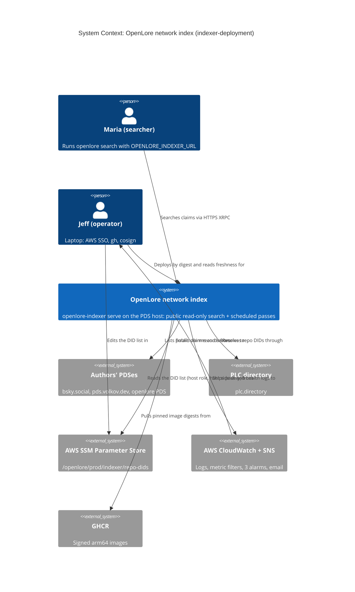
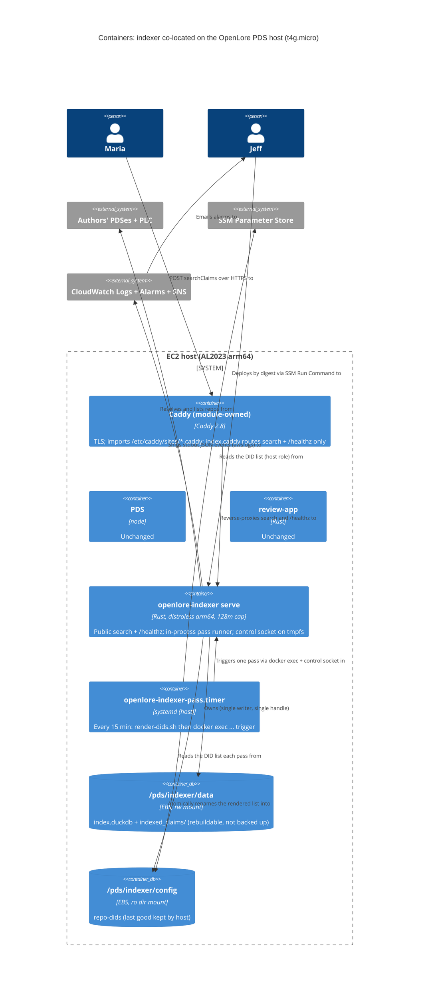
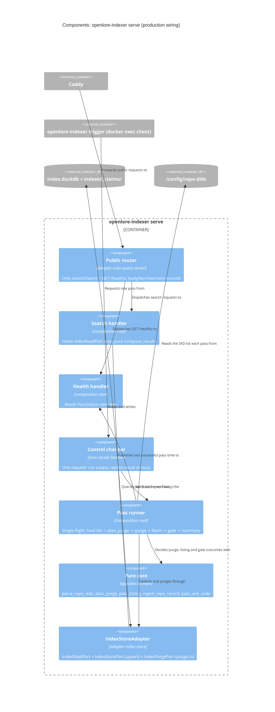

# Architecture Design: indexer-deployment

> **Status: IMPLEMENTED (not yet deployed)** (delivered 2026-10-07, steps 01-01..03-03). Copied from
> `docs/feature/indexer-deployment/design/` at finalize; history and the go-live sequence in
> `docs/evolution/indexer-deployment-evolution.md`. DELIVER reversed ADR-083 §4: a per-IP rate limit
> (10/s, burst 50) is enforced in the binary.

> DESIGN wave (Morgan, Propose mode, run autonomously). Inputs: `../wizard-decisions.md` and `../discuss/*`
> (including "User decisions after DISCUSS"), ADR-023/024/025/065/075/077/078/079, review-app DEVOPS docs and
> `deploy/review-app/*`, `crates/openlore-indexer`, `crates/adapter-index-store`,
> `crates/adapter-xrpc-query-server`. Decisions: **ADR-080..083** and an amendment to **ADR-078**.
> The platform specifics (compose, systemd units, Caddy site, alarms, CI image) belong to DEVOPS. §9 lists
> the contracts DEVOPS must satisfy.

## 1. Drivers and constraints

| Driver | Implication |
|---|---|
| Solo maintainer, time-to-market, low ops cost | No new hosts, services or crates. Reuse the ADR-075 co-location pattern verbatim where it fits. |
| Fault isolation, no regression to PDS or review app (hard) | Container caps, an OOM order (indexer dies first), no `/pds` mount, no credentials, Caddy site via the import hook only |
| Functional Rust (ADR-007) | New decisions (purge plan, pass outcome) are pure functions. Effects stay in adapters and the composition root. |
| Infrastructure-heavy, binary "unchanged" (C-4) | C-4 allows one code change for store sharing. This design needs more: the user's purge decision, the per-pass DID list, the public bounds, robustness, and (user decision 2026-10-06) the review app's DuckDB caps. §8 lists every change, all inside existing crates. **DISCUSS must amend C-4 and I-IXD-2** ("deploys the binary without changing it") to: "the verify-before-index gate, anti-merging and provenance verdict are unchanged". The pure verify core is untouched. |
| Stay on t4g.micro (user decision 2026-10-06; t4g.small rejected) | Cap harder: indexer container 128 MB, DuckDB 48 MB with 1 thread, and the review app's DuckDB capped the same way (§3) |

Team and Conway: one person owns the whole stack. Org boundaries add no constraint.

## 2. Existing system analysis (reuse first)

| Existing | Reused as | Gap found (evidence) |
|---|---|---|
| `openlore-indexer ingest` (ADR-077/078 pass, exit 0/2/3, events) | The pass body, unchanged, run by the new in-process runner | An upsert failure returns **before** `pass_summary` (`run.rs::ingest`), so an alarm keyed on the summary would miss it |
| `openlore-indexer serve` | The long-running process that owns the store | Opens the store **twice** in one process (`IndexerWiring::production` and `serve()`). The doc comment claims an ingest loop that does not exist (R-IXD-4). |
| `parse_repo_dids` (pure) | The per-pass DID file parser | The list is read only at startup from env |
| `IndexStoreAdapter` (one `Arc<Mutex<Connection>>`, per-claim upsert transaction) | The single shared handle | No delete path (needed for purge). No DuckDB memory cap. |
| `XrpcQueryServer` (hyper, one route) | The public router | Unbounded body read, no row cap, no header timeout, no `/healthz` |
| `query_by_contributor` bare-DID match (ADR-079) | The author-match predicate for purge | none |
| Review-app deploy (`deploy.sh`, compose, `app.caddy`, `render-secrets.sh`, `health-timer.sh`) | The template for every DEVOPS artifact, **except** the directory swap in `render-secrets.sh` (ADR-081 assessment) | The review-app design states DuckDB caps of "64 MB, one thread", but **no crate sets them** (a grep of `memory_limit`/`threads` finds nothing). They are fixed in this feature as B11. The review-app compose has no `init`, so SIGTERM to PID 1 is ignored and every stop waits out the full 20 s grace. |

No new crate is justified. Every change extends an existing crate (§8).

## 3. Constraint analysis (quantified)

- **Store contention is the dominant risk.** With two processes, a collision happens on every pass:
  96 a day, 100% of passes. Search (serve) and pass (writer) both need the file, so any two-process
  design pays this on every pass. With one process (ADR-080), contention shrinks to one short
  transaction (one claim's upsert, about milliseconds). That turns a certain failure into a bounded
  wait.
- **Memory (user decision: stay on t4g.micro, cap harder).** The figures below are in MB. The
  estimates come from review-app platform-architecture §6. The PDS figure is still unmeasured (R-5).
  t4g.micro shows MemTotal of about 930 MB, not 1024, and the table uses 930.

  | Consumer | Expected | Pessimistic but realistic | Cap-saturated |
  |---|---|---|---|
  | Kernel, AL2023, SSM agent | 180 | 180 | 180 |
  | dockerd and containerd | 80 | 80 | 80 |
  | Caddy | 40 | 50 | 50 |
  | PDS (node, uncapped) | 200 | 250 | 250 |
  | review-app (DuckDB 48 MB, 1 thread after B11; container cap proposed 192m, was 256m) | 100 | 120 | 192 |
  | indexer (container cap **128m**; DuckDB **48 MB**, 1 thread; base about 25, listings ≤ 1 realistic) | 80 | 100 | 128 |
  | **Sum** | **680** | **780** | **880** |
  | **MemAvailable** (930 − sum, ignoring reclaimable cache, which only helps) | **about 250** | **about 150** | **about 50** |

  - **Gate threshold kept at MemAvailable > 128 MB.** It is measured during the concurrent peak (a
    pass, a review-app scan and a 100-request search burst), not computed. The expected and
    pessimistic cases pass, the pessimistic one narrowly. Lowering the threshold would only hide
    the risk to the uncapped PDS, which is the one workload that must not starve. The indexer's own
    gate is peak RSS ≤ 100 MB (about 28 MB below its cap).
  - **Residual risk.** No cap set fits the cap-saturated column under 128 MB, because the PDS is
    uncapped and module-owned. If every capped workload peaks at once, the kernel OOM order applies:
    indexer `oom_score_adj` 900, then review app 800, then the PDS. The 1 GiB swap absorbs host
    processes. The PDS is protected, and the indexer is sacrificed and restarts.
  - **Contingency.** t4g.small (+$6.13/month) is an instance stop/start, which means an **unplanned
    second PDS outage** of a few minutes on top of R-REPLACE. It is **the operator's decision at
    the re-measure gate**, never automatic.
  - One process with one DuckDB instance, instead of two, saves one runtime and one buffer pool.
  - The listings held in memory are bounded to `cap + 1` (ADR-080 §8), so the indexer's figures
    hold at the real DID count. The gate measures a pass at the production DID count.
- **Pass time.** At 12-50 DIDs the worst case is about 13 minutes (ADR-078 §4), which is under the
  15-minute interval. A slow pass makes the next timer slot coalesce (§5.2).
- **Change budget.** The store-sharing fix (ADR-080) is about a third of the binary delta. Purge (a user
  decision) and the public bounds are the rest. None touch the pure verify, anti-merging or provenance
  core (I-IXD-2).

## 4. Decisions (OQ to ADR)

| OQ | Decision | ADR |
|---|---|---|
| OQ-IXD-1 store sharing | `serve` owns the one store handle. The 15-minute host timer runs `openlore-indexer trigger`, which asks `serve` (over a Unix socket) to run one pass in-process and exits with the pass's 0/2/3. Single-flight. A pass holds the store for at most one transaction at a time. | ADR-080 |
| OQ-IXD-2 container shape | One image, **one** long-running container (`serve`). The timer `docker exec`s the `trigger` client into it. No second container. | ADR-080 |
| Purge removed DIDs (user) | Opt-in `OPENLORE_INDEXER_PURGE_UNLISTED=1`. The pure `plan_purge` is the set difference of indexed authors and the loaded non-empty list. A separate `IndexPurgePort` held only by the pass runner. DELETE only in `purge.rs`. Resumable. Skips never delete. | ADR-082, ADR-078 amended |
| Public surface, abuse (OQ-IXD-7) | Search plus `GET /healthz` only, at Caddy and in the binary. Body ≤ 8 KiB, value ≤ 512 B, ≤ 1000 rows, header timeout, connection cap. No per-IP rate limit in v1. | ADR-083 |
| Freshness (OQ-IXD-5) | Operator: CloudWatch Logs (`pass_summary` lines, one laptop command). Public: `last_successful_pass_at` in `/healthz`. Not stored in the index. | ADR-083, §6 |
| DID list from SSM (OQ-IXD-3) | A Standard String parameter. The host renders it to `/pds/indexer/config/repo-dids` before each pass, keeping the last good copy on a read failure. The directory is mounted read-only. New `OPENLORE_INDEXER_REPO_DIDS_FILE` is read and validated each pass. | ADR-081 |
| Memory (OQ-IXD-8), sizing, sequencing | Stay on t4g.micro (user). Indexer container 128m, no swap, `oom_score_adj` 900. DuckDB 48 MB with 1 thread through new variables. The review app's DuckDB is capped the same way (B11). Hard re-measure gate. t4g.small only by operator decision at the gate (an unplanned PDS outage). Rides v1.7.0 and R-REPLACE with no module change. | §3, §9, §10 |
| CLI default (OQ-IXD-6) | Unchanged (user decision) | none |
| Liveness (OQ-IXD-4, user: YES) | Contract in §9: no `pass_summary` for 45 min, or a failing public `/healthz` | §9 |

## 5. C4 diagrams

### 5.1 System context (L1)



### 5.2 Container (L2), on the PDS host



### 5.3 Component (L3), inside `openlore-indexer serve`

Included because the process now has 7 internal components with distinct capabilities.



## 6. Runtime flows

### 6.1 Scheduled pass

```mermaid
sequenceDiagram
  participant T as systemd timer (host)
  participant R as render-dids.sh (host)
  participant C as trigger (docker exec)
  participant S as serve: control + runner
  participant D as index store (one handle)
  T->>R: ExecStartPre
  R->>R: SSM GetParameter -> staging -> rename (on failure keep last good, exit 0)
  T->>C: ExecStart
  C->>S: run one pass
  alt a pass is running
    S-->>C: busy -> exit 0 (coalesced)
  else idle
    S->>S: read + parse /config/repo-dids (refused -> pass_refused, summary exit 2)
    S->>D: indexed_authors(); plan_purge (pure); purge_author per removed DID
    S->>S: fetch phase (bounded fan-out, no store lock)
    S->>D: gate phase: one upsert transaction per claim
    S->>S: pass_summary {pass_id, exit_code, purged_authors, ...} on stdout
    S-->>C: result -> exit 0 / 2 / 3
  end
```

### 6.2 Search during a pass

The search handler and the pass take turns on the store mutex, one operation at a time. The pass runs
on its own OS thread (ADR-080 §6), and the fetch phase holds no lock. The search wait is therefore
bounded by the longest single store operation: one claim's upsert (which can include a DuckDB
automatic checkpoint), one purge step for one author, or the explicit end-of-pass `CHECKPOINT`. The
AC-002.2 timing test runs a search burst that overlaps the end-of-pass checkpoint.

### 6.3 Freshness (US-IXD-005)

- **Operator.** One laptop command (DEVOPS: `deploy/indexer/deploy.sh status`) runs a CloudWatch Logs
  Insights query over the indexer log group. It reports:
  - the last `pass_summary` with `exit_code = 0`: time, age and counts;
  - the `source_skipped` events with the same `pass_id`;
  - the last 8 `exit_code`s;
  - the age of the last `pass_summary` of any kind.

  The logs are the source of truth. They survive restarts and index loss, and need no host shell and
  no binary query surface (AC-005.4). The `stats` verb stays a scaffold and is not used.
- **Public.** `GET /healthz` shows `last_successful_pass_at` (ADR-083).

### 6.4 Deploy and rollback

The container is recreated by digest. Because the container runs with `init: true`, SIGTERM stops the
old process promptly (`stop_grace_period` about 5 s). Without init, a distroless PID 1 ignores
SIGTERM and every stop would cost the whole grace period. Start, open, WAL replay, migrate (a no-op)
and probe take about 2-5 s. Total search downtime is about 10 s or less, against the 30 s budget of
AC-006.3. A pass in progress is abandoned (`trigger` exits 4) and recovers on the next slot. Rollback is the previous digest. There is no schema change, so no restore is needed
(ADR-080).

## 7. Quality attributes (ISO 25010)

| Attribute | Scenario / target | Strategy |
|---|---|---|
| Performance | Search ≤ 1 s p95, including during a pass | One process. A pass holds the store for at most one transaction. Row cap 1000. Executor never blocked by the pass (ADR-080 §6). |
| Reliability: fault tolerance | One PDS down never fails the pass | Unchanged ADR-078 isolation |
| Reliability: recoverability | Crash or kill mid-pass or mid-purge, a panic, a poisoned store | Per-claim transactions, resumable purge, rebuildable index, `restart: unless-stopped`. `catch_unwind` per pass. Exit on an unusable store. `/healthz` 503 and search 500 instead of a false green (ADR-080 §7). |
| Reliability: liveness | Stuck pass, dead timer, stale DID list | 25-minute pass deadline. A3 covers no `pass_summary` in 45 min, a failing `/healthz`, and a DID list stale for more than 2 h. |
| Reliability: availability | 99% monthly, ≤ 30 s per deploy | One container, readiness through `/healthz`, automatic rollback |
| Security: integrity | No public request can change the index | Two-layer route allowlist. Search handler holds the read port only. Control channel is a Unix socket. |
| Security: confidentiality and isolation | No credentials, no `/pds`, read-only root, non-root | ADR-075 container posture. DID list rendered on the host. |
| Security: abuse | 100 requests in 10 s | Caddy body cap. In-process body, value, row, connection and header bounds. Container memory and CPU caps. |
| Maintainability | Solo maintainer | No new crates. Pure `plan_purge`. Every new rule enforced by check-arch. |
| Observability | 3 alarm conditions, freshness in ≤ 10 s | One `pass_summary` per pass with `exit_code` and `pass_id`. Liveness from summary absence plus the `/healthz` probe. |
| Compatibility: coexistence | PDS and review app unaffected | OOM order (indexer 900, review 800, PDS default), indexer cap 128m, DuckDB 48 MB with 1 thread in both apps, CPU cap, re-measure gate |
| Portability | Local dev unchanged | Control socket and purge are opt-in. `ingest` verb unchanged. The control channel is compiled only on Unix. |

## 8. Binary changes required (complete list; for DISTILL and DELIVER)

All changes are in existing crates. There is **no schema migration and no lexicon change**.

| # | Change | Crate | ADR |
|---|---|---|---|
| B1 | One store handle per process, shared by probe, search and pass runner (remove the second open in `serve()`) | openlore-indexer | 080 |
| B2 | Pass runner inside `serve`: single-flight, reuses the ingest pass, publishes a `PassStatus` view | openlore-indexer | 080 |
| B3 | Control channel (Unix socket, `OPENLORE_INDEXER_CONTROL_SOCKET`, opt-in, Unix only) and the `trigger` verb (exit 0/2/3, busy → 0, unreachable → 4). `trigger` is dispatched **before** config parsing, the probe gauntlet and any store open, and reads only the socket variable. | openlore-indexer | 080 §9 |
| B4 | Every pass emits exactly one `pass_summary` with `exit_code` and `pass_id`, including exit-2 endings (upsert, purge, refused list) | openlore-indexer | 080, 078 amended |
| B5 | `OPENLORE_INDEXER_REPO_DIDS_FILE`, read and parsed each pass. Mutually exclusive with `OPENLORE_INDEXER_REPO_DIDS`. A bad list refuses passes, never `serve`. | openlore-indexer (config) | 081 |
| B6 | Pure `plan_purge`, plus `IndexPurgePort` (`indexed_authors`, `purge_author`) implemented in `adapter-index-store/src/purge.rs`. Opt-in `OPENLORE_INDEXER_PURGE_UNLISTED`. | appview-domain, ports, adapter-index-store, openlore-indexer | 082 |
| B7 | Read/write port split: `IndexReadPort` (queries) separate from `IndexStorePort` (probe, upsert). The search handler holds only `IndexReadPort`. | ports, adapter-index-store, openlore-indexer | 082, 083 (principle 12) |
| B8 | Public bounds (body 8 KiB, value 512 B, rows 1000 via SQL `LIMIT`, header timeout, connection cap) and `GET /healthz` | adapter-xrpc-query-server, adapter-index-store, openlore-indexer | 083 |
| B9 | DuckDB caps: `OPENLORE_INDEXER_DUCKDB_MEMORY_LIMIT_MB` (16..=1024; production **48**) and `OPENLORE_INDEXER_DUCKDB_THREADS` (1..=4; production **1**), applied at open. The probe reads both settings back and refuses when they do not match (Earned Trust: the settings are honored). | adapter-index-store, openlore-indexer (config) | §3 |
| B10 | Fix the `serve` and `main.rs` doc comments (R-IXD-4) | openlore-indexer | 080 |
| B11 | **Review app DuckDB caps (user decision, in scope)**: `memory_limit` 48 MB and `threads` 1, from review-app config with the same read-back probe. Today the documented "64 MB, one thread" is not set anywhere. | adapter-review-store, openlore-review-app | §3 |
| B12 | Robustness: `catch_unwind` per pass (gives exit 2 and frees the single-flight slot). An unusable or poisoned store makes `serve` exit 2. Search returns 500 on a store error (not an empty 200). `/healthz` returns 503 on an unusable store. `QueryHandler` becomes fallible. | openlore-indexer, adapter-xrpc-query-server, adapter-index-store | 080 §7, 083 |
| B13 | Pass execution: a **dedicated OS thread** with its own runtime (mandated). The gate consumes each DID as the ordered fetch stream yields it (≤ cap + 1 listings held). Author keys cached per author per pass. A 25-minute pass deadline (`OPENLORE_INDEXER_PASS_DEADLINE_SECS`, production 1500) gives exit 2. | openlore-indexer | 080 §6, §8 |
| B14 | An explicit DuckDB `CHECKPOINT` at the end of every pass, included in the AC-002.2 timing test | adapter-index-store (a method on the write port), openlore-indexer | 080 §6 |
| B15 | `repo_dids_age_secs` (the DID file's mtime age) in each pass's `indexer.config.loaded` | openlore-indexer | 081 |

### Contract shapes (principle 12, for the crafter)

| Function / port | Shape | Universe | Assertion mechanism |
|---|---|---|---|
| `parse_repo_dids` (existing) | pure-function | n/a | Existing PBT (CORE-9) |
| `plan_purge(list, indexed_authors)` | pure-function | n/a | PBT: the result never intersects the list. An empty list → `Suppressed`. A result ⊆ indexed. |
| `pass_exit_code` (extended with refused, purge failure) | pure-function | n/a | PBT over pass outcomes. 2 takes precedence over 3. |
| `IndexPurgePort::purge_author` | bounded-change | Every row of `indexed_claims`, `indexed_claim_evidence`, `indexed_claim_references`, and every artifact file | State-delta PBT, like `atomic_upsert_properties`: only the target's rows and its rows' `signed_record_path` files change, including a segment-colliding neighbour DID. Neighbours are byte-identical, including references to purged CIDs. |
| `IndexReadPort` queries | unbounded-preservation (read-only) | The whole store | Snapshot before equals snapshot after. The handler is typed so it cannot reach a write method. |
| Pass runner (one pass) | bounded-change | Store, plus `PassStatus` | Upserts are limited to listed DIDs' admitted claims, purges to unlisted authors. AT plus PBT. |
| `/healthz` handler | pure read of the `PassStatus` view | n/a | Read-only view type (no setter reachable) |
| Control channel | effect (driving adapter) | Runner state | AT: busy and coalesced, unreachable → 4 |

## 9. Contracts DEVOPS must satisfy (platform details are DEVOPS's)

1. **Image**: one CI-built, cosign-signed, linux/arm64 image of `openlore-indexer` on
   `gcr.io/distroless/cc-debian12`, pinned by digest, mirroring the review-app pipeline.
2. **Compose** (`/pds/indexer/compose.yaml`, its own project, on `pds_default`, no published port):
   - one service with `command: ["serve"]`, `restart: unless-stopped`, **`init: true`**,
     `stop_grace_period: 5s`;
   - user 65532, `read_only: true`, `cap_drop: [ALL]`, `no-new-privileges`;
   - tmpfs `/tmp` (the control socket lives there);
   - mounts: **only** `/pds/indexer/data:/data` (rw) and `/pds/indexer/config:/config:ro` (a
     **directory** mount);
   - `mem_limit` = `memswap_limit` = **128m**, `oom_score_adj: 900`, CPU cap ≤ 0.5;
   - env: `OPENLORE_INDEXER_INDEX_PATH=/data/index.duckdb`, `OPENLORE_INDEXER_LISTEN_ADDR=0.0.0.0:8080`,
     `OPENLORE_INDEXER_REPO_DIDS_FILE=/config/repo-dids`, `OPENLORE_INDEXER_CONTROL_SOCKET=/tmp/openlore-indexer.sock`,
     `OPENLORE_INDEXER_PURGE_UNLISTED=1`, `OPENLORE_INDEXER_DUCKDB_MEMORY_LIMIT_MB=48`,
     `OPENLORE_INDEXER_DUCKDB_THREADS=1`, `OPENLORE_INDEXER_PASS_DEADLINE_SECS=1500`, concurrency 4, 30 s;
   - review-app compose changes in the same release: `init: true`, DuckDB 48 MB with 1 thread
     (through B11's config), and `mem_limit` proposed down from 256m to 192m (its measured peak of
     71 MB × 1.5 still fits), confirmed at the gate;
   - awslogs to its own log group.
3. **Timer**: `openlore-indexer-pass.timer`, every 15 min, `Persistent=true`. Its oneshot service:
   - `ExecStartPre=render-dids.sh`. It never fails the unit and keeps the last good list. It writes
     a staging **file** in the same directory, sets `chmod 0444`, and renames the **file**. It must
     **never swap the directory** (ADR-081: the container pins the directory inode). It touches
     `.rendered-at` on success and ships `indexer.dids.render_failed` to the indexer log group on
     failure;
   - `ExecStart=docker exec <indexer> openlore-indexer trigger`;
   - `TimeoutStartSec` ≥ 30 min.

   `deploy.sh` reinstalls the units, so they survive replacement and redeploy (AC-002.5).
4. **Caddy**: `index.caddy` installed through the v1.7.0 import hook, with stock directives only. It
   proxies `POST /xrpc/org.openlore.appview.searchClaims` and `GET /healthz`, refuses everything else,
   sets `request_body max_size 8KB`, `header -Server` and a 503 `handle_errors`.
5. **SSM, IAM, logs and metric filters** (OpenLore environment; creates only, shown by `check-plan.sh`):
   - a Standard String `/openlore/prod/indexer/repo-dids`;
   - in the **prod environment root**, which owns log groups (as for the review app): the log group
     `/openlore/prod/indexer`, with retention as for the review app;
   - in the **bootstrap stack**, a new `deploy/tofu/bootstrap/indexer-iam.tf` mirroring
     `review-app-iam.tf`. It adds an inline policy on `openlore-pds-host-prod` with:
     - `ssm:GetParameter` on `parameter/openlore/prod/indexer` and `/*`;
     - `logs:CreateLogStream`, `logs:PutLogEvents` and `logs:DescribeLogStreams` on
       `log-group:/openlore/prod/indexer:*`.

     These grants serve dockerd's awslogs driver, `render-dids.sh` and the health timer. They add
     no `CreateLogGroup`, no `PutMetricData` and no SSM write;
   - metric filters on that log group, one per alarm input:
     - `pass_summary` with `exit_code = 3`;
     - `pass_summary` with `exit_code = 2`;
     - `health.startup.refused` or `indexer.store.unusable`;
     - `pass_summary` of any kind (the heartbeat);
     - the host health line's `indexer_live = 0`.
6. **Alarms** (existing SNS topic, `ok_actions`, an `*_alarms_enabled` toggle):
   - A1: 2 consecutive `pass_summary` with `exit_code = 3`;
   - A2: any `pass_summary` with `exit_code = 2`, **or** `health.startup.refused` or
     `indexer.store.unusable` from the indexer;
   - A3 liveness: no `pass_summary` for 45 min (missing data counts as breaching), **or** the host
     health line reporting `indexer_live = 0`. The host health timer sets `indexer_live = 0` when
     the public `/healthz` probe fails (including a 503 for an unusable store), **or** when the DID
     list is stale, meaning `.rendered-at` is older than 2 h. That folds M5 into A3, so there is
     no extra alarm.

   Each must be test-fired before go-live, at ≤ $0.30/month.
7. **Freshness command**: `deploy.sh status`, a Logs Insights query as in §6.3, answering in ≤ 10 s.
8. **Deploy**: verify the signature and CI provenance, recreate by digest, wait for `GET /healthz` 200
   through Caddy, roll back automatically on not-ready, and keep the PDS `_health` and review-app
   `/healthz` checks before and after.
9. **Re-measure gate (hard)**: a pass at the production DID count, a review-app scan and a 100-request
   search burst run together. To pass, all of these must hold:
   - indexer peak ≤ 100 MB (cap 128m);
   - review-app peak ≤ 128 MB;
   - host `MemAvailable` > 128 MB;
   - swap-in about 0;
   - the PDS at 200 throughout;
   - DuckDB settings read back as 48 MB and 1 thread in both apps;
   - 24 h of `CPUCreditBalance` not trending down.

   On a failure, first tighten (the indexer's concurrency, the review app's scan limit). Moving to
   t4g.small is the **operator's decision** and means an unplanned stop/start, a second PDS outage
   of a few minutes (§3).
10. **Sequencing**: no module change and no second replacement. Order: v1.7.0, then R-REPLACE once,
    then the review app and the indexer in either order. Add the indexer to the replacement runbook's
    "redeploy apps" step.

### External integrations: contract test annotation

The external integrations are PLC directory (DID resolution), authors' PDSes
(`com.atproto.repo.listRecords`), and AWS SSM (host script only). The first two are already covered by
hermetic fakes driven through the ADR-078 lie catalogue. Contract tests are recommended for the PLC
directory and the PDS `listRecords` APIs: consumer-driven recorded contracts in CI to catch upstream
drift before production. The existing real-PDS Pact gap is tracked in the release-pipeline deferrals.
SSM is exercised by the deploy smoke test, not by contract tests.

## 10. Risks

| ID | Risk | Mitigation |
|---|---|---|
| R-IXD-D1 | A pass inside `serve` shares fate with search, so a deploy abandons a pass | Idempotent upserts, resumable purge, next slot in ≤ 15 min, liveness alarm at 45 min |
| R-IXD-D2 | A list replaced by mistake purges the authors it drops | The index is a cache. Restoring the list restores them on the next pass. `author_purged` is logged per DID. |
| R-IXD-D3 | The DuckDB FK quirk makes a one-transaction purge fail | Purge is specified as resumable, not atomic. A real-DuckDB adapter test decides the transaction split. |
| R-IXD-D4 | The review-app DuckDB caps ("64 MB, 1 thread") are documented but not implemented | Fixed in scope (B11: 48 MB, 1 thread, read-back probe) |
| R-IXD-D5 | Memory on t4g.micro: the cap-saturated case leaves about 50 MB, below the 128 MB gate, because the PDS is uncapped (§3) | Caps (indexer 128m, review app 192m, DuckDB 48 MB with 1 thread), OOM order (PDS last), hard measured gate. t4g.small only by operator decision (an unplanned PDS outage). |
| R-IXD-D8 | `render-secrets.sh` swaps a directory, so the running review app keeps the old inode | Not broken today (secrets are read at startup only, and deploy restarts the container). Documented constraint: rotating requires a restart. Recommended: a per-file rename (ADR-081 assessment). |
| R-IXD-D9 | A two-transaction purge exposes a brief window with no references for a removed author | Accepted. One transaction long, and only for claims about to disappear (ADR-082 §6). |
| R-IXD-D6 | The truncation at 1000 rows is invisible to the client | Logged. Far above realistic results at under 50 authors. Pagination deferred. |
| R-IXD-D7 | `docker exec` depends on the container name | DEVOPS pins `container_name` or resolves the container by compose label, as `health-timer.sh` does |

## 11. Architecture enforcement (check-arch deltas: specified, not implemented)

Style: hexagonal / ports-and-adapters within the modular monolith (unchanged). Tool: `cargo xtask
check-arch` (syn-based source scans, plus existing workspace dependency rules).

| New rule | Specification |
|---|---|
| `index_store_delete_only_in_purge` | In `crates/adapter-index-store/src`, any SQL literal containing `DELETE`, `DROP` or `TRUNCATE` is a finding unless (a) the file name contains `purge`, or (b) the literal is exactly one of the two upsert child clears (`DELETE FROM indexed_claim_evidence WHERE cid = ?`, `DELETE FROM indexed_claim_references WHERE referencing_cid = ?`). Mirrors `classify_review_store_sql_literal`. Pure classifier, unit-tested with lib.rs and purge.rs cases. |
| `index_purge_only_in_pass_runner` | The tokens `IndexPurgePort`, `purge_author` and `plan_purge` appear in `crates/openlore-indexer/src` only in the pass-runner module (and the composition root wiring line that constructs it). Token scan, like `classify_forbidden_tokens`. |
| `indexer_search_handler_read_only` | The search-handler module of `openlore-indexer` must not name `IndexStorePort`, `upsert`, `IndexPurgePort` or `purge`. It names `IndexReadPort` only. |
| Existing `no_cross_table_join_elides_author` | Unchanged. The purge SQL and the `indexed_authors` SELECT must project `author_did`, so they pass naturally. |
| Existing `indexer_holds_no_signing_or_local_store` | Unchanged. No new dependencies. |

Probe self-application: `check-probes` must see a `probe()` on the new `IndexPurgePort` implementation.
That probe checks the schema version (shared arm) and that `indexed_authors()` round-trips on a fresh
store. The control channel's probe (a socket connect round-trip) runs at the composition root before
ready.
