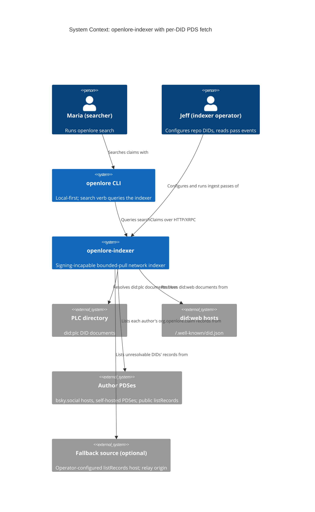
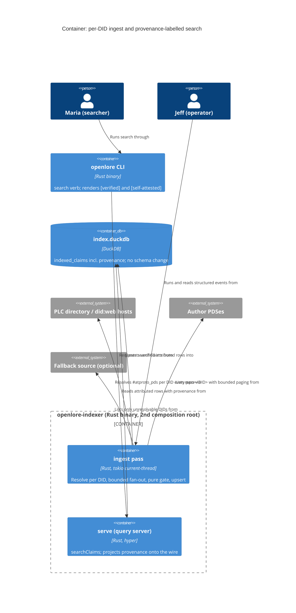
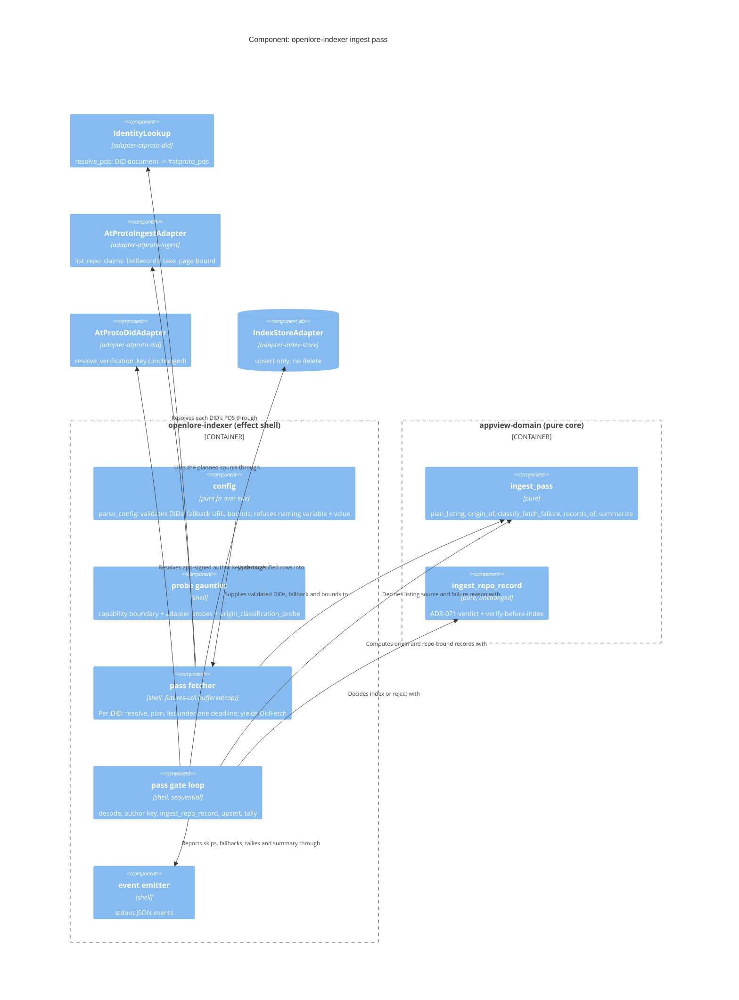

# Architecture design: indexer-per-did-pds-fetch

> **Status: IMPLEMENTED** (delivered 2026-10-05, steps 01-01..02-04). Copied from
> `docs/feature/indexer-per-did-pds-fetch/design/` at finalize; history in
> `docs/evolution/indexer-per-did-pds-fetch-evolution.md`.

- **Wave**: DESIGN (Morgan, propose mode, autonomous). **Date**: 2026-10-05.
- **Style**: unchanged. Modular monolith, ports and adapters, functional Rust (ADR-007).
  This is an in-place extension of the SECOND composition root (`openlore-indexer`). It adds
  **zero crates** and **zero schema changes**.
- **ADRs**: ADR-077 (per-DID source resolution, fallback is always relay origin), ADR-078
  (per-DID fault isolation, bounded fan-out, pass observability), ADR-079 (search wire
  provenance). They amend ADR-024 (source discovery, Earned-Trust item 1) and ADR-071 §4
  (indexer origin bullet).

## 1. Problem in one paragraph

`ingest` lists every configured repo DID from one `OPENLORE_INDEXER_SOURCE_URL`
(`run.rs:459-471`). The origin check (`origin_for`, `run.rs:524`) is correct, but it can only
yield `AuthorPds` for DIDs hosted on that one URL. Every self-attested claim on any other PDS,
including every bsky.social review-app user, is refused as `UnverifiableProvenance`. A second
problem: `return 2` on the first listing error (`run.rs:469`) and on any upsert error makes one
bad source abort the whole pass. That violates ADR-024's per-source isolation.

## 2. Existing-system reuse (what is NOT new)

| Need | Reused as-is | Change |
|---|---|---|
| DID → `#atproto_pds` | `adapter-atproto-did::IdentityLookup` (PLC + `did:web` `/.well-known/did.json`) | Add one lean port method `resolve_pds` (default impl delegates to `resolve_did`; `IdentityLookup` overrides it with a document-only path). See ADR-077. |
| Repo listing, cursor paging, page bound | `RepoListingPort::list_repo_claims`, the pure `take_page` (`MAX_PAGES` = 50) | Status mapping only: HTTP 5xx/429 becomes `Unreachable` (it was `BadResponse`). |
| Origin rule | `claim_domain::RecordOrigin::of` (exact base-URL match) | Called only from the new pure `origin_of(&ListingSource, fetched_from)`. The fallback arm never compares URLs. |
| Verdict | `appview_domain::ingest_repo_record`, `provenance_verdict`, `verify` | **Unchanged.** |
| Store | `IndexStorePort` (`upsert` and queries only; there is **no delete method**) | Unchanged. "Skipping never deletes" holds by construction. |
| `provenance` column | `indexed_claims.provenance` (ADR-071 migration) | Unchanged. It is now projected onto the wire. |
| Events | `indexer.ingest.verified` / `.rejected` (stdout JSON, WD-105) | Additive: `source_skipped`, `source_fallback`, `pass_summary`, `config.loaded`. A new `by_reason.foreign_repo` key. |
| Startup gate | wire → probe → use; `health.startup.refused` + exit 2 | Config validation refuses through the same event. One pure in-process probe is added. |

## 3. C4 Level 1: System Context



## 4. C4 Level 2: Container



## 5. C4 Level 3: Component view of one ingest pass



## 6. The pass, as a pipeline

```
validated config
  └─ repo_dids ──(fetch phase: buffered(max_concurrent_fetches), config order kept)──▶
       per DID, under ONE deadline = now + per_did_time_budget:
         resolve_pds(did)                          [effect, stage = resolving]
         plan_listing(resolution, fallback)        [pure]  -> List(ListingSource) | Skip(DidUnresolvable)
         list_repo_claims(source.base(), did)      [effect, stage = listing]
         -> DidFetch::Read{did, source, listing} | DidFetch::Skipped{did, reason, fallback_used, pds_url, fallback_failure}
  └─ gate phase (sequential, config order):
       Read:    records_of(did, listing) -> (own records, foreign_count)       [pure]
                origin = origin_of(&source, &listing.fetched_from)              [pure]
                per record: author_key [effect] -> ingest_repo_record [pure] -> upsert [effect]
       Skipped: emit source_skipped (Read via Fallback also emits source_fallback)
  └─ summarize(outcomes) -> PassSummary {configured, own_pds, fallback, skipped}  [pure]
     emit verified, rejected, pass_summary (ALWAYS before exiting)
     exit pass_exit_code(summary)  [pure]: 3 if configured ≥ 1 and own_pds + fallback == 0, else 0
```

Exit codes for `ingest`:
- **0**: the pass completed and at least one DID was listed, or no DIDs are configured.
- **2**: startup refusal (config or probe), runtime construction failure, or an index-store
  upsert failure.
- **3**: the pass completed but **every** configured DID was skipped. This is a total source
  outage, and `pass_summary` is emitted first.

A partial skip still exits 0. A DID read through the fallback counts as listed.

There are two phases, so the outbound request count stays within the cap. While the fetch
phase runs, each in-flight DID unit has at most one outstanding request. The gate phase resolves
author keys one at a time, after every fetch has finished. The output order is deterministic
(the configured DID order), which keeps tests and the NFR-3 regression comparison stable.

## 7. Decisions per open question

| # | Question | Decision | ADR |
|---|---|---|---|
| 1 | Per-DID source | Resolve each DID every pass (`resolve_pds`). List from the resolved PDS. `origin_of(OwnPds(endpoint), fetched_from)` = `RecordOrigin::of(...)` (exact match is still recomputed, so an adapter cannot lie about where it listed). `OPENLORE_INDEXER_SOURCE_URL` keeps its name and becomes the optional **fallback**. `origin_of(Fallback(_), _)` = `Relay` **with no URL comparison**, which settles OQ-IPF-3 at the type level. | ADR-077 |
| 2 | Fault isolation | A failure in one DID's unit becomes `DidFetch::Skipped{reason}`. It never ends the pass early. Reasons: `did_unresolvable`, `pds_unreachable`, `pds_timeout`, `listing_failed`, `pds_address_refused`. A completed pass exits **0** when at least one DID was listed. It exits **3** when every configured DID was skipped (user decision 2026-10-05; `pass_summary` is emitted first). Exit 2 is kept for startup refusal (config/probe), a runtime build failure, and an **index-store upsert failure**. That last one is a local fault, not a source fault (OQ-IPF-5), and the rows upserted before it stay committed. The store has no delete, so a skip cannot remove rows. | ADR-078 |
| 3 | Bounded fan-out | `futures-util` `stream::iter(..).buffered(cap)` on the existing current-thread runtime. There is no spawn, no `'static`, and no new crate in the tree. Defaults: `max_concurrent_fetches` = **4** (`OPENLORE_INDEXER_MAX_CONCURRENT_FETCHES`, 1..=16). `per_did_time_budget` = **30 s** (`OPENLORE_INDEXER_PER_DID_TIMEOUT_SECS`, 1..=600). The budget is one deadline (`tokio::time::timeout_at`) covering resolve + plan + list, including the fallback. The page bound (`MAX_PAGES` 50 × 100) is unchanged. | ADR-078 |
| 4 | Startup probe / config | `parse_config` is pure and returns `Result<IndexerConfig, ConfigError>`. A malformed DID entry, an unsupported DID method, a malformed fallback URL, or an out-of-range bound **refuses start**: `health.startup.refused{adapter:"config", reason:"IndexerConfigInvalid", structured:{variable, value}}` and exit 2. An empty DID list or an absent fallback is **reported** (`indexer.config.loaded`), not refused. There is **no startup network probe** of PLC, PDSes or the fallback: these are per-pass, per-DID runtime conditions, and refusing to start on a third-party outage would turn a per-source fault into a total outage. The `IngestSourcePort` probe stops refusing an empty source. A pure in-process `origin_classification_probe` is added (Earned Trust for the origin rule itself). | ADR-077, ADR-078 |
| 5 | `did:web` | **Supported.** `IdentityLookup::did_document` already resolves `did:web:<host>` from `https://<host>/.well-known/did.json`. This is the hostname-only form, which is the only `did:web` form ATProto allows. Any other method (`did:key`, ...) is refused at startup as a config error, because it cannot name an ATProto repo. A `did:web` host that does not answer is a runtime `did_unresolvable` and is eligible for the fallback. | ADR-077 |
| 6 | Search provenance | `SearchResultDto.provenance: Option<String>`. The server always sets it (`"app-signed"` / `"self-attested"`). Absent is read as app-signed (old servers, ADR-071 §5). An unknown token makes the CLI drop that row and print a stderr notice: we never misstate. The CLI renders `[verified] [self-attested]` for self-attested rows only. App-signed rows stay byte-identical. | ADR-079 |
| 7 | Observability | Stdout JSON, `indexer.ingest.*` namespace, DIDs/URLs/counts/reasons only (WD-105). The new events are `source_skipped`, `source_fallback`, `pass_summary` and `config.loaded`. See data-models.md §5. `stats` is **not** extended (out of scope, and it is still a scaffold). | ADR-078 |
| 9 | SSRF guard (user decision 2026-10-05) | Outbound DID-document, PDS and fallback fetches go through an **address-guarded client**, built with an `AddressPolicy`. Refused ranges: 0.0.0.0/8, 127.0.0.0/8, 10.0.0.0/8, 172.16.0.0/12, 192.168.0.0/16, 169.254.0.0/16, `::`, `::1`, fc00::/7, fe80::/10 (IPv4-mapped IPv6 is unwrapped first). The URL must be **https only**. The check runs **after DNS resolution**, inside a custom `reqwest` DNS resolver that returns only admissible addresses, so the connection goes to the checked IP and DNS rebinding cannot swap it in between. IP-literal hosts never reach a resolver, so they are checked by a pure pre-check. Redirects are disabled. A refused resolved PDS skips the DID with **`pds_address_refused`**. It is not fallback-eligible, because the DID did resolve (AC-003.2). The fallback URL is checked at startup (scheme, literal IP: refuse start) and at runtime (DNS: `fallback_failure: pds_address_refused`). Test-only override `OPENLORE_INDEXER_ALLOW_LOOPBACK_HTTP=1` admits `http` and loopback (only) for the local fakes. A release build refuses to start when it is set. This mirrors `REVIEW_APP_ALLOW_LOOPBACK_HTTP` / `BuildProfile` in `openlore-review-app/src/config.rs`. | ADR-077 |
| 8 | Single-source regression | Holds by analysis (wave-decisions.md §Regression). For a DID hosted on the source URL, the resolved PDS equals the old source, so it gets the same records and the same origin. When PLC is down, the fallback reproduces the old behaviour (app-signed indexed, self-attested refused). | ADR-077 |

## 8. Quality attributes

| Attribute | Strategy |
|---|---|
| Fault tolerance (ADR-024) | Per-DID `Skipped` arm. Single deadline per DID. No pass-level abort for source faults. Retried next pass because nothing is persisted about a skip. |
| Provenance honesty (ADR-071) | `ListingSource` ADT: only `OwnPds(endpoint)` can ever yield `AuthorPds`, and only on exact match. The fallback is structurally `Relay`. A check_arch rule bans `RecordOrigin::of` / `::AuthorPds` in the indexer root. A startup probe re-proves the classification. |
| Performance / third-party load | Cap 4, page bound unchanged. Worst-case pass ≈ ⌈N/4⌉ × 30 s (N = 50 → 6.5 min). Typical is seconds. Two PLC requests per DID drop to one (`resolve_pds` skips the handle back-check). |
| Security | Read-only ports only (I-AV-5 unchanged). SSRF guard (§7 row 9): https only; loopback, private, link-local and unique-local addresses are refused after DNS resolution by connecting only to checked IPs; no redirects. Refusal → `pds_address_refused`. A test-only loopback override is refused in release builds. |
| Testability | Every decision (plan, origin, classification, repo binding, summary, config) is a pure total function. Fakes drive the shell. |
| Maintainability | The shell is about 150 lines of orchestration. No new crate or port trait, only a default-implemented method. |

## 9. Earned Trust: catalogued substrate lies (for DISTILL)

| Dependency | Lie | Designed response |
|---|---|---|
| Author PDS | returns records of another repo | `records_of` filters them out and counts `foreign_repo` (FR-4) |
| Author PDS | never-ending or repeated cursor | `take_page` bound (existing) |
| Author PDS | hangs / slowloris | per-DID deadline → `pds_timeout` |
| Author PDS | HTTP 502/503/429 | `Unreachable` → `pds_unreachable` |
| Author PDS | 200 with non-JSON or missing `records` | `BadResponse` → `listing_failed` |
| PLC / did:web | 5xx, timeout, 404, doc `id` ≠ DID, no `#atproto_pds` | `did_unresolvable` (fallback-eligible) |
| DID document | PDS endpoint is `http://`, or an IP literal in a refused range (`169.254.169.254`, `10.x`, `::1`, ...) | pure pre-check → `pds_address_refused` (no fallback) |
| DNS | public hostname resolves (or rebinds) to a private/loopback address | guarded resolver drops it, so there is no connect → `pds_address_refused` |
| Author PDS | 3xx redirect to an internal host | redirects disabled → `listing_failed` |
| Operator | sets `OPENLORE_INDEXER_ALLOW_LOOPBACK_HTTP=1` on a release build | refuse start (`IndexerConfigInvalid`) |
| All sources | every DID skipped | `pass_summary` emitted, then exit 3 |
| Fallback | URL string equals some DID's resolved PDS | irrelevant: `Fallback` is always `Relay`; a resolved DID never uses the fallback |
| Listing adapter | reports a `fetched_from` it did not use | `origin_of(OwnPds)` still compares it with the resolved endpoint |
| Origin code | a future refactor collapses the arms | `origin_classification_probe` refuses start; the check_arch token ban catches the bypass |

## 10. Handoff notes

- **To DISTILL (acceptance-designer)**: 21 UAT scenarios map onto the pipeline above. Use the
  event shapes in data-models.md §5 as assertions. One DISCUSS inconsistency is resolved: a DID
  **read via the fallback** emits `source_fallback`, not `source_skipped`. `source_skipped` with
  `fallback_used: true` is only for a fallback that also failed (US-IPF-003 pitch line versus
  AC-003.3/summary arithmetic).
- **New AC notes for DISTILL** (user decisions 2026-10-05). These are recorded in
  wave-decisions.md §"AC additions".
  - AC-002.8: total outage exits 3, after `pass_summary`.
  - AC-002.9: a refused PDS address gives `pds_address_refused`, with no connection made and no
    fallback.
  - AC-004.5: the loopback override is refused in release builds.
  - AC-003.4: a fallback hostname that resolves to a private address skips the affected DIDs
    with `fallback_failure: pds_address_refused`.
  The ATs run debug builds with `OPENLORE_INDEXER_ALLOW_LOOPBACK_HTTP=1` against the 127.0.0.1
  fakes. The refusal ATs therefore need a fake whose advertised endpoint is a *private
  non-loopback* literal (for example `http://10.0.0.1`), or the override switched off.
- **To DEVOPS (platform-architect)**: no new env var is required. Two optional tuning vars and
  one optional semantic change (`OPENLORE_INDEXER_SOURCE_URL` is now a fallback). Route the four
  new events. **Contract tests recommended** for the ATProto `com.atproto.repo.listRecords`
  surface on bsky.social PDS hosts and for PLC directory DID-document shape. Use recorded-fixture
  consumer contracts (Pact-style, or the existing `test-support` fake PDS/PLC) to catch breaking
  changes before production.
- **Development paradigm**: functional (ADR-007). `@nw-functional-software-crafter`.
