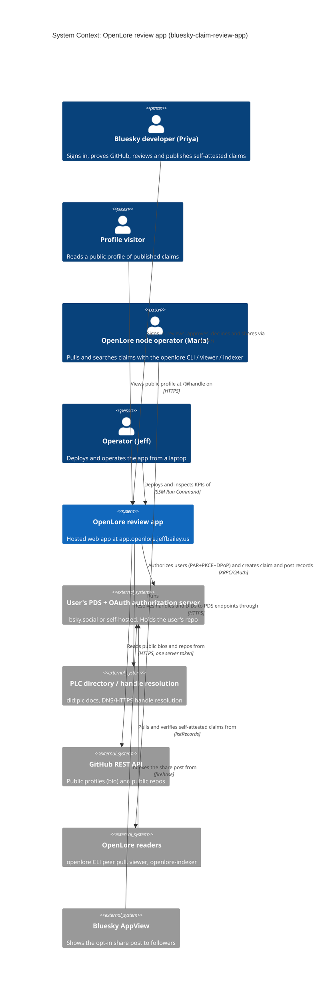
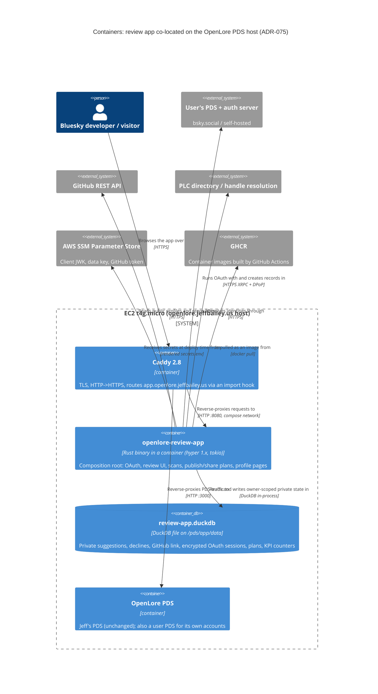
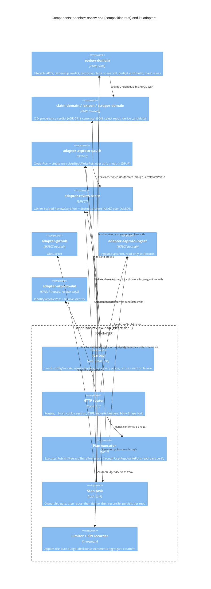

# Architecture Design: bluesky-claim-review-app

> DESIGN wave, 2026-10-04, Morgan (nw-solution-architect), propose mode (autonomous).
> Inputs: `../discuss/*` (D-1..D-12, I-BRA-1..8, OD-BRA-1..12), the user's discovery answers of
> 2026-10-04, the brief, and ADR-001..070.
> Decisions: **ADR-071..076**.
> Companion files: `technology-stack.md`, `component-boundaries.md`, `data-models.md`,
> `wave-decisions.md`.

## 1. Drivers and constraints

| Driver | Priority | Consequence for the design |
|---|---|---|
| Time to market | **1** | Reuse the pure cores and read adapters. Use a mature-enough OAuth library rather than hand-rolling one. No new database engine. |
| Low operations cost (solo maintainer) | **1** | Co-locate on the existing PDS host. No queue, no new host, no new DNS. Laptop-applied operations, as today. |
| Privacy and consent invariants (I-BRA-1..8) | **Hard** (they are acceptance criteria) | Each is enforced structurally (types and the port shape), with a check-arch rule and a behavioral probe or test, using the simplest mechanism that makes the violation non-representable. |
| Scale | under 50 users | Single instance, single process, in-process background tasks and in-memory limits. |
| Team | 1 developer + AI agents | One deployable. No Conway conflict. |

Paradigm: functional Rust (ADR-007). The pure cores decide; a thin effect shell executes
**plans**.

Style: the existing modular monolith with ports and adapters (ADR-009). This feature adds a third
composition root (ADR-072).

## 2. Existing-system analysis (reuse first)

| Need | Existing asset | Use |
|---|---|---|
| GitHub public reads (profile with bio, owned repos, repo signals) | `ports::GithubPort` + `adapter-github` (`read_person`, `list_owned_repos`, `harvest_repo`, optional token, rate-limit parsing, probe) | **Reuse.** Extend `PersonProfile` with the numeric `id`. |
| Repo selection (skip forks and archived repos) | `scraper-domain::select_person_repos` | **Reuse** verbatim (BR-3) |
| Signal → candidate (0.25, names its signal) | `scraper-domain::derive_candidates` + the `jobs.yaml` mapping | **Reuse** verbatim (I-SCR-3/4/5) |
| CID, canonicalization, confidence basis points | `claim-domain` (`canonicalize`, `compute_cid`, `Confidence`, ADR-070) | **Reuse.** The rkey is the CID. |
| Lexicon JSON encode | `lexicon` | **Reuse.** Descriptions are updated (ADR-071). |
| Reading a user's published claims (profile page) | `ports::IngestSourcePort` + `adapter-atproto-ingest` (read-only `listRecords`) | **Reuse** for the profile page |
| DID/handle → PDS resolution | `ports::IdentityResolvePort` + `adapter-atproto-did` (verify-only) | **Extend** with resolve-identity (handle ↔ DID ↔ PDS endpoint) |
| Self-retraction rule | `claim-domain` shared helper (ADR-060 D-RF-D3, ADR-008) | **Reuse** |
| Retraction filtering for display | `appview-domain::partition_retracted` | **Reuse** semantics for the profile list |
| HTML rendering | `maud` (pure-core allowlisted) + the vendored htmx 2.0.4 asset (ADR-031) | **Reuse** the pattern and the asset |
| HTTP shell | Hand-rolled hyper 1.x (`adapter-http-viewer`, `adapter-xrpc-query-server`) | **Reuse** the pattern. The `axum` ban stays. |
| Probe contract | `ports::ProbeOutcome`, `xtask check-probes` | **Reuse** for all new adapters |
| Clock | `ClockPort` + `adapter-system-clock` | **Reuse** |
| PDS writes as the user | `adapter-atproto-pds` uses an *app password* | **Not reusable** for OAuth/DPoP. A new create-only port is added (ADR-073). |
| Private multi-tenant state | none | **New** `adapter-review-store` (ADR-074) |
| Review lifecycle, ownership verdict, plans | none | **New** pure `review-domain` |

New crates (4), each justified because no existing alternative exists:

- `review-domain` (pure): the new consent and review bounded context.
- `adapter-atproto-oauth` (effect): no OAuth/DPoP client exists.
- `adapter-review-store` (effect): the multi-tenant private state must not live in the CLI's
  store (ADR-074).
- `openlore-review-app` (binary): the third composition root (ADR-072).

## 3. C4 Level 1: System Context

## 4. C4 Level 2: Containers

Notes:

- The app container mounts only `/pds/app/data` and never `/pds`, so the PLC rotation key in
  `/pds/secrets.env` stays out of reach.
- The DuckDB file sits on a bind mount of the EBS data volume, not on overlayfs. The probe checks
  this.

## 5. C4 Level 3: Components of `openlore-review-app` (5+ components)

## 6. Key flows (behavioural; the crafter owns internals)

### 6.1 Sign-in (US-BRA-001, ADR-073)

1. The user enters a handle. The app resolves handle → DID → PDS → authorization server.
   - If the handle does not resolve, show "We couldn't find that Bluesky handle".
   - If the authorization server is unreachable, show "temporarily unavailable, nothing changed"
     (AC-000.3).
2. PAR with PKCE S256, DPoP and `private_key_jwt`, then redirect to the user's PDS.
3. Callback: the token response's `sub` must equal the DID from step 1 (AC-001.6). On cancel or
   deny, show "No access granted. Nothing changed." and create no session.
4. The token set and DPoP key are encrypted into `oauth_sessions`. A browser session is created
   with a `__Host-` cookie (HttpOnly, Secure, SameSite=Lax), and only the cookie's hash is stored.

### 6.2 Ownership proof and scan (US-BRA-002/003/010, ADR-076)

1. `POST /github/verify` calls `read_person(login)`, then the pure ownership verdict against the
   **session** DID.
   - On `Verified`, store the link with the login, the numeric id and the time.
   - Every failure verdict maps to the exact messages of AC-002.3.
2. `POST /scan` passes the budget gate, then starts a background task. The task's first stage
   re-runs step 1 (I-BRA-4). Only a `VerifiedOwnership` value unlocks `list_owned_repos`.
3. For each selected repo, the task calls `harvest_repo` → `derive_candidates` → reconcile
   against the existing keys. Approved and declined keys are never re-offered (BR-1, BR-2).
   New pending suggestions are persisted **per repo**.
4. A rate-limit floor stops the scan as `rate_limited` with partial results kept and
   `resume_after` set (AC-003.7). The UI polls `/scan/status` with htmx.

### 6.3 Approve and publish (US-BRA-004/005, Plan-value pattern, ADR-071)

1. `POST /suggestions/{id}/preview` (with optional edits) builds a `PublishPlan` with a **pure**
   function. The plan holds:
   - the destination repo DID and PDS (from the session);
   - the collection `org.openlore.claim`;
   - the `UnsignedClaim` (author = bare DID, `composedAt` = now, confidence in basis points);
   - rkey = CID;
   - the exact record JSON;
   - the preview fields, including "not as truth".

   The plan is stored with a 30-minute TTL, and the preview renders **from the plan**.
   **Nothing is written.**
2. `POST /plans/{cid}/confirm` executes **exactly the stored plan**.
   - It calls `create` through `UserRepoWritePort`. An idempotent `RecordAlreadyExists` counts as
     success.
   - It reads the record back via `IngestSourcePort` and checks that the recomputed CID equals
     the rkey (Earned Trust: the PDS may re-encode).
   - Only then does it mark the suggestion `published` with its `at://` URI. On failure, the
     suggestion stays `pending`, no partial record exists, and a retry is offered (AC-004.6).
3. AC-004.4 holds by construction: the preview and the written record come from the same plan
   value.

### 6.4 Decline and undo (US-BRA-006)

This is a single owner-scoped state transition, `pending ⇄ declined`. It makes **no** call to any
write port. The pure transition function has no access to a port, so it cannot express a write
(I-BRA-2).

### 6.5 Profile, share and retract (US-BRA-007/008/011)

- **Profile** (`GET /@{handle}`): resolve handle → DID → PDS, then live `listRecords` via the
  ingest port, then the provenance verdict (ADR-071), then exclude self-retracted claims, then
  render.
  - There is no cache. An unreachable PDS gets an explicit message (AC-007.4).
  - Private state is **never read** on this route: the handler is not given the review-store port,
    which makes it structurally unable to leak pending items (I-BRA-1c).
- **Share**: a pure `SharePostPlan` builds the text and link facet from **published,
  non-retracted** claims read live from the PDS, never from private state.
  - The user edits the text, and on confirm it is created as `app.bsky.feed.post`.
  - "Don't post" or leaving the page simply lets the plan expire.
- **Retract**: a pure `RetractPlan` builds a self-attested claim with `references:[{retracts,
  cid}]`. It is previewed, confirmed and executed like publish. Nothing is ever deleted (I-BRA-8).

### 6.6 Disconnect (US-BRA-012)

1. Confirm.
2. Revoke the OAuth grant (best effort).
3. Run a single-transaction purge of every row with `owner_did = DID`.
4. Clear the cookie.

No PDS call is made (AC-012.3).

## 7. Self-attested provenance across OpenLore readers (US-BRA-009, ADR-071)

| Reader | Change |
|---|---|
| `claim-domain` | `ClaimRecord` ADT plus the pure provenance verdict. The `verify` function is unchanged. |
| `adapter-atproto-pds` peer read | Parses an absent `signature` into `ClaimRecord::SelfAttested` and carries the repo DID from the `at://` URI. Origin = `AuthorPds` (the endpoint was resolved fresh, per ADR-016). |
| `cli peer pull` | Its per-record evaluation calls the provenance verdict. It stores `provenance`. SelfAttribution (WD-40) is unchanged. |
| `adapter-duckdb` | Additive migration: `peer_claims.provenance`; signature columns nullable for self-attested rows. |
| `adapter-atproto-ingest` + `appview-domain::ingest_decision` | <ul><li>`RawRecord` carries `repo_did`, the rkey and `origin`.</li><li>The indexer root computes `origin` by resolving the repo DID's PDS and comparing it with the configured source URL. That URL may be a relay, so `AuthorPds` is never assumed.</li><li>`Unsigned` + bare author + `AuthorPds` origin → `Index` with `provenance=self-attested`.</li><li>A non-matching origin → reject `UnverifiableProvenance`.</li></ul> |
| `adapter-index-store` | Additive `indexed_claims.provenance`. `verified_against` stays NOT NULL and holds the bare DID. |
| Search DTO, `viewer-domain`, `cli` render | The optional `provenance` field drives a `[self-attested]` marker. Absent means app-signed, and the `[verified]` marker is unchanged (AC-009.4). |

## 8. Quality attributes (ISO 25010)

| Attribute | Strategy |
|---|---|
| **Security, confidentiality** (I-BRA-1/2, NFR-BRA-1/2) | <ul><li>`OwnerScope` capability (type), the owner-predicate SQL rule (structure), and the cross-owner probe plus acceptance test (behavior).</li><li>AEAD-encrypted tokens.</li><li>`__Host-` HttpOnly cookies; tokens never reach the browser.</li><li>Log field allowlist: no tokens, bios or suggestion content.</li></ul> |
| **Security, integrity and authorization** (I-BRA-3/7/8) | <ul><li>Plan-value pattern: only a stored, confirmed plan can execute.</li><li>Create-only `UserRepoWritePort` with no delete or update method.</li><li>The destination PDS comes from the session, never from the request.</li><li>Granular scopes when available (ADR-073).</li><li>CSRF synchronizer token on every POST.</li><li>Strict CSP (`default-src 'self'`, no inline script; htmx is vendored), HSTS, `frame-ancestors 'none'`, `nosniff`, `Referrer-Policy: same-origin`.</li></ul> |
| **Security, STRIDE summary** | <ul><li>**Spoofing**: OAuth with the `sub` == resolved-DID pin, and the ownership proof against the session DID.</li><li>**Tampering**: CID == rkey, read-back verify.</li><li>**Repudiation**: writes are in the user's signed repo.</li><li>**Information disclosure**: owner scoping, AEAD, the profile route has no store port.</li><li>**DoS**: per-DID and per-IP budgets, container memory cap.</li><li>**Elevation**: three disjoint composition roots, create-only port.</li></ul> |
| **Performance** (NFR-BRA-4) | <ul><li>Server-rendered HTML + htmx gives feedback in under 100 ms.</li><li>A scan of 10 repos is about 80 GitHub calls, so 60 s at p90 is achievable. Results stream per repo with htmx polling.</li><li>Publish is one `createRecord` plus one read-back, about 2 RTTs, well under 3 s.</li></ul> |
| **Reliability** (NFR-BRA-5/9) | <ul><li>Idempotent publish (content-addressed rkey).</li><li>State changes only after confirmed success.</li><li>Scans are resumable, and interrupted runs are recovered at startup.</li><li>99% monthly availability on a single host. Published claims do not depend on the app.</li></ul> |
| **Maintainability and testability** | <ul><li>Pure `review-domain`, testable without I/O (property tests on the ownership matcher, reconcile, plan → record equality, budget arithmetic).</li><li>Every adapter is behind a port, with fakes in `test-support` (`FakeOAuth`, `FakeUserRepoWrite`, `FakeReviewStore`, plus the existing `FakeGithub` and `FakePds`).</li></ul> |
| **Usability and accessibility** (NFR-BRA-6) | <ul><li>Server-rendered semantic HTML, progressive enhancement (works without JS), keyboard triage (A/E/N/J/K) as a small vendored script.</li><li>WCAG 2.2 AA is checked in DISTILL.</li></ul> |
| **Honesty** (NFR-BRA-7) | <ul><li>Preview texts are pure SSOT constants ("not as truth", the retract path) reused from the I-7/I-8 vocabulary.</li><li>Buckets are display-only and never stored.</li></ul> |
| **Observability** | <ul><li>JSON `tracing` logs with allowlisted fields; the DID appears only as a salted short hash.</li><li>`/healthz` (liveness) and `/readyz` (probes).</li><li>Aggregate KPI counters, read with `openlore-review-app kpi` via SSM.</li><li>`health.startup.refused` events.</li></ul> |
| **Portability** | One static-ish linux/arm64 image. The origin, scopes and limits are configuration. |

## 9. Earned Trust: probes (wire, probe, use)

| Adapter | Probe exercises (fault scenarios) | On failure |
|---|---|---|
| `adapter-review-store` | <ul><li>A transactional write/read/rollback.</li><li>A **cross-owner canary** (a row for A is invisible through scope B).</li><li>An AEAD canary round-trip (wrong data key).</li><li>The DB path is not on overlayfs or tmpfs (`/proc/mounts`), which catches the Docker fsync lie.</li></ul> | Refuse start |
| `adapter-atproto-oauth` | <ul><li>The client JWK loads and an ES256 sign/verify round-trip works.</li><li>The JWKS served equals the loaded public key.</li><li>The DPoP keygen works.</li><li>Soft: the bsky.social authorization-server metadata is reachable.</li></ul> | Refuse start (hard arms); log (soft) |
| `adapter-github` (reused) | The existing arms: reachability, private-target refusal, token mode, rate-header parsing, no token leak | Refuse if the token is rejected |
| `adapter-atproto-ingest` / `-did` (reused) | Existing | Soft |
| Self-probe (startup) | `${app_origin}/oauth/client-metadata.json` is fetchable **through the public origin** and byte-equal to the rendered metadata. This catches a missing Caddy route or DNS problem, which matters because the PDS fetches it. | `/readyz` red, alarm |

## 10. Architecture enforcement

- **Style**: ports and adapters in a modular monolith.
- **Language**: Rust.
- **Tool**: `cargo xtask check-arch` / `check-probes` (the existing ArchUnit analogue), plus
  `cargo deny`.
- **Rules**: listed in `component-boundaries.md` §5, about 6 rule deltas.

## 11. External integrations: contract tests

External integrations that need contract tests (handoff to the platform architect):

- **The user's PDS (XRPC)**: `com.atproto.repo.createRecord` (`org.openlore.claim` with a CID
  rkey, and `app.bsky.feed.post`), `listRecords`, `getRecord`.
  Recommended:
  - consumer-driven contract fixtures (the `pact_consumer` crate, MIT, or recorded-fixture
    contracts in `test-support`) in the CI acceptance stage;
  - a nightly live smoke against the OpenLore PDS and a bsky.social test account.
- **The ATProto OAuth authorization server**: authorization-server metadata, PAR, token (DPoP
  nonce), revocation, and the client-metadata fetch by the PDS.
  Recommended: contract fixtures plus a nightly end-to-end sign-in smoke with a test account.
- **PLC directory / handle resolution**: `did:plc` document shape, `/.well-known/atproto-did`,
  DNS TXT. Recommended: recorded-fixture contracts. The existing real-`z6Mk` DID-document
  fixtures are reused.
- **The GitHub REST API**: `/users/{u}` (`bio` and `id`), `/users/{u}/repos`, and the per-repo
  harvest endpoints. Recommended: extend the existing `FakeGithub` fixtures into contract tests,
  plus a nightly live smoke with the server token.

## 12. Handoff

- **DISTILL** (acceptance designer):
  - the AC map in `component-boundaries.md` §6;
  - the probes in §9;
  - the cross-user privacy property (I-BRA-1) as a `@property`;
  - the plan → record equality (AC-004.4) as a property;
  - the regression guardrail AC-009.4: every existing app-signed test stays green.
- **DEVOPS** (platform architect):
  - ADR-075: the module v1.7.0 import hook, the replacement decision, the image build on
    `ubuntu-24.04-arm`, the SSM deploy command, secrets under `/openlore/prod/review-app/`;
  - the client-JWK rotation runbook;
  - log rotation;
  - a `/readyz` alarm;
  - SPIKE-1..4 (see `wave-decisions.md`).
- **Paradigm**: functional (ADR-007); `@nw-functional-software-crafter`.
