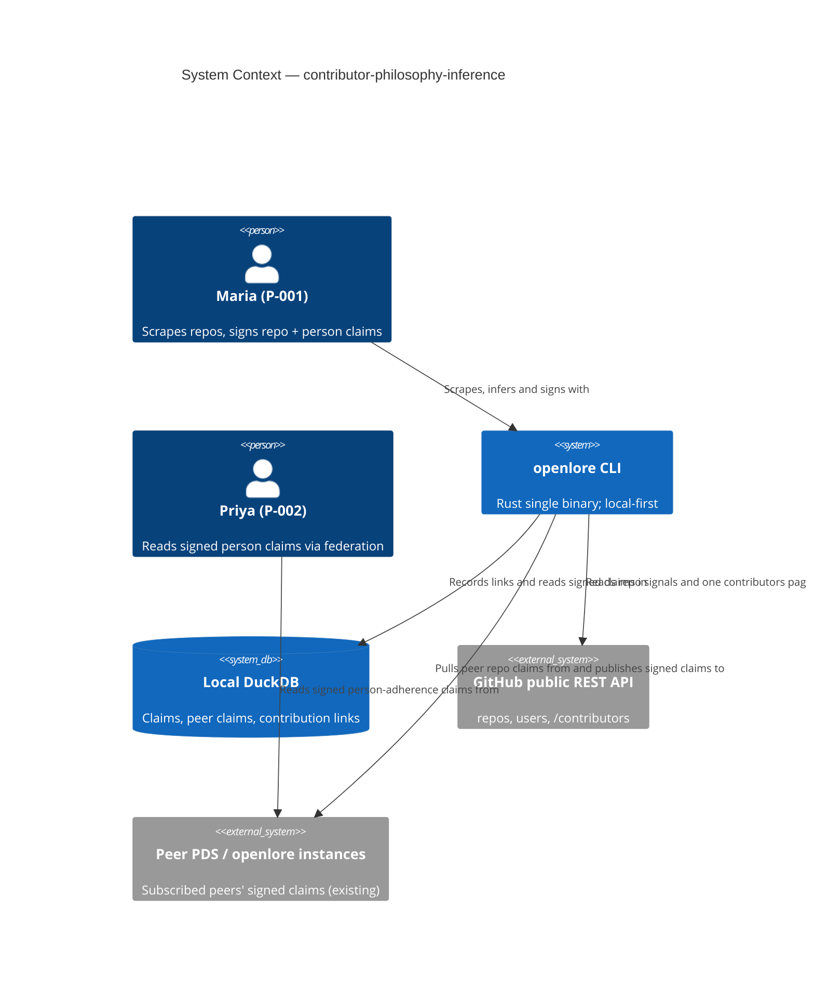
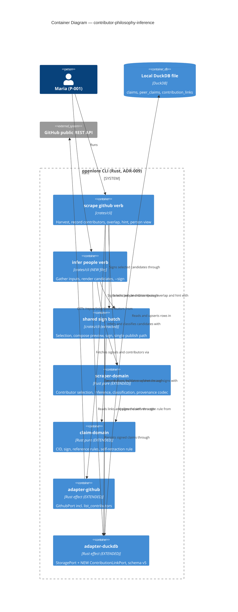
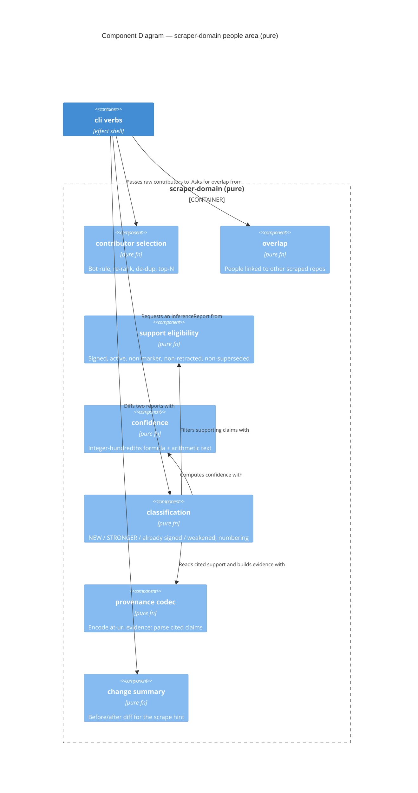

<!-- markdownlint-disable MD024 -->
# Feature Delta: contributor-philosophy-inference

> Wave: **DISCUSS** (lean mode)
> Feature type: **User-facing CLI** (brownfield — extends the shipped `openlore scrape github`
>   pipeline, ADR-017..019; no new binary, no new deployment target).
> Walking skeleton: **Brownfield thin thread** — the skeleton runs through the EXISTING scrape →
>   candidate → sign pipeline; slice-01 adds the first new vertebra (contributor links recorded on
>   scrape), and the end-to-end person thread (scrape → link → infer → sign) is complete at slice-03.
> UX depth: **Lightweight** — happy-path journey, one emotional arc, elephant-carpaccio slices, DoR +
>   KPIs. Opportunity scoring and emotional deep-dive intentionally skipped.
> JTBD: YES — **reuses J-004** ("Evaluate a contributor's body of work through a philosophy lens");
>   two new sub-jobs **J-004d** (accumulate repo→contributor links as repos are scraped) and
>   **J-004e** (infer adherence candidates from SIGNED repo claims; human signs) appended to
>   `docs/product/jobs.yaml`. No new primary job — J-004's functional list already names
>   "resolve a contributor (GitHub handle, DID) to their contribution graph" and "multi-project
>   triangulation"; this feature finally builds it.
> Origin: OD-SCR-4 in `docs/feature/openlore-github-scraper/feature-delta.md` deferred the contributor
>   (user) aggregate ("deep triangulation deferred to slice-04"); slice-04 (scoring-graph) shipped
>   without it. `scrape github <user>` still derives ZERO signals (`crates/adapter-github/src/lib.rs`
>   `harvest_user`). This feature closes that deferral.
> Date: 2026-09-27 · Owner: Luna (nw-product-owner)

This file is the canonical DISCUSS-wave delta for `contributor-philosophy-inference`. The user's
intent, verbatim-ish: *"I initially wanted it to read software AND people on GitHub. We don't need to
look at every commit — just update the database as new repositories are scraped. If the same person
contributed to both repos, and a newly scraped repo has new philosophies and the same person is
contributing to that repo, the code can infer that they adhere to those newly added philosophies."*

In one line: **every `scrape github owner/repo` also records who builds that repo (top N by commits,
bots excluded) in the local store; over the accumulated links, openlore proposes "this person adheres
to philosophy X" candidates — derived ONLY from repo claims you (or a subscribed peer) have SIGNED —
each carrying its provenance; you sign the ones you agree with, like any other claim.**

Tier-1 content is inlined here (lean). SSOT: sub-jobs in `docs/product/jobs.yaml` (J-004d, J-004e);
journey in `docs/product/journeys/infer-contributor-philosophy.yaml`; slice briefs under `slices/`.

---

## Wave: DISCUSS / [REF] Ubiquitous Language (vocabulary collision resolved)

The word "contributor" already means something in the shipped CLI, and it is NOT a GitHub code
contributor. This feature must never overload it.

| Term | Meaning | Where it lives today |
|---|---|---|
| **claim author** | The DID that SIGNED a claim (`did:plc:…`). | `graph query --contributor <did>`, `search --contributor <did>`, viewer `/score?contributor=` — ALL of these mean claim author. **Unchanged by this feature.** |
| **code contributor** (a.k.a. **person**) | A GitHub account that authored commits to a scraped repo, identified by subject URI `github:<login>` (OD-CPI-1). | NEW. Never passed to a `--contributor` flag. |
| **contribution link** | An observed fact: *(repo `github:owner/repo`, person `github:login`, commit-rank, commit count, first/last observed)*, harvested from GitHub's public `/contributors`. Local, unsigned by default (OD-CPI-2). | NEW local store data. |
| **repo philosophy claim** | A SIGNED `embodiesPhilosophy` claim whose subject is `github:owner/repo`, authored by the user or a subscribed peer. | Existing (author_claims ∪ peer_claims). |
| **inferred adherence candidate** | A PROPOSED, unsigned `github:<login> → philosophy` claim derived from contribution links ∩ repo philosophy claims, carrying its provenance. | NEW; ephemeral (like scraper candidates). |
| **inferred adherence claim** | An inferred candidate the user reviewed and SIGNED through the normal claim pipeline. | NEW content, existing claim machinery. |
| **provenance** | For an inferred candidate/claim: the supporting repo philosophy claims (CID + claim author) and the contribution-link sources (GitHub URL + rank). | NEW, carried in the signed payload (D-9). |

Rule for DESIGN/DELIVER: new CLI surfaces refer to code contributors as **`person` / `people`**
(e.g. `--person github:BurntSushi`), never `--contributor`. Help text for the existing
`--contributor <did>` flags gains the clarifying word "claim author" (a doc tweak, no behavior change).

---

## Wave: DISCUSS / [REF] Persona IDs

- **P-001 Senior Engineer Solo Builder** ("Maria"), PRIMARY, wearing the **contributor-evaluator**
  hat (the same hat as `scrape-propose-sign.yaml`). She scrapes repos she cares about, signs repo
  philosophy claims, and now wants to know *which people* build in ways she values — for
  collaboration, hiring referrals, and learning. Load-bearing values: "never silently mutate", human
  signs everything, local-first, greppable output.
- **P-002 Researcher / Tech Lead** ("Priya"), SECONDARY, consumer of the resulting signed inferred
  adherence claims (via `graph query --subject github:<login>` locally or via federation). Values
  "evidence-backed > popularity" and attribution preserved — she must be able to see WHY a person was
  said to adhere to X.

---

## Wave: DISCUSS / [REF] JTBD One-Liner

> **J-004** (existing, reused): *When I'm evaluating a person's body of work for hiring,
> collaboration, or learning, I want to see which philosophies their contributions support, so I can
> find collaborators who think like me.*

Realized through two new sub-jobs (see `jobs.yaml`):

- **J-004d** — *When I scrape repos over time, I want openlore to remember who builds each one, so
  the people-graph grows as a free by-product of scraping — no extra command, no per-commit crawl.*
- **J-004e** — *When a person I've seen across scraped repos builds in repos whose philosophies I (or
  a peer I trust) have signed, I want openlore to PROPOSE that the person adheres to those
  philosophies, showing exactly which signed repo claims support it, so I can sign the inference I
  agree with instead of researching each person by hand.*

### Four Forces (light)

- **Push**: `scrape github <user>` returns nothing today; to judge a person I open their GitHub
  profile and guess from their repo list. Stars and commit graphs say *what* they built, not *how
  they think*.
- **Pull**: the claims I already signed about repos pay off twice — once for the repo, and again for
  every person who builds it. Scraping a new repo quietly enriches my picture of people I already know.
- **Anxiety**: (a) *"Is this a surveillance/blacklist tool?"* → public data only, top-N committers
  only, the person is the SUBJECT never the controller, links stay local and unsigned by default,
  nothing is claimed without my signature, and every inference shows its evidence. (b) *"Will it put
  words in my mouth?"* → candidates only; conservative speculative confidence; only SIGNED repo
  claims feed it. (c) *"Will new evidence rewrite what I already signed?"* → never; append-only,
  supersede by a NEW claim I sign.
- **Habit**: I already run `scrape github owner/repo` and `--sign N`. Inference must feel like the
  same candidate list with the same `--sign` gesture — not a new cognitive surface.

---

## Wave: DISCUSS / [REF] Locked Decisions

D-1..D-4 are user-locked (not re-litigated). D-5..D-9 follow directly from them plus shipped
invariants.

| # | Decision | Status |
|---|---|---|
| **D-1** | **Inferred adherence is stored as SIGNED inferred claims.** Inference proposes person→philosophy CANDIDATES; the user signs chosen ones through the SAME compose-sign(-publish) pipeline as any claim (J-004c human gate). Nothing is ever auto-signed. | LOCKED (user) |
| **D-2** | **Only SIGNED repo claims feed inference** — claims authored by the user OR by a subscribed peer (author_claims ∪ active peer_claims). Unsigned scraper candidates never do. | LOCKED (user) |
| **D-3** | **Contributors per scraped repo = top N by commits from GitHub's public `/contributors`**, default N = 30 (one API page), override `--contributors N`; **bots excluded**. | LOCKED (user) |
| **D-4** | **No per-commit analysis. Accumulation:** contribution links persist in the local DuckDB store and grow as more repos are scraped; inference re-runs over ALL accumulated links. | LOCKED (user) |
| **D-5** | **Append-only, never mutate.** When evidence changes (a newly scraped repo adds supporting philosophies, or a supporting repo claim is retracted), openlore PROPOSES new candidates or a superseding candidate (existing `supersedes` reference type) and FLAGS weakened support — it never edits, re-signs, or retracts an existing signed claim on its own. | LOCKED (derived from D-1 + RC-02/WD-11) |
| **D-6** | **Public data only, bounded harvest.** One extra public GitHub request per scraped repo (`/contributors`, one page). No private data, no emails, no PR/issue/commit bodies (WD-51 no-surveillance carried). | LOCKED (derived from D-3/D-4 + WD-51) |
| **D-7** | **Anti-merging in provenance.** Every supporting repo claim in a candidate's provenance is shown with ITS claim author DID; a peer's repo claim is never presented as the user's own, and no "consensus" wording appears. | LOCKED (J-003a carried) |
| **D-8** | **Vocabulary: "person" not "contributor"** for GitHub code contributors on every new surface (see Ubiquitous Language). The shipped `--contributor <did>` flags keep meaning claim author. | LOCKED |
| **D-9** | **Provenance travels with the signed inferred claim** — the signed payload names the supporting repo claim CIDs and the contribution-link source URLs, so a peer reading the claim can audit it without the signer's local link table. HOW (evidence entries vs a new reference type) is OD-CPI-5 for DESIGN. | LOCKED (what) / OPEN (how) |

---

## Wave: DISCUSS / [REF] Scope Assessment (Elephant Carpaccio Gate)

**PASS — right-sized, sliced thin.** 5 stories · 3 bounded areas touched (scraper
`adapter-github`/`scraper-domain`, local store `adapter-duckdb`, `cli` composition — the claim
pipeline is reused unchanged) · walking-skeleton integration points: 3 (GitHub `/contributors`,
local link table, existing sign pipeline) · estimated ~5 crafter-days. Oversized signals present:
0 of 5 hard signals (the independent-outcome signal is handled by slicing, not by splitting the
feature). Five ≤1-day slices below.

---

## Wave: DISCUSS / [REF] Story Map and Slicing

Journey: **infer-contributor-philosophy** (`docs/product/journeys/infer-contributor-philosophy.yaml`).

### Backbone

| Scrape a repo | Remember who builds it | See inferred adherence | Sign what I agree with | Keep up as evidence grows |
|---|---|---|---|---|
| `scrape github owner/repo` (shipped) | record top-N contributors, bots excluded (US-CPI-001) | `infer people` candidates w/ provenance (US-CPI-002) | `infer people --sign N` (US-CPI-003) | new repo → new candidates + supersede, never mutate (US-CPI-004) |
| `--contributors N` override (001) | overlap with already-linked repos shown (001) | `--person github:<login>` filter (002) | confidence editable before sign (003) | retracted support flagged (004) |
| | | `scrape github <user>` shows a person's links + candidates (US-CPI-005) | | end-of-scrape hint "N new inferred candidates" (004) |

### Emotional arc (lean)

**curious → recognition → in-control → confident-authorship**

- **Curious**: "Who actually builds `BurntSushi/ripgrep`?" — the scrape now answers it.
- **Recognition (peak)**: "BurntSushi is also #1 on `rust-lang/regex`, which I already signed" — the
  graph connects people across repos I care about.
- **In-control**: every inferred candidate says *which* signed repo claims support it; nothing is
  signed yet.
- **Confident-authorship**: I signed exactly the inference I agree with; new evidence later proposes,
  never rewrites.

### Shared artifacts

| Artifact | Source of truth | Consumers | Risk |
|---|---|---|---|
| `person_subject` (`github:<login>`) | GitHub `/contributors` login (OD-CPI-1) | link table, candidate subject, signed claim subject, `scrape github <user>` | **MED** — login renames split one human into two subjects (DESIGN: record the stable numeric GitHub user id alongside). |
| `contribution_link` | local DuckDB, written by `scrape github owner/repo` | inference, overlap display, provenance | **MED** — must accumulate (never truncated by a re-scrape). |
| `repo_philosophy_claim` | author_claims ∪ active peer_claims, predicate `embodiesPhilosophy`, subject `github:owner/repo` | inference input, provenance | **HIGH** — must exclude unsigned candidates (D-2) and honor soft-retraction. |
| `inferred_candidate` | pure derivation from the two above | `infer people` list, `--sign N`, `scrape github <user>` | **MED** — numbering must be stable between list and `--sign` (same rule as scraper). |
| `provenance` | the supporting claim CIDs + link sources for a candidate | candidate display, signed payload (D-9) | **HIGH** — if it does not survive into the signed claim, peers cannot audit (KPI-CPI-2). |

### Slices (by outcome, each ≤1 day)

| Slice | Brief | Story | One-line goal |
|---|---|---|---|
| 01 | `slices/slice-01-record-contributors-on-scrape.md` | US-CPI-001 | Scraping a repo records its top-N human contributors and shows overlap with repos already scraped. |
| 02 | `slices/slice-02-infer-people-candidates.md` | US-CPI-002 | `openlore infer people` lists person→philosophy candidates from signed repo claims, with provenance. |
| 03 | `slices/slice-03-sign-inferred-adherence.md` | US-CPI-003 | Sign an inferred candidate through the normal pipeline; provenance survives into the signed claim. |
| 04 | `slices/slice-04-evidence-grows-append-only.md` | US-CPI-004 | A newly scraped repo proposes new/superseding candidates and flags retracted support — never mutating signed claims. |
| 05 | `slices/slice-05-scrape-a-person.md` | US-CPI-005 | `scrape github <user>` finally "reads a person": their accumulated repos + inferred candidates. |

### Priority Rationale

1. **Slice-01 first** — carries the riskiest assumption: that real scraped repos in one user's store
   actually SHARE human contributors once bots are filtered (if top-30 lists never intersect across
   the repos a user scrapes, inference produces nothing and the feature is moot). It also proves the
   one-page `/contributors` harvest fits the rate budget. Cheap, reversible, immediately visible.
2. **Slice-02** — the inference itself (pure derivation) and the D-2 "signed-only" filter; proves the
   candidates are auditable and non-empty on production data.
3. **Slice-03** — closes the person thread end-to-end (human signs); proves provenance survives into
   the signed payload (D-9) — the second-riskiest assumption (federation auditability).
4. **Slice-04** — the "as new repositories are scraped" half of the user's intent; append-only
   evolution. Needs 03 (something signed to supersede).
5. **Slice-05** — the `scrape github <user>` surface is sugar over 01-03 data; lowest risk, delivers
   the user's original "read people" framing.

Taste tests: no slice ships 4+ new components; the one new abstraction (contribution link) ships
first as its own value slice (01); every slice has a disproving hypothesis; every AC uses real public
repos (`BurntSushi/ripgrep`, `rust-lang/regex`, `dtolnay/serde`, `dtolnay/anyhow`); no two slices
differ only by scale. **PASS.**

---

## Wave: DISCUSS / [REF] System Constraints (cross-cutting)

- **Human gate**: no inferred claim is written without an explicit `--sign` (D-1).
- **Signed-only input**: unsigned scraper candidates never feed inference (D-2).
- **Append-only**: no existing signed claim is ever modified, re-signed, or retracted by the system
  (D-5; RC-02/WD-11).
- **Public-data-only, bounded**: ≤1 additional GitHub request per scraped repo; no commit bodies,
  emails, PRs, or issues (D-6; WD-51).
- **Local-first**: contribution links and inference are LOCAL; `infer people` needs no network.
  Contribution links are not published/federated in this feature (OD-CPI-2).
- **Anti-merging**: every provenance entry shows its claim author DID (D-7).
- **Conservative confidence**: inferred candidates default inside the speculative bucket (<0.3); only
  the human raises confidence (OD-CPI-3; WD-10 buckets display-only).
- **Vocabulary**: "person" for GitHub code contributors; `--contributor` stays claim author (D-8).

---

## Wave: DISCUSS / [REF] User Stories and Acceptance Criteria

Five stories, all **job_id: J-004** (sub-jobs noted). None is `@infrastructure`; every slice contains a
user-visible story.

### US-CPI-001: Scraping a repo records who builds it

- **job_id**: J-004 (J-004d)

#### Elevator Pitch

- **Before**: Maria can scrape `BurntSushi/ripgrep` for repo signals, but openlore forgets who builds
  it — there is no person anywhere in her graph.
- **After**: she runs **`openlore scrape github BurntSushi/ripgrep`** and, below the usual candidate
  list, sees `Contributors recorded: 30 (top by commits · 2 bots excluded: dependabot[bot],
  github-actions[bot])` followed by `Also contributes to repos you scraped: BurntSushi →
  rust-lang/regex`.
- **Decision enabled**: she decides which related repos are worth scraping and signing next, because
  she can see which people already bridge her scraped repos.

#### Problem

Maria (P-001, contributor-evaluator hat) scrapes repos one at a time. Each scrape tells her about a
repo but nothing about the people behind it, so the "read people on GitHub" half of her original
intent never materializes and every people-judgment is manual profile-browsing.

#### Who

- P-001 Maria | at her terminal, scraping repos she respects | wants the people-graph to grow as a
  side-effect of scraping, with zero per-commit crawling and no bot noise.

#### Solution

`scrape github owner/repo` additionally reads ONE page of GitHub's public `/contributors` (top N by
commits, default 30, `--contributors N`), drops bot accounts, and records a contribution link per
person in the local store — accumulating across scrapes (re-scrape refreshes rank/commit count and
last-observed, never deletes a previously observed link). It prints the count, the excluded bots, and
people already linked to other scraped repos. No claim is written.

#### Domain Examples

1. **Happy path** — Maria already scraped `rust-lang/regex`. She scrapes `BurntSushi/ripgrep`; 30
   contributors are recorded, `dependabot[bot]` and `github-actions[bot]` are excluded, and the overlap
   line shows `BurntSushi → rust-lang/regex`.
2. **Override (boundary)** — Tobias scrapes `dtolnay/anyhow --contributors 5`; exactly 5 human
   contributors are recorded (`dtolnay` first). `--contributors 0` records none and says so.
3. **Re-scrape accumulates (boundary)** — Maria re-scrapes `BurntSushi/ripgrep` a month later; ranks
   and commit counts refresh, a contributor who fell out of the top 30 keeps their earlier link
   (marked last-observed on the earlier date), nothing is lost.
4. **Rate limit (error)** — Aanya scrapes unauthenticated with 0 budget left; the scrape reports the
   rate limit, suggests `GITHUB_TOKEN`, records NO partial link set, and exits non-zero (same refusal
   semantics as other probes — a failure is never read as "no contributors").

#### UAT Scenarios (BDD)

##### Scenario: Scraping a repo records its top human contributors

```gherkin
Given Maria has not scraped BurntSushi/ripgrep before
When she runs `openlore scrape github BurntSushi/ripgrep`
Then up to 30 contributors ranked by commits are recorded as people linked to github:BurntSushi/ripgrep
And bot accounts such as dependabot[bot] and github-actions[bot] are excluded and named in the output
And no claim is written to author_claims
```

##### Scenario: People already linked to other scraped repos are surfaced

```gherkin
Given Maria has already scraped rust-lang/regex, whose contributors include BurntSushi
When she runs `openlore scrape github BurntSushi/ripgrep`
Then the output lists "BurntSushi → rust-lang/regex" under people who also contribute to repos she scraped
```

##### Scenario: The contributor count can be overridden

```gherkin
Given Tobias wants only the core maintainers of dtolnay/anyhow
When he runs `openlore scrape github dtolnay/anyhow --contributors 5`
Then exactly 5 human contributors are recorded, dtolnay ranked first
```

##### Scenario: Re-scraping never loses previously recorded people

```gherkin
Given github:BurntSushi/ripgrep has 30 recorded contributors from an earlier scrape
When Maria scrapes it again and one earlier contributor is no longer in the top 30
Then that contributor's earlier link is still present with its original last-observed date
And the other links show refreshed rank and commit count
```

##### Scenario: A failed contributor harvest records nothing and says why

```gherkin
Given Aanya's unauthenticated GitHub rate budget is exhausted
When she runs `openlore scrape github BurntSushi/ripgrep`
Then the CLI reports the rate limit and suggests setting GITHUB_TOKEN
And no contribution links are recorded for that scrape
And the exit code is non-zero
```

#### Acceptance Criteria

- [ ] `scrape github owner/repo` records up to N (default 30) contributors ranked by commits, from one
      public `/contributors` page (D-3, D-6).
- [ ] Bot accounts are excluded and named in the output.
- [ ] `--contributors N` overrides N; `--contributors 0` records none (OD-CPI-7 bounds N).
- [ ] People already linked to other scraped repos are listed as overlap.
- [ ] Re-scrape refreshes rank/commits/last-observed and never deletes an earlier link (D-4).
- [ ] A rate-limit/auth/network failure records no partial links, names the cause, exits non-zero.
- [ ] Zero rows are written to author_claims; nothing is published.

#### Outcome KPIs

- **Who**: P-001 dogfood users · **Does what**: see cross-repo people overlap after scraping related
  repos · **By how much**: KPI-CPI-5 — ≤1 extra GitHub request per scrape; 100% bot exclusion on the
  fixture set; overlap ≥1 person when scraping `BurntSushi/ripgrep` after `rust-lang/regex` ·
  **Measured by**: CI fixture + dogfood run on real repos · **Baseline**: 0 people recorded.

#### Technical Notes

- Extends `GithubPort` with a contributors read and `adapter-github` accordingly; new local link
  storage in `adapter-duckdb`. Bot rule (DESIGN): GitHub `type == "Bot"` OR login ending `[bot]`.
  Anonymous (email-only) contributors are not requested. Changes the scraper's "scrape persists
  nothing" behavior — see Changed Assumptions.

---

### US-CPI-002: See which philosophies a person likely holds, and why

- **job_id**: J-004 (J-004e)

#### Elevator Pitch

- **Before**: Maria has signed `memory-safety` for `github:BurntSushi/ripgrep` and a peer has signed it
  for `github:rust-lang/regex`, but nothing connects those signed claims to the person who builds both.
- **After**: she runs **`openlore infer people`** and sees `[1] github:BurntSushi adheresToPhilosophy
  memory-safety · because: contributes to 2 repos whose SIGNED claims embody it —
  github:BurntSushi/ripgrep (claim bafy…r1, by you, 0.55) · github:rust-lang/regex (claim bafy…x9, by
  did:plc:rachel-test, 0.60) · confidence 0.20 (speculative) · NOTHING signed`.
- **Decision enabled**: she decides which person→philosophy inferences are credible enough to sign,
  because each one shows exactly whose signed repo claims it rests on.

#### Problem

The payoff of signing repo claims should compound onto the people who build those repos. Today it
doesn't: Maria would have to cross-reference contributor lists and her own claims by hand.

#### Who

- P-001 Maria | has scraped and signed several repos, subscribed to at least one peer | wants
  auditable, conservative suggestions — never a black box, never an assertion in her name.

#### Solution

A pure inference over the local store: for each person P and philosophy X, the supporting repos are
those P is linked to AND that have a SIGNED, not-soft-retracted `embodiesPhilosophy X` claim by the
user or a subscribed peer (D-2). Each (P, X) with ≥1 supporting repo (OD-CPI-3) becomes a numbered
candidate with provenance and a conservative default confidence. Already-signed (P, X) pairs are shown
as "already signed", not re-proposed. `--person github:<login>` filters to one person. Read-only.

#### Domain Examples

1. **Happy path** — BurntSushi is linked to ripgrep (Maria's signed `memory-safety`, 0.55) and regex
   (Rachel's signed `memory-safety`, 0.60); one candidate with two supporting repos, each attributed.
2. **Unsigned candidates ignored (boundary)** — Maria scraped `dtolnay/serde` but signed nothing for it;
   `dtolnay` gets NO candidate from serde, and the footer says "1 scraped repo has no signed philosophy
   claims — sign some to enable inference".
3. **Nothing to infer (empty)** — Björn has scraped one repo and signed nothing; `infer people` prints
   "No inferred candidates" and exits 0.
4. **Retracted support (boundary)** — Rachel soft-retracted her regex claim; it no longer supports the
   candidate, which drops to one supporting repo.

#### UAT Scenarios (BDD)

##### Scenario: A person is proposed for philosophies of signed repos they build

```gherkin
Given BurntSushi is linked to github:BurntSushi/ripgrep and github:rust-lang/regex
And Maria signed "github:BurntSushi/ripgrep embodiesPhilosophy memory-safety" at 0.55
And subscribed peer did:plc:rachel-test signed "github:rust-lang/regex embodiesPhilosophy memory-safety" at 0.60
When Maria runs `openlore infer people`
Then one candidate proposes github:BurntSushi adheres to memory-safety
And its provenance lists both repo claims by CID, each with its own claim author DID
And the candidate's confidence is shown in the speculative bucket
And nothing is signed or written to author_claims
```

##### Scenario: Unsigned scraper candidates never feed inference

```gherkin
Given Maria scraped dtolnay/serde but signed none of its candidates
When she runs `openlore infer people --person github:dtolnay`
Then no candidate cites github:dtolnay/serde
And the output notes that the repo has no signed philosophy claims
```

##### Scenario: A soft-retracted repo claim stops supporting inferences

```gherkin
Given Rachel soft-retracted her regex memory-safety claim
When Maria runs `openlore infer people`
Then the BurntSushi memory-safety candidate cites only github:BurntSushi/ripgrep
```

##### Scenario: No candidates is a normal outcome

```gherkin
Given Björn has one scraped repo and no signed repo claims
When he runs `openlore infer people`
Then the CLI prints "No inferred candidates" and exits 0
```

#### Acceptance Criteria

- [ ] `openlore infer people` lists (person, philosophy) candidates derived from contribution links ∩
      signed, non-soft-retracted repo philosophy claims (author ∪ active peers) (D-2).
- [ ] Every candidate shows provenance: each supporting repo, its claim CID, its claim author DID, and
      the contribution rank (D-7, D-9).
- [ ] Unsigned scraper candidates never contribute; repos lacking signed claims are noted.
- [ ] Default confidence is in the speculative bucket per OD-CPI-3; buckets display-only (WD-10).
- [ ] Already-signed (person, philosophy) pairs are not re-proposed as new candidates.
- [ ] `--person github:<login>` filters; empty result prints "No inferred candidates", exit 0.
- [ ] Runs offline; writes nothing.

#### Outcome KPIs

- **Who**: P-001 · **Does what**: receive auditable person-philosophy candidates · **By how much**:
  KPI-CPI-2 — 100% of candidates carry complete provenance; KPI-CPI-3 — 0 candidates derived from
  unsigned claims · **Measured by**: CI property test over fixture store · **Baseline**: no candidates.

#### Technical Notes

- Pure core (scraper-domain or a new pure module — DESIGN, ADR-007). Reads via `StoreReadPort`
  (author_claims ∪ peer_claims, retraction-aware — reuse the J-005d/appview soft-retract predicate if
  it fits). Verb name per OD-CPI-4.

---

### US-CPI-003: Sign an inferred adherence I agree with

- **job_id**: J-004 (J-004e, J-004c)

#### Elevator Pitch

- **Before**: Maria sees a credible inference about BurntSushi but can only hand-compose a claim and
  re-type the evidence, losing the link to the repo claims it came from.
- **After**: she runs **`openlore infer people --sign 1`**, edits confidence 0.20 → 0.45 in the usual
  compose preview (which shows `derived-from: 2 signed repo claims — bafy…r1, bafy…x9`), presses Enter,
  and sees `Signed. CID bafy…p7 · github:BurntSushi adheresToPhilosophy memory-safety (0.45)`.
- **Decision enabled**: she commits to a public, auditable statement about a person's philosophy —
  and later decides whether to publish it — knowing any peer can trace it to its evidence.

#### Problem

An inference is only useful once a human owns it. Signing must reuse the exact pipeline she trusts, and
the provenance must travel inside the signed claim — otherwise peers see an unexplained assertion
about a person.

#### Who

- P-001 Maria | reviewing inferred candidates | will not sign anything she hasn't seen and edited, and
  will not publish a claim about a person without its evidence attached.

#### Solution

`--sign N[,N…]` pre-fills the slice-01 compose flow (subject `github:<login>`, predicate per OD-CPI-2,
object, evidence/provenance, confidence) exactly like scraper `--sign`; the user edits and signs; the
signed payload carries the provenance (D-9). Publishing is the existing, separate, optional step.

#### Domain Examples

1. **Happy path** — Maria signs candidate 1 at 0.45; the signed claim's payload names both supporting
   repo claim CIDs and both GitHub contributors sources.
2. **Out-of-range selection (error)** — Tobias runs `--sign 7` with 3 candidates; "candidate 7 does not
   exist; valid range 1..3"; nothing composed.
3. **Stable numbering (boundary)** — Maria lists, then signs `--sign 2`; candidate 2 is the same
   (person, philosophy) she saw (deterministic ordering).

#### UAT Scenarios (BDD)

##### Scenario: A selected inferred candidate is signed with its provenance

```gherkin
Given `openlore infer people` lists candidate 1: github:BurntSushi adheres to memory-safety, supported by claims bafy…r1 and bafy…x9
When Maria runs `openlore infer people --sign 1`, sets confidence to 0.45 and confirms
Then a claim with subject github:BurntSushi is signed with Maria's DID via the normal claim pipeline
And the signed payload names the supporting claims bafy…r1 and bafy…x9 and their GitHub contributors sources
And the recorded confidence is 0.45
```

##### Scenario: Listing without --sign signs nothing

```gherkin
Given three inferred candidates exist
When Maria runs `openlore infer people` without --sign
Then zero rows are written to author_claims and nothing is published
```

##### Scenario: An out-of-range selection is rejected before composing

```gherkin
Given three inferred candidates exist
When Tobias runs `openlore infer people --sign 7`
Then the CLI exits non-zero with "candidate 7 does not exist; valid range 1..3"
And no claim is composed or signed
```

#### Acceptance Criteria

- [ ] `infer people --sign N[,N…]` pre-fills compose and signs through the SAME path as `claim add` /
      scraper `--sign` (no inference-specific signing path).
- [ ] The signed payload carries the provenance (supporting claim CIDs + contributors sources) (D-9);
      the claim's CID is stable across re-verification.
- [ ] Confidence is editable within [0.0, 1.0]; never auto-raised.
- [ ] Without `--sign` nothing is written; out-of-range index rejected before compose.
- [ ] Candidate numbering is deterministic between list and `--sign`.

#### Outcome KPIs

- **Who**: P-001 dogfood users · **Does what**: sign ≥1 inferred adherence claim after scraping 2+
  repos that share a contributor · **By how much**: KPI-CPI-1 — ≥80% of such dogfood sessions ·
  **Measured by**: dogfood session log (telemetry-free) · **Baseline**: 0 (no person claims inferred).

#### Technical Notes

- Reuses `VerbClaimAdd`/compose internals (ADR-017 precedent). Provenance encoding per OD-CPI-5.
  Predicate string per OD-CPI-2 must be accepted by the philosophy-vocabulary registry advisory check.

---

### US-CPI-004: New repos grow the inference without rewriting what I signed

- **job_id**: J-004 (J-004d, J-004e)

#### Elevator Pitch

- **Before**: Maria signed "BurntSushi adheres to memory-safety" from ripgrep; when she later scrapes and
  signs `rust-lang/regex` with `semantic-versioning`, nothing tells her the person picture changed.
- **After**: she runs **`openlore scrape github rust-lang/regex --sign 2`** and the output ends with
  `2 new inferred candidates for people you've seen — run: openlore infer people`; `openlore infer
  people` then shows `[NEW] github:BurntSushi adheresToPhilosophy semantic-versioning` and
  `[STRONGER] github:BurntSushi memory-safety — you signed bafy…p7 on 1 repo; now 2 repos support it ·
  sign to SUPERSEDE (your existing claim is unchanged)`.
- **Decision enabled**: she decides whether to add the new philosophy and whether to supersede her
  earlier claim with a better-evidenced one — nothing changes unless she signs.

#### Problem

The user's core intent: "as new repositories are scraped… infer that they adhere to those newly added
philosophies". Evidence evolves; signed claims are immutable. The system must surface change without
ever mutating the record.

#### Who

- P-001 Maria | scraping and signing over weeks | expects new evidence to become new proposals, and
  expects her signed record never to shift underneath her.

#### Solution

After any scrape whose run changed the inputs (new links, or new signed repo claims via `--sign`),
print a one-line count of new/changed inferred candidates. In `infer people`, label candidates
`[NEW]`, `[STRONGER]` (a signed inferred claim exists with fewer supporting repos → signing produces a
new claim with a `supersedes` reference to the old CID), and flag signed inferred claims whose
supporting repo claims were retracted as `[SUPPORT WEAKENED]` with the existing `claim retract` /
`claim counter` as the user's choice. The system never edits, re-signs, or retracts.

#### Domain Examples

1. **New philosophy** — regex's newly signed `semantic-versioning` yields `[NEW]` for BurntSushi.
2. **Stronger evidence → supersede** — memory-safety now has 2 supporting repos; Maria signs; the new
   claim references `supersedes bafy…p7`; bafy…p7 remains stored unchanged.
3. **Weakened support (error-ish)** — Rachel retracts her regex claim; Maria's signed claim bafy…p9
   (which cited it) shows `[SUPPORT WEAKENED: 1 of 2 supporting claims retracted]`; it is not
   auto-retracted.

#### UAT Scenarios (BDD)

##### Scenario: A newly signed repo philosophy proposes new person inferences

```gherkin
Given BurntSushi is linked to github:rust-lang/regex
When Maria runs `openlore scrape github rust-lang/regex --sign 2` signing semantic-versioning
Then the output reports new inferred candidates and suggests `openlore infer people`
And `openlore infer people` lists github:BurntSushi semantic-versioning marked NEW
```

##### Scenario: Stronger evidence offers a superseding claim, never an edit

```gherkin
Given Maria signed claim bafy…p7 "github:BurntSushi adheres to memory-safety" supported by one repo
And a second linked repo now has a signed memory-safety claim
When Maria signs the STRONGER candidate
Then a new claim is signed that references bafy…p7 as superseded
And bafy…p7 is still stored byte-identical
```

##### Scenario: Retracted support is flagged, not acted on

```gherkin
Given Maria's signed inferred claim bafy…p9 cites Rachel's regex claim
And Rachel soft-retracts that regex claim
When Maria runs `openlore infer people --person github:BurntSushi`
Then bafy…p9 is shown with "support weakened: 1 of 2 supporting claims retracted"
And bafy…p9 is not retracted, countered, or modified
```

#### Acceptance Criteria

- [ ] After a scrape that changes inference inputs, the CLI prints the count of new/stronger
      candidates and the `infer people` hint; zero when unchanged (no noise).
- [ ] Candidates are labelled NEW / STRONGER; STRONGER signing produces a new claim with a
      `supersedes` reference to the earlier CID (D-5).
- [ ] Signed inferred claims whose support was retracted are flagged SUPPORT WEAKENED.
- [ ] No existing signed claim is ever modified, re-signed, retracted, or deleted by the system
      (byte-identical before/after) (D-5).

#### Outcome KPIs

- **Who**: P-001 · **Does what**: keep person claims current as repos are added · **By how much**:
  KPI-CPI-4 — 0 signed claims mutated; 100% of evidence growth surfaced as NEW/STRONGER ·
  **Measured by**: CI before/after byte-compare + fixture scenario · **Baseline**: n/a.

#### Technical Notes

- Reuses `ReferenceType::Supersedes` (shipped). Identifying "my earlier inferred claim for (P, X)"
  needs a local lookup by subject+predicate+object+author — DESIGN.

---

### US-CPI-005: Read a person, not just a repo

- **job_id**: J-004 (J-004a, J-004e)

#### Elevator Pitch

- **Before**: `openlore scrape github BurntSushi` fetches the profile and derives zero signals — "no
  candidate claims could be derived" — even though Maria has scraped three of his repos.
- **After**: she runs **`openlore scrape github BurntSushi`** and sees `Person github:BurntSushi ·
  linked to 3 scraped repos (ripgrep #1, regex #1, jiff #1) · signed: memory-safety (bafy…p7) ·
  inferred candidates: [1] semantic-versioning (2 repos) [2] test-driven (1 repo)` with the same
  `--sign N` gesture.
- **Decision enabled**: she decides whether this person thinks like her — to reach out, recommend, or
  learn from them — from one command.

#### Problem

The user's original framing was "read software AND people on GitHub". The user-target scrape is the
natural entry point and today returns nothing (OD-SCR-4 deferral).

#### Who

- P-001 Maria (and P-002 Priya when evaluating a candidate collaborator) | starting from a person's
  handle | wants the person's philosophy picture in one step.

#### Solution

`scrape github <user>` keeps its single `/users/{user}` fetch (confirms the public account) and then
renders, from the LOCAL store, that person's contribution links, their signed adherence claims, and
their inferred candidates (same list/numbering/`--sign` as `infer people --person github:<user>`). It
does NOT crawl the person's repos (D-4); it suggests scraping repos when none are linked.

#### Domain Examples

1. **Happy path** — BurntSushi, 3 linked repos, 1 signed, 2 candidates; `--sign 1` signs
   semantic-versioning.
2. **Unknown person (boundary)** — `scrape github octocat` with no links: "github:octocat is not linked
   to any repo you've scraped — scrape repos they contribute to first", exit 0.
3. **Non-existent user (error)** — `scrape github ghost-user-zz9` → GitHub 404, named target, exit
   non-zero (existing behavior).

#### UAT Scenarios (BDD)

##### Scenario: A user scrape shows the person's accumulated picture

```gherkin
Given BurntSushi is linked to 3 scraped repos and Maria signed one adherence claim about him
When Maria runs `openlore scrape github BurntSushi`
Then the output lists the 3 linked repos with his rank in each
And his signed adherence claim with its CID
And his inferred candidates numbered for --sign
```

##### Scenario: A person with no links gets guidance, not an error

```gherkin
Given no scraped repo is linked to octocat
When Maria runs `openlore scrape github octocat`
Then the CLI says github:octocat is not linked to any scraped repo and suggests scraping their repos
And exits 0
```

##### Scenario: A non-existent user still fails clearly

```gherkin
Given ghost-user-zz9 does not exist on GitHub
When Maria runs `openlore scrape github ghost-user-zz9`
Then the CLI exits non-zero naming the target and the not-found cause
```

#### Acceptance Criteria

- [ ] `scrape github <user>` renders the person's links (repo + rank), signed adherence claims, and
      inferred candidates from the local store.
- [ ] `--sign N` on a user scrape behaves exactly like `infer people --person github:<user> --sign N`.
- [ ] No per-repo crawl of the person's repositories; one `/users/{user}` request only.
- [ ] Unknown person → guidance, exit 0; non-existent user → existing not-found error, exit non-zero.

#### Outcome KPIs

- **Who**: P-001/P-002 · **Does what**: evaluate a person from their handle · **By how much**:
  answer "which philosophies, based on what" in <30 s from one command for any person linked to ≥2
  scraped repos (dogfood-timed) · **Measured by**: dogfood timing · **Baseline**: manual profile
  browsing, minutes.

#### Technical Notes

- Replaces the empty `harvest_user` result path in the CLI render; `GithubPort` user fetch unchanged.

---

## Wave: DISCUSS / [REF] Outcome KPIs

Telemetry-free (local-first): CI fixture/property tests + dogfood runs on real public repos.

### Objective

Make every signed repo claim also inform a picture of the people who build that repo — auditable,
human-signed, append-only — so evaluating a person's philosophy costs one command instead of an
afternoon of profile browsing.

| # | Who | Does What | By How Much | Baseline | Measured By | Type |
|---|-----|-----------|-------------|----------|-------------|------|
| KPI-CPI-1 | P-001 dogfood users with 2+ scraped+signed repos sharing a contributor | sign ≥1 inferred adherence claim in that session | ≥80% of such sessions | 0 | dogfood session log | Leading (Outcome) — **North Star** |
| KPI-CPI-2 | inferred candidates + signed inferred claims | carry complete provenance (supporting claim CIDs + authors + contributors source) | 100% | n/a | CI property test; signed-payload inspection | Guardrail (trust) |
| KPI-CPI-3 | the inference | derive only from signed, non-retracted repo claims; write nothing without `--sign` | 0 violations | n/a | CI fixture with unsigned + retracted inputs | Guardrail (human gate) |
| KPI-CPI-4 | signed claims when evidence changes | remain byte-identical; growth surfaced as NEW/STRONGER | 0 mutations; 100% surfaced | n/a | CI before/after byte-compare | Guardrail (append-only) |
| KPI-CPI-5 | the scrape | record contributors cheaply and cleanly | ≤1 extra GitHub request per repo scrape; 100% bot exclusion on fixture | 0 requests | CI request-count assertion + fixture | Guardrail (cost / noise) |

- **North Star**: KPI-CPI-1. **Leading**: overlap ≥1 person on the real pair ripgrep/regex (slice-01);
  US-CPI-005 <30 s person read. **Guardrails**: KPI-CPI-2..5, plus the inherited KPI-5 (local-first:
  `infer people` works offline) and WD-51 (no private data).
- **Hypothesis**: We believe recording top-N contributors on scrape and inferring from signed repo
  claims will let P-001 evaluate people through a philosophy lens. We will know when ≥80% of qualifying
  dogfood sessions produce ≥1 signed inferred claim, with 0 provenance gaps and 0 mutations.

KPI-CPI-1..5 belong in `docs/product/kpi-contracts.yaml` (DEVOPS to register).

---

## Wave: DISCUSS / [REF] Definition of Done

1. All five stories' ACs pass as executable acceptance tests (DISTILL), incl. error paths.
2. Real-data dogfood demo per slice on the named public repos (`BurntSushi/ripgrep`, `rust-lang/regex`,
   `dtolnay/serde`, `dtolnay/anyhow`).
3. KPI-CPI-2..5 guardrails automated in CI; KPI-CPI-1 dogfood log recorded.
4. No existing signed claim mutated (byte-compare test green); human gate test green.
5. Inference core is pure (xtask pure-core allowlist / ADR-007); effects only in adapters/CLI.
6. `--help` for new flags/verbs uses "person"; existing `--contributor` help says "claim author".
7. Journey `infer-contributor-philosophy.yaml` and `jobs.yaml` (J-004d/e) consistent with shipped behavior.
8. ADR recorded by DESIGN for OD-CPI-1/2/5 (identity, predicates, provenance encoding).
9. Evolution doc written at finalize; slice briefs marked shipped.

---

## Wave: DISCUSS / [REF] Out of Scope

- Per-commit, PR, issue, or review analysis; commit-message or diff mining (D-4, D-6).
- More than one `/contributors` page per repo (N > 100) (OD-CPI-7).
- Crawling a person's own repositories from `scrape github <user>` (D-4).
- Auto-signing, auto-publishing, auto-retracting, or auto-superseding any claim (D-1, D-5).
- Publishing/federating contribution links as claims (OD-CPI-2 default: local-only).
- Linking a GitHub login to an ATProto DID / identity merging (OD-CPI-1 — future, opt-in).
- Changes to the scoring formula or viewer UI (the existing `graph query --subject github:<login>` and
  scorer read the new signed claims as-is; a viewer "person" page is a follow-up).
- Private repositories, emails, organization/team membership.

---

## Wave: DISCUSS / [REF] Walking Skeleton Strategy

Brownfield thin thread on the shipped scrape pipeline — no new binary, deployment, or network
service. Slice-01 adds the only new persistent abstraction (contribution link) as its own value slice;
slice-02 adds the pure inference; slice-03 completes the end-to-end person thread (scrape → link →
infer → sign) by reusing the existing compose/sign path. Slices 04-05 extend, not re-plumb.

---

## Wave: DISCUSS / [REF] Driving Ports

Names indicative; DESIGN owns final grammar (OD-CPI-4).

- **`openlore scrape github <owner/repo> [--contributors N] [--sign N,…]`** — EXTENDED (US-CPI-001,
  US-CPI-004 hint).
- **`openlore infer people [--person github:<login>] [--sign N,…]`** — NEW verb (US-CPI-002/003/004).
- **`openlore scrape github <user> [--sign N,…]`** — EXTENDED render (US-CPI-005).
- Driven (DESIGN): `GithubPort` contributors read; a local contribution-link write/read port;
  `StoreReadPort` signed repo philosophy claims by subject (author ∪ active peers, retraction-aware);
  reused compose/sign (`claim-domain`) unchanged.

---

## Wave: DISCUSS / [REF] Pre-requisites and Open Decisions

### Pre-requisites

- Shipped: scraper (ADR-017..019), claim compose/sign/publish, peer_claims + subscriptions (J-003),
  soft-retraction (RC-02), `supersedes` reference type, philosophy vocabulary registry (J-002e).
- `GITHUB_TOKEN` recommended (unchanged auth model, ADR-019).

### Open Decisions (OD-CPI-*) — surfaced with recommendations, DESIGN owns

| ID | Question | Recommendation |
|---|---|---|
| **OD-CPI-1** (HIGH) | Person identity: GitHub login subject URI vs ATProto DID. | **`github:<login>` subject URI** — matches the shipped `github:owner/repo` subject convention; most code contributors have no known DID; no identity-merging risk. Store GitHub's stable numeric user id on the contribution link so renames are detectable. DID linking = a later, opt-in, human-signed `sameAs`-style claim. |
| **OD-CPI-2** (HIGH) | Predicate names, and is the repo→person link a signed claim or local observation? | Person→philosophy: **`adheresToPhilosophy`** (distinct from artifact-level `embodiesPhilosophy`; "inferred" is expressed by provenance, not by the predicate, so hand-authored and inferred adherence triangulate). Repo→person: **unsigned local observation** (`contribution link`), NOT a signed `contributesTo` claim — it is a GitHub-verifiable fact, not reasoning; signing thousands of links is noise; federating a people-graph by default raises the surveillance concern. The signed inferred claim cites the GitHub source URL so peers can re-verify. Revisit (a signed `contributesTo`) only if peers need to infer from each other's links. |
| **OD-CPI-3** (MED) | Confidence for inferred candidates. | Transparent, capped in the speculative bucket: **`min(0.29, 0.15 + 0.05 × (k − 1), max supporting repo-claim confidence)`** where k = supporting repos. Never auto-leaves "speculative" — only the human promotes. Show the arithmetic (J-002c reproduce-by-hand). Minimum support k ≥ 1 (the user's verbatim scenario), with optional `--min-repos N` filter. |
| **OD-CPI-4** (MED) | How inference is triggered. | **Both, never auto-sign**: a dedicated **`openlore infer people`** verb is the canonical surface; `scrape github owner/repo` prints only a one-line "N new inferred candidates" hint when inputs changed; `scrape github <user>` renders that person's candidates (sugar over `infer people --person`). |
| **OD-CPI-5** (MED) | How provenance is encoded in the signed payload (D-9). | **Evidence entries** (supporting claim references + GitHub contributors URLs) in the existing `evidence` array — no Lexicon change, CID-stable (WD-58 precedent). Alternative: a new `derivedFrom` reference type (Lexicon change; old clients must tolerate unknown ref types). |
| **OD-CPI-6** (LOW) | Link lifecycle on re-scrape. | Upsert per (repo, person): refresh rank/commits/last-observed; never delete (D-4). Inference uses all links ever observed; display marks stale ones (not in latest snapshot). |
| **OD-CPI-7** (LOW) | Bounds of `--contributors N`. | **0 ≤ N ≤ 100** (GitHub's per-page max keeps it one request, D-3/D-6); >100 rejected with a clear message. |

### Risks

- **R-1 (product, MED/HIGH)**: real scraped repos rarely share top-N humans → sparse inference.
  Mitigation: slice-01 measures overlap on real repo pairs first.
- **R-2 (ethics, MED/HIGH)**: claims about people feel like profiling. Mitigation: D-1/D-6/D-7,
  links local-only, speculative confidence, provenance visible, counter/retract first-class.
- **R-3 (trust, MED)**: "contributes to a repo that embodies X" ≠ "personally holds X" (e.g. a
  docs-only contributor). Mitigation: speculative default confidence, rank shown in provenance,
  human edits before signing; `--min-repos` for stricter lists.
- **R-4 (process, LOW)**: no DISCOVER/DIVERGE artifacts; grounded in the user's verbatim intent,
  J-004, and OD-SCR-4. Accepted.

---

## Wave: DISCUSS / [REF] Definition of Ready Validation

| DoR item | 001 record | 002 infer | 003 sign | 004 evolve | 005 person |
|---|---|---|---|---|---|
| 1. Problem clear, domain language | PASS | PASS | PASS | PASS | PASS |
| 2. Persona with specifics | PASS (P-001) | PASS | PASS | PASS | PASS (P-001/P-002) |
| 3. ≥3 domain examples, real data | PASS (4) | PASS (4) | PASS (3) | PASS (3) | PASS (3) |
| 4. UAT Given/When/Then (3-7) | PASS (5) | PASS (4) | PASS (3) | PASS (3) | PASS (3) |
| 5. AC derived from UAT | PASS | PASS | PASS | PASS | PASS |
| 6. Right-sized (≤1 day slice, 3-7 scen.) | PASS | PASS | PASS | PASS | PASS |
| 7. Technical notes | PASS | PASS | PASS | PASS | PASS |
| 8. Dependencies tracked | PASS (scraper shipped) | PASS (001) | PASS (002; OD-CPI-5) | PASS (003) | PASS (001-003) |
| 9. Outcome KPIs measurable | PASS (KPI-CPI-5) | PASS (-2, -3) | PASS (-1) | PASS (-4) | PASS (<30 s) |
| job_id | J-004 | J-004 | J-004 | J-004 | J-004 |
| Elevator Pitch | PASS | PASS | PASS | PASS | PASS |

**Overall DoR: PASSED** (5/5). OD-CPI-1/2/5 are DESIGN-owned decisions with recommended defaults, not
blockers to entering DESIGN.

---

## Wave: DISCUSS / [REF] Changed Assumptions

1. **The scraper now persists observation data.** The scraper journey states the harvest is followed
   by *"NO candidate is written to author_claims or published"* (`scrape-propose-sign.yaml`, step 2
   integration_checkpoint). That still holds for CLAIMS. NEW assumption: `scrape github owner/repo`
   writes **unsigned contribution links** to the local store (not claims, never published) — required
   by user decision D-4 ("update the database as new repositories are scraped").
2. **OD-SCR-4 realized here, not in scoring.** The scraper delta deferred the contributor aggregate
   to "slice-04 (scoring-graph)"; scoring shipped without it. It is realized by this feature as
   inference + human-signed claims; scoring consumes the result unchanged.
3. **J-004a narrowed.** J-004a mentions "commit/PR/issue patterns"; per D-4/D-6 this feature uses only
   the top-N `/contributors` ranking — no per-commit patterns.

---

## Wave: DISCUSS / [REF] Wave-Decisions Summary

- **Feature type**: user-facing CLI, brownfield extension of `scrape github`.
- **Job**: J-004 reused; sub-jobs J-004d (accumulate links) + J-004e (infer from signed repo claims)
  added. No new primary job.
- **Locked**: D-1..D-4 (user), D-5 append-only, D-6 public/bounded, D-7 anti-merging provenance,
  D-8 "person" vocabulary, D-9 provenance in signed payload.
- **Scope**: PASS — 5 stories, 5 slices ≤1 day each.
- **Open for DESIGN**: OD-CPI-1..7 (headline: OD-CPI-2 predicate + link-as-observation, OD-CPI-5
  provenance encoding).
- **DoR**: PASSED. **Per-wave review**: skipped (optional; consolidated review at end of DISTILL).

---

## Wave: DESIGN / [REF] Design Decisions (DDD)

> Wave: **DESIGN** (application / component scope) · Mode: **propose** · Owner: Morgan
> (nw-solution-architect) · Date: 2026-09-27 · ADRs: **ADR-063** (component architecture) +
> **ADR-064** (person-adherence claim wire contract) · Style unchanged (ADR-009 hexagonal modular
> monolith + ADR-007 functional Rust). **ZERO new crates. ZERO Lexicon change.**

USER-LOCKED and recorded as locked (not re-litigated): **D-1..D-4** and **OD-CPI-1..7 accepted
exactly as recommended** (identity `github:<login>` + stored numeric id; `adheresToPhilosophy`;
links = unsigned local observation; confidence `min(0.29, 0.15+0.05(k−1), max support)`, k ≥ 1,
`--min-repos`; `infer people` primary, scrape prints a hint, `scrape github <user>` shows the
person, never auto-sign; provenance in `evidence[]`; upsert-never-delete; N ∈ 0..=100).

| # | Decision | Verdict + one-line rationale |
|---|---|---|
| **DDD-1** | Where the pure inference lives | **EXTEND `crates/scraper-domain`** (new `people` area). Same J-004 context + same candidate invariants; already under the check-arch pure-core rule; zero new crate. |
| **DDD-2** | Contributors harvest | **EXTEND `GithubPort` with `list_contributors(owner, repo)`**: ONE `GET /repos/{o}/{r}/contributors?per_page=100` (anon not requested), raw rows incl. bots; N applied in the pure core ⇒ exactly N humans, exactly 1 request (0 when N = 0). |
| **DDD-3** | Bot rule + ranking | **Pure**: exclude `type == "Bot"` OR login ending `[bot]` (case-insensitive); re-sort by contributions desc then login asc (API order not trusted); de-dup by user id; rank = 1-based among humans; `bots_excluded` = bots above the Nth human. |
| **DDD-4** | Link storage port | **NEW `ContributionLinkPort`** (`probe`, `record_snapshot`, `list_links(All \| Person)`), NO delete/update method; adapter `DuckDbContributionLinkAdapter` in `adapter-duckdb` sharing the one connection (PeerStoragePort precedent). |
| **DDD-5** | Link schema | **Migration v5 `contribution_links`**: PK (`repo_key`, `person_key`) case-folded; display `repo_subject`/`person_subject`; `github_user_id` (indexed); `rank`; `contributions`; `first_observed_at`; `last_observed_at`. One-tx `ON CONFLICT DO UPDATE` never touching `first_observed_at`; never DELETE; "stale" derived. |
| **DDD-6** | Reading signed claims | **REUSE `StoragePort::query_federated_by_subject`** per linked repo (full SignedClaim + refs + `AuthorRelationship`) and **`query_by_contributor(me)` + `read_signed_claim`** for my adherence claims. No new StoragePort method. |
| **DDD-7** | Support eligibility | `embodiesPhilosophy` ∧ relationship ∈ {You, SubscribedPeer} ∧ not a marker (no `retracts`/`counters` ref) ∧ not self-retracted (ADR-060 D-RF-D3, **hoisted to a pure `claim-domain` helper**) ∧ not superseded by same author; `github:` subjects join case-insensitively. |
| **DDD-8** | Classification | `New` \| `Stronger{supersedes}` numbered; already-signed not numbered; hand-authored adherence (cites no at-uri) never STRONGER; signed inferred claims flagged `SupportWeakened{Retracted \| NoLongerEligible \| MissingLocally}`; numbering = sort (person key, object) after `--person`/`--min-repos`. |
| **DDD-9** | Confidence arithmetic | Integer hundredths: `min(29, 15 + 5·(k−1), floor(100·max))` → no float noise in the signed CBOR; formula text returned for display (J-002c). |
| **DDD-10** | Provenance encoding (ADR-064) | `evidence[]` = per supporting repo (sorted): each supporting claim's `at://<author-did>/org.openlore.claim/<cid>`, then `https://github.com/<o>/<r>/commits?author=<login>`. Parsed back for STRONGER/WEAKENED. |
| **DDD-11** | Predicate / subject acceptance | **No validator change needed** — predicate is a free string (no allowlist exists); object is a philosophy NSID so the ADR-059 advisory applies. |
| **DDD-12** | Signing | **REUSE slice-01 pipeline**: extract scraper `--sign` batch into a shared CLI helper (verb-neutral prefill); **EXTEND `ComposedClaim` with `references`** (default empty ⇒ existing CIDs unchanged); STRONGER adds `supersedes`, validated by `reference_rules_validate`. |
| **DDD-13** | CLI grammar | NEW `openlore infer people [--person github:<login>] [--min-repos N] [--sign N[,N…]]`; `scrape github <owner/repo> [--contributors N]` (clap 0..=100; rejected on a user target); `scrape github <user>` = person view, `--sign` indexes inferred candidates. No `--json` (no AC; deferred). |
| **DDD-14** | Scrape sequencing / atomicity | resolve → harvest → `list_contributors` → pure select → `record_snapshot` (one tx) → render → `--sign` → hint (pure before/after diff; silent at 0). Rate-limit/auth/network/shape failure aborts BEFORE any link write, exit ≠ 0. "Too large"/empty → named notice, no links, exit 0. |
| **DDD-15** | Earned Trust | Link-adapter probe LIVE in the gauntlet: in-tx upsert-twice sentinel, rolled back (DuckDB `ON CONFLICT` lie); GitHub contributor lies = catalogued `FakeGithub` gold fixtures; no extra live startup request. |
| **DDD-16** | Enforcement | `xtask check-arch` NEW rule `contribution_links_append_only` + `adapter-github` names no storage/identity port; existing `scraper-domain` purity rule covers the new area. |

---

## Wave: DESIGN / [REF] Component Decomposition

Paths are workspace-relative to `/Users/jeffbailey/Projects/foss/leading/openlore/`.

| Component | Path | Change | Responsibility |
|---|---|---|---|
| People inference core | `crates/scraper-domain` (new `people` area) | **EXTEND** | Pure: contributor selection (bot rule, re-rank, top-N), overlap, eligibility, grouping, confidence, NEW/STRONGER/WEAKENED classification, provenance codec (ADR-064), before/after change summary. Types: `PersonSubject`, `RepoSubject`, `ContributorSelection`, `PersonCandidate` (non-empty provenance smart ctor), `CandidateStatus`, `SignedAdherence`, `WeakenedSupport`, `InferredConfidence`, `InferenceReport`. |
| Self-retraction rule | `crates/claim-domain` | **EXTEND** (hoist) | Pure helper for ADR-060 D-RF-D3 over (author, cid, references); `scraper-domain` uses it, `appview-domain` may delegate (ADR-060 tests stay green). |
| `GithubPort` + `RawContributor` + `GithubError::ContributorsUnavailable` | `crates/ports` | **EXTEND** | One new async read; raw contributor row type; named non-fatal variant. |
| `ContributionLinkPort` + `ContributionLink` / `LinkFilter` / `RecordSnapshotOutcome` / error | `crates/ports` | **EXTEND** (new trait in existing crate) | Sync, local-DB only, append/upsert-only by type (no delete). |
| `adapter-github` | `crates/adapter-github` | **EXTEND** | `list_contributors` over the public `/repos/...` allowlist; ADR-019 rate/PAT/no-token-leak reused; response-shape validation → `ApiShape`. |
| `DuckDbContributionLinkAdapter` + `schema_v5` | `crates/adapter-duckdb` | **EXTEND** | v5 migration (forward-only, idempotent); one-tx upsert; list; live probe; supported schema version → 5. |
| Shared sign batch | `crates/cli` (extracted from `verbs/scrape_github.rs`) | **EXTEND** (refactor) | Selection parser + per-candidate prefill → preview → skip → sign → single publish path; used by scrape and infer. `ComposedClaim` gains `references`. |
| `openlore infer people` | `crates/cli/src/verbs/infer_people.rs` + clap | **CREATE NEW** (verb file) | Effect shell: gather links + claims via ports, call the pure core, render, optional `--sign`. A new verb needs its own module (house pattern: one file per verb). |
| `scrape github` verb | `crates/cli/src/verbs/scrape_github.rs` + clap | **EXTEND** | `--contributors N`; contributors block + overlap; hint; user-target person view. |
| Renderers | `crates/cli/src/render/` | **EXTEND** | Contributors block, person candidate list with provenance + arithmetic, person view, hint line; help text "claim author" on existing `--contributor`. |
| Wiring | `crates/cli/src/wiring.rs` | **EXTEND** | Construct + LIVE-probe the link adapter on the shared connection. |
| `FakeGithub` | `crates/test-support` | **EXTEND** | Default `/contributors` = `[]` (keeps SCR suite green) + the lie catalogue fixtures. |
| `xtask check-arch` | `xtask/src/check_arch.rs` | **EXTEND** | `contribution_links_append_only`; adapter-github port-reference guard. |

**Crate count unchanged** (no new workspace member).

---

## Wave: DESIGN / [REF] Driving Ports

- **`openlore infer people [--person github:<login>] [--min-repos N] [--sign N[,N…]]`** — NEW
  (US-CPI-002/003/004). Offline; writes nothing without `--sign`.
- **`openlore scrape github <owner/repo> [--contributors N] [--sign N[,N…]]`** — EXTENDED
  (US-CPI-001 contributors block + overlap; US-CPI-004 hint).
- **`openlore scrape github <user> [--sign N[,N…]]`** — EXTENDED render (US-CPI-005); one
  `/users/{user}` request; `--sign` ≡ `infer people --person github:<user> --sign`.
- **Unchanged**: `graph query/search --contributor <did>` (claim author; help-text wording only).

## Wave: DESIGN / [REF] Driven Ports + Adapters

- **`GithubPort::list_contributors`** (EXTEND) → `adapter-github` → GitHub public REST.
- **`ContributionLinkPort`** (NEW) → `DuckDbContributionLinkAdapter` (`adapter-duckdb`, shared
  connection, table `contribution_links`).
- **`StoragePort`** (REUSED unchanged): `query_federated_by_subject`, `query_by_contributor`,
  `read_signed_claim`, `write_signed_claim` → `DuckDbStorageAdapter`.
- **`IdentityPort::sign`, `ClockPort::now_utc`, single publish path** (REUSED unchanged).

## Wave: DESIGN / [REF] Technology Choices

No new dependency. Rust workspace toolchain unchanged; `reqwest` (MIT/Apache-2.0) reused in
`adapter-github`; DuckDB (MIT) via the existing `duckdb` crate — `INSERT … ON CONFLICT DO UPDATE`
(supported by the pinned DuckDB; guarded by the adapter probe); `proptest` (MIT/Apache-2.0) for
the pure core.

**External-integration annotation (for platform-architect / DEVOPS)**: GitHub REST
`GET /repos/{o}/{r}/contributors` is a third-party API we consume but cannot run a provider-side
consumer-driven contract against. Recommended: a **recorded-fixture contract test** (the
`FakeGithub` lie catalogue pinned to GitHub's documented response shape) in the CI acceptance
stage, plus an optional scheduled live smoke (`GITHUB_TOKEN`, one real repo) to detect drift.

---

## Wave: DESIGN / [REF] Decisions Table

| DDD | Decision | Chosen | Alternatives (visible for override — PROPOSE mode) |
|---|---|---|---|
| DDD-1 | Pure core home | EXTEND `scraper-domain` | New `people-domain` crate (2nd pure-core registration, same context); fold into `cli` (not checkable pure); `scoring` (muddies ADR-022) |
| DDD-2 | Harvest request | always `per_page=100`, N in pure core | `per_page=N+slack` (cannot guarantee N humans) |
| DDD-4 | Link port | NEW `ContributionLinkPort` | Extend `StoragePort` (breaks every fake; mixes observations into the claim port) |
| DDD-5 | Link key | case-folded (`repo_key`,`person_key`) | (repo, github_user_id) (would rewrite a person's subject on rename — mutation) ; raw-case subjects (duplicate rows on case variants) |
| DDD-6 | Claim reads | reuse `query_federated_by_subject` + `query_by_contributor` | New batch read `query_inference_inputs` (deferred; perf trigger >2 s) ; `StoreReadPort` (flat DTOs lack references) |
| DDD-7 | Retraction rule | hoist D-RF-D3 into `claim-domain` | Re-implement in `scraper-domain` (two copies of one rule) ; depend on `appview-domain` (couples to indexer row type) |
| DDD-10 | Provenance | at-uri + `commits?author=` evidence strings | `derivedFrom` ref type (Lexicon break, locked out) ; `cid:` entries (loses author) |
| DDD-13 | `--json` | not in this feature | add `--json` now (no AC; later feature) |
| DDD-14 | "Too large" 403 | named notice, exit 0 | treat as failure, exit ≠ 0 (fails a repo whose signals were fine) |

---

## Wave: DESIGN / [REF] Reuse Analysis (HARD GATE)

| Existing Component | File | Overlap | Decision | Justification |
|---|---|---|---|---|
| `derive_candidates` / candidate model | `crates/scraper-domain/src/derive.rs`, `crates/ports/src/github.rs` | pure candidate proposal, non-empty provenance, conservative confidence | **EXTEND** (sibling `people` area) | Same bounded context/invariants; `CandidateClaim` itself NOT reused (its non-empty `Signal` provenance doesn't fit claim-CID provenance) — a sibling smart-constructed type instead. |
| `GithubPort` / `GithubAdapter` | `crates/ports/src/lib.rs`, `crates/adapter-github/src/lib.rs` | public GitHub reads, rate/PAT/no-leak, error ADT | **EXTEND** | One more `/repos/...` read on the same allowlist + `get_public`/`classify_status`. |
| `harvest_user` | `crates/adapter-github/src/lib.rs` | user target | **REUSE unchanged** | Still one `/users/{user}` request; person view comes from the local store. |
| `StoragePort::query_federated_by_subject` | `crates/ports/src/lib.rs`, `crates/adapter-duckdb/src/lib.rs` | own ∪ peer signed claims + relationship + references | **REUSE unchanged** | Exactly the D-2 input shape (full SignedClaim, non-`Option` author, active-peer label). |
| `StoragePort::query_by_contributor` / `read_signed_claim` | same | my claims | **REUSE unchanged** | Bounded read of my adherence claims + markers. |
| `StoreReadPort` | `crates/ports/src/store_read.rs` | viewer read-only reads | **NOT USED** | Flat DTOs without the reference graph (DISCUSS note assumed it — see Changed Assumptions). |
| `partition_retracted` (D-RF-D3) | `crates/appview-domain/src/retraction.rs` | self-retraction rule | **EXTEND** (hoist rule to `claim-domain`) | Typed over indexer rows; the RULE is shared, not the function. |
| `reference_rules_validate`, `ReferenceType::Supersedes` | `crates/claim-domain/src/references.rs`, `lib.rs` | supersede reference + cycle checks | **REUSE unchanged** | Shipped ADR-008 machinery. |
| Lexicon claim + codec | `crates/lexicon/src/claim.rs` | predicate / evidence / references | **REUSE unchanged** | Free-string predicate; `evidence: string[]`; `supersedes` allowed. **No Lexicon change.** |
| Scraper `--sign` batch | `crates/cli/src/verbs/scrape_github.rs` | selection parse, compose, skip, sign, publish | **EXTEND** (extract shared helper) | One sign path for both verbs (single-publish-path invariant). |
| `ComposedClaim` / `build_unsigned_claim` | `crates/cli/src/verbs/claim_add.rs` | compose shape | **EXTEND** (`references`, default empty) | Required for `supersedes`; empty default keeps every existing CID. |
| DuckDB migrations | `crates/adapter-duckdb/src/schema_v4.rs` | forward-only idempotent migration | **EXTEND** (`schema_v5`) | Same pattern. |
| `DuckDbPeerStorageAdapter` (shared conn) | `crates/adapter-duckdb/src/peer_storage.rs` | second adapter on the one connection | **EXTEND pattern** | New `DuckDbContributionLinkAdapter` follows it. |
| `ContributionLinkPort` | `crates/ports` | — | **CREATE NEW** (trait) | *Challenged*: extending `StoragePort` forces link methods onto every claim-store implementor/fake and puts unsigned observations on the anti-merging claim port. Capability split justified (PeerStoragePort precedent). |
| `infer_people.rs` verb | `crates/cli/src/verbs/` | — | **CREATE NEW** (file) | *Challenged*: a new driving verb (OD-CPI-4 locked) — one module per verb is the house structure; logic is reuse. |
| `xtask check-arch` | `xtask/src/check_arch.rs` | invariant enforcement | **EXTEND** | One new structural rule + one guard. |
| `scoring`, `graph_query.rs` | `crates/scoring`, `crates/cli/src/verbs/graph_query.rs` | read claims by subject/object | **REUSE unchanged** | Read signed adherence claims as ordinary claims. |

**Verdict**: 0 new crates; 2 CREATE NEW (a port trait, a verb file), both challenged and justified;
everything else EXTEND / REUSE.

**Outcome collision check**: `nwave-ai outcomes check-delta` NOT RUN — shell unavailable in this
DESIGN session, and `docs/product/outcomes/registry.yaml` does not exist (no registry to collide
with). Re-run at DISTILL if the registry is introduced.

---

## Wave: DESIGN / [REF] C4 — System Context (L1)



## Wave: DESIGN / [REF] C4 — Container (L2)



## Wave: DESIGN / [REF] C4 — Component (L3, `scraper-domain` people area)



---

## Wave: DESIGN / [REF] Quality Attributes (priority order)

1. **Integrity / auditability** — append-only (no delete method; check-arch rule; byte-compare
   test), provenance in the signed payload, non-empty provenance by construction, anti-merging
   (each supporting claim with its own author).
2. **Privacy / bounded cost** — public data only, ≤ 1 extra request per repo scrape, links local.
3. **Testability** — pure core with property tests (determinism, D-2 filter, confidence ≤ 0.29
   and ≤ max support, codec round-trip, numbering stability).
4. **Performance** — `infer people` is local; soft target < 2 s at ~200 scraped repos (revisit
   trigger for a batch read, ADR-063 alt G).
5. **Maintainability** — zero new crates; one sign path.

---

## Wave: DESIGN / [REF] Open Questions (deferred to DISTILL / DELIVER)

- **Q-CPI-D1 (DISTILL)** — Exact output wording/layout of the contributors block, candidate list,
  person view and hint (journey mockups are indicative); DISTILL pins the load-bearing substrings.
- **Q-CPI-D2 (DELIVER)** — Whether `appview-domain::partition_retracted` delegates to the hoisted
  `claim-domain` rule in this feature or later (ADR-060 tests must stay green either way).
- **Q-CPI-D3 (DELIVER)** — Author-DID form when comparing FederatedRow authors and building
  at-uris (bare vs `#org.openlore.application` fragment): use the SAME form `claim publish`
  mints; pin with a fixture.
- **Q-CPI-D4 (DISTILL)** — Multiple current adherence claims of mine for one (person, philosophy)
  (hand-signed twice): supersede the latest `composed_at`; list the others as already signed.
- **Q-CPI-D5 (DELIVER)** — Whether the shipped `scraper_never_persists_unsigned` gate and any
  SCR request-count assertions need narrowing to claim tables / +1 request (expected: yes).
- **Q-CPI-D6 (later feature)** — `--json` output for `infer people`.
- **Q-CPI-D7 (DISTILL)** — Rename display: when two person keys share one `github_user_id`, show
  "possible rename" on both; never merge.

---

## Wave: DESIGN / [REF] Changed Assumptions

1. **Read port.** DISCUSS US-CPI-002 Technical Notes: *"Reads via `StoreReadPort` (author_claims ∪
   peer_claims, retraction-aware — reuse the J-005d/appview soft-retract predicate if it fits)."*
   (this file, US-CPI-002). NEW: reads go through `StoragePort::query_federated_by_subject` +
   `query_by_contributor`/`read_signed_claim` — `StoreReadPort` returns flat DTOs without the
   reference graph the retraction/supersede rules need. The appview predicate does not fit its
   row type; its RULE (D-RF-D3) is hoisted into `claim-domain` and shared.
2. **Provenance location vs WD-62.** The shipped scraper rule (WD-62 / I-SCR-7): the
   `derived-from` line is DISPLAY-ONLY, never a signed field. That still holds for REPO candidates.
   For PERSON candidates the provenance is ALSO carried in `evidence[]` (D-9 locked); the signed
   CID is deterministic and stable on re-verify, but it is not byte-identical to a hand-authored
   claim with empty evidence.
3. **Scraper request count.** DISCUSS slice-01 AC: *"request count increases by exactly 1 per repo
   scrape."* NEW: exactly 1 when N ≥ 1; **0 when `--contributors 0`** (no request is made).
4. **Non-rate-limit contributor failures.** DISCUSS covered rate-limit/auth/network only. NEW:
   GitHub's "contributor list too large" 403 and the empty-repo 204 are a named notice, no links,
   exit 0 (see `design/upstream-changes.md`).

See `design/upstream-changes.md` for the story/AC clarifications handed back to the product owner.
