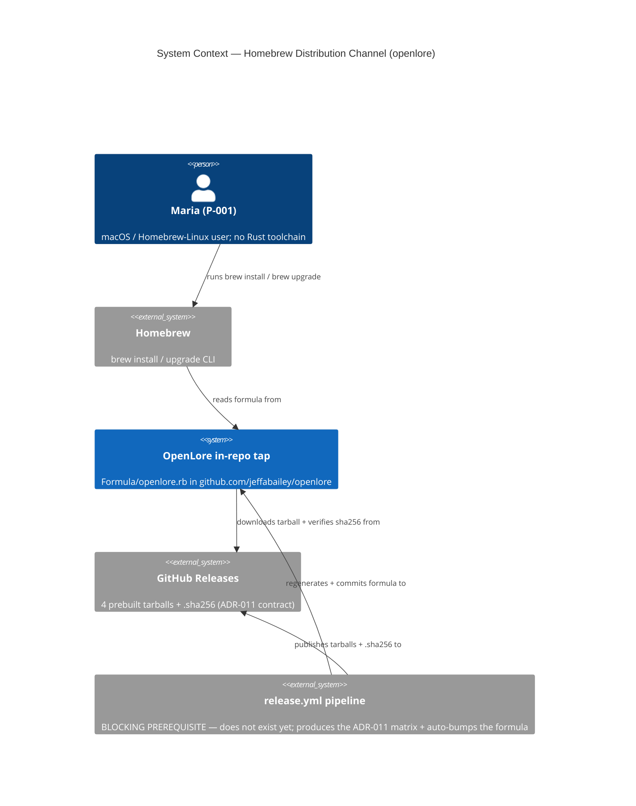
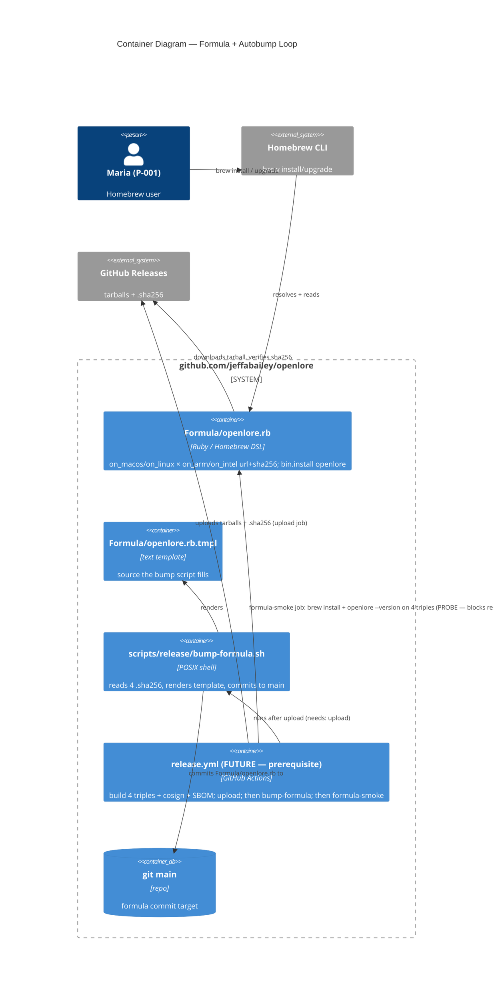

<!-- markdownlint-disable MD024 -->
# Feature Delta: homebrew-binary-distribution

> Wave: **DISCUSS** (lean mode)
> Feature type: **Infrastructure** (distribution / packaging — a THIRD install channel)
> Walking skeleton: **No** — thin brownfield feature; 24 features already shipped. It CONSUMES
>   the already-shipped `release.yml` GitHub-Release tarball + `.sha256` pipeline (ADR-011,
>   `openlore-foundation/devops/distribution.md` §1.2); it reinvents no binary production.
> UX depth: **Lean** — one JTBD job, one CLI-install happy path, 2 elephant-carpaccio slices,
>   DoR + KPIs. Opportunity scoring and emotional-arc deep-dive intentionally skipped (single job).
> JTBD: YES (light) — one new job **J-006** appended to `docs/product/jobs.yaml` (highest prior id
>   was J-005). Both stories trace to J-006.
> Origin: the **planned, deferred** "Homebrew tap" item in ADR-011 (deferred list) and
>   `distribution.md` §1.3 ("Reserved / deferred until post-slice-05, when there are enough
>   non-Rust users to justify the maintenance"). We are well past slice-05; the deferral trigger
>   has fired. This is scheduled follow-through, not net-new invention.
> Date: 2026-07-12 · Owner: Luna (nw-product-owner)

This file is the canonical DISCUSS-wave delta for `homebrew-binary-distribution`: a Homebrew tap
hosted **inside this repository** (`github.com/jeffabailey/openlore`) so a user can install the
`openlore` CLI with one `brew install jeffabailey/openlore/openlore`, and upgrade with one
`brew upgrade openlore`. The formula installs a **prebuilt binary downloaded from a GitHub
Release** (it does NOT build from source), verified by the `sha256` already produced by the
release pipeline. Scope is the **`openlore` CLI only** — never `openlore-indexer`.

This is a DELTA. It adds ONE artifact — the tap formula `Formula/openlore.rb` — plus a
release-time step that keeps that formula in sync with each `v*` tag. It reuses the entire
existing 4-platform tarball + `.sha256` release matrix. Tier-1 content is inlined here (lean);
SSOT job lives in `docs/product/jobs.yaml` (J-006); the install journey lives in
`docs/product/journeys/install-via-homebrew.yaml`; per-slice briefs under `slices/`.

---

## Wave: DISCUSS / [REF] Persona ID

- **P-001 Senior Engineer Solo Builder** ("Maria"), wearing an **installs-via-Homebrew** hat.
  Per `docs/product/personas/senior-engineer-solo-builder.yaml`: CLI-first, terminal-native,
  values greppable text, local-first, "never silently mutate", and — the load-bearing guardrail
  here — **no phone-home / no auto-updater**. At install time P-001 stands in for the broader
  **macOS / Homebrew-Linux user who does not want to compile from source or hand-verify a
  tarball**. Homebrew's one-command install + `brew upgrade` fits this persona's habit exactly,
  *provided* the formula introduces no background update daemon and registers no service (the
  `distribution.md` §6 guardrail).

UX guardrails inherited (this surface): the tap installs a single binary onto PATH, registers no
service/daemon, never phones home, and leaves upgrades as an explicit user-initiated
`brew upgrade`. `openlore --version` after install is greppable, verbatim proof the right binary
landed.

---

## Wave: DISCUSS / [REF] JTBD One-Liner

> **J-006**: *When I want to try or keep `openlore` current on macOS (or Homebrew-Linux) and I do
> not want to compile from source or hand-verify a tarball, I want to install it with one
> `brew install` and upgrade with one `brew upgrade`, so I get a verified, working `openlore`
> binary on my PATH in seconds — no Rust toolchain, no manual checksum, no background updater.*

J-006 is the **install/upgrade convenience** job. It is `primary: false` (a distribution channel,
not a core product capability) and complements — never duplicates — the two shipped channels:
`cargo install openlore` (crates.io) and the raw GitHub-Release tarball + `curl | tar xz`. Its
distinct value = **one-command install + one-command upgrade + sha256 verification handled by
brew**, for the user segment that has Homebrew but not (or not willingly) a Rust toolchain.

### Four Forces (light — feeds the BDD scenarios below)

- **Push**: `cargo install openlore` compiles a whole workspace for ~5-10 min and requires a Rust
  toolchain the user may not have; the raw-tarball path makes the user hand-verify the `.sha256`
  and manually move the binary onto PATH. Both are friction for a "just let me try it" moment.
- **Pull**: one `brew install jeffabailey/openlore/openlore` yields a verified `openlore` on PATH
  in seconds (no compile), and `brew upgrade openlore` keeps it current — brew performs the
  sha256 check for free.
- **Anxiety**: *"Will a Homebrew formula add a background updater, register a service, or phone
  home — betraying the local-first / no-auto-updater promise I chose openlore for?"* → Mitigation:
  the formula installs exactly one binary, registers NO service/daemon (`distribution.md` §6),
  and OpenLore does not phone home; every upgrade is an explicit, user-initiated `brew upgrade`.
- **Habit**: macOS devs already `brew install` everything and `brew upgrade` on their own cadence.
  The tap must feel like any other formula — no new cognitive surface, no bespoke installer.

---

## Wave: DISCUSS / [REF] Locked Decisions

All D-numbered per the wave contract. Rationale is inlined (lean; no separate `wave-decisions.md`).

| # | Decision | Status |
|---|---|---|
| **D-1** | **Tap hosted in-repo.** The formula lives at `Formula/openlore.rb` inside `github.com/jeffabailey/openlore`. Install invocation is `brew install jeffabailey/openlore/openlore` (user `jeffabailey` / tap `openlore` / formula `openlore`). NOTE the Homebrew default-resolution nuance is deferred to **OD-HB-1** (Homebrew maps `jeffabailey/openlore` → `homebrew-openlore` by default; the in-repo tap needs an explicit-URL `brew tap` or a name mirror). | LOCKED |
| **D-2** | **Prebuilt tarball, NOT build-from-source.** The formula points its `url` at the already-produced GitHub-Release tarball for the user's platform and installs the extracted binary (`bin.install "openlore"`). It carries **no** `depends_on "rust"`/`"cargo"` and runs **no** `cargo build`. Homebrew never compiles openlore. | LOCKED |
| **D-3** | **`openlore` CLI binary ONLY.** The formula installs the single `openlore` executable. It never installs, references, or depends on `openlore-indexer`. | LOCKED |
| **D-4** | **sha256 verification via brew.** The formula's per-platform `sha256` field equals the `.sha256` companion the release pipeline already publishes for that tarball (`distribution.md` §1.2). brew verifies the download against it before install; the formula never carries a hand-typed hash that could diverge from the pipeline artifact. | LOCKED |
| **D-5** | **No auto-update daemon / no phone-home (guardrail).** The formula registers NO service, launchd/systemd unit, `brew services` entry, or background update checker. It honors `distribution.md` §6 and the P-001 "no auto-updater / no phone-home" guardrail. Upgrades remain an explicit `brew upgrade openlore`. | LOCKED |
| **D-6** | **Formula stays in sync with each release, automatically.** On each `v*` release, the formula's `version` + the 4 per-triple `sha256` values are regenerated from the release `.sha256` companions and committed back to the repo (trunk-based, per house rule). A single multi-platform formula covers all 4 target triples via `on_macos`/`on_linux` + `on_arm`/`on_intel` `url`+`sha256` pairs. The EXACT bump mechanism (in-`release.yml` commit vs PR vs `brew bump-formula-pr`) is the headline open question **OD-HB-2**. A stale formula (version/sha256 lagging the latest release) is a release-blocking defect. | LOCKED |
| **D-7** | **Consumes the shipped release matrix; reinvents nothing.** The feature depends on `release.yml`'s existing 4 tarballs + `.sha256` companions (ADR-011). It adds no new binary-production, cross-compile, or CDN. cosign `.sig` verification stays a separate manual path (brew uses sha256); it is out of scope here (see Out of Scope). | LOCKED |

---

## Wave: DISCUSS / [REF] Scope Assessment (Elephant Carpaccio Gate)

**PASS — right-sized.** 2 user stories · 1 module (packaging/release infra, a single new
`Formula/openlore.rb` + a release-time bump step) · consumes the shipped release pipeline (no new
integration axis) · estimated ~2 days total. Oversized signals: none (0 of 5). No split needed.

---

## Wave: DISCUSS / [REF] Story Map and Slicing

One journey: **install-via-homebrew** — install openlore with one `brew` command, verified, on
PATH, and keep it current with one `brew upgrade`. See
`docs/product/journeys/install-via-homebrew.yaml`.

### Emotional arc (lean)

**wary-curious → one-command-relief → verified-confidence → stays-current-trust**

- **Entry (wary-curious)**: "I want to try openlore, but I don't want to install Rust or babysit a
  compile, and I don't fully trust a random tap not to bolt on an updater."
- **One-command-relief**: `brew install jeffabailey/openlore/openlore` — no compile, seconds not
  minutes.
- **Verified-confidence (peak)**: brew verified the sha256 for her; `openlore --version` prints
  the exact released version — proof the right, unmodified binary is on PATH.
- **Stays-current-trust (exit)**: `brew upgrade openlore` pulls the next release when *she* asks —
  no daemon, no phone-home; the local-first promise held.

### Shared artifacts (tracked)

| Artifact | Source of truth | Consumers | Integration risk |
|---|---|---|---|
| `version` | the latest `v*` git tag / workspace `Cargo.toml` version (the release pipeline stamps it into the tarball names) | tarball filenames, `.sha256` companions, `Formula/openlore.rb` `version`+`url`, `openlore --version` output | **HIGH** — a formula `version` that lags the latest release makes `brew upgrade` a no-op or points `url` at a non-existent tarball. D-6 auto-bump is the mitigation. |
| `sha256` (×4, one per triple) | the `.sha256` companion file published beside each release tarball (`distribution.md` §1.2) | the 4 `sha256` fields in `Formula/openlore.rb`; brew's download verification | **HIGH** — a hash that does not match the published tarball fails every install. Must be copied from the pipeline `.sha256`, never hand-typed (D-4). |
| tarball `url` (×4) | `https://github.com/jeffabailey/openlore/releases/download/v${version}/openlore-${version}-${triple}.tar.gz` | the 4 `url` fields in the formula | **MED** — URL/version drift breaks download; derived mechanically from `version` + triple. |
| tap invocation string | this feature (`brew install jeffabailey/openlore/openlore`) | README install docs, this feature-delta, OD-HB-1 resolution | **MED** — depends on OD-HB-1 (default tap resolution vs explicit-URL tap). |

### Slicing (by outcome, not layer)

- **Slice 1 (dogfood: a working in-repo formula that installs the current release on the
  maintainer's own Mac)** — `slices/slice-01-repo-tap-dogfood.md`: **US-HB-001**. A hand-authored
  `Formula/openlore.rb` (all 4 triples wired; `bin.install`, prebuilt, no compile, sha256 from the
  published `.sha256`), proven end-to-end by `brew install`ing it on the maintainer's
  `aarch64-apple-darwin` Mac and seeing `openlore --version`. This slice alone delivers the whole
  install outcome for the maintainer's platform and validates D-1..D-5.
- **Slice 2 (release-time auto-bump so upgrades keep working)** — `slices/slice-02-release-autobump.md`:
  **US-HB-002**. A `release.yml` step that, after the tarballs + `.sha256` are uploaded for a `v*`
  tag, regenerates the formula's `version` + 4 `sha256` and commits it to the repo — plus a CI
  smoke test that `brew install`s + runs `openlore --version` on each of the 4 triples. This makes
  `brew upgrade openlore` fetch each new release with zero manual formula edits (D-6).

### Priority Rationale

Slice 1 first: it carries the **riskiest assumption** — that a prebuilt, in-repo tap formula can
install a verified `openlore` with no compile and no service, honoring every P-001 guardrail (D-2,
D-3, D-5). If the dogfood install on the maintainer's own Mac does not work and feel right, the
whole channel is disproven and slice 2 (automating the sync of a formula that does not yet work)
is moot. Slice 1 also settles OD-HB-1 (the tap-resolution mechanics) against a real `brew install`
before automation depends on it. Slice 2 second: auto-bump only earns its keep once a correct
formula exists to keep in sync; its failure mode (a stale formula) is survivable short-term by a
manual edit, whereas slice 1's failure is fatal to the feature.

---

## Wave: DISCUSS / [REF] System Constraints (cross-cutting)

Hold across every story:

- The formula installs a **prebuilt binary only**; it never compiles (no `depends_on "rust"`, no
  `cargo build`) (D-2).
- **`openlore` CLI binary only**; never `openlore-indexer` (D-3).
- The formula registers **no service/daemon/auto-updater** and OpenLore does **not phone home**;
  upgrades are an explicit `brew upgrade` (D-5, `distribution.md` §6).
- Each `sha256` in the formula **equals the published `.sha256`** for that tarball; brew verifies
  the download; no hand-typed hash divergent from the pipeline artifact (D-4).
- The feature **consumes the existing `release.yml` 4-tarball + `.sha256` matrix** (ADR-011,
  `distribution.md` §1.2); it must not reinvent binary production (D-7).
- The formula must **stay in sync with each `v*` release** (version + 4 sha256); a stale formula is
  a release-blocking defect (D-6).
- **Windows is not a target** — no `x86_64-pc-windows-msvc` tarball exists (ADR-011); the formula
  covers only the 4 shipped triples.

---

## Wave: DISCUSS / [REF] User Stories and Acceptance Criteria

Both stories trace to **J-006**. Neither is `@infrastructure` — each delivers a user-observable
outcome (`openlore --version` output; a working `brew upgrade`), so each carries an Elevator Pitch.

### US-HB-001: Install the openlore CLI with one Homebrew command

- **job_id**: J-006

#### Elevator Pitch

- **Before**: Maria wants to try openlore on her Apple-Silicon Mac. Her options are
  `cargo install openlore` (needs a Rust toolchain and a ~5-10 min compile) or downloading the
  release tarball and hand-verifying its `.sha256` before moving the binary onto PATH.
- **After**: she runs **`brew install jeffabailey/openlore/openlore`**; brew downloads the prebuilt
  `aarch64-apple-darwin` tarball, verifies its sha256, and drops `openlore` on her PATH in seconds
  — then **`openlore --version`** prints `openlore 0.1.0` (the exact released version).
- **Decision enabled**: she decides to actually try openlore *now* (the friction that was deferring
  the trial is gone), trusting brew verified the download and that nothing installed a background
  updater or service.

#### Problem

Maria (P-001, Homebrew hat) is a macOS developer who may not have — or not want to spend 5-10 min
compiling against — a Rust toolchain, and does not want to hand-verify a tarball checksum just to
try a CLI. She needs a one-command, verified, PATH-ready install that fits her existing `brew`
habit and adds no background updater or phone-home (or she will not trust it).

#### Who

- P-001 (Maria), senior engineer / macOS Homebrew user | at her terminal running `brew` | wants a
  verified `openlore` on PATH in seconds without a Rust toolchain, and will reject any formula that
  bolts on a service or updater.

#### Solution

Add `Formula/openlore.rb` to the in-repo tap (D-1). The formula selects, per platform
(`on_macos`/`on_linux` + `on_arm`/`on_intel`), the matching GitHub-Release tarball `url` and its
published `sha256` (D-2, D-4), and installs the single extracted `openlore` binary
(`bin.install "openlore"`, D-3). No compile, no dependency on Rust, no service registration (D-5).
Dogfood-proven by `brew install`ing on the maintainer's own `aarch64-apple-darwin` Mac.

#### Domain Examples

1. **Happy path (Apple Silicon)** — Maria runs `brew install jeffabailey/openlore/openlore` on her
   M2 MacBook (`aarch64-apple-darwin`). brew fetches
   `openlore-0.1.0-aarch64-apple-darwin.tar.gz`, verifies its sha256 against the formula, installs
   `openlore` to the Homebrew prefix, and `openlore --version` prints `openlore 0.1.0`. No Rust
   toolchain was present or needed; no compile occurred.
2. **Intel Mac** — Björn runs the same command on an Intel MacBook (`x86_64-apple-darwin`); the
   formula's `on_intel` branch selects the `x86_64-apple-darwin` tarball + its sha256; `openlore
   --version` prints the same version. The single formula served two macOS arches with no user
   flags.
3. **Homebrew-Linux (ARM)** — Priya runs it on a Graviton box under Homebrew-on-Linux
   (`aarch64-unknown-linux-gnu`); the `on_linux` + `on_arm` branch selects the matching tarball;
   install succeeds, `openlore --version` prints the version.
4. **Verification failure (boundary)** — a corrupted/mismatched download: brew computes a sha256
   that does not equal the formula's `sha256` and **aborts the install with a checksum-mismatch
   error**, installing nothing — the D-4 verification working as intended.
5. **No service / no phone-home (guardrail)** — after install, `brew services list` shows no
   openlore entry, no launchd/systemd unit was written, and running `openlore --version` (and any
   command) makes no update-check network call. The formula added a binary and nothing else.

#### UAT Scenarios (BDD)

##### Scenario: One command installs a verified openlore binary on PATH
```
Given Maria is on an aarch64-apple-darwin Mac with Homebrew and no Rust toolchain
And openlore v0.1.0 is published with its aarch64-apple-darwin tarball and .sha256
When she runs `brew install jeffabailey/openlore/openlore`
Then brew downloads the aarch64-apple-darwin tarball and verifies its sha256
And `openlore` is installed on her PATH without any compilation
And `openlore --version` prints "openlore 0.1.0"
```

##### Scenario: The single formula installs the correct binary for each platform
```
Given the formula defines a url + sha256 for each of the 4 target triples
When a user on any one of aarch64/x86_64 macOS or aarch64/x86_64 Homebrew-Linux installs it
Then brew selects the tarball matching that platform's triple
And installs only the openlore CLI binary
And openlore-indexer is never downloaded or installed
```

##### Scenario: A tampered or mismatched download is rejected, installing nothing
```
Given the downloaded tarball's sha256 does not match the formula's sha256
When brew attempts the install
Then brew aborts with a checksum-mismatch error
And no openlore binary is placed on PATH
```

##### Scenario: The install adds no updater, service, or phone-home
```
Given Maria has installed openlore via the tap
When she inspects her system after install
Then no brew service, launchd, or systemd unit for openlore exists
And running openlore makes no update-check or telemetry network call
And upgrading is only ever an explicit `brew upgrade openlore`
```

#### Acceptance Criteria

- [ ] `brew install jeffabailey/openlore/openlore` installs a working `openlore` on PATH on
      `aarch64-apple-darwin` with no Rust toolchain and no compilation (D-2), and `openlore
      --version` prints the released version.
- [ ] The single formula selects the correct tarball for each of the 4 shipped triples via
      `on_macos`/`on_linux` + `on_arm`/`on_intel` (D-2).
- [ ] Only the `openlore` CLI binary is installed; `openlore-indexer` is never referenced (D-3).
- [ ] Each per-triple `sha256` equals the published `.sha256`; a mismatched download aborts the
      install with a checksum error and installs nothing (D-4).
- [ ] The formula registers no service/daemon/updater; no phone-home occurs; upgrade is only an
      explicit `brew upgrade` (D-5).
- [ ] The formula contains no `depends_on "rust"`/`"cargo"` and runs no build step (D-2).

#### Outcome KPIs

- **Who**: macOS / Homebrew-Linux users without (or unwilling to use) a Rust toolchain · **Does
  what**: get a verified `openlore` on PATH via one `brew install` · **By how much**: KPI-HB-1 —
  install-success rate ≥95% across all 4 triples in the CI install smoke test; KPI-HB-2 — median
  time from `brew install` to `openlore --version` printing < 60s on a warm brew (vs ~5-10 min for
  `cargo install`) · **Measured by**: automated `brew install` + `openlore --version` smoke test
  per platform in CI + public GitHub-Release download counts (NOT telemetry — local-first /
  no-phone-home) · **Baseline**: 0 (no tap exists before this feature).

#### Technical Notes

- Add `Formula/openlore.rb`; use a single formula with `on_macos`/`on_linux` + `on_arm`/`on_intel`
  `url`+`sha256` pairs pointing at the 4 shipped release tarballs (OD-HB-3 confirms this shape over
  Homebrew `bottle` blocks).
- OD-HB-1 (tap resolution) governs the exact one-time `brew tap` UX; settle in this slice against a
  real `brew install`.
- Dependencies: a published `v*` GitHub Release with all 4 tarballs + `.sha256` companions
  (`release.yml`, ADR-011 — shipped). No application-code change.

---

### US-HB-002: Keep the tap formula in sync with every release (so `brew upgrade` works)

- **job_id**: J-006

#### Elevator Pitch

- **Before**: openlore v0.1.1 is released, but `Formula/openlore.rb` still pins v0.1.0; Maria's
  `brew upgrade openlore` finds nothing new (or, if hand-edited wrong, points at a tarball whose
  sha256 no longer matches), so she is silently stuck on the old version.
- **After**: the release pipeline regenerates the formula's `version` + 4 `sha256` from the just-
  published `.sha256` files and commits it; Maria runs **`brew update && brew upgrade openlore`**
  and brew pulls **`openlore 0.1.1`**, verified, onto her PATH.
- **Decision enabled**: she decides to stay current with one command on her own cadence, trusting
  the tap always offers the latest verified release and never updates behind her back.

#### Problem

A tap is only as good as its freshness. If the formula is bumped by hand, it will drift — a lagging
`version` makes `brew upgrade` a silent no-op, and a mistyped `sha256` breaks every install. Maria
needs the tap to always reflect the latest `v*` release automatically, while upgrades stay an
explicit act she initiates (no daemon, D-5).

#### Who

- P-001 (Maria), macOS Homebrew user | already installed via the tap (US-HB-001) | wants
  `brew upgrade openlore` to fetch each new release with zero manual formula maintenance, and will
  not tolerate a channel that silently strands her on an old version.

#### Solution

Add a step to `release.yml` that runs **after** the 4 tarballs + `.sha256` are uploaded for a `v*`
tag: it reads the 4 published `.sha256` values, templates `Formula/openlore.rb` with the new
`version` + `url`s + `sha256`s, and commits it to the repo (trunk-based per house rule; OD-HB-2
picks the exact commit/PR mechanism). Add a CI smoke test that `brew install`s + runs `openlore
--version` on each of the 4 triples so a bad bump fails the release, not the user.

#### Domain Examples

1. **Happy path (patch release)** — v0.1.1 is tagged; `release.yml` builds + uploads the 4 tarballs
   and their `.sha256`; the bump step rewrites `Formula/openlore.rb` to `version "0.1.1"` with the
   4 new sha256 values and commits it. Maria runs `brew update && brew upgrade openlore` and gets
   `openlore 0.1.1`.
2. **Ordering guard (boundary)** — the bump step is sequenced strictly after the artifact upload;
   it never commits a `version`/`sha256` for a tarball that is not yet published (which would make
   every install 404 or checksum-fail until the upload caught up).
3. **Bad-bump caught by CI (error path)** — a templating bug writes a wrong sha256; the per-triple
   `brew install` smoke test fails in CI and blocks the release, so a broken formula never reaches
   a user's `brew upgrade`.
4. **Minor release, same shape** — v0.2.0 is tagged; the same step handles it identically (the bump
   is version-agnostic); no code path special-cases patch vs minor.
5. **No silent upgrade (guardrail)** — bumping the formula changes only what a *future* explicit
   `brew upgrade` will fetch; no already-installed user is upgraded automatically, and nothing
   phones home to announce the new version (D-5).

#### UAT Scenarios (BDD)

##### Scenario: A new release makes brew upgrade fetch the new verified version
```
Given openlore v0.1.1 has been released with its 4 tarballs and .sha256 companions
When the release pipeline runs its formula-bump step
Then Formula/openlore.rb is updated to version 0.1.1 with the 4 new sha256 values and committed
And a user who runs `brew update && brew upgrade openlore` receives openlore 0.1.1, sha256-verified
```

##### Scenario: The formula is only bumped after the artifacts exist
```
Given a v* release build is in progress
When the formula-bump step runs
Then it runs only after all 4 tarballs and their .sha256 files are uploaded
And it never points the formula at a version whose tarball is not yet published
```

##### Scenario: A bad bump is caught by CI, not by the user
```
Given the formula-bump step produces an incorrect version or sha256
When the per-triple `brew install` + `openlore --version` smoke test runs in CI
Then the smoke test fails and blocks the release
And no broken formula is committed to the tap that a `brew upgrade` could reach
```

##### Scenario: Bumping the formula never upgrades anyone silently
```
Given the formula has been bumped to a new version
Then no already-installed user's binary changes until they explicitly run `brew upgrade`
And no update-check or announcement network call is made by openlore
```

#### Acceptance Criteria

- [ ] After a `v*` release, `Formula/openlore.rb` reflects the new `version` + 4 `sha256` (read
      from the published `.sha256` companions) with no manual edit (D-6).
- [ ] The bump step runs strictly after the tarballs + `.sha256` are uploaded; it never references
      an unpublished tarball (ordering guard).
- [ ] A CI smoke test `brew install`s + runs `openlore --version` on each of the 4 triples and
      blocks the release on failure.
- [ ] `brew upgrade openlore` fetches the newly-released, sha256-verified version.
- [ ] Bumping the formula upgrades no already-installed user automatically and triggers no
      phone-home (D-5).

#### Outcome KPIs

- **Who**: tap users on a prior version · **Does what**: receive each new release via an explicit
  `brew upgrade` with zero manual formula maintenance · **By how much**: KPI-HB-3 — the formula's
  `version` matches the latest `v*` tag within the same release run for 100% of releases (formula
  freshness), verified by the CI smoke test · **Measured by**: release-pipeline assertion (formula
  version == tag) + the per-triple install smoke test · **Baseline**: 0 (no formula, no bump before
  this feature).

#### Technical Notes

- Extend `release.yml` with a post-upload bump step; templating reads the 4 `.sha256` files. Given
  the trunk-based / no-PR house rule, the lean default is an in-workflow commit to `main`
  (OD-HB-2), sequenced after artifact upload.
- Dependencies: US-HB-001 (a correct formula to keep in sync); the shipped `release.yml`
  tarball+`.sha256` matrix (ADR-011). No application-code change.

---

## Wave: DISCUSS / [REF] Outcome KPIs

This feature MINTS distribution-channel KPIs; measurement is telemetry-free (local-first /
no-phone-home) — it leans on CI install smoke tests, release-pipeline assertions, and public
GitHub download counts.

### Objective

Give macOS / Homebrew-Linux users a one-command, verified install and a one-command upgrade for the
`openlore` CLI — without a Rust toolchain and without ever adding a background updater.

### Outcome KPIs

| # | Who | Does What | By How Much | Baseline | Measured By | Type |
|---|-----|-----------|-------------|----------|-------------|------|
| KPI-HB-1 | macOS / Homebrew-Linux users without a Rust toolchain | install a verified `openlore` via `brew install` | ≥95% install-success across all 4 triples | 0 (no tap) | per-triple CI `brew install` + `openlore --version` smoke test | Leading (Outcome) |
| KPI-HB-2 | the same users | get `openlore` on PATH fast (no compile) | median `brew install`→`--version` < 60s on warm brew (vs ~5-10 min `cargo install`) | ~5-10 min (cargo) | dogfood + CI timing | Leading (Secondary) |
| KPI-HB-3 | tap users on a prior version | stay current via explicit `brew upgrade` | formula `version` == latest `v*` tag within the same release for 100% of releases | 0 (no formula) | release-pipeline freshness assertion + smoke test | Leading (Outcome) |

### Metric Hierarchy

- **North Star**: KPI-HB-1 (verified one-command install success across all supported platforms).
- **Leading**: KPI-HB-2 (time-to-install), KPI-HB-3 (formula freshness → working `brew upgrade`).
- **Guardrail Metrics (release-blocking)**: **no-service/no-phone-home** — post-install there is no
  brew service / launchd / systemd unit and no update-check network call (D-5, mechanically
  asserted); **binary-scope** — only `openlore` is installed, never `openlore-indexer` (D-3);
  **checksum-verified** — a mismatched download aborts the install (D-4).

### Measurement Plan

| KPI | Data Source | Collection Method | Frequency | Owner |
|-----|------------|-------------------|-----------|-------|
| KPI-HB-1 | CI matrix | `brew install` + `openlore --version` on 4 triples | per release + weekly | DEVOPS (platform-architect) |
| KPI-HB-2 | dogfood + CI | wall-clock of install→`--version` | per release | DEVOPS |
| KPI-HB-3 | release pipeline | assert `Formula/openlore.rb` version == `v*` tag | per release (CI) | DELIVER / DEVOPS |

### Hypothesis

We believe that a prebuilt, in-repo Homebrew tap with automatic release-time bump for
macOS/Homebrew-Linux users will let them install and stay current with `openlore` in one command
each — WITHOUT a Rust toolchain and WITHOUT any background updater. We will know this is true when
install-success is ≥95% across all 4 triples, install completes in < 60s, the formula version
tracks every release, and the no-service/no-phone-home guardrail holds mechanically.

A per-feature `outcome-kpis.md` is intentionally NOT duplicated (lean): KPI-HB-1..3 are defined
here and belong in `docs/product/kpi-contracts.yaml` alongside the existing KPIs. Measurement is
CI/pipeline-based; no new telemetry is added (honoring local-first).

---

## Wave: DISCUSS / [REF] Out of Scope

- **`openlore-indexer`** — the formula installs the `openlore` CLI only (D-3).
- **Windows** — no `x86_64-pc-windows-msvc` tarball exists (ADR-011); not a target.
- **Building from source in the formula** — never; prebuilt tarball only, no `depends_on
  "rust"`/`cargo build` (D-2).
- **Auto-updater / `brew services` / background update check / phone-home** — forbidden (D-5,
  `distribution.md` §6).
- **Publishing to `homebrew-core`** — this is a custom user tap only; no homebrew-core submission
  (which carries maintenance obligations and review latency this lean channel does not want).
- **cosign `.sig` verification inside the formula** — brew verifies via sha256 (D-4); cosign remains
  the separate manual `verify-blob` path documented in `distribution.md` §5. A future nicety, not
  this feature.
- **True Homebrew `bottle do` blocks hosted on ghcr** — we reuse the GH-Release tarballs directly
  via `url`+`sha256`; ghcr-hosted bottles are a future optimization (OD-HB-3).
- **AUR / Nix flake** — separate deferred channels (ADR-011); community-contributable, not this
  feature.

---

## Wave: DISCUSS / [REF] Walking Skeleton Strategy

Walking skeleton = **No** (per orchestrator config). This is a thin brownfield feature over a
shipped mechanism (the `release.yml` 4-tarball + `.sha256` matrix); there is no new end-to-end
mechanism or integration axis to de-risk with a skeleton. The equivalent thin thread is
**US-HB-001** (slice 1): a working in-repo formula that installs the current release on the
maintainer's own Mac. It touches exactly ONE net-new artifact (`Formula/openlore.rb`) and reuses
the entire release pipeline, so validating it validates the channel before automation (slice 2)
depends on it.

---

## Wave: DISCUSS / [REF] Driving Ports (for DESIGN / DEVOPS)

Names indicative; DESIGN/DEVOPS own shapes. This feature has **no application-code ports** — its
driving surface is the packaging/formula layer:

- **Formula (US-HB-001)**: a new `Formula/openlore.rb` in the in-repo tap — the Homebrew DSL
  surface (`url`, `sha256`, `on_macos`/`on_linux`/`on_arm`/`on_intel`, `bin.install "openlore"`).
  The user-facing entry point is the `brew install jeffabailey/openlore/openlore` and
  `brew upgrade openlore` commands.
- **Release pipeline (US-HB-002)**: a new post-upload step in `.github/workflows/release.yml` that
  regenerates + commits the formula, and a CI job that `brew install`s the formula on the 4 triples.
- **Existing (reused, unchanged)**: the `release.yml` 4-platform tarball build + `.sha256`
  companion generation (ADR-011, `distribution.md` §1.2). This feature reads its outputs; it does
  not modify binary production (D-7).

---

## Wave: DISCUSS / [REF] Pre-requisites and Open Decisions for DESIGN / DEVOPS

### Pre-requisites (shipped, inherited)

- `release.yml` publishing, per `v*` tag, the 4 tarballs
  (`openlore-${version}-{aarch64-apple-darwin,x86_64-apple-darwin,x86_64-unknown-linux-gnu,aarch64-unknown-linux-gnu}.tar.gz`)
  each with a `.sha256` companion (ADR-011, `distribution.md` §1.2).
- At least one published `v*` GitHub Release for the slice-1 formula to point at.

### Open Decisions (OD-HB-*) — DESIGN / DEVOPS own

| ID | Decision | Default lean |
|---|---|---|
| **OD-HB-2** | **(HIGH — the headline) Formula auto-bump mechanism.** On each `v*` release, HOW does `Formula/openlore.rb` get its new `version` + 4 `sha256` and land back in the repo, correctly sequenced after the tarballs + `.sha256` are uploaded? Options: (a) an in-`release.yml` step that templates the formula from the `.sha256` files and commits to `main`; (b) a PR (`brew bump-formula-pr` or custom); (c) a separate `workflow_dispatch`/scheduled job. | Given the trunk-based / no-PR house rule: **(a)** an in-`release.yml` step, sequenced strictly after artifact upload, that regenerates the formula and commits to `main`. Add the per-triple `brew install` smoke test as the correctness gate (US-HB-002). |
| **OD-HB-1** | **(MED) Tap-resolution mechanics.** Homebrew's default resolution maps `jeffabailey/openlore` → `github.com/jeffabailey/homebrew-openlore`, NOT the in-repo `github.com/jeffabailey/openlore` (D-1). To make the locked in-repo tap installable via the bare `brew install jeffabailey/openlore/openlore`, choose: (a) document a one-time `brew tap jeffabailey/openlore https://github.com/jeffabailey/openlore` (explicit-URL tap) in the README; or (b) additionally expose the repo under the `homebrew-openlore` name (mirror/redirect) for zero-tap install. | **(a)** document the one-time explicit-URL `brew tap` in the README (keeps the tap truly in-repo per D-1); revisit (b) only if the extra step proves to be real friction. |
| **OD-HB-3** | **(LOW) Formula shape.** A single multi-platform formula with `on_macos`/`on_linux` + `on_arm`/`on_intel` `url`+`sha256` pairs, vs Homebrew `bottle do` blocks hosted on ghcr. | Single multi-platform formula (simplest; no ghcr bottle hosting; reuses the GH-Release tarballs directly). |

### Risks (surfaced, not managed here)

- **R-1 (technical, MED prob / MED impact)**: auto-bump ordering (OD-HB-2) — if the formula commit
  races the artifact upload, brew would see a `version`/`sha256` whose tarball is not yet published,
   404-ing or checksum-failing every install until the upload catches up. Mitigation: sequence the
  bump strictly after upload; gate on the per-triple smoke test.
- **R-2 (usability, LOW/MED)**: tap-resolution confusion (OD-HB-1) — a user who tries the bare
  `brew install jeffabailey/openlore/openlore` without the one-time explicit-URL tap may hit
  "homebrew-openlore not found". Mitigation: the README documents the exact one-time `brew tap`
  invocation.
- **R-3 (process, LOW/LOW)**: no DIVERGE artifacts preceded this feature (consistent with sibling
  brownfield deltas). The job is grounded directly in the ADR-011 + `distribution.md` §1.3 deferral
  trigger and P-001; no independent DIVERGE option-set was generated. Accepted (the solution space
  for "a Homebrew tap" is narrow and the decision was pre-locked by the deferral plan).

---

## Wave: DISCUSS / [REF] Definition of Ready validation

| DoR item | US-HB-001 (install) | US-HB-002 (auto-bump) |
|---|---|---|
| 1. Problem statement clear, domain language | PASS | PASS |
| 2. Persona with specific characteristics | PASS (P-001 Maria, Homebrew hat) | PASS (P-001 Maria, upgrade path) |
| 3. ≥3 domain examples with real data | PASS (5) | PASS (5) |
| 4. UAT in Given/When/Then (3-7) | PASS (4) | PASS (4) |
| 5. AC derived from UAT | PASS (6) | PASS (5) |
| 6. Right-sized (1-3 days, 3-7 scenarios) | PASS (~1 day, 4 scenarios) | PASS (~1 day, 4 scenarios) |
| 7. Technical notes: constraints/dependencies | PASS | PASS |
| 8. Dependencies resolved or tracked | PASS (release pipeline shipped; OD-HB-1 tracked) | PASS (US-HB-001 + release pipeline; OD-HB-2 tracked as R-1) |
| 9. Outcome KPIs defined with measurable targets | PASS (KPI-HB-1/2) | PASS (KPI-HB-3) |

**Overall DoR status: PASSED** for both stories.

Notes:
- Every story is user-visible and carries an Elevator Pitch with a real entry point
  (`brew install jeffabailey/openlore/openlore`; `brew upgrade openlore`) and concrete observable
  output (`openlore --version` prints `openlore 0.1.0`) — passes Dimension 0.
- Neither story is `@infrastructure`; the slice set is not 100% infrastructure — passes Dimension 0
  §5. (US-HB-002 automates a release step, but its user-observable outcome is a working
  `brew upgrade`, so it is a value story, not infra.)
- Two open decisions (OD-HB-1, OD-HB-2) are tracked as risks (R-2, R-1) rather than blockers; the
  feature is Ready to enter DESIGN/DEVOPS, whose first act on slice 1 is to settle OD-HB-1 against a
  real `brew install` and on slice 2 to settle OD-HB-2 (the auto-bump mechanism).

---

## Wave: DISCUSS / [REF] Wave-Decisions Summary

- **Feature type**: Infrastructure — a THIRD install channel (Homebrew tap) consuming the shipped
  release matrix; reinvents no binary production.
- **Origin**: the planned/deferred "Homebrew tap" in ADR-011 + `distribution.md` §1.3; the
  post-slice-05 deferral trigger has fired.
- **Primary job**: J-006 (new; appended to `docs/product/jobs.yaml`; `primary: false` — a
  distribution convenience channel). Both stories trace to J-006.
- **Locked decisions**: D-1 tap-in-repo (`Formula/openlore.rb` in `github.com/jeffabailey/openlore`,
  `brew install jeffabailey/openlore/openlore`); D-2 prebuilt-tarball-not-source; D-3
  openlore-CLI-only; D-4 sha256-via-brew (== pipeline `.sha256`); D-5 no-auto-update-daemon /
  no-phone-home; D-6 formula-bump-on-release (stays in sync automatically); D-7
  consumes-shipped-release-matrix.
- **Scope assessment**: PASS — 2 stories, 1 module, ~2 days; right-sized (no split).
- **Slices**: slice 1 = in-repo dogfood formula (installs current release on maintainer's Mac);
  slice 2 = release-time auto-bump + per-triple install smoke test.
- **Walking skeleton**: No (thin brownfield; consumes shipped pipeline).
- **Open decisions**: OD-HB-2 (HIGH, headline — the auto-bump mechanism), OD-HB-1 (MED — tap
  resolution), OD-HB-3 (LOW — formula shape).
- **Biggest open question handed to DESIGN/DEVOPS**: OD-HB-2 — how `Formula/openlore.rb`'s
  `version` + 4 `sha256` are regenerated and committed on each `v*` release, correctly sequenced
  after the tarball + `.sha256` upload (lean default: an in-`release.yml` commit-to-main step,
  trunk-based, gated by a per-triple `brew install` smoke test).
- **DoR**: PASSED (both stories).
- **DIVERGE artifacts**: none present (no `diverge/` dir); job grounded directly in ADR-011 +
  `distribution.md` §1.3 + P-001. Noted as a (low) risk R-3.

---

## Wave: DESIGN / [REF] Changed Assumptions (back-propagation to DISCUSS)

> Morgan (nw-solution-architect), 2026-07-12. DESIGN does not edit DISCUSS content in place; this
> section records where a DISCUSS assumption was found false during design, per the
> back-propagation contract. Full quote + correction lives in `design/upstream-changes.md`.

- **CA-1 (BLOCKING). The GitHub-Release 4-tarball + `.sha256` pipeline does NOT exist.** DISCUSS
  asserted (header lines 8-9; Pre-requisites lines 537-543; D-7) that this feature "CONSUMES the
  already-shipped `release.yml` … pipeline" and lists "release.yml publishing … 4 tarballs … each
  with a `.sha256` companion" and "At least one published `v*` GitHub Release" as **shipped,
  inherited** prerequisites. **Verified false**: there is no `.github/workflows/release.yml` (only
  `ci.yml` + `nightly.yml`; `nightly.yml` line 6 states "release.yml lands when the first vX.Y.Z tag
  is cut"), there are no git tags, and no GitHub Releases.
- **Correction.** ADR-011 nonetheless **locks the output contract** (the 4 triples + naming +
  `.sha256` companions + cosign `.sig` + SBOM). So the formula + autobump are **designed now**
  against that locked contract, but **`release.yml` producing the ADR-011 4-platform matrix is a
  BLOCKING EXTERNAL PREREQUISITE** — a separate future DEVOPS feature (native 4-platform builds +
  cosign + SBOM per ADR-011/ADR-012), NOT part of this feature. **slice-01's dogfood install cannot
  execute until `release.yml` + one real tagged release exist.** The build is split: design lands
  now; the two slices become executable only after the prerequisite ships.
- Impact on DISCUSS artifacts: D-7 ("consumes the shipped release matrix") is **re-scoped** —
  the matrix is *contractually locked* (ADR-011) but *not yet produced*; the dependency is a
  *prerequisite to build*, not an *inherited given*. No other locked decision (D-1..D-6) changes.

---

## Wave: DESIGN / [REF] Design Decisions (DDD)

All resolve the DISCUSS open decisions per PROPOSE-mode recommendations (options + trade-offs in
`design/wave-decisions.md` and ADR-061). Verdicts:

| # | Decision | Verdict | One-line rationale |
|---|---|---|---|
| **DDD-1** | OD-HB-1 tap resolution | **One-time explicit-URL `brew tap jeffabailey/openlore https://github.com/jeffabailey/openlore` then `brew install jeffabailey/openlore/openlore`** | Keeps the tap truly in-repo (D-1) with no second repo; documented once in README; `brew upgrade` then works with no further step. |
| **DDD-2** | OD-HB-2 autobump (headline) | **A job INSIDE the future `release.yml` that regenerates the formula and commits to `main`, sequenced after upload via `needs:`** | Strongest ordering guarantee (in-DAG edge, R-1) + honors trunk-based/no-PR; `brew bump-formula-pr` opens a PR (house-rule conflict); a separate event-workflow has weaker ordering. |
| **DDD-3** | OD-HB-3 formula shape | **Single multi-platform formula (`on_macos`/`on_linux` × `on_arm`/`on_intel` url+sha256), NOT ghcr bottles** | Reuses the existing GH-Release tarballs directly; no ghcr bottle-hosting pipeline; simplest shape covering all 4 triples in one `.rb`. |
| **DDD-4** | Verification model | **brew-native sha256 == published `.sha256`; cosign `.sig` stays the separate manual provenance path** | sha256 = download integrity (in-channel); cosign = provenance (out-of-channel, ADR-012); complementary layers, not substitutes. |
| **DDD-5** | Earned-Trust probe | **Per-triple `brew install` + `openlore --version` smoke test on real macOS+Linux runners; blocks the release** | The formula's `probe()` analog — empirically proves each url+sha256 installs on the real substrate; a failed probe refuses to ship (release-refused). |
| **DDD-6** | Bump-script substrate | **A dependency-free POSIX shell templating script (`scripts/release/bump-formula.sh`) reading the 4 `.sha256` files + a `Formula/openlore.rb.tmpl` template** | No Rust (keeps `openlore` a black box), no new toolchain; regenerates the whole formula deterministically from the release artifacts. |
| **DDD-7** | Prerequisite handling | **`release.yml` producing the ADR-011 matrix is a BLOCKING external prerequisite; design now, split the build** | The contract is locked (ADR-011) so design is unblocked; execution of both slices waits on the prerequisite feature (CA-1). |

---

## Wave: DESIGN / [REF] Component Decomposition

Paradigm note: this feature adds **NO Rust** — the `openlore` binary is a black box produced by the
(prerequisite) `release.yml`. All new artifacts are Ruby (formula) + YAML/shell (CI + bump).

| Component | Path | Kind | Change | Responsibility |
|---|---|---|---|---|
| Tap formula | `Formula/openlore.rb` | Ruby / Homebrew DSL | **CREATE NEW** (slice-01) | Single multi-platform formula: `on_macos`/`on_linux` × `on_arm`/`on_intel` url+sha256 → `bin.install "openlore"`. No compile, no service. |
| Formula template | `Formula/openlore.rb.tmpl` | text template | **CREATE NEW** (slice-02) | Source of truth the bump script fills with `version` + 4 url/sha256; keeps hand-edits and generated output identical in shape. |
| Autobump script | `scripts/release/bump-formula.sh` | POSIX shell | **CREATE NEW** (slice-02) | Reads the 4 published `.sha256`, renders the template, writes `Formula/openlore.rb`, commits to `main`. Dependency-free. |
| Autobump job | `.github/workflows/release.yml` (`bump-formula` job) | GitHub Actions YAML | **EXTEND** the future release.yml (slice-02) | Runs `bump-formula.sh` after artifact upload (`needs: [upload]`); commits; asserts freshness (`version == ${tag#v}`). |
| Smoke-test job | `.github/workflows/release.yml` (`formula-smoke` job) | GitHub Actions YAML | **EXTEND** the future release.yml (slice-02) | Per-triple `brew install` + `openlore --version` + `brew audit`/`brew style` on real macOS+Linux runners; blocks the release. The Earned-Trust probe (DDD-5). |
| README install docs | `README.md` (install section) | Markdown | **EXTEND** (slice-01) | The exact one-time `brew tap …` + `brew install …` commands (DDD-1). |
| `openlore` binary | (produced by `release.yml`) | Rust binary | **UNCHANGED** | Black box; consumed as a prebuilt tarball. This feature does not touch it. |

---

## Wave: DESIGN / [REF] Ports and Adapters

Hexagonal framing applied to a packaging surface (no application-code ports).

### Driving port (inbound)

- **Homebrew CLI surface** — `brew tap` / `brew install jeffabailey/openlore/openlore` /
  `brew upgrade openlore`. The user-facing entry point; the formula is the adapter that satisfies
  it. Observable contract: `openlore --version` prints the released version; no service registered.

### Driven ports + adapters (outbound)

| Driven port (what the design depends on) | Adapter | Probe / Earned-Trust |
|---|---|---|
| **GitHub Releases** (the tarball + `.sha256` artifact source, ADR-011 contract) | `Formula/openlore.rb`'s per-triple `url` + `sha256` fields | Per-triple `brew install` smoke test downloads the REAL asset on the REAL OS/arch and lets brew verify the checksum (DDD-5). Catches an eventually-consistent / partially-uploaded asset. |
| **The repo git `main`** (the formula commit target) | `bump-formula.sh` + the `bump-formula` job's `git commit`/`push` | Freshness assertion (`version == ${tag#v}`) + the ordering guard (`needs: [upload]`) — never commits a version whose tarball is unpublished (R-1). |
| **The published `.sha256` companions** (per-triple) | `bump-formula.sh` template fill | The sha256 is copied from the artifact, never hand-typed (D-4) → brew's own verification is the downstream probe. |

**External-integration note (principle 10):** GitHub Releases is the only external substrate, and it
is **first-party** (same repo/org), so no consumer-driven contract test (Pact) is warranted. The
per-triple `brew install` smoke test plays the equivalent role — it is the consumer-driven check
that the release artifacts still satisfy the formula's `url`+`sha256` expectations, at release time.

---

## Wave: DESIGN / [REF] Technology Choices

| Choice | Version / pin | License | Rationale |
|---|---|---|---|
| Homebrew formula DSL (Ruby) | Homebrew ≥ 4.x DSL (`on_macos`/`on_linux`/`on_arm`/`on_intel`, `bin.install`) | BSD-2-Clause (Homebrew) | The install channel's native surface; OSS; zero-cost; matches the persona's existing `brew` habit. |
| GitHub Actions | existing CI substrate (`actions/checkout@v4`, `ubuntu-latest` + `macos-14`/`macos-13` runners) | n/a (platform) | Already the repo's CI/CD substrate (`ci.yml`); reuse, no new platform. macOS-14 (arm) + macos-13 (intel) + ubuntu (x86) cover the smoke-test triples. |
| Release-artifact naming | ADR-011: `openlore-{version}-{triple}.tar.gz` + `.sha256` | n/a (contract) | The locked contract the formula's `url`/`sha256` target; the single source of truth for the 4 triples. |
| Autobump templating | POSIX `bash` + `sed`/parameter-expansion (no new dep) | n/a | Dependency-free; deterministic; keeps `openlore` a black box (no Rust added). |
| Formula enforcement | `brew audit --strict --online` + `brew style` | BSD-2-Clause | Language-appropriate arch enforcement (principle 11) — the ArchUnit equivalent for a Ruby formula. |

Triple → `on_*` mapping (single-formula shape, DDD-3):

| `on_*` branch | ADR-011 triple |
|---|---|
| `on_macos` + `on_arm` | `aarch64-apple-darwin` |
| `on_macos` + `on_intel` | `x86_64-apple-darwin` |
| `on_linux` + `on_intel` | `x86_64-unknown-linux-gnu` |
| `on_linux` + `on_arm` | `aarch64-unknown-linux-gnu` |

`url` pattern (per branch): `https://github.com/jeffabailey/openlore/releases/download/v#{version}/openlore-#{version}-<triple>.tar.gz`.

---

## Wave: DESIGN / [REF] Reuse Analysis (HARD GATE)

Searched the existing CI/tooling surface for overlapping components before proposing new ones.

| Candidate existing component | Verdict | Justification |
|---|---|---|
| `.github/workflows/ci.yml` (commit + acceptance stages, ubuntu-only) | **NEITHER** (do not touch) | ci.yml gates PR/push on the Rust workspace; it is ubuntu-only and Rust-scoped. The brew smoke test needs macOS+Linux runners and is release-gated, not PR-gated. No overlap; leave ci.yml unchanged. |
| `.github/workflows/nightly.yml` (cargo-mutants, advisory) | **NEITHER** | Mutation testing of `claim-domain`; unrelated to packaging. No reuse. |
| `.github/workflows/release.yml` | **EXTEND (the future file)** | **Does not exist** (CA-1). The autobump + smoke-test are best designed as jobs *inside* the future `release.yml` (sequenced after its upload job via `needs:`), NOT a wholly separate pipeline — this gives the strongest ordering guarantee (R-1) and one source of release sequencing. The autobump is thus a **delta to the prerequisite feature's workflow**, not a standalone artifact. |
| `xtask check-arch` / `check-probes` (Rust arch enforcement) | **NEITHER** (analog, not reuse) | xtask operates on the Rust workspace; the formula is Ruby. The formula's enforcement analog is `brew audit`/`brew style` + the freshness assertion (principle 11), not an xtask rule. Do not add a Rust rule for a Ruby artifact. |
| `distribution.md` §1.2/§1.3 + ADR-011 (the 4-tarball contract) | **REUSE (contract, unchanged)** | The formula consumes this contract verbatim; no new binary production, no cross-compile, no CDN (D-7). This is the load-bearing reuse — the feature reinvents nothing about binary production. |
| `Formula/openlore.rb` | **CREATE NEW** | No existing formula, no `Formula/` dir. No alternative to reuse. |

**Net-new artifacts justified by "no existing alternative":** `Formula/openlore.rb` (+ `.tmpl`),
`scripts/release/bump-formula.sh`, and two jobs appended to the future `release.yml`. Everything
else is reuse (the ADR-011 contract) or untouched (ci.yml/nightly.yml/xtask).

---

## Wave: DESIGN / [REF] C4 — System Context (Level 1)



---

## Wave: DESIGN / [REF] C4 — Container (Level 2)



---

## Wave: DESIGN / [REF] Formula Interface Contract (structural, not implementation)

Structural shape only (the "port contract" for the formula) — NOT a complete file (DELIVER authors
the working `.rb`). Shows which DSL blocks exist and what each field targets:

```
class Openlore < Formula
  desc / homepage / version "<from tag>"
  # NO depends_on "rust"/"cargo"  (D-2)   # NO service/plist block (D-5)
  on_macos do
    on_arm   { url ".../openlore-#{version}-aarch64-apple-darwin.tar.gz";  sha256 "<published>" }
    on_intel { url ".../openlore-#{version}-x86_64-apple-darwin.tar.gz";   sha256 "<published>" }
  end
  on_linux do
    on_intel { url ".../openlore-#{version}-x86_64-unknown-linux-gnu.tar.gz"; sha256 "<published>" }
    on_arm   { url ".../openlore-#{version}-aarch64-unknown-linux-gnu.tar.gz"; sha256 "<published>" }
  end
  def install; bin.install "openlore"; end            # openlore CLI only (D-3)
  test { assert_match version.to_s, shell_output("#{bin}/openlore --version") }
end
```

---

## Wave: DESIGN / [REF] Open Questions (deferred to DISTILL / DELIVER)

| ID | Question | Owner | Status |
|---|---|---|---|
| **OQ-D-1 (BLOCKING)** | `release.yml` producing the ADR-011 4-platform matrix (+ cosign + SBOM) **does not exist**. It is a separate DEVOPS prerequisite feature. Neither slice can execute until it + one real tagged release ship. | platform-architect (DEVOPS) | **BLOCKS BUILD** — design complete, execution gated. |
| OQ-D-2 | Exact GitHub Actions runner labels for the intel-mac + arm-mac + linux-arm smoke-test cells (arm-linux may need a self-hosted or emulated runner). | platform-architect (DEVOPS) | Deferred to DEVOPS/DISTILL. |
| OQ-D-3 | The `git` identity + token/permissions the `bump-formula` job uses to commit to `main` (GITHUB_TOKEN with `contents: write` vs a deploy key), and branch-protection interaction with a bot commit. | platform-architect (DEVOPS) | Deferred to DEVOPS. |
| OQ-D-4 | Whether `Formula/openlore.rb.tmpl` + `bump-formula.sh` live in this feature or move into the release.yml prerequisite feature's workspace (they EXTEND that pipeline). | DISTILL/DELIVER | Deferred; recommend co-locating with the formula for slice cohesion. |
