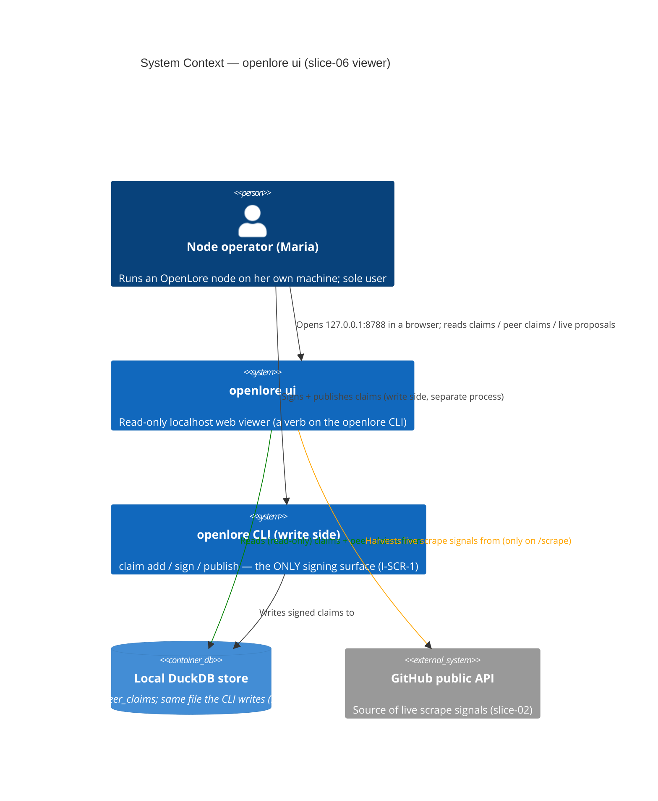
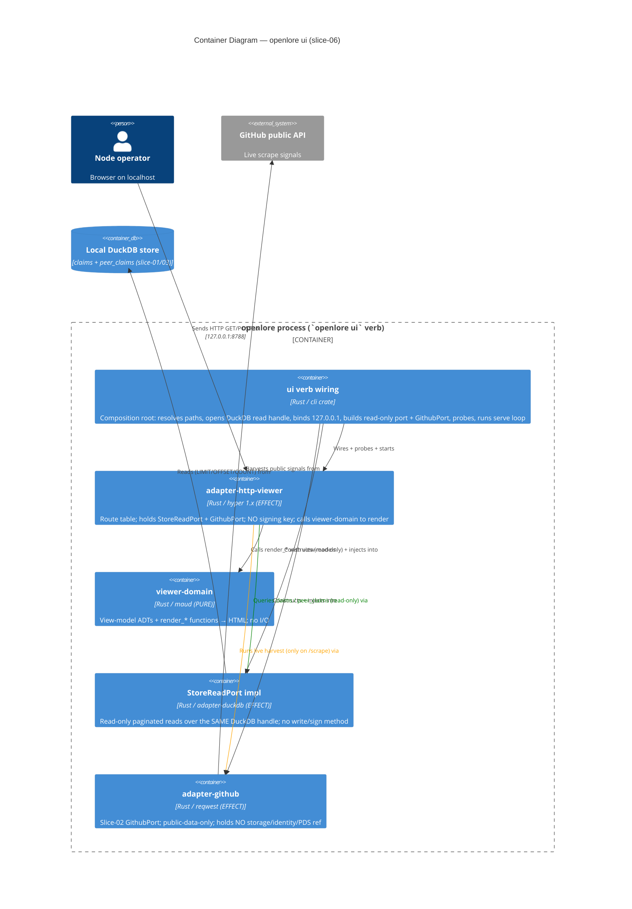
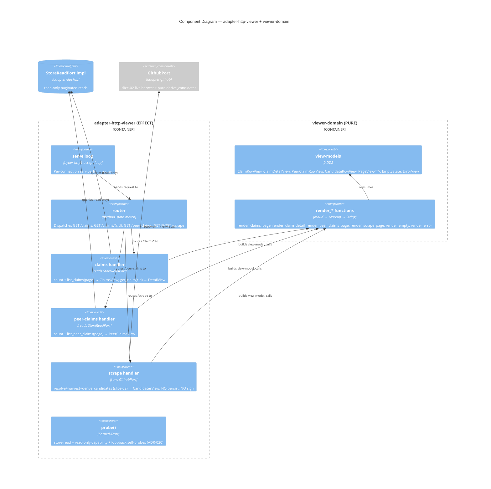

# Architecture Design: htmx-scraper-viewer (slice-06)

> **Brownfield DELTA** on the 21-crate (was 19) functional-Rust OpenLore workspace.
> Slices 01–05 SHIPPED. This slice adds a **read-only htmx viewer** for the node
> operator on **localhost**, surfaced as a new `openlore ui` verb. It reads the
> operator's OWN store (`claims` slice-01, `peer_claims` slice-03) and runs a live,
> ephemeral scrape-proposal view reusing the slice-02 `GithubPort`. Signing stays
> exclusively in the CLI (I-VIEW-3 / I-SCR-1). Paradigm: functional Rust (ADR-007) —
> pure rendering core, effect shell at the I/O edges.

This document delta's the prior slices' design docs the way slice-05's design delta'd
slices 01–04. It is governed by ADR-028 (verb shape + pure/effect split + binding),
ADR-029 (maud templating + pure-core allowlist), ADR-030 (read-only store-read port).

---

## 1. System context and capabilities

The viewer is a **pure read surface** (shared-artifacts-registry.md): it owns exactly
one thing — the rendered HTML page — and borrows every datum from an existing slice:

| Capability | Route(s) | Corpus | Network? | Persists? |
|------------|----------|--------|----------|-----------|
| See my claims (FR-VIEW-2) | `GET /claims` | local `claims` (slice-01) | no (offline) | no |
| Inspect one claim (FR-VIEW-3) | `GET /claims/{cid}` | local `claims` + `claim_evidence` | no (offline) | no |
| See peer claims (FR-VIEW-4) | `GET /peer-claims` | local `peer_claims` (slice-03) | no (offline) | no |
| Paginate large stores (FR-VIEW-6) | `?page=N` on list routes | local DuckDB | no (offline) | no |
| Browse live proposals (FR-VIEW-5) | `GET/POST /scrape` | live GitHub harvest (slice-02) | **yes** | **no** (ephemeral) |
| Launch (FR-VIEW-1) | n/a (process start) | n/a | no | no |

Hard invariants enforced (requirements.md §Inherited Invariants): I-VIEW-1 (read-only),
I-VIEW-2 (no key in web process), I-VIEW-3 (human gate stays in CLI), I-VIEW-4 (loopback
only), I-VIEW-5 (derived-from display-only on candidates), I-VIEW-6 (store views offline).

---

## 2. C4 Level 1 — System Context

The operator interacts with TWO separate processes: the **viewer** (read-only, this
slice) and the **CLI write side** (signing, unchanged). They share ONE store. The viewer
never writes; the CLI is the only writer/signer. `/scrape` is the only viewer path that
touches the network.

---

## 3. C4 Level 2 — Container

**Crate decomposition (production crates 19 → 21):**

| Crate | New/Extend | Layer | Role |
|-------|-----------|-------|------|
| `viewer-domain` | **NEW** | PURE | View-model ADTs + `render_*` → maud `Markup` → HTML. Joins the pure-core allowlist (maud whitelisted, ADR-029). |
| `adapter-http-viewer` | **NEW** | EFFECT | hyper 1.x server + route table; wires `StoreReadPort` + `GithubPort`; real `probe()`. |
| `ports` | **EXTEND** | contract | Add `StoreReadPort` trait + `ClaimRow`/`ClaimDetail`/`PeerClaimRow`/`PageRequest`/`Page`/`StoreReadError` boundary types (ADR-030). |
| `adapter-duckdb` | **EXTEND** | EFFECT | Implement `StoreReadPort` (new paginated list reads + counts over the SAME store; no new table). |
| `cli` | **EXTEND** | root | The `ui` verb: clap subcommand + wiring + serve loop; reuses `build_tokio_runtime`. |
| `xtask` | **EXTEND** | tooling | `check-arch`: register `viewer-domain` pure-core; allowlist `maud`; add viewer capability-boundary rule. |

Reuse-vs-new justification (every new crate earns its existence):

- **`viewer-domain` (new)**: no existing pure crate renders HTML; the slice-05
  `appview-domain` renders CLI text, not HTML, and is a different bounded concern. A new
  pure crate keeps rendering testable with zero substrate and on the pure-core ban list.
- **`adapter-http-viewer` (new)**: the slice-05 `adapter-xrpc-query-server` serves a
  JSON XRPC query for the INDEXER composition root and must stay disjoint from `cli`
  (I-3). The viewer's HTTP surface belongs to the `cli` root, serves HTML (not JSON), and
  wires different ports — a separate adapter, reusing the proven hyper skeleton pattern.
- **`StoreReadPort` (extend `ports`)**: reuse rejected — the existing `StoragePort`
  carries writes (breaches I-VIEW-1) and has no unkeyed paginated list read (ADR-030).
- **`adapter-duckdb` impl (extend)**: reuse — AUGMENT the existing adapter over the SAME
  store + SAME shared handle (WD-8 / slice-04 precedent); no second store (BR-VIEW-4).
- **`cli` (extend)**: reuse — the `ui` verb lives next to the verbs that already wire
  `adapter-duckdb` + `adapter-github`, and reuses `build_tokio_runtime`.

---

## 4. C4 Level 3 — Component (the viewer subsystem)

Abstraction discipline: L1 actors + external GitHub; L2 the in-process containers + the
one external system + the shared DB; L3 the viewer subsystem's internal components. Every
arrow carries a verb. The pure `viewer-domain` is reachable ONLY through `render_*`
calls; it imports neither hyper, DuckDB, nor `GithubPort` (ADR-007 pure-core).

---

## 5. Route table (the read-only web surface)

| Method | Path | Handler reads | Renders | Empty / error states |
|--------|------|---------------|---------|----------------------|
| GET | `/` | — | redirect/link to `/claims` (landing) | n/a |
| GET | `/claims?page=N` | `count_claims` + `list_claims(page)` | `render_claims_page` (subject, predicate, object, confidence numeric, author_did, composed_at, cid; "X–Y of N") | empty store → guided message to CLI (FR-VIEW-7); store unreadable → handled at startup probe (ADR-030) |
| GET | `/claims/{cid}` | `get_claim(cid)` | `render_claim_detail` (all fields + evidence[]) | no evidence → "no evidence attached"; unknown cid → guided not-found + back link |
| GET | `/peer-claims?page=N` | `count_peer_claims` + `list_peer_claims(page)` | `render_peer_claims_page` (peer rows w/ peer_origin, distinct surface) | empty → "No federated claims yet"; missing origin → "unknown" (never dropped) |
| GET | `/scrape` | — | `render_scrape_page` (target form only) | n/a |
| POST | `/scrape` | `GithubPort` resolve+harvest+`derive_candidates` | `render_scrape_page` w/ candidates (subject, predicate, object, confidence, derived-from; NO sign control; "nothing signed/saved") | zero candidates → guided message; network down → "GitHub unreachable; your store view still works offline" (NFR-VIEW-7) |
| * | (any other) | — | `render_error` 404 | guided not-found |

ALL routes are read-only: GET for the store views; `/scrape`'s POST runs an ephemeral
harvest that persists NOTHING (FR-VIEW-5 / BR-VIEW-2) and renders NO sign control
(BR-VIEW-1 / I-SCR-1). `derived-from` renders ONLY on `/scrape` candidate rows, NEVER on
`/claims` rows (I-VIEW-5 / WD-62 — it is not stored).

---

## 6. Integration patterns and contracts

- **Store read (local, sync)**: `adapter-http-viewer` → `StoreReadPort` (ADR-030) →
  `adapter-duckdb` over the SAME single-file DuckDB the CLI writes, SAME shared
  `Arc<Mutex<Connection>>` (Q-DELIVER-3). No second store, no new schema (BR-VIEW-4).
  Reads are `LIMIT/OFFSET/COUNT` over indexed `composed_at`/`cid`. Offline by
  construction (I-VIEW-6).
- **Live scrape (network, async)**: `adapter-http-viewer` → existing `GithubPort`
  (`adapter-github`, slice-02) → GitHub public API; results derived via the PURE
  `scraper-domain::derive_candidates` (the same path the `scrape github` verb uses). The
  harvest runs on the reused current-thread tokio runtime (`build_tokio_runtime`). This
  is the ONE external integration (see handoff).
- **Render (pure)**: handlers build `viewer-domain` view-models and call `render_*` →
  `String` HTML. No I/O in the pure core (ADR-007 / ADR-029).
- **Composition (ADR-009 WIRE→PROBE→USE)**: the `ui` verb constructs every adapter,
  walks the viewer probe gauntlet, and refuses to serve (structured
  `health.startup.refused`) if the probe refuses (store unreadable / non-loopback bind /
  port-in-use). Mirrors the slice-05 indexer serve pattern and the CLI's existing
  `Wiring::probe_gauntlet`.

---

## 7. Quality attribute strategies (ISO 25010)

| Attribute | Requirement | Strategy |
|-----------|-------------|----------|
| **Security** | I-VIEW-1/2/4 read-only, no key, loopback | Structural: read-only `StoreReadPort` (no mutation method reachable); web process links no `IdentityPort`/`PdsPort`/write `StoragePort`; loopback-only bind; no auth surface (no credential store). Enforced by `xtask check-arch` viewer-capability rule + the probe + a gold test. |
| **Performance efficiency** | KPI-VIEW-1: first view < 10s | Indexed `LIMIT/OFFSET` reads (page size 50) + `COUNT(*)`; cold-start dominated, query sub-second at the stories' ≤2k-row scale. No full-table load. |
| **Reliability** | NFR-VIEW-6 error legibility | Startup probe refuses cleanly with plain-language cause + action (no stack trace); per-route errors (unknown CID, zero candidates, network down) render guided messages via `render_error`. |
| **Usability / Accessibility** | NFR-VIEW-8 WCAG 2.2 AA | Semantic HTML via maud (tables for lists, labeled form input on `/scrape`, keyboard-operable links, headings); compile-time-checked markup; ≥4.5:1 contrast in the minimal stylesheet. |
| **Maintainability / Testability** | pure/effect split | Pure `viewer-domain` renderers testable with fixture view-models (no server); effect shell double-able via `FakeStoreRead` + the slice-02 `GithubPort` fake; `xtask check-arch`/`check-probes` enforce the boundaries. |
| **Portability** | local-first | Single binary verb; no runtime template files; one new MIT dep (maud); DuckDB + hyper already in the workspace. |
| **Functional suitability** | FR-VIEW-1..8 | Route table §5 traces each FR to a route + renderer; data-models.md traces each displayed field to a real column. |

---

## 8. Deployment architecture

The viewer ships INSIDE the existing `openlore` binary — no new artifact. The operator
runs `openlore ui --port 8788`; the process binds `127.0.0.1:8788`, prints its listen URL
+ a read-only notice (FR-VIEW-1 / US-VIEW-001 AC), and serves until killed. It opens the
same `OpenLorePaths`-resolved DuckDB file the CLI uses. No daemon, no service manager, no
config file beyond the existing identity/paths the CLI already resolves. Packaging is
unchanged (ADR-011 install path); the verb is additive.

---

## 9. Requirements traceability (FR/NFR → component)

| Requirement | Component / mechanism |
|-------------|-----------------------|
| FR-VIEW-1 (start, report URL) | `ui` verb wiring (cli) + loopback bind + probe |
| FR-VIEW-2 (claims list + count) | `StoreReadPort::count_claims/list_claims` + `render_claims_page` |
| FR-VIEW-3 (claim detail + evidence) | `StoreReadPort::get_claim` (ClaimDetail w/ evidence[]) + `render_claim_detail` |
| FR-VIEW-4 (peer claims, distinct) | `StoreReadPort::list_peer_claims` + `render_peer_claims_page` (distinct surface) |
| FR-VIEW-5 (live scrape, no persist) | scrape handler → `GithubPort` + `derive_candidates`; renders no sign control |
| FR-VIEW-6 (pagination) | `PageRequest`/`Page` (offset/limit, size 50) + `PageView` indicator |
| FR-VIEW-7 (empty/zero states) | `EmptyState` view-models + `render_empty` per route |
| FR-VIEW-8 (confidence numeric) | `ClaimRow.confidence: f64` surfaced verbatim by maud (no reformat) |
| NFR-VIEW-1/2 (read-only, no key) | `StoreReadPort` (no mutation method) + capability boundary + probe + gold test |
| NFR-VIEW-3 (localhost) | hard-coded loopback bind; no `--host`; loopback self-probe |
| NFR-VIEW-4 (offline) | store reads touch only local DuckDB; offline gold test |
| NFR-VIEW-5 (perf) | indexed LIMIT/OFFSET/COUNT; cold-start-dominated |
| NFR-VIEW-6 (error legibility) | startup `health.startup.refused`; per-route `render_error` |
| NFR-VIEW-7 (network honesty) | scrape network-failure render notes the store view works offline |
| NFR-VIEW-8 (a11y) | semantic maud markup; labeled input; contrast |

---

## 10. Enforcement tooling (architecture rules without enforcement erode)

- **`xtask check-arch`** (extend): register `viewer-domain` as pure-core (I/O ban list);
  add `"maud"` to `PURE_CORE_ALLOWED_CRATES` (ADR-029); add a viewer-capability rule —
  `adapter-http-viewer`'s transitive deps MUST exclude `adapter-atproto-pds` (PDS write)
  and the crate links no signing `IdentityPort` surface (mirrors
  `check_indexer_capability_boundary`); the `cli` root remains the only crate linking
  `adapter-http-viewer` (invariant 5).
- **`xtask check-probes`** (no change needed): the rule is trait-generic over
  `*Port` impls; `adapter-http-viewer`'s `probe()` MUST be a real (non-stub) body and is
  NOT added to `BOOTSTRAP_STUB_ALLOWLIST` — the project's probe gate convention requires
  a real probe for the shipped adapter.
- **`deny.toml`** (unchanged): `axum`/`actix-web` stay banned; hyper is the chosen
  framework (ADR-028); maud is a new permitted MIT dep (technology-stack.md).

See `component-boundaries.md` for the full per-crate contract and `data-models.md` for
the column → field mapping + pagination shapes.
