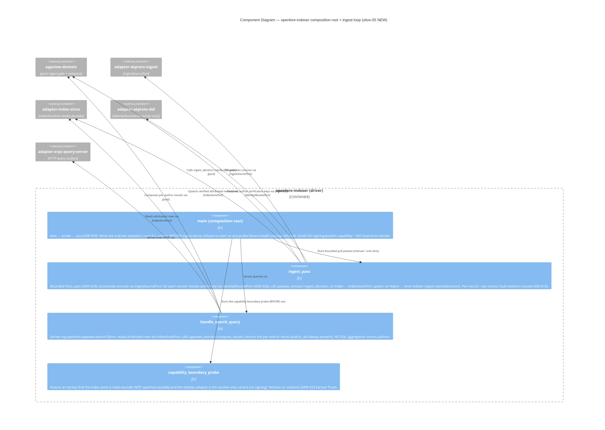

# Architecture Design — openlore-appview-search (slice-05)

- **Wave**: DESIGN
- **Date**: 2026-05-28
- **Architect**: Morgan (nw-solution-architect)
- **Feature**: openlore-appview-search (sibling feature; slice-05; the FINAL umbrella slice)
- **Style**: Hexagonal (Ports + Adapters), Modular Monolith — now TWO single-purpose binaries in one workspace (`openlore` CLI + `openlore-indexer`); inherits ADR-009
- **Paradigm**: Functional-leaning Rust — pure core + effect shell (inherits ADR-007)
- **Extends**: `docs/feature/openlore-scoring-graph/design/architecture-design.md` (slice-04)
- **Inherits**: All 22 ADRs (ADR-001..ADR-022), WD-1..WD-93 (cumulative), the 12 cross-feature invariants in `docs/product/architecture/brief.md`, the slice-03 I-FED-1..7 + slice-04 I-GRAPH-1..8 anti-merging invariants, and WD-100..WD-110 from this feature's DISCUSS
- **Proposes**: ADR-023 (AppView indexer = self-hostable single binary, signing-incapable), ADR-024 (pull-based bounded network ingestion — the ADR-016 Firehose re-evaluation), ADR-025 (network index = separate `index.duckdb` + anti-merging at network scale), ADR-026 (production PLC pubkey decode — resolving the slice-03 DV-4 seam), ADR-027 (`openlore search` verb + CLI→indexer HTTP/XRPC transport + graceful degradation)

This document is the architectural DELTA for slice-05. Slice-04's architecture
is the inherited baseline; everything not mentioned here is unchanged.
Implementation code is software-crafter's domain in DELIVER; this document
fixes contracts, boundaries, and trust gates.

Slice-05 is the **architecturally headline** slice of the umbrella: it
introduces the FIRST network service (the `openlore-indexer` binary), the
FIRST cross-process boundary, resolves the production PLC pubkey-decode
dependency deferred since slice-03, and carries the cardinal anti-merging
invariant (I-FED-1 → I-GRAPH-1/2) into its hardest failure surface yet — a
network-scale aggregating index. It does all of this while keeping the
local-first CLI structurally unaffected (the network surface is additive and
non-load-bearing for authoring; KPI-5).

## 1. AppView / indexer overview

Slice-05 closes the last unmet third of the J-001 push: claims today are
"unstructured, unsigned, and **undiscoverable**". Slices 01/02/04 solved
structure + signing; slice-03 solved MANUAL federation (own + subscribed
peers); but a great claim by an author the user has never subscribed to stayed
undiscoverable. Slice-05 closes the DISCOVERABILITY gap at NETWORK scale.

It adds an **AppView / indexer** — a separate, self-hostable binary
(`openlore-indexer`, ADR-023) — that:

1. **Ingests** PUBLIC signed claims from across the network via PULL-based
   bounded ingestion (ADR-024; NOT Firehose).
2. **Verifies** each claim's signature (against the author's REAL PLC
   DID-document key, ADR-026) AND recomputes its CID BEFORE indexing (WD-104 /
   KPI-AV-3) — reusing the PURE `claim-domain` verification core (no second
   verification path).
3. **Indexes** every verified record into a separate `index.duckdb` store with
   a non-`Option` `author_did` per row (ADR-025) — NO merged consensus schema
   (WD-103 / KPI-AV-2).
4. **Serves** network-scale discovery via an XRPC-style query method over HTTP
   (ADR-027), consumed by a new `openlore search` verb.

The CLI + signed claims REMAIN the source of truth. The indexer NEVER
overwrites, merges, signs, or publishes; it holds no signing capability by
construction (ADR-023, mirroring slice-02's `adapter-github` human-gate
I-SCR-1). Discovery is a front-door that FEEDS the slice-03 federation flow
(`openlore peer add`, reused verbatim — WD-110), not a replacement.

Three user-visible capabilities on the new `openlore search` verb (WD-109):

1. **Search by philosophy** — `search --object <philosophy>` (the headline,
   US-AV-002).
2. **Search by contributor / subject** — `search --contributor <did>` /
   `--subject <project>` (US-AV-003).
3. **Trust + act** — `--show <cid>` (verified-signature + CID-match display,
   US-AV-004), the `peer add` follow affordance (US-AV-005), `--share` (a
   stable query-encoding link, US-AV-006).

The architecture is an ADDITIVE EXTENSION, not a re-architecture:

- No new architectural STYLE (still hexagonal modular monolith; now two
  single-purpose binaries in one workspace).
- **A new self-hostable binary** (`openlore-indexer`) — the first network
  service (ADR-023). Signing-incapable by construction.
- **A new PURE crate** (`appview-domain`) for the index/search/ingest domain
  logic (the symmetric counterpart to slice-02 `scraper-domain` + slice-04
  `scoring`) + **a new EFFECT crate** (`adapter-index-store`) for the DuckDB
  index store.
- **A separate `index.duckdb` store** (ADR-025) — the user's `openlore.duckdb`
  is structurally untouched (WD-106).
- **The production PLC pubkey decode** (ADR-026) — resolving the slice-03 DV-4
  test-only seam; the pure multibase decode helper lands in `claim-domain`.
- **New ports** — `IngestSourcePort` (driven, network ingest), `IndexStorePort`
  (driven, index storage), `IndexQueryPort` (driven, CLI→indexer transport),
  `IdentityResolvePort` (driven, verify-only DID-doc → pubkey). New driving
  surfaces: the indexer's query API + the CLI's `search` verb.

## 2. Quality-attribute drivers

In priority order (derived from outcome-kpis.md + the cardinal WD-103/104 +
KPI-5):

| # | Quality | Driver | Architectural response |
|---|---|---|---|
| 1 | **Verified-before-index** (zero unverified claims indexed) | KPI-AV-3 cardinal guardrail; WD-104 load-bearing; extends KPI-FED-6 | Verification is an INGEST GATE (ADR-024): `claim_domain::verify(record, author_pubkey)` + CID recompute BEFORE insert, reusing the PURE core (no second path). The REAL PLC pubkey decode (ADR-026) makes it hold against real network authors. `verified_against NOT NULL` makes "every row verified" a schema invariant (ADR-025). Every result `[verified]` by construction. Release gate `indexer_rejects_unverified_claim`. |
| 2 | **Anti-merging at network scale** (zero attribution loss) | KPI-AV-2 cardinal guardrail; WD-103; extends I-FED-1 → I-GRAPH-1/2 | Single `indexed_claims` table, non-`Option` `author_did`, NO merged schema (ADR-025). Aggregates composed at query time from attributed rows, never stored merged. Three-layer enforcement (type / `no_cross_table_join_elides_author` extended to the index store / behavioral `network_result_preserves_attribution`). |
| 3 | **Local-first preserved despite the network shift** (offline authoring uncompromised) | KPI-5 cardinal guardrail; WD-106 | The indexer is a SEPARATE binary (ADR-023); the CLI links no indexer code; `search` is the ONLY network verb and degrades gracefully (ADR-027); the indexer reachability is a per-`search`-soft check, never a CLI-startup hard-fail. Release gate `local_first_preserved`. |
| 4 | **Discovery of unfollowed authors** (the north star) | KPI-AV-1 ≥60% of discovery sessions surface an unfollowed-author hit | The index aggregates many authors beyond the local graph (ADR-024 bounded ingest); search results label `(not subscribed)`; `search.discovery.unfollowed_author_hit` tracing event (DEVOPS); index-coverage dashboard for the sparsity diagnosis. |
| 5 | **Trust transparency** (the verification is VISIBLE) | KPI-AV-3 visible surface; WD-104; US-AV-004 | Every result carries `[verified]`; `--show <cid>` renders "Signature: VERIFIED against <did>" + "CID recomputed, matches published record" (the SAME pure-core verification result computed at ingest — no second path); a public-data banner up front (WD-105 / KPI-AV-5). |
| 6 | **Discovery → federation funnel** (discovery grows the trusted local graph) | KPI-AV-4 leading indicator; WD-110 | The follow affordance reuses slice-03 `peer add` VERBATIM (no parallel path, I-FED-5); render-only hint (no auto-follow); `search.discovery.follow_funnel` tracing event. |
| 7 | **Shareable discovery** (a discovery becomes a decision artifact) | KPI-AV-6 leading indicator; WD-110 | `--share` emits a stable QUERY-encoding link (not a snapshot); resolves to current per-author-attributed verified results (anti-merging across the share boundary); CLI-re-run resolver (web AppView OUT of scope). |
| 8 | **Public-data honesty** (framing comprehension) | KPI-AV-5; WD-105 | Public-data banner up front; the indexer reads only PUBLIC signed claims, exposes no surveillance affordance (the J-004 mitigation: the contributor is the SUBJECT of public claims, never a controller). |

Non-drivers for slice-05 (explicitly DEFERRED): cross-user / network-scale
SCORING (WD-79; the index ranks nothing — results are dimensional, ADR-025);
ATProto Firehose / real-time ingest (WD-108 / ADR-024 — pull suffices); a full
presentational web AppView (WD-100 scope line; OD-AV-6 — CLI-re-run resolver
only); a retraction-aware search FILTER (OD-AV-7 default: shown, not applied).

## 3. C4 Level 1 — System Context (extended for slice-05)

```mermaid
C4Context
    title System Context — OpenLore (slice-05 appview-search; extends slice-04)

    Person(user, "Network-Discovery User (P-002 primary + P-001 secondary)", "Researcher/Tech Lead OR Senior Engineer wearing the network-discovery hat; cold-start discovering aligned reasoning/people WITHOUT first knowing whom to follow")

    System(openlore, "OpenLore CLI", "Composes, signs, persists, publishes, federates, explores LOCALLY — AND now SEARCHES the network via the indexer. Source of truth; offline-capable; the ONLY signing surface.")
    System(indexer, "OpenLore Indexer (NEW; self-hostable single binary)", "Ingests PUBLIC signed claims from across the network, verifies signature + CID before indexing, serves network-scale discovery. Signing-INCAPABLE by construction; never overwrites/merges/publishes.")

    System_Ext(own_pds, "User's Own ATProto PDS", "Hosts the user's signed claims (slice-01). Contacted by the CLI for publish; NOT by search.")
    System_Ext(peer_pds, "Subscribed Peer PDS(es)", "slice-03 federation source; pulled by the CLI's `peer pull`.")
    System_Ext(network_pds, "Network Author PDSes + PLC Directory", "ARBITRARY network authors' PDSes + the PLC directory (DID documents). The indexer PULLS public claim records + RESOLVES author verification keys here (ADR-024/026).")
    System_Ext(fs, "Local Filesystem (XDG paths)", "openlore.duckdb (CLI, source of truth) + index.duckdb (indexer, re-buildable network index) — SEPARATE files (ADR-023/025).")

    Rel(user, openlore, "Authors/explores locally + searches the network via", "claim add | graph query (LOCAL) | search (NETWORK)")
    Rel(openlore, indexer, "Queries the network index over HTTP/XRPC (degrades gracefully if unreachable)", "org.openlore.appview.searchClaims")
    Rel(openlore, own_pds, "Publishes the user's signed claims to", "ATProto XRPC (CLI only)")
    Rel(openlore, peer_pds, "Pulls subscribed-peer claims from (slice-03)", "ATProto XRPC (CLI only)")
    Rel(openlore, fs, "Reads/writes openlore.duckdb (LOCAL, offline-capable)", "filesystem syscalls")

    Rel(indexer, network_pds, "PULLS public claim records + RESOLVES author verification keys from (ADR-024/026)", "ATProto XRPC + PLC HTTP")
    Rel(indexer, fs, "Reads/writes index.duckdb (re-buildable network index)", "filesystem syscalls")

    Rel(user, indexer, "(optionally) self-hosts + runs the ingest loop", "openlore-indexer ingest | serve")
```

What changed from slice-04's L1:

- **A NEW System: the OpenLore Indexer** — the first network service. It is a
  separate, self-hostable binary (ADR-023), signing-incapable by construction.
  This is the headline architectural shift (WD-107).
- **A NEW external boundary: Network Author PDSes + the PLC Directory** — the
  indexer pulls public records (ADR-024) and resolves arbitrary network authors'
  verification keys from their PLC DID documents (ADR-026). This is the highest-
  risk boundary in the slice (external, network-scale, adversarial-input-capable).
- **The CLI gains ONE network relationship to the indexer** (HTTP/XRPC, ADR-027)
  that degrades gracefully — and KEEPS all its slice-01..04 relationships
  unchanged. The CLI's offline authoring path is structurally untouched (KPI-5).
- **Two separate filesystem stores** — `openlore.duckdb` (CLI, source of truth)
  and `index.duckdb` (indexer, re-buildable) — owned by two binaries (ADR-023/025).

## 4. C4 Level 2 — Containers (extended for slice-05)

```mermaid
C4Container
    title Container Diagram — OpenLore (slice-05 — extends slice-04; now TWO binaries)

    Person(user, "Network-Discovery User", "P-002 primary + P-001 secondary (network-discovery hat)")

    System_Boundary(workspace, "OpenLore workspace (single Rust workspace; TWO shipped binaries)") {

      System_Boundary(cli_bin, "openlore (CLI binary — source of truth, offline-capable)") {
        Container(cli, "cli (driver)", "Rust + clap + reqwest", "EXTENDED: adds the `openlore search` verb (--object/--contributor/--subject/--show/--share); wires + soft-probes the HttpIndexQueryAdapter; reuses `peer add` for the follow funnel. The ONLY signing composition root.")
        Container(domain, "claim-domain (pure core)", "Rust", "EXTENDED: adds the PURE `decode_ed25519_multibase` helper (ADR-026); verify/CID UNCHANGED and REUSED by the indexer.")
        Container(lex, "lexicon (pure)", "Rust + serde", "EXTENDED: adds the `org.openlore.appview.searchClaims` XRPC query lexicon (a READ query; no signed payload).")
        Container(ports, "ports (pure traits)", "Rust", "EXTENDED: adds IndexQueryPort (CLI side) + IngestSourcePort/IndexStorePort/IdentityResolvePort (indexer side) + IndexedClaim/NetworkResultRow ADTs (non-Option author_did).")
        Container(adp_query, "adapter-index-query (effect, NEW)", "Rust + reqwest", "NEW (CLI side): implements IndexQueryPort over HTTP/XRPC to the indexer; treats unreachable as a soft non-fatal error (graceful degradation, ADR-027).")
        Container(adp_duckdb, "adapter-duckdb (effect)", "Rust + duckdb-rs", "UNCHANGED (the LOCAL store; the CLI's source of truth). The indexer does NOT touch it.")
        Container(adp_did, "adapter-atproto-did (effect)", "Rust", "EXTENDED: the verify-only DID-doc → pubkey resolution path (ADR-026) is added here (shared by CLI + indexer); the slice-03 test seam retained but release-forbidden.")
        Container(adp_pds, "adapter-atproto-pds (effect)", "Rust", "UNCHANGED for the CLI (publish/peer-pull).")
        Container(adp_clock, "adapter-system-clock (effect)", "Rust", "UNCHANGED")
      }

      System_Boundary(idx_bin, "openlore-indexer (NEW binary — network service; signing-INCAPABLE)") {
        Container(indexer_main, "openlore-indexer (driver, NEW)", "Rust + tokio + reqwest", "NEW composition root: wires + probes the ingest source, index store, verify-only identity, and the HTTP query server; runs the pull-ingest loop + serves queries. Holds NO signing/publish capability + NO local-store handle (ADR-023).")
        Container(appview, "appview-domain (pure core, NEW)", "Rust", "NEW: pure ingest-gate logic (verify+CID decision), pure search/grouping/anti-merging logic, pure result-shaping. NO I/O. The symmetric counterpart to scraper-domain/scoring.")
        Container(adp_ingest, "adapter-atproto-ingest (effect, NEW)", "Rust + reqwest", "NEW: implements IngestSourcePort — bounded PULL of public org.openlore.claim records from network sources (ADR-024); read-only; no write surface.")
        Container(adp_index_store, "adapter-index-store (effect, NEW)", "Rust + duckdb-rs", "NEW: implements IndexStorePort over the SEPARATE index.duckdb (ADR-025); non-Option author_did rows; anti-merging-preserving queries.")
        Container(adp_query_server, "adapter-xrpc-query-server (effect, NEW)", "Rust + (axum/hyper)", "NEW: serves org.openlore.appview.searchClaims over HTTP; per-result author_did always present (anti-merging across the transport).")
      }
    }

    ContainerDb_Ext(duckdb_file, "openlore.duckdb", "Embedded DuckDB file (CLI)", "Source of truth: claims + peer_claims + slice-03/04 tables. The indexer NEVER touches this (ADR-023/WD-106).")
    ContainerDb_Ext(index_file, "index.duckdb", "Embedded DuckDB file (indexer, NEW)", "Re-buildable network index: indexed_claims (non-Option author_did) + evidence/references (ADR-025). NO merged/consensus schema.")
    System_Ext(network, "Network Author PDSes + PLC Directory", "Arbitrary authors' public claim records + DID documents (verification keys).")

    Rel(user, cli, "Runs claim/graph/search commands at", "TTY")
    Rel(user, indexer_main, "(optionally) self-hosts + runs ingest/serve", "TTY")

    Rel(cli, adp_query, "Wires + soft-probes + uses for network search", "IndexQueryPort")
    Rel(adp_query, adp_query_server, "Queries over HTTP/XRPC (degrades gracefully if unreachable)", "org.openlore.appview.searchClaims")
    Rel(cli, domain, "Calls decode_ed25519_multibase + verify/CID + render helpers", "pure calls")
    Rel(cli, adp_duckdb, "LOCAL source of truth (UNCHANGED)", "StoragePort")

    Rel(indexer_main, appview, "Calls pure ingest-gate + search/grouping logic", "pure calls")
    Rel(indexer_main, adp_ingest, "Wires + probes + uses for bounded pull ingest", "IngestSourcePort")
    Rel(indexer_main, adp_index_store, "Wires + probes + uses for index read/write", "IndexStorePort")
    Rel(indexer_main, adp_did, "Wires + probes + uses for verify-only DID-doc → pubkey", "IdentityResolvePort")
    Rel(indexer_main, adp_query_server, "Wires + probes + serves queries via", "HTTP")

    Rel(adp_ingest, network, "PULLS public org.openlore.claim records from", "ATProto XRPC")
    Rel(adp_did, network, "RESOLVES author DID documents (verification keys) from", "PLC HTTP (ADR-026)")
    Rel(adp_index_store, index_file, "Reads/writes verified attributed records (NO merged row)", "embedded DuckDB")
    Rel(adp_duckdb, duckdb_file, "Reads/writes the LOCAL source of truth", "embedded DuckDB")

    Rel(indexer_main, domain, "Calls the SAME pure claim_domain::verify + compute_cid (no second path)", "pure calls")
```

What changed from slice-04's L2:

- **A NEW binary boundary `openlore-indexer`** with FOUR new containers
  (`appview-domain` pure core, `adapter-atproto-ingest`, `adapter-index-store`,
  `adapter-xrpc-query-server`) — the network service. It is signing-incapable and
  holds no local-store handle (ADR-023, enforced).
- **The CLI gains `adapter-index-query`** (the HTTP/XRPC client to the indexer,
  graceful-degrading) and the `search` verb; everything else CLI-side is unchanged
  or minimally extended.
- **`claim-domain` EXTENDED** with the PURE `decode_ed25519_multibase` helper
  (ADR-026); its `verify`/`compute_cid` are UNCHANGED and REUSED by the indexer (no
  second verification path).
- **`adapter-atproto-did` EXTENDED** with the verify-only production DID-doc →
  pubkey resolution path (ADR-026), shared by CLI + indexer; the slice-03 test seam
  retained but release-forbidden.
- **Two separate DuckDB files**, owned by two binaries. The indexer's
  `index.duckdb` is re-buildable; the CLI's `openlore.duckdb` is the source of
  truth the indexer cannot touch.

## 5. C4 Level 3 — Components (complex subsystems only)

Slice-05 has TWO L3-worthy subsystems (5+ internal components each): the
indexer's `appview-domain` pure core (the load-bearing verified-ingest +
anti-merging surface) and the indexer composition root (the wire-probe-use
seam + the ingest loop).

### 5.1 Component diagram — `appview-domain` (pure core; NEW)

```mermaid
C4Component
    title Component Diagram — appview-domain (pure core; slice-05 NEW)

    Container_Boundary(appview, "appview-domain (pure core)") {
        Component(ingest_gate, "ingest_decision", "Pure fn", "ingest_decision(record, resolved_key) -> IngestOutcome. The PURE verify-before-index decision: calls claim_domain::verify + compute_cid; returns Index{IndexedClaim} | Reject{reason}. Deterministic; no I/O. The single trust gate (WD-104).")
        Component(search_compose, "compose_results", "Pure fn", "compose_results(rows: Vec<IndexedClaim>, dimension) -> NetworkSearchResult. Groups by author (or subject under author); computes distinct_author_count; NEVER merges authors. The anti-merging-at-query composition (WD-103).")
        Component(suggest, "near_match_suggestion", "Pure fn", "For an empty dimension result, computes a near-match suggestion (edit distance over known object/subject values) — US-AV-002 Example 4.")
        Component(counter_annot, "annotate_counter_relationship", "Pure fn", "Given the references graph, annotates 'countered-by <cid> (by <did>)' when both are indexed (OD-AV-7: shown, never applied as a filter).")
        Component(adts, "ADTs", "types", "IndexedClaim {author_did: Did, cid: Cid, subject, object, predicate, confidence: f64, verified_against: KeyId, ...}; NetworkResultRow {author_did: Did, ...}; NetworkSearchResult {by_author: Vec<(Did, Vec<NetworkResultRow>)>, distinct_author_count, total}; IngestOutcome {Index(IndexedClaim) | Reject(RejectReason)}. author_did is non-Option EVERYWHERE.")
    }

    Container_Ext(domain_ext, "claim-domain", "verify + compute_cid + decode_ed25519_multibase (PURE, reused)")
    Container_Ext(ports_ext, "ports", "IndexedClaim source type")
    Container_Ext(indexer_ext, "openlore-indexer (driver)", "calls ingest_decision at ingest; compose_results at query")

    Rel(indexer_ext, ingest_gate, "At ingest: ingest_decision(record, resolved_key)", "pure call")
    Rel(ingest_gate, domain_ext, "Calls verify + compute_cid (the SAME pure core; no second path)", "")
    Rel(indexer_ext, search_compose, "At query: compose_results(rows, dimension)", "pure call")
    Rel(search_compose, counter_annot, "Annotates counter relationships via", "")
    Rel(search_compose, suggest, "On empty result, computes a suggestion via", "")
    Rel(ingest_gate, adts, "Returns IngestOutcome over", "")
    Rel(search_compose, adts, "Returns NetworkSearchResult over", "")
```

Specification-level invariants for `appview-domain` (the pure core):

1. **No I/O, ever.** `appview-domain` depends only on `std` + pure value types
   from `ports`/`claim-domain`. It MUST appear in the `xtask check-arch` pure-core
   allowlist (I-1/I-2). Compile error if it touches `duckdb`, `tokio`, `reqwest`,
   `std::fs`, `std::net`. (Like `scraper-domain` + `scoring`.)
2. **The ingest decision reuses the SAME pure verification core (WD-104).**
   `ingest_decision` calls `claim_domain::verify` + `claim_domain::compute_cid` —
   there is NO second verification path. A record is `Index` ONLY if both pass;
   otherwise `Reject{reason}`. Property test `ingest_rejects_unverified`.
3. **Anti-merging at the type level (WD-103).** `IndexedClaim`, `NetworkResultRow`
   carry non-`Option<Did>` `author_did`. `compose_results` returns a per-author
   structure (`by_author: Vec<(Did, Vec<NetworkResultRow>)>`); there is NO API that
   returns a merged multi-author row. The aggregate (`distinct_author_count`) is a
   COUNT over attributed rows, never a merge. Property test
   `compose_preserves_every_author`.
4. **Determinism.** `ingest_decision` and `compose_results` are pure functions of
   their inputs; same input → byte-identical output. Property test.
5. **Counter shown, not applied (OD-AV-7).** `annotate_counter_relationship` adds
   an annotation; it NEVER removes/filters/down-weights a row. A countered claim
   stays in the result. Unit test `countered_claim_still_appears`.

### 5.2 Component diagram — `openlore-indexer` composition root + ingest loop (NEW)



Specification-level invariants for `openlore-indexer` (the composition root):

1. **Wire → probe → use (ADR-009), second composition root.** ALL driven-adapter
   probes run BEFORE the first ingest pass or query is served. Any probe failure →
   `health.startup.refused` + exit 2.
2. **Capability boundary enforced at startup (ADR-023).** The `capability_boundary_probe`
   asserts the store is `index.duckdb` and the identity adapter is resolve-only;
   refuses on violation. The indexer cannot wire a signing identity or the user's
   local store.
3. **Verified-before-index gate (WD-104).** A record is upserted ONLY after
   `appview_domain::ingest_decision` returns `Index`; a `Reject` never reaches the
   store. The store rows carry `verified_against` (every row was verified).
4. **No SQL aggregation across authors (WD-103).** `handle_search_query` reads
   per-author-attributed rows and composes in the PURE core; the index-store SQL
   NEVER `GROUP BY author` / merges. Enforced by the extended xtask rule.
5. **Per-record / per-source fault isolation (ADR-024, reuses ADR-016).** A bad
   record/source is rejected/skipped in isolation; the pass continues.

## 6. Integration patterns

### 6.1 Internal — new ports

| Port | Side | Status | Surface | Notes |
|---|---|---|---|---|
| `IndexQueryPort` | CLI (driven) | NEW | `search(dimension, value, cid?) -> Result<NetworkSearchResult, IndexQueryError>` | The CLI→indexer transport. `IndexQueryError::Unreachable` is a SOFT non-fatal outcome (graceful degradation, ADR-027). |
| `IngestSourcePort` | indexer (driven) | NEW | `enumerate(source) -> Result<Vec<RawRecord>, IngestError>` | Bounded PULL of public records (ADR-024); read-only; no write surface. |
| `IndexStorePort` | indexer (driven) | NEW | `upsert(IndexedClaim)`; `query_by_object/contributor/subject(value) -> Vec<IndexedClaim>`; `get_by_cid(cid)` | Index read/write over `index.duckdb` (ADR-025). Every method projects/returns non-`Option` `author_did`. NO method aggregates across authors. |
| `IdentityResolvePort` | shared (driven) | NEW | `resolve_verification_key(did) -> Result<VerificationKey, ResolveError>` | Verify-only DID-doc → pubkey (ADR-026); production PLC `z6Mk...` decode. NO signing surface. |

The shared boundary value (defined in `ports`, consumed by `appview-domain`, the
adapters, and the renderers):

```
IndexedClaim {
    author_did: Did,            // non-Option; LOAD-BEARING (anti-merging, WD-103)
    cid: Cid,
    subject: String,
    predicate: String,
    object: String,
    confidence: f64,            // numeric [0.0, 1.0] (WD-10 / I-6)
    composed_at: DateTime<Utc>,
    verified_against: KeyId,    // the DID-doc key id the signature verified against (ADR-026); never empty (WD-104)
    evidence: Vec<String>,
    references: Vec<ClaimReference>,   // for the OD-AV-7 counter annotation
    relationship: AuthorRelationship,  // You | SubscribedPeer | UnsubscribedCache | NetworkUnfollowed (slice-03 reuse + 1 variant)
}
```

Dispatch model:

- `IndexQueryPort` (CLI side) is ASYNC (network I/O via `reqwest`).
- `IngestSourcePort` + `IdentityResolvePort` (indexer side) are ASYNC (network).
- `IndexStorePort` is SYNC (local DuckDB, like `StoragePort`).
- `appview-domain` is a plain pure function library; no trait, no dispatch.

### 6.2 External — TWO new boundaries (the highest-risk surfaces)

Slice-05 adds the FIRST external/cross-process integrations since the slice-01
PDS/keychain and slice-02 GitHub. Per principle 10, external integrations are
the highest-risk boundary; both are annotated for contract testing:

1. **CLI → Indexer (HTTP/XRPC, `org.openlore.appview.searchClaims`, ADR-027)** — a
   cross-process boundary (same org, two binaries). Consumer-driven contract: the
   CLI is the consumer; the indexer's query server is the provider.
2. **Indexer → Network Author PDSes + PLC Directory (ADR-024/026)** — the external,
   adversarial-input-capable boundary. The indexer consumes `listRecords`-style
   record enumeration + PLC DID-document resolution. Contract tests pin the record
   + DID-document response shapes the verify-before-index gate depends on.

### 6.3 Probe contracts for the NEW adapters

Every new adapter ships a `probe()` within the 250ms budget (ADR-009 I-4/I-5),
each exercising its catalogued substrate-lie scenario:

| Adapter | Probe exercises (incl. the substrate-lie / "what if X lies?" check) |
|---|---|
| `adapter-index-store` (`IndexStorePort`) | (a) schema-version + fsync honored on the deployment substrate (the indexer likely runs in a CONTAINER — Docker overlayfs `fsync` no-op / WSL2 DrvFs / tmpfs lie; refuse with `storage.fsync_unhonored` if the substrate lies about durability); (b) attribution round-trip — two rows, same (subject,object), distinct non-empty `author_did`s read back byte-equal (anti-merging substrate check); (c) no-merge-schema assertion — NO `consensus`/`merged` table exists. |
| `adapter-atproto-ingest` (`IngestSourcePort`) | (a) source reachability + enumeration shape against a fixture source; (b) **the network-lies check** — a fixture source returns a tampered-signature record AND a CID-mismatch record; the probe asserts the ingest path REJECTS both before the index (the verified-before-index gate is PROVEN, not trusted). |
| `adapter-atproto-did` (`IdentityResolvePort`, extended) | (a) resolve a FIXTURE DID document with a real `z6Mk...` value, decode it, assert the key VERIFIES a known-good signature AND REJECTS a tampered one (ADR-026 — proves the REAL decode, not the test seam); (b) the gold test runs the REAL decode path (a probe passing only against the seam is a CI failure). |
| `adapter-xrpc-query-server` (HTTP query surface) | (a) bind + serve a fixture query; (b) the response shape carries per-result `author_did` (anti-merging across the transport — a response that dropped it is a contract violation caught at probe time). |
| `adapter-index-query` (`IndexQueryPort`, CLI side) | (a) reachable fixture indexer returns the expected XRPC shape with `author_did` present; (b) **the inverted/degradation check** — an UNREACHABLE indexer yields `IndexQueryError::Unreachable` (soft, non-fatal), NOT a startup refusal (the CLI MUST start without a reachable indexer; KPI-5). A CLI that hard-refused on an unreachable indexer is a regression the probe catches. |

The substrate gold-test matrix (ADR-009) extends with two slice-05-specific
substrate concerns:

- **The network lies** (ADR-024/026): the network WILL serve tampered/fabricated
  records and the indexer resolves keys for authors it has never met. The ingest +
  identity-resolve probes exercise the LIE explicitly (reject the tampered record;
  verify against the real decoded key). This is the slice-05 "what happens if the
  environment lies?" applied to its highest-risk boundary.
- **The container substrate lies about durability** (ADR-001 carried forward): the
  indexer is likely to run in a container; the index-store probe exercises the
  overlayfs/DrvFs/tmpfs `fsync` no-op and refuses to start if durability is unhonored.

### 6.4 Contract test recommendation (handoff to platform-architect)

```
External Integrations Requiring Contract Tests (slice-05):
- OpenLore Indexer query API (XRPC org.openlore.appview.searchClaims over HTTP):
  consumer-driven contract — the `openlore` CLI is the consumer, the indexer's
  query server is the provider. Pin the response shape (every result carries
  author_did; no merged/consensus object) so an indexer change that drops
  attribution is caught at build time, not in production. Recommended: a
  Pact-style consumer-driven contract in the CI acceptance stage.
- Network Author PDS listRecords + PLC Directory DID-document resolution
  (indexer is the consumer): contract tests pinning the record-enumeration
  response shape AND the DID-document/publicKeyMultibase shape the verify-
  before-index gate + the ADR-026 decode depend on. Breaking changes in the
  ATProto/PLC response shapes would silently break ingest verification.
  Recommended: consumer-driven contracts against recorded fixtures (the
  hermetic ingest fixtures already model these shapes).
Confirm the local-first guardrail (KPI-5): the `openlore` CLI's compose/sign/
local-query path links NO indexer code and adds NO network dependency; `search`
is the only network verb and degrades gracefully.
```

## 7. Deployment architecture (the shift: now TWO binaries)

Slice-05 ships TWO single-purpose binaries from one workspace:

```
openlore                # the CLI (source of truth; offline-capable). UNCHANGED footprint + ONE new verb.
openlore-indexer        # NEW self-hostable network service (signing-incapable).

~/.local/share/openlore/
  openlore.duckdb        # CLI source of truth (UNCHANGED). The indexer never touches it.
  claims/<cid>.json      # user's own claims (UNCHANGED)
  peer_claims/<did>/<cid>.json   # subscribed-peer claims (UNCHANGED)

<indexer data dir, e.g. ~/.local/share/openlore-indexer/ or a configured path>
  index.duckdb           # NEW: re-buildable network index (indexed_claims; non-Option author_did; NO merged schema)
  indexed_claims/<did>/<cid>.json   # verified network-claim artifact (partitioned by author DID, like peer_claims/)

~/.config/openlore/
  identity.toml          # UNCHANGED for the CLI; the indexer reads its OWN config (sources, relay, listen addr, PLC endpoint)
```

- The CLI's distribution + offline operation is UNCHANGED (KPI-5): it needs no
  indexer to compose/sign/publish/query-locally.
- The indexer is a NEW deployable (ADR-011 release matrix gains one artifact). For
  the walking skeleton it ships as a `cargo run -p openlore-indexer`-able dogfood
  tool (`openlore-indexer serve` to run the query server + ingest loop;
  `openlore-indexer ingest` for a one-shot pass). A packaged service (systemd/launchd
  unit) is a future concern.
- DEVOPS plans for the new deployable per ADR-023 (self-hostable single binary) +
  the index-coverage/freshness dashboard (the KPI-AV-1 sparsity diagnosis).
- The index store is RE-BUILDABLE (re-ingest); its backup story is "re-ingest", not
  "back up" — distinct from the CLI's source-of-truth store.

## 8. Quality attribute scenarios (ATAM-light; slice-05)

| QA | Scenario | Architectural response | Sensitivity / trade-off |
|---|---|---|---|
| Verified-before-index | A fixture source serves an unsigned + a tampered-signature + a CID-mismatch record; none enter the index nor any search result | `ingest_decision` calls the PURE `claim_domain::verify` + CID recompute; only `Index` reaches the store; `verified_against NOT NULL` (5.2 #3, ADR-024/025/026) | Sensitivity: a second verification path could drift. Mitigation: reuse the pure core (no second path); the ingest + identity probes exercise the lie; `indexer_rejects_unverified_claim` release gate (KPI-AV-3). |
| Anti-merging at network scale | An `--object` query over a (subject,object) with 2 distinct-author claims returns TWO attributed rows; NO "the network says X" consensus row exists anywhere | Single `indexed_claims` table, non-`Option` author_did, NO merged schema; `compose_results` groups by author, never merges (5.1 #3, ADR-025) | Sensitivity: a future dev could write a `GROUP BY object` SQL that drops author_did. Mitigation: three-layer enforcement (type, the extended `no_cross_table_join_elides_author` xtask rule on the index store, behavioral `network_result_preserves_attribution`). |
| Local-first preserved | With the indexer down AND network disabled, `claim add`/offline `claim publish`/`graph query` all succeed; `search` prints a clear local-only message, no fatal error | The CLI links no indexer code; `search` is the only network verb; `IndexQueryError::Unreachable` is soft; the indexer probe is skipped-or-soft at CLI startup (ADR-027) | Sensitivity: probing the indexer at every CLI startup would block `claim add`. Mitigation: per-`search`-soft check, not a CLI-startup hard gate; `local_first_preserved` release gate (KPI-5). |
| Real-author verification | A network author the indexer has never met publishes a signed claim; ingest resolves their REAL PLC `z6Mk...` key and verifies | `IdentityResolvePort::resolve_verification_key` resolves the PLC DID document + decodes the multibase key (ADR-026); the pure `decode_ed25519_multibase` helper feeds `claim_domain::verify` | Sensitivity: trusting a key derived from the (forgeable) `author` field. Mitigation: the trust anchor is the PLC-resolved DID doc, never the record; the `no_pubkey_seam_in_release_build` guard ensures production uses the real decode. |
| Discovery of unfollowed authors | A search surfaces a relevant claim by an author the user does not follow, labeled `(not subscribed)`, with a `peer add` affordance | Bounded ingest (ADR-024) populates beyond the local graph; the relationship label distinguishes followed/unfollowed; the follow affordance reuses `peer add` | Sensitivity: a sparse/local-biased index surfaces nothing new (KPI-AV-1 risk). Mitigation: index-coverage dashboard; seed-set + relay config; the <20% disprover triggers a coverage re-investigation. |
| Graceful degradation | The indexer is unreachable mid-session; `search` degrades to local-only and never hangs | `adapter-index-query` maps unreachable to a soft `Unreachable`; `VerbSearch` prints the local-only pointer; exits non-fatally (ADR-027) | Trade-off: no network results when the indexer is down. Accepted — this IS the contract; the CLI's core value needs no indexer. |
| Shareable, attribution-preserving | A shared `--share` link opened a week later resolves to CURRENT verified results (incl. new claims), never a stale merged snapshot | `--share` encodes the QUERY (not a snapshot); the resolver re-runs the query, re-composing per-author rows (ADR-027 / WD-110) | Sensitivity: encoding a result snapshot would lose attribution + go stale. Mitigation: query-encoding only; `share_link_encodes_query_not_snapshot` test (KPI-AV-6). |

## 9. THE ADR-016 Firehose re-evaluation — PULL, not Firehose (decision + trade-off)

ADR-016 locked OUT push subscriptions for slice-03 with a "re-evaluate at
slice-05" note. Slice-05 is that re-evaluation. **Decision: PULL-based bounded
ingestion. ATProto Firehose is a documented FUTURE option, NOT slice-05's
mechanism.** Recorded as WD-114; rationale in ADR-024.

### Trade-off table

| Factor | PULL-based bounded ingestion — **CHOSEN** | ATProto Firehose (push subscription) |
|---|---|---|
| **Walking-skeleton sufficiency (WD-108)** | The corpus needs to EXIST, be VERIFIED, and be SEARCHABLE; HOW claims arrive is invisible to the user-visible contract. Bounded pull suffices to validate the J-005 discovery thesis (KPI-AV-1). | Over-provisioned: real-time freshness is not on the slice-05 critical path (KPI-AV-1 is a per-session discovery-rate metric, not a freshness metric). |
| **Complexity** | A bounded enumeration + verify + upsert pass; no persistent connection, no cursor/sequence/reconnect/back-pressure state machine. | Reconnection logic, cursor/sequence management, ordering, back-pressure, firehose framing — substantial protocol complexity orthogonal to the J-005 hypothesis. |
| **Daemon shape** | "A process that runs a bounded pull loop" — far simpler to reason about/test/bound than a firehose consumer. Affirms the ADR-016 non-daemon-leaning ethos. | Pushes the indexer toward an always-on reconnecting daemon. |
| **Testability (verified-before-index gate)** | A bounded pull over an enumerable source set is deterministic + hermetically testable (a fixture relay returns a known record set, incl. adversarial fixtures for `indexer_rejects_unverified_claim`). | A firehose stream is harder to model hermetically; the verify gate is the same, but the ingest harness is heavier. |
| **Coverage / freshness** | Coverage is a config concern (seed set + relay); staleness window is OBSERVABLE (ingest-lag dashboard). | Real-time freshness — the only genuine advantage, but not on the slice-05 critical path. |
| **Reversibility** | A Firehose mode is purely ADDITIVE later (revisit trigger in ADR-024) if real-time freshness becomes a JTBD. | Premature now; the right call only when evidence (not speculation) shows pull's staleness is the bottleneck. |

**Conclusion**: PULL is the conservative, evidence-driven, scope-tight call — it
reuses the slice-03 verification discipline verbatim, keeps ingest hermetically
testable (essential for the cardinal KPI-AV-3 gate), avoids daemon/reconnection
complexity, and leaves Firehose as a documented additive future option. This
mirrors the slice-04 "AUGMENT, don't swap" conservatism applied to ingest.

## 10. Earned Trust summary (slice-05)

slice-05 adds the FIRST network service + the FIRST adversarial-input external
boundary — the highest Earned-Trust surface in the umbrella. Per principle 12,
every dependency the indexer does not probe is an act of faith made for the
user; the design probes all of them.

| Adapter | Probe exercises (the "what if X lies?" check) |
|---|---|
| `adapter-index-store` (`IndexStorePort`) | fsync honored on the container substrate (overlayfs/DrvFs/tmpfs lie → refuse); attribution round-trip (anti-merging substrate check); no-merge-schema assertion. |
| `adapter-atproto-ingest` (`IngestSourcePort`) | **the network lies**: a fixture source's tampered + CID-mismatch records are REJECTED at ingest (the verified-before-index gate proven). |
| `adapter-atproto-did` (`IdentityResolvePort`) | **the network lies about a key**: a real `z6Mk...` DID-doc decodes + verifies a good signature AND rejects a tampered one; the gold test runs the REAL decode (a seam-only pass is a CI failure). |
| `adapter-xrpc-query-server` / `adapter-index-query` | per-result `author_did` present across the transport (anti-merging); an unreachable indexer degrades softly, never a CLI hard-fail (the inverted-probe / KPI-5 check). |

The pure `appview-domain` core has no `probe()` (it touches no substrate); its
Earned-Trust analog is property + mutation testing (TDD RED→GREEN is Earned
Trust applied to code; mutation testing is Earned Trust applied to the tests):

- `ingest_rejects_unverified`, `compose_preserves_every_author`,
  `countered_claim_still_appears`, plus mutation testing on `ingest_decision` +
  `compose_results`. The pure `decode_ed25519_multibase` helper (in `claim-domain`)
  is property/mutation-tested (decode∘encode identity; malformed input errors,
  never panics/mis-decodes).

Three-layer enforcement of the anti-merging-at-network-scale invariant (I-AV-2),
extending slice-03 WD-30 / ADR-014 + slice-04 WD-88 / ADR-022:

1. **Type-level**: `IndexedClaim`/`NetworkResultRow.author_did` is `Did`, not
   `Option<Did>`; `compose_results` returns a per-author structure with no merged
   row API. Compile error if dropped.
2. **Structural**: `xtask check-arch` rule `no_cross_table_join_elides_author`
   EXTENDS to the `adapter-index-store` SQL string literals (no author-eliding
   aggregate over `indexed_claims`).
3. **Behavioral**: release-gate integration test `network_result_preserves_attribution`
   (DISTILL; KPI-AV-2). A single-layer bypass is caught by ≥1 other.

Plus the slice-05-specific capability-boundary enforcement (I-AV-5, ADR-023),
likewise three-layer (type: verify-only port; structural: `xtask check-arch`
`indexer_holds_no_signing_or_local_store`; behavioral: the composition-root
capability probe), and the verified-before-index enforcement (I-AV-1) via the
ingest gate + `verified_against NOT NULL` + the `indexer_rejects_unverified_claim`
release gate.

## 11. slice-05 invariants (I-AV-*)

See `component-boundaries.md` §"Cross-component invariants" for the full table
with enforcement columns. Summary:

| # | Invariant | Cardinal? |
|---|---|---|
| I-AV-1 | **Verified-before-index**: signature-verified (against the REAL PLC key) + CID-recomputed BEFORE any record enters the index; reuses the pure core (no second path); every result `[verified]` by construction; `verified_against NOT NULL`. | YES (KPI-AV-3) |
| I-AV-2 | **Anti-merging at network scale**: every indexed/searched/shared result carries a non-`Option` author DID; NO merged consensus schema/row anywhere; identical-content-different-author = separate rows. Three-layer enforced; extends I-FED-1 / I-GRAPH-1/2. | YES (KPI-AV-2) |
| I-AV-3 | **Local-first preserved**: the CLI links no indexer code; `search` is the only network verb + degrades gracefully; offline compose/sign + local query unaffected; the indexer is not probed at CLI startup. | YES (KPI-5) |
| I-AV-4 | **Public-data-only**: the indexer ingests ONLY public signed claims, reads no private data, exposes no surveillance affordance; the public-data banner surfaces the expectation honestly. | guardrail (KPI-AV-5) |
| I-AV-5 | **Indexer signing-incapable + holds no local store** (ADR-023; mirrors I-SCR-1): the indexer cannot author/sign/mutate/publish a claim and cannot touch `openlore.duckdb`; enforced at three layers. | structural |
| I-AV-6 | **Production pubkey decode is real** (ADR-026): production verification resolves + decodes the author's REAL PLC `z6Mk...` DID-doc key; the test seam is release-forbidden (`no_pubkey_seam_in_release_build`). | structural (KPI-AV-3 against real data) |
| I-AV-7 | **Discovery feeds federation via `peer add` verbatim** (WD-110; reuses I-FED-5): the follow affordance is a render-only hint printing the slice-03 command; no parallel subscription path; no auto-follow. | behavioral (KPI-AV-4) |
| I-AV-8 | **Shareable link encodes the query, not a snapshot** (WD-110): `--share` encodes the query dimension+value; resolving re-composes current per-author-attributed verified results; never a stored merged snapshot. | behavioral (KPI-AV-6) |
| I-AV-9 | **Counter shown, not applied** (OD-AV-7): a countered/retracted public verified claim is indexed + discoverable; the counter relationship is annotated when known, never silently filtered/down-weighted. | behavioral |

These extend the 12 cross-feature invariants in
`docs/product/architecture/brief.md` + slice-03 I-FED-1..7 + slice-04
I-GRAPH-1..8. They are slice-05-scoped; promotion to the brief's I-1..I-12 table
is not required (the meta-invariants — pure-core isolation, probe contract,
anti-merging enforcement model, composition-root rule — are already covered and
inherited). I-AV-2 is the direct descendant of I-FED-1 / I-GRAPH-2; if a future
slice needs anti-merging-at-network-scale enforced cross-feature, promote it with
the ADR that generalizes it.

## 12. Open questions for DELIVER

Deferred to DELIVER (software-crafter's call within the locked contracts):

1. **Exact `index.duckdb` migration SQL + the `indexed_claims/<did>/<cid>.json`
   filesystem encoding** (the DID→safe-filename scheme; reuse the slice-03
   `did_plc_...` encoding). ADR-025 fixes the schema shape + the anti-merging
   constraints; the exact DDL is DELIVER's, subject to the index-store probe.
2. **The HTTP query server framework** (`axum` vs `hyper` vs a minimal handler).
   ADR-027 fixes the XRPC method + the response shape (per-result `author_did`);
   the framework is DELIVER's within the rustls/`reqwest`-ecosystem + `cargo deny`
   allowlist.
3. **The `openlore://search?...` link format + the CLI re-run parser** (exact query-
   string grammar). ADR-027 fixes the query-encoding-not-snapshot contract;
   DELIVER fills the exact format DISTILL asserts.
4. **The ingest cadence defaults** (`--ingest-interval`, batch size). ADR-024 fixes
   the bounded-pull contract + per-record fault isolation; DELIVER tunes the
   defaults against the freshness budget.
5. **Whether `search --object`/`--contributor`/`--subject` are one `IndexQueryPort`
   method with a dimension enum or three thin methods.** Recommended: one filtered
   method (smaller anti-merging enforcement surface, mirroring slice-04's
   `ScoringFilter` recommendation); DELIVER confirms.
6. **The PLC directory endpoint config + DID-method support boundary** (ADR-026:
   `did:plc:*` Ed25519 only; unsupported types rejected explicitly). DELIVER fixes
   the config key + the explicit rejection messages DISTILL asserts.
7. **Whether `search` degraded-mode DELEGATES to local `graph query` or just POINTS
   to it** (US-AV-002 Example 3 allows either). DELIVER's call against DISTILL
   scenarios; the contract is "clear local-only message, no hang, no fatal error".
8. **Whether a once-per-user first-search orientation message ships** (mirroring the
   slice-03/04 OrientationState keys in identity.toml). Optional; not load-bearing;
   DELIVER's call.

## 13. Open questions explicitly LOCKED (out of scope per DISCUSS / this DESIGN)

- **ATProto Firehose / real-time ingest** — deferred (WD-108 / ADR-024); pull
  suffices; documented additive revisit trigger.
- **A full presentational web AppView** — locked OUT (WD-100 scope line; OD-AV-6);
  the `--share` resolver is CLI re-run only.
- **Cross-user / network-scale SCORING** — deferred (WD-79); the index ranks
  nothing; results are dimensional. A future scoring would read `indexed_claims` in
  a PURE core + persist nothing merged (WD-72 carries forward).
- **A merged / consensus / aggregate row or table** — hard-rejected (WD-103 /
  ADR-025); the load-bearing absence.
- **A hosted/community indexer (central authority)** — deferred (ADR-023); the
  walking skeleton is self-hostable single-binary; hosted is an additive future
  option (the CLI talks to a configured URL).
- **A retraction-aware search FILTER** — deferred (OD-AV-7 / I-AV-9); countered
  claims appear normally; the counter is shown, not applied.
- **The indexer reusing the user's `openlore.duckdb`** — rejected (ADR-023/025);
  separate `index.duckdb`.
- **A second verification path in the indexer** — hard-rejected (WD-104 / ADR-026);
  reuse the pure `claim-domain::verify` core.

## 14. References

- `docs/feature/openlore-appview-search/feature-delta.md` — DISCUSS-wave locks (WD-100..WD-110, OD-AV-1..7) + the DESIGN-wave sections appended this wave
- `docs/feature/openlore-appview-search/discuss/user-stories.md` — US-AV-001..006
- `docs/feature/openlore-appview-search/discuss/outcome-kpis.md` — KPI-AV-1..6
- `docs/feature/openlore-appview-search/discuss/journey-discover-across-the-network-visual.md`
- `docs/feature/openlore-appview-search/discuss/story-map.md`, `shared-artifacts-registry.md`
- `docs/feature/openlore-appview-search/design/component-boundaries.md` — DELTA (new crates + ports + composition roots)
- `docs/feature/openlore-appview-search/design/data-models.md` — the index schema + the search-result/ingest ADTs (anti-merging-preserving)
- `docs/feature/openlore-appview-search/design/technology-stack.md` — transport, ingestion, storage, pubkey-decode decisions
- `docs/feature/openlore-appview-search/design/wave-decisions.md` — WD-111.. + the OD-AV-1..7 resolutions
- `docs/adrs/ADR-023-appview-indexer-self-hostable-single-binary.md`
- `docs/adrs/ADR-024-pull-based-bounded-network-ingestion.md` (the ADR-016 Firehose re-evaluation)
- `docs/adrs/ADR-025-network-index-duckdb-schema-anti-merging.md`
- `docs/adrs/ADR-026-production-plc-pubkey-decode.md` (resolves the slice-03 DV-4 seam)
- `docs/adrs/ADR-027-search-verb-cli-indexer-transport-graceful-degradation.md`
- Slice-04 architecture (inherited baseline): `docs/feature/openlore-scoring-graph/design/`
- Slice-03 baseline: `docs/feature/openlore-federated-read/design/data-models.md` (the `FederatedRow` non-`Option` author_did discipline + the DV-4 test-only peer-pubkey seam)
- ADR-001 (DuckDB), ADR-002 (identity/DID), ADR-007 (functional), ADR-009 (hexagonal + wire-probe-use), ADR-014 (anti-merging three-layer), ADR-016 (pull-on-demand, re-evaluated here), ADR-022 (anti-merging-in-aggregates)
- Cross-feature SSOT: `docs/product/architecture/brief.md`
