# Architecture Design — openlore-federated-read (slice-03)

- **Wave**: DESIGN
- **Date**: 2026-05-27
- **Architect**: Morgan (nw-solution-architect)
- **Feature**: openlore-federated-read (sibling feature; slice-03)
- **Style**: Hexagonal (Ports + Adapters), Modular Monolith, single-binary CLI (inherits ADR-009 from slice-01)
- **Paradigm**: Functional-leaning Rust — pure core + effect shell (inherits ADR-007)
- **Extends**: `docs/feature/openlore-foundation/design/architecture-design.md`
- **Inherits**: All 12 ADRs (ADR-001..ADR-012), WD-1..WD-13, the 12 cross-feature invariants in `docs/product/architecture/brief.md`, and WD-14..WD-25 from this feature's DISCUSS
- **Proposes**: ADR-013 (verb contract amendment), ADR-014 (peer storage schema), ADR-015 (Lexicon `reason` field), ADR-016 (pull-on-demand semantics)

This document is the architectural DELTA for slice-03. Slice-01's
architecture is the inherited baseline; everything not mentioned here is
unchanged. Implementation code is software-crafter's domain in DELIVER;
this document fixes contracts, boundaries, and trust gates.

## 1. Federation overview

Slice-03 extends the slice-01 single-user authoring CLI to a federated-
reader CLI: the user subscribes to peer DIDs, pulls their published
claims into a SEPARATE local layer with cryptographic verification, and
reads them back through `graph query --federated` with per-claim
attribution preserved. The fourth pillar — counter-claim authoring —
publishes structured disagreement via the slice-01 sign+publish pipeline
unchanged, gated by a new sugar verb that constructs the right
references[] entry.

The architecture is an EXTENSION, not a re-architecture:

- No new architectural style.
- Two new ports (one extends a slice-01 port; one is new). No port
  replacement.
- Two new DuckDB tables in the same single-file store.
- One optional field added to the existing `org.openlore.claim` Lexicon
  (forward-compatible).
- Four new CLI verbs + one flag, all governed by the ADR-003 two-prompt /
  single-publish-path invariants.

## 2. Quality-attribute drivers

In priority order (derived from outcome-kpis.md):

| # | Quality | Driver | Architectural response |
|---|---|---|---|
| 1 | **Trust integrity** (anti-merging) | KPI-FED-1 attribution fidelity 100%; KPI-FED-2 zero merge | Separate `peer_claims` table (ADR-014); three-layer enforcement (Rust type, xtask SQL-string check, behavioral acceptance gate) |
| 2 | **Attribution fidelity** | KPI-FED-1; J-003a load-bearing | Per-row `author_did` non-null + non-empty; no JOIN elides this column; renderer-level "one author DID per row" invariant |
| 3 | **Federation interop** (cryptographic) | KPI-FED-6 zero invalid sigs stored | Per-claim signature verify + per-claim CID recompute at PULL time, BEFORE storage (ADR-016 pull-time validation) |
| 4 | **Revocation cleanliness** | KPI-FED-4 zero residue | Two-mode `peer remove`: soft (drop subscription; retain cache) vs hard (`--purge`, requires interactive confirmation per WD-21; deletes peer's cached claims + filesystem dir; preserves user's own counter-claims) |
| 5 | **Local-first latency** | KPI-FED-5 ≤90s e2e for ≤20 peer claims | Inherits slice-01 local-first: federated query reads local stores only; pull is the only added network step |
| 6 | **Forward compatibility** | Slice-01 binaries MUST ingest slice-03 records without crashing | `reason` field is OPTIONAL at wire level (ADR-015); CID stability preserved for non-counter claims |

Non-drivers for slice-03: real-time freshness (push deferred per ADR-016);
peer reputation weighting (slice-04); content moderation (out of scope).

## 3. C4 Level 1 — System Context (extended for slice-03)

```mermaid
C4Context
    title System Context — OpenLore (slice-03 federated read; extends slice-01)

    Person(user, "Federation-Reader User (P-002 + P-001)", "Researcher/Tech Lead OR Senior Engineer wearing the federation-reader hat; subscribed to ≥1 peer DID")

    System(openlore, "OpenLore CLI", "Composes, signs, persists, publishes, federates, and queries philosophical claims with per-author attribution")

    System_Ext(own_pds, "User's Own ATProto PDS", "Hosts the user's signed claims AND counter-claims; resolves the user's DID document (slice-01)")
    System_Ext(plc, "PLC Directory / DID Resolver", "Resolves peer DIDs to peer DID documents (peer add + peer pull re-resolve)")
    System_Ext(peer_pds_1, "Peer's ATProto PDS (e.g., Rachel)", "Hosts the peer's signed org.openlore.claim records")
    System_Ext(peer_pds_n, "Other Peer PDSes (N subscribed)", "Each peer's records pulled and verified independently")
    System_Ext(keychain, "OS Keychain", "macOS Keychain | Linux Secret Service | WSL2 fallback file (slice-01)")
    System_Ext(fs, "Local Filesystem (XDG paths)", "~/.local/share/openlore/ + ~/.config/openlore/ — now includes peer_claims/<did>/<cid>.json directory tree")

    Person_Ext(peer_author_1, "Peer Author (e.g., Rachel)", "Publishes their own signed claims to peer_pds_1; not directly contacted by the user's CLI")

    Rel(user, openlore, "Runs CLI commands via", "openlore peer {add|pull|remove} | claim counter | graph query --federated")
    Rel(openlore, own_pds, "Publishes user's claims + counter-claims to and reads back from (slice-01)", "ATProto XRPC over HTTPS")
    Rel(openlore, plc, "Resolves peer DID documents at subscribe AND at each pull", "ATProto identity XRPC")
    Rel(openlore, peer_pds_1, "Pulls peer's published claim records from", "ATProto XRPC over HTTPS (rustls)")
    Rel(openlore, peer_pds_n, "Pulls each peer's records sequentially from", "ATProto XRPC over HTTPS")
    Rel(openlore, keychain, "Signs counter-claims using the per-app key from (slice-01)", "OS-native keychain API")
    Rel(openlore, fs, "Reads config; writes DuckDB (now with peer tables); writes peer claim JSON files to", "filesystem syscalls")

    Rel(peer_author_1, peer_pds_1, "Publishes signed claims to (out-of-band of this CLI)", "their own openlore install or any ATProto client")

    UpdateRelStyle(peer_author_1, peer_pds_1, $textColor="grey", $lineColor="grey", $offsetX="-30")
```

What changed from slice-01's L1:

- **Federation-Reader User** subsumes the slice-01 Senior Engineer; the persona now wears the federation-reader hat (P-002 primary, P-001 secondary).
- **PLC Directory / DID Resolver** is now a first-class external system (slice-01 used it implicitly for the user's own DID at init; slice-03 calls it routinely).
- **N Peer PDSes** are new external systems; each is a separate trust boundary. The CLI pulls from them and verifies their records cryptographically before storage.
- **Peer Author** is shown grey (not a direct actor of this CLI; publishes via their own client).

## 4. C4 Level 2 — Containers (extended for slice-03)

```mermaid
C4Container
    title Container Diagram — OpenLore CLI (slice-03 — extends slice-01)

    Person(user, "Federation-Reader User", "P-002 + P-001 (reader hat)")

    System_Boundary(openlore, "OpenLore CLI (single Rust binary; 8 production crates + xtask)") {
        Container(cli, "cli (driver)", "Rust + clap", "EXTENDED: adds peer {add|pull|remove}, claim counter, --federated flag; wires PeerStoragePort + extended PdsPort into the composition root")
        Container(domain, "claim-domain (pure core)", "Rust", "UNCHANGED + adds normalize_reason() and validate_counter_claim() pure functions")
        Container(lex, "lexicon (pure)", "Rust + serde", "EXTENDED: adds optional `reason` field on org.openlore.claim (ADR-015); forward-compatible with slice-01")
        Container(ports, "ports (pure traits)", "Rust", "EXTENDED: PdsPort gains list_peer_records + get_peer_record; NEW PeerStoragePort trait (subscribe + peer-claim CRUD + probe)")
        Container(adp_duckdb, "adapter-duckdb (effect)", "Rust + duckdb-rs", "EXTENDED: implements PeerStoragePort over the same single-file DB; adds peer_subscriptions + peer_claims + peer_claim_references + peer_claim_evidence tables (ADR-014); migration v3")
        Container(adp_did, "adapter-atproto-did (effect)", "Rust + atrium-crypto + keyring", "EXTENDED: adds resolve_peer(did) -> PeerInfo for peer DID-document resolution (used at peer add AND each peer pull)")
        Container(adp_pds, "adapter-atproto-pds (effect)", "Rust + atrium-api + reqwest/rustls", "EXTENDED: implements the new PdsPort peer-read methods (list_peer_records, get_peer_record); probe extended for peer-read paths")
        Container(adp_clock, "adapter-system-clock (effect)", "Rust", "UNCHANGED")
    }

    ContainerDb_Ext(duckdb_file, "openlore.duckdb", "Embedded DuckDB file", "Single-file local index; now includes peer_subscriptions + peer_claims + peer_claim_references + peer_claim_evidence")
    ContainerDb_Ext(own_claim_files, "claims/<cid>.json", "Filesystem JSON files (slice-01)", "Canonical signed-claim artifacts for the user's OWN claims (including counter-claims)")
    ContainerDb_Ext(peer_claim_files, "peer_claims/<did>/<cid>.json", "Filesystem JSON files (NEW slice-03)", "Verified signed peer-claim artifacts, partitioned by peer DID for clean purge")
    System_Ext(keychain_ext, "OS Keychain", "Per-app Ed25519 signing key (slice-01)")
    System_Ext(own_pds_ext, "User's Own ATProto PDS", "Lexicon records over XRPC/HTTPS (slice-01)")
    System_Ext(peer_pds_ext, "Peer ATProto PDS(es)", "Source of pulled peer claims; one or more depending on subscriptions")
    System_Ext(plc_ext, "PLC Directory", "DID resolver for peer DIDs")

    Rel(user, cli, "Runs commands at", "stdin/stdout/stderr (TTY)")

    Rel(cli, domain, "Calls pure functions from", "Rust function calls")
    Rel(cli, lex, "Loads + validates records via (now incl. peer records)", "Rust function calls")
    Rel(cli, ports, "Holds trait references to adapters via", "static dispatch")

    Rel(cli, adp_duckdb, "Wires + probes + uses for author AND peer storage", "claim CRUD + peer CRUD")
    Rel(cli, adp_did, "Wires + probes + uses for sign + verify + peer DID resolution", "atrium-crypto + plc client")
    Rel(cli, adp_pds, "Wires + probes + uses for own-PDS publish AND peer-PDS read", "XRPC")
    Rel(cli, adp_clock, "Wires (no probe)", "composed_at + subscribed_at + fetched_at timestamps")

    Rel(adp_duckdb, duckdb_file, "Reads + writes (now incl. peer tables) via", "embedded DuckDB C API")
    Rel(adp_duckdb, own_claim_files, "Writes user's own canonical JSON to (slice-01)", "atomic tmp+rename")
    Rel(adp_duckdb, peer_claim_files, "Writes verified peer JSON to (NEW)", "atomic tmp+rename; partitioned by peer DID")
    Rel(adp_did, keychain_ext, "Stores + loads signing key from (slice-01)", "keychain API")
    Rel(adp_did, plc_ext, "Resolves peer DID documents from (NEW)", "PLC HTTP API / ATProto identity XRPC")
    Rel(adp_pds, own_pds_ext, "Publishes + reads user's records via (slice-01)", "ATProto XRPC over HTTPS")
    Rel(adp_pds, peer_pds_ext, "Reads peer records via (NEW)", "ATProto XRPC over HTTPS")

    Rel(domain, lex, "Validates fields against (now incl. reason field)", "Lexicon schemas")
    Rel(ports, lex, "Type-references record shapes (now incl. PeerInfo)", "Lexicon types")
    Rel(adp_duckdb, ports, "Implements StoragePort AND PeerStoragePort (NEW)", "trait")
    Rel(adp_did, ports, "Implements IdentityPort (slice-01 + adds resolve_peer)", "trait")
    Rel(adp_pds, ports, "Implements PdsPort (slice-01 + adds peer-read methods)", "trait")
    Rel(adp_clock, ports, "Implements ClockPort (slice-01)", "trait")
```



What changed from slice-01's L2:

- **No new crates.** Every slice-03 capability extends existing crates. This is deliberate: slice-03 validates a federation thesis on top of the slice-01 architecture; a new crate would imply a new boundary, which would need its own ADR (see Component Inventory in `docs/product/architecture/brief.md`).
- **NEW ContainerDb**: `peer_claims/<did>/<cid>.json` — a parallel directory tree partitioned by peer DID. This makes hard-purge a directory removal (`rm -rf peer_claims/<did>/`) rather than a per-file dance.
- **NEW external system**: PLC Directory / DID resolver (called from `adapter-atproto-did` at subscribe AND at each pull; never cached as authoritative).
- **`adapter-duckdb`** now implements TWO ports (`StoragePort` from slice-01 + new `PeerStoragePort`). Both ports have their own `probe()` — see ADR-014 + ADR-009 invariant I-4. They share the underlying DuckDB connection but expose orthogonal contracts.
- **`adapter-atproto-pds`** extended with peer-read methods. Its `probe()` extends to exercise a fixture peer's listed records with CID round-trip.
- **`adapter-atproto-did`** extended with `resolve_peer(did)` — uses the same PLC client; no new dependency.

## 5. C4 Level 3 — Components (complex subsystems only)

Slice-03 adds two component-level concerns worth L3 diagrams:

1. **`cli` driver** — the new verb dispatch + counter-claim authoring pipeline reusing slice-01 internals.
2. **Counter-claim authoring path inside `claim-domain` + `cli`** — the load-bearing surface for J-003b (counter-claim must reuse slice-01 sign+publish; new validation rules must catch self-counter).

### 5.1 Component diagram — `cli` (driver, composition root; extended for slice-03)

```mermaid
C4Component
    title Component Diagram — cli (driver / composition root; slice-03 extensions in NEW labels)

    Container_Boundary(cli, "cli (driver)") {
        Component(main, "main", "fn", "EXTENDED: wires PeerStoragePort + extended PdsPort + extended IdentityPort into the probe gauntlet; dispatch dispatches new verbs")
        Component(wire, "Wiring", "fn", "EXTENDED: constructs DuckDbPeerStorageAdapter alongside DuckDbStorageAdapter (same connection pool); constructs extended adapters")
        Component(probe, "ProbeGauntlet", "fn", "EXTENDED: runs PeerStoragePort.probe() + extended PdsPort.probe() + extended IdentityPort.probe(); same fail-fast semantics")
        Component(dispatch, "Dispatch", "clap subcommands", "EXTENDED: routes init | claim {add|publish|retract|counter} | peer {add|pull|remove} | graph query [--federated]")
        Component(verb_add, "VerbClaimAdd", "fn", "UNCHANGED (slice-01)")
        Component(verb_publish, "VerbClaimPublish", "fn", "UNCHANGED — counter-claim path REUSES this internally (ADR-013 single-publish-path)")
        Component(verb_retract, "VerbClaimRetract", "fn", "UNCHANGED (slice-01)")
        Component(verb_counter, "VerbClaimCounter", "fn", "NEW: constructs unsigned claim with references[].type=Counters + reason; invokes the same compose-preview -> Enter -> VerbClaimPublish pipeline as VerbClaimAdd")
        Component(verb_peer_add, "VerbPeerAdd", "fn", "NEW: resolves peer DID via IdentityPort.resolve_peer; probes the peer's PDS exposes org.openlore.claim; persists subscription via PeerStoragePort")
        Component(verb_peer_pull, "VerbPeerPull", "fn", "NEW: iterates active subscriptions; for each, fetches records via PdsPort.list_peer_records; per-record verifies signature + recomputes CID; writes verified records via PeerStoragePort.write_peer_claim")
        Component(verb_peer_remove, "VerbPeerRemove", "fn", "NEW: dispatches soft-remove vs hard-purge per --purge flag; --purge requires TtyIO confirmation; calls PeerStoragePort.soft_remove or hard_purge")
        Component(verb_query, "VerbGraphQuery", "fn", "EXTENDED: --federated flag changes the read path from query_by_subject to query_federated_by_subject; renderer emits per-author groups + bidirectional counter/countered-by annotations")
        Component(verb_init, "VerbInit", "fn", "EXTENDED: runs slice-03 migration v3 (creates peer_subscriptions + peer_claims + peer_claim_references + peer_claim_evidence); idempotent on existing slice-01 DB")
        Component(io, "TtyIO", "fn", "EXTENDED: gains a --purge confirmation prompt helper; first-pull orientation message helper (state lives in identity.toml)")
        Component(orient, "OrientationState", "fn", "NEW: reads/writes ~/.config/openlore/identity.toml keys federation.first_pull_completed_at + federation.first_federated_query_completed_at + federation.first_counter_claim_completed_at; checks for once-per-user emission")
    }

    Container_Ext(domain, "claim-domain", "pure core")
    Container_Ext(lex, "lexicon", "pure")
    Container_Ext(ports, "ports", "traits")
    Container_Ext(adp_all, "adapter-* crates", "effect adapters (extended)")

    Rel(main, wire, "Calls", "wire()")
    Rel(main, probe, "Then calls", "probe_all(...)")
    Rel(main, dispatch, "Then calls", "dispatch(cfg, ports...)")
    Rel(wire, adp_all, "Instantiates concrete adapters from", "config + env")
    Rel(probe, ports, "Calls probe() on every", "adapter through its port trait (StoragePort, PeerStoragePort, IdentityPort, PdsPort, ClockPort)")
    Rel(dispatch, verb_add, "Routes claim add", "")
    Rel(dispatch, verb_publish, "Routes claim publish", "")
    Rel(dispatch, verb_retract, "Routes claim retract", "")
    Rel(dispatch, verb_counter, "Routes claim counter (NEW)", "")
    Rel(dispatch, verb_peer_add, "Routes peer add (NEW)", "")
    Rel(dispatch, verb_peer_pull, "Routes peer pull (NEW)", "")
    Rel(dispatch, verb_peer_remove, "Routes peer remove (NEW)", "")
    Rel(dispatch, verb_query, "Routes graph query", "")
    Rel(dispatch, verb_init, "Routes init", "")
    Rel(verb_counter, domain, "Calls validate_counter_claim + normalize_reason + Canonicalization + CidComputer + Signer (slice-01 pipeline)", "")
    Rel(verb_counter, verb_publish, "Internally invokes for publish step", "single-publish-path invariant")
    Rel(verb_counter, io, "Prints compose preview + 'counter-claims coexist' + prompts via", "TtyIO")
    Rel(verb_peer_pull, domain, "Calls verify + compute_cid per record (pure)", "")
    Rel(verb_peer_pull, orient, "Checks + sets first_pull_completed_at on success", "")
    Rel(verb_query, orient, "Checks + sets first_federated_query_completed_at on --federated", "")
    Rel(verb_counter, orient, "Checks + sets first_counter_claim_completed_at on success", "")
```

Specification-level invariants for `cli` (slice-03 additions):

1. **`VerbClaimCounter` is a sugar over `VerbClaimAdd` semantics**: it constructs an unsigned claim with `references[].type = Counters` + `reason` populated, then dispatches through the SAME compose-preview -> sign -> publish pipeline. The two-prompt contract (ADR-003) holds for counter-claims; the compose preview MUST contain BOTH "not as truth" (inherited from US-001 / I-7) AND "counter-claims coexist, never overwrite" (new content-frozen literal for slice-03).
2. **`VerbPeerPull` is per-peer-and-per-record fault-isolated** (ADR-016): one peer down does not block others; one record rejected does not block others. Overall exit code is non-zero on ANY rejection or skip.
3. **`VerbPeerRemove --purge` REQUIRES interactive `TtyIO` confirmation** (WD-21). The `--no-tty` mode does NOT auto-confirm `--purge`; instead it refuses to run the destructive branch and prints an error directing the user to remove `--no-tty` or wait for slice-04's `--yes` flag.
4. **`OrientationState` is the SINGLE source of truth for once-per-user messages**. Three keys; three messages; each fires exactly once per install. Failure to write the state key after a successful operation is logged but not fatal (worst case: the user sees the orientation a second time).
5. **`VerbGraphQuery --federated` is OPT-IN**: without the flag, behavior is byte-identical to slice-01. The flag default is OFF.

### 5.2 Component diagram — Counter-claim authoring pipeline (cross-container)

```mermaid
C4Component
    title Component Diagram — Counter-claim authoring pipeline (cross-container; slice-03 NEW)

    Container_Boundary(cli, "cli (driver)") {
        Component(verb_counter, "VerbClaimCounter", "fn", "Parses --target_cid + --reason + claim flags; constructs UnsignedClaim with references[] = [{type=Counters, cid=target_cid}]; routes to compose preview")
        Component(verb_publish, "VerbClaimPublish (slice-01)", "fn", "REUSED unchanged for the publish step")
        Component(io2, "TtyIO", "fn", "Renders compose preview with 'counters: <target_cid> (by <peer_did>)' + 'not as truth' + 'counter-claims coexist, never overwrite' + reason verbatim wrapped at 78 cols")
    }

    Container_Boundary(domain, "claim-domain (pure core; slice-03 additions)") {
        Component(norm_reason, "normalize_reason", "Pure fn", "NEW: NFC-normalizes the --reason string; idempotent")
        Component(validate_counter, "validate_counter_claim", "Pure fn", "NEW: rejects self-counter (target_cid resolves to author_did==current_user via ClaimLookup); rejects empty reason; delegates to reference_rules_validate for cycle/self-reference")
        Component(canon2, "Canonicalization (slice-01)", "Pure fn", "REUSED — now serializes the new optional `reason` field per ADR-015 CBOR ordering")
        Component(cid2, "CidComputer (slice-01)", "Pure fn", "REUSED")
        Component(sign2, "Signer (slice-01)", "Pure fn", "REUSED")
    }

    Container_Boundary(ports2, "ports") {
        Component(peer_storage_lookup, "PeerStoragePort::get_peer_claim_by_cid", "trait method", "NEW: read-only lookup used by ClaimLookup so validate_counter_claim can find the target's author_did")
    }

    Container_Boundary(adp_duckdb_boundary, "adapter-duckdb") {
        Component(peer_storage_impl, "DuckDbPeerStorageAdapter", "fn", "Implements PeerStoragePort; backs ClaimLookup for cross-store target resolution")
    }

    Rel(verb_counter, norm_reason, "1. Normalize --reason to NFC", "")
    Rel(verb_counter, validate_counter, "2. Validate counter-claim semantics", "")
    Rel(validate_counter, peer_storage_lookup, "Looks up target_cid to find author_did", "via ClaimLookup adapter")
    Rel(peer_storage_lookup, peer_storage_impl, "Implemented by", "")
    Rel(verb_counter, io2, "3. Render compose preview with framing", "")
    Rel(verb_counter, canon2, "4. On Enter: canonicalize", "")
    Rel(verb_counter, cid2, "5. compute_cid", "")
    Rel(verb_counter, sign2, "6. Sign", "")
    Rel(verb_counter, verb_publish, "7. On Y: invoke VerbClaimPublish internals", "single-publish-path")
```

Invariants for the counter-claim authoring pipeline:

1. **Self-counter rejection happens BEFORE compose preview is rendered**. `validate_counter_claim` queries both `StoragePort` (author claims) and `PeerStoragePort` (peer claims) for the target_cid; if the target resolves with `author_did == identity.author_did()`, reject with `ClaimError::SelfCounter` and a hint to use `claim retract` instead.
2. **The compose preview is the ONLY surface where the reason text is shown pre-sign**. The `--reason` text MUST appear verbatim (byte-equal to what the user passed; subject to NFC normalization which is observable in the preview).
3. **The publish step is `VerbClaimPublish` from slice-01**, called as a function — not a fork of its code. Any change to `VerbClaimPublish` propagates to counter-claim publishing for free (and any regression is caught by tests that exercise both paths).

## 6. Integration patterns

### 6.1 Internal — port/adapter additions

| Port | Status | New methods | Notes |
|---|---|---|---|
| `StoragePort` | UNCHANGED interface; **gains** `query_federated_by_subject(subject) -> Vec<FederatedRow>` | This new method joins `claims` (own) + `peer_claims` (peer) into a single result; every `FederatedRow` carries a non-Option<Did> author_did per the anti-merging invariant. Implementation: `UNION ALL` with explicit `author_did` projection (NOT JOIN). |
| `PdsPort` | **EXTENDED** | `list_peer_records(peer_did, peer_pds_endpoint) -> Vec<RecordRef>` AND `get_peer_record(peer_did, peer_pds_endpoint, rkey) -> Result<SignedRecord, PdsError>` | The peer DID and PDS endpoint are inputs (NOT cached on the adapter) because each pull re-resolves both per ADR-016 + shared-artifacts-registry. |
| `IdentityPort` | **EXTENDED** | `resolve_peer(did) -> Result<PeerInfo, IdentityError>` where `PeerInfo = { did, handle, pds_endpoint, verification_methods }` | Reused at peer add (validate DID resolves) AND at each pull (re-resolve to get fresh PDS endpoint). |
| `PeerStoragePort` | **NEW** | `probe`, `add_subscription`, `list_active_subscriptions`, `soft_remove`, `hard_purge`, `write_peer_claim`, `get_peer_claim_by_cid`, `list_peer_claims_by_subject`, `query_peer_referencing` | Owns the peer storage surface independently of `StoragePort`. Implementation shares the DuckDB connection pool with `StoragePort` but enforces its own probe (which exercises the anti-merging invariant by writing fixture rows and asserting the FederatedRow shape). |
| `ClockPort` | UNCHANGED | n/a | Used for `subscribed_at`, `fetched_at`, `removed_at` timestamps. |

Dispatch model:

- All new ports use the same static-dispatch-where-possible / dynamic-dispatch-at-boundary pattern as slice-01 (Section 6.1 of slice-01's architecture-design).
- `PdsPort`'s peer-read methods are async (network); they reuse the existing `#[async_trait]` declaration on `PdsPort`.
- `PeerStoragePort` is sync (local DB only); follows `StoragePort`'s sync trait declaration.

### 6.2 External — peer PDSes and PLC directory

- **Protocol**: ATProto XRPC over HTTPS (same as own-PDS publish; reuses `atrium-api` client; no new dependency).
- **PDS endpoints**: peer's PDS URL is resolved fresh from the peer's DID document at every pull. The cached `peer_subscriptions.peer_pds_endpoint` is advisory only (displayed at `peer remove` for diagnostics; not used as authoritative for fetches).
- **Auth**: peer pull is UNAUTHENTICATED (reads ATProto public records via XRPC; no peer-side auth). The user's own publish path remains authenticated as in slice-01.
- **Failure modes**: per ADR-016 § Failure modes. Per-peer + per-record granular fault isolation.

### 6.3 Probe contract for new + extended adapters

Every NEW port surface ships a `probe()` per ADR-009 invariant I-4. EXTENDED adapters extend their existing probe.

| Adapter / probe extension | What it exercises |
|---|---|
| `adapter-duckdb` (extended `StoragePort::probe`) | Slice-01 probes (schema match; sentinel round-trip; fsync honored) + slice-03 addition: schema version 3 reachable; cross-store round-trip (write 1 author + 1 peer claim, run `query_federated_by_subject`, assert 2 rows with distinct author_dids). |
| `adapter-duckdb` (NEW `PeerStoragePort::probe`) | Peer-claim sentinel round-trip; soft-remove vs hard-purge isolation; SelfAttribution rejection at write time. |
| `adapter-atproto-pds` (extended `PdsPort::probe`) | Slice-01 probes (TLS handshake; describeServer DID match; rkey-collision idempotency) + slice-03 addition: a fixture peer DID's `list_peer_records` returns a known sentinel record set with CIDs that recompute byte-equal locally. |
| `adapter-atproto-did` (extended `IdentityPort::probe`) | Slice-01 probes (DID resolves; sentinel sign+verify; keychain accessible) + slice-03 addition: `resolve_peer` against a fixture peer DID returns a `PeerInfo` whose `verification_methods` matches the published key. |

The substrate gold-test matrix from ADR-009 extends with peer-specific substrate concerns:

- Peer PDS reachability (mocked via `wiremock`): the `list_peer_records` probe MUST run against a stubbed XRPC handler in CI; production probe runs against a fixture peer hosted on `bsky.social` (read-only public PDS).
- Tampered-record fixture: a CI test PDS publishes a record with deliberately-tampered signature; the peer-pull probe MUST reject it without storing (KPI-FED-6).

### 6.4 Contract test recommendation (handoff to platform-architect)

**External Integrations Requiring Contract Tests (slice-03 additions to slice-01 list)**:

- **Peer ATProto PDSes** (XRPC over HTTPS, read paths): the CLI consumes:
  - `com.atproto.repo.listRecords` (per-peer, on each `peer pull` invocation, with optional cursor)
  - `com.atproto.repo.getRecord` (per peer record retrieval if listRecords pagination doesn't return full bodies — DELIVER decides per atrium-api semantics)
  - `com.atproto.identity.resolveDid` and the PLC directory HTTP API (for peer DID resolution)

  *Recommended*: extend the existing Pact suite (slice-01) with consumer-driven contracts for the read paths. Read paths replay against a recorded fixture from `bsky.social`'s public PDS. The **adversarial peer fixture** (KPI-FED-6) requires a stubbed XRPC handler that publishes deliberately-tampered records — DEVOPS owns this fixture (per DISCUSS handoff in `outcome-kpis.md`).

- **PLC directory**: read-only HTTP fetches of DID documents. Pact-mockable; fixture replay against `https://plc.directory` is sufficient for CI.

The slice-03 contract test suite is an EXTENSION of the slice-01 Pact suite, NOT a separate suite.

## 7. Deployment architecture (unchanged from slice-01)

Slice-03 is the same single Rust binary as slice-01. Distribution, no-services-to-run, update strategy, CI/CD all unchanged. The on-disk footprint grows:

```
~/.local/share/openlore/
  openlore.duckdb                       # extended: now includes peer tables
  claims/                               # slice-01: user's own signed claims
    <cid>.json
  peer_claims/                          # NEW slice-03: verified peer claims, partitioned by DID
    did:plc:rachel-test/
      <cid>.json
      <cid>.json
    did:plc:tobias-test/
      <cid>.json

~/.config/openlore/
  identity.toml                         # extended: federation.first_*_completed_at keys for once-per-user orientation
```

The hard-purge transaction (ADR-014) deletes the peer's directory after committing the DB transaction; orphaned files (DB commit succeeded, fs delete failed) are harmless and detectable by an extended `PeerStoragePort` probe.

## 8. Quality attribute scenarios (ATAM-light; slice-03 additions)

| QA | Scenario | Architectural response | Sensitivity / trade-off |
|---|---|---|---|
| Trust integrity (anti-merging) | A user runs `graph query --federated` with 1 own claim + 2 peer claims about the same subject; output shows 3 distinct rows under 2 author headers; NO row represents an aggregate | `query_federated_by_subject` returns `Vec<FederatedRow>` where each row has a non-Option author_did; renderer-level "one author DID per row" invariant; xtask SQL-string check rejects JOINs that elide author_did | Sensitivity: any developer adding a future query that joins `claims` + `peer_claims` may accidentally drop author_did. Mitigation: three-layer enforcement (type, structural, behavioral). |
| Attribution fidelity | A peer pulls 5 records, 1 of which has a tampered signature; 4 stored, 1 rejected, NEVER under any author_did | `verify` is pure; peer-pull control flow is `verify → recompute_cid → write_peer_claim`; failure on either step skips the write entirely | Sensitivity: order-of-operations regression could let a bad record slip through. Mitigation: probe + acceptance test `peer_tampered_signature_rejected`. |
| Federation interop (forward compat) | A slice-01 binary ingests a slice-03 counter-claim with `reason` field present | `reason` is OPTIONAL at Lexicon level (ADR-015); slice-01 binaries ignore unknown optional fields per ADR-005 invariant; CID stability preserved by serde `skip_serializing_if = "Option::is_none"` | Sensitivity: any required-field promotion would break slice-01 readers. Mitigation: ADR-005 binding rule + lexicon probe asserts `reason` is not in `required[]`. |
| Revocation cleanliness | A user runs `peer remove --purge` against a peer with 5 cached claims AND 2 user-authored counter-claims against that peer; 5 deleted, 2 counter-claims preserved | Hard-purge transaction targets `peer_claims WHERE author_did = ?did` ONLY; `claims` (user's own, including counter-claims) is untouched; filesystem `peer_claims/<did>/` removed | Trade-off: the user's counter-claims now reference unresolvable CIDs; query layer annotates "(peer not subscribed)" rather than failing. |
| Local-first latency | A user runs `graph query --federated` with network DISABLED; reads from local stores; returns within ~100ms | Federated query reads `claims` + `peer_claims` only; `peer pull` is the only added network-required verb | Trade-off: staleness window between last pull and current query; acceptable per WD-18 lock. |
| Forward compatibility | A future slice adds `org.openlore.claim.scope` field as optional; slice-03 ingests it and ignores it | Same mechanism as ADR-005 forward-compat rule; slice-03 deserializer tolerates unknown optional fields | Sensitivity: any non-optional field addition is a wire break; slice-03 binaries fail to ingest. Mitigation: ADR-005 rule remains binding. |

## 9. Earned Trust summary (slice-03 additions)

Every NEW or EXTENDED adapter in slice-03 ships a `probe()` per ADR-009. The composition root extends to run them.

| Adapter | Probe exercises (slice-03 additions only) |
|---|---|
| `adapter-duckdb` (StoragePort) | Slice-01 probes + schema_version=3 reachable + cross-store round-trip (FederatedRow round-trip with distinct author_dids) |
| `adapter-duckdb` (PeerStoragePort, NEW) | Peer-claim sentinel round-trip; SelfAttribution rejection; soft-remove vs hard-purge isolation; xtask cross-table-no-elide check delegate |
| `adapter-atproto-did` (IdentityPort) | Slice-01 probes + `resolve_peer` against fixture peer DID returns PeerInfo with verification_methods matching published key |
| `adapter-atproto-pds` (PdsPort) | Slice-01 probes + `list_peer_records` against fixture peer returns CID-stable record set |

Three-layer enforcement (per ADR-009) extends:

1. **Subtype (compile-time)**: `PeerStoragePort` declares `fn probe(&self) -> ProbeOutcome` as required; trait method requirement enforced by rustc.
2. **Structural (pre-commit AST hook)**: `scripts/check-probes.sh` walks every `impl PeerStoragePort for <Adapter>` block and asserts a non-stub probe body.
3. **Behavioral (CI gold-test runner)**: peer-storage probe exercises substrate-lie scenarios (fsync on the same matrix as slice-01) PLUS slice-03's adversarial fixture (tampered record rejection at write).

Anti-merging invariant enforcement (ADR-014 I-FED-1):

1. **Type-level**: `FederatedRow.author_did` is `Did`, not `Option<Did>`. Compile error if any code tries to construct without one.
2. **Structural**: `cargo xtask check-arch` rule `no_cross_table_join_elides_author` — extends slice-01's check-arch with a new SQL-string regex pass.
3. **Behavioral**: integration test `federation_attribution_preserved` (DISTILL gate; mandated by KPI-FED-2).

## 10. Open questions for DELIVER

The following are deferred to DELIVER (software-crafter's call):

1. **Exact crate version pin for `wiremock`** (or alternative test-only HTTP mock) used by the peer-pull integration tests. Add to test-support crate's dev-deps.
2. **Whether `PeerStoragePort` reuses `adapter-duckdb`'s connection pool or opens a separate one**. Recommended: reuse (single-writer DuckDB constraint); crafter confirms by benchmark.
3. **The exact wire format for `peer_claims/<did>/<cid>.json` files** — same `SignedClaim` JSON shape as `claims/<cid>.json`, but DELIVER confirms the directory naming convention for DIDs that contain characters needing escaping (slashes in `at://...` style identifiers). Slice-03 only stores `did:plc:` and `did:web:` DIDs in practice; safe-by-construction.
4. **The exact serde field order in the slice-03 `org.openlore.claim` Lexicon JSON file** (display order; CBOR canonical order is per ADR-006, unaffected).
5. **Whether `list_peer_records` paginates via cursor in slice-03** (atrium-api's `listRecords` returns `cursor: Option<String>`). Recommended: yes, walk all pages; slice-03 peer record counts are bounded but pagination correctness matters for future scale.
6. **The exact format of the `peer pull` per-peer progress block** (per ADR-013 verb shape table). DISTILL's acceptance tests will assert specific lines; DELIVER fills in the format that satisfies them.
7. **Whether `OrientationState` is a struct in `cli` or a tiny helper in `claim-domain`** (pure functions read/write `identity.toml`). Recommended: `cli` (file I/O), but the parse/format helpers can live in a pure helper.

## 11. Open questions explicitly LOCKED (out of scope per DISCUSS / this DESIGN)

- Peer-pull rate limits: deferred to slice-04 (per task brief).
- `peer audit <did>` verb: deferred per OD-FED-3 (the audit functionality is derivable from `peer list --include-purged` + `graph query --include-counters`, both deferred too).
- `peer verify --all` re-verification verb: deferred to slice-04 (per ADR-016 § pull-time vs query-time validation).
- `--peer <did>` and `--since <ts>` filters on `peer pull`: deferred to slice-04 (per ADR-016).
- Auto-pull on subscribe: locked rejected (WD-18).
- Push subscriptions: locked rejected (WD-18).

## 12. References

- `docs/feature/openlore-federated-read/feature-delta.md` — DISCUSS-wave locks (WD-14..WD-25)
- `docs/feature/openlore-federated-read/discuss/user-stories.md` — US-FED-001..006
- `docs/feature/openlore-federated-read/discuss/shared-artifacts-registry.md` — 4 integration gates
- `docs/feature/openlore-federated-read/discuss/journey-{subscribe-and-read-federated,author-counter-claim}-visual.md`
- `docs/feature/openlore-federated-read/discuss/alternatives-considered.md`
- `docs/feature/openlore-federated-read/discuss/gherkin-scenarios-expanded.md`
- `docs/feature/openlore-federated-read/design/component-boundaries.md` — DELTA from slice-01
- `docs/feature/openlore-federated-read/design/data-models.md` — Lexicon + schema deltas
- `docs/feature/openlore-federated-read/design/technology-stack.md`
- `docs/feature/openlore-federated-read/design/wave-decisions.md`
- `docs/adrs/ADR-013-verb-contract-amendment-federated-read.md`
- `docs/adrs/ADR-014-peer-storage-schema-anti-merging-invariant.md`
- `docs/adrs/ADR-015-counter-claim-lexicon-extension-reason-field.md`
- `docs/adrs/ADR-016-pull-on-demand-semantics.md`
- Slice-01 architecture (inherited unchanged):
  - `docs/feature/openlore-foundation/design/architecture-design.md`
  - `docs/feature/openlore-foundation/design/component-boundaries.md`
  - `docs/feature/openlore-foundation/design/data-models.md`
- Slice-01 ADRs: `docs/adrs/ADR-001-*.md` through `docs/adrs/ADR-012-*.md`
- Cross-feature SSOT: `docs/product/architecture/brief.md`
