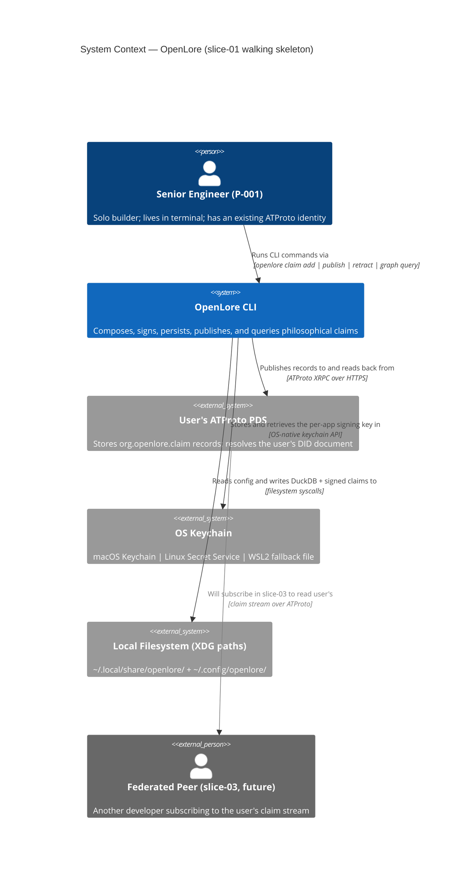
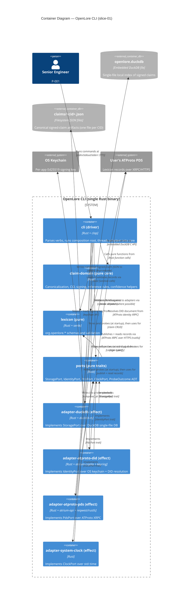
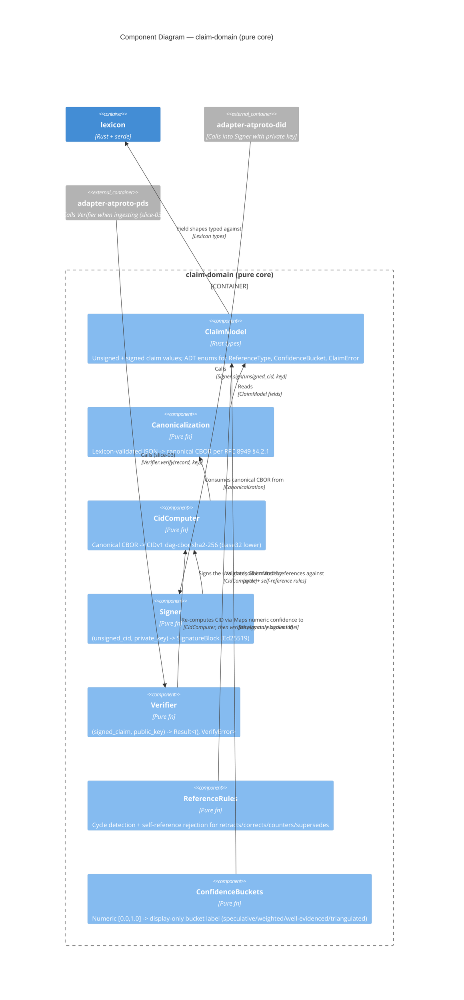
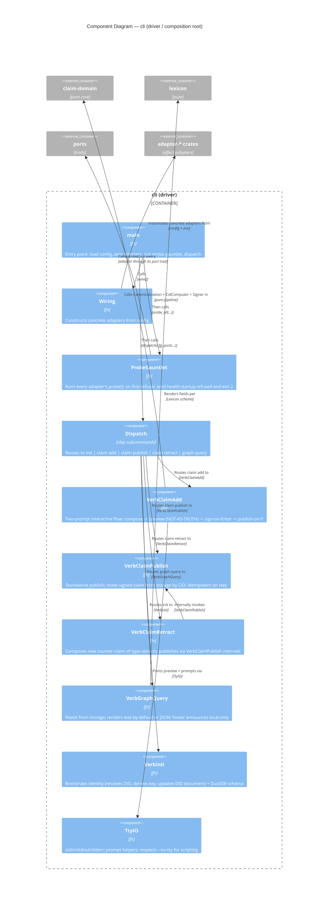
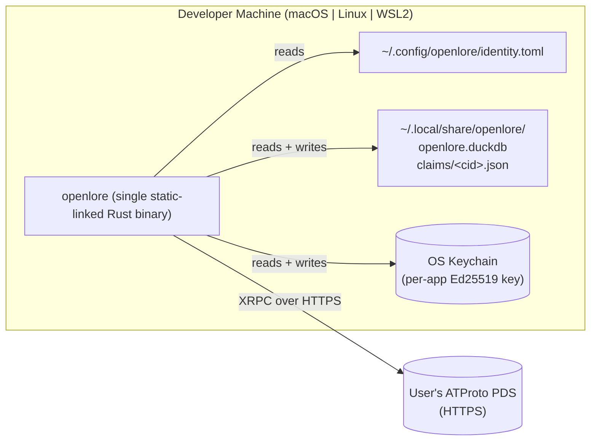

# Architecture Design — openlore-foundation (slice-01 walking skeleton)

- **Wave**: DESIGN
- **Date**: 2026-05-25
- **Architect**: Morgan (nw-solution-architect)
- **Feature**: openlore-foundation
- **Style**: Hexagonal (Ports + Adapters), Modular Monolith, single-binary CLI
- **Paradigm**: Functional-leaning Rust (pure core + effect shell) — **Proposed**, ADR-007
- **Inherits**: WD-1..WD-13 from `docs/feature/openlore-foundation/feature-delta.md`

This document describes the architecture for the walking-skeleton slice (slice-01).
It does NOT prescribe implementation code; software-crafter owns the internals
of each module. Adapters' fault scenarios and `probe()` contracts are first-class
architectural responsibilities, not implementation details.

## 1. System overview

OpenLore's slice-01 is a single Rust CLI binary that lets a senior engineer
compose, sign, locally-persist, publish-to-PDS, and read back a structured
philosophical claim about a project. It validates the end-to-end thesis of
the OpenLore umbrella (Lexicon + signing + DuckDB + ATProto + local query)
in one minimal vertical slice.

The architecture is greenfield. No existing OpenLore code exists in this
repository; the source tree begins with this slice.

## 2. Quality-attribute drivers

In priority order from DISCUSS:

| # | Quality | Driver | Architectural response |
|---|---|---|---|
| 1 | Claim integrity (cryptographic) | KPI-4 zero silent normalization | Pure-core canonicalization + CID + sign isolated from I/O (ADR-007, ADR-009) |
| 2 | Local-first latency | KPI-1 < 2 min e2e; KPI-5 offline guardrail | Compose+sign make no network calls; publish is the only network step (ADR-009 boundaries) |
| 3 | Federation interop | slice-03 dependency; ATProto-native records | `org.openlore.*` Lexicon (ADR-005); CIDv1 dag-cbor sha2-256 (ADR-006) |
| 4 | Auditability | "Not as truth" framing; retraction = counter-claim | Reference-typed claims, no hard-delete (ADR-008); pure-pipeline visibility (ADR-007) |
| 5 | Testability | Mutation testing standard in DELIVER | Hexagonal isolation (ADR-009); pure core (ADR-007); property tests on canonicalization (ADR-006) |

Non-drivers (explicitly low priority for slice-01): horizontal scalability,
multi-tenancy, time-to-market beat (quality > velocity per task spec).

## 3. C4 Level 1 — System Context

External actors and systems:

- **User (P-001)** — the senior engineer authoring claims. Inbound only;
  drives every interaction via the CLI.
- **User's ATProto PDS** — the user's existing Personal Data Server (typically
  `bsky.social` or a self-hosted PDS). slice-01 publishes records here and
  resolves the user's DID document for verification-method registration
  (ADR-002).
- **OS Keychain** — platform-native secret store; holds the per-app derived
  signing key (ADR-002).
- **Local Filesystem** — XDG-respecting paths for config (`~/.config/openlore`)
  and data (`~/.local/share/openlore`).
- **Federated peer** — out of slice-01 scope; shown for context to highlight
  why the Lexicon and CID contracts must be wire-stable from day one.

## 4. C4 Level 2 — Containers

Notes on the diagram:

- The **single binary** ships every container above; they are Rust crates
  inside one workspace, compiled into one executable.
- The two ContainerDb_Ext (DuckDB file + canonical claim JSON files) are the
  local persistence surface. The JSON files are the source of truth for the
  signed payload; the DuckDB DB is a derived index for query speed (see
  ADR-001 + data-models.md).
- The composition root (`cli`) is the ONLY container that depends on every
  adapter. Pure core (`claim-domain`, `lexicon`, `ports`) never depends on
  any adapter — this is the architecture enforcement rule from ADR-009.

## 5. C4 Level 3 — Components

Per the skill spec (C4 L3 only for complex subsystems, here meaning 5+
components or specification-level concerns), L3 is provided for two
containers: **claim-domain** (the riskiest internals — canonicalization,
sign, CID, reference rules) and **cli** (the two-prompt contract is a
specification-level concern per ADR-003).

### 5.1 Component diagram — `claim-domain` (pure core)

Key invariants for this container:

1. Every component is a `fn(inputs) -> Result<outputs, DomainError>`. No
   `&mut self`. No `async`. No I/O.
2. `Signer` and `Verifier` are pure WITH RESPECT TO their inputs; the private
   key is an input, not state. The adapter (`adapter-atproto-did`) loads the
   key from the keychain (effect) and passes it as a parameter.
3. `Canonicalization` and `CidComputer` are property-tested AND mutation-tested
   (≥95% mutation kill rate per ADR-006).
4. `ReferenceRules` rejects self-reference and cycles ≥2 hops at sign time
   (per ADR-008). The cycle check is local — claim A's references field is
   inspected; if any references target a CID whose claim is in the local
   store and which itself references back to A, reject. Cross-claim cycle
   detection requires storage; the function takes `storage: &dyn StoragePort`
   as an optional parameter (slice-01 uses it; pure-pure variants for unit
   tests pass `None`).

### 5.2 Component diagram — `cli` (driver, composition root)

Specification-level invariants for `cli`:

1. **Two-prompt contract (ADR-003)**: `VerbClaimAdd` MUST render the compose
   preview, wait for Enter, sign-and-persist, THEN render the publish prompt,
   wait for Y/n. The two prompts are observably separate.
2. **`probe_all` is a hard gate**: dispatch is unreachable if any probe
   refuses; the binary exits 2 with `health.startup.refused` to stderr.
3. **`VerbClaimRetract` does NOT define its own publish path**: it constructs
   a counter-claim, then calls into `VerbClaimPublish` internals. There is
   exactly ONE publish code path (ADR-003).
4. **`TtyIO` honors `--no-tty`**: scripting mode (for slice-02 scrapers in
   the future) needs to drive the chained prompts non-interactively; the
   `--no-tty` flag implies "Enter at the sign prompt, Y at the publish
   prompt"; the literal "not as truth" preview text is still rendered to
   stdout (the framing is content-frozen by AC; scripting does not bypass it).

## 6. Integration patterns

### 6.1 Internal integration (port/adapter)

- Static dispatch (Rust generics + trait bounds) where the composition is
  monomorphic and known at compile time. Dynamic dispatch (`Box<dyn Port>`)
  only at the dispatch boundary in `cli::main` where the runtime selects
  among configurable adapters (none today; reserved for slice-04 if Kùzu
  joins).
- All port methods return `Result<T, PortError>` with structured error enums
  (`thiserror`). No panics escape adapters.

### 6.2 External integration (ATProto PDS)

- **Protocol**: ATProto XRPC over HTTPS. JSON request/response bodies.
- **Client**: `atrium-api` crate (the de-facto Rust ATProto client).
- **Auth**: existing user session token resolved at `openlore init`; refresh
  handled by atrium.
- **Idempotency**: `create_record` calls use the claim's CID as `rkey`; PDS
  rkey-collision behavior is the idempotency contract (US-003 Example 3).
  If a PDS returns 409/conflict on rkey collision, the adapter MUST treat
  this as success and surface the existing at-uri. If a PDS silently
  overwrites on rkey collision, the adapter MUST detect this in its `probe()`
  by writing a sentinel record twice and asserting no overwrite occurs — if
  detected, refuse to start (`health.startup.refused{reason: pds.idempotency_violation}`).
- **Failure modes** (US-003): PDS unreachable -> local claim preserved,
  retry hint emitted; PDS rejects -> raw error surfaced + actionable hint;
  network timeout -> idempotent retry.

### 6.3 External integration (DuckDB embedded)

- Not network; in-process via `duckdb-rs` (FFI). Treated as an external
  dependency for the purpose of port/adapter isolation.

### 6.4 External integration (OS Keychain)

- Via `keyring` crate (macOS Keychain / Linux Secret Service / Windows
  Credential Manager). WSL2 falls back to `0600` file at
  `~/.config/openlore/keys/` with explicit warning at init.

### 6.5 Contract test recommendation

**Annotation for platform-architect (DEVOPS handoff)**:

> External Integrations Requiring Contract Tests:
> - **ATProto PDS** (XRPC over HTTPS): the CLI consumes
>   `com.atproto.repo.createRecord`, `com.atproto.repo.getRecord`,
>   `com.atproto.repo.listRecords`, `com.atproto.identity.resolveHandle`,
>   `com.atproto.identity.updateHandle` (or equivalent verification-method
>   update lexicon).
>   *Recommended*: consumer-driven contracts via **Pact** in the CI
>   acceptance stage, with a recorded fixture replay against
>   `bsky.social`'s public PDS for the read paths and a local mock PDS
>   (atrium-test-utils or a stubbed XRPC handler) for the write paths.
>   Contract tests detect breaking changes in atrium-api OR in the
>   ATProto Lexicon definitions BEFORE production.

## 7. Deployment architecture

Deployment characteristics:

- **Distribution**: GitHub Releases artifact per platform triple
  (`aarch64-apple-darwin`, `x86_64-apple-darwin`, `x86_64-unknown-linux-gnu`,
  `x86_64-unknown-linux-musl` for portable Linux); Homebrew tap (post-slice-05);
  `cargo install openlore` for Rust users from day one.
- **No services to run**: zero daemons, zero containers required for the user.
- **Update strategy**: user re-runs `cargo install` or downloads a fresh
  release binary; the embedded DuckDB schema migration is idempotent and
  forward-only.
- **CI/CD**: DEVOPS owns; expected stages = lint (`cargo fmt`, `cargo clippy`),
  architecture rules (`cargo xtask check-arch`), probe enforcement
  (`scripts/check-probes.sh`), unit + property tests, mutation testing
  (`cargo-mutants` against `claim-domain`), integration tests (real DuckDB,
  mock PDS), contract tests (Pact replay against atrium), gold-test
  substrate matrix (native FS / tmpfs / overlayfs), release artifact build.

## 8. Quality attribute scenarios (ATAM-light)

| QA | Scenario | Architectural response | Sensitivity / trade-off |
|---|---|---|---|
| Claim integrity | A user re-runs the same `claim add` command on a different machine; the CID byte-matches | Pure canonicalization (ADR-006) + RFC 8949 §4.2.1 | Sensitivity: any non-determinism in the CBOR encoder breaks this. Mitigation: property tests + cross-implementation gold fixtures. |
| Local-first latency | User runs the full compose-and-sign with network disabled; completes in <2s | Pure-core, no network in compose/sign; PDS only at publish (ADR-009) | Trade-off: keychain access is a sync I/O that the offline test must allow. |
| Federation interop | A slice-03-era peer ingests a slice-01-published claim and verifies signature | Lexicon stability (ADR-005) + signature scheme stability (ADR-002) | Sensitivity: any Lexicon field change is a wire-break. Mitigation: every Lexicon field added must be optional. |
| Auditability | A user retracts a claim; original remains on PDS; graph query annotates "retracted by author" | No hard-delete (ADR-008); reference-typed Lexicon field | Trade-off: storage grows monotonically. Acceptable for slice-01 (single user). |
| Testability | A developer runs `cargo test`; all canonicalization scenarios pass without I/O fixtures | Pure-core (ADR-007); ports/adapters (ADR-009) | Trade-off: adapter testing requires substrate gold tests in CI (extra infra). |
| Reliability (KPI-4 guardrail) | Round-trip identity: query output for a just-published claim equals compose-time field values byte-for-byte | Field-mismatch counter (KPI-4) + integration test in CI | Sensitivity: any silent type coercion in DuckDB serde breaks this. Mitigation: `duckdb-adapter::probe()` round-trip sentinel. |
| Security (signing key handling) | Compromise of the per-app key revocable without nuking the main ATProto identity | Per-app derived key as separate verification method (ADR-002) | Trade-off: complexity of DID-document update at init. |
| Portability | Same binary runs on macOS arm64, Linux x86_64, WSL2 | rustls (ADR-004); webpki-roots; statically-linked libs | Trade-off: rustls does not honor system trust stores. Acceptable for public-PDS use case. |

## 9. Earned Trust summary (architecture-wide)

Every adapter in the system ships a `probe()` method. The composition root
runs all probes at startup and refuses to start on any refusal. The probe
contract is enforced in three layers (ADR-009):

1. **Subtype** (compile-time): the `Port` trait declares `fn probe(&self) ->
   ProbeOutcome` as required.
2. **Structural** (pre-commit AST hook): `scripts/check-probes.sh` walks every
   `impl <Port> for <Adapter>` block and rejects stub bodies.
3. **Behavioral** (CI gold-test runner): every probe exercises at least one
   catalogued substrate-lie scenario.

Adapter-specific probe summaries (full detail in respective ADRs):

| Adapter | Probe exercises |
|---|---|
| `adapter-duckdb` (ADR-001) | Schema match; sentinel round-trip; fsync honored on real medium |
| `adapter-atproto-did` (ADR-002) | DID document resolves; sentinel sign+verify; keychain accessible; key file perms safe |
| `adapter-atproto-pds` (ADR-004) | TLS handshake; describeServer DID match; rkey-collision idempotency |
| `adapter-system-clock` | No-op; clock is degenerate adapter (deterministic) |
| `lexicon` (module probe — ADR-005) | All Lexicon JSONs validate; serde round-trip byte-match |
| `claim-domain::canonicalization` (ADR-006) | Property tests in CI; gold-fixture CID stability |
| `claim-domain::references` (ADR-008) | Self-reference rejected; cycle ≥2 hops rejected; cross-store query_referencing round-trip |
| `cli` (ADR-003) | Sign-success file survives kill-between-prompts; idempotent re-publish; "not as truth" literal present |

## 10. Open questions for DELIVER

The following are deferred to the DELIVER wave (software-crafter's call):

1. **Exact crate version pins** for `atrium-api`, `atrium-crypto`, `duckdb`,
   `keyring`, `ciborium`, `cid`, `multihash`, `clap`. The technology-stack
   document (sibling file) names crates and pins MAJOR.MINOR but lets crafter
   choose PATCH and resolve transitive constraints.
2. **`cli` argument parser details** (subcommand grouping, flag naming
   beyond the locked ones). Crafter picks idiomatic clap structure.
3. **The exact `ProbeOutcome` ADT shape** (richer than `Result<(), String>`;
   exact fields TBD by crafter alongside the first adapter implementation).
4. **The `xtask check-arch` script** — crafter writes against `cargo metadata`.
5. **Lexicon JSON file layout under `lexicons/org/openlore/`** — exact
   field-order in the JSON file (display only; canonical form is CBOR per
   ADR-006).
6. **Migration tool** for DuckDB schema (refinery vs sqlx-migrate vs
   hand-written SQL). Crafter's call.

## 11. References

- `docs/feature/openlore-foundation/feature-delta.md` — DISCUSS-wave locks
- `docs/feature/openlore-foundation/discuss/alternatives-considered.md`
- `docs/feature/openlore-foundation/discuss/shared-artifacts-registry.md`
- `docs/feature/openlore-foundation/design/technology-stack.md`
- `docs/feature/openlore-foundation/design/component-boundaries.md`
- `docs/feature/openlore-foundation/design/data-models.md`
- `docs/feature/openlore-foundation/design/wave-decisions.md`
- `docs/adrs/ADR-001-local-storage-duckdb.md` through `ADR-009-architecture-style-hexagonal-modular-monolith.md`
