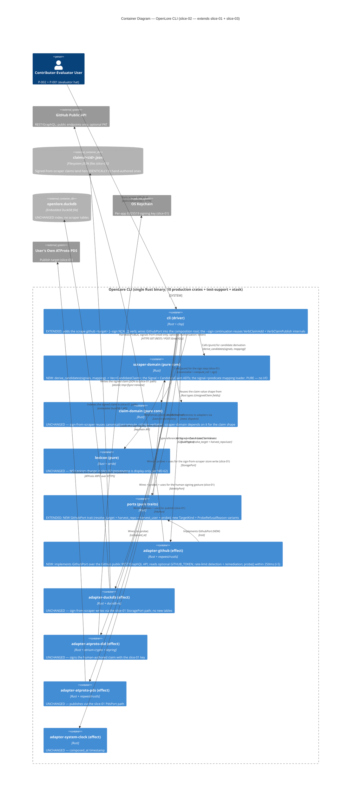

# Architecture Design — openlore-github-scraper (slice-02)

- **Wave**: DESIGN
- **Date**: 2026-05-28
- **Architect**: Morgan (nw-solution-architect)
- **Feature**: openlore-github-scraper (sibling feature; slice-02; sequenced AFTER slice-03 per WD-13)
- **Style**: Hexagonal (Ports + Adapters), Modular Monolith, single-binary CLI (inherits ADR-009 from slice-01)
- **Paradigm**: Functional-leaning Rust — pure core + effect shell (inherits ADR-007)
- **Extends**: `docs/feature/openlore-foundation/design/architecture-design.md` (slice-01 baseline)
- **Inherits**: All 16 ADRs (ADR-001..ADR-016), WD-1..WD-13 + WD-26..WD-45 (slice-01 + slice-03 DESIGN), the 12 cross-feature invariants in `docs/product/architecture/brief.md`, and WD-46..WD-58 from this feature's DISCUSS
- **Proposes**: ADR-017 (verb contract amendment: `scrape github`), ADR-018 (candidate-claim model + signal->predicate mapping contract), ADR-019 (GitHub adapter + rate-limit/PAT policy)

This document is the architectural DELTA for slice-02. Slice-01's
architecture is the inherited baseline; slice-03's extensions are inherited
unchanged; everything not mentioned here is unchanged. Implementation code is
software-crafter's domain in DELIVER; this document fixes contracts,
boundaries, and trust gates.

## 1. Scraper overview

Slice-02 extends the OpenLore CLI with a single sugar verb,
`openlore scrape github <target> [--sign N[,N...]]`, that lowers the
cost-to-first-signed-claim for the contributor-evaluator (J-004). The verb:

1. **Harvests** a public GitHub target's signals via a new `GithubPort`
   (effect shell `adapter-github`, GitHub REST/GraphQL over HTTPS,
   public-data-only, optional PAT).
2. **Derives** auditable candidate claims from those signals via a new PURE
   crate `scraper-domain`, using the signal->predicate mapping that is the
   `jobs.yaml :: J-004.signal_predicate_mapping` SSOT.
3. **Hands** any selected candidate into the slice-01 compose-sign-publish
   pipeline UNCHANGED (`VerbClaimAdd` / `VerbClaimPublish` internals). The
   scraper has NO signing key and NO publish code path.

The single most load-bearing property of the slice is the **human-gate**
(WD-49): the scraper PROPOSES; the human SIGNS. Nothing is persisted as a
claim or published unless it passes through the slice-01 pipeline with the
human's explicit signing gesture.

The architecture is an EXTENSION, not a re-architecture:

- No new architectural style.
- One new port (`GithubPort`). No port replacement, no extension of an
  existing port (rationale in WD-61 / ADR-019).
- TWO new crates — the FIRST crates added since slice-01 (slice-03 added zero
  per WD-26): `scraper-domain` (PURE) + `adapter-github` (EFFECT). Production
  crate count 8 -> 10.
- ZERO new DuckDB tables; ZERO new CID path; ZERO Lexicon change
  (provenance is display-only per OD-SCR-3 / WD-62).
- One new CLI verb (`scrape github`) + one continuation flag (`--sign`), both
  governed by the ADR-003 two-prompt / single-publish-path invariants.

## 2. Quality-attribute drivers

In priority order (derived from `outcome-kpis.md`):

| # | Quality | Driver | Architectural response |
|---|---------|--------|------------------------|
| 1 | **Cost-to-first-claim** (north star) | KPI-SCR-1: signed claim in <2 min INCLUDING vocabulary discovery | The candidate list removes the predicate-vocabulary recall cost; `scrape github <target> --sign N` is a single invocation from harvest to signed claim; `scraper-domain` derivation is pure + in-memory (no I/O latency) |
| 2 | **Human-gate integrity** (guardrail; unshippable if violated) | KPI-SCR-2: zero unsigned persistence; zero auto-publish | Candidates are in-memory ADTs in PURE `scraper-domain`; the ONLY path to a claim is the slice-01 pipeline; `adapter-github` has no `StoragePort`/`PdsPort`/`IdentityPort` reference; acceptance gate `scraper_never_persists_unsigned` |
| 3 | **Public-data-only** (guardrail; unshippable if violated) | KPI-SCR-4: zero private endpoint calls; private/non-existent refused | `adapter-github` calls ONLY public GitHub endpoints; `probe()` asserts the public surface is reachable and that a known-private fixture is refused; contract test (DEVOPS) asserts the endpoint allowlist |
| 4 | **Auditability** (leading) | KPI-SCR-3: every candidate names its source signal | `CandidateClaim` carries a non-empty `source_signals: Vec<Signal>`; derivation is deterministic over the SSOT mapping; acceptance gate `candidate_names_source_signal` |
| 5 | **Confidence conservatism** (leading; anti-rubber-stamp) | KPI-SCR-5: edit rate >=50%; WD-52 default 0.25, never auto-inflate | `scraper-domain` stamps every candidate at the mapping's `default_confidence` (0.25); the compose pre-fill carries 0.25 verbatim; only the human raises it; acceptance gate `candidate_confidence_no_autoinflate` |
| 6 | **Single-publish-path** | ADR-003 + WD-22 (slice-03 reaffirmed) | `VerbScrapeGithub --sign` calls `VerbClaimAdd` + `VerbClaimPublish` internals as functions; no parallel publish code path; acceptance gate `scraper_reuses_slice01_publish_path` |
| 7 | **CID stability** | I-6 / I-10 inherited | Scraper adds NO new CID path; sign-time CID is slice-01's; provenance is display-only (WD-62) so the signed payload is byte-identical to a hand-authored claim |
| 8 | **Pure/effect testability** | WD-56 / ADR-007 | `scraper-domain` PURE (trivially unit + mutation testable); `adapter-github` EFFECT with `probe()`; `xtask check-arch` whitelists only pure deps for `scraper-domain` |

Non-drivers for slice-02: deep cross-repo contributor triangulation (deferred
to slice-04 per OD-SCR-4 / WD-64); multi-source scraping (Mastodon/blogs;
deferred); ML inference of predicates (locked rejected, WD-53); scheduled /
daemon scraping (CLI-first, on-demand only).

## 3. C4 Level 1 — System Context (extended for slice-02)

```mermaid
C4Context
    title System Context — OpenLore (slice-02 GitHub scraper; extends slice-01 + slice-03)

    Person(user, "Contributor-Evaluator User (P-002 + P-001)", "Researcher/Tech Lead OR Senior Engineer wearing the contributor-evaluator hat; evaluating a repo or contributor through a philosophy lens")

    System(openlore, "OpenLore CLI", "Composes, signs, persists, publishes, federates, queries — AND NOW harvests public GitHub signals and proposes auditable candidate claims the human signs")

    System_Ext(github, "GitHub Public API", "REST/GraphQL over HTTPS. Source of PUBLIC repo + user signals (READMEs, manifests, file ratios, tags, language). Read-only; public endpoints only. Rate-limited (anon 60/hr, PAT 5000/hr)")
    System_Ext(own_pds, "User's Own ATProto PDS", "Hosts the user's signed claims; the sign-from-scraper claim publishes here via the slice-01 pipeline (unchanged)")
    System_Ext(keychain, "OS Keychain", "macOS Keychain | Linux Secret Service | WSL2 fallback file (slice-01); signs the human-authored claim")
    System_Ext(fs, "Local Filesystem (XDG paths)", "~/.local/share/openlore/ + ~/.config/openlore/ — signed-from-scraper claims land in claims/<cid>.json EXACTLY like hand-authored ones")

    Rel(user, openlore, "Runs CLI commands via", "openlore scrape github <target> [--sign N[,N...]]")
    Rel(openlore, github, "Harvests PUBLIC signals from (read-only; public endpoints only; optional PAT for higher rate budget)", "GitHub REST/GraphQL over HTTPS (rustls)")
    Rel(openlore, own_pds, "Publishes the human-signed claim to (slice-01 pipeline; unchanged)", "ATProto XRPC over HTTPS")
    Rel(openlore, keychain, "Signs the claim using the per-app key from (slice-01)", "OS-native keychain API")
    Rel(openlore, fs, "Reads config; writes the signed claim file + DuckDB index to", "filesystem syscalls")

    UpdateRelStyle(openlore, github, $textColor="green", $lineColor="green")
```

What changed from the slice-01 / slice-03 L1:

- **Contributor-Evaluator User** wears a new hat (P-002 primary, P-001
  secondary) — the same persona base, different starting mental model.
- **GitHub Public API** is a NEW external system and the slice's only new
  trust boundary. It is read-only and public-only; the user's CLI never sends
  GitHub anything but read requests (optionally with a PAT in the
  `Authorization` header).
- **The target is the SUBJECT of a claim, never a controller** (WD-51). GitHub
  is contacted to HARVEST, not to notify, write, or surveil.
- The PDS / keychain / filesystem relationships are UNCHANGED from slice-01 —
  the sign-from-scraper path reuses them verbatim.

## 4. C4 Level 2 — Containers (extended for slice-02)



What changed from the slice-01 / slice-03 L2:

- **TWO new crates** (the first since slice-01). `scraper-domain` (pure) and
  `adapter-github` (effect). Both honor the hexagonal dependency rules (I-1,
  I-2, I-3) and are added to `xtask check-arch` (WD-65).
- **`GithubPort` is the only new port.** It is NOT an extension of an existing
  port (unlike slice-03's `PdsPort`/`IdentityPort` extensions) because GitHub
  is a wholly different external system from ATProto — no method shape, auth
  model, or failure surface is shared. Folding GitHub harvest into `PdsPort`
  would conflate two unrelated trust boundaries. See WD-61 / ADR-019.
- **`scraper-domain` depends ONLY on `claim-domain` + `lexicon`** (both pure)
  and `serde` (pure). It has NO dependency on `ports` (it works on already-
  harvested `Vec<Signal>` values handed to it by the `cli`), keeping the
  derivation a pure function of its inputs. NOTE: the `Signal` and
  `CandidateClaim` ADTs live in `scraper-domain` and are RE-EXPORTED /
  referenced by `ports` for the `GithubPort` signatures (the harvest methods
  return `Vec<Signal>`). This makes `ports` depend on `scraper-domain` for
  those types — both pure, so I-1/I-2 hold. (DELIVER may instead place the
  `Signal` type in `ports` if the dependency direction proves cleaner; see
  Q-DELIVER-3.)
- **NO scraper tables, NO new CID path, NO Lexicon change.** The sign-from-
  scraper path reuses `adapter-duckdb` / `adapter-atproto-did` /
  `adapter-atproto-pds` exactly as slice-01 does. The only new write is the
  same `claims/<cid>.json` a hand-authored claim produces.
- **`adapter-github` reuses the workspace `reqwest` (rustls + webpki-roots)**
  already pulled in by `adapter-atproto-pds` (I-11; DISCUSS handoff). No new
  HTTP client; no new `cargo deny` surface for the transport. See ADR-019 +
  `technology-stack.md`.

## 5. C4 Level 3 — Components (complex subsystems only)

Slice-02 adds two component-level concerns worth L3 diagrams:

1. **`cli` driver** — the new `scrape github` verb pipeline: harvest -> derive
   -> (optional) reuse the slice-01 sign/publish flow.
2. **The candidate->compose pre-fill path** — the load-bearing surface for the
   human-gate: how a `CandidateClaim` pre-fills the slice-01 `VerbClaimAdd`
   compose editor WITHOUT forking the publish path.

### 5.1 Component diagram — `cli` scrape pipeline (driver, composition root)

```mermaid
C4Component
    title Component Diagram — cli (scrape github pipeline; slice-02 NEW labels)

    Container_Boundary(cli, "cli (driver)") {
        Component(main, "main", "fn", "EXTENDED: wires GithubPort into the probe gauntlet alongside slice-01 adapters; dispatch routes the new scrape verb")
        Component(wire, "Wiring", "fn", "EXTENDED: constructs AdapterGithub (reads GITHUB_TOKEN from env) alongside slice-01 adapters")
        Component(probe, "ProbeGauntlet", "fn", "EXTENDED: runs GithubPort.probe() (public-reachability + private-refusal + budget) with the same fail-fast semantics; SKIPPED under --offline since scrape requires network")
        Component(dispatch, "Dispatch", "clap subcommands", "EXTENDED: routes init | claim {add|publish|retract|counter} | peer {add|pull|remove} | graph query [--federated] | scrape github")
        Component(verb_scrape, "VerbScrapeGithub", "fn", "NEW: (1) prints public-data banner; (2) resolve_target + harvest via GithubPort; (3) derive_candidates via scraper-domain; (4) render candidate list; (5) IF --sign: for each index, pre-fill compose + invoke slice-01 sign/publish")
        Component(candrender, "CandidateRenderer", "fn", "NEW: renders the numbered candidate list with per-candidate source-signal lines, 0.25 (speculative) confidence, and the human-gate footer")
        Component(prefill, "CandidatePrefill", "fn", "NEW: maps a CandidateClaim -> the slice-01 VerbClaimAdd pre-filled compose fields (subject, predicate, object, evidence, confidence=0.25) + the display-only derived-from line")
        Component(selparse, "SelectionParser", "fn", "NEW: parses --sign N[,N...]; rejects duplicates + out-of-range indices BEFORE any compose begins; single index == US-SCR-003")
        Component(verb_add, "VerbClaimAdd (slice-01)", "fn", "REUSED unchanged — receives the pre-filled fields; renders compose preview with 'not as truth'; the human edits + signs")
        Component(verb_publish, "VerbClaimPublish (slice-01)", "fn", "REUSED unchanged — the single publish path (ADR-003 / WD-22)")
        Component(io, "TtyIO", "fn", "EXTENDED: public-data banner helper; per-candidate progress line ('(k of M signed)'); skip-without-abort handling")
    }

    Container_Ext(scraper_domain, "scraper-domain", "pure core")
    Container_Ext(github_port, "GithubPort", "trait (ports)")
    Container_Ext(adp_github, "adapter-github", "effect adapter")
    Container_Ext(domain, "claim-domain", "pure core (slice-01)")

    Rel(main, wire, "Calls", "wire()")
    Rel(main, probe, "Then calls", "probe_all(...)")
    Rel(main, dispatch, "Then calls", "dispatch(cfg, ports...)")
    Rel(wire, adp_github, "Instantiates from config + GITHUB_TOKEN env", "")
    Rel(probe, github_port, "Calls probe() on", "adapter-github through GithubPort")
    Rel(dispatch, verb_scrape, "Routes scrape github (NEW)", "")
    Rel(verb_scrape, github_port, "1. resolve_target + harvest_repo/user", "via adapter-github")
    Rel(github_port, adp_github, "Implemented by", "")
    Rel(verb_scrape, scraper_domain, "2. derive_candidates(signals, mapping)", "pure")
    Rel(verb_scrape, candrender, "3. render candidate list", "")
    Rel(verb_scrape, selparse, "4. parse --sign selection (if present)", "")
    Rel(verb_scrape, prefill, "5a. per selected candidate: pre-fill compose fields", "")
    Rel(prefill, verb_add, "5b. invoke slice-01 compose+sign with pre-filled fields", "")
    Rel(verb_add, domain, "canonicalize + compute_cid + sign (slice-01)", "")
    Rel(verb_add, verb_publish, "5c. on Y: invoke VerbClaimPublish internals", "single-publish-path")
    Rel(verb_scrape, io, "banner + progress + skip handling", "")
```

Specification-level invariants for `cli` (slice-02 additions):

1. **The public-data banner is printed BEFORE any harvest begins** (US-SCR-001
   AC). It states only public data is read and nothing is published.
2. **`VerbScrapeGithub` WITHOUT `--sign` performs ZERO writes**: no
   `author_claims` rows, no PDS calls, no `claims/<cid>.json` files. Harvest +
   derive + render only. Enforced by the `scraper_never_persists_unsigned`
   gate.
3. **`SelectionParser` rejects invalid `--sign` lists BEFORE any compose
   begins** (duplicate index, out-of-range index), naming the offending
   indices (US-SCR-005 AC). A single index behaves identically to the
   single-candidate path (US-SCR-003 / US-SCR-005 Example 4).
4. **`CandidatePrefill` is a sugar over `VerbClaimAdd` semantics**: it pre-fills
   the editable compose fields and dispatches through the SAME compose-preview
   -> sign -> publish pipeline. The two-prompt contract (ADR-003) holds; the
   compose preview MUST contain the literal "not as truth" (I-7). The
   pre-filled confidence is 0.25; only the human raises it (WD-52).
5. **`--sign N,M,...` walks each candidate through its OWN compose preview and
   requires the human's individual signing gesture** (US-SCR-005 AC). There is
   NO "sign all without review" affordance. A single candidate's compose may be
   skipped (cancel) WITHOUT aborting the remaining selections; the summary
   reports signed vs skipped counts.
6. **The sign-from-scraper claim records a display-only `derived-from`
   provenance line** in the compose preview and the publish success output. It
   is NOT in the signed payload (WD-62 / OD-SCR-3); it NEVER alters the CID,
   confidence, or federation behavior.
7. **Offline invocation exits non-zero** with a "scrape requires network"
   message and renders no partial list (US-SCR-001 AC). The `--offline` slice-01
   flag skips the `GithubPort` probe and is incompatible with `scrape`.

### 5.2 Component diagram — candidate->compose pre-fill (the human-gate seam)

```mermaid
C4Component
    title Component Diagram — candidate -> compose pre-fill (the human-gate; slice-02 NEW)

    Container_Boundary(scraper_domain_b, "scraper-domain (pure core; slice-02 NEW)") {
        Component(derive, "derive_candidates", "Pure fn", "(signals, mapping) -> Vec<CandidateClaim>. Maps each Signal to a candidate via the SSOT mapping; collapses multiple signals for one predicate into ONE candidate listing all contributing signals; stamps default_confidence (0.25)")
        Component(maploader, "load_mapping", "Pure fn", "Parses the signal->predicate mapping from the embedded jobs.yaml SSOT snapshot into a typed SignalPredicateMapping; no divergent hardcode (WD-53)")
        Component(candidate, "CandidateClaim", "ADT", "subject + predicate + object + evidence + confidence(0.25) + source_signals[]. In-memory ONLY; never persisted as-is")
    }

    Container_Boundary(cli_b, "cli (driver)") {
        Component(prefill2, "CandidatePrefill", "fn", "Maps CandidateClaim -> VerbClaimAdd pre-filled fields. The ONLY bridge from a proposal to the slice-01 pipeline")
        Component(verb_add2, "VerbClaimAdd (slice-01)", "fn", "REUSED — the human edits any field; confidence editing enforces [0.0,1.0]; renders 'not as truth'; the human signs")
        Component(verb_publish2, "VerbClaimPublish (slice-01)", "fn", "REUSED — single publish path")
        Component(io3, "TtyIO", "fn", "Renders the display-only derived-from line + the candidate's source signal(s)")
    }

    Container_Boundary(domain_b, "claim-domain (pure core; slice-01)") {
        Component(canon, "canonicalize", "Pure fn", "REUSED unchanged — NO new field; provenance is display-only so the canonical payload is byte-identical to a hand-authored claim")
        Component(cid, "compute_cid", "Pure fn", "REUSED unchanged — NO new CID path (I-6 / I-10)")
        Component(sign, "sign", "Pure fn", "REUSED unchanged")
    }

    Rel(maploader, derive, "Provides the typed mapping to", "")
    Rel(derive, candidate, "Produces", "Vec<CandidateClaim>")
    Rel(prefill2, candidate, "Reads a selected candidate's fields from", "")
    Rel(prefill2, verb_add2, "Pre-fills compose fields then invokes", "subject/predicate/object/evidence/confidence=0.25")
    Rel(prefill2, io3, "Passes the display-only derived-from line to", "")
    Rel(verb_add2, canon, "On Enter: canonicalize (slice-01)", "")
    Rel(verb_add2, cid, "compute_cid (slice-01)", "")
    Rel(verb_add2, sign, "sign (slice-01)", "")
    Rel(verb_add2, verb_publish2, "On Y: invoke VerbClaimPublish internals", "single-publish-path")
```

Invariants for the candidate->compose pre-fill (the human-gate seam):

1. **`CandidatePrefill` is the ONLY bridge** from a `CandidateClaim` to a
   signed claim. There is no code path that turns a `CandidateClaim` into a
   `SignedClaim` without passing through `VerbClaimAdd` and the human's signing
   gesture. (KPI-SCR-2; `scraper_never_persists_unsigned`.)
2. **If the user edits no fields, the signed claim's fields equal the
   candidate's proposed values byte-for-byte** — no auto-inflation of
   confidence (US-SCR-003 Example 2; `candidate_confidence_no_autoinflate`).
3. **The display-only `derived-from` line never reaches `canonicalize`**. It is
   passed to `TtyIO` for display only; the canonical bytes that get CID'd and
   signed are byte-identical to a hand-authored claim (WD-62 / I-10).
4. **`scraper-domain` consumes the SSOT mapping, never a divergent hardcode**
   (WD-53). `load_mapping` parses the `jobs.yaml :: J-004.signal_predicate_mapping`
   snapshot; a build-time test asserts the embedded snapshot matches the SSOT
   file (`mapping_matches_ssot`).

## 6. Integration patterns

### 6.1 Internal — the new port

| Port | Status | Methods | Notes |
|------|--------|---------|-------|
| `GithubPort` | **NEW** | `probe`, `resolve_target(target) -> Result<TargetKind, GithubError>`, `harvest_repo(repo) -> Result<Vec<Signal>, GithubError>`, `harvest_user(user) -> Result<Vec<Signal>, GithubError>` | Owns the GitHub harvest surface. `resolve_target` disambiguates `owner/repo` (Repo) vs `user` (User) AND refuses private/non-existent targets. Harvest methods return `Vec<Signal>` (already-fetched, ready for the pure `derive_candidates`). Async (network); follows `PdsPort`'s `#[async_trait]` pattern. |

Dispatch model:

- `GithubPort` follows the same static-dispatch-where-possible /
  dynamic-dispatch-at-boundary pattern as slice-01 (Section 6.1 of slice-01's
  architecture-design).
- `GithubPort` is async (network); it reuses the existing `#[async_trait]`
  declaration pattern from `PdsPort`.
- `scraper-domain::derive_candidates` is a PURE sync function called by the
  `cli` AFTER harvest; it does NOT live behind a port (it has no I/O).

### 6.2 External — GitHub public API

- **Protocol**: GitHub REST (v3) and/or GraphQL (v4) over HTTPS using the
  workspace `reqwest` (rustls + webpki-roots). DELIVER picks REST vs GraphQL
  per signal (GraphQL is fewer round-trips for the bounded signal set; see
  ADR-019 + `technology-stack.md`).
- **Endpoints (public-only allowlist)**: repository metadata
  (`GET /repos/{owner}/{repo}`), contents/manifest presence
  (`GET /repos/{owner}/{repo}/contents/{path}`), tags/releases, languages, and
  the equivalent user endpoints (`GET /users/{user}`,
  `GET /users/{user}/repos`). NO authenticated-private endpoint is ever called
  (KPI-SCR-4 guardrail). The allowlist is the contract-test subject (DEVOPS).
- **Auth**: optional PAT via `GITHUB_TOKEN` env var (WD-54; env-only for
  slice-02 per OD-SCR-2 / WD-63). When present, sent as an
  `Authorization: token <PAT>` header for the higher rate budget (5000/hr).
  When absent, harvest runs unauthenticated (anon 60/hr). The token is NEVER
  logged, echoed, written to a claim, or published (effect-shell credential
  only).
- **Rate limits**: `adapter-github` reads the `X-RateLimit-Remaining` /
  `X-RateLimit-Limit` response headers; reports the remaining budget when
  authenticated; on a 403 rate-limit (anon budget exhausted) returns
  `GithubError::RateLimited` which the `cli` surfaces as a
  `set GITHUB_TOKEN for higher limits` remediation and renders NO partial
  candidate list (US-SCR-004 AC). Retry-with-backoff is NOT used for rate
  limits (the budget is exhausted, not transient); see ADR-019.
- **Pagination**: bounded by the signal set; `adapter-github` walks pages for
  user-repo aggregation (US-SCR-001 Example 2) up to a slice-02 cap (deep
  triangulation deferred per WD-64). DELIVER picks the cap (Q-DELIVER-4).
- **Failure modes**: 404 -> `GithubError::NotFound` (target named in error,
  exit non-zero, zero candidates); 403/404 on a private repo ->
  `GithubError::NotPublic` ("scraper only reads public data"); 401 on a
  rejected PAT -> `GithubError::TokenRejected` (no token echo); offline ->
  `GithubError::Network` ("scrape requires network"). All map to non-zero
  exits with no partial list.

### 6.3 Probe contract for adapter-github

`adapter-github` ships a `probe()` per ADR-009 invariant I-4, within the 250ms
budget (I-5). Because GitHub is an environment that CAN lie about access
(a private repo can 404 like a missing one; a rate-limited response can look
like a transport error), the probe exercises the specific lies (principle 12).

| Probe step | What it exercises | Lie it catches |
|------------|-------------------|----------------|
| 1. Public reachability | `resolve_target` against a known-stable PUBLIC fixture repo (e.g. `rust-lang/cargo`) returns `TargetKind::Repo` within budget | "GitHub is reachable and the public API shape is what we expect" |
| 2. Private refusal | `resolve_target` against a known-private/inaccessible fixture returns `GithubError::NotPublic` (NOT a silent empty harvest) | A private repo that 404s MUST be refused, not treated as missing-but-harvestable (KPI-SCR-4) |
| 3. Auth-mode report | If `GITHUB_TOKEN` is set, the probe confirms it is accepted (reads rate-limit headers) and reports the budget; if rejected (401), refuse to start with `GithubTokenRejected` | A stale token must fail fast at startup, not mid-harvest |
| 4. Rate-limit-header presence | The probe asserts the rate-limit headers are parseable (the budget-reporting path works) | A GitHub response shape change that drops rate-limit headers would silently break the budget UX |
| 5. No-token-leak | The probe asserts the token value never appears in any structured probe event or log line | A logging regression that echoes the PAT (KPI-SCR-4 / WD-54) |

The probe runs in the composition root's "wire then probe then use" gauntlet
(ADR-009). On any refusal it emits a structured `health.startup.refused` event
and the system refuses to start (exit code 2). Under `--offline` the
`GithubPort` probe is skipped, but `scrape` itself refuses to run offline
(it requires network).

The substrate gold-test matrix (ADR-009) extends with GitHub-specific
substrate concerns (DEVOPS owns the fixtures):

- **Live public fixture**: probe steps 1-4 run against a stubbed GitHub XRPC
  handler (`wiremock`) in CI; the production probe runs against the real public
  GitHub API (read-only, public endpoints).
- **Private-refusal fixture**: a stubbed handler returns 404 for a "private"
  path; the probe MUST refuse (step 2). This is the KPI-SCR-4 release-gate at
  the probe layer.
- **Rate-limit fixture**: a stubbed handler returns 403 with rate-limit
  headers; `adapter-github` MUST surface `RateLimited` (not a generic error).

### 6.4 Contract test recommendation (handoff to platform-architect)

**External Integrations Requiring Contract Tests (slice-02 additions to the
slice-01 + slice-03 list)**:

- **GitHub Public API** (REST and/or GraphQL over HTTPS, READ paths):
  - Consumed endpoints (public-only): `GET /repos/{owner}/{repo}`,
    `GET /repos/{owner}/{repo}/contents/{path}`, tags/releases, languages,
    `GET /users/{user}`, `GET /users/{user}/repos` (or the GraphQL equivalents
    if DELIVER picks GraphQL).
  - *Recommended*: extend the existing Pact-style contract suite (slice-01 +
    slice-03) with consumer-driven contracts for the GitHub read paths. Replay
    against recorded fixtures of public GitHub responses.
  - **Public-endpoint allowlist assertion (KPI-SCR-4 release-gate)**: a
    contract test MUST assert `adapter-github` calls ONLY endpoints on the
    public allowlist — NO authenticated-private endpoint is ever reachable.
    DEVOPS owns this fixture (per DISCUSS handoff in `outcome-kpis.md`).
  - **Rate-limit + token fixtures**: stubbed 403-rate-limit and 401-rejected-
    token responses to exercise the remediation paths (US-SCR-004) and the
    no-token-leak assertion.

The slice-02 contract test suite is an EXTENSION of the existing suite, NOT a
separate suite.

## 7. Deployment architecture (unchanged from slice-01)

Slice-02 is the same single Rust binary as slice-01 + slice-03. Distribution,
no-services-to-run, update strategy, CI/CD all unchanged. The on-disk footprint
is UNCHANGED — a signed-from-scraper claim lands in the same
`~/.local/share/openlore/claims/<cid>.json` as a hand-authored claim; there is
NO scraper-specific storage. The only new runtime input is the optional
`GITHUB_TOKEN` environment variable.

## 8. Quality attribute scenarios (ATAM-light; slice-02 additions)

| QA | Scenario | Architectural response | Sensitivity / trade-off |
|----|----------|------------------------|-------------------------|
| Cost-to-first-claim | A user runs `scrape github rust-lang/cargo --sign 1`, edits confidence, signs, publishes — under 2 min total | Single invocation harvest->derive->sign; pure in-memory derivation; candidate list removes vocabulary recall | Sensitivity: GitHub harvest latency dominates the budget; mitigated by a bounded signal set + optional PAT. Trade-off: a richer signal set would raise auditability but cost latency. |
| Human-gate integrity | A user runs `scrape github <target>` WITHOUT `--sign`; zero `author_claims` rows, zero PDS writes, zero claim files | Candidates are in-memory pure ADTs; the ONLY claim path is the slice-01 pipeline; `adapter-github` holds no storage/identity/pds reference | Sensitivity: a future "convenience auto-sign" would collapse the trust model. Mitigation: the gate is a hard acceptance test + the architecture gives the scraper no signing key. |
| Public-data-only | A user scrapes a private repo they can see in-browser; the scraper 404s and refuses with "only reads public data"; no private endpoint called | `adapter-github` calls only public endpoints; `resolve_target` refuses non-public; probe step 2 + contract-test allowlist | Sensitivity: a careless future endpoint addition could touch a private path. Mitigation: the allowlist contract test fails CI on any off-allowlist endpoint. |
| Auditability | A user scans 5 candidates; each names the exact public signal(s) that produced it; one is rejected because the user disagrees with the derivation | `CandidateClaim.source_signals` is non-empty; derivation is deterministic over the SSOT mapping | Trade-off: collapsing multiple signals into one candidate (US-SCR-002 Example 4) must still list ALL contributing signals — a renderer that truncates would break auditability. |
| Confidence conservatism | A user accepts all defaults on `--sign 3`; the signed claim's confidence is 0.25, byte-equal to the proposal | `scraper-domain` stamps 0.25; pre-fill carries it verbatim; no auto-inflation anywhere in the path | Sensitivity: any "boost confidence if N signals agree" heuristic would violate WD-52. Mitigation: confidence is a constant from the mapping until the human edits. |
| CID stability | A signed-from-scraper claim has the same CID a hand-authored claim with identical fields would have | Provenance is display-only (WD-62); the canonical payload is byte-identical to a hand-authored claim | Sensitivity: if a future slice stores provenance in the payload it MUST be optional + CID-stable-when-absent per ADR-005 (mirrors slice-03 `reason`). Mitigation: that is an ADR-gated change, not a slice-02 one. |
| Rate-limit resilience | A user scrapes a busy contributor unauthenticated; the anon budget exhausts mid-harvest; the CLI exits non-zero with a `set GITHUB_TOKEN` remediation and NO partial list | `adapter-github` returns `RateLimited`; the `cli` renders no partial candidates (avoids a misleading incomplete proposal set) | Trade-off: a partial harvest could still be useful, but a partial candidate list would mislead the user into thinking they saw everything; refusing is the honest choice. |
| Token confidentiality | A user sets `GITHUB_TOKEN`; it never appears in any output, claim, or log line | The token lives only in `adapter-github`; `scraper-domain` (pure) never sees it; probe step 5 + no-leak assertion | Sensitivity: a logging regression could echo the token. Mitigation: the no-leak probe + a contract-test assertion. |

## 9. Earned Trust summary (slice-02 additions)

Every NEW adapter in slice-02 ships a `probe()` per ADR-009. The composition
root extends to run it.

| Adapter | Probe exercises (slice-02) |
|---------|----------------------------|
| `adapter-github` (GithubPort, NEW) | Public reachability + API-shape (step 1); private-refusal (step 2; KPI-SCR-4); auth-mode report + stale-token fast-fail (step 3); rate-limit-header presence (step 4); no-token-leak (step 5) |

Three-layer probe enforcement (per ADR-009) extends to `adapter-github`:

1. **Subtype (compile-time)**: `GithubPort` declares
   `fn probe(&self) -> ProbeOutcome` as required; rustc refuses an `impl`
   lacking it.
2. **Structural (pre-commit AST hook)**: `scripts/check-probes.sh` /
   `xtask check-probes` walks every `impl GithubPort for <Adapter>` block and
   asserts a non-stub `probe()` body.
3. **Behavioral (CI gold-test runner)**: the `adapter-github` probe exercises
   the GitHub substrate lies (private-repo-404, rate-limit-403,
   rejected-token-401) via stubbed fixtures, not just a happy-path public fetch.

The human-gate invariant (the slice's load-bearing trust contract) is itself
enforced at three orthogonal layers (mirroring slice-03's anti-merging
enforcement model, WD-30):

1. **Type/architecture-level**: `scraper-domain` is PURE and `adapter-github`
   holds NO `StoragePort`/`IdentityPort`/`PdsPort` reference — the scraper
   CANNOT sign or publish by construction. `xtask check-arch` enforces the
   dependency rules (WD-65).
2. **Structural**: `CandidatePrefill` is the only symbol that bridges a
   `CandidateClaim` into `VerbClaimAdd`; code review + a structural check assert
   no other path constructs a `SignedClaim` from a `CandidateClaim`.
3. **Behavioral**: the `scraper_never_persists_unsigned` +
   `candidate_confidence_no_autoinflate` acceptance gates (DISTILL).

## 10. Open questions for DELIVER

The following are deferred to DELIVER (software-crafter's call):

1. **REST vs GraphQL per signal** — GraphQL minimizes round-trips for the
   bounded signal set; REST is simpler. DELIVER picks per signal; ADR-019
   permits either. (Q-DELIVER-2.)
2. **`Signal` / `CandidateClaim` type placement** — `scraper-domain` (this
   design's default) vs `ports`. Both pure; the choice is about the
   `ports -> scraper-domain` vs `scraper-domain -> ports` dependency direction.
   Recommended: types in `scraper-domain`, referenced by `ports`. (Q-DELIVER-3.)
3. **Mapping embed-at-build vs read-at-runtime** — recommended: embed the
   `jobs.yaml` snapshot at build time (`include_str!`) + a build-time test
   asserting it matches the SSOT (`mapping_matches_ssot`). Read-at-runtime
   would add a filesystem dependency to a pure crate (forbidden). (Q-DELIVER-1.)
4. **User-repo aggregation page cap** for `harvest_user` (US-SCR-001 Example 2;
   bounded per WD-64). DELIVER picks the slice-02 cap. (Q-DELIVER-4.)
5. **Exact skip gesture** in batch sign (Ctrl-C-per-candidate vs an explicit
   "skip" input). Product contract is "skip one without aborting the rest";
   DELIVER picks the gesture. (Q-DELIVER-5.)
6. **`wiremock` (or equivalent) version pin** for the GitHub stub fixtures;
   added to `test-support` dev-deps; DELIVER coordinates with DEVOPS for the
   live-vs-recorded fixture split. (Q-DELIVER-6.)
7. **Exact candidate-list + progress-block line format** (US-SCR-002 /
   US-SCR-005). DISTILL's acceptance tests assert specific lines; DELIVER fills
   in the format that satisfies them. (Q-DELIVER-7.)

## 11. Open questions explicitly LOCKED (out of scope per DISCUSS / this DESIGN)

- Deep cross-repo contributor triangulation: deferred to slice-04 (WD-64 /
  OD-SCR-4). `harvest_user` returns a bounded aggregate in slice-02.
- Multi-source scraping (Mastodon, blogs): deferred (story-map "not in scope").
- ML / inference-based predicate derivation: LOCKED REJECTED (WD-53); the
  mapping is small, static, and auditable.
- Config-file PAT support: deferred to a later slice (WD-63 / OD-SCR-2);
  env-var `GITHUB_TOKEN` is the slice-02 minimum.
- Storing `derived-from` provenance in the signed payload: NOT in slice-02
  (WD-62 / OD-SCR-3 default display-only); an ADR-gated change if a future
  federation reason emerges.
- Scheduled / daemon scraping; web UI: out of scope (CLI-first, on-demand).

## 12. References

- `docs/feature/openlore-github-scraper/feature-delta.md` — DISCUSS-wave locks (WD-46..WD-58)
- `docs/feature/openlore-github-scraper/discuss/user-stories.md` — US-SCR-001..006
- `docs/feature/openlore-github-scraper/discuss/outcome-kpis.md` — KPI-SCR-1..5
- `docs/feature/openlore-github-scraper/discuss/shared-artifacts-registry.md` — 5 integration gates
- `docs/feature/openlore-github-scraper/discuss/story-map.md`
- `docs/feature/openlore-github-scraper/discuss/journey-scrape-propose-sign-visual.md`
- `docs/product/jobs.yaml` — J-004 + sub-jobs J-004a/b/c + `signal_predicate_mapping` SSOT
- `docs/feature/openlore-github-scraper/design/component-boundaries.md` — DELTA (this design)
- `docs/feature/openlore-github-scraper/design/data-models.md` — Signal + CandidateClaim + mapping shapes (this design)
- `docs/feature/openlore-github-scraper/design/technology-stack.md` — GitHub client choice (this design)
- `docs/feature/openlore-github-scraper/design/wave-decisions.md` — WD-59 onward (this design)
- `docs/adrs/ADR-017-verb-contract-amendment-github-scraper.md` (proposed)
- `docs/adrs/ADR-018-candidate-claim-model-signal-predicate-mapping.md` (proposed)
- `docs/adrs/ADR-019-github-adapter-rate-limit-pat-policy.md` (proposed)
- Slice-01 architecture (inherited): `docs/feature/openlore-foundation/design/{architecture-design,component-boundaries,data-models,technology-stack}.md`
- Slice-03 architecture (inherited; structural template): `docs/feature/openlore-federated-read/design/*`
- Inherited ADRs: `docs/adrs/ADR-001-*.md` through `docs/adrs/ADR-016-*.md`
- Cross-feature SSOT: `docs/product/architecture/brief.md`
