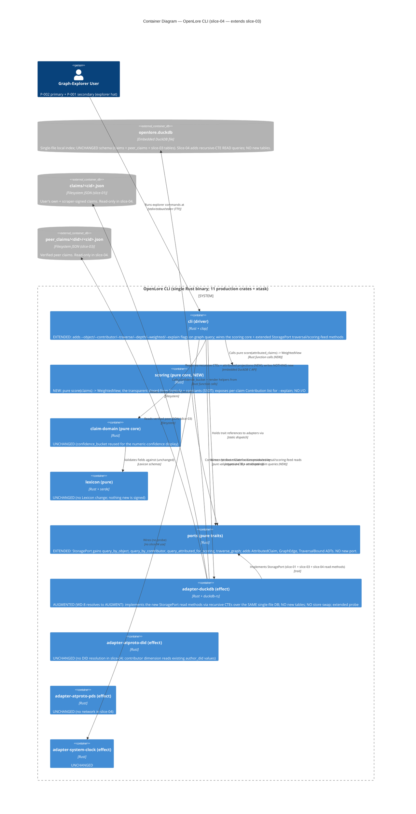
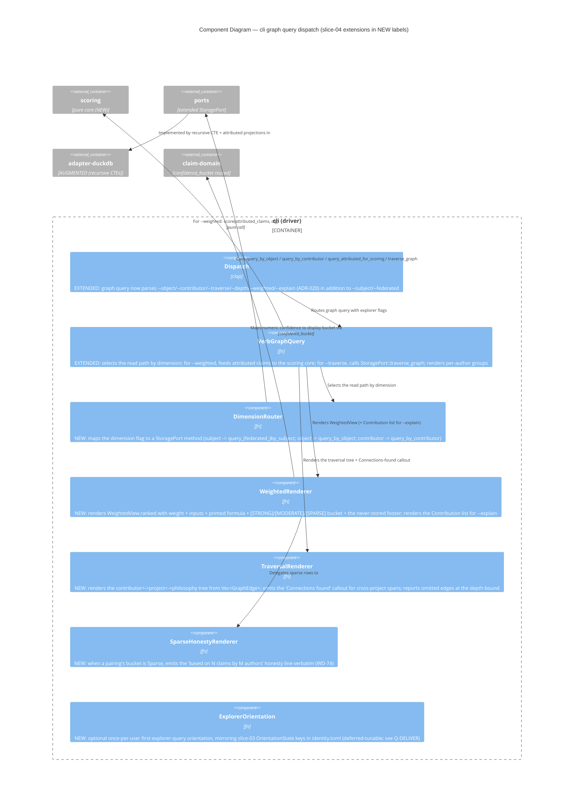

# Architecture Design — openlore-scoring-graph (slice-04)

- **Wave**: DESIGN
- **Date**: 2026-05-28
- **Architect**: Morgan (nw-solution-architect)
- **Feature**: openlore-scoring-graph (sibling feature; slice-04)
- **Style**: Hexagonal (Ports + Adapters), Modular Monolith, single-binary CLI (inherits ADR-009 from slice-01)
- **Paradigm**: Functional-leaning Rust — pure core + effect shell (inherits ADR-007)
- **Extends**: `docs/feature/openlore-federated-read/design/architecture-design.md` (slice-03)
- **Inherits**: All 19 ADRs (ADR-001..ADR-019), WD-1..WD-68 (cumulative), the 12 cross-feature invariants in `docs/product/architecture/brief.md`, the slice-03 I-FED-1..7 anti-merging invariants, and WD-69..WD-79 from this feature's DISCUSS
- **Proposes**: ADR-020 (graph-query verb amendment — explorer dimensions/traversal/weighting flags), ADR-021 (DuckDB recursive-CTE graph traversal — the WD-8 store revisit resolution), ADR-022 (pure `scoring` core + anti-merging-in-aggregates invariant)

This document is the architectural DELTA for slice-04. Slice-03's
architecture is the inherited baseline; everything not mentioned here is
unchanged. Implementation code is software-crafter's domain in DELIVER;
this document fixes contracts, boundaries, and trust gates.

Slice-04 is the **architecturally meatiest** read/view slice so far: it
triggers the WD-8 store revisit, introduces the first genuinely new
pure-domain concept since slice-02 (the `scoring` core), and carries the
slice-03 anti-merging invariant into a NEW failure surface — aggregates.

## 1. Scoring-graph overview

Slice-04 extends the slice-01/03 read surface from "list attributed claims"
to "explore, traverse, and transparently weight the LOCAL federated graph"
— the union of the user's own claims (slice-01 `claims`), peer claims pulled
via slice-03 (`peer_claims`), and scraper-signed claims (slice-02, which are
normal author claims in `claims`). It creates, signs, and publishes NOTHING
and introduces NO new network surface (WD-79).

Three new user-visible capabilities, all on the existing `graph query` verb:

1. **New query dimensions** — `--object <philosophy>` (which projects embody
   a philosophy, grouped by subject) and `--contributor <did>` (one
   developer's reasoning trail), alongside the inherited `--subject`.
2. **Bounded traversal** — `--traverse [--depth K]` walks
   contributor↔project↔philosophy edges (each edge = exactly one signed
   claim), bounded to default depth 2, surfacing non-obvious cross-project
   spans.
3. **Transparent weighting** — `--weighted` ranks (subject, object) pairings
   by a DERIVED, DISPLAY-ONLY adherence weight computed by a PURE `scoring`
   core via a small closed-form formula (no ML); `--explain <subject>`
   reproduces the per-claim arithmetic by hand.

The architecture is an EXTENSION, not a re-architecture:

- No new architectural style.
- **One new PURE crate** (`scoring`) — the first new pure-domain concept
  since `scraper-domain` (slice-02). It holds NO I/O and the formula
  constants as SSOT.
- **No store swap.** `adapter-duckdb` is AUGMENTED with recursive-CTE
  traversal + scoring-feed queries in the same single-file store. The WD-8
  revisit resolves to AUGMENT, not SWAP (Section 9; ADR-021).
- **Zero new tables.** Weights/buckets are derived + display-only and have
  NO persisted source (WD-72).
- **Zero new production dependency.** Recursive CTEs are a built-in DuckDB
  SQL feature; the scoring core is pure arithmetic (Section 11 / technology-stack.md).
- New CLI flags on the existing `graph query` verb (ADR-020), governed by
  the inherited ADR-003 grammar invariants.

## 2. Quality-attribute drivers

In priority order (derived from outcome-kpis.md + the load-bearing WD-71..74):

| # | Quality | Driver | Architectural response |
|---|---|---|---|
| 1 | **Scoring transparency / auditability** (no ML) | KPI-GRAPH-3 every weight reproducible; WD-71 load-bearing | PURE `scoring` crate (ADR-022); small closed-form formula; constants are SSOT in the core; `--explain` renders the core's intermediate per-claim `Contribution` list; formula printed in output; `weight_equals_formula` property test (Gate 2) |
| 2 | **Anti-merging in aggregates** (zero attribution loss) | KPI-GRAPH-2; WD-73 load-bearing; extends slice-03 I-FED-1 | A weight is an aggregate VIEW that decomposes to its `(author_did, claim_cid)` contributions; the scoring boundary uses a non-`Option` `author_did` (compile error if dropped); `no_cross_table_join_elides_author` xtask rule extends to scoring/traversal queries; `scoring_aggregate_preserves_attribution` behavioral gate (Gate 1) |
| 3 | **Sparse honesty** (zero manufactured confidence) | KPI-GRAPH-4; WD-74 load-bearing | `[STRONG]/[MODERATE]/[SPARSE]` is a DISPLAY-ONLY bucket derived by the pure core from `(weight, claim_count, distinct_author_count)`; sparse subgraphs render the "based on N claims by M authors" honesty line; `sparse_renders_sparse` gate (Gate 3) |
| 4 | **Connection discovery** (the north star) | KPI-GRAPH-1 ≥60% of explorer sessions surface a non-obvious connection | Bounded recursive-CTE traversal (ADR-021); the "Connections found" callout names contributors spanning ≥2 projects; `graph.connection.surfaced` tracing event (DEVOPS) |
| 5 | **Weights never persisted** (display-only discipline) | WD-72 / WD-10 / I-6 extended | NO persistence code path exists for `adherence_weight`/`weight_bucket`; they live only in the render layer; `weight_and_bucket_never_persisted` gate (Gate 4) |
| 6 | **Local-first latency** | KPI-GRAPH-6 friction kills exploration | Inherits slice-01/03 local-first: all explorer reads are local-only; bounded traversal depth (default 2) prevents fan-out blowup; the `graph.query.duration_seconds` histogram (DEVOPS) per claim-count bucket |
| 7 | **Auditable traversal** (no invented edges) | WD-76; J-002 auditability | Every traversed edge maps to exactly one `claim_cid`; the recursive CTE walks existing `claims`+`peer_claims` rows only; `traversal_invents_no_edges` gate (Gate 5) |

Non-drivers for slice-04: persisted/federated scores (WD-72 forbids;
slice-05+); ML/learned weighting (WD-71 forbids); multi-user/cohort
aggregation across many users' graphs (WD-79 — slice-05 AppView); push/real-
time graph updates (inherits the slice-03 pull-on-demand model).

## 3. C4 Level 1 — System Context (extended for slice-04)

```mermaid
C4Context
    title System Context — OpenLore (slice-04 scoring-graph; extends slice-03)

    Person(user, "Graph-Explorer User (P-002 primary + P-001 secondary)", "Researcher/Tech Lead OR Senior Engineer wearing the graph-explorer hat; orienting a decision around a philosophy/project/contributor")

    System(openlore, "OpenLore CLI", "Composes, signs, persists, publishes, federates, AND now explores/traverses/weights philosophical claims with per-author attribution preserved through aggregates")

    System_Ext(own_pds, "User's Own ATProto PDS", "Hosts the user's signed claims (slice-01). NOT contacted by any slice-04 explorer verb (read-only, WD-79).")
    System_Ext(peer_pds, "Peer ATProto PDS(es)", "Source of peer claims pulled in slice-03. NOT contacted by slice-04 (scoring reads the local peer_claims cache).")
    System_Ext(fs, "Local Filesystem (XDG paths)", "~/.local/share/openlore/ — DuckDB file + claims/ + peer_claims/. Slice-04 READS only; writes nothing new.")

    Rel(user, openlore, "Runs explorer commands via", "graph query --object | --contributor | --traverse | --weighted | --explain")
    Rel(openlore, fs, "Reads DuckDB index + on-disk artifacts (local-only; network disabled)", "filesystem syscalls")

    Rel(openlore, own_pds, "NOT contacted by slice-04 explorer verbs", "(read-only slice)")
    Rel(openlore, peer_pds, "NOT contacted by slice-04 explorer verbs", "(scoring reads local cache)")

    UpdateRelStyle(openlore, own_pds, $textColor="grey", $lineColor="grey", $offsetX="-40")
    UpdateRelStyle(openlore, peer_pds, $textColor="grey", $lineColor="grey", $offsetX="-40")
```

What changed from slice-03's L1:

- **Graph-Explorer User** wears the new graph-explorer hat (P-002 primary,
  P-001 secondary, WD-70). The federation-reader hat (slice-03) still
  exists; slice-04 adds exploration on top of what was pulled.
- **Own PDS and Peer PDSes are shown grey / NOT-contacted**: slice-04 is a
  read-only slice over the LOCAL graph (WD-79). No explorer verb opens a
  socket. This is the architectural realization of the local-first guardrail
  (inherits slice-01 KPI-5 / I-9).
- **No new external system.** Slice-04 adds zero external trust boundaries.

## 4. C4 Level 2 — Containers (extended for slice-04)



What changed from slice-03's L2:

- **NEW crate `scoring` (PURE).** Unlike slice-03 (zero new crates), slice-04
  adds ONE pure crate because the scoring formula is a genuinely new
  pure-domain concept — distinct ADTs (`AttributedClaim`, `Contribution`,
  `WeightedView`), the formula constants as SSOT, and a clean
  unit/mutation-test surface. It is the symmetric counterpart to
  `scraper-domain` (slice-02's pure derivation core). See ADR-022 + WD-82.
  The no-new-crate ethos (slice-03 WD-26) applies to **production runtime
  dependencies and storage**; a pure workspace member with no I/O does not
  add an operational boundary.
- **`adapter-duckdb` AUGMENTED, NOT swapped.** The WD-8 revisit resolves to
  AUGMENT DuckDB with recursive CTEs (Section 9; ADR-021). Same single file,
  same connection pool, NO new tables, NO graph-store dependency.
- **`StoragePort` EXTENDED** (NOT a new port). The dimension/traversal/
  scoring-feed methods are storage reads against the same store; folding them
  into the existing `StoragePort` keeps the read surface coherent (mirrors
  how slice-03 added `query_federated_by_subject` to `StoragePort` rather
  than a new port). See WD-83.
- **No Lexicon change, no `claim-domain` change.** Nothing is signed; the
  numeric `confidence` is read as-is (Gate 6).
- **`adapter-atproto-*` and `adapter-system-clock` UNCHANGED.** No network,
  no new timestamps.

## 5. C4 Level 3 — Components (complex subsystems only)

Slice-04 adds three component-level concerns worth L3 diagrams:

1. **`scoring` (pure core)** — the load-bearing transparency surface; the
   formula + the intermediate `Contribution` list that `--explain` renders.
2. **`cli` graph-query dispatch** — the extended verb that fans into the new
   dimensions, traversal, and weighting, then routes attributed claims
   through the pure scoring core (the composition seam where anti-merging
   must hold).

### 5.1 Component diagram — `scoring` (pure core; NEW)

```mermaid
C4Component
    title Component Diagram — scoring (pure core; slice-04 NEW)

    Container_Boundary(scoring, "scoring (pure core)") {
        Component(score_fn, "score", "Pure fn", "score(claims: &[AttributedClaim], cfg: &ScoringConfig) -> WeightedView. The single entry point. Deterministic; same input -> same output.")
        Component(contrib, "contributions_for", "Pure fn", "Computes the per-claim Contribution list for one (subject, object): base = confidence; author_distinct_bonus; cross_project_triangulation_bonus. The auditable unit --explain renders.")
        Component(bucketize, "weight_bucket", "Pure fn", "Maps (weight, claim_count, distinct_author_count) -> WeightBucket {Strong|Moderate|Sparse}. DISPLAY-ONLY. Sparse is driven by evidence breadth, not just weight magnitude (WD-74).")
        Component(cfg, "ScoringConfig (constants SSOT)", "const struct", "author_distinct_bonus=0.25; cross_project_triangulation_bonus=0.5; bucket thresholds. The WD-77 defaults; DESIGN-tunable; small/closed-form/no-ML (WD-71).")
        Component(adts, "ADTs", "types", "AttributedClaim {author_did: Did, cid: Cid, subject, object, confidence: f64, ...}; Contribution {author_did, cid, base, applied_bonuses, subtotal}; WeightedView {ranked: Vec<WeightedPairing>}; WeightedPairing {subject, object, weight, bucket, contributions: Vec<Contribution>}.")
    }

    Container_Ext(ports_ext, "ports", "AttributedClaim source type")
    Container_Ext(cli_ext, "cli (driver)", "calls score(); renders WeightedView + Contribution list")

    Rel(cli_ext, score_fn, "Calls with attributed claims read from StoragePort", "score(claims, cfg)")
    Rel(score_fn, contrib, "Computes per-pairing contributions via", "")
    Rel(score_fn, bucketize, "Annotates each pairing with a display bucket via", "")
    Rel(score_fn, cfg, "Reads constants from", "")
    Rel(contrib, cfg, "Reads bonus constants from", "")
    Rel(cli_ext, adts, "Renders WeightedView.ranked + each WeightedPairing.contributions (for --explain)", "")
```

Specification-level invariants for `scoring` (the pure core):

1. **No I/O, ever.** `scoring` depends only on `std` + pure value types from
   `ports`/`claim-domain` (the `Did`/`Cid` types). It MUST appear in the
   `xtask check-arch` pure-core allowlist (I-1/I-2). Compile error if it
   touches `duckdb`, `tokio`, `reqwest`, `std::fs`, `std::time::SystemTime`.
2. **Determinism.** `score(claims, cfg)` is a pure function of its inputs;
   computing it twice yields a byte-identical `WeightedView`. Property test
   `weight_is_deterministic`.
3. **Reproducibility (WD-71/Gate 2).** For every `WeightedPairing`, the
   displayed `weight` MUST equal the sum of its `Contribution.subtotal`
   values. The `Contribution` list IS the by-hand reproduction `--explain`
   prints. Property test `weight_equals_sum_of_contributions`.
4. **Anti-merging at the type level (WD-73/Gate 1).** Every `Contribution`
   carries a non-`Option<Did>` `author_did` and a `Cid`. A `WeightedPairing`
   CANNOT exist without its contributing `(author_did, cid)` tuples — the
   aggregate decomposes by construction. There is no API that returns a bare
   weight without its contributions.
5. **Sparse honesty driven by evidence breadth (WD-74).** `weight_bucket`
   takes `claim_count` and `distinct_author_count`, not just `weight`: a
   single high-confidence claim is `[SPARSE]`, never `[STRONG]`, because one
   author on one project is thin regardless of magnitude. Unit test
   `single_claim_is_sparse_even_at_high_confidence`.
6. **Numeric confidence in, no rounding (Gate 6).** The `f64` `confidence`
   the formula consumes is the same value the per-claim rows display; buckets
   are a separate display concern computed by `claim-domain::confidence_bucket`.

### 5.2 Component diagram — `cli` graph-query dispatch (extended for slice-04)



Specification-level invariants for `cli` (slice-04 additions):

1. **The scoring core is the SINGLE source of weight arithmetic.**
   `--weighted` and `--explain` render the SAME `WeightedView` /
   `Contribution` values; `--explain` renders the intermediate contributions,
   `--weighted` renders the summed weight + bucket. There is NO second
   weight-computing code path (mirrors slice-03's single-publish-path
   discipline). Enforced by code review + Gate 2.
2. **`--weighted`/`--traverse`/`--explain` are OPT-IN flags.** Without them,
   `graph query --object`/`--contributor` behave as plain attributed
   listings; `graph query --subject` is byte-identical to slice-01/03.
3. **Anti-merging holds at the render boundary (WD-73).** Every row the
   renderer emits — including inside a `WeightedPairing` or a traversal node —
   carries exactly one `author_did`. The renderer NEVER emits a "consensus"
   row. The scoring core's type-level guarantee (5.1 invariant 4) makes this
   unviolatable from the data side; the renderer adds the no-merge footer.
4. **Sparse renders sparse (WD-74).** When `weight_bucket == Sparse`, the
   honesty line fires; the renderer MUST NOT suppress it for brevity.
5. **`--explain` for a subject absent from the result set is a usage error**
   (non-zero exit), distinct from an empty dimension query (exit 0) —
   per US-GRAPH-005 Example 3.

## 6. Integration patterns

### 6.1 Internal — port/method additions

| Port | Status | New methods | Notes |
|---|---|---|---|
| `StoragePort` | UNCHANGED interface family; **gains** four read methods | `query_by_object(object) -> Vec<AttributedClaim>`; `query_by_contributor(author_did) -> Vec<AttributedClaim>`; `query_attributed_for_scoring(filter: ScoringFilter) -> Vec<AttributedClaim>`; `traverse_graph(start: GraphNode, bound: TraversalBound) -> Vec<GraphEdge>`. Every method projects `author_did` explicitly (anti-merging). The federated union (own + peer) is internal to each method, exactly as `query_federated_by_subject` does. |
| `PeerStoragePort` | UNCHANGED | n/a | Slice-04 reads via the federated `StoragePort` methods which union `claims` + `peer_claims`; the slice-03 `PeerStoragePort` surface is unchanged. |
| `IdentityPort` / `PdsPort` / `ClockPort` | UNCHANGED | n/a | No network, no new timestamps in slice-04. |

`AttributedClaim` is the shared boundary value (defined in `ports`, consumed
by both `cli` and the pure `scoring` core):

```
AttributedClaim {
    author_did: Did,            // non-Option; LOAD-BEARING (anti-merging)
    cid: Cid,
    subject: String,
    predicate: String,
    object: String,
    confidence: f64,            // numeric [0.0, 1.0]; the scoring input (Gate 6)
    composed_at: DateTime<Utc>,
    relationship: AuthorRelationship,   // You | SubscribedPeer | UnsubscribedCache (slice-03 reuse)
}
```

Dispatch model:

- All new `StoragePort` methods are SYNC (local DB only); they follow
  `StoragePort`'s existing sync trait declaration (no `async_trait`).
- The `scoring` core is a plain pure function library; no trait, no dispatch.

### 6.2 External — none

Slice-04 adds ZERO external integrations. No peer PDS reads, no PLC
resolution, no own-PDS writes. The explorer surface is local-only (WD-79).
This is an architectural property, verified by the local-first probe (the
explorer verbs succeed with the network disabled; inherits I-9 / KPI-5).

### 6.3 Probe contract for the AUGMENTED adapter

`adapter-duckdb` is the only adapter touched in slice-04. Its `StoragePort`
probe EXTENDS to exercise the new recursive-CTE and scoring-feed reads. No
new adapter, no new port, so no new probe surface beyond this extension.

| Adapter / probe extension | What it exercises |
|---|---|
| `adapter-duckdb` (extended `StoragePort::probe`) | Slice-01/03 probes (schema match; sentinel round-trip; fsync honored; cross-store FederatedRow round-trip) + slice-04 additions: (a) **scoring-feed attribution round-trip** — write 1 own + 2 peer claims on the same (subject, object) by distinct authors, call `query_attributed_for_scoring`, assert exactly 3 `AttributedClaim`s with three distinct non-empty `author_did`s (the anti-merging-in-aggregates substrate check); (b) **recursive-CTE termination** — run `traverse_graph` with a deliberately cyclic fixture (A→B→A via two claims) at depth 3, assert it terminates within the 250ms budget and emits each edge exactly once (no infinite loop, no duplicate edge); (c) **depth-bound honored** — `traverse_graph` at `depth=2` on a depth-4 fixture returns only ≤depth-2 edges and reports the omitted count. |

The substrate gold-test matrix (ADR-009) extends with one slice-04-specific
substrate concern:

- **Recursive-CTE cycle safety.** DuckDB recursive CTEs do NOT auto-detect
  cycles; an unbounded `WITH RECURSIVE` over a cyclic claim graph loops
  forever. The probe MUST exercise a cyclic fixture and assert termination
  via the depth bound + a visited-set guard in the CTE (ADR-021 §cycle
  safety). This is the slice-04 "what happens if the substrate lies" check:
  the substrate (SQL engine) will happily loop; the design refuses to trust
  it and bounds + dedupes explicitly.

### 6.4 Contract test recommendation (handoff to platform-architect)

**External Integrations Requiring Contract Tests: NONE NEW in slice-04.**

Slice-04 adds no external integration. The existing slice-01/03 Pact/contract
suite is unchanged. The handoff to platform-architect for slice-04 is:

```
External Integrations Requiring Contract Tests (slice-04):
- NONE. Slice-04 is a read-only LOCAL slice (WD-79); no external API consumed.
  Confirm the local-first guardrail: the explorer path adds no network call
  (extends slice-01 KPI-5 / I-9). DEVOPS instruments graph.connection.surfaced
  (KPI-GRAPH-1) and graph.query.duration_seconds (KPI-GRAPH-6), both
  privacy-preserving structural counts only — never claim contents.
```

## 7. Deployment architecture (unchanged from slice-03)

Slice-04 is the same single Rust binary. Distribution, no-services-to-run,
update strategy, CI/CD all unchanged. The on-disk footprint does NOT grow
(no new tables, no new artifact directories — weights are never persisted,
WD-72). The DuckDB file schema is unchanged from slice-03; slice-04 only adds
READ queries.

```
~/.local/share/openlore/
  openlore.duckdb        # UNCHANGED schema; slice-04 runs recursive-CTE READS over it
  claims/<cid>.json      # read-only in slice-04
  peer_claims/<did>/<cid>.json   # read-only in slice-04

~/.config/openlore/
  identity.toml          # MAY gain one optional explorer-orientation key (deferred-tunable; see Q-DELIVER)
```

## 8. Quality attribute scenarios (ATAM-light; slice-04)

| QA | Scenario | Architectural response | Sensitivity / trade-off |
|---|---|---|---|
| Scoring transparency | A user runs `--weighted --explain github:denoland/deno`; the running sum of the per-claim breakdown equals the displayed weight exactly | `--explain` renders the pure `scoring` core's `Contribution` list; `weight == sum(contributions)` is a type-level + property-tested invariant (5.1 #3) | Sensitivity: a renderer that recomputes weight independently could drift from `--explain`. Mitigation: single scoring path (6.1 #1); `weight_equals_formula` gate. |
| Anti-merging in aggregates | A weighted query over a (subject, object) with 2 distinct-author claims shows ONE pairing whose `--explain` decomposes to 2 attributed rows; NO faceless "consensus weight" | `WeightedPairing.contributions` is non-empty by construction with non-`Option` `author_did`s; `no_cross_table_join_elides_author` extends to the scoring-feed query | Sensitivity: a future dev could write a scoring query that aggregates in SQL and drops author_did. Mitigation: three-layer enforcement (type, xtask SQL-string, behavioral gate). |
| Sparse honesty | A philosophy with 1 claim by 1 author at confidence 0.95 renders `[SPARSE]` with the honesty line, NOT `[STRONG]` | `weight_bucket(weight, claim_count=1, distinct_authors=1) == Sparse` regardless of weight magnitude (5.1 #5) | Trade-off: a genuinely strong single-source claim is "under-sold" as sparse. Accepted per WD-74: thin evidence MUST look thin; this is the load-bearing UX. |
| Connection discovery | A traversal from a philosophy surfaces a contributor spanning cargo + nixpkgs as a "Connections found" callout | `traverse_graph` recursive CTE walks contributor↔project↔philosophy edges; the renderer detects ≥2-project spans | Sensitivity: dense graphs fan out. Mitigation: bounded default depth 2 (WD-76) + omitted-edge reporting. |
| Weights never persisted | Inspecting DuckDB tables + on-disk artifacts after a weighted query finds NO weight/bucket anywhere; re-running after a `peer pull` yields different weights | No persistence code path exists for weights (they live only in the render layer); the scoring core returns values, never writes | Sensitivity: a future "cache the score for speed" optimization would violate WD-72. Mitigation: `weight_and_bucket_never_persisted` gate + the revisit-requires-ADR rule. |
| Traversal invents no edges | Every displayed traversal edge is lookuppable via `graph query --subject <project>` as a specific `claim_cid` | Each `GraphEdge` carries the backing `claim_cid`; the CTE selects FROM existing claim rows only — it never CROSS JOINs to fabricate pairs | Sensitivity: a similarity/inference heuristic would fabricate edges. Mitigation: edges = signed claims only; `traversal_invents_no_edges` gate. |
| Local-first latency | A weighted+traversed query on a ≤200-claim graph returns within the KPI-GRAPH-6 budget with the network disabled | All reads local; bounded depth; DuckDB columnar scan on indexed `subject`/`object`/`author_did` | Trade-off: recursive CTE cost grows with graph density. Mitigation: depth bound + the revisit trigger (ADR-021) toward a graph store if dogfeed shows the ≤200-claim P95 breached. |

## 9. THE WD-8 store revisit — AUGMENT DuckDB (decision + trade-off table)

The brief locked WD-8: "revisit DuckDB at slice-04 when graph traversal
becomes the dominant workload." Slice-04 triggers the revisit. DISCUSS stayed
solution-neutral (WD-78); the decision is DESIGN's (OD-GRAPH-1). **Decision:
AUGMENT `adapter-duckdb` with recursive-CTE traversal + scoring-feed queries.
DO NOT swap/add a dedicated graph store.** Recorded as WD-81; rationale in
ADR-021.

### Trade-off table

| Factor | AUGMENT DuckDB (recursive CTE) — **CHOSEN** | SWAP/ADD a graph store (e.g., Kùzu / KuzuDB embedded, or an in-memory petgraph layer) |
|---|---|---|
| **Traversal workload size (slice-04)** | Local graph: low thousands of claims per install; bounded default depth 2. Recursive CTEs handle this comfortably in a columnar scan. | Over-provisioned for slice-04 scale; a graph store's traversal advantages materialize at 100k+ edges / deep unbounded walks, which WD-76's bounded depth explicitly avoids. |
| **Query complexity** | contributor↔project↔philosophy is a bipartite-ish walk over claim rows; expressible as a `WITH RECURSIVE` over `claims ∪ peer_claims` with a visited-set + depth column. Moderate SQL, well-understood. | Native graph query language (Cypher) is more ergonomic for deep traversal, but slice-04's traversal is shallow and bounded; the ergonomics gain is marginal. |
| **Dependency cost** | ZERO new production dependency. Recursive CTEs are built into DuckDB (already pinned, ADR-001). No `cargo deny` change (I-11). | A new embedded graph DB crate = new dependency, new license review, new `cargo deny` entry, new adapter crate, a SECOND store file to back up, and a data-sync problem (claims live in DuckDB; a graph store would mirror them). |
| **Probe / Earned Trust cost** | Extend the existing `adapter-duckdb` probe (one new probe scenario: recursive-CTE cycle/termination + depth bound). I-4/I-5 already satisfied by the adapter. | A new adapter needs its OWN `probe()` (I-4), its own substrate gold-tests, and a sync-consistency probe between the two stores — a large Earned-Trust surface for marginal benefit. |
| **Local-first simplicity** | Single embedded file unchanged (the slice-01/03 operational model: one file, one backup target). | Two stores break the single-file simplicity that P-002 values; a sync layer is a new failure mode. |
| **Anti-merging enforcement** | The slice-03 `no_cross_table_join_elides_author` xtask SQL-string rule EXTENDS naturally to the new CTE queries (they are SQL string literals in the same adapter). | A non-SQL graph store would need a NEW structural enforcement mechanism for the anti-merging invariant — re-inventing the slice-03 guarantee on a new substrate. |
| **Future scale** | Revisit trigger documented (ADR-021): if dogfeed shows the ≤200-claim P95 latency budget breached OR `peer_claims` exceeds ~100k rows OR unbounded deep traversal becomes a JTBD, re-evaluate Kùzu/graph store in slice-05+. | Premature now; the right call only when evidence (not speculation) shows DuckDB CTEs are the bottleneck. |

**Conclusion**: AUGMENT is the conservative, evidence-driven call — it
matches slice-03's no-new-store ethos, adds zero production dependency,
extends the existing anti-merging enforcement onto the same SQL substrate,
and keeps the single-file local-first simplicity. A graph store is the
*right long-term home* only if/when the traversal workload genuinely outgrows
bounded-depth recursive CTEs; ADR-021 documents that revisit trigger so the
decision is reversible with data, not speculation.

## 10. Earned Trust summary (slice-04)

The ONLY adapter touched is `adapter-duckdb` (AUGMENTED). Its probe extends;
the composition root runs it before use (wire → probe → use, unchanged).

| Adapter | Probe exercises (slice-04 additions only) |
|---|---|
| `adapter-duckdb` (StoragePort) | (a) scoring-feed attribution round-trip (3 claims, 3 distinct non-empty author_dids via `query_attributed_for_scoring`); (b) recursive-CTE termination on a cyclic fixture within 250ms (the substrate-lie check: SQL will loop; the design bounds + dedupes); (c) depth-bound honored + omitted-edge count correct. |

The pure `scoring` core is NOT an adapter — it has no `probe()` (it touches
no substrate). Its Earned-Trust analog is property-based + mutation testing:

- `weight_is_deterministic`, `weight_equals_sum_of_contributions`,
  `single_claim_is_sparse_even_at_high_confidence`, plus mutation testing on
  the formula (TDD RED→GREEN is Earned Trust applied to code; mutation
  testing is Earned Trust applied to the tests). This is the methodology's
  "probe the pure core via its own discipline" pattern — the formula is the
  thing the user must be able to reproduce by hand, so the tests prove it.

Anti-merging-in-aggregates invariant (I-GRAPH-*) — three-layer enforcement
(extends slice-03 WD-30 / ADR-014):

1. **Type-level**: `Contribution.author_did` is `Did`, not `Option<Did>`;
   `WeightedPairing` cannot exist without its `contributions`. Compile error
   if dropped.
2. **Structural**: `cargo xtask check-arch` rule `no_cross_table_join_elides_author`
   EXTENDS to cover the new scoring-feed + traversal SQL string literals in
   `adapter-duckdb`.
3. **Behavioral**: integration test `scoring_aggregate_preserves_attribution`
   (DISTILL gate; KPI-GRAPH-2). A single-layer bypass is caught by ≥1 other.

## 11. Open questions for DELIVER

Deferred to DELIVER (software-crafter's call):

1. **Exact recursive-CTE SQL shape** for `traverse_graph` (the visited-set
   column representation; whether the depth column is `INTEGER` or a path
   array). ADR-021 fixes the cycle-safety + depth-bound contract; the exact
   SQL is DELIVER's, subject to the probe + Gate 5.
2. **Whether `query_attributed_for_scoring` is one method with a `ScoringFilter`
   enum or three thin methods** (by-object, by-contributor, by-subject feeding
   scoring). Recommended: one filtered method to keep the anti-merging
   enforcement surface small; DELIVER confirms.
3. **The `scoring` crate's exact module split** (one `lib.rs` vs `formula.rs`
   + `bucket.rs` + `types.rs`). No invariant blocks the choice.
4. **Whether `ScoringConfig` is a compile-time `const` or read from a future
   config file.** Slice-04 default: compile-time `const` (a constant change is
   a code change, never a learned/config weight — WD-71). A config-file path
   would require a WD + ADR.
5. **Exact `[STRONG]/[MODERATE]/[SPARSE]` threshold constants.** ADR-022 ships
   the WD-77-derived defaults; DELIVER may tune within the small/closed-form
   constraint; any change is code + a test update.
6. **The exact "Connections found" callout format + the omitted-edge line
   format** — DISTILL's acceptance tests assert specific lines; DELIVER fills
   the format that satisfies them.
7. **Whether the once-per-user explorer orientation message ships in slice-04**
   (mirroring slice-03 OrientationState) or defers. Recommended: optional;
   not load-bearing; DELIVER's call against DISTILL scenarios.

## 12. Open questions explicitly LOCKED (out of scope per DISCUSS / this DESIGN)

- **Persisted/federated scores** — locked rejected (WD-72). A future slice
  needing persistence requires a WD + ADR with rationale.
- **ML / learned weighting** — locked rejected (WD-71). The formula stays
  small, closed-form, reproducible.
- **Multi-user / cohort aggregation** across many users' graphs — deferred to
  slice-05 AppView (WD-79).
- **Retraction/counter-aware down-weighting** — slice-04 contributes all
  signed claims per their confidence; the counter relationship is SHOWN in
  `--explain`/traversal, not silently applied (OD-GRAPH-2 default; WD-85).
- **Graph-store swap** — rejected for slice-04 (WD-81 / ADR-021); revisit
  trigger documented.
- **`--depth` unbounded** — locked rejected; bounded default 2 (WD-76).

## 13. References

- `docs/feature/openlore-scoring-graph/feature-delta.md` — DISCUSS-wave locks (WD-69..WD-79)
- `docs/feature/openlore-scoring-graph/discuss/user-stories.md` — US-GRAPH-001..006
- `docs/feature/openlore-scoring-graph/discuss/shared-artifacts-registry.md` — 6 integration gates (Gate 1..6)
- `docs/feature/openlore-scoring-graph/discuss/outcome-kpis.md` — KPI-GRAPH-1..6
- `docs/feature/openlore-scoring-graph/design/component-boundaries.md` — DELTA from slice-03
- `docs/feature/openlore-scoring-graph/design/data-models.md` — scoring types + query shapes (no new persisted tables)
- `docs/feature/openlore-scoring-graph/design/technology-stack.md` — DELTA (zero new production deps)
- `docs/feature/openlore-scoring-graph/design/wave-decisions.md` — WD-80.. + OD-GRAPH resolutions
- `docs/adrs/ADR-020-graph-query-verb-amendment-explorer-flags.md`
- `docs/adrs/ADR-021-duckdb-recursive-cte-graph-traversal.md` (the WD-8 store revisit resolution)
- `docs/adrs/ADR-022-pure-scoring-core-anti-merging-in-aggregates.md`
- Slice-03 architecture (inherited baseline):
  - `docs/feature/openlore-federated-read/design/architecture-design.md`
  - `docs/feature/openlore-federated-read/design/component-boundaries.md`
  - `docs/feature/openlore-federated-read/design/data-models.md`
- Slice-01 baseline: `docs/feature/openlore-foundation/design/data-models.md` (claims schema + StoragePort)
- ADR-001 (DuckDB, revisited), ADR-003/013 (verb contract, amended), ADR-007 (functional), ADR-009 (hexagonal)
- Cross-feature SSOT: `docs/product/architecture/brief.md`
