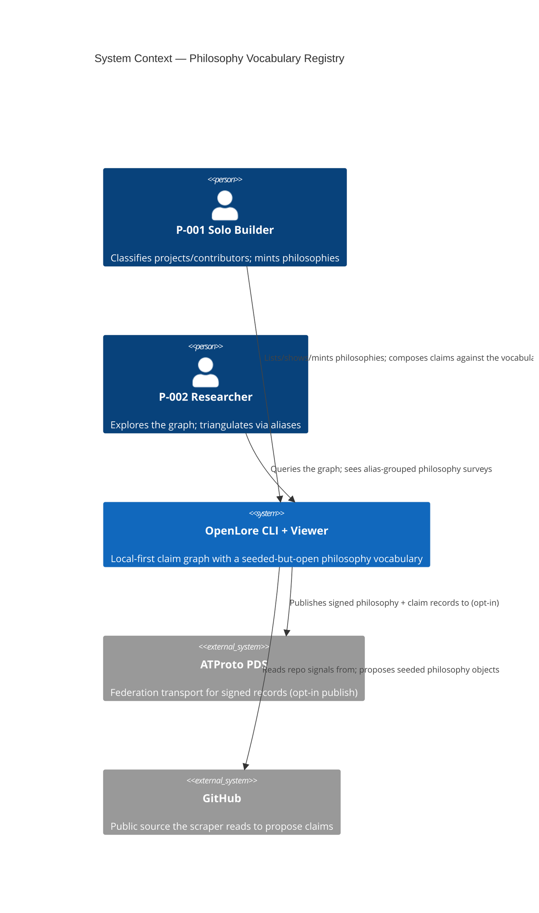
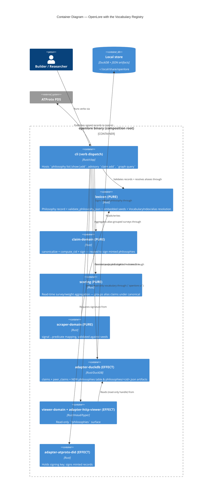
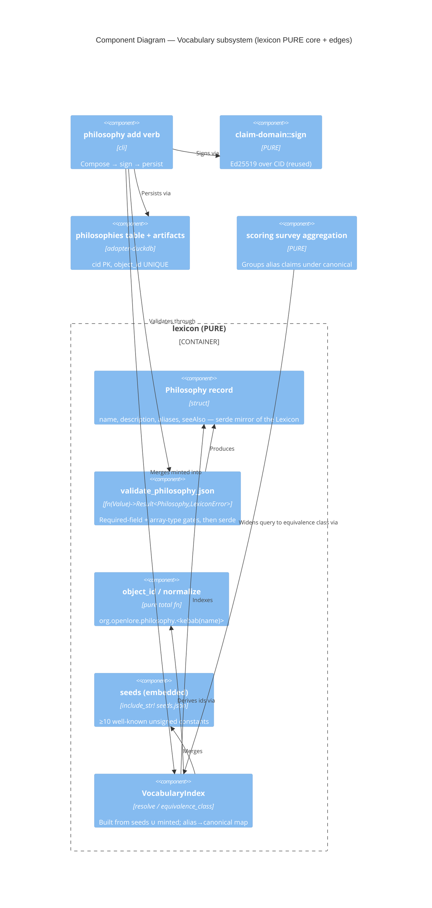

# Architecture Design — philosophy-vocabulary-registry

> DESIGN wave (Morgan / nw-solution-architect). Paradigm: functional-leaning Rust
> (ADR-007). Companion ADR: **ADR-059**. Scope: make `philosophy` a first-class,
> discoverable, seeded-but-open shared vocabulary. Design only — no implementation.

## 1. System context and capabilities

The vocabulary registry is a **cross-cutting extension** of the existing OpenLore modular
monolith, not a new subsystem. It adds one CLI verb family (`philosophy list|show|add`),
completes a RED-scaffold record type + validator, ships an embedded seed set, plugs a pure
alias-resolution seam into read-time aggregation, adds an advisory line to `claim add`, adds
a read-only `/philosophies` viewer surface, and points the scraper at the seeds as its
single source. Every constraint is inherited from the platform: local-first/offline,
claims-not-truth (no arbiter), anti-merging, signed records, read-only viewer.

### C4 Level 1 — System Context (MANDATORY)



### C4 Level 2 — Container (MANDATORY)



### C4 Level 3 — Component (Vocabulary subsystem)



## 2. Existing-system reuse (reuse-first; principle 5)

| Need | Existing seam reused | New work |
|---|---|---|
| Record type + validator | `lexicon::philosophy` + `validate_claim_json` pattern in `claim.rs`; shared `LexiconError` | Reconcile struct to schema; implement `validate_philosophy_json` |
| Embedded Lexicon resource | `PHILOSOPHY_LEXICON_JSON = include_str!(...)` | Add `seeds.json` via `include_str!` |
| Signing a minted record | `claim_domain::{canonicalize, compute_cid, sign}` (ADR-006) | None — reuse verbatim |
| Persist artifact + DB row | `adapter-duckdb::write_signed_claim` (tmp+fsync+rename + tx); `schema_v3` migration runner | `schema_v4` + `philosophies` table + `philosophies/` dir |
| CLI verb structure | `Command` enum + `verbs/claim_add.rs` two-prompt flow | `Command::Philosophy` + 3 verb modules |
| Read-time aggregation | `store_read::query_philosophy_survey` + `scoring` core | Widen filter to equivalence class; group under canonical |
| Advisory compose | `render_compose_preview` in `claim_add.rs` | Add one advisory line from `VocabularyIndex` |
| Read-only viewer | `viewer-domain` + `adapter-http-viewer`; `LANDING_HUB_SURFACES` (slice-21) | `/philosophies` surface + nav entry |
| Scraper single source | `scraper-domain::signal_predicate_mapping.yaml` | Validate every predicate against seeds |

**No existing alternative** exists for the seed set, the `VocabularyIndex`, or the
`philosophies` table — each is justified new work inside an existing crate.

## 3. Component boundaries + dependency-inversion

- **PURE core (zero I/O, total functions)** — `lexicon`: `Philosophy`, `validate_philosophy_json`,
  `object_id`/`normalize`, embedded `seeds`, `VocabularyIndex` (`resolve`, `equivalence_class`).
  `claim-domain`: signing primitives (reused). `scoring`: alias-grouped aggregation. These
  import no `std::fs`/`net`/`time` — enforced by `xtask check-arch` (ADR-009).
- **EFFECT shell** — `adapter-duckdb` (persist/read philosophies), `adapter-atproto-did`
  (sign), `adapter-http-viewer` (serve), `adapter-atproto-pds` (opt-in publish). Each behind
  its existing port trait in `crates/ports`.
- **Composition root** — `cli` wires adapters into the pure pipeline; the `ui` verb keeps its
  own read-only root (no signing key in the web process — I-VIEW-1/3, D5).

Dependencies point inward: adapters depend on ports + pure core; pure core depends on nothing
outward. The registry adds no new port trait — minted persistence extends the existing
`StoragePort`/store surface; reads extend `StoreReadPort`.

## 4. Data models

### 4.1 Philosophy record (serde mirror of `lexicons/org/openlore/philosophy.json`)

```
Philosophy {
  name: String,                          // required
  description: String,                   // required
  aliases:  Vec<String>  = [],           // optional (serde default)
  see_also: Vec<String>  = [],           // optional (serde rename "seeAlso", default)
}
```
Drops the scaffold's non-schema `id`/`label`. Object id is **derived, never stored**.

### 4.2 Object-id derivation (pure, total)

```
object_id(name) = "org.openlore.philosophy." + normalize(name)
normalize(name): lowercase → trim → whitespace/underscore runs → '-' → keep [a-z0-9-]
```
Empty/all-invalid name rejected at the mint smart constructor, never at derivation.

### 4.3 VocabularyIndex (pure)

```
VocabularyIndex {
  by_object:           Map<object_id, Philosophy>,   // seeds ∪ minted
  alias_to_canonical:  Map<object_id, object_id>,    // normalize(alias) → canonical id
}
resolve(o)             -> Option<canonical object_id>  // identity if canonical, else alias lookup
equivalence_class(c)   -> [c, ...alias object_ids]     // for read-time widening
```

### 4.4 Seed set (embedded `seeds.json`, ≥10, unsigned constants — KPI-PV-1)

`memory-safety`, `type-safety`, `test-driven`, `documentation-first`,
`dependency-pinning`, `semantic-versioning`, `reproducible-builds`, `local-first`,
`federation-first`, `backward-compatibility`, `minimalism`, `immutability`.
Each carries a one-paragraph `description` and optional `aliases` (e.g. memory-safety →
`[mem-safety, memory-safe]`). Exact prose is content (PO/crafter); design fixes the set
shape + count.

### 4.5 Minted storage layout (mirrors claims)

```
<root>/philosophies/<cid>.json        # signed artifact (tmp+fsync+rename)
philosophies table (schema_v4):
  cid PK | object_id UNIQUE | name | description | author_did | composed_at | artifact_path
```
`object_id UNIQUE` + a pre-check against the seed set enforce no-duplicate-id (AC-003.3).

## 5. Per-slice architectural notes (which seam each slice touches)

| Slice | Seam(s) touched | Note |
|---|---|---|
| **22 seed+list** (foundation) | `lexicon` (struct reconcile, `validate_philosophy_json`, `seeds.json`, `VocabularyIndex`); `cli` (`philosophy list`) | No storage/signing — list reads embedded seeds; offline by construction (AC-001.4). Thin discovery skeleton. |
| **23 show** | `cli` (`philosophy show`); `lexicon` (`VocabularyIndex::resolve`) | Reads seeds ∪ minted union; unknown → non-zero exit, plain message (AC-002.2). |
| **24 mint** | `cli` (`philosophy add`); `claim-domain` (sign, reused); `adapter-duckdb` (`schema_v4` + `philosophies` table + artifact write) | Mirrors `claim add` sign→persist; author DID recorded (AC-003.2); collision refused (AC-003.3). |
| **25 advisory compose** | `cli` (`claim_add` preview); `lexicon` (`VocabularyIndex`) | One advisory line; signed bytes byte-unchanged (AC-004.3). |
| **26 alias triangulation** | `lexicon` (`equivalence_class`); `adapter-duckdb::store_read` (widen `query_philosophy_survey` filter to the class); `scoring` (group under canonical) | Read-time derivation only; stored objects immutable (AC-005.2); UNION-ALL still projects `author_did` (anti-merging). |
| **27 viewer surface** | `viewer-domain` + `adapter-http-viewer` (`/philosophies`); slice-21 `LANDING_HUB_SURFACES` | Read-only, no authoring control, no key in web process (D5/I-VIEW-1/3). |
| **28 scraper single source** | `scraper-domain` mapping; validated against `lexicon` seeds | Every proposed object resolves in the seed set; no drift string (AC-007). |

## 6. Technology stack

**No additions.** All existing workspace deps: `serde`/`serde_json` (record + validate),
`clap` (verbs), `duckdb` (storage), `ed25519-dalek` via `claim-domain` (sign), `maud`/`hyper`
via viewer, `serde_yaml_ng` via scraper. Licenses already MIT/Apache-2.0 (workspace policy).
Enforcement: **`xtask check-arch`** (pure-core import ban + `no_cross_table_join_elides_author`)
+ **`cargo-deny`** (ADR-007/009) — the language-appropriate architecture-rule enforcement
(principle 11). Workspace stays **21 members** (20 crates + xtask); **no new crate** (principle 8).

## 7. Quality attributes (ISO 25010)

- **Functional suitability**: object-id derivation is the deterministic join between claim
  graph and vocabulary; alias resolution total over the equivalence class.
- **Maintainability/testability**: pure record/validator/index are trivially unit- and
  property-testable; two provenance sources merge at exactly one point (`VocabularyIndex`).
- **Security/integrity/non-repudiation**: minted records signed (ADR-006); seeds are
  explicit unsigned constants — provenance is a type, not a comment.
- **Reliability**: minted persistence reuses the atomic tmp+fsync+rename + tx path; storage
  probe extended to assert `schema_v4`.
- **Portability/usability**: list/show/resolution offline, local-first (AC-001.4).
- **Trade-off**: uniform "all signed" (simpler mental model) was rejected because it needs a
  signer the seeds do not have — chose provenance-split to keep D2's no-gatekeeper honest.

## 8. Risks

| Risk | Impact | Mitigation |
|---|---|---|
| Seed vs mint union drift | `list`/`show`/resolution disagree | Single merge point `VocabularyIndex::from(seeds, minted)`; every consumer reads the index. |
| Alias normalization collision (two names normalize to one id) | Silent id clash | `object_id UNIQUE` + seed pre-check; mint refuses; test over the seed set at build time. |
| SQL aggregation creeping into the widened survey | Anti-merging breach | Aggregation stays in pure `scoring`; store read stays UNION-ALL projecting `author_did`; `check-arch::no_cross_table_join_elides_author`. |
| Scraper predicate drifts out of seeds | Orphan objects (today's `mystery`) | slice-28 test asserts every mapping predicate resolves in the seed set (KPI-PV-6). |
| `schema_v4` migration on existing stores | Upgrade breakage | Forward-only, idempotent; mirrors `schema_v3` runner + probe assertion. |

## 9. Handoff

**To DISTILL (nw-acceptance-designer):** 7 stories US-PV-001..007 map 1:1 to slices 22–28;
each AC is already a command/route with observable output. The pure seams
(`validate_philosophy_json`, `object_id`, `VocabularyIndex`) are the natural unit/property
boundaries; the verbs are the acceptance boundaries. slice-22 (seed+list) is the thin
foundation to specify first.

**To DEVOPS (nw-platform-architect):** no new infra. `schema_v4` migration added to the
storage adapter's probe/health path. **External integrations** unchanged by this feature —
the ATProto PDS (opt-in publish of signed philosophy + claim records) and GitHub (scraper
read) are the only external boundaries, both pre-existing. *Contract tests already recommended
for the ATProto PDS and GitHub adapters in prior waves (consumer-driven contracts, e.g. Pact)
remain the recommendation; this feature adds no new external service.*

**Paradigm:** functional Rust (ADR-007) — route DELIVER to `@nw-functional-software-crafter`.
Pure: `Philosophy`, validator, `object_id`/`normalize`, `VocabularyIndex`, seed constants,
alias aggregation. Effect shell: signing, `philosophies` persistence, viewer, publish.
</content>
