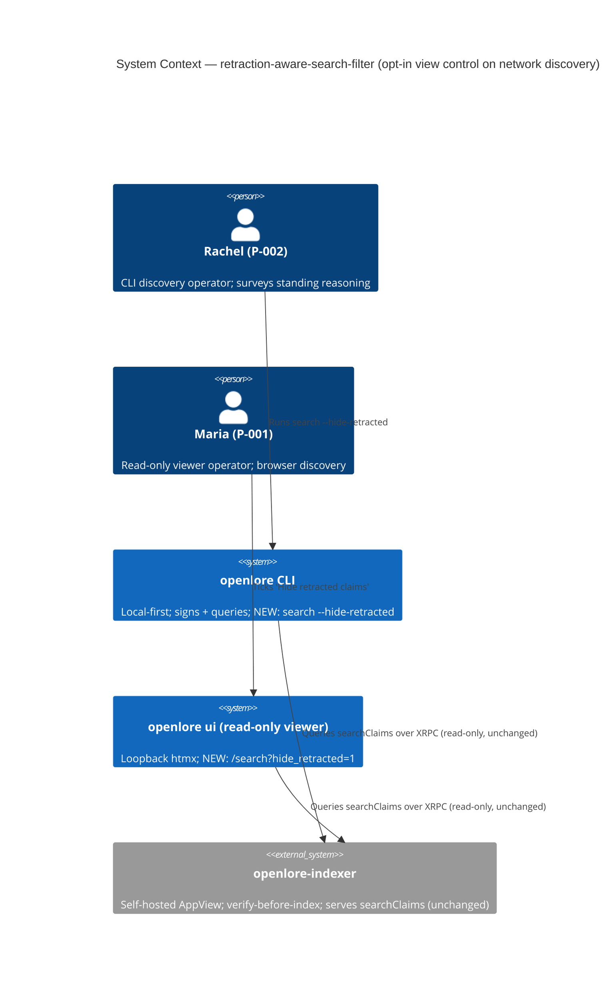
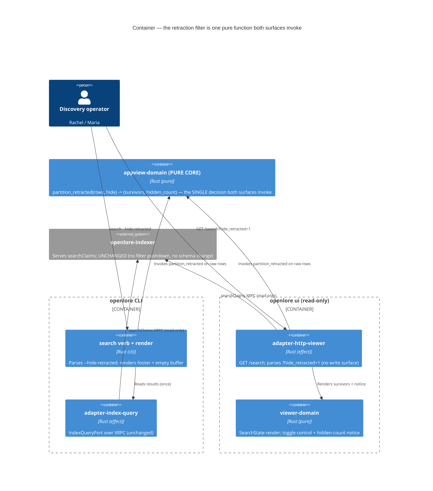

<!-- markdownlint-disable MD024 -->
# Feature Delta: retraction-aware-search-filter

> Wave: **DISCUSS** (lean mode + ask-intelligent)
> Feature type: User-facing (an explicit, opt-in FILTER on network search — CLI + read-only viewer)
> Walking skeleton: **No** — brownfield DELTA reusing the slice-05 `IndexQueryPort` +
>   `adapter-index-query` + `appview-domain` and the slice-08 viewer `/search`; no new mechanism.
> UX depth: **Comprehensive** (full emotional arc, error/empty paths, Gherkin, @property criteria)
> JTBD: YES — every story traces to **J-005** (`docs/product/jobs.yaml`); one new sub-job **J-005d** appended (not a new primary job)
> Brownfield DELTA on: `openlore-appview-search` (slice-05), `viewer-network-search` (slice-08)
> Date: 2026-07-11 · Owner: Luna (nw-product-owner)

This file is the canonical DISCUSS-wave delta for `retraction-aware-search-filter`: an
**explicit, opt-in, non-destructive** way to HIDE soft-retracted claims from a network
search result set — `openlore search … --hide-retracted` on the CLI, and an equivalent
`?hide_retracted=1` toggle on the read-only `/search` viewer surface.

Today, network search obeys invariant **I-AV-9 / OD-AV-7** — *"counter shown, not applied":*
a soft-retracted (or countered) public verified claim STAYS discoverable and is annotated,
NEVER silently filtered or down-weighted. This feature does not weaken that invariant. It
adds a **user-invoked** view control that hides soft-retracted claims *from the current view
only*, discloses exactly what it hid, and changes the default behavior by exactly nothing.
The reconciliation of "add a filter" with "never silently filter" is the cardinal Locked
Decision **D-1** below.

This is a DELTA. It REUSES the slice-05 verified-attributed search stack and the slice-08
viewer `/search` render; it adds exactly ONE new pure decision function
(`appview-domain` retraction predicate) plus a flag (CLI) and a GET-param toggle (viewer).
Zero new crates. Tier-1 content is inlined here (lean); SSOT lives under `docs/product/`;
per-slice briefs under `slices/`.

---

## Wave: DISCUSS / [REF] Persona ID

Two personas, one per surface (mirrors the slice-05 CLI / slice-08 viewer split):

- **P-002 Researcher / Tech Lead** ("Rachel") — the CLI discovery operator (slice-05
  framed P-002 as primary for the network-search job). She runs `openlore search` to
  survey standing reasoning about a philosophy or project before a decision. When some
  indexed claims have been **soft-retracted by their own authors**, they are noise for
  *this* survey — she wants to exclude them from the working view without losing the
  guarantee that nothing was hidden behind her back.
- **P-001 Senior Engineer Solo Builder** ("Maria") — the read-only `openlore ui` viewer
  operator (slices 06/07/08). She glances at network discovery in the browser and wants
  the same explicit hide control there, honoring every read-only / verified / attributed
  guardrail she already trusts.

UX guardrails inherited (both surfaces): read-only, never silently mutate or re-rank,
confidence rendered verbatim, and — new here — **never hide anything without an explicit
action and an honest disclosure of what was hidden**.

---

## Wave: DISCUSS / [REF] JTBD One-Liner

> **J-005**: *When I am orienting a decision around a philosophy or project but do NOT
> already know which developers to follow, I want to discover the signed claims that exist
> across the whole network — verified and attributed — so I can find well-evidenced
> reasoning and the people behind it.*

This feature realizes a **new refinement of J-005** captured as sub-job **J-005d** (appended
to `docs/product/jobs.yaml` this wave):

> **J-005d** — *Optionally hide soft-retracted claims from a discovery view.* When I am
> surveying network claims for a decision and some have been **soft-retracted by their own
> authors**, I want to explicitly hide the retracted ones from THIS view — reversibly and
> with full disclosure of what was hidden — so I can focus on standing reasoning without the
> system ever silently deciding for me what I do not see.

| Sub-job | Name | Stories |
|---|---|---|
| J-005d | Optionally hide soft-retracted claims from a discovery view (opt-in, non-destructive, honest) | US-RF-001 (CLI), US-RF-002 (viewer) |

No new primary job. J-005d is `load_bearing: false` — it is an optional view control layered
on the discovery corpus, not the core discovery itself.

### Four Forces (for J-005d, feeding the BDD scenarios below)

- **Push**: A survey of a well-claimed philosophy returns rows an author has *withdrawn*.
  Under I-AV-9 they still show (correctly — nothing vanishes silently), but for a focused
  decision they are noise the operator must mentally filter every time.
- **Pull**: One explicit flag/toggle collapses that noise for the current view, and tells
  her exactly how much it hid — so she can trust the shorter list is *filtered*, not
  *empty-by-nature*.
- **Anxiety**: *"If I let the tool hide things, has it become the silent aggregator this whole
  product exists to avoid? What did it drop that I should have seen?"* → Mitigation: opt-in
  (D-1), self-disclosing "N hidden" (D-4/I-RF-3), reversible per-invocation (D-7), and it
  hides ONLY author-withdrawn claims, never claims a third party merely disagrees with (D-3).
- **Habit**: Devs expect `grep -v`, `--exclude`, faceted "hide X" filters to be a *view*
  operation that never mutates the source and is trivially reversible. `--hide-retracted`
  must feel exactly that ordinary — and the default (no flag) must be byte-identical to today.

---

## Wave: DISCUSS / [REF] Locked Decisions

Full rationale in `discuss/wave-decisions.md` is intentionally NOT duplicated (lean); the
binding form is here. All decisions are D-numbered per the wave contract.

| # | Decision | Status |
|---|---|---|
| **D-1** | **I-AV-9 RECONCILIATION (cardinal).** The retraction filter is reconciled with "never silently filter" by three simultaneous constraints: **(a) opt-in** — the default view is byte-identical to today (retracted claims still shown + annotated); the filter activates ONLY on explicit `--hide-retracted` / `?hide_retracted=1`. **(b) non-destructive** — it hides from the current view only; it never mutates the index, re-verifies, re-orders survivors, or re-weights their scores. **(c) honest** — when active it discloses "N retracted claim(s) hidden". A user-invoked, disclosed, reversible filter is not *silent* filtering; I-AV-9 forbids the latter and is preserved in full. Formalized as new invariant I-RF-1..3. | LOCKED |
| **D-2** | **Pure predicate in `appview-domain`.** The filter is a pure total function over already-composed results (indicative name `retain_visible(result, hide_retracted: bool) -> bool` or `partition_retracted`). CLI and viewer only invoke it and count what it dropped. No effectful filtering, no index round-trip (ADR-007 functional core; extends the slice-05 `appview-domain` pure-core allowlist). | LOCKED |
| **D-3** | **Soft-retract ONLY; third-party counters stay shown.** `--hide-retracted` hides a claim iff its OWN author soft-retracted it (a retraction counter-claim by the same author DID referencing the original CID — RC-02 / WD-11). A claim that a *different* author merely countered/disagrees with is NOT hidden — it is a standing claim and remains shown + annotated (I-AV-9). This forbids a heckler's veto and preserves anti-merging (I-AV-2): a disagreement never removes an author's row. | LOCKED |
| **D-4** | **Honesty line mandatory when active.** When the filter is active AND hid ≥1 result, the surface MUST state the count ("N retracted claim(s) hidden") — CLI footer line; viewer results-region notice. When active but nothing matched, it MUST NOT print a misleading "0 hidden as if something happened" (it may stay silent or say "no retracted claims to hide"). A silent hide is a build-fail. | LOCKED |
| **D-5** | **Non-destructive ordering & scoring.** Survivors keep their original relative order and their original confidence/score verbatim. Hiding N rows NEVER re-ranks or re-weights the remainder (I-AV-9 "never down-weighted" carried in; @property-tested). | LOCKED |
| **D-6** | **Both surfaces, CLI-first; zero new crates.** Slice 1 = CLI `--hide-retracted` (extends the ADR-027 `openlore search` verb). Slice 2 = viewer `?hide_retracted=1` parity (extends slice-08 `/search`). Extends `appview-domain` + `cli` + `viewer-domain` + `adapter-http-viewer`; workspace stays 21 members; `check-arch` stays green. | LOCKED |
| **D-7** | **Reversible, not persisted.** The filter is per-invocation (CLI) / per-request (viewer). There is NO persisted "hide retracted" preference — a stored default would drift toward silent-by-default and violate D-1. Every run/request re-declares intent explicitly. | LOCKED |

---

## Wave: DISCUSS / [REF] Inherited & New Invariants (I-RF-* extending I-AV-* / I-VIEW-* / I-HX-*)

Binding inputs to DESIGN; NOT relitigated here.

| ID | Inherits / Extends | Carries into this feature as |
|---|---|---|
| I-RF-1 | **I-AV-9** (slice-05) | **Opt-in.** Default behavior unchanged: without the flag/param, a soft-retracted verified claim is still shown + annotated. The filter activates only on explicit user action. |
| I-RF-2 | I-AV-9 ("never down-weighted") | **Non-destructive.** View-only: no index mutation, no re-verify, no re-rank, no re-weight of survivors; survivors keep original order + confidence. |
| I-RF-3 | I-AV-9 (spirit: nothing disappears silently) | **Self-disclosing.** When active and ≥1 hidden, the surface states "N retracted claim(s) hidden". A silent hide is forbidden (build-fail). |
| I-RF-4 | **I-AV-2** (anti-merging) / WD-11 / RC-02 | **Soft-retract only.** Hides author-withdrawn claims only; third-party counters remain shown + annotated (no heckler's veto; a disagreement never removes an author's row). |
| I-RF-5 | ADR-007 / slice-05 `appview-domain` allowlist | **Pure core.** The retraction predicate is a pure total function; CLI/viewer invoke it; the index is never queried a second time to filter. |
| I-RF-6 | I-VIEW-1/2/3/4, I-HX-1..5 (slices 06/07/08) | **Read-only viewer preserved.** The viewer toggle is a GET-param / htmx control — no write/sign/subscribe route, no key in the process, loopback bind, offline (no-CDN) chrome, full page without `HX-Request`. |
| I-RF-7 | D-7 | **Reversible / not persisted.** No stored preference; per-invocation/per-request only. |
| I-RF-8 | KPI-AV-2 / KPI-AV-3 (guardrails) | Every surviving row still carries `[verified]` + `author_did`; no merged/consensus row; confidence verbatim. Filtering removes rows, never alters the anatomy of the rows that remain. |

---

## Wave: DISCUSS / [REF] Story Map and Slicing

One journey: **focus-a-network-survey-without-losing-the-safety-net**. A single coherent
arc — run a survey → notice withdrawn claims are noise for this decision → explicitly hide
them → trust the shorter list *because the tool told me what it hid and I can undo it in one
step*.

### Emotional arc

**mild-friction → deliberate-control → focused-relief → grounded-trust**

- **Entry (mild-friction)**: the survey works, but retracted rows clutter a decision the
  operator is trying to make cleanly. (Not frustration — the data is *correct*; it is just
  more than she needs right now.)
- **Deliberate-control**: she opts in — `--hide-retracted` — a conscious, reversible act.
- **Focused-relief (peak)**: the working view shows only standing reasoning; the honesty
  line confirms *"3 retracted claims hidden"* so she knows the list is filtered, not sparse.
- **Grounded-trust (exit)**: she trusts the shorter list precisely because nothing vanished
  silently — she can re-run without the flag and see everything, unchanged. The tool never
  became "the aggregator that decides for her."

Transition safety: the one risky moment is *empty-after-filter* (every result was retracted).
The design MUST buffer it with an explicit "all N results were retracted; showing none — re-run
without `--hide-retracted` to see them" state, never a bare empty result that reads as "nothing
exists here" (which would betray discoverability, the whole point of J-005).

### Shared artifacts (tracked)

| Artifact | Source of truth | Consumers | Integration risk |
|---|---|---|---|
| `retracted` marker on a result | the composed result's references/retraction graph (slice-05 `SearchResultDto.references`, DV-5) — whether it distinguishes author-retraction from third-party counter is **OD-RF-1** | the pure predicate (D-2), the "N hidden" count (D-4), both surfaces | **HIGH** — if the DTO cannot distinguish author-retraction from disagreement, D-3 cannot be honored without a DTO/ingest extension (see OD-RF-1 + Risks) |
| `hidden_count` | counts retraction **EVENTS**, not raw rows removed (per DESIGN OD-RF-1 resolution / D-RF-D5: a retraction event = the original claim C + its same-author marker record K, both hidden together, so `len(unfiltered) - len(survivors)` would double-count the marker) — produced by the pure `partition_retracted` in one pass (OD-RF-4) | CLI footer line, viewer notice | LOW — derived, single computation |
| `hide_retracted` intent | CLI `--hide-retracted` flag / viewer `?hide_retracted=1` param | the predicate call, the honesty-line trigger | LOW — per-invocation, not persisted (D-7) |

### Slicing (by outcome + risk, not feature grouping)

- **Slice 1 (CLI, ships the whole reconciliation)** — `slices/slice-01-cli-hide-retracted.md`:
  **US-RF-001**. The pure predicate + `openlore search --hide-retracted` + the "N hidden"
  honesty line + the empty-after-filter buffer + the default-unchanged regression guard. This
  slice alone proves D-1 end to end on the primary discovery surface. It is the thinnest thread
  that carries the entire I-AV-9 reconciliation.
- **Slice 2 (viewer parity)** — `slices/slice-02-viewer-toggle.md`: **US-RF-002**. The same
  explicit hide as a `?hide_retracted=1` toggle on the read-only `/search` viewer, with the
  honesty notice in both htmx shapes, graceful degradation, and read-only preserved.

### Priority Rationale

Slice 1 (CLI) first because it carries the **riskiest assumption and the entire cardinal
decision**: that a filter can be added to a "never silently filter" surface without violating
I-AV-9. If the opt-in + non-destructive + honest reconciliation (D-1) does not convince on the
CLI — the surface where P-002 does real survey work — the feature is disproven and slice 2 is
moot. Slice 1 also settles OD-RF-1 (does "retracted" mean author-withdrawn in the current DTO?)
against real data before the viewer inherits it. Slice 2 is pure surface parity over the same
pure predicate; its failure is survivable (the CLI already delivers the outcome). Within slice
1, the pure predicate + default-unchanged guard precede the honesty line, because the honesty
line has nothing truthful to report until the predicate and the count are correct.

---

## Wave: DISCUSS / [REF] System Constraints (cross-cutting)

Hold across every story (the I-RF-* invariants restated as build constraints):

- The retraction decision is a **pure total function in `appview-domain`**; both surfaces call
  it. No effectful/index-side filtering; no second index query to filter (I-RF-5, D-2).
- The **default path is byte-identical to today** — without the flag/param, output is
  unchanged from slice-05/08; this is a release-blocking regression guard (I-RF-1).
- Filtering is **view-only and reversible**: no index mutation, no re-verify, no re-rank, no
  re-weight of survivors, no persisted preference (I-RF-2, I-RF-7, D-5, D-7).
- **Only author-soft-retracted claims** are hidden; third-party counters stay shown +
  annotated (I-RF-4, D-3).
- When active and it hid ≥1 row, the surface **discloses the count**; a silent hide is a
  build-fail (I-RF-3, D-4).
- Surviving rows keep the full slice-05 anatomy: **`[verified]` + `author_did` + verbatim
  confidence, no merged row** (I-RF-8).
- The viewer toggle preserves **read-only / loopback / offline-chrome / no-JS-full-page**
  (I-RF-6).
- **Zero new crates**; `check-arch` stays green at 21 members (D-6).

---

## Wave: DISCUSS / [REF] User Stories and Acceptance Criteria

Both stories trace to **J-005** (sub-job **J-005d**). Neither is `@infrastructure` — each
delivers a user-visible, decision-enabling outcome, so each carries an Elevator Pitch. The
pure predicate (D-2) lives inside US-RF-001 as its core, not as a separate infra story (it is
one small pure function, and a standalone all-infra slice would carry no release value).

### US-RF-001: Hide soft-retracted claims from a CLI network search

- **job_id**: J-005 (sub-job J-005d)

#### Elevator Pitch

- **Before**: Rachel runs `openlore search --object org.openlore.philosophy.reproducible-builds`
  and the results include claims their own authors have since **soft-retracted** — correct to
  show (I-AV-9), but noise for the decision she is making right now; she filters them by eye
  on every run.
- **After**: she runs the same command with `--hide-retracted`; stdout shows only the standing
  claims, followed by an honest footer line — e.g. *"2 retracted claim(s) hidden (--hide-retracted
  active); re-run without it to see them."* — with every surviving row still `[verified]`,
  attributed, and confidence-verbatim, in the same order as before.
- **Decision enabled**: she decides which *standing* reasoning to pursue or cite, trusting the
  shorter list is deliberately filtered (she knows exactly how much, and can undo it in one
  re-run) rather than silently curated.

#### Problem

Rachel (P-002) surveys network claims about a philosophy or project to ground a decision.
Soft-retracted claims — withdrawn by their own authors — remain in the result set by design
(I-AV-9). For a focused survey they are noise, and eyeballing them out on every run is friction
that scales with the corpus. She needs an explicit, disclosed, reversible way to drop them from
the working view without the tool ever silently deciding what she does not see.

#### Who

- P-002 (Rachel), researcher / tech lead | at the CLI running `openlore search` | wants to
  focus a survey on standing reasoning, and will not trust a filter that hides silently.

#### Domain Examples

1. **Happy path** — Rachel runs `openlore search --object org.openlore.philosophy.reproducible-builds
   --hide-retracted`. The index holds 12 verified claims across 9 authors; `did:plc:priya-test`
   soft-retracted her `nixos/nixpkgs @ 0.90` claim and `did:plc:bjorn-test` soft-retracted one of
   his. The output shows 10 rows (the 9 authors' standing claims) and the footer
   *"2 retracted claim(s) hidden (--hide-retracted active); re-run without it to see them."*
2. **Default unchanged (I-AV-9 by default)** — Rachel runs the SAME search WITHOUT `--hide-retracted`.
   All 12 rows appear, and Priya's and Bjorn's retracted claims are shown WITH their retraction
   annotation — byte-identical to slice-05 today. No footer about hiding.
3. **Non-destructive** — with `--hide-retracted`, the 10 survivors appear in the exact same
   relative order and with the exact same verbatim confidence values (`0.85`, `0.78`, …) they had
   in the unfiltered run; no survivor is re-ranked or re-weighted.
4. **Empty-after-filter (buffer)** — Rachel searches `--object org.openlore.philosophy.dependency-pinning
   --hide-retracted`; the only 3 indexed claims for it were all soft-retracted by their authors.
   Output shows the guided line *"All 3 result(s) for this search were soft-retracted by their
   authors and were hidden (--hide-retracted active); re-run without it to see them."* — never a
   bare empty result that reads as "nothing exists".
5. **Third-party counter is NOT hidden (D-3)** — `did:plc:bjorn-test` has a standing claim about
   `github:bazelbuild/bazel` that `did:plc:maria` countered (disagreement, not a retraction). With
   `--hide-retracted`, Bjorn's claim is STILL shown, with Maria's counter-annotation inline — only
   author-withdrawn claims are hidden.

#### UAT Scenarios (BDD)

##### Scenario: Explicitly hiding soft-retracted claims focuses the survey and discloses what was hidden
```
Given the index holds 12 verified claims for a philosophy across 9 authors
And 2 of those claims were soft-retracted by their own authors
When Rachel runs the search with --hide-retracted
Then stdout shows only the 10 standing claims, each still verified, attributed, and confidence-verbatim
And a footer line states "2 retracted claim(s) hidden" and how to re-run without the flag
```

##### Scenario: Without the flag, retracted claims are still shown (I-AV-9 default unchanged)
```
Given the same index and the same search
When Rachel runs the search WITHOUT --hide-retracted
Then all 12 claims are shown, including the 2 soft-retracted ones with their retraction annotation
And the output is byte-identical to the pre-feature search
And no "hidden" footer appears
```

##### Scenario: A search where every result is retracted shows a guided state, not a bare empty result
```
Given a philosophy whose only 3 indexed claims were all soft-retracted by their authors
When Rachel runs the search with --hide-retracted
Then the output states that all 3 results were soft-retracted and hidden
And it tells her to re-run without --hide-retracted to see them
And the process does not present the result as "no claims exist for this philosophy"
```

##### Scenario: A claim a third party merely countered is NOT hidden
```
Given a standing claim by one author that a different author has countered (a disagreement, not a retraction)
When Rachel runs the search with --hide-retracted
Then that claim is still shown, with its counter-annotation inline
And only claims soft-retracted by their OWN author are hidden
```

##### @property Scenario: Hiding never re-orders or re-weights the survivors
```
Given any search result set and the --hide-retracted flag
Then the survivors appear in the same relative order as the unfiltered run
And each survivor's confidence value is identical to the unfiltered run
And no survivor's score is recomputed as a result of hiding others
```

#### Acceptance Criteria

- [ ] `openlore search … --hide-retracted` removes from stdout every claim its own author
      soft-retracted, and no other claim (D-3).
- [ ] Without `--hide-retracted`, output is byte-identical to the pre-feature search; retracted
      claims are shown with their retraction annotation (I-RF-1).
- [ ] When ≥1 claim is hidden, a footer line states the exact count and how to re-run without the
      flag (I-RF-3, D-4).
- [ ] When the filter is active but nothing matched, no misleading "hidden" line is printed
      (D-4).
- [ ] When every result is hidden, the guided "all N were soft-retracted / re-run to see them"
      state is shown — not a bare empty result (emotional-arc buffer).
- [ ] Survivors retain original order and verbatim confidence; each still carries `[verified]` +
      `author_did`; no merged row (I-RF-2, I-RF-8, D-5).
- [ ] The filter is a pure `appview-domain` decision invoked by the CLI; the index is not
      re-queried to filter (I-RF-5, D-2).

#### Outcome KPIs

- **Who**: P-002 CLI discovery operators · **Does what**: focus a survey by explicitly hiding
  author-retracted claims, while reporting the filtered view is trustworthy (they can state what
  was hidden) · **By how much**: KPI-RF-1 target — ≥50% of operators who hit a retracted-heavy
  result set adopt `--hide-retracted` within their session, AND ≥90% correctly report "the tool
  told me what it hid" on the day-30 comprehension prompt · **Measured by**: search telemetry
  (`--hide-retracted` usage rate; hidden_count distribution) + comprehension prompt · **Baseline**:
  0 (no filter exists before this feature).

#### Technical Notes

- Add the pure predicate to `appview-domain` and extend the `openlore search` arg parser
  (ADR-027) with `--hide-retracted`; the CLI counts survivors vs unfiltered for the footer.
- REUSE the slice-05 composition (`compose_results`) + `SearchResultDto`; the retraction marker
  is READ from the already-composed result (OD-RF-1 governs whether the current DTO already
  distinguishes author-retraction from third-party counter).
- Dependencies: slice-05 `appview-domain` + `adapter-index-query` + `IndexQueryPort` +
  `SearchResultDto.references` (all shipped). No new crate.

---

### US-RF-002: The same explicit hide toggle on the read-only `/search` viewer

- **job_id**: J-005 (sub-job J-005d)

#### Elevator Pitch

- **Before**: Maria discovers network claims in her browser `/search` (slice-08), but every
  survey includes soft-retracted rows; to drop them she must go back to the CLI's
  `--hide-retracted`.
- **After**: she ticks a "Hide retracted claims" control on `/search` (a plain GET-param
  `?hide_retracted=1`); the results region re-renders with only standing claims and a notice —
  *"2 retracted claim(s) hidden — showing standing claims only. Untick to see them."* — every
  surviving row still `[verified]`, attributed, confidence-verbatim, with no merged row and the
  page still read-only.
- **Decision enabled**: she decides which standing reasoning to act on from the browser,
  trusting the shorter list is a filtered *view* (she sees how many were hidden and can restore
  them in one click) — the read-only viewer never silently curates or follows for her.

#### Problem

Maria (P-001) uses the read-only viewer for network discovery. Soft-retracted rows clutter a
focused survey in the browser exactly as they do on the CLI, but the browser has no hide control
— forcing a context switch. The control must honor every viewer guardrail: read-only, no key,
loopback, offline chrome, full page without JS, and — like the CLI — hide nothing silently.

#### Who

- P-001 (Maria), node operator | at her loopback `openlore ui` `/search` | wants CLI-parity
  focus in the browser without giving the viewer any mutate/follow capability.

#### Solution

Extend the slice-08 `/search` form with a "Hide retracted claims" control that adds
`?hide_retracted=1` to the query. On submit, the viewer runs the SAME pure `appview-domain`
predicate (US-RF-001) over the composed results and renders survivors, with a results-region
notice stating the hidden count. Served as a full page without `HX-Request` and as a
results-region fragment with it (slice-07 `Shape` fork); the notice appears in both shapes. An
unreachable/unconfigured indexer degrades exactly as slice-08 (calm message), independent of the
toggle.

#### Domain Examples

1. **Happy path** — Maria searches object `org.openlore.philosophy.reproducible-builds` with the
   "Hide retracted claims" box ticked (`?object=…&hide_retracted=1`); the results region shows the
   9 authors' standing rows and the notice *"2 retracted claim(s) hidden — showing standing claims
   only. Untick to see them."*
2. **Default unchanged (I-AV-9 in the browser)** — Maria searches the same philosophy with the box
   unticked; all 12 rows render, the 2 soft-retracted ones shown with their retraction annotation —
   identical to slice-08 today; no "hidden" notice.
3. **htmx parity** — Maria (JS enabled) ticks the box and re-submits; only `#search-results` swaps,
   the form is preserved, and the swapped fragment (rows + notice) is structurally identical to the
   full-page render of `?…&hide_retracted=1`.
4. **Empty-after-filter (buffer)** — Maria searches a philosophy whose only 3 indexed claims were all
   soft-retracted, box ticked; the results region shows *"All 3 results were soft-retracted by their
   authors and are hidden. Untick 'Hide retracted claims' to see them."* — never a blank region.
5. **Read-only preserved / degradation** — the toggle is a GET-param only; the page exposes no
   write/sign/subscribe control. With the indexer unreachable, submitting (box ticked or not) shows
   the slice-08 calm "index unavailable; your local store views still work" message — no crash, no
   leaked transport internals.

#### UAT Scenarios (BDD)

##### Scenario: Ticking "Hide retracted claims" focuses the browser survey and discloses the count
```
Given Maria has run a philosophy search in /search with a reachable indexer
And 2 of the results were soft-retracted by their own authors
When she ticks "Hide retracted claims" and submits
Then the results region shows only the standing claims, each still verified, attributed, confidence-verbatim
And a notice states "2 retracted claim(s) hidden" and how to untick to see them
And no merged "network consensus" row appears
```

##### Scenario: With the box unticked, retracted claims are still shown (I-AV-9 default unchanged)
```
Given the same search with a reachable indexer
When Maria submits with "Hide retracted claims" unticked
Then every result including the soft-retracted ones is shown with its retraction annotation
And the render is identical to the pre-feature /search
And no "hidden" notice appears
```

##### Scenario: The hide result region swaps in place under htmx and matches the full page
```
Given Maria has JavaScript enabled and has run a philosophy search
When she ticks "Hide retracted claims" and re-submits
Then only the search-results region updates (the form is preserved)
And the swapped rows and the hidden-count notice are identical to the full-page render of the same filtered search
```

##### Scenario: A search where every result is retracted shows a guided state, not a blank region
```
Given Maria searches a philosophy whose only indexed claims were all soft-retracted
When she submits with "Hide retracted claims" ticked
Then the results region states all results were soft-retracted and are hidden
And it tells her to untick the control to see them
And the region is never blank and the viewer never crashes
```

##### Scenario: The hide control keeps the viewer read-only and degrades honestly
```
Given the /search page in the read-only viewer
Then the "Hide retracted claims" control is a plain GET-param toggle with no write/sign/subscribe action
And when the indexer is unreachable, submitting with the box ticked or unticked shows the calm "index unavailable" guidance
And no HTTP status, connection error, raw URL, or stack trace is shown
```

#### Acceptance Criteria

- [ ] `/search?…&hide_retracted=1` (no `HX-Request`) serves a full page whose results region
      shows only standing claims + the hidden-count notice (I-RF-1, I-RF-3).
- [ ] `/search?…` without the param renders identically to slice-08; retracted rows shown with
      annotation; no notice (I-RF-1).
- [ ] The same filtered submit WITH `HX-Request` returns only the results-region fragment,
      structurally identical to the full page's region — notice included (I-RF-6, slice-07 parity).
- [ ] Every surviving row carries `[verified]` + `author_did` + verbatim confidence; no merged
      row; survivors keep order (I-RF-2, I-RF-8).
- [ ] Every-result-retracted renders the guided "untick to see them" state, not a blank region.
- [ ] The control is a GET-param toggle only — no write/sign/subscribe route, no key in the
      process; an unreachable indexer degrades to the slice-08 calm message in both shapes (I-RF-6).
- [ ] The viewer invokes the SAME pure `appview-domain` predicate as the CLI (no second filter
      logic) (I-RF-5, D-2).

#### Outcome KPIs

- **Who**: P-001 viewer operators · **Does what**: focus a browser survey by explicitly hiding
  author-retracted claims, trusting the filtered view (they can state what was hidden) · **By how
  much**: realizes KPI-RF-1 on the browser surface (parity with the CLI) while holding all slice-08
  guardrails (read-only, verified, attributed, PE, degradation) · **Measured by**: viewer `/search`
  telemetry (`hide_retracted` toggle rate; hidden_count) + day-30 comprehension prompt · **Baseline**:
  0 (no browser hide control before this feature).

#### Technical Notes

- REUSE the US-RF-001 pure predicate + the slice-08 `/search` render + slice-07 `Shape` fork; add
  the toggle to the form and the notice to the results region.
- OD-RF-2 (control placement/labeling), OD-RF-3 (notice wording/placement) are DESIGN's.
- Dependencies: US-RF-001 (the pure predicate + the CLI reconciliation validated first);
  slice-08 `/search` + `adapter-http-viewer` + `viewer-domain` (shipped). No new crate.

---

## Wave: DISCUSS / [REF] Outcome KPIs

This feature MINTS one new leading KPI (the behavior it enables did not exist) and REALIZES it on
two surfaces; it inherits all slice-05/08 guardrails unchanged.

### Objective

Make a retracted-heavy network survey focusable on standing reasoning — without ever weakening the
"nothing disappears silently" promise that makes discovery trustworthy.

### Outcome KPIs

| # | Who | Does What | By How Much | Baseline | Measured By | Type |
|---|-----|-----------|-------------|----------|-------------|------|
| KPI-RF-1 | P-002/P-001 discovery operators facing a retracted-heavy result set | adopt the explicit hide (flag/toggle) AND correctly report the tool disclosed what it hid | ≥50% adoption in-session; ≥90% correct "it told me what it hid" comprehension | 0 (no filter exists) | search telemetry (usage rate + hidden_count) + day-30 comprehension prompt | Leading (Outcome) |

### Metric Hierarchy

- **North Star (inherited)**: KPI-AV-1 — ≥60% of discovery sessions surface ≥1 verified claim by
  an unfollowed author. KPI-RF-1 is a *usability tributary*: a focusable view keeps a
  retracted-heavy corpus usable so discovery still lands.
- **Leading**: KPI-RF-1 (explicit-hide adoption + disclosure comprehension).
- **Guardrail Metrics (release-blocking, all inherited + one new)**: KPI-AV-2 (anti-merging),
  KPI-AV-3 (verified-before-index / every row `[verified]`), KPI-VIEW-2 (read-only), KPI-HX-G1
  (no-JS full page), KPI-HX-G2 (offline chrome), KPI-5 (local-first), and **NEW: the
  default-unchanged guard** — the without-flag/param path stays byte-identical (I-RF-1); any drift
  is a build-fail (this is the mechanical proof that I-AV-9 was not weakened).

### Measurement Plan

| KPI | Data Source | Collection Method | Frequency | Owner |
|-----|------------|-------------------|-----------|-------|
| KPI-RF-1 adoption | CLI + viewer search telemetry | `--hide-retracted` / `hide_retracted=1` usage events + hidden_count | weekly | DEVOPS (platform-architect) |
| KPI-RF-1 comprehension | day-30 prompt | "Could you tell what the filter hid?" y/n | one-shot per cohort | product |
| default-unchanged guard | acceptance suite | byte-identical snapshot of without-flag output vs pre-feature | per build (CI) | DELIVER |

### Hypothesis

We believe that an opt-in, non-destructive, self-disclosing retraction filter for discovery
operators facing retracted-heavy surveys will let them focus on standing reasoning WITHOUT eroding
trust. We will know this is true when ≥50% adopt it in-session and ≥90% can state what it hid — and
when the without-flag path remains byte-identical (I-AV-9 intact).

A per-feature `outcome-kpis.md` is intentionally NOT duplicated (lean): KPI-RF-1 is defined here and
belongs in `docs/product/kpi-contracts.yaml` alongside KPI-AV-*. DEVOPS adds `hide_retracted` usage
+ `hidden_count` telemetry to the existing search event stream.

---

## Wave: DISCUSS / [REF] Out of Scope

- **Silent / default filtering** — never; the default is byte-identical to today (D-1, I-RF-1).
- **Hiding third-party-countered claims** — a disagreement is not a retraction; those stay shown +
  annotated (D-3, I-RF-4). (Whether a future "hide contested" control is worth building is a
  separate opportunity, not this feature.)
- **Hard-delete / index mutation / re-verification / re-scoring** — forbidden (D-5, I-RF-2;
  hard-delete is already forbidden by WD-11 even with `--force`).
- **A persisted "hide retracted" preference / config default** — would drift toward silent-by-default
  (D-7, I-RF-7).
- **Down-weighting or re-ranking retracted claims** instead of hiding — that is a scoring change,
  explicitly out (I-AV-9 "never down-weighted"; cross-user scoring is separately deferred, WD-79).
- **A browser shareable-link** encoding the filtered query — deferred (the slice-05 `--share` and
  its CLI re-run resolver are unchanged; a filtered `--share` is a future nicety, not this feature).
- **Firehose / real-time retraction propagation** — inherited deferral (ADR-024).

---

## Wave: DISCUSS / [REF] Walking Skeleton Strategy

Walking skeleton = **No** (per orchestrator config): this is a brownfield DELTA over a shipped
mechanism (slice-05 search stack + slice-08 viewer), not a new end-to-end mechanism. There is no
new integration axis to de-risk with a skeleton.

The equivalent thin thread is **US-RF-001** (slice 1): pure predicate → `--hide-retracted` flag →
survivors + honesty line, over the already-shipped search path. It touches exactly TWO net-new
points (the pure predicate in `appview-domain`; the flag + footer in `cli`) and REUSES the entire
slice-05 query/verify/compose path. It carries the whole cardinal decision (D-1) end to end, so
validating it validates the feature's thesis before the viewer inherits it.

---

## Wave: DISCUSS / [REF] Driving Ports (for DESIGN)

Names indicative; DESIGN owns shapes.

- **CLI (US-RF-001)**: extend the `openlore search` verb (ADR-027) with a `--hide-retracted`
  boolean flag. No new port; the flag is passed as a bool into the pure predicate applied to the
  composed results; the CLI computes `hidden_count` for the footer.
- **HTTP (US-RF-002)**: extend the slice-08 `/search` GET surface with a `hide_retracted` query
  param (`?hide_retracted=1`). No new outbound capability — REUSES the slice-08 indexer-query
  effect; the filter runs after composition.
- **Pure core (both)**: a new pure total function in `appview-domain` (indicative
  `retain_visible(result, hide_retracted) -> bool` or `partition_retracted(results, hide_retracted)
  -> (survivors, hidden_count)`), added to the slice-05 pure-core allowlist. This is the single
  source of the filter decision both surfaces invoke (I-RF-5).
- **Existing (reused, unchanged)**: the slice-05 `IndexQueryPort` + `adapter-index-query` +
  `compose_results` + `SearchResultDto`; the slice-08 `Shape::from_request` fork + page=chrome+fragment.

---

## Wave: DISCUSS / [REF] Pre-requisites and Open Decisions for DESIGN

### Pre-requisites (shipped, inherited)

- slice-05 `openlore-indexer` + `adapter-index-query` + `IndexQueryPort` + `appview-domain`
  (`compose_results`) + the `SearchResultDto.references` field (DV-5) + the `openlore search` verb
  (ADR-027).
- slice-08 `/search` route + `adapter-http-viewer` + `viewer-domain` render + slice-07 `Shape` fork.

### Open Decisions (OD-RF-*) — DESIGN owns

| ID | Decision | Default lean |
|---|---|---|
| **OD-RF-1** | **(HIGH — settle in slice 1)** Does the current `SearchResultDto.references` graph let the pure predicate distinguish an **author self-retraction** (same-DID retraction counter referencing the CID — the D-3 target) from a **third-party disagreement counter**? If not, DESIGN must surface a retraction marker (a small DTO/ingest field or a derivation rule at compose time). | Recommend a pure derivation at compose time: a result is `retracted` iff its references graph contains a retraction-type counter whose author DID equals the result's author DID. If the DTO cannot express "retraction-type", add a minimal marker at ingest (mirrors the DV-5 lesson: a cross-process invariant belongs in the wire shape). |
| **OD-RF-2** | Viewer control UI: checkbox vs a two-state link; label wording ("Hide retracted claims"). | Recommend a labeled checkbox that sets `?hide_retracted=1`, so the no-JS path is a plain GET navigation (consistent with slice-08 OD-NS-5 GET-form). |
| **OD-RF-3** | Honesty-line/notice exact wording + placement (CLI footer vs inline; viewer results-region notice vs banner) and the empty-after-filter copy. | Recommend a CLI footer line and a viewer results-region notice (co-located with the rows they describe); empty-after-filter gets the explicit "re-run/untick to see them" buffer copy. |
| **OD-RF-4** | Predicate signature: a per-row `retain_visible` predicate vs a `partition_retracted` that returns survivors + count in one pass. | Recommend `partition_retracted` (survivors + `hidden_count` in one pure pass) so the honesty count is computed by the same pure function, not re-derived by each surface. |

### Risks (surfaced, not managed here)

- **R-1 (technical, HIGH prob / HIGH impact if true)**: OD-RF-1 — if the shipped
  `SearchResultDto.references` does NOT distinguish author-retraction from third-party counter, D-3
  cannot be honored without a DTO/ingest extension, which enlarges slice 1 beyond a pure-core
  change. Mitigation: settle OD-RF-1 against real indexer data at the start of slice 1 (DESIGN);
  if an ingest change is needed, it is small and additive (a marker), but the user should know it
  is possible before DESIGN commits an estimate.
- **R-2 (product, LOW/MED)**: operators could read `--hide-retracted` as "the safe default" and
  over-hide. Mitigation: D-7 (never persisted) + I-RF-3 (always discloses the count) keep every
  hide a conscious, visible act.

---

## Wave: DISCUSS / [REF] Definition of Ready validation

| DoR item | US-RF-001 (CLI) | US-RF-002 (viewer) |
|---|---|---|
| 1. Problem statement clear, domain language | PASS | PASS |
| 2. Persona with specific characteristics | PASS (P-002 Rachel) | PASS (P-001 Maria) |
| 3. ≥3 domain examples with real data | PASS (5) | PASS (5) |
| 4. UAT in Given/When/Then (3-7) | PASS (5, incl. 1 @property) | PASS (5) |
| 5. AC derived from UAT | PASS (7) | PASS (7) |
| 6. Right-sized (1-3 days, 3-7 scenarios) | PASS (~1 day, 5 scenarios) | PASS (~1.5 days, 5 scenarios) |
| 7. Technical notes: constraints/dependencies | PASS | PASS |
| 8. Dependencies resolved or tracked | PASS (slice-05 shipped; OD-RF-1 flagged as R-1) | PASS (US-RF-001 + slice-08 shipped) |
| 9. Outcome KPIs defined with measurable targets | PASS (KPI-RF-1) | PASS (KPI-RF-1 browser parity) |

**Overall DoR status: PASSED** for both stories.

Notes:
- Every story is user-visible and carries an Elevator Pitch with a real entry point
  (`openlore search --hide-retracted`; `/search?hide_retracted=1`) and concrete observable output
  (stdout footer sample; rendered notice) — passes Dimension 0.
- Neither story is `@infrastructure`; the slice is not 100% infrastructure — passes Dimension 0 §5.
- One open decision (OD-RF-1) is tracked as a HIGH risk (R-1) rather than a blocker: the feature is
  Ready to enter DESIGN, and DESIGN's first act on slice 1 is to settle OD-RF-1 against real data.

---

## Wave: DISCUSS / [REF] Wave-Decisions Summary

- **Feature type**: user-facing, opt-in FILTER on network search (CLI + read-only viewer).
- **Primary job**: J-005; new sub-job **J-005d** appended to `docs/product/jobs.yaml` (not a new
  primary job; `load_bearing: false`).
- **Cardinal decision**: **D-1** — the filter is reconciled with I-AV-9 by being opt-in +
  non-destructive + self-disclosing; the default view is byte-identical to today. Formalized as
  I-RF-1..3.
- **Scope**: **D-3** — soft-retract (author-withdrawn) claims ONLY; third-party counters stay shown.
- **Paradigm**: **D-2/I-RF-5** — pure total predicate in `appview-domain` (ADR-007); both surfaces
  invoke it; zero new crates (D-6; workspace stays 21 members).
- **Slices**: slice 1 = CLI `--hide-retracted` (carries the whole reconciliation); slice 2 = viewer
  `?hide_retracted=1` parity.
- **Open decisions**: OD-RF-1..4; OD-RF-1 is the one HIGH risk (does the DTO distinguish
  author-retraction from third-party counter?) — settle first in slice 1.
- **DoR**: PASSED (both stories).
- **Scope assessment**: PASS — 2 stories, 1 bounded context (`appview-domain` + 3 reused adapters),
  estimated ~2.5 days total; well within right-sized (no split needed).
- **DIVERGE artifacts**: none present for this feature (no `diverge/` dir); JTBD grounded directly
  in the shipped J-005 + RC-02/WD-11 retraction model. Noted as a (low) risk: no independent
  DIVERGE option-set preceded this narrowly-scoped brownfield delta.

---

## Wave: DESIGN / [REF] OD-RF-1 Resolution (the decisive question — settled against real code)

> Owner: Morgan (nw-solution-architect) · Mode: propose · Date: 2026-07-11 · ADR-060.
> DESIGN's first act per the slice-01 brief: settle OD-RF-1 (R-1, HIGH) against real indexer
> data BEFORE committing slice-01 scope.

**Verdict: BRANCH A — SUFFICIENT AS-IS. The shipped reference graph already lets a PURE
predicate distinguish an author self-retraction from a third-party counter. Zero ingest change,
zero schema change, zero DTO change. Slice 01 stays a pure-core change; R-1 is retired.**

### Evidence (file/line)

| # | Fact | Evidence |
|---|---|---|
| 1 | A retraction record mirrors the original's `subject`+`predicate`+`object`, is authored by the retracting user's OWN DID, and carries `references = [{Retracts, original_cid}]`. ⇒ it is co-returned by any dimensional query that returns the original. | `crates/cli/src/verbs/claim_retract.rs:98-115` |
| 2 | The wire DTO `SearchResultDto` carries `author_did` (non-empty) **and** `references: Vec<ClaimReferenceDto{ref_type, cid}>`; `cid` is the REFERENCED claim's CID; `ref_type ∈ {retracts,corrects,counters,supersedes}`. | `crates/lexicon/src/appview_query.rs:70-107` |
| 3 | The index persists + serializes `{referencing_cid (FK→indexed_claims), referenced_cid, ref_type}` — the referencing author is recoverable. | ADR-025 `indexed_claim_references` |
| 4 | The CLI decode preserves per-row `author_did` + typed `references` into `NetworkResultRowRaw{author_did: Did, cid: Cid, references: Vec<ClaimReference>, …}`. | `crates/adapter-index-query/src/lib.rs:204-251` · `crates/ports/src/index_query.rs:42-54` |
| 5 | A projection that emits exactly `{counter_cid, counter_author (=referencing author_did), countered_cid}` for every Counters/Retracts edge already exists. | `crates/cli/src/render/search.rs:223-243` |

### The predicate (pure, total, over the raw rows)

> C is **author-self-retracted** ⟺ ∃ row K in the result set with `K.author_did == C.author_did`
> carrying a reference `{ ref_type == Retracts, cid == C.cid }`. A third-party counter
> (`Counters`, or a `Retracts` by a DIFFERENT DID) does NOT match → shown + annotated (D-3 / I-AV-9).

### Two subtleties the code surfaced (and their design resolution)

- **The predicate must read the RAW rows, not `compose_results` output.** `compose_results`
  collapses all counter/retract refs into ONE `counter_annotation` slot with a lowest-CID
  tiebreak (`crates/appview-domain/src/compose.rs:77-100`), merging Counters+Retracts — LOSSY:
  a claim both self-retracted AND third-party-countered could mask the self-retraction. Both
  surfaces already hold the raw rows (CLI renders `NetworkSearchResultRaw.results` directly;
  the viewer holds them before mapping to `IndexedClaim`→`compose_results`,
  `crates/adapter-http-viewer/src/lib.rs:1229,1514-1539`). The predicate runs on the raw rows.
- **A retraction is ONE event = original + its own marker record** (D-RF-D4). The retraction K
  is itself an indexed row (same object). To match the locked US-RF-001 Ex 1 (12→10) + Ex 4
  (all-retracted → empty), hiding C also hides its same-author marker K. `hidden_count` reports
  **retraction EVENTS** (`|{C self-retracted}|`), NOT raw rows removed.

### Slice-1 scope impact (back-propagation)

- **No enlargement.** Slice 01 remains pure-core: one `appview-domain` function + CLI flag +
  footer. The slice-01 "add up to ~0.5 day if OD-RF-1 forces an ingest marker" contingency does
  **NOT** fire (Branch A). Estimate holds at ~1 day.
- **One correction back-propagated to the slice-01 brief + the shared-artifacts table:** the
  DISCUSS note `hidden_count = len(unfiltered) − len(survivors)` is **refined** — once the
  retraction marker is understood as a separate indexed row, that length-difference
  double-counts. `hidden_count` = retraction EVENTS (D-RF-D5). DISTILL gold fixtures MUST model
  the original+marker pair, not the simplified 12→10 arithmetic.

---

## Wave: DESIGN / [REF] Design Decisions (DDD)

All D-numbered per the wave contract; full rationale + alternatives in ADR-060.

| # | Decision | Ref |
|---|---|---|
| **D-RF-D1** | OD-RF-1 = Branch A: pure predicate over the existing `{ref_type, referencing author_did, referenced_cid}` graph. No DTO/ingest/schema change. | ADR-060; OD-RF-1 |
| **D-RF-D2** | ONE pure `partition_retracted` in `appview-domain`; CLI + viewer both invoke it on the raw `NetworkResultRowRaw` rows; no re-query, no duplicated logic. | D-2 / I-RF-5 |
| **D-RF-D3** | Self-retraction rule (D-3 literal): hide C iff ∃ same-author K with `{Retracts, C.cid}`. Counters + different-author Retracts never hide. | D-3 / I-RF-4 |
| **D-RF-D4** | A retraction event = the withdrawn original C **and** its same-author marker K; both hidden together (keeps the filtered view to standing reasoning; satisfies Ex 1/Ex 4). | D-3 spirit |
| **D-RF-D5** | Disclosed `hidden_count` = retraction EVENTS (`|{C self-retracted}|`), refining the DISCUSS `len`-diff note (which double-counts the marker row). | D-4 / I-RF-3 |
| **D-RF-D6** | Opt-in / non-destructive / self-disclosing: `hide==false` ⇒ rows unchanged + count 0 (byte-identical guard); survivors keep order + verbatim confidence; disclose count when ≥1; no misleading line when 0. | I-RF-1/2/3 / D-1/D-5 |
| **D-RF-D7** | Viewer control = plain `?hide_retracted=1` GET-param / htmx toggle; read-only, no key, loopback, offline chrome, full page without `HX-Request`; not persisted. | I-RF-6/7 / D-7 |
| **D-RF-D8** | Enforcement: in-crate `@property` (order+confidence stable) + default-unchanged byte guard + `appview-domain` stays on the pure-core allowlist (`check-arch` = 21) + per-feature mutation gate. | I-RF-2 / D-6 |

---

## Wave: DESIGN / [REF] Component Decomposition

| Component | Path | Change-type | What changes |
|---|---|---|---|
| `appview-domain` (PURE) | `crates/appview-domain` | **EXTEND** | Add `partition_retracted(rows, hide_retracted) -> {survivors, hidden_count}` + the pure self-retraction detection over the raw rows' `references` graph. Added to the slice-05 pure-core allowlist (already on it). No I/O. |
| `cli` (DRIVER) — `search` verb | `crates/cli/src/verbs/*search*`, `crates/cli/src/render/search.rs` | **EXTEND** | Add the `--hide-retracted` bool flag to the `openlore search` arg parser (ADR-027); call `partition_retracted` on `NetworkSearchResultRaw.results` before the existing render grouping; render the honesty footer + the empty-after-filter guided line. |
| `viewer-domain` (PURE) | `crates/viewer-domain/src/search.rs` | **EXTEND** | Add the "Hide retracted claims" control to `render_search_form`; add the results-region hidden-count notice + the empty-after-filter guided copy to `SearchState::Results`/`NoResults` rendering (both htmx shapes). |
| `adapter-http-viewer` (EFFECT) | `crates/adapter-http-viewer/src/lib.rs` | **EXTEND** | Parse `?hide_retracted=1` in the `GET /search` handler; call `partition_retracted` on the raw rows BEFORE `to_indexed_claim`→`compose_results`; thread the flag + count into `SearchState`. No new route, no write surface. |
| `xtask` (dev tooling) | `xtask/src/check_arch.rs` | **REUSE / verify** | No new rule needed; verify `appview-domain` stays pure-core and workspace stays 21. |
| `ports` | `crates/ports` | **REUSE** | `NetworkResultRowRaw` (with `references`) already carries everything; no new type. |
| `lexicon` `SearchResultDto` | `crates/lexicon/src/appview_query.rs` | **REUSE (unchanged)** | `references` already on the wire (DV-5); no DTO change (Branch A). |
| `adapter-index-query` / indexer server / `adapter-index-store` | `crates/adapter-index-query`, `adapter-xrpc-query-server`, `adapter-index-store` | **REUSE (unchanged)** | Decode + serve + store already carry the reference graph; no change. |

**Net new code: one pure function (`appview-domain`) + a CLI flag/footer + a viewer toggle/notice.
Zero new crates. Workspace stays 21; `cargo xtask check-arch` stays green.**

### Driving ports (inbound)

- **CLI**: `openlore search … --hide-retracted` — a boolean flag on the existing `search` verb
  (ADR-027). No new port; the bool is passed into `partition_retracted`.
- **HTTP (viewer)**: `GET /search?…&hide_retracted=1` — a query-param on the existing slice-08
  route (ADR-038). No new route, no new outbound capability.

### Driven ports (outbound) — unchanged

- `IndexQueryPort` (`adapter-index-query`) — REUSED verbatim; the filter runs AFTER the existing
  read, in the pure core. No second query, no index mutation (I-RF-2/5). No new adapter, no new
  `probe()`.

### External integrations

- **None new.** The only outbound dependency is the self-hosted indexer over localhost XRPC
  (already covered by the slice-05 CLI↔indexer consumer-driven contract test). This feature adds
  no third-party API and no new contract-test surface.

---

## Wave: DESIGN / [REF] Reuse Analysis (mandatory — every overlapping component classified)

| Existing component | Overlap with this feature | Verdict | Evidence / rationale |
|---|---|---|---|
| `appview-domain::compose_results` / `annotate_counter_relationship` | The counter/retract reference walk | **EXTEND (add sibling fn), NOT reuse-as-is** | `annotate_counter_relationship` is LOSSY (single-slot lowest-CID tiebreak, compose.rs:77-100) — unusable for the self-vs-third-party decision. Add `partition_retracted` over the RAW rows instead of building on the annotation. |
| `cli/src/render/search.rs::network_counter_relationships` | Emits `{counter_cid, counter_author, countered_cid}` per Counters/Retracts edge | **REUSE the shape / EXTEND placement** | Exactly the tuple the predicate needs; the pure decision is hoisted into `appview-domain` (D-2), not duplicated in the renderer. |
| `SearchResultDto.references` (DV-5) | The wire carrier of the reference graph | **REUSE unchanged** | Already carries `{ref_type, cid}` + per-row `author_did`; Branch A ⇒ no DTO change. |
| `ports::NetworkResultRowRaw` | The raw attributed row the predicate consumes | **REUSE unchanged** | Already carries `{author_did, cid, references}`; no new type. |
| slice-08 `/search` route + `SearchState` ADT + `Shape` fork | The viewer surface + htmx fork | **EXTEND in place** | Add the toggle + notice; no new route, no new `SearchState` variant needed (notice is a field/param on `Results`/`NoResults`). |
| `openlore search` verb (ADR-027) | The CLI entry point | **EXTEND** | Add one boolean flag; the verb's transport + compose path is reused verbatim. |
| slice-05 `IndexQueryPort` + `adapter-index-query` | The network read | **REUSE unchanged** | Filter runs post-read in the pure core; no second query, no adapter change. |
| A NEW crate | — | **CREATE NEW → REJECTED** | No new bounded context; one pure function extends an existing pure crate. Zero new crates (D-6); workspace stays 21. |

**CREATE NEW verdicts: NONE.** Every component is EXTEND or REUSE.

---

## Wave: DESIGN / [REF] Invariants I-RF-1..8 — enforcement mapping

| Invariant | Design mechanism | Enforced by |
|---|---|---|
| I-RF-1 (opt-in, default byte-identical) | `hide==false` ⇒ `survivors==rows`, `hidden_count==0` (D-RF-D6) | default-unchanged byte-identical acceptance guard (release-blocking) |
| I-RF-2 (non-destructive) | Filter drops rows only; no re-rank/re-weight/re-verify/index-write | in-crate `@property` (order + confidence stable) + mutation gate |
| I-RF-3 (self-disclosing) | Footer/notice states count when ≥1; no misleading line when 0 | acceptance scenarios (CLI footer, viewer notice) |
| I-RF-4 (soft-retract only) | D-RF-D3: same-author `Retracts` only; Counters + cross-author never hide | gold contract (self-vs-third-party) |
| I-RF-5 (pure core) | `partition_retracted` in `appview-domain`; both surfaces invoke; no 2nd query | `check-arch` pure-core allowlist |
| I-RF-6 (read-only viewer) | GET-param toggle; no write/sign/subscribe; loopback; offline; full page sans `HX-Request` | slice-06/07/08 viewer capability rule (`check-arch`) + acceptance |
| I-RF-7 (reversible / not persisted) | Per-invocation / per-request bool; no stored preference | acceptance (no persisted state) |
| I-RF-8 (row anatomy preserved) | Survivors keep `[verified]` + `author_did` + verbatim confidence; no merged row | reuses I-AV-2 3-layer anti-merging + `@property` |

---

## Wave: DESIGN / [REF] C4 diagrams (Mermaid)

### Level 1 — System Context (unchanged topology; the filter is a view control)



### Level 2 — Container (where the pure filter sits; the indexer is untouched)



No Level-3 Component diagram: the subsystem is one pure function extending an existing pure
crate (below the 5-component threshold for a C4 L3).

---

## Wave: DESIGN / [REF] Open Questions — deferred to DISTILL / DELIVER

| ID | Question | Owner | Recommendation |
|---|---|---|---|
| OD-RF-2 | Viewer control UI (checkbox vs two-state link) + label. | DISTILL | A labeled checkbox setting `?hide_retracted=1` (no-JS path = plain GET nav); label "Hide retracted claims". |
| OD-RF-3 | Exact footer/notice wording + placement + empty-after-filter copy. | DISTILL | CLI footer line + viewer results-region notice (co-located with the rows); empty-after-filter gets the explicit "re-run/untick to see them" buffer. Content-frozen consts (like `SEARCH_NO_MERGE_FOOTER`). |
| OD-RF-4 | Predicate signature (per-row vs partition). | **RESOLVED (DESIGN)** | `partition_retracted(rows, hide) -> {survivors, hidden_count}` — survivors + EVENT count in one pure pass (D-RF-D5). |
| **OD-RF-5 (NEW)** | Should the DEFAULT (no-flag) view annotate/fold the bare retraction MARKER row (a confidence-1.0 no-evidence withdrawal record)? | Product / future feature | OUT of scope here (I-RF-1 keeps the default byte-identical). Track as a possible future default-view refinement; does NOT touch this filter's pure decision. |
| Q-DELIVER-RF-1 | Exact `partition_retracted` input type + whether the CLI reuses `to_indexed_claim` or filters `NetworkResultRowRaw` directly. | DELIVER | Filter `NetworkResultRowRaw` directly on both surfaces (single type, single fn); shapes reuse existing `ports` ADTs. |

---

## Wave: DESIGN / [REF] Wave-Decisions Summary (DESIGN)

- **OD-RF-1 = Branch A (SUFFICIENT AS-IS).** The reference graph already carries `{ref_type,
  referencing author_did, referenced_cid}` end-to-end; a pure predicate distinguishes author
  self-retraction from a third-party counter with ZERO ingest/schema/DTO change. R-1 retired.
- **One pure decision, two surfaces:** `partition_retracted` in `appview-domain`, invoked by the
  CLI (`--hide-retracted`) and the viewer (`?hide_retracted=1`) on the RAW rows (not the lossy
  `compose_results` annotation).
- **A retraction = one event (original + same-author marker), both hidden; count = events**
  (D-RF-D4/D5) — refines the DISCUSS `len`-diff note; back-propagated to the slice-01 brief.
- **Zero new crates; workspace stays 21; `check-arch` green; `appview-domain` stays pure.**
- **No CREATE-NEW verdicts** in the Reuse Analysis; every component EXTEND or REUSE.
- **ADR-060** written (Proposed).
- **Deferred:** OD-RF-2/3 (DISTILL wording/UI), OD-RF-5 (NEW — default-view marker handling,
  out of scope), Q-DELIVER-RF-1 (exact input type).

---

## Wave: DISTILL / [REF] Reconciliation + Wave-Decisions (DISTILL)

> Wave: **DISTILL** · Owner: Sentinel (nw-acceptance-designer) · Date: 2026-07-11 · ADR-060.
> Primary machine artifact: `distill/red-classification.md`. Scenario SSOT: the two
> executable `.rs` acceptance files (registered as `cli`-crate `[[test]]` targets).

**Wave-Decision Reconciliation HARD GATE — PASSED (0 contradictions).** DISCUSS
(D-1..D-7, I-RF-1..8) ↔ DESIGN (D-RF-D1..D8) ↔ slices 01/02 were checked pairwise. The
only delta is DESIGN's EVENT-count refinement of the DISCUSS `hidden_count = len − len`
note (a retraction event = original C + its same-author marker K; both hidden;
`hidden_count` counts events) — an already-resolved back-propagation into slice-01, NOT a
contradiction. No DEVOPS `wave-decisions.md` exists (brownfield delta, no new environment
axis) → WARN, default matrix, proceed. Reconciliation logged: **passed**.

**DISTILL decisions (OD-RF-2 / OD-RF-3 resolved as DISTILL's proposal; DELIVER may freeze
copy):**
- **OD-RF-2** (viewer control) → a labeled **"Hide retracted claims"** GET-param control
  setting `?hide_retracted=1` (no-JS path = plain GET nav), per the DESIGN recommendation.
- **OD-RF-3** (disclosure wording) → CLI **footer** line `N retracted claim(s) hidden` +
  `re-run without --hide-retracted`; viewer **results-region notice** `N retracted claim(s)
  hidden … Untick …`; empty-after-filter buffer names `… were soft-retracted …` +
  re-run/untick guidance. Asserted as SUBSTRINGS (the exact surrounding copy stays
  DELIVER's to freeze as content-frozen consts like `SEARCH_NO_MERGE_FOOTER`).
- **OD-RF-3 zero-match wording** → when the filter is active but matched nothing, the
  surface stays SILENT (no `retracted claim(s) hidden` line), per D-4 ("no misleading '0
  hidden' line"); RF-8 pins this.

**Outcomes Registry** — SKIPPED (documented): this repo has NO
`docs/product/outcomes/registry.yaml` and the `nwave-ai outcomes` CLI is unavailable
(missing `jsonschema`). `partition_retracted` is a new `specification`-kind contract that
WOULD be one OUT-N row; registration is intentionally skipped and noted here.

## Wave: DISTILL / [REF] Scenario list with tags

Scenario SSOT is the two `.rs` files. 14 scenarios total across both surfaces (8 CLI +
6 viewer); 2 are default-unchanged GOLD guards (green-by-design), 12 are RED. Error/edge
ratio = 12/14 ≈ **86%** (target ≥40%). Happy path = RF-1, RF-V1.

### Slice-01 CLI — `tests/acceptance/search_hide_retracted.rs` (US-RF-001)

| # | Scenario | Tags |
|---|---|---|
| RF-1 | self-retracted claim hidden + honest "1 … hidden" footer (exit 0) | `@us-rf-001 @walking_skeleton @driving_adapter @real-io @adapter-integration @j-005 @kpi-rf-1 @i-rf-1 @i-rf-3 @happy` |
| RF-2 | default (no flag) still shows the retracted claim + no footer (GOLD) | `@us-rf-001 @driving_adapter @real-io @i-rf-1 @default-unchanged @gold @regression @edge` |
| RF-3 | a third-party COUNTER is NOT hidden (no heckler's veto) | `@us-rf-001 @driving_adapter @real-io @i-av-9 @i-rf-4 @no-hecklers-veto @edge` |
| RF-4 | self-retraction DOMINATES a co-present third-party counter (anti-lossy) | `@us-rf-001 @driving_adapter @real-io @i-rf-4 @self-retraction-dominates @anti-lossy @edge` |
| RF-5 | hiding never re-orders / re-weights survivors (order + verbatim confidence) | `@us-rf-001 @driving_adapter @real-io @property @i-rf-2 @non-destructive @edge` |
| RF-6 | empty-after-filter → guided state, not a bare empty result | `@us-rf-001 @driving_adapter @real-io @i-rf-3 @empty-after-filter @error @edge` |
| RF-7 | `hidden_count` = EVENTS, not raw rows (1, never 2) | `@us-rf-001 @driving_adapter @real-io @i-rf-3 @hidden-count-events @edge` |
| RF-8 | zero retractions present → no misleading "hidden" line (D-4) | `@us-rf-001 @driving_adapter @real-io @i-rf-3 @d-4 @zero-retractions @edge` |

### Slice-02 viewer — `tests/acceptance/viewer_search_hide_retracted.rs` (US-RF-002)

| # | Scenario | Tags |
|---|---|---|
| RF-V1 | `?hide_retracted=1` full page: self-retracted absent + hidden-count notice | `@us-rf-002 @walking_skeleton @driving_adapter @real-io @adapter-integration @full-page @j-005 @kpi-rf-1 @i-rf-1 @i-rf-3 @happy` |
| RF-V2 | default (no param) renders identically + no notice (GOLD) | `@us-rf-002 @driving_adapter @real-io @i-rf-1 @default-unchanged @gold @regression @edge` |
| RF-V3 | htmx: only the `#search-results` fragment + notice (slice-07 parity) | `@us-rf-002 @driving_adapter @real-io @htmx-fragment @i-rf-6 @edge` |
| RF-V4 | empty-after-filter → guided region ("untick to see them"), never blank | `@us-rf-002 @driving_adapter @real-io @empty-after-filter @i-rf-3 @error @edge` |
| RF-V5 | third-party counter stays shown while a self-retraction is hidden (D-3) | `@us-rf-002 @driving_adapter @real-io @i-av-9 @i-rf-4 @no-hecklers-veto @edge` |
| RF-V6 | the hide control is a read-only GET-param toggle (no write surface) | `@us-rf-002 @driving_adapter @real-io @read-only @i-rf-6 @invariant @edge` |

## Wave: DISTILL / [REF] Adapter coverage (Mandate 6)

The feature adds NO new driven adapter (Branch A: pure predicate over the shipped
reference graph). Every scenario exercises the REUSED driven ports with REAL I/O
(`@real-io @adapter-integration`).

| Driven port / adapter | `@real-io` scenario | Mechanism |
|---|---|---|
| `IndexQueryPort` / `adapter-index-query` (CLI ← indexer XRPC) | RF-1..8 (all) | REAL `openlore-indexer serve` over an ephemeral localhost port over a REAL `index.duckdb` seeded through the REAL ingest gate |
| `adapter-http-viewer` `GET /search` (viewer ← indexer) | RF-V1..V6 (all) | REAL `openlore ui` (`ViewerServer`) + in-test HTTP GET, wired to the REAL indexer via `OPENLORE_INDEXER_URL` |
| `adapter-atproto-ingest` / `adapter-index-store` (seed path) | all | REAL `openlore-indexer ingest` pass over `RawRecordSpec` corpora incl. same-author `Retracts` + different-author `Counters` references (`with_reference`) |

No `NO — MISSING` rows. No new adapter ⇒ no new infrastructure-failure surface (the
slice-05/08 `Unreachable` degradation is unchanged and already covered).

## Wave: DISTILL / [REF] Driving-adapter coverage (Mandate 1 / RCA P1)

| Driving port (DESIGN) | Protocol exercised | Scenarios |
|---|---|---|
| CLI `openlore search … --hide-retracted` (ADR-027 verb + new flag) | subprocess (`assert_cmd`, real `openlore` bin) | RF-1..8 |
| HTTP `GET /search?hide_retracted=1` (ADR-038 route + new param) | in-test HTTP GET, with/without `HX-Request` | RF-V1..V6 |

Both driving adapters are entered via their real protocol; exit code / HTTP status +
output format + argument/param handling are all asserted. No scenario calls the pure
`partition_retracted` or `viewer-domain` render fns directly (those are DELIVER's
layer-1/2 surface).

## Wave: DISTILL / [REF] Scaffolds (Mandate 7)

| Scaffold file | Marker | Symbol | Status |
|---|---|---|---|
| `crates/appview-domain/src/retraction.rs` | `// SCAFFOLD: true` | `partition_retracted(rows, hide_retracted) -> RetractionPartition{survivors, hidden_count}` + `RetractionPartition` | `panic!("… RED scaffold …")` body; exported from `lib.rs`; `cargo build -p appview-domain` OK |

Indicative signature per ADR-060 (owned `Vec` in, `RetractionPartition` out — matches the
codebase's `NetworkSearchResult` / `IngestOutcome` result-struct idiom). Q-DELIVER-RF-1
(owned vs borrowed input; whether the CLI reuses `to_indexed_claim`) stays DELIVER's to
finalize against the two call sites. No other scaffold needed — the subprocess/HTTP ATs
import only existing symbols, so they COMPILE now and fail on ABSENT behavior (genuine
RED), not on an import/scaffold error.

## Wave: DISTILL / [REF] Test placement + precedent

| File | Placement | Precedent |
|---|---|---|
| `tests/acceptance/search_hide_retracted.rs` | root `tests/acceptance/`, registered as a `cli`-crate `[[test]]` (`harness = true`) | mirrors `appview_search.rs` (slice-05 CLI subprocess + real-indexer suite); REUSES its `TestEnv` / `seed_network_index_from_specs` / `RawRecordSpec::with_reference` / `run_openlore_search` fixtures |
| `tests/acceptance/viewer_search_hide_retracted.rs` | same | mirrors `viewer_network_search.rs` (slice-08 viewer HTTP gold-style); REUSES `ViewerServer::start_with_indexer` / `get` / `get_htmx` / `is_fragment` / `assert_search_html_*` |

Retraction corpora are built INLINE via `seed_network_index_from_specs` +
`RawRecordSpec::valid(...).with_reference(Retracts|Counters, cid)` — **zero changes to
`tests/acceptance/support/mod.rs`** (the original+marker pair + the self-vs-third-party
contract are expressed with existing public builders), so there is no new fixture surface
to break (minimizes BROKEN risk). RF-3 reuses the shipped
`NetworkIndexFixture::CounteredClaimPlusCounter`. Rust idiom: single file per slice (the
viewer read-only guardrail RF-V6 folded into a clearly-marked INVARIANTS section rather
than a separate `_invariants.rs`, matching the task's lean allowance).

## Wave: DISTILL / [REF] Pre-DELIVER RED gate

Full per-scenario verdict in `distill/red-classification.md`. Summary: **12 RED**
(genuine `MISSING_FUNCTIONALITY`), **2 GREEN gold guards** (RF-2 / RF-V2 default-unchanged,
I-RF-1 — must stay green through DELIVER), **0 BROKEN**. Gate PASSES.

- CLI RED mechanism: `--hide-retracted` is an unknown clap arg → exit 2 → the exit-0
  assertion fires. Viewer RED mechanism: `?hide_retracted=1` is ignored → 200 with every
  row still shown + no notice/control → the notice/filter/control assertions fire.
- One fix pass applied before sign-off: the first viewer run had wrong-observable
  assertions (asserting a per-row cid the viewer HTML never renders); re-keyed to the
  port-exposed observable (author DID + confidence). After the fix RF-V2 is green and the
  five feature scenarios are genuine RED. The CLI renders each row's own `cid:`
  (`crates/cli/src/render/search.rs:195`), so the slice-01 cid assertions are valid.
- Build-before-run (carry into the DELIVER roadmap): `cargo build --bin openlore --bin
  openlore-indexer` before running these ATs (the harness spawns BOTH; `cargo test` does
  not rebuild a spawned binary).

## Wave: DISTILL / [REF] DELIVER property set (for `partition_retracted`)

`partition_retracted` is a pure total fn with obvious properties. DELIVER pins these as
layer-1/2 PBT in `crates/appview-domain` (ADR-025; reuse
`crates/appview-domain/src/proptest_strategies.rs`). Per Mandate 9 the layer-3 subprocess
ATs above are example-only; these properties are the generative inner loop.

1. **Identity when off** — `hide_retracted == false` ⇒ `survivors == rows` (unchanged,
   same order) ∧ `hidden_count == 0` (I-RF-1 / D-RF-D6).
2. **Survivors ⊆ input** — every survivor is an input row (never fabricated).
3. **Order-preserving** — survivors appear in their original relative order (I-RF-2).
4. **Confidence verbatim** — each survivor's `confidence` is byte-identical to its input
   row (no re-weight, I-RF-2 / D-5).
5. **`hidden_count` = self-retraction EVENTS** — `hidden_count == |{ C : ∃ same-author K
   with { Retracts, C.cid } }|`, NOT raw rows removed (D-RF-D5); a single event (C + its
   marker K = 2 rows) reports 1.
6. **Self-retraction detection is graph-total (anti-lossy)** — C is hidden iff a
   same-author `Retracts` to C.cid exists ANYWHERE in the set, independent of any
   co-present third-party `Counters` (dominance; ADR-060 Earned-Trust #1).
7. **No heckler's veto** — a `Counters`, or a `Retracts` by a DIFFERENT author, never
   removes a row (D-3 / I-RF-4).
8. **Marker co-hiding** — when C is hidden, its same-author marker K is hidden too; a
   marker whose target C is NOT in the set does not hide anything on its own (D-RF-D4).
9. **Idempotent** — `partition_retracted(partition_retracted(rows, true).survivors, true)`
   has the same survivors ∧ `hidden_count == 0` on the second pass.

Plus the in-crate `@property` (order + confidence stable) + the default-unchanged
byte-identical guard + the `partition_retracted` per-feature mutation gate (D-RF-D8).

## Wave: DISTILL / [REF] Pre-requisites for DELIVER

- Shipped + REUSED: slice-05 `IndexQueryPort` + `adapter-index-query` + `compose_results`
  + `SearchResultDto.references` (DV-5) + `ports::NetworkResultRowRaw` (carries
  `{author_did, cid, references}`) + the `openlore search` verb (ADR-027); slice-08
  `/search` route + `adapter-http-viewer` + `viewer-domain` render + slice-07 `Shape` fork.
- The `partition_retracted` scaffold is committed as a `// SCAFFOLD: true` panic; DELIVER
  replaces the body (RED→GREEN→COMMIT), then wires it into (a) the `cli` `search` verb
  before render grouping and (b) the `adapter-http-viewer` `GET /search` handler before
  `to_indexed_claim`/`compose_results` — on the RAW `NetworkResultRowRaw` rows in BOTH.
- Workspace stays **21** members; `appview-domain` stays pure-core (`cargo xtask check-arch`
  unchanged); no new crate, no new adapter, no new `probe()`.

## Wave: DISTILL / [REF] Open items for the review gate

- 2 intended-GREEN gold guards (RF-2 / RF-V2). Reviewer note: these are default-unchanged
  regression guards (I-RF-1), the mechanical proof I-AV-9 is not weakened — green at
  DISTILL by design and must STAY green through DELIVER (NOT fixture theater; they run the
  real surface without the flag/param).
- Disclosure/notice/empty-buffer/control COPY (OD-RF-2/3) is asserted as substrings; the
  exact frozen wording is DELIVER's (content-frozen consts).
- `@property` RF-5 is example-pinned at layer 3 (Mandate 9/11); the universal invariant is
  DELIVER's layer-1/2 PBT (property set above).
- The final 4-reviewer consolidated gate is the orchestrator's to run (not run here).
