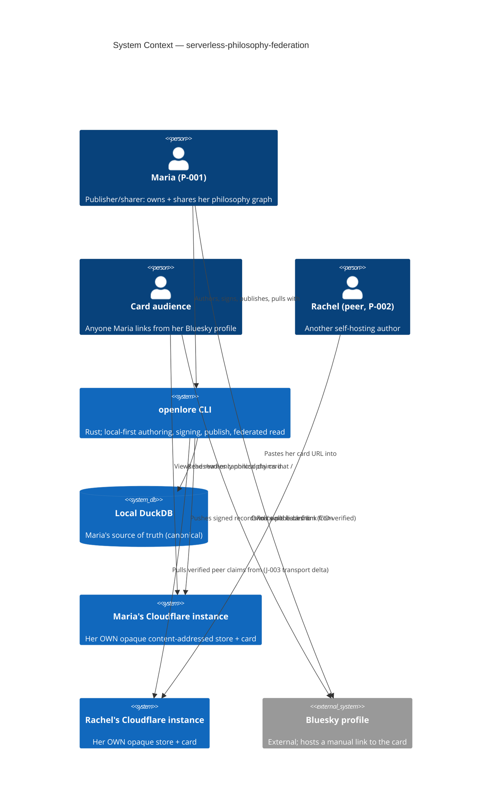
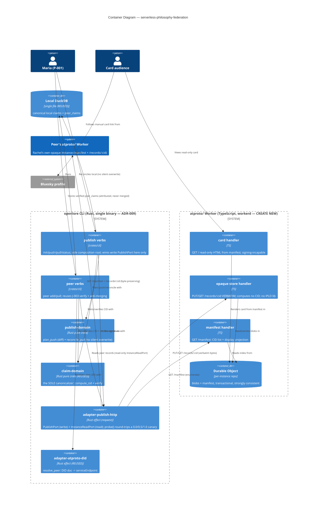

<!-- markdownlint-disable MD024 -->
# Feature Delta: serverless-philosophy-federation

> Wave: **DISCUSS** (lean mode)
> Feature type: **Cross-cutting** — Rust CLI (new `openlore publish` verbs) ↔ a NEW TS/Cloudflare-Workers
>   app (code in a NEW `atproto/` folder, does not exist yet) ↔ ATProto records ↔ cross-instance
>   peer-to-peer sync ↔ a public web card.
> Walking skeleton: **Yes, thin** — the first slice is a thin e2e: CLI pushes one signed claim to the
>   user's OWN Cloudflare Worker instance and pulls it back, CID-verified. Preceded by a SPIKE that
>   validates the Cloudflare Worker↔CLI mechanism.
> UX depth: **Lean** — JTBD for the 2 NEW jobs (J-007, J-008), lightweight happy-path journey,
>   elephant-carpaccio slices, DoR + KPIs. Opportunity-scoring tables and emotional-arc deep-dives
>   intentionally skipped.
> JTBD: YES — two new jobs **J-007** (self-host + card + share, headline) and **J-008** (round-trip
>   sync) appended to `docs/product/jobs.yaml` (highest prior id was J-006). Requirement 4 traces to
>   the existing **J-003** (federated read) — NOT a new job.
> Hosting model (load-bearing, locked): **SELF-HOSTED SERVERLESS.** Each user deploys their OWN
>   Cloudflare instance from the `atproto/` code. Push/pull is CLI ↔ *my* instance; federation is
>   peer-to-peer *between users' own instances*. There is NO central third-party authority.
> Date: 2026-07-13 · Owner: Luna (nw-product-owner)

This file is the canonical DISCUSS-wave delta for `serverless-philosophy-federation`: a
Cloudflare-hostable AT Protocol ("Bluesky") app — code in a **NEW `atproto/` folder** — that lets a
person **deploy their own serverless instance**, **push** their locally-signed philosophy claims to
it, **serve a public read-only philosophy card** linkable from their **Bluesky profile**, **pull**
their instance back into local DuckDB, and **pull from OTHER users' instances** to expand their
dataset. The four verbatim requirements map as: (1) public card + Bluesky link → **J-007**; (2) pull
my instance → local DuckDB → **J-008**; (3) push local CLI → my instance → **J-008** (publish
surface **J-007**); (4) pull from OTHER instances → **J-003** (federated read, Cloudflare-instance
transport delta — NOT a new job).

Tier-1 content is inlined here (lean); SSOT jobs live in `docs/product/jobs.yaml` (J-007, J-008);
the journey lives in `docs/product/journeys/host-and-share-philosophy.yaml` (step 5 references
`subscribe-and-read-federated.yaml` for the J-003 cross-instance read); per-slice briefs under
`slices/`. Research seeds provided by the user for the post-DISCUSS SPIKE / DESIGN:
<https://blog.cloudflare.com/serverless-atproto/> and
<https://atproto.com/guides/statusphere-tutorial>.

---

## Wave: DISCUSS / [REF] Persona IDs

- **P-001 Senior Engineer Solo Builder** ("Maria"), PRIMARY, wearing a **publisher/sharer** hat
  (added to `docs/product/personas/senior-engineer-solo-builder.yaml`). Per that persona: CLI-first,
  terminal-native, greppable output, local-first, "never silently mutate", and — the load-bearing
  value here — **data sovereignty is non-negotiable**. The philosophy card + "link from Bluesky
  profile" gives this otherwise-private persona its **first intentional PUBLIC identity surface** —
  a new social/shareable dimension. The load-bearing tension: gaining a public surface WITHOUT
  surrendering sovereignty to a central authority (the instance is theirs; no shared operator).
- **P-002 researcher-tech-lead**, wearing the **federation-reader** hat, for requirement 4 (pulling
  from OTHER users' instances) — the same hat used by `subscribe-and-read-federated.yaml` (J-003).

---

## Wave: DISCUSS / [REF] JTBD One-Liners

> **J-007** (headline): *When I want to OWN and publicly share my philosophy graph without depending
> on a central service, I want to deploy my OWN serverless (Cloudflare) instance and get a shareable,
> read-only philosophy card I can link from my Bluesky profile, so I control my data AND can show my
> reasoning off — with no third-party authority in the trust path.*

> **J-008** (the data pipe): *When I publish claims from my laptop but want my own hosted instance to
> mirror them — and to rebuild or reconcile my local DuckDB from my instance later — I want to push
> my local graph to my instance and pull it back with byte-for-byte CID integrity, so my instance is
> a faithful, verifiable mirror I own, not a lossy copy.*

> **Requirement 4 → J-003** (unchanged, existing): *When I read another developer's published claims,
> I want to weigh them by their evidence and signing identity, so I can synthesize a view without
> inheriting their conclusions.* — realized here with the peer's PDS endpoint resolving to their OWN
> Cloudflare instance instead of a bsky.social PDS. All J-003 invariants (peer_claims separation,
> signature+CID verification, anti-merging) carry over unchanged. See
> `docs/product/journeys/subscribe-and-read-federated.yaml`.

### Four Forces (light — feeds the BDD scenarios below)

**J-007 (self-host + card + share):**

- **Push**: my published claims live only in a private local DuckDB or on a shared PDS I do not
  control. No surface I OWN end-to-end also renders a clean, public, linkable view of my reasoning.
- **Pull**: one deploy stands up a serverless instance I own; one push populates it; a public card at
  my-own URL renders my attributed claims and drops into my Bluesky bio — sovereignty AND
  shareability, no central operator.
- **Anxiety**: *"Does hosting on Cloudflare re-introduce a central authority — the exact thing
  openlore exists to avoid?"* → Mitigation: the instance is the USER's OWN (self-hosted serverless;
  no shared operator in the trust path); this is the reconciliation of ADR-023's deferred hosted mode
  (see **Changed Assumptions**). Secondary: *"Will publishing overwrite my local source of truth?"* →
  additive + CID-verified; local stays canonical. *"Will the card expose data I did not publish?"* →
  the card renders ONLY explicitly-pushed claims, read-only.
- **Habit**: devs already `wrangler deploy` Workers and paste links into profiles; the flow must feel
  like that, and the CLI side must reuse the learned push/pull mental model.

**J-008 (round-trip sync):**

- **Push**: a local-only DuckDB is a single point of loss and unshareable; a naive host-copy risks
  divergence, silent overwrite, or canonicalization drift that breaks CID verification.
- **Pull**: an explicit, additive, CID-verified round-trip — push my graph up, pull it back
  identical; my instance becomes a mirror I can rebuild local state from, with checkable integrity.
- **Anxiety**: *"Will pulling overwrite local claims I edited?"* → reconcile, never silent overwrite.
  *"Will the CLI↔Worker boundary corrupt canonicalization so CIDs no longer match?"* → round-trip CID
  integrity is a HARD guardrail (KPI-SF-1); a mismatch is a rejected sync, not a silent accept.
- **Habit**: devs think in `git push`/`git pull` — additive, explicit, integrity-checked.

---

## Wave: DISCUSS / [REF] Locked Decisions

All D-numbered per the wave contract. Rationale inlined (lean; no separate `wave-decisions.md`).

| # | Decision | Status |
|---|---|---|
| **D-1** | **Self-hosted serverless hosting model.** Each user deploys their OWN Cloudflare instance from the `atproto/` code. Push/pull is CLI ↔ *my* instance; there is NO central, shared, or community-operated instance. This is the load-bearing decision that preserves the data-sovereignty ethos. | LOCKED |
| **D-2** | **Code lives in a NEW `atproto/` folder** (does not exist yet). It is a NEW deployment target (TS/Cloudflare Workers). It is **NOT assumed to reuse the Rust crates** (`adapter-atproto-*`, `openlore-indexer`, etc.) — whether/how it does is a DESIGN decision (OD-SF-1). | LOCKED |
| **D-3** | **Each user OWNS their instance.** A user's Cloudflare instance is *the user's own*, NOT a third party. This is what makes hosting compatible with sovereignty — the operator and the data owner are the same person. | LOCKED |
| **D-4** | **NO central authority.** There is no central/community-operated service anyone must trust. Federation is peer-to-peer *between users' own instances*. (This is the reconciliation of ADR-023's deferred hosted mode — see **Changed Assumptions**; ADR-023 is NOT modified here.) | LOCKED |
| **D-5** | **The CLI reaches the instance via the ADR-027 configurable URL.** A user's instance URL (`https://openlore.<me>.workers.dev`) simply replaces the self-hosted-indexer default (`http://127.0.0.1:<port>`). This is a **purely additive transport**, not a CLI-contract change — exactly the additivity ADR-023's Revisit Trigger anticipated. | LOCKED |
| **D-6** | **Publishing is additive + CID-verified round-trip; local-first preserved.** The local DuckDB stays the source of truth; push/pull never silently overwrites a local claim; a pushed claim pulled back has an IDENTICAL recomputed CID (KPI-SF-1). Compose/sign and local `graph query` NEVER depend on the instance being reachable (KPI-5). | LOCKED |
| **D-7** | **The public philosophy card is READ-ONLY + signing-incapable-by-construction + Bluesky-linkable.** The card (and the Worker serving it) holds no signing key, authors/mutates nothing, and renders ONLY explicitly-pushed claims — each attributed to the author DID (anti-merging; no consensus row). This mirrors the ADR-023 signing-incapable-by-construction indexer boundary. The card is served at a stable URL a user pastes into their Bluesky profile. | LOCKED |
| **D-8** | **Requirement 4 traces to J-003, NOT a new job.** "Pull from OTHER instances" is federated read (J-003) with the Cloudflare-instance transport as the ONLY delta — it is **NOT** a new federation job and **NOT** a replacement for the PDS-based `peer pull` (it is an *additional transport*). All J-003 invariants (peer_claims separation, signature+CID verification, anti-merging, per-author attribution) carry over unchanged. | LOCKED |
| **D-9** | **The Cloudflare/TS stack + the Rust-CLI ↔ Cloudflare-TS boundary + how a Worker stores/serves ATProto records is a DESIGN decision (OD-SF-1).** DISCUSS flags it and validates the mechanism via a SPIKE; it does NOT decide the architecture. The `atproto/` internal tech is DESIGN's. | LOCKED (flag, not decide) |

---

## Wave: DISCUSS / [REF] Scope Assessment (Elephant Carpaccio Gate)

**OVERSIZED — split required (and taken).** Oversized signals present (4 of 5):

- **Multiple independent user outcomes that could ship separately** (4 requirements: card+share,
  pull-own, push-own, cross-instance pull). ✔
- **New bounded context / module beyond the existing Rust workspace** — a whole new TS/Cloudflare
  Workers app in a new `atproto/` folder. ✔
- **Walking skeleton requires a genuinely uncertain integration point** (the Rust-CLI ↔ Cloudflare-TS
  boundary + ATProto-record storage on a Worker; canonicalization must survive the boundary). ✔
- **Estimated effort > 2 weeks** if attempted as one deliverable (new stack + 4 outcomes). ✔
- (Not present: >3 bounded contexts — this is essentially one new context + the existing CLI/domain.)

**Split taken (below): 5 thin end-to-end outcome slices + 1 pre-slice SPIKE.** Each slice delivers a
verifiable working behavior, is ≤1 day, and is sliced by *user outcome*, not technical layer. The
split aligns with the user-locked **thin walking skeleton** (slice-01: push one claim → own Worker →
pull it back). This satisfies the gate: scope assessed → OVERSIZED → user-approved thin WS + slice
split confirmed.

---

## Wave: DISCUSS / [REF] Story Map and Slicing

One journey: **host-and-share-philosophy** — deploy my own instance, publish my graph, share a
public card, keep local ↔ instance in sync, and expand from other instances. See
`docs/product/journeys/host-and-share-philosophy.yaml`.

### Emotional arc (lean)

**skeptical-sovereign → ownership-relief → integrity-trust → proud-to-share**

- **Entry (skeptical-sovereign)**: "I want a public surface, but not at the cost of handing my data to
  a central host."
- **Ownership-relief**: `wrangler deploy` + `openlore publish init` — my instance is live and it is
  MINE.
- **Integrity-trust (peak)**: `openlore publish push` then `publish pull` — what I pushed pulls back
  byte-identical, CID-verified; my local store never moved.
- **Proud-to-share (exit)**: a clean public card at my own URL, linked from my Bluesky profile;
  expanding my dataset from a peer's own instance with attribution intact.

### Shared artifacts (tracked)

| Artifact | Source of truth | Consumers | Integration risk |
|---|---|---|---|
| `instance_url` | the user's OWN deployed Cloudflare Worker URL; registered via `openlore publish init` (the ADR-027 configurable URL, D-5) | `publish push`, `publish pull`, `card_url` derivation, Bluesky profile link | **MED** — a wrong/stale URL points the CLI at the wrong host or serves a stale card. |
| `claim_cid` | claim-domain content-addressed CID (existing) | `publish push` (recomputed on instance, must match), `publish pull` (round-trip check), card render, cross-instance verify | **HIGH** — if canonicalization does not survive the Rust-CLI↔TS-Worker boundary, round-trip CID integrity (KPI-SF-1) breaks and the whole mirror thesis fails. The SPIKE de-risks this first. |
| `author_did` | the user's existing ATProto DID + per-app derived key (WD-12 / RC-03), unchanged by hosting | pushed record attribution, card attribution, peer resolution (req 4) | **MED** — attribution must be preserved end-to-end (anti-merging). |
| `card_url` | derived from `instance_url` (the public read-only page served by the user's own Worker) | Bluesky profile link, sharing the card | **LOW** — derived mechanically from `instance_url`. |
| `peer_instance_url` | resolved from the peer's DID document (their PDS endpoint = their own Cloudflare instance) | `peer pull` fetch URLs (req 4), peer claim attribution | **MED** — DID-doc → Cloudflare-PDS resolution (OD-SF-3); reuses J-003 resolution semantics. |

### Slicing (by outcome, not layer)

- **SPIKE-00 (pre-slice, time-boxed ~1-2 days)** — `slices/slice-00-spike-cloudflare-worker-mechanism.md`:
  validate the Cloudflare Worker↔CLI mechanism (OD-SF-1) — can a Worker store an `org.openlore.claim`
  ATProto record and serve it back, and does the claim's CID survive the CLI↔Worker boundary? Consult
  the two research-seed URLs. **Blocks slice-01.**
- **Slice 01 (WALKING SKELETON)** — `slices/slice-01-round-trip-walking-skeleton.md`: **US-SF-001**
  (deploy + register my own instance, J-007) + **US-SF-002** (round-trip one signed claim: push → my
  Worker → pull back, CID-verified, J-008). The thinnest e2e that connects deploy + push + pull.
- **Slice 02** — `slices/slice-02-bulk-publish-push.md`: **US-SF-003** (push my whole local graph to
  my instance — additive, idempotent, per-claim CID-verified, J-008).
- **Slice 03** — `slices/slice-03-pull-reconcile-local.md`: **US-SF-004** (pull my instance →
  reconcile/rebuild local DuckDB without silent overwrite, J-008; requirement 2).
- **Slice 04** — `slices/slice-04-public-philosophy-card.md`: **US-SF-005** (public read-only
  philosophy card at a stable Bluesky-linkable URL, J-007; requirement 1).
- **Slice 05** — `slices/slice-05-cross-instance-federated-read.md`: **US-SF-006** (pull from ANOTHER
  user's Cloudflare instance — federated read, J-003 transport delta; requirement 4).

### Priority Rationale

**Slice-01 first (with SPIKE-00 before it): it carries the riskiest assumption** — that a signed
claim's CID survives the Rust-CLI ↔ Cloudflare-TS boundary (KPI-SF-1) and that a Worker can store +
serve an ATProto record at all (OD-SF-1). If the round-trip does not hold, the mirror thesis (J-008)
and everything the card renders (J-007) collapse; every later slice is moot. The SPIKE de-risks the
mechanism before the WS commits to it. **Slice-02 (bulk push) second**: it generalizes the validated
one-claim push to the whole graph — the value that populates the card. **Slice-03 (pull-reconcile)
third**: it closes the round-trip for real data (durability/rebuild) and proves no-silent-overwrite.
**Slice-04 (card) fourth**: the public/social payoff — but it needs data on the instance (slices
02-03) to render. **Slice-05 (cross-instance) last**: it reuses shipped J-003 machinery (lowest
technical risk) and delivers dataset-expansion value on top of a proven publish/host substrate;
it depends on nothing earlier except a reachable peer instance.

---

## Wave: DISCUSS / [REF] System Constraints (cross-cutting)

Hold across every story:

- **Self-hosted serverless only** — the instance is the user's OWN Cloudflare deploy; NO
  central/community-operated service (D-1, D-4).
- **Local DuckDB is the source of truth** — push/pull is additive + CID-verified; never a silent
  overwrite (D-6).
- **Round-trip CID integrity is a hard gate** — a pushed claim pulled back has an identical recomputed
  CID; a mismatch is a rejected sync, not a silent accept (KPI-SF-1).
- **Local-first preserved (KPI-5)** — compose/sign and local `graph query` never depend on the
  instance being reachable (D-6).
- **The instance/card is signing-incapable-by-construction** — holds no signing key, authors/mutates
  nothing (D-7; mirrors ADR-023).
- **Anti-merging everywhere** — the public card, the local reconcile, and cross-instance reads all
  show per-author attribution; no "consensus" row, ever (D-7, D-8; carried from J-003).
- **Requirement 4 reuses J-003** — it is an additional transport, not a replacement for PDS-based
  `peer pull`; all J-003 verification/attribution invariants carry over unchanged (D-8).
- **The `atproto/` stack + Rust↔TS boundary is DESIGN's** — DISCUSS stays solution-neutral about it
  (D-9 / OD-SF-1).

---

## Wave: DISCUSS / [REF] User Stories and Acceptance Criteria

Six stories. US-SF-001/005 trace to **J-007**; US-SF-002/003/004 trace to **J-008**; US-SF-006
traces to **J-003**. None is `@infrastructure` — each delivers a user-observable outcome, so each
carries an Elevator Pitch (Dimension 0). Every slice contains ≥1 user-visible story.

### US-SF-001: Deploy and register my own serverless instance

- **job_id**: J-007

#### Elevator Pitch

- **Before**: Maria wants a public, owned surface for her philosophy graph but her claims live only in
  a private local DuckDB, and she distrusts handing them to a central host.
- **After**: she `wrangler deploy`s the `atproto/` Worker to her own Cloudflare account and runs
  **`openlore publish init https://openlore.maria.workers.dev`**, which prints
  `instance_url: https://openlore.maria.workers.dev` + `author_did: did:plc:maria-test` +
  `card_url: https://openlore.maria.workers.dev/` and confirms *"This instance is YOURS. No central
  authority is in the trust path."*
- **Decision enabled**: she decides to publish to a surface she OWNS, trusting her signing identity
  and local store are unchanged and no shared operator is involved.

#### Problem

Maria (P-001, publisher/sharer hat) wants a public identity surface for her reasoning without ceding
data sovereignty. She needs to stand up an instance that is unambiguously HERS and tell the CLI where
it is — without changing how she authors/signs or where her source of truth lives.

#### Who

- P-001 (Maria), senior engineer with a Cloudflare account | at her terminal | wants a self-owned
  serverless instance registered with the CLI, and will reject anything that makes a third party the
  authority for her claims or that mutates her local store.

#### Solution

Deploy the `atproto/` Worker via `wrangler deploy` (Cloudflare tooling) to the user's own account,
then `openlore publish init <instance-url>` records the URL as the configured publish target (the
ADR-027 configurable URL, D-5). The instance holds no signing key (D-7); the user's `author_did` and
local DuckDB are unchanged.

#### Domain Examples

1. **Happy path** — Maria deploys to `https://openlore.maria.workers.dev` and runs
   `openlore publish init https://openlore.maria.workers.dev`; the CLI records it, prints the instance
   URL, her `did:plc:maria-test`, and the derived `card_url`, and confirms the instance is hers.
2. **Unreachable URL (boundary)** — Björn runs `openlore publish init https://typo.workers.dev` before
   deploying; the CLI cannot reach it and refuses to register a dead URL (offline-first is not
   speculative-register); nothing is recorded.
3. **Sovereignty expectation (error)** — Priya expects the instance to become her signing authority;
   the CLI rejects that framing — the instance is read/serve only; signing stays local; `author_did`
   is unchanged.

#### UAT Scenarios (BDD)

##### Scenario: Deploy and register my own serverless instance
```
Given Maria has deployed the atproto/ Worker to her own Cloudflare account at https://openlore.maria.workers.dev
When she runs `openlore publish init https://openlore.maria.workers.dev`
Then the CLI records the instance URL as her configured publish target
And it prints her author DID and the derived public card URL
And it confirms the instance is hers with no central authority in the trust path
And her local store is unchanged
```

##### Scenario: An unreachable instance URL is not registered
```
Given no Worker is reachable at https://typo.workers.dev
When Maria runs `openlore publish init https://typo.workers.dev`
Then the CLI reports it cannot reach the instance
And it does not register the dead URL
```

##### Scenario: Registering an instance never changes the signing identity
```
Given Maria's signing identity is did:plc:maria-test
When she runs `openlore publish init https://openlore.maria.workers.dev`
Then her author DID remains did:plc:maria-test
And the instance holds no signing key
```

#### Acceptance Criteria

- [ ] `openlore publish init <url>` records a reachable instance URL as the configured publish target
      (ADR-027 configurable URL, D-5).
- [ ] The output names the `instance_url`, the unchanged `author_did`, and the derived `card_url`, and
      states the instance is the user's own with no central authority (D-1, D-4).
- [ ] An unreachable URL is not registered (offline-first is not speculative-register).
- [ ] Registering does not change the signing identity or the local store; the instance holds no
      signing key (D-6, D-7).

#### Outcome KPIs

- **Who**: P-001 dogfood users · **Does what**: stand up and register their own serverless instance ·
  **By how much**: KPI-SF-2 — a dogfood user completes deploy + register + first push→pull-back
  round-trip in < 10 minutes · **Measured by**: dogfood timing (no telemetry) · **Baseline**: 0 (no
  self-host path exists).

#### Technical Notes

- `wrangler deploy` is Cloudflare tooling (user-supplied account); `openlore publish init` only writes
  config. Depends on SPIKE-00 (OD-SF-1) for the instance shape. `openlore publish` verb grammar is
  OD-SF-2.

---

### US-SF-002: Round-trip one signed claim (push → my Worker → pull back), CID-verified

- **job_id**: J-008

#### Elevator Pitch

- **Before**: Maria has a signed claim in her local DuckDB but no way to mirror it to a surface she
  owns and prove the copy is faithful.
- **After**: she runs **`openlore publish push`** to send one claim to her own Worker, then
  **`openlore publish pull`**, and the CLI reports `verified: 1/1 CIDs recomputed on the instance
  match local CIDs` — the claim survived the round-trip byte-identical.
- **Decision enabled**: she trusts the CLI↔Worker pipe (canonicalization survives the boundary), so
  she can confidently publish her whole graph next.

#### Problem

The walking-skeleton risk: a signed claim's content-addressed CID must survive the Rust-CLI ↔
Cloudflare-TS boundary. If it does not, the mirror (J-008) and everything the card renders (J-007) are
untrustworthy. Maria needs a proven, integrity-checked one-claim round-trip before anything else.

#### Who

- P-001 (Maria), at her terminal with a registered instance (US-SF-001) | wants to prove one claim
  round-trips with an identical CID | will not build on a pipe that silently corrupts canonicalization.

#### Solution

`openlore publish push` sends one claim to the instance, which recomputes its CID; `openlore publish
pull` fetches it back and re-verifies. A CID mismatch at either end is a rejected sync, reported, not
a silent accept (KPI-SF-1). Local store untouched (additive, D-6).

#### Domain Examples

1. **Happy path** — Maria pushes one claim (`bafy...m9pq`) to her instance; the instance recomputes
   the same CID; `publish pull` fetches it back with an identical CID; the CLI reports `1/1 verified`.
2. **Canonicalization drift (error)** — a boundary bug makes the instance recompute a different CID;
   the push rejects that claim as a canonicalization mismatch and reports it; nothing is silently
   stored.
3. **Instance unreachable (boundary)** — the instance is down; `publish push` reports it and exits
   non-zero; the local claim is untouched; authoring is never blocked (KPI-5).

#### UAT Scenarios (BDD)

##### Scenario: One claim round-trips with an identical CID
```
Given Maria has one signed claim bafy...m9pq locally and a registered instance
When she runs `openlore publish push` then `openlore publish pull`
Then the instance stores the claim and recomputes CID bafy...m9pq
And the pulled-back claim has the identical CID bafy...m9pq
And the CLI reports 1/1 CIDs verified
And Maria's local claim is unmodified
```

##### Scenario: A claim whose CID does not survive the boundary is rejected
```
Given the instance recomputes a CID that differs from the local CID for a pushed claim
When Maria runs `openlore publish push`
Then that claim is rejected as a canonicalization mismatch and reported
And nothing is silently stored on the instance
```

##### Scenario: Publishing never blocks when the instance is unreachable
```
Given Maria's instance is unreachable
When she runs `openlore publish push`
Then the CLI reports the instance is unreachable and exits non-zero
And her local store is untouched
And `openlore graph query` still works offline
```

#### Acceptance Criteria

- [ ] A single claim pushed and pulled back has an identical recomputed CID at both ends (KPI-SF-1).
- [ ] A CID mismatch (either end) rejects that claim as a canonicalization mismatch and reports it; no
      silent store (D-6).
- [ ] Push/pull is additive; the local claim is never modified.
- [ ] With the instance unreachable, `publish push` exits non-zero and local authoring/query is
      unaffected (KPI-5).

#### Outcome KPIs

- **Who**: the CLI↔Worker pipe · **Does what**: round-trip a claim with integrity · **By how much**:
  KPI-SF-1 — 100% of pushed-then-pulled claims have an identical recomputed CID · **Measured by**: CI
  round-trip smoke test (push one claim to a test Worker, pull back, assert CID equality) · **Baseline**:
  n/a (no pipe exists).

#### Technical Notes

- The walking-skeleton heart; depends on SPIKE-00 (OD-SF-1). Canonicalization-across-the-boundary is
  the load-bearing risk (R-1). No local schema change beyond a publish-state marker.

---

### US-SF-003: Publish my whole local graph to my instance

- **job_id**: J-008

#### Elevator Pitch

- **Before**: Maria has 42 signed claims locally but her instance holds only the one skeleton claim;
  her card would be nearly empty.
- **After**: she runs **`openlore publish push`** and the CLI reports `pushed: 41 new · verified 41/41
  CIDs match · additive only — no local claim modified`, so her instance now mirrors her whole graph.
- **Decision enabled**: she decides her instance is a faithful mirror worth pointing her card (and
  peers) at.

#### Problem

The one-claim round-trip must generalize to the whole graph: bulk, additive, idempotent, per-claim
CID-verified — so the instance faithfully mirrors local without duplicates or silent divergence.

#### Who

- P-001 (Maria), with a proven one-claim pipe (US-SF-002) | wants to push her entire local graph
  once and re-push cheaply | will not tolerate duplicates or an unverifiable bulk copy.

#### Solution

`openlore publish push` diffs local vs instance and pushes only new claims (idempotent); each pushed
claim is CID-verified on the instance; already-present claims are skipped; local is untouched (D-6).

#### Domain Examples

1. **Happy path** — 42 local, 1 on instance; push sends 41 new, verifies 41/41, skips 1; local
   unchanged.
2. **Idempotent re-push (boundary)** — Maria re-runs `publish push` immediately; 0 new, 42 skipped;
   no duplicates.
3. **Partial-then-resume (error)** — a push is interrupted after 20 of 41; a re-run pushes the
   remaining 21 with no duplicates (additive + idempotent).

#### UAT Scenarios (BDD)

##### Scenario: Push the whole local graph, additive and CID-verified
```
Given Maria has 42 local claims and 1 already on her instance
When she runs `openlore publish push`
Then 41 new claims are pushed and 1 is skipped
And each pushed claim's CID recomputed on the instance matches its local CID
And no local claim is modified
```

##### Scenario: Re-pushing is idempotent
```
Given Maria has already pushed all 42 claims
When she runs `openlore publish push` again
Then 0 claims are pushed and 42 are skipped
And no duplicate records are created on the instance
```

##### Scenario: An interrupted push resumes without duplicates
```
Given a push was interrupted after 20 of 41 new claims
When Maria runs `openlore publish push` again
Then the remaining 21 claims are pushed
And no claim is duplicated on the instance
```

#### Acceptance Criteria

- [ ] `publish push` sends only claims not already on the instance (additive, idempotent).
- [ ] Each pushed claim's CID recomputed on the instance matches its local CID (KPI-SF-1).
- [ ] Re-push and interrupted-then-resumed push create no duplicates.
- [ ] The local store is never modified by a push (D-6).

#### Outcome KPIs

- **Who**: P-001 publishers · **Does what**: mirror their whole local graph to their instance · **By
  how much**: KPI-SF-1 — 100% per-claim CID match on bulk push · **Measured by**: CI bulk round-trip
  test · **Baseline**: 0 claims mirrored.

#### Technical Notes

- Diff strategy (by CID set) + idempotency key. Depends on US-SF-002. Transport shape per OD-SF-1.

---

### US-SF-004: Pull my instance back into local DuckDB (reconcile / rebuild)

- **job_id**: J-008

#### Elevator Pitch

- **Before**: Maria's reasoning lives only on her laptop; a lost machine loses it, and she has no
  verifiable way to rebuild local state from her instance.
- **After**: she runs **`openlore publish pull`** and the CLI reports `verified 42/42 CIDs match · in
  sync · no local claim overwritten` — and on a fresh laptop the same command reconstructs all 42
  claims into local DuckDB with attribution intact.
- **Decision enabled**: she trusts her instance as a durable, verifiable mirror she can rebuild from.

#### Problem

Requirement 2: pull my instance → update local DuckDB. It must be a reconcile (never a silent
overwrite), round-trip-integrity-checked, and able to rebuild local state on a fresh machine.

#### Who

- P-001 (Maria), with a populated instance (US-SF-003) | wants durable, verifiable local rebuild /
  reconcile | will not accept a pull that silently overwrites edited local claims.

#### Solution

`openlore publish pull` fetches instance records; a record already present locally with a matching CID
is a no-op; a genuine conflict is surfaced, not auto-resolved; on an empty local store it reconstructs
DuckDB with each record verified before insert (D-6).

#### Domain Examples

1. **In-sync no-op (happy path)** — instance and local both hold the same 42 claims; pull verifies
   42/42, overwrites nothing, reports in-sync.
2. **Fresh-machine rebuild (boundary)** — empty local store; pull reconstructs all 42 claims with
   attribution intact; each verified before insert.
3. **Conflict surfaced (error)** — a pulled record's CID differs from a local claim's CID for the same
   logical record; the CLI surfaces a conflict rather than silently overwriting.

#### UAT Scenarios (BDD)

##### Scenario: Pull is an additive reconcile that never overwrites local claims
```
Given Maria's instance holds the 42 claims she pushed and her local store holds the same 42
When she runs `openlore publish pull`
Then every pulled record's CID matches the local CID
And no local claim is overwritten
And the CLI reports the stores are in sync
```

##### Scenario: Rebuild local DuckDB from my own instance on a fresh machine
```
Given Maria has a fresh machine with an empty local store and her instance holds 42 claims
When she runs `openlore publish pull`
Then all 42 claims are reconstructed into local DuckDB with attribution intact
And each record's CID is verified before it is stored
```

##### Scenario: A genuine conflict is surfaced, not silently overwritten
```
Given a pulled record's CID differs from a local claim's CID for the same logical record
When Maria runs `openlore publish pull`
Then the CLI surfaces the conflict
And it does not silently overwrite the local claim
```

#### Acceptance Criteria

- [ ] Pull reconciles additively; an in-sync record is a no-op; no silent overwrite of a local claim
      (D-6).
- [ ] On an empty local store, pull reconstructs local DuckDB with attribution intact; each record
      verified before insert.
- [ ] A CID conflict is surfaced, not auto-resolved.
- [ ] Round-trip integrity holds: a claim pushed (US-SF-003) and pulled here has an identical CID
      (KPI-SF-1).

#### Outcome KPIs

- **Who**: P-001 publishers · **Does what**: rebuild/reconcile local from their own instance · **By
  how much**: KPI-SF-1 — 100% round-trip CID integrity; zero silent overwrites · **Measured by**: CI
  fresh-machine rebuild test + conflict-surfacing test · **Baseline**: 0 (no pull-own path).

#### Technical Notes

- Reconcile semantics reuse the local store's existing never-silently-mutate discipline. Depends on
  US-SF-003. Transport per OD-SF-1.

---

### US-SF-005: Public philosophy card at a stable, Bluesky-linkable URL

- **job_id**: J-007

#### Elevator Pitch

- **Before**: Maria's claims are structured but private; she cannot hand anyone a clean public view of
  her reasoning, only unstructured blog prose.
- **After**: anyone opens **`https://openlore.maria.workers.dev/`** and sees Maria's philosophy card —
  her pushed claims, each attributed to `did:plc:maria-test`, read-only, no consensus row — and Maria
  pastes that URL into her Bluesky profile.
- **Decision enabled**: she decides to make her reasoning trail a public, shareable part of her
  developer identity, trusting the card exposes only what she pushed.

#### Problem

Requirement 1: display my own philosophy card and link it from my Bluesky profile — a public web page
on my Cloudflare instance. It must be read-only, attribution-preserving, and served at a stable
linkable URL.

#### Who

- P-001 (Maria), with a populated instance (US-SF-003) | wants a clean public, read-only card at a URL
  she owns and can link from Bluesky | will reject a card that exposes unpushed data or offers write
  controls.

#### Solution

The user's Worker serves a public read-only HTML card at a stable URL (derived from `instance_url`,
D-7) rendering ONLY explicitly-pushed claims, each attributed to the author DID (anti-merging). The
card holds no signing key and offers no authoring control. The user pastes the URL into their Bluesky
profile (a manual paste; no code).

#### Domain Examples

1. **Happy path** — Maria's card at `https://openlore.maria.workers.dev/` renders her pushed claims,
   each under `did:plc:maria-test`, read-only; she pastes the URL into her Bluesky bio.
2. **Empty-but-valid (boundary)** — before any push, the card renders "no claims published yet", not
   an error.
3. **No write control (error)** — a visitor tries to edit/counter from the card; the card offers no
   such control; authoring stays in the CLI (read-only surface).

#### UAT Scenarios (BDD)

##### Scenario: The public card renders my pushed claims, attributed, read-only
```
Given Maria has pushed her claims to her instance
When anyone opens https://openlore.maria.workers.dev/
Then the card renders Maria's claims each attributed to did:plc:maria-test
And the page offers no authoring or editing control
And no claim is shown as a merged or consensus entry
```

##### Scenario: The card is a stable URL linkable from a Bluesky profile
```
Given Maria's card is served at https://openlore.maria.workers.dev/
When she pastes that URL into her Bluesky profile
Then visitors following the link reach her read-only philosophy card
```

##### Scenario: The card renders only explicitly-pushed claims
```
Given Maria has a local claim she has NOT pushed
When anyone opens her card
Then the unpushed claim does not appear on the card
```

#### Acceptance Criteria

- [ ] The card is served at a stable URL derived from `instance_url` and renders only explicitly-pushed
      claims (D-7).
- [ ] Every rendered claim is attributed to its author DID; no consensus/merged row (anti-merging).
- [ ] The card is read-only — no authoring/editing control; the Worker holds no signing key (D-7).
- [ ] The URL is directly linkable from a Bluesky profile.

#### Outcome KPIs

- **Who**: P-001 publishers + their audience · **Does what**: view an owned, attributed, read-only
  philosophy card · **By how much**: KPI-SF-3 — the card renders 100% of pushed claims, each
  attributed; 0 consensus rows · **Measured by**: CI render assertion (fixture instance → card HTML →
  assert per-claim attribution, no merge) · **Baseline**: 0 (no card).

#### Technical Notes

- Card HTML is served by the Worker (TS); shape per OD-SF-1. Card URL / `.well-known` shape + any
  Bluesky handle-verification affordance is OD-SF-4 (default: card at `/`, manual link, no
  verification). Progressive-enhancement / no-JS-fallback discipline from the existing viewer applies
  if reused (DESIGN's call).

---

### US-SF-006: Expand my dataset by pulling from another user's instance (federated read)

- **job_id**: J-003

#### Elevator Pitch

- **Before**: Maria can only see her own claims and peers she pulls from bsky.social PDSes; a peer who
  self-hosts on Cloudflare is invisible to her.
- **After**: she runs **`openlore peer add did:plc:rachel-test`** (whose DID resolves to
  `https://openlore.rachel.workers.dev`) then **`openlore peer pull`**, and the CLI reports `fetched 7
  · new 5 · verified 5/5 signatures + CIDs · stored peer_claims (attribution preserved)` — none merged
  with her own.
- **Decision enabled**: she expands her dataset from a peer's own instance and weighs their claims
  herself, attribution intact, nothing merged.

#### Problem

Requirement 4: pull data from OTHER instances so users can expand their datasets. This is J-003
(federated read) with the peer's PDS endpoint resolving to their Cloudflare instance instead of a
bsky.social PDS — the ONLY delta. All J-003 verification/attribution invariants must carry over.

#### Who

- P-002 (federation-reader hat; P-001 also wears it) | wants to pull a self-hosting peer's claims into
  the separate peer_claims layer | will not accept merged/consensus output or unverified claims.

#### Solution

Reuse the shipped J-003 `openlore peer add` / `openlore peer pull` flow verbatim; the ONLY change is
that the peer DID document resolves the PDS endpoint to their Cloudflare instance (OD-SF-3). Peer
claims land in peer_claims, signature+CID verified before store, attributed to the author DID
(anti-merging). See `subscribe-and-read-federated.yaml` — NOT re-authored here.

#### Domain Examples

1. **Happy path** — Rachel's DID resolves to `https://openlore.rachel.workers.dev`; Maria subscribes
   and pulls; 5 new claims verified 5/5 and stored in peer_claims attributed to Rachel; none merged.
2. **Peer instance down (boundary)** — Rachel's instance is unreachable; that peer's pull is skipped,
   other peers proceed, exit non-zero (same as any unreachable PDS in J-003).
3. **Tampered claim (error)** — one of Rachel's records fails signature verification; it is rejected,
   reported, the valid ones proceed (J-003 semantics unchanged).

#### UAT Scenarios (BDD)

##### Scenario: Pull claims from another user's Cloudflare instance
```
Given Rachel's DID document resolves her PDS endpoint to https://openlore.rachel.workers.dev
And Maria has subscribed to did:plc:rachel-test
When Maria runs `openlore peer pull`
Then Rachel's claims are fetched from her Cloudflare instance
And each claim's signature is verified and its CID recomputed before storage
And the claims are stored in peer_claims attributed to Rachel, never merged with Maria's own
```

##### Scenario: A tampered peer claim is rejected (J-003 semantics carry over)
```
Given one of Rachel's published records fails signature verification
When Maria runs `openlore peer pull`
Then that record is rejected and reported
And the valid records are stored normally
And exit code is non-zero to flag the rejection
```

##### Scenario: An unreachable peer instance skips only that peer
```
Given Rachel's Cloudflare instance is unreachable
When Maria runs `openlore peer pull` with multiple subscribed peers
Then Rachel's pull is skipped and reported
And the other peers' pulls proceed
And the exit code is non-zero overall
```

#### Acceptance Criteria

- [ ] `openlore peer add` / `openlore peer pull` work unchanged when the peer's PDS endpoint resolves
      to a Cloudflare instance (transport delta only, D-8).
- [ ] Peer claims land in the separate peer_claims layer; author_claims are never modified (J-003).
- [ ] Every peer claim's signature is verified and CID recomputed before store; failures rejected +
      reported (J-003 KPI-FED-6).
- [ ] Output preserves per-author attribution; no consensus/merged row (anti-merging, D-8).

#### Outcome KPIs

- **Who**: federation-readers (P-002 / P-001) · **Does what**: expand their dataset from peers' own
  instances · **By how much**: KPI-SF-4 — 100% of cross-instance-pulled claims are signature+CID
  verified before store and attribution-preserved · **Measured by**: acceptance test reusing the J-003
  `federation_attribution_preserved` + verification suite against a Cloudflare-instance transport ·
  **Baseline**: J-003 covers bsky.social PDS transport; Cloudflare-instance transport is new.

#### Technical Notes

- Reuses J-003 machinery entirely; the delta is DID-doc → Cloudflare-PDS resolution (OD-SF-3, default:
  standard ATProto DID-doc PDS endpoint resolution — the Cloudflare instance IS the PDS). No new
  federation verb.

---

## Wave: DISCUSS / [REF] Outcome KPIs

Measurement is telemetry-free (local-first / no-phone-home): CI round-trip/render/verification smoke
tests + dogfood timing + public availability checks.

### Objective

Let a person own and publicly share their philosophy graph from their OWN serverless instance — with
CID-verified round-trip integrity, an attributed read-only card linkable from Bluesky, and
dataset-expansion from peers' own instances — WITHOUT any central authority and WITHOUT weakening
local-first.

### Outcome KPIs

| # | Who | Does What | By How Much | Baseline | Measured By | Type |
|---|-----|-----------|-------------|----------|-------------|------|
| KPI-SF-1 | the CLI↔Worker pipe | round-trip a claim with integrity | 100% of pushed-then-pulled claims have an identical recomputed CID | n/a (no pipe) | CI round-trip smoke test (push→pull→assert CID equality) | Leading (Outcome) — **North Star** |
| KPI-SF-2 | P-001 dogfood users | stand up + register + first round-trip on their own instance | < 10 min deploy→register→push→pull-back | 0 (no self-host path) | dogfood timing | Leading (Secondary) |
| KPI-SF-3 | P-001 publishers + audience | view an owned, attributed, read-only card | card renders 100% of pushed claims, each attributed; 0 consensus rows | 0 (no card) | CI render assertion (fixture → card HTML → attribution/no-merge) | Leading (Outcome) |
| KPI-SF-4 | federation-readers | expand dataset from peers' own instances | 100% of cross-instance-pulled claims signature+CID verified + attributed | J-003 (bsky PDS) | acceptance test reusing J-003 verification/attribution suite | Leading (Outcome) |
| KPI-SF-5 | P-001 authors | keep authoring with the instance unreachable | 100% of compose/sign/local `graph query` succeed offline | 100% today (guardrail must not regress) | offline CI test | Guardrail |

### Metric Hierarchy

- **North Star**: KPI-SF-1 (round-trip CID integrity — the whole mirror/card thesis rests on it).
- **Leading**: KPI-SF-2 (deploy time-to-value), KPI-SF-3 (card fidelity), KPI-SF-4 (cross-instance
  verification).
- **Guardrail Metrics (must NOT degrade)**: KPI-SF-5 (local-first preserved); **anti-merging** (no
  consensus row on card/reconcile/cross-instance); **no-central-authority** (the instance is the
  user's own; no shared operator); **signing-incapable** (the instance/card holds no signing key).

### Measurement Plan

| KPI | Data Source | Collection Method | Frequency | Owner |
|-----|------------|-------------------|-----------|-------|
| KPI-SF-1 | CI | push→pull round-trip CID equality on a test Worker | per PR + per release | DELIVER / DEVOPS |
| KPI-SF-2 | dogfood | wall-clock deploy→first round-trip | per slice demo | product-owner / DEVOPS |
| KPI-SF-3 | CI | fixture instance → card HTML → attribution assertion | per PR | DELIVER |
| KPI-SF-4 | CI | J-003 verification/attribution suite over Cloudflare transport | per PR | DELIVER |
| KPI-SF-5 | CI | offline compose/sign/query test (instance unreachable) | per PR | DELIVER |

### Hypothesis

We believe that a self-hosted serverless instance (each user's own Cloudflare Worker) with
CID-verified push/pull, an attributed read-only card, and a J-003-transport cross-instance read will
let P-001 own AND publicly share their philosophy graph — with no central authority and no local-first
regression. We will know this is true when round-trip CID integrity is 100%, a dogfood user reaches a
first round-trip in < 10 min, the card renders every pushed claim attributed, cross-instance pulls are
100% verified, and offline authoring never breaks.

A per-feature `outcome-kpis.md` is intentionally NOT duplicated (lean): KPI-SF-1..5 are defined here
and belong in `docs/product/kpi-contracts.yaml` alongside the existing KPIs.

---

## Wave: DISCUSS / [REF] Out of Scope

- **A central / shared / community-operated service** — forbidden; self-hosted serverless only, each
  user owns their instance (D-1, D-4). This is the load-bearing exclusion.
- **Replacing the PDS-based `peer pull`** — requirement 4 is an ADDITIONAL transport on top of J-003,
  not a replacement (D-8).
- **A multi-tenant SaaS** — not this feature; each instance is single-owner.
- **Auth, rate-limiting, and an operational SLA of a public offering** — out (these become first-class
  only if a genuine multi-tenant hosted offering is ever pursued — the ADR-023 third revisit trigger).
- **The exact Cloudflare/TS architecture + the Rust-CLI↔TS boundary + Worker ATProto-record storage** —
  DESIGN's, not DISCUSS's (D-9 / OD-SF-1). DISCUSS validates the mechanism via a SPIKE only.
- **Writing/authoring/counter-claiming from the card** — the card is read-only; authoring stays in the
  CLI (D-7).
- **Bluesky handle-verification / `did:web` bidirectional link verification** — out (OD-SF-4 default:
  manual link paste; no verification affordance).
- **Modifying ADR-023** — this feature FLAGS the reconciliation for DESIGN (see Changed Assumptions);
  it does not edit the ADR.

---

## Wave: DISCUSS / [REF] Walking Skeleton Strategy

Walking skeleton = **Yes, thin** (user-locked). It is **slice-01**: the CLI pushes ONE signed claim to
the user's OWN Cloudflare Worker instance and pulls it back, CID-verified (US-SF-001 deploy+register +
US-SF-002 round-trip). It connects all the core activities — deploy, register, push, pull — in the
thinnest possible thread and de-risks the single riskiest assumption (canonicalization survives the
Rust-CLI↔Cloudflare-TS boundary, KPI-SF-1). It is preceded by **SPIKE-00**, a time-boxed research
spike that validates the Worker↔CLI mechanism (OD-SF-1) using the two research-seed URLs before the WS
commits code to it.

---

## Wave: DISCUSS / [REF] Driving Ports (for DESIGN)

Names indicative; DESIGN owns shapes (OD-SF-1/OD-SF-2).

- **New CLI verb group `openlore publish`** (driving port on the Rust side): `publish init <url>`
  (US-SF-001), `publish push` (US-SF-002/003), `publish pull` (US-SF-004), and a `publish status`
  (sync state). Grammar is OD-SF-2 (DESIGN may rename push/pull under `publish`, or pick an `instance`
  noun).
- **The public card HTTP surface** (driving port on the Cloudflare/TS side): a read-only `GET /`
  (card) served by the user's Worker (US-SF-005). Shape/URL per OD-SF-4.
- **Reused (unchanged): the J-003 `openlore peer add` / `openlore peer pull` verbs** (US-SF-006) — the
  cross-instance transport is a driven-adapter delta (DID-doc → Cloudflare-PDS resolution), not a new
  driving port.
- **Driven ports (outbound, DESIGN owns)**: a publish transport (CLI → my Worker), a read transport
  (card render, cross-instance pull), and the existing claim-domain CID/signing (reused, unchanged).

---

## Wave: DISCUSS / [REF] Pre-requisites and Open Decisions for DESIGN

### Pre-requisites

- A **Cloudflare account** + `wrangler` (user-supplied) to deploy the `atproto/` Worker.
- The **post-DISCUSS SPIKE (SPIKE-00)** to validate the Worker↔CLI mechanism (OD-SF-1) — **blocks
  slice-01**.
- The **research-seed URLs** (DESIGN/SPIKE consults): <https://blog.cloudflare.com/serverless-atproto/>
  and <https://atproto.com/guides/statusphere-tutorial>.
- **Shipped, reused**: claim-domain CID + signing; the ATProto adapters; the J-003 federated-read flow
  (for requirement 4); the ADR-027 configurable-URL CLI contract.

### Open Decisions (OD-SF-*) — DESIGN owns

| ID | Decision | Default lean |
|---|---|---|
| **OD-SF-1** | **(HIGH — headline) The Rust-CLI ↔ Cloudflare-TS boundary + how a Worker stores/serves ATProto records.** Options: (a) the Worker is a thin ATProto PDS the CLI pushes to via standard `putRecord`/XRPC and reads via the existing read-only `PdsPort`; (b) the Worker reimplements a thin appview/PDS surface in TS with a bespoke HTTP contract; (c) reuse Rust crates compiled to WASM inside the Worker. | Validate via **SPIKE-00** before deciding; lean bias toward (a) standard ATProto `putRecord`/XRPC so canonicalization + verification reuse the existing claim-domain path (protects KPI-SF-1) and requirement 4 falls out of J-003's DID-doc PDS resolution for free. |
| **OD-SF-2** | **(MED) `openlore publish` verb grammar.** `publish {init,push,pull,status}` vs an `instance` noun vs `mirror`. | `openlore publish {init,push,pull,status}` (honors the user's suggested push/pull); DESIGN may rename. |
| **OD-SF-3** | **(MED) How a peer DID document resolves to a Cloudflare-instance PDS endpoint (req 4).** Standard ATProto DID-doc PDS resolution vs an openlore-specific instance registry. | Standard ATProto DID-doc PDS endpoint resolution — the Cloudflare instance IS the peer's PDS; reuses J-003 resolution with no new registry. |
| **OD-SF-4** | **(LOW) Card URL shape + Bluesky-link affordance.** `/` vs `/card` vs `.well-known`; manual link vs a `did:web`/handle-verification affordance. | Card at `/`; Bluesky link is a manual paste (no code); handle-verification out of scope. |

### Risks (surfaced, not managed here)

- **R-1 (technical, HIGH prob / HIGH impact)**: canonicalization drift across the Rust-CLI↔TS-Worker
  boundary breaks round-trip CID integrity (KPI-SF-1) and the whole mirror/card thesis. **Mitigation**:
  SPIKE-00 validates it first; round-trip CID is a hard gate; lean toward reusing the claim-domain
  canonicalization path (OD-SF-1 option a).
- **R-2 (technical, HIGH/MED)**: the boundary itself (OD-SF-1) is genuinely uncertain — a brand-new TS
  stack. **Mitigation**: SPIKE + thin walking skeleton before committing later slices.
- **R-3 (product, MED/HIGH)**: sovereignty perception — if users read "Cloudflare" as a central
  authority, the ethos is undermined. **Mitigation**: self-hosted (each owns their instance) + the
  ADR-023 reconciliation documented in **Changed Assumptions**; flagged for DESIGN.
- **R-4 (process, LOW/LOW)**: no DIVERGE artifacts precede this feature (consistent with sibling
  brownfield/greenfield deltas). The jobs are grounded directly in the user's verbatim requirements +
  the ADR-023 reconciliation + J-003 + P-001. **Accepted** — noted here per the wave contract (no
  `diverge/` dir present; no independent option-set generated).

---

## Wave: DISCUSS / [REF] Definition of Ready validation

| DoR item | 001 deploy | 002 round-trip | 003 push | 004 pull | 005 card | 006 x-instance |
|---|---|---|---|---|---|---|
| 1. Problem statement clear, domain language | PASS | PASS | PASS | PASS | PASS | PASS |
| 2. Persona with specific characteristics | PASS (P-001 publisher hat) | PASS | PASS | PASS | PASS | PASS (P-002 reader hat) |
| 3. ≥3 domain examples with real data | PASS (3) | PASS (3) | PASS (3) | PASS (3) | PASS (3) | PASS (3) |
| 4. UAT in Given/When/Then (3-7) | PASS (3) | PASS (3) | PASS (3) | PASS (3) | PASS (3) | PASS (3) |
| 5. AC derived from UAT | PASS (4) | PASS (4) | PASS (4) | PASS (4) | PASS (4) | PASS (4) |
| 6. Right-sized (1-3 days, 3-7 scenarios) | PASS (~1d, 3) | PASS (~1d, 3) | PASS (~1d, 3) | PASS (~1d, 3) | PASS (~1d, 3) | PASS (~1d, 3) |
| 7. Technical notes: constraints/dependencies | PASS | PASS | PASS | PASS | PASS | PASS |
| 8. Dependencies resolved or tracked | PASS (SPIKE-00 tracked) | PASS (SPIKE-00; 001) | PASS (002) | PASS (003) | PASS (003) | PASS (J-003 shipped) |
| 9. Outcome KPIs with measurable targets | PASS (KPI-SF-2) | PASS (KPI-SF-1) | PASS (KPI-SF-1) | PASS (KPI-SF-1) | PASS (KPI-SF-3) | PASS (KPI-SF-4) |
| **job_id present + valid** | J-007 | J-008 | J-008 | J-008 | J-007 | J-003 |
| **Elevator Pitch (non-infra)** | PASS | PASS | PASS | PASS | PASS | PASS |

**Overall DoR status: PASSED** for all six stories.

Notes:

- Every story is user-visible with an Elevator Pitch naming a real entry point
  (`openlore publish init/push/pull`, the card URL, `openlore peer add/pull`) and concrete observable
  output (`instance_url`+`author_did`+`card_url`; `1/1 CIDs verified`; the rendered card;
  `verified 5/5`) — passes Dimension 0.
- No slice is 100% `@infrastructure`; each slice has ≥1 user-visible story — passes Dimension 0 §5.
- SPIKE-00 (the mechanism validation) and OD-SF-1 are tracked dependencies/risks (R-1, R-2), not
  blockers to entering DESIGN; DESIGN's first act is SPIKE-00.

---

## Wave: DISCUSS / [REF] Changed Assumptions (ADR-023 reconciliation)

> **This feature realizes the "hosted deployment mode" that ADR-023 deliberately DEFERRED — in the
> self-hosted-serverless form that PRESERVES data sovereignty. ADR-023 is FLAGGED for DESIGN
> reconciliation here; it is NOT modified by DISCUSS.**

**What ADR-023 rejected (quoted).** ADR-023 chose the self-hostable Rust `openlore-indexer` and
rejected a hosted service, on the sovereignty ground the product exists to protect:

> "**Data sovereignty** (the P-001 non-negotiable, the product's reason to exist): a hosted service is
> a central authority and a trust/centralization concern — the exact failure mode the product exists
> to replace (the aggregator that hides provenance and becomes an unaccountable authority)."
> (ADR-023, Context.)

> "Hosted service the CLI queries (central or community-operated): **Introduces a central authority + a
> trust/centralization concern the product exists to avoid**; implies an ops/hosting surface the
> project is not resourced to own at slice-05; harder to walk back than self-hosted. **A hosted
> deployment can be ADDED later without changing the CLI contract (ADR-027), so deferring it costs
> nothing. Documented as a future option.**" (ADR-023, Alternatives Considered.)

**What ADR-023 explicitly DEFERRED (quoted).** ADR-023's Revisit Trigger anticipates exactly this
feature as an additive future mode:

> "Add a **HOSTED deployment mode** — the CLI already talks to a configurable URL (ADR-027), so this
> is additive." (ADR-023, Revisit Trigger.)

> "Reversible: a hosted deployment is purely additive (the CLI talks to a configurable URL; ADR-027)
> and never changes the user-visible contract." (ADR-023, Consequences / Positive.)

**The NEW assumption this feature introduces (and why it resolves the tension).** ADR-023's rejection
targeted a **central or community-operated** hosted service — a *third party* in the trust path. This
feature's hosting model is **SELF-HOSTED SERVERLESS**: each user deploys their OWN Cloudflare instance
from the `atproto/` code (D-1, D-2), OWNS its data (D-3), and federates peer-to-peer *between users'
own instances* (D-4). **A user's Cloudflare instance is the user's own — not a third party.** So the
central-authority failure mode ADR-023 rejected does not arise: the operator and the data owner are
the same person; no shared operator is trusted; the aggregator-as-authority anxiety (the same one
J-005 named) is not re-created. The instance is reached via the ADR-027 configurable URL (D-5) —
`https://openlore.<me>.workers.dev` simply replaces `http://127.0.0.1:<port>` — making this precisely
the *additive* hosted mode ADR-023 said "costs nothing" to defer. The signing-incapable-by-construction
boundary carries over: the card/Worker holds no signing key and authors nothing (D-7), mirroring
ADR-023's indexer boundary.

**Flagged for DESIGN (do not decide in DISCUSS).**

1. Whether the self-hostable Rust `openlore-indexer` and the new Cloudflare-Worker deployment target
   are **two deployment modes of one appview/PDS surface** or **distinct surfaces** — and how the
   ADR-027 configurable-URL contract spans both (OD-SF-1).
2. Whether a NEW ADR (e.g. ADR-0xx "self-hosted serverless deployment mode") should record this as the
   additive realization of ADR-023's deferred hosted mode, explicitly distinguishing "self-hosted
   serverless (owner == operator)" from the "central/community-operated" shape ADR-023 rejected.
   **DISCUSS recommends DESIGN author this ADR; DISCUSS does not modify ADR-023.**
3. That the genuine "multi-tenant hosted offering" (auth, rate-limiting, SLA) remains ADR-023's *third*
   revisit trigger and is **out of scope** here (Out of Scope).

---

## Wave: DISCUSS / [REF] Wave-Decisions Summary

- **Feature type**: Cross-cutting — Rust CLI ↔ new TS/Cloudflare-Workers app (`atproto/`) ↔ ATProto
  records ↔ cross-instance P2P sync ↔ a public web card.
- **New jobs**: **J-007** (self-host + card + share, headline) and **J-008** (round-trip sync),
  appended to `docs/product/jobs.yaml`. **Requirement 4 → J-003** (federated read, Cloudflare-instance
  transport delta — NOT a new job).
- **Locked decisions**: D-1 self-hosted-serverless; D-2 code in `atproto/` (new TS/Workers target, not
  assumed to reuse Rust crates); D-3 each user owns their instance; D-4 no central authority (P2P
  between instances); D-5 CLI reaches instance via ADR-027 configurable URL (additive); D-6 additive +
  CID-verified round-trip, local-first preserved; D-7 read-only signing-incapable card, Bluesky-linkable;
  D-8 req-4 = J-003 transport delta (anti-merging + signature/CID verification carried over; NOT a
  replacement for PDS `peer pull`); D-9 the Cloudflare/TS stack + Rust↔TS boundary is a DESIGN decision
  (flag, don't decide).
- **Scope assessment**: **OVERSIZED** (4 requirements, new stack, uncertain integration point, >2wk as
  one) → **split into 5 outcome slices + 1 SPIKE** (below), aligned with the user-locked thin WS.
- **Slices**: SPIKE-00 (Cloudflare Worker↔CLI mechanism — **needs SPIKE**); slice-01 (WS: round-trip
  one claim, deploy+register+push+pull); slice-02 (bulk push); slice-03 (pull-reconcile local);
  slice-04 (public card); slice-05 (cross-instance federated read).
- **Walking skeleton**: Yes, thin — slice-01 (push one claim → own Worker → pull back, CID-verified),
  preceded by SPIKE-00.
- **Open decisions**: OD-SF-1 (HIGH, headline — Rust↔TS boundary + Worker ATProto-record storage),
  OD-SF-2 (verb grammar), OD-SF-3 (DID-doc → Cloudflare-PDS resolution), OD-SF-4 (card URL / Bluesky
  link).
- **Biggest open question handed to DESIGN**: **OD-SF-1** — the Rust-CLI ↔ Cloudflare-TS boundary and
  how a Cloudflare Worker stores and serves ATProto records such that a claim's CID survives the
  boundary (protecting KPI-SF-1 round-trip integrity) and requirement 4 falls out of J-003's DID-doc
  PDS resolution. SPIKE-00 validates the mechanism before slice-01 commits to it.
- **DoR**: PASSED (all six stories).
- **DIVERGE artifacts**: none present (no `diverge/` dir); jobs grounded directly in the user's
  verbatim requirements + the ADR-023 reconciliation + J-003 + P-001. Noted as risk R-4.
- **ADR-023 reconciliation**: recorded in **Changed Assumptions** — this feature is the additive,
  self-hosted-serverless realization of ADR-023's deferred hosted mode; ADR-023 is FLAGGED for DESIGN,
  NOT modified.

---

## Wave: DESIGN / [REF] Design Decisions (DDD)

> Wave: **DESIGN** (application / component scope) · Mode: **propose** · Owner: Morgan
> (nw-solution-architect) · Date: 2026-07-15 · ADR: **ADR-062** · Style unchanged (ADR-009 hexagonal
> modular monolith + ADR-007 functional Rust; the `atproto/` Worker is a NEW TS deployment target).
> Builds on SPIKE-00 (OD-SF-1 RESOLVED = opaque transport) — not re-opened.

Each DDD resolves an open decision with a verdict + one-line rationale. Full trade-offs (PROPOSE
mode: the alternatives are kept visible so the user can override) are in the Decisions table below
and in ADR-062.

| # | Decision | Verdict + rationale |
|---|---|---|
| **DDD-1** (OD-SF-1) | Rust↔Worker boundary + record storage | **Opaque, content-addressed HTTP blob store** (`PUT/GET /records/:cid` verbatim; CLI-minted CID; Worker computes no CID). SPIKE-00 proved `putRecord` re-encode diverges on f16-representable confidence; opaque is the only KPI-SF-1-safe shape. |
| **DDD-2** (storage medium) | KV vs Durable Object vs R2 | **Single Durable Object per instance** ("my repo" object: blobs + manifest, transactional). Strong read-after-write protects the round-trip CI test + interrupted-push resume; single-owner ⇒ single DO is the natural model. KV/R2 = documented alternatives. |
| **DDD-3** (record blob format) | raw CBOR vs lexicon-JSON | **Verbatim lexicon-JSON signed record, keyed by the Rust-minted CID.** Reuses the shipped J-003 `parse_signed_claim` (zero new decode), keeps the card CBOR-free; Rust re-canonicalizes on pull to re-establish the CID (J-003's WD-24 discipline). |
| **DDD-4** (OD-SF-2) | `openlore publish` verb grammar | **`openlore publish {init, push, pull, status}`** — matches the shipped `peer {add,pull,remove}` / `claim {add,publish,retract}` group-subcommand style + the user's git-like push/pull habit. Overload with `claim publish` is documented, not conflated (see Open Questions). |
| **DDD-5** (OD-SF-3) | cross-instance pull transport | **(b) byte-preserving opaque read variant.** Reuse `resolve_peer` (DID→serviceEndpoint, unchanged) + read via `/manifest` + `GET /records/:cid`; decode + verify CID + signature LOCALLY in Rust, reusing J-003's verification/attribution/anti-merging verbatim. (a) XRPC-wrapper on the Worker = documented fallback. |
| **DDD-6** (OD-SF-4) | card URL + Bluesky link | **Card at `GET /`; manual profile-link paste; NO `did:web`/handle verification** (lean default, out of scope per DISCUSS). Card renders from the instance's own `/manifest`, read-only, per-author attribution, no consensus row (D-7). |
| **DDD-7** (CID conformance) | fix ADR-006 float or leave | **Leave it.** The opaque transport sidesteps the ciborium-vs-DAG-CBOR shortest-float gap; fixing the core is a CID-changing wire break for every existing claim. Documented revisit trigger (standard-PDS interop JTBD) + the `0.0`/`0.5`/`1.0` regression guard. |
| **DDD-8** (capability boundary) | write vs read surfaces | **Split ports: write-capable `PublishPort` (my instance only, wired only in the `publish` root) vs read-only instance port (cross-instance pull + card).** New `xtask check-arch` rule `publish_write_capability_isolated`; extends ADR-023's signing-incapable boundary to write-incapable pull. |

---

## Wave: DESIGN / [REF] Component Decomposition

Paths are workspace-relative to `/Users/jeffbailey/Projects/foss/leading/openlore/`. The `openlore`
binary + `crates/claim-domain` (CID/canonicalize/compute_cid/verify) are REUSED UNCHANGED — the
single-canonicalizer invariant is load-bearing (SPIKE-00).

| Component | Path | Change | Responsibility |
|---|---|---|---|
| **`atproto/` Cloudflare Worker (TS)** | `atproto/` (NEW folder; workerd/wrangler) | **CREATE NEW** | The dumb opaque store: `PUT/GET /records/:cid` (verbatim), `GET /manifest` (index + display projection), `GET /` (public read-only card). NO JS IPLD/CBOR/CID libs; computes no CID; canonicalizes nothing. Storage = one Durable Object per instance. |
| **`PublishPort` + `InstanceReadPort` traits + boundary ADTs** | `crates/ports` | **EXTEND** | Pure trait contracts: write-capable `PublishPort` (mint-side push + own-instance read/round-trip) and read-only `InstanceReadPort` (`get_record`, `list_manifest`); `PublishError` + probe-refusal reasons (`publish.cid_roundtrip_failed`, `publish.instance_unreachable`). All ports live in `ports` (established pattern). |
| **`crates/publish-domain` (pure)** | `crates/publish-domain` (NEW) | **CREATE NEW** | The pure decision core: `plan_push(local_cids, instance_cids) -> PushPlan` (diff → new vs skip; additive + idempotent) and `reconcile_pull(local, pulled) -> ReconcilePlan` (in-sync no-op / insert / conflict-surface; NEVER silent overwrite). No I/O (pure-core allowlist). Mirrors the scraper-domain/appview-domain/viewer-domain norm. Fold-into-`cli` = documented alternative. |
| **`crates/adapter-publish-http` (effect)** | `crates/adapter-publish-http` (NEW) | **CREATE NEW** | Implements `PublishPort` + `InstanceReadPort` over HTTP (reuses workspace `reqwest`/rustls — NO new HTTP crate) against the opaque Worker. `probe()` round-trips a `0.0`/`0.5`/`1.0` canary CID (Earned-Trust startup gate). |
| **`openlore publish {init,push,pull,status}` verbs + wiring** | `crates/cli` | **EXTEND** | The SOLE composition root: wire the publish adapter, `init` records + probes the ADR-027 configurable instance URL (D-5), `push`/`pull` call `publish-domain` + `claim-domain`, `status` reports sync state. Write-capable `PublishPort` wired ONLY here. |
| **Cross-instance (J-003) pull transport delta** | `crates/cli` (peer-pull verb) + `crates/adapter-publish-http` (read surface) | **EXTEND** | For an openlore-opaque peer, resolve DID→serviceEndpoint (`adapter-atproto-did`, unchanged), read via `InstanceReadPort`, reuse J-003 verification/attribution/anti-merging verbatim. Peer-pull wires the READ-ONLY port (never writes to a peer). |
| **`parse_signed_claim` (lexicon-JSON → SignedClaim)** | `crates/adapter-atproto-pds/src/peer_read.rs` → hoist candidate | **REUSE / (optional) EXTEND** | Reused for both own-pull and cross-instance pull. RECOMMENDED (Open Questions): hoist the pure JSON→SignedClaim decode into `claim-domain`/`lexicon` so both adapters share ONE parse path; else duplicate the ~40-line parse in the new adapter. |
| **`xtask check-arch`** | `xtask` | **EXTEND** | New rule `publish_write_capability_isolated` (write `PublishPort` wired only in the `publish` root; pull/card read surfaces depend only on `InstanceReadPort`) + `publish-domain` added to the pure-core allowlist + an `atproto/` no-IPLD/CBOR dependency guard. |
| `openlore` binary, `claim-domain`, `adapter-atproto-did` (DID resolution), local DuckDB `StoragePort` | — | **REUSE UNCHANGED** | CID/sign/verify, DID→serviceEndpoint resolution, local source-of-truth store. Zero change (single-canonicalizer + local-first invariants). |

**Crate count**: workspace 21 → **23 production** (`+publish-domain` pure, `+adapter-publish-http`
effect) + 1 test-support + 1 xtask = **25 workspace members** (if `publish-domain` is kept as its
own crate; 24 if folded into `cli`). The `atproto/` Worker is a SEPARATE TS deployment, NOT a
workspace member.

---

## Wave: DESIGN / [REF] Driving Ports

- **Rust (CLI, new driving surface)**: `openlore publish init <url>` (US-SF-001), `openlore publish
  push` (US-SF-002/003), `openlore publish pull` (US-SF-004), `openlore publish status` (sync state).
- **TS (Worker, new driving surface)**: `GET /` (public card, US-SF-005), `PUT /records/:cid` +
  `GET /records/:cid` (opaque store, US-SF-002/003/004), `GET /manifest` (enumeration for
  pull/card/cross-instance).
- **Reused unchanged**: `openlore peer add` / `openlore peer pull` (US-SF-006) — cross-instance is a
  driven-transport delta, NOT a new driving verb.

## Wave: DESIGN / [REF] Driven Ports + Adapters

- **`PublishPort` (NEW, write-capable, driven)** — CLI → MY instance: `put_record(cid, bytes)`,
  own-instance read for round-trip; adapter `adapter-publish-http`. Wired only in the `publish` root.
- **`InstanceReadPort` (NEW, read-only, driven)** — CLI → ANY openlore instance: `get_record(cid)`,
  `list_manifest()`; adapter `adapter-publish-http`. Wired in the pull/card read path; cannot write.
- **REUSED driven**: `claim-domain` (CID/canonicalize/verify — the single canonicalizer),
  `adapter-atproto-did` (`resolve_peer` DID→serviceEndpoint for OD-SF-3), the J-003 verb-level
  verification + `peer_claims` attribution/anti-merging machinery, `StoragePort`/`adapter-duckdb`
  (local reconcile).

## Wave: DESIGN / [REF] Technology Choices

| Choice | Pin | License | Rationale |
|---|---|---|---|
| Cloudflare Workers runtime | workerd | Apache-2.0 | The self-hosted-serverless target (D-1/D-2); user's own account (no shared operator). |
| Worker deploy tool | wrangler | Apache-2.0/MIT | Standard Cloudflare deploy; `wrangler deploy` is the user's habit (US-SF-001). |
| Worker storage | Durable Objects | (platform) | Strong read-after-write + atomic manifest (DDD-2). |
| Worker language | TypeScript | Apache-2.0 | Typed; the `atproto/` code is ours (MIT/Apache like the workspace). |
| Worker router | hand-rolled `fetch` handler or `itty-router` | MIT | 4 routes; keep deps minimal. **NO** `@ipld/dag-cbor` / `multiformats` on the CID path (SPIKE-00 invariant). |
| Rust HTTP client | workspace `reqwest` (rustls) | MIT/Apache-2.0 | REUSED — the same production dep `adapter-github`/`adapter-atproto-ingest`/`adapter-index-query` already carry; NO new HTTP crate; cargo-deny-clean. |
| Rust core | `claim-domain` (`ciborium` CID/sign/verify) | (existing) | REUSED UNCHANGED — the sole canonicalizer. |

**External-integration annotation (for platform-architect / DEVOPS)**: the CLI↔Worker boundary is
a FIRST-PARTY HTTP contract between two components WE own (Rust client ↔ our TS Worker), the highest
-risk boundary in this feature. **Recommended: a consumer-driven contract test** (e.g. Pact, or a
CI round-trip harness) pinning `PUT/GET /records/:cid` byte-verbatim + `/manifest` shape, run
against `wrangler dev` (workerd) in CI — this operationalizes KPI-SF-1 (the North Star) and the
`0.0`/`0.5`/`1.0` regression guard. The Bluesky profile link is a MANUAL paste (no API integration)
→ no contract test needed.

---

## Wave: DESIGN / [REF] Decisions Table

| DDD | Decision | Chosen | Alternatives (visible for override — PROPOSE mode) |
|---|---|---|---|
| DDD-1 | Rust↔Worker boundary | Opaque content-addressed blob store | `putRecord` server-assigned CID (REJECTED: float divergence); WASM `claim-domain` on Worker (REJECTED: second canonicalizer) |
| DDD-2 | Storage medium | **Durable Object** (per-instance repo object) | KV (simpler/edge-cached, but eventual-consistency round-trip flake + manifest write-rate); R2 (large blobs later — revisit) |
| DDD-3 | Blob format | Verbatim lexicon-JSON, Rust-minted CID key | Raw canonical CBOR (stronger identity, needs new decode + CBOR card) |
| DDD-4 | Verb grammar | `openlore publish {init,push,pull,status}` | `openlore instance {…}` / `openlore mirror {…}` (disambiguates the `claim publish` overload) |
| DDD-5 | Cross-instance transport | (b) byte-preserving opaque read + local verify | (a) Worker XRPC `listRecords` wrapper (literal-zero-Rust-change J-003, asymmetric Worker) |
| DDD-6 | Card + Bluesky link | Card at `/`, manual paste, no verification | `did:web`/handle bidirectional verification (out of scope) |
| DDD-7 | CID conformance | Leave ADR-006 as-is + revisit trigger | Fix core to strict-float64 dag-cbor (CID-changing wire break) |
| DDD-8 | Capability boundary | Split write `PublishPort` / read-only `InstanceReadPort` | Single port (REJECTED: write leaks into pull/card) |

---

## Wave: DESIGN / [REF] Reuse Analysis (HARD GATE)

Every overlapping component classified EXTEND vs CREATE NEW; every CREATE NEW challenged.

| Component | Verdict | Justification (CREATE NEW challenged) |
|---|---|---|
| `crates/claim-domain` (CID/canonicalize/verify) | **REUSE** | The single canonicalizer (SPIKE-00 invariant). Zero change; any second CID computer is a divergence hazard. |
| `crates/adapter-atproto-did` (`resolve_peer`) | **REUSE** | DID document → serviceEndpoint resolution is standard + unchanged for OD-SF-3; the endpoint just points at a Cloudflare instance instead of a bsky PDS. |
| J-003 peer-pull machinery (`peer_claims`, verify-before-store, anti-merging) | **EXTEND** | Verification/attribution/anti-merging reused VERBATIM; the ONLY delta is a byte-preserving opaque read transport (DDD-5). Not a new job (D-8). |
| `crates/ports` | **EXTEND** | All port traits live here (PdsPort/GithubPort/IndexQueryPort precedent); add `PublishPort` + `InstanceReadPort` + ADTs. No new ports crate. |
| `crates/cli` (composition root) | **EXTEND** | The sole Rust composition root (I-3); add the `publish` verb group + wiring. No second CLI root. |
| `parse_signed_claim` (JSON→SignedClaim) | **REUSE** (hoist recommended) | Reused for own + cross-instance pull; hoist the pure decode into `claim-domain`/`lexicon` to share one parse path (Open Questions), else duplicate ~40 lines. |
| `crates/adapter-publish-http` | **CREATE NEW** | *Challenged*: `adapter-atproto-pds` is XRPC/PDS-specific; `adapter-index-query` is the indexer XRPC client; neither speaks the opaque content-addressed contract. New external protocol + new port ⇒ new adapter justified. Reuses `reqwest` (no new transport dep). |
| `crates/publish-domain` (pure) | **CREATE NEW** | *Challenged*: the push-diff + reconcile decisions are pure + testable and every subsystem here has a pure core (scraper/appview/viewer-domain). Justified by the norm; **fold-into-`cli` is the documented lean alternative** if minimal crate count is preferred. |
| `atproto/` Worker (TS) | **CREATE NEW** | D-2 LOCKS a new TS/Workers deployment target not assumed to reuse Rust crates. No existing component is a Cloudflare Worker. Justified by decision. |
| `xtask check-arch` | **EXTEND** | Add the write-capability-isolation rule + pure-core allowlist entry + `atproto/` no-IPLD guard. No new tooling crate. |

**Verdict**: 6 REUSE/EXTEND, 3 CREATE NEW (all challenged + justified: a locked new deployment
target, a new external protocol adapter, and a pure decision core consistent with the shipped norm).

---

## Wave: DESIGN / [REF] C4 — System Context (L1)



## Wave: DESIGN / [REF] C4 — Container (L2)



> L3 (Component) is NOT warranted: the `atproto/` Worker is 3 thin handlers + one DO, and the Rust
> side reuses established pure/effect crate boundaries — no single container has ≥5 novel internal
> components (per the C4 discipline). The Container view is the right stopping point.

---

## Wave: DESIGN / [REF] Open Questions (deferred to DISTILL / DELIVER)

- **Q-SF-D1 (DELIVER)** — Manifest schema details: exact JSON shape of `/manifest` (ordered CID
  list + per-CID display projection), pagination/cursor if a graph grows large, and whether the
  display projection is a flat array or keyed map. Design fixes the CONTRACT (enumerate + display,
  advisory-only); the wire schema is DELIVER's.
- **Q-SF-D2 (DELIVER)** — Auth for write-to-my-instance: `PUT /records/:cid` is a write to the
  user's OWN instance. Slice-01 may accept an unauthenticated same-owner deploy (single-tenant,
  the user controls their Cloudflare account + can gate at the edge); a shared-secret / bearer token
  from `publish init` is the likely first hardening. Out of scope for the walking skeleton (DISCUSS
  Out of Scope: "auth … out"), flagged here.
- **Q-SF-D3 (DELIVER)** — Bulk / interrupted-push reconcile diff strategy: `plan_push` diffs by CID
  set; the exact resume marker + idempotency key (US-SF-003 partial-then-resume) and whether the
  manifest read is one call or paged. The DO's atomic manifest makes this tractable; the algorithm
  is DELIVER's.
- **Q-SF-D4 (DELIVER)** — Hoist `parse_signed_claim` into `claim-domain`/`lexicon` (shared pure
  decode) vs duplicate in `adapter-publish-http`. RECOMMENDED: hoist (DRY, single parse path); noted
  as an Upstream Change. Generalize its `PdsError` return to a shared decode error.
- **Q-SF-D5 (DISTILL)** — Opaque-instance detection for cross-instance pull: a `GET
  /.well-known/openlore-instance` marker vs a `/manifest` capability probe to distinguish an
  openlore-opaque instance from a generic PDS at a resolved serviceEndpoint.
- **Q-SF-D6 (DELIVER)** — `publish-domain` as its own crate vs folded into `cli` (DDD-3 alternative);
  decide at DELIVER based on the reconcile logic's actual size.

---

## Wave: DEVOPS / [REF] Platform Readiness Header

> Wave: **DEVOPS** (lean) · Owner: Apex (nw-platform-architect) · Date: 2026-07-15 · Builds on
> DESIGN (ADR-062, DDD-1..8) + SPIKE-00. **The defining reality**: this feature is **self-hosted
> serverless with NO central instance** (D-1/D-3/D-4, ADR-062). There is therefore **NO central
> deploy pipeline** — each user deploys their OWN Cloudflare Worker to their OWN account via
> `wrangler deploy`. DEVOPS here is NOT "deploy to prod"; it is (1) a **CI contract test** that
> operationalizes KPI-SF-1 (the North Star), (2) the **per-user self-deploy model**, and (3) the
> **write-auth secrets framing**. Machine artifact: `../environments.yaml`; decisions:
> `devops/wave-decisions.md`.

## Wave: DEVOPS / [REF] Environment Matrix

Three target environments. The Worker runs on Cloudflare edge (workerd); the `openlore` CLI runs on
macOS/Linux. No container runtime (serverless).

| Environment | What it is | Platform | Preconditions | Used by |
|---|---|---|---|---|
| **`clean-instance`** | A fresh Worker with an empty Durable Object (no records, empty manifest) | Cloudflare workerd (real or `wrangler dev`) | Worker deployed/started; DO empty | US-SF-001 "empty-but-valid" card; first-push; fresh-machine rebuild (US-SF-004) |
| **`wrangler-dev`** | Local workerd started by `npx wrangler dev` — **the CI contract-test environment**. NO real deploy, NO Cloudflare account, NO `CLOUDFLARE_API_TOKEN` | CI: ubuntu-latest (+ macos-14 optional); local dev | node present; `npx wrangler` resolvable; `openlore` binary built | KPI-SF-1 CI round-trip contract test (headline); the `0.0/0.5/1.0` float regression guard |
| **`real-deploy`** | A user's OWN `wrangler deploy`d instance at `https://openlore.<me>.workers.dev` (or custom domain) | Cloudflare edge (user's account) | User's Cloudflare account; `wrangler deploy` run; write-auth secret set (`wrangler secret put`) | Manual dogfood (KPI-SF-2 timing); production card serving; cross-instance federation (US-SF-006). **NOT exercised in CI.** |

Platform coverage: **CI** = ubuntu-latest (primary) + macos-14 (optional parity, mirrors
`formula-smoke.yml`'s matrix); **Worker runtime** = Cloudflare workerd (edge); **CLI** =
macOS (aarch64/x86_64) + Linux (x86_64/aarch64), per the shipped release matrix (ADR-011).

## Wave: DEVOPS / [REF] CI/CD Pipeline Outline

**Headline deliverable — a NEW `publish-contract.yml` workflow (or job).** Modeled on
`formula-smoke.yml` (matrix + PATH-handling + `bash script` pattern). It is the CI realization of the
DESIGN external-integration annotation ("consumer-driven contract test … run against `wrangler dev`
in CI") and operationalizes KPI-SF-1. DELIVER writes the YAML; DEVOPS fixes the shape.

- **Triggers** (disjoint from the existing workflows — additive):
  - `push` on `main` with `paths:` `atproto/**`, `crates/adapter-publish-http/**`,
    `crates/publish-domain/**`, `crates/ports/**` (the `PublishPort`/`InstanceReadPort` surface), and
    `.github/workflows/publish-contract.yml` (self-trigger).
  - `workflow_dispatch` (on-demand).
  - Trunk-based: triggers fire on commits to `main` (no PR gate — house rule).
- **Runner matrix**: `ubuntu-latest` (primary) + optionally `macos-14`. `fail-fast: false`.
- **Steps** (single `bash` job, no deploy):
  1. `actions/checkout@v4`.
  2. Ensure node + `npx wrangler` (node is present on GitHub runners; use `npx wrangler` — no global
     install, no `CLOUDFLARE_API_TOKEN`). Guard Homebrew/Linuxbrew PATH the same way
     `formula-smoke.yml` does if any brew-installed tool is needed (node is not, so likely a no-op).
  3. `cargo build --bin openlore` (Rust toolchain via the repo's standard action; reuse `ci.yml`'s
     cache pattern).
  4. Start the Worker in the background: `npx wrangler dev` in `atproto/` (local workerd, an ephemeral
     `http://127.0.0.1:<port>` — **no deploy, no account**), health-poll until the port answers.
  5. **CLI↔Worker round-trip**: `openlore publish init http://127.0.0.1:<port>` → `publish push`
     → `publish pull`; **assert recomputed CID == pushed CID** (KPI-SF-1).
  6. **Float regression guard (mandatory)**: include claims at confidence **`0.0` / `0.5` / `1.0`**
     (the f16-representable values SPIKE-00 found diverge under a re-encoding `putRecord` PDS) and
     assert each round-trips CID-identical over the opaque transport. This is the standing regression
     case against the rejected DDD-1 alternative.
  7. Teardown: kill the `wrangler dev` background process.
- **Quality gate**: the job is **blocking on `main`** — a CID mismatch (or the float guard failing)
  fails CI. This is the CI-side of the DESIGN "round-trip CID is a hard gate."
- **NO deploy job.** There is no central instance to deploy to; each user self-deploys (below). CI
  never holds a `CLOUDFLARE_API_TOKEN` and never runs a real `wrangler deploy`.
- **Already covered — do NOT duplicate**: `ci.yml` runs `cargo nextest run --workspace`, which
  automatically covers the 2 NEW Rust crates' (`publish-domain`, `adapter-publish-http`) unit +
  acceptance tests, plus `crates/ports`/`crates/cli` deltas. `publish-contract.yml` adds ONLY the
  cross-boundary round-trip that `--workspace` cannot exercise (it needs a live Worker).
- **Local quality gates** (mirror, not duplicate): the round-trip is runnable locally the same way
  (`wrangler dev` + `openlore publish` round-trip) — a pre-push convenience, not a new gate; CI on
  `main` remains authoritative.

## Wave: DEVOPS / [REF] Monitoring Contracts

Measurement is **telemetry-free** (local-first / no-phone-home / sovereignty — each user runs their
own instance, so there is NO central telemetry). One row per KPI (mirrors the DISCUSS Measurement
Plan; DEVOPS fixes the instrument).

| KPI | Type | Instrument (DEVOPS contract) | Where it runs |
|---|---|---|---|
| **KPI-SF-1** (round-trip CID integrity) | North Star | The `publish-contract.yml` CLI↔Worker round-trip test **+ the `0.0/0.5/1.0` float regression guard** | CI (`wrangler dev`), per push to the publish surface + on demand |
| **KPI-SF-2** (deploy→register→first round-trip < 10 min) | Leading | **Documented manual dogfood timing** — wall-clock from `wrangler deploy` to first `publish pull` success. No telemetry; recorded at slice demo | Manual (dogfood), `real-deploy` |
| **KPI-SF-3** (card renders 100% pushed claims, attributed, 0 consensus rows) | Leading | CI render assertion: fixture instance → `GET /` card HTML → assert per-claim attribution + no merge row (owned by DELIVER) | CI |
| **KPI-SF-4** (cross-instance pulls 100% signature+CID verified + attributed) | Leading | Acceptance test reusing the J-003 verification/attribution suite over the Cloudflare-instance transport (owned by DELIVER) | CI |
| **KPI-SF-5** (offline authoring never depends on the instance) | Guardrail | **Offline-authoring guard test** — compose/sign/`graph query` with the instance unreachable; must stay 100% green (must-not-regress) | CI |

**Per-user runtime observability (owner-only)**: Cloudflare's built-in **Workers analytics** +
**`wrangler tail`** give the instance OWNER live request/error logs for THEIR own Worker. There is no
aggregation across instances and no central dashboard — by design (sovereignty). Guardrail metrics
(anti-merging, no-central-authority, signing-incapable) are enforced structurally (types +
`xtask check-arch` `publish_write_capability_isolated` + the `atproto/` no-IPLD guard), not by
runtime monitoring.

## Wave: DEVOPS / [REF] Deployment Strategy

**Per-user atomic (recreate).** Each user runs `wrangler deploy` from `atproto/` to their OWN
Cloudflare account; `wrangler deploy` atomically replaces the Worker (workerd promotes the new version
edge-wide). There is NO central rollout, NO canary/blue-green, and NO shared operator — a canary
across a single-owner instance would be meaningless, and there is no central fleet to progressively
roll. **Rollback** = re-run `wrangler deploy` on a prior `atproto/` revision, or `wrangler rollback`
to a previous Worker version (Cloudflare's built-in). The Durable Object (the user's records) is
unaffected by a Worker code redeploy — the store persists across atomic code swaps, so rollback is
code-only and non-destructive to data. Data "rollback" is not applicable: `PUT /records/:cid` is
idempotent per CID (re-PUT is a no-op), and the CLI never mutates existing records.

## Wave: DEVOPS / [REF] Per-User Deploy Model + Write-Auth Secrets

**Per-user deploy flow (documented, not automated by CI):**

1. User has a Cloudflare account + `wrangler` (their own; a pre-requisite, US-SF-001).
2. `wrangler deploy` from `atproto/` stands up their instance at `https://openlore.<me>.workers.dev`
   (or a custom domain) with its single Durable Object.
3. `openlore publish init <url>` **REGISTERS the already-deployed instance URL** (the lean DESIGN
   default, D-5 / ADR-027 configurable URL) — it probes reachability and records the URL as the
   publish target. It does **NOT** run `wrangler deploy`. *(Option, flagged not decided — DELIVER owns
   CLI internals: `init` could later shell out to `wrangler deploy` to automate stand-up; heavier,
   couples the CLI to the Cloudflare toolchain, and is out of the walking-skeleton scope. Lean default
   = register-only.)*

**Write-auth secrets framing (so a random party cannot push to MY instance) — Q-SF-D2, DISTILL owns
the detailed contract; DEVOPS frames the approach + where the secret lives:**

- **Model**: a **per-instance bearer token** the OWNER sets as a **Cloudflare Worker secret** via
  `wrangler secret put PUBLISH_TOKEN`. The CLI sends it (e.g. `Authorization: Bearer …`, configured at
  `publish init` time) on **writes** (`PUT /records/:cid`, i.e. `publish push`). **Reads stay public**:
  `GET /records/:cid`, `GET /manifest`, and the `GET /` card are unauthenticated (the card is a public
  surface by design, D-7; cross-instance J-003 pull reads the public read surface).
- **Where it lives**: the token is a **Cloudflare Worker secret** (encrypted at rest in the user's
  account) and a CLI-side config value — **NEVER committed to the repo**, never in `wrangler.toml`,
  never in CI. CI's `wrangler dev` contract test needs no token (single-owner local workerd; the write
  path can run unauthenticated or with a throwaway dev token supplied inline — never a real secret).
- **Slice-01 posture**: the walking skeleton MAY accept an unauthenticated same-owner deploy (the user
  controls their Cloudflare account and can gate at the edge); the bearer token is the likely first
  hardening (Q-SF-D2). This matches DESIGN's Open Question and the DISCUSS "auth … out of scope for the
  walking skeleton."

## Wave: DEVOPS / [REF] Mutation Testing Strategy

**Per-feature — UNCHANGED.** The project's existing per-feature mutation strategy (recorded in
`CLAUDE.md`, kill-rate gate >= 80%) covers the 2 NEW Rust crates (`publish-domain`,
`adapter-publish-http`) automatically — they are workspace members exercised by the standard
per-delivery mutation run. **No `CLAUDE.md` rewrite.** **TS Worker mutation testing is OUT OF SCOPE**
(the `atproto/` Worker is deliberately dumb — ~4 routes, no domain logic, no CID computation — and is
not a workspace member; its one load-bearing property, byte round-trip / KPI-SF-1, is guarded by the
CI contract test, not by mutation). Noted as a known, accepted gap.

## Wave: DEVOPS / [REF] Observability Stack

- **Metrics/logs (Worker runtime, owner-only)**: Cloudflare built-in **Workers analytics** +
  **`wrangler tail`** — per-instance, owner-scoped. No exporter, no OpenTelemetry, no central sink.
- **CLI**: the existing greppable/structured CLI output (round-trip verdicts, `verified N/N`,
  refusal reasons `publish.cid_roundtrip_failed` / `publish.instance_unreachable`) is the CLI-side
  observability surface — local, inspectable, no phone-home.
- **NO central telemetry** — sovereignty (D-1/D-3/D-4): each user runs their own instance; there is no
  shared operator to aggregate to, and adding one would re-introduce the exact central-authority
  failure mode the feature exists to avoid. This is a deliberate constraint, not a gap.

## Wave: DEVOPS / [REF] Branching Strategy

**Trunk-based (house rule — commit to `main`, NO PRs).** The `publish-contract.yml` workflow triggers
on `push` to `main` scoped to `atproto/**` + the publish crates (paths above) + `workflow_dispatch`.
Robust CI gates on every commit to `main` are the safety net (trunk-based requirement): the round-trip
contract test + the float guard + `ci.yml`'s `--workspace` nextest are the release-gating checks. No
branch-protection/PR-review gate is designed (it would contradict the house rule); the authoritative
gate is CI-on-`main`.

## Wave: DEVOPS / [REF] Coexistence Matrix

The new `publish-contract.yml` must be **additive** and must NOT break the four existing workflows.
Triggers are disjoint (path-scoped), so no cross-firing.

| Existing workflow | Purpose | Interaction with `publish-contract.yml` |
|---|---|---|
| `ci.yml` | `cargo nextest run --workspace` (+ lint/build) | **Complementary** — already covers the 2 new crates' unit/acceptance tests via `--workspace`. `publish-contract.yml` adds ONLY the live-Worker round-trip `--workspace` cannot run. No overlap, no conflict. |
| `release.yml` | Build + publish the `openlore` binary release artifacts (+ `bump-formula`) | **Disjoint** — release.yml does **NOT** build or deploy the `atproto/` Worker. The Worker is **user-deployed, not a release artifact** (per-user self-deploy). No new release job. |
| `nightly.yml` | Nightly scheduled checks | **Disjoint** — different trigger (schedule); no path overlap. |
| `formula-smoke.yml` | Homebrew formula install smoke test | **Disjoint** — different paths (`Formula/**`); it is the STRUCTURAL MODEL for the new workflow (matrix + PATH + `bash script`), not a conflict. |

## Wave: DEVOPS / [REF] Pre-requisites

DESIGN constraints the platform must satisfy (from ADR-062 / DDD-1..8 / SPIKE-00):

- **Opaque-store invariants**: the Worker computes NO CID, stores/returns bytes VERBATIM, and carries
  NO JS IPLD/CBOR/`multiformats` on the CID path (SPIKE-00 invariant, DDD-1). The single canonicalizer
  is `claim-domain::compute_cid` (Rust), reused unchanged.
- **Write/read capability split**: write-capable `PublishPort` wired ONLY in the `publish` composition
  root; pull + card use the read-only `InstanceReadPort` (DDD-8; `xtask check-arch`
  `publish_write_capability_isolated`).
- **ADR-027 configurable URL**: the CLI reaches any instance via a configurable URL (D-5) —
  `https://openlore.<me>.workers.dev` replaces `http://127.0.0.1:<port>`; `wrangler dev`'s local URL is
  the CI form.
- **CI toolchain**: node + `npx wrangler` available on the runner (no `CLOUDFLARE_API_TOKEN`); Rust
  toolchain to `cargo build --bin openlore`.
- **Real deploy**: a Cloudflare account — **the user's, never CI's** — for `real-deploy` / dogfood.
- **Idempotent writes**: `PUT /records/:cid` is idempotent per CID (re-PUT = no-op) — required for the
  interrupted-push-resume and re-push-no-duplicates behaviors (US-SF-003).
- **Vendor-neutrality note**: Cloudflare is the chosen edge, but the CLI transport is a **generic
  opaque HTTP contract** (`PUT/GET /records/:cid`, `GET /manifest`, `GET /`) per ADR-062 — a
  non-Cloudflare host serving the same contract would satisfy the CLI unchanged. The DEVOPS choices
  (workerd/wrangler) are the chosen realization, not a contract lock-in.

## Wave: DEVOPS / [REF] Changed Assumptions

None. The DEVOPS wave introduces no change to DESIGN assumptions — it operationalizes ADR-062 as-is
(the CI contract test realizes the DESIGN external-integration annotation; the per-user deploy model
realizes D-1/D-5; the secrets framing realizes Q-SF-D2 which DESIGN already flagged to DISTILL/DELIVER).
No `upstream-changes.md` is warranted.

## Wave: DEVOPS / [REF] Wave-Decisions Summary

- **Deployment target**: Edge / serverless (Cloudflare Workers / workerd); no containers.
- **The defining reality**: self-hosted serverless, NO central instance → NO central deploy pipeline.
  DEVOPS = a CI contract test + a per-user self-deploy model + a write-auth secrets frame.
- **CI/CD**: GitHub Actions; NEW `publish-contract.yml` (modeled on `formula-smoke.yml`) runs the
  CLI↔Worker round-trip on `wrangler dev` (local workerd, no deploy, no token) with the `0.0/0.5/1.0`
  float regression guard — operationalizing KPI-SF-1. `ci.yml --workspace` already covers the 2 new
  Rust crates. NO deploy job.
- **Deployment strategy**: per-user atomic `wrangler deploy` (recreate); rollback = redeploy prior
  revision / `wrangler rollback`; DO data persists across code swaps.
- **Observability**: Cloudflare built-in (Workers analytics + `wrangler tail`) owner-only + greppable
  CLI output; NO central telemetry (sovereignty).
- **Branching**: trunk-based (commit to `main`, no PRs); CI-on-`main` is the authoritative gate.
- **Mutation testing**: per-feature UNCHANGED (Rust crates covered; no `CLAUDE.md` rewrite); TS Worker
  mutation out of scope.
- **Explicitly NOT in CI**: a real `wrangler deploy`, a `CLOUDFLARE_API_TOKEN`, any central instance.
- **Machine artifact**: `../environments.yaml`. **Decisions**: `devops/wave-decisions.md`.
- **Handoff**: nw-acceptance-designer (DISTILL) — `environments.yaml` parametrizes acceptance
  scenarios over `clean-instance` / `wrangler-dev` / `real-deploy`; the contract-test shape + float
  guard is the KPI-SF-1 acceptance anchor.
