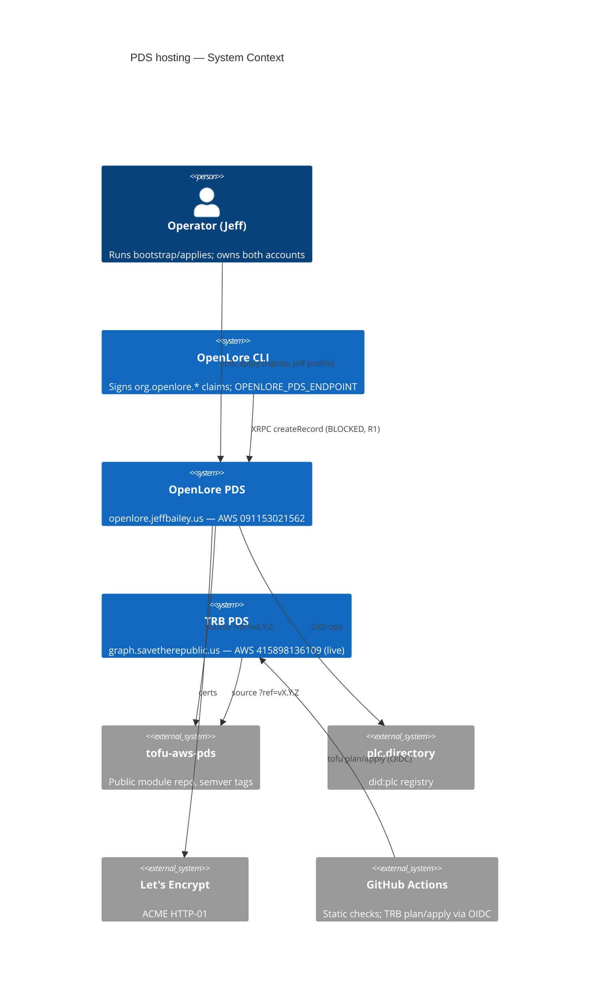
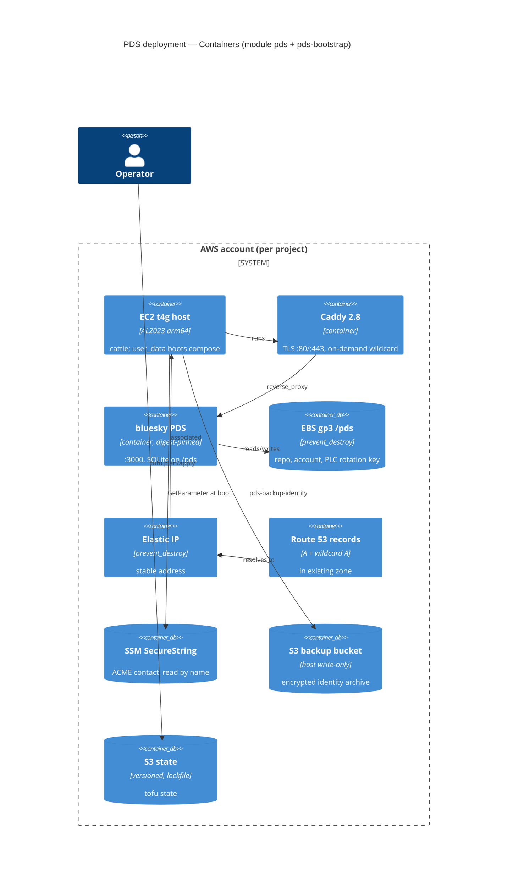

# shared-pds-module — Feature Delta

Infrastructure, brownfield. One OpenTofu module repo (`jeffabailey/tofu-aws-pds`) holds the
PDS deployment that `the-reality-base` (TRB) runs today. It is applied twice: once by TRB (live,
`str` account 415898136109) and once by OpenLore (new, `jeff` account 091153021562,
`openlore.jeffbailey.us`). Inputs: `wizard-decisions.md`, TRB `deploy/` + ADR-011..015, OpenLore
ADR-006 / ADR-062, and read-only AWS checks on the `jeff` account (2026-10-02).

## Wave: DISCUSS / [REF] Prior-wave artifacts

DESIGN started directly from `/nw:new`. No DISCUSS artifacts exist:

- ⊘ `discuss/user-stories.md`: not produced. The request and the wizard locks stand in for it.
- ⊘ `discuss/outcome-kpis.md`: not produced, so `kpi-instrumentation.md` is skipped.
- ⊘ `docs/product/journeys/*`: not applicable to infrastructure.
- ⊘ `discuss/shared-artifacts-registry.md`: not produced.
- ⊘ SLOs, deploy frequency, scale: no numbers given. Assumed values: one operator, a handful of
  deploys a year, a single-account PDS with tiny traffic, and no formal SLO. If any of these is
  wrong, D4 and D5 need another look.

## Wave: DESIGN / [REF] Measured facts (jeff account, read-only, 2026-10-02)

| Fact | Value | Consequence |
|---|---|---|
| Account | 091153021562 | account guard value |
| Default VPC in us-east-1 | **none** (only `complete-ecs` 10.1.0.0/16, another project) | the module's `data "aws_vpc" "default"` would fail, so D7 is needed |
| GitHub OIDC provider | **none** | nothing to adopt. Only matters if CI roles are ever enabled |
| t4g.micro AZs | 1a, 1b, 1d, 1e, 1f (not 1c) | the module's AZ-offering filter already handles this |
| Existing state bucket | `jeffbaileyterraformstate`, **us-west-2**, versioning **not enabled**, hosts other projects' state | reuse it with a prefixed key (D8). Versioning must be enabled first |
| Zone `jeffbailey.us` | `Z04289081C40P36K0S8LM`, public, no `openlore.*` records | the hostname is a record in that zone and needs no delegation |
| Elastic IPs | 0 allocated | no quota concern |
| `jeffabailey/openlore` | **PUBLIC** | Actions minutes are free. Environment reviewers are free if CI apply is ever wanted |
| `jeffabailey/tofu-aws-pds` | does not exist | created during DELIVER, not in this wave |

## Wave: DESIGN / [REF] Decisions

| # | Decision | Verdict | Rationale (one line) |
|---|---|---|---|
| D1 | Module home + visibility | **Standalone public repo `jeffabailey/tofu-aws-pds`**, consumed with `git::https://github.com/jeffabailey/tofu-aws-pds.git//modules/pds?ref=vX.Y.Z` | The repo holds no secrets. Https lets a private-org CI (TRB) fetch it with no deploy key. Locked by the wizard. (ADR-066) |
| D2 | Generic input contract | `name_prefix`, `project`, opt-in `require_namespace_matches_hostname` (default false). The handle-under-hostname check stays always on | TRB's naming and invariants come out byte-identical, and OpenLore's `org.openlore` ↔ `openlore.jeffbailey.us` mismatch stays legal. (ADR-066) |
| D3 | Topology | **Separate host per project, in each project's own account** | Locked. No shared blast radius and no cross-account DNS. (ADR-067) |
| D4 | OpenLore sizing | **t4g.micro + 1 GiB swap, 8 GB root, 5 GB gp3 data, EIP**. About $10.84/mo | 1 GiB meets upstream's PDS minimum. Resizing to small is a stop/start in place. The volume grows in place but never shrinks. (ADR-068) |
| D5 | OpenLore environments | **prod only**. Test happens on a local compose | A second host doubles cost to protect one operator's rare deploys. (ADR-068) |
| D6 | OpenLore apply model | **Human-run from a laptop with a saved plan file** (`AWS_PROFILE=jeff`). CI runs credential-free checks only. No OIDC roles in v1 | Fewest IAM resources. A deploy is a few-times-a-year event. Setting `enable_ci_roles = true` adds CI apply later. (ADR-068) |
| D7 | Network for OpenLore | **`aws_default_vpc` in OpenLore's bootstrap** recreates the default VPC (free). The module keeps its default-VPC lookup unchanged | No change to the module, so TRB has nothing to migrate. Reusing `complete-ecs` would couple two projects. (ADR-067) |
| D8 | OpenLore state backend | **Reuse `jeffbaileyterraformstate`** (us-west-2), keys `openlore/pds/{bootstrap,prod}.tfstate`, `use_lockfile = true` | An existing bucket comes before a new one. **Prerequisite: enable versioning (human, once).** (ADR-067) |
| D9 | Bootstrap placement | **Shared `modules/pds-bootstrap`** with toggles `create_state_bucket`, `create_oidc_provider`, `enable_ci_roles`. OpenLore uses it from day one. TRB keeps its local bootstrap until an optional phase 2 | The host role, backup bucket and account guard are PDS infrastructure too, as the user asked. Leaving TRB's live IAM alone keeps the first cut-over to one root. (ADR-067) |
| D10 | TRB migration | **Address-stable source swap**: same `module "pds"` call name, no resource renames, render-identical `user_data`, no-op plan gate, test then prod | Addresses are keyed by call name, not source, so no `moved` blocks are needed and the volume and EIP are never planned. (ADR-069) |
| D11 | Versioning | **SemVer tags.** A ruleset blocks updating or deleting `v*` tags. A CHANGELOG lists, per release, the addresses it changes. Consumers bump `?ref=` in one commit | Tags are readable and bumps are one-line diffs. The ruleset closes the mutable-tag gap. (ADR-066) |
| D12 | Module CI | Module repo `ci.yml` runs `tofu fmt -check`, `validate`, `tofu test` (mock provider: AZ selection, render-identity golden, naming contract), and the user-data shell parse. No AWS credentials | TRB's existing check job, moved to where the code now lives. |
| D13 | OpenLore repo CI | New `.github/workflows/deploy-pds-check.yml` (`paths: deploy/**`) with fmt, validate `-backend=false`, no-destroy scan, and a contact-address grep. `ci.yml` stays untouched | Purely additive. Public repo minutes are free. |
| D14 | Swap support | Module **v1.1.0** adds `swap_mb` (default 0). The template directive is whitespace-stripped, so `swap_mb = 0` renders byte-identical | This keeps v1.0.0 a pure extraction. TRB can bump with a no-op. |

## Wave: DESIGN / [REF] Component decomposition

### Module repo `jeffabailey/tofu-aws-pds` (new)

```
modules/pds/                     extracted verbatim from TRB deploy/tofu/modules/pds
  main.tf variables.tf outputs.tf user-data.sh.tftpl
  tests/az_selection.tftest.hcl  moved from TRB
  tests/render_identity.tftest.hcl   golden: TRB prod/test inputs -> the pre-extraction user_data sha256
  tests/naming_contract.tftest.hcl   name_prefix="trb" -> SG "trb-pds-prod", volume tag "trb-pds-prod-data"
  tests/invariants.tftest.hcl        namespace check on/off, handle-under-hostname refusal
modules/pds-bootstrap/           generalised from TRB deploy/tofu/bootstrap (main.tf + iam.tf)
scripts/check-no-destroy.sh      moved from TRB, called by consumers' CI
scripts/check-user-data.sh       renders the template and parses it as shell
examples/single-env/             minimal root (an OpenLore-shaped consumer)
.github/workflows/ci.yml         D12
CHANGELOG.md  README.md          per release: "addresses changed: none | <list>"
```

**`modules/pds` inputs (v1.x contract).** Everything not listed is unchanged from TRB.

| Input | Type / default | Note |
|---|---|---|
| `name_prefix` | string, **required**, `^[a-z][a-z0-9-]{1,20}$` | `name = "${name_prefix}-pds-${env}"`. Security group `name` is ForceNew, so TRB must pass `"trb"` |
| `project` | string, required | `Project` tag only (in-place) |
| `require_namespace_matches_hostname` | bool, `false` | TRB sets `true`. Gates the existing precondition and keeps `terraform_data.name_invariants` at the same address |
| `descriptor` | object, same 10 fields | `atproto_namespace` stays a field (rendered into `PDS_ATPROTO_NAMESPACE`, informational to the PDS), so TRB renders identically |
| `hosted_zone_id`, `instance_profile_name`, `backup_bucket`, `pds_image`, `ami_id`, `ssh_key_name`, `ssh_ingress_cidr` | unchanged | `pds_image` keeps its digest default and digest-only validation |
| `swap_mb` (v1.1.0) | number, `0` | `0` gives byte-identical user_data (golden test) |

**Outputs:** unchanged (`public_ip`, `pds_url`, `handle`, `atproto_namespace`, `instance_id`,
`data_volume_id`). Nothing in the outputs is sensitive.

**`modules/pds-bootstrap` inputs:** `name_prefix`, `project`, `aws_region`, `expected_account_id`
(guard), `hosted_zone_id` + `dns_record_name` (zone checks), `environments` (a map of decoded
descriptors passed in by the root, replacing the module's file reads), `create_state_bucket`
(default true), `state_bucket_name` (used when false), `state_key_prefix`, `create_oidc_provider`,
`enable_ci_roles` (default true), `github_org`/`github_repo`/ids/`use_immutable_subject`/
`apply_job_workflow_ref` (only when CI roles are on), and `create_default_vpc` (default false).
**Outputs:** `backup_bucket`, `host_instance_profile_names`, `state_bucket`, plus
`plan_role_arns`/`apply_role_arns` when CI roles are enabled. Bucket and role names keep TRB's
pattern `${name_prefix}-…`, so phase 2 can adopt TRB's live resources with no rename.

### TRB repo changes (DELIVER; READ-ONLY in this wave)

- `deploy/tofu/environments/{test,prod}/main.tf`: change `source` to the git ref, add
  `name_prefix = "trb"`, `project = "the-reality-base"`, `require_namespace_matches_hostname = true`.
- Delete `deploy/tofu/modules/pds/` after the prod no-op apply.
- `deploy-pds.yml` check job: drop the module validate/test loop (it moved). Strengthen the plan
  gate for the cut-over commit: **zero `delete`/`create` actions on any address**.
- `check-descriptors.sh` and `environments/*.json` stay unchanged. They are TRB policy.
- Bootstrap: unchanged in phase 1. Phase 2 is optional (see the cut-over plan).

### OpenLore repo layout (new, under `deploy/`)

```
deploy/README.md                     runbook (bootstrap, SSM contact, apply, backup key, teardown)
deploy/environments/prod.json        descriptor: the single source of names
deploy/tofu/bootstrap/main.tf        module "pds_bootstrap" (create_state_bucket=false,
                                     enable_ci_roles=false, create_default_vpc=true)
deploy/tofu/environments/prod/       thin root: backend s3 (jeffbaileyterraformstate, us-west-2,
  main.tf variables.tf outputs.tf      key openlore/pds/prod.tfstate), module "pds"
deploy/check-plan.sh                 local jq gate: refuse delete/replace on volume/EIP/zone/bucket
.github/workflows/deploy-pds-check.yml   D13
```

Descriptor (`prod.json`): `environment=prod`, `pds_hostname=openlore.jeffbailey.us`,
`handle=jeff.openlore.jeffbailey.us` (OQ-2), `atproto_namespace=org.openlore` (informational;
the namespace check is off), `instance_type=t4g.micro`, `data_volume_gb=5`,
`aws_region=us-east-1`, `tofu_state_key=openlore/pds/prod.tfstate`, `lifecycle=persistent`,
`contact_ssm_parameter=/openlore/prod/acme-contact-email`.

## Wave: DESIGN / [REF] Driving ports (entry points)

| Port | Actor | Mechanism |
|---|---|---|
| Bootstrap apply | Operator (laptop) | `AWS_PROFILE=jeff tofu -chdir=deploy/tofu/bootstrap plan -out=… && apply <plan>` |
| Environment plan/apply | Operator (laptop), OpenLore | `tofu plan -out=tfplan` → `deploy/check-plan.sh tfplan` → `tofu apply tfplan` |
| Environment plan/apply | TRB GitHub Actions (OIDC) | existing `deploy-pds.yml`: plan on PR/push, dispatch apply of the saved plan |
| Static checks | GitHub Actions, no credentials | module repo `ci.yml`. OpenLore `deploy-pds-check.yml` |
| Module release | Maintainer | tag `vX.Y.Z` on module repo `main` (protected by ruleset) |
| PDS use | `openlore` CLI | `OPENLORE_PDS_ENDPOINT=https://openlore.jeffbailey.us`. **Blocked**, see R1 |

## Wave: DESIGN / [REF] Driven ports and adapters (AWS / external)

| Port | Adapter | Notes |
|---|---|---|
| Compute | EC2 t4g (Graviton), AL2023 arm64 via `DescribeImages` | cattle. `ignore_changes = [ami]` |
| Identity storage | EBS gp3 `pds_data` | `prevent_destroy`. Holds the PLC rotation key and `did:plc` |
| Address | EIP | `prevent_destroy`. Costs the same as an auto-assigned public IPv4 |
| DNS | Route 53 A + wildcard A in the existing zone | no new zone |
| Config secret | SSM SecureString (ACME contact) | read by name on the host. Never in state |
| Identity backup | S3 backup bucket, host write-only, no delete | encrypted with an operator public key |
| State | S3 backend, native lockfile | no DynamoDB |
| TLS | Let's Encrypt via Caddy (HTTP-01 for the hostname, on-demand for the wildcard) | port 80 must stay open |
| PDS | `ghcr.io/bluesky-social/pds@sha256:…` | digest-pinned |
| CI auth (TRB only) | GitHub OIDC → plan/apply roles | unchanged |

## Wave: DESIGN / [REF] Technology choices

OpenTofu `>= 1.10.0` in the module (S3 `use_lockfile`, `optional()` object attributes), CI pinned
to **1.12.6** (TRB's pin). AWS provider `hashicorp/aws ~> 6.0`. Each root commits its own
`.terraform.lock.hcl`. Module tests use `tofu test` with `mock_provider` (no credentials). Runtime
is Docker compose v2.30.3, Caddy 2.8, and the bluesky PDS, all vendored in the template. Rejected:
Terragrunt (a third tool for two roots), a Terraform registry (needs a namespace, and git refs
are enough for two consumers), and CDKTF/Pulumi (rewrites live code).

## Wave: DESIGN / [REF] Reuse Analysis

| TRB component | Verdict | Where it lands |
|---|---|---|
| `tofu/modules/pds/*.tf` | **EXTRACT** (move plus 3 inputs) | `tofu-aws-pds//modules/pds` |
| `user-data.sh.tftpl` | **EXTRACT** verbatim (v1.0.0). EXTEND with swap in v1.1.0 | module |
| `az_selection.tftest.hcl` | **EXTRACT** + add golden render/naming tests | module `tests/` |
| `tofu/bootstrap/*.tf` | **EXTRACT/GENERALISE**, with toggles and descriptors as input | `modules/pds-bootstrap` |
| `check-no-destroy.sh`, `check-user-data.sh` | **EXTRACT** | module `scripts/` |
| `check-descriptors.sh` | **KEEP per project** (TRB policy). OpenLore needs none, because the module's preconditions cover the generic invariant | TRB only |
| `environments/*.json` pattern | **REUSE pattern** | OpenLore `deploy/environments/prod.json` |
| `tofu/environments/{env}` thin roots | **REUSE pattern** | OpenLore `deploy/tofu/environments/prod` |
| `deploy-pds.yml` | **KEEP for TRB**. OpenLore gets a credential-free subset (D6, D13) | — |
| `spike/compose.local.yaml` | **REUSE** as OpenLore's local test env (D5) | referenced from the OpenLore README |
| `jeffbaileyterraformstate` (jeff acct) | **REUSE** (D8) | backend |
| `jeffbailey.us` zone (jeff acct) | **REUSE** | records only |
| `complete-ecs` VPC (jeff acct) | **REJECTED for reuse**: another project's dev VPC | — |
| `create new`: default VPC, backup bucket, host role, PDS host | **CREATE NEW**: no existing alternative in the jeff account | OpenLore bootstrap and env |

## Wave: DESIGN / [REF] Cost (us-east-1 on-demand, 730 h/mo, USD)

| Line | A: **micro, recommended** | B: small (TRB sizing) | C: micro, prod+test | D: nano |
|---|---|---|---|---|
| EC2 | t4g.micro 6.13 | t4g.small 12.26 | 2 × 6.13 | t4g.nano 3.07 |
| Root gp3 8 GB | 0.64 | 0.64 | 1.28 | 0.64 |
| Data gp3 | 5 GB 0.40 | 20 GB 1.60 | 0.80 | 0.40 |
| Public IPv4 (EIP) | 3.65 | 3.65 | 7.30 | 3.65 |
| S3 state + backup, Route 53 queries, SSM std param | ~0.02 | ~0.02 | ~0.03 | ~0.02 |
| **Total / month** | **≈ 10.84** | ≈ 18.17 | ≈ 21.67 | ≈ 7.78, **rejected**: 0.5 GiB is below upstream's 1 GB minimum |

Notes: the `jeffbailey.us` zone ($0.50) already exists, so it is not marginal. An EIP costs the
same as an auto-assigned public IPv4 ($0.005/h), so a "plain public IP" saves nothing and loses
the stable address. IPv6-only would save $3.65 but is rejected: ghcr.io and GitHub have no IPv6,
and NAT64 would need a $32/mo NAT gateway. A 1-yr Compute Savings Plan would bring A to about
$8.5. Deferred until the PDS has proven useful (OQ-4). TRB is unchanged: about $18.17 per
running environment.

## Wave: DESIGN / [REF] TRB cut-over plan (zero destroy/replace)

Rollback is designed first. Every step is reversible by reverting the `source` line. State
addresses never change, so a revert plans as a no-op.

1. **Baseline (TRB, laptop or CI plan).** `tofu plan` on test and prod must show *No changes*.
   Record `tofu state list` and the `user_data` hash of `module.pds.aws_instance.pds`. Drift
   blocks the cut-over and is fixed first.
2. **Extract (module repo).** `git filter-repo`/`subtree split` of `deploy/tofu/modules/pds` into
   `tofu-aws-pds/modules/pds` (keeps history). Add the three D2 inputs, chosen so that TRB inputs
   render identically, and **rename no resource or data block**. Add the golden tests, with the
   expected sha256 taken from step 1. CI green, then tag **v1.0.0**.
3. **Swap source on test.** TRB commit: `source = "git::https://…//modules/pds?ref=v1.0.0"` plus
   the 3 inputs, on the test root only. `tofu init -upgrade`, then plan. **Gate: no `create`,
   `delete` or replace on any address.** In-place tag updates are allowed and nothing else is.
   Apply if non-empty. Postcheck: re-plan is empty, and `https://test.graph.savetherepublic.us/xrpc/_health` returns 200.
4. **Prod.** Same commit shape for prod, same gate, same postcheck against
   `graph.savetherepublic.us`. `aws_ebs_volume.pds_data` and `aws_eip.pds` must appear as `no-op`.
5. **Clean-up.** Delete `deploy/tofu/modules/pds/` and update the check-job paths in `deploy-pds.yml`.
6. **Optional phase 2, the bootstrap.** Replace TRB's bootstrap root body with
   `module "bootstrap" { source = …//modules/pds-bootstrap }` plus one `moved {}` block per
   resource (e.g. `aws_s3_bucket.state` → `module.bootstrap.aws_s3_bucket.state[0]`). Same no-op
   gate. Human-run, as TRB's bootstrap always is.

Why `user_data` is safe either way: in AWS provider v6, changing `user_data` is an **in-place
stop/start** (`user_data_replace_on_change` defaults to false). Even a forced instance replacement
only replaces cattle. `aws_volume_attachment` detaches with `stop_instance_before_detaching`, and
the volume and EIP are separate resources with `prevent_destroy`. The golden test is there to
avoid an unplanned stop/start, not to protect the identity.

## Wave: DESIGN / [REF] C4 — System Context



## Wave: DESIGN / [REF] C4 — Container (one PDS deployment, either account)



## Wave: DESIGN / [REF] Quality gates (shift-left)

Local: `tofu fmt -check`, `tofu validate`, `tofu test`, and `deploy/check-plan.sh` before every
OpenLore apply. CI (module repo): fmt, validate, test (golden render, naming contract, AZ selection,
invariants), shell parse of the rendered user_data, and the no-destroy scan. CI (OpenLore):
`deploy-pds-check.yml`. Deploy: saved plan file only, and the protected-resource delete gate.
Post-deploy: re-plan is empty, `/xrpc/_health` returns 200, and a TLS handshake succeeds on the
hostname. Production: EC2 simplified automatic recovery (on by default for t4g on EBS-only
storage, free). A paid alarm is optional (OQ-5).

## Wave: DESIGN / [REF] Open questions

- **OQ-1 (blocking for usefulness):** resolve R1 before or right after the OpenLore apply? A PDS
  can hold the OpenLore DID or handle today, but cannot accept `org.openlore.claim` records as
  they are currently written.
- **OQ-2:** OpenLore handle. `jeff.openlore.jeffbailey.us` (works with the wildcard, no TXT) is
  the default. A bare `jeffbailey.us` handle needs a `_atproto` TXT record and is out of module scope.
- **OQ-3:** Enable versioning on `jeffbaileyterraformstate` (it benefits every state in it), or
  create a dedicated `openlore-tofu-state-091153021562` through `create_state_bucket = true` (about $0)?
  The recommendation is to enable versioning.
- **OQ-4:** Savings Plan or reservation after 3 months of steady use (saves about $2.3/mo).
- **OQ-5:** A `StatusCheckFailed` CloudWatch alarm with email ($0.10/mo), or none.
- **OQ-6:** Should OpenLore get CI apply (OIDC, a GitHub Environment reviewer, free on a public repo)
  later? It is a toggle: `enable_ci_roles = true` plus a `deploy-pds.yml` copy.
- **OQ-7:** Should OpenLore's relay crawl (`PDS_CRAWLERS`) stay off, as in TRB, until claims are publishable?

## Wave: DESIGN / [REF] Risks

- **R1, HIGH: OpenLore records cannot be written to a stock PDS as implemented.** Evidence:
  (a) `lexicons/org/openlore/claim.json` declares `confidence` as `"type": "number"`. ATProto
  Lexicon has no float type (only `integer`), and the ATProto data model excludes floats.
  (b) ADR-062 / SPIKE-00: a JS `@ipld/dag-cbor` PDS re-encodes `0.0/0.5/1.0` as float64, while
  `claim-domain` emits float16. The server-assigned CID therefore diverges from the CLI's CID.
  ADR-062 explicitly **rejected** `putRecord` to a standard PDS. (c)
  `crates/adapter-atproto-pds` posts `createRecord` **with no auth**. `--app-password` is parsed
  in `init` and never used, and there is no `createSession` or bearer, so a stock PDS answers 401.
  Whether the current PDS build rejects float-bearing records outright or stores them is
  `[unverified]`. Check it with one authenticated `createRecord` against local compose (VER-OL-1).
  The fix is application work: an integer-scaled or string confidence (a CID wire break, per the
  ADR-062 revisit trigger) plus auth in the adapter. It is **not** solved in this wave.
- **R2, MED:** The module's default-VPC dependency. OpenLore has no default VPC. If
  `aws_default_vpc` does not create one in provider 6.x as expected, the fallback is a one-time
  `aws ec2 create-default-vpc` (`[verify in DELIVER]`).
- **R3, MED:** A t4g.micro memory squeeze during `dnf update` or an image pull. Swap mitigates it,
  and the fallback is a stop/start resize to small (+$6.13).
- **R4, MED:** Mutable module tags. Mitigated by a tag ruleset and CHANGELOG address notes.
  Consumers can pin a SHA instead.
- **R5, LOW:** Cross-region state (bucket in us-west-2, resources in us-east-1). This is
  functionally fine but adds one backend `region` to keep correct.
- **R6, MED:** The OpenLore identity archive needs `/pds/backup-pubkey.pem` placed by hand.
  Until it is, the backup refuses to upload (by design). It is a runbook step and a DEVOPS gate.

## Wave: DESIGN / [REF] User decisions on the open questions (2026-10-02)

- **OQ-1:** build the PDS infrastructure now; fix claim publishing (R1) right after as its own
  feature. OpenLore is greenfield with no data to keep, so that fix may change the claim wire
  format (confidence encoding, CIDs) without a migration.
- **OQ-2:** handle `jeff.openlore.jeffbailey.us`.
- **OQ-3..OQ-7:** take the recommended defaults (enable versioning on the existing state bucket;
  no Savings Plan yet; no paid alarm; laptop apply only; relay crawl off).
