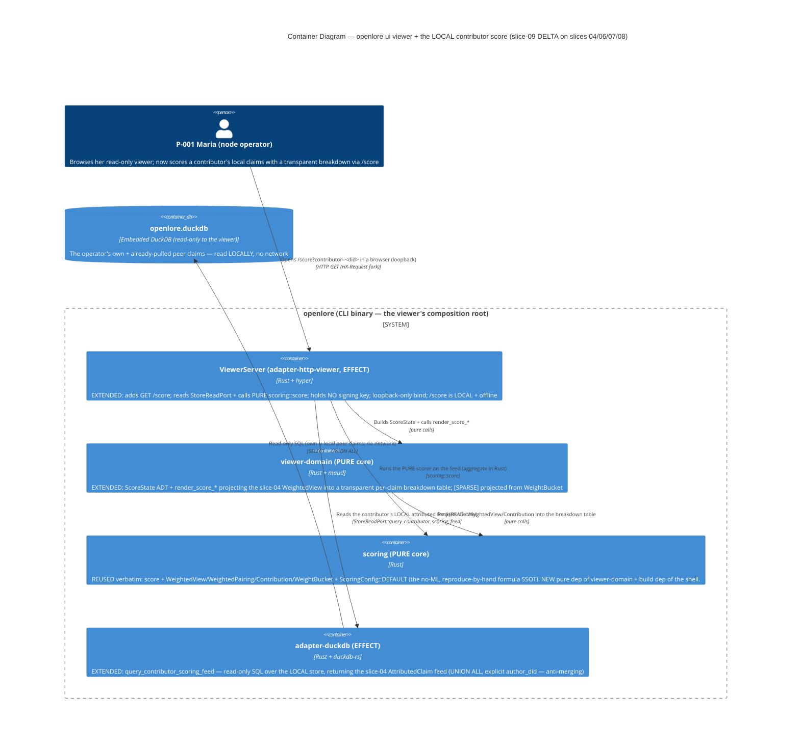
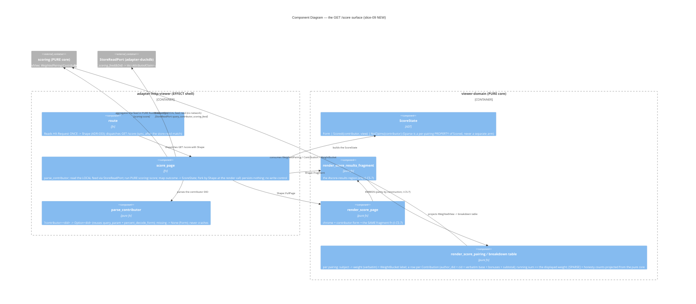

<!-- markdownlint-disable MD024 -->
# Feature Delta: viewer-contributor-scoring

> Wave: **DISCUSS** (lean mode + ask-intelligent)
> Feature type: User-facing (a new READ-ONLY browser view on the `openlore ui` viewer)
> Walking skeleton: Yes, thin (US-CS-001 + US-CS-002)
> UX depth: Lightweight (server-rendered maud HTML + htmx progressive enhancement — inherits slices 06/07)
> JTBD: YES — every story traces to **J-002** (esp. sub-job **J-002c**) in `docs/product/jobs.yaml`; no new job created
> Brownfield DELTA on: `openlore-scoring-graph` (slice-04), `htmx-scraper-viewer` (slice-06), `viewer-htmx-swaps` (slice-07), `viewer-network-search` (slice-08)
> Date: 2026-06-05 · Owner: Luna (nw-product-owner)

This file is the canonical DISCUSS-wave delta for `viewer-contributor-scoring`
(slice-09): a **contributor-scoring view** added to the read-only `openlore ui`
viewer. A `GET /score?contributor=<did>` route reads the LOCAL claim graph for the
contributor, runs the slice-04 PURE `scoring` scorer, and renders the contributor's
**transparent adherence score + its component breakdown** as HTML, with an htmx
fragment swap (like `/scrape` and `/search`). It is the **browser UI for `graph query
--contributor <did> --weighted --explain`** — the same transparent-scoring J-002 the
slice-04 CLI delivered, now glanceable from the same read-only viewer Maria already
uses, and computed entirely over the LOCAL store (offline-capable).

This is a DELTA. It REUSES the slice-04 PURE `scoring` crate (`score` + `WeightedView`
+ `Contribution` + `WeightBucket`) verbatim, the slice-04 attributed scoring-feed read
contract, and the slice-06/07 page=chrome+fragment render pattern. It adds exactly ONE
new capability — a LOCAL contributor-scoring read effect in the viewer process (a
read + pure compute over the read-only DuckDB store, distinct from the slice-06
GithubPort and the slice-08 network IndexQueryPort). Tier-1 content is inlined here
(lean); SSOT lives under `docs/product/`; per-slice briefs under `slices/`;
per-journey/registry artifacts under `discuss/`.

---

## Wave: DISCUSS / [REF] Persona ID

**P-001 Senior Engineer Solo Builder** ("Maria", the node operator) — the SAME
persona as slices 06/07/08 (`docs/product/personas/senior-engineer-solo-builder.yaml`).
She lives in a terminal but runs `openlore ui` to GLANCE at her store in a browser
(slice-06), navigate it without reloads (slice-07), and discover the network (slice-08).
slice-09 extends that same read-only viewer with a contributor-scoring surface: she can
now see WHAT a contributor's claims add up to under a transparent adherence weight —
**and exactly WHY** (the per-claim breakdown) — from the browser, without dropping back
to the CLI's `graph query --contributor <did> --weighted --explain`.

slice-04 framed P-002 (Researcher/Tech Lead) as primary for the CLI graph-explorer job;
the BROWSER viewer's operator, though, is P-001 (the viewer is her surface, slices
06/07/08). She wears the graph-explorer hat at her own loopback viewer. UX guardrails
inherited: read-only, never silently mutate, confidence display must never read as
"the system thinks this is true," and — load-bearing here — a score is never an opaque
number (the breakdown is always shown).

---

## Wave: DISCUSS / [REF] JTBD One-Liner

> **J-002**: *When I'm choosing a tech stack or evaluating a community, I want to see
> what philosophies a project embodies and who else holds those philosophies, so I can
> pick projects aligned with how I want to build.*
>
> **J-002c** (load-bearing sub-job): *When I weigh projects on a philosophy, I want a
> SMALL transparent weight (count × confidence × multi-project/author triangulation, no
> ML) that I can reproduce by hand and that renders thin evidence honestly as sparse,
> so I can distinguish well-supported claims from speculation without fearing a bad call
> on biased or sparse data.*

slice-09 is the **browser UI** for J-002, focused on the J-002c transparency thesis
(validated in slice-04; opportunity score 14, `walking_skeleton_for:
openlore-scoring-graph`). No new job. Every story below traces to J-002 and its
sub-jobs:

| Sub-job | Name | Stories |
|---|---|---|
| J-002c | See transparent, auditable adherence weighting | US-CS-002 (the score + breakdown render), US-CS-003 (sparse honesty + verbatim) |
| J-002a | Query the graph by dimension (contributor) | US-CS-002 (the contributor-dimension local read, in the browser) |
| (enabler) | the LOCAL contributor-scoring read capability | US-CS-001 (`@infrastructure`, with rationale) |

---

## Wave: DISCUSS / [REF] Locked Decisions

See `discuss/wave-decisions.md` for full rationale. Summary (WD-CS-*):

| # | Decision | Status |
|---|---|---|
| WD-CS-1 | Sibling feature; brownfield DELTA on slices 04/06/07/08; US-CS-001 is the thin walking-skeleton enabler. | LOCKED |
| WD-CS-2 | Persona = P-001 (Maria, the node operator) — the viewer's operator, wearing the graph-explorer hat. | LOCKED |
| WD-CS-3 | Viewer stays **READ-ONLY**: scoring is a READ + pure COMPUTE; no new write/sign route; no key in the process; the derived score is DISPLAY-ONLY, never persisted/signed/published (inherits WD-72). Inherits I-VIEW-1/2/3 / KPI-VIEW-2 / KPI-HX-G3. | LOCKED |
| WD-CS-4 | **Transparency is load-bearing (J-002c)**: the view MUST render the score's component BREAKDOWN (confidence contribution + author-distinct bonus + cross-project triangulation, running sum == displayed weight, each contribution named back to author DID + cid) — NEVER an opaque number. Inherits KPI-GRAPH-3 / KPI-GRAPH-2. | LOCKED |
| WD-CS-5 | **Sparse renders sparse**: a thin subgraph renders `[SPARSE]` + the "treat as a lead, not a conclusion" honesty line regardless of weight magnitude; a single high-confidence opinion is never dressed up as Strong. Inherits KPI-GRAPH-4 / WD-74. | LOCKED |
| WD-CS-6 | **Pure-scorer reuse**: REUSE the slice-04 `scoring` crate (`score`/`WeightedView`/`Contribution`/`WeightBucket`) verbatim; the viewer PROJECTS the pure-core output to HTML and reimplements NO scoring math. Formula constants stay the SSOT in `ScoringConfig::DEFAULT` (WD-77). | LOCKED |
| WD-CS-7 | **Confidence + weight VERBATIM**: every confidence is the stored `f64` rendered verbatim (`0.86`, never `0.9`/`86%`); the displayed weight is the consumed weight (no bucket-midpoint rounding — Gate 6). Inherits FR-VIEW-8 / KPI-4. | LOCKED |
| WD-CS-8 | **Local-first / offline**: the contributor score is computed over the LOCAL store/graph — `/score` works fully offline (DISTINCT from `/scrape` and `/search`, the only network-requiring routes). Inherits KPI-5 / KPI-GRAPH-6. | LOCKED |
| WD-CS-9 | **Progressive enhancement**: `/score` serves a full page without `HX-Request`, a fragment of the same score region with it (slice-07 `Shape` fork). htmx stays the vendored, SHA-256-pinned local asset. Inherits I-HX-1..5 / KPI-HX-G1 / KPI-HX-G2. | LOCKED |
| WD-CS-10 | **Attribution preserved; zero new persisted types; loopback bind unchanged.** The breakdown names contributing claims/authors (auditable); the score is computed per-query, never persisted. Inherits I-FED-1 / WD-73 / BR-VIEW-2 / I-VIEW-4. | LOCKED |

---

## Wave: DISCUSS / [REF] Inherited Invariants (I-CS-* inheriting I-VIEW-* / I-HX-* / GRAPH-*)

These are binding inputs to DESIGN; they are NOT relitigated here.

| ID | Inherits | Carries into slice-09 as |
|---|---|---|
| I-CS-1 | I-VIEW-1/2/3 (slice-06) / KPI-VIEW-2 | Read-only preserved: scoring is a READ + pure compute; the viewer signs/writes/persists nothing, holds no signing key. The local contributor-scoring read holds NO signing/identity/PDS surface (mirrors the slice-06 GithubPort + slice-08 IndexQueryPort capability boundary). |
| I-CS-2 | KPI-GRAPH-3 (slice-04) / KPI-GRAPH-2 / WD-73 | Scoring transparency + anti-merging in aggregates: the rendered score MUST decompose to per-claim `Contribution`s (each with its author DID + cid + base confidence + applied bonuses + a subtotal), whose running sum equals the displayed weight (reproduce-by-hand). A weight is an aggregate VIEW that never becomes a faceless consensus number. |
| I-CS-3 | KPI-GRAPH-4 (slice-04) / WD-74 | Sparse renders sparse: a single-claim / single-author / no-cross-project-span subgraph renders the `[SPARSE]` bucket + the "based on N claim(s) by M author(s) — treat as a lead, not a conclusion" honesty line, regardless of weight magnitude (the load-bearing breadth guard, inherited from the pure core's `WeightBucket`). |
| I-CS-4 | WD-72 (slice-04) / BR-VIEW-2 (slice-06) | Display-only score: the adherence weight is DERIVED + DISPLAY-ONLY — recomputed per query, NEVER persisted/signed/published. The viewer persists nothing from `/score` (zero new persisted types). |
| I-CS-5 | KPI-GRAPH-6 / KPI-5 (slice-04/01) | Local-first / offline: the score is computed over the LOCAL DuckDB store — `/score` works fully offline (no network), distinct from `/scrape` and `/search`. The network being down never degrades the score view. |
| I-CS-6 | FR-VIEW-8 (slice-06) / KPI-4 | Confidence + weight rendered VERBATIM (`0.86`, never `0.9`/`86%`; the displayed weight is the consumed weight — no bucket-midpoint rounding). The same `render_confidence` contract; the number must never read as "the system thinks this is true." |
| I-CS-7 | I-HX-1..5 / KPI-HX-G1 (slice-07) | Progressive enhancement: full page without `HX-Request`, fragment of the same score region with it; page = chrome + fragment; the two shapes agree by construction (the full page embeds the fragment fn). |
| I-CS-8 | I-HX-2 / KPI-HX-G2 (slice-07) | Offline / no-CDN chrome: htmx is the vendored, SHA-256-pinned local asset at `/static/htmx.min.js`; zero off-host references. (The score read is LOCAL — the whole `/score` surface, chrome AND data, stays offline-capable; unlike `/search`.) |
| I-CS-9 | I-VIEW-4 (slice-06) / KPI-HX-G3 | Loopback-only bind unchanged (127.0.0.1); zero new persisted types; no new write/sign route (the score read is GET-only and key-less). |
| I-CS-10 | I-FED-1 (slice-03) / WD-73 (slice-04) | Attribution preserved: the breakdown names each contributing claim's author DID + cid; the score is auditable back to the attributed claims it aggregates. |

---

## Wave: DISCUSS / [REF] Story Map and Slicing

One journey: **read-a-contributors-transparent-score-from-the-browser** (a single
coherent surface; the arc open `/score?contributor=<did>` → see the headline score
bucket → expand the per-claim breakdown → reproduce the weight by hand → trust it OR
read it as a sparse lead). Visual journey + shared-artifacts registry under `discuss/`
(placement mirrors slices 07/08).

Emotional arc: **wary-of-an-opaque-number → reassured-by-the-breakdown →
confident-and-defensible → grounded-when-thin** — entry wary (a "score" smells like an
opaque ranking she cannot defend; the J-002 anxiety about biased/sparse data),
through reassured (the visible per-claim decomposition lets her trace the number back
to named, attributed claims), the confidence peak (she can reproduce the weight by hand
and cite it when justifying a choice), to grounded-when-thin (a sparse subgraph renders
honestly as `[SPARSE]` so she treats it as a lead, never a false-confident conclusion).

Slicing (by outcome impact + risk, not feature grouping):

- **Release 1 (walking skeleton)** — `slices/slice-01-walking-skeleton.md`:
  US-CS-001 + US-CS-002. The thinnest end-to-end thread: a contributor's transparent
  score **with its component breakdown** rendered in the browser from the LOCAL graph
  + the reused pure scorer, with the fragment swap. Validates the riskiest assumption
  (the read-only viewer can host a local-graph-read + pure-compute capability AND the
  transparency/read-only/local-first/PE invariants hold — including that the breakdown,
  not just the number, ships).
- **Release 2 (epistemic honesty + verbatim + empty state)** — `slices/slice-02-honesty-and-empty.md`:
  US-CS-003. Makes the trust surface honest: `[SPARSE]` + the lead-not-conclusion
  honesty line for thin evidence; confidence + weight rendered verbatim; and the
  empty/no-claims-for-contributor state. Hardens the J-002c anxiety mitigation on the
  browser surface.

### Priority Rationale

Release 1 first because it carries the slice's riskiest assumption: that the read-only
viewer can host a LOCAL-graph-read + pure-compute scoring capability while preserving
every cardinal invariant (read-only, transparent-not-opaque, local-first,
progressive-enhancement) — and, critically, that the BREAKDOWN ships with the number
(an opaque-number regression would silently re-create the aggregator failure J-002
exists to avoid). If Release 1 fails, the browser-transparent-scoring thesis is
disproven and the read-only viewer's trust model is at risk — everything else is moot.
Release 2 hardens epistemic honesty (sparse) and the verbatim/empty edges; its failure
is survivable (the happy-path score + breakdown already delivers the headline value;
sparse/empty polish can iterate, though sparse honesty is release-blocking for ship).
Within Release 1, US-CS-001 (the local-scoring read capability) precedes US-CS-002 (the
render) because the render has nothing to project without the read + the pure-score
output.

---

## Wave: DISCUSS / [REF] System Constraints (cross-cutting)

These hold across every story (the I-CS-* invariants, restated as build constraints):

- The viewer process holds **no signing key** and exposes **no write/sign route**. The
  local contributor-scoring read effect reads only the local store (no
  signing/identity/PDS capability; no network). (I-CS-1)
- The displayed score is **never persisted** and **never normalized**: it is recomputed
  per query, and every confidence/weight shown matches the consumed value byte-for-byte
  (inherits KPI-4). (I-CS-4 / I-CS-6)
- The score is **never an opaque number**: every rendered score carries its **component
  breakdown** (per-claim `Contribution`s — confidence contribution, author-distinct
  bonus, cross-project triangulation bonus — with a running sum equal to the displayed
  weight), each contribution named back to its author DID + cid. (I-CS-2 / I-CS-10)
- A **thin subgraph renders `[SPARSE]`** + the lead-not-conclusion honesty line,
  regardless of weight magnitude (the breadth guard is inherited from the pure core).
  (I-CS-3)
- The **scoring math is the reused slice-04 pure core** (`scoring::score`); the viewer
  reimplements no formula. (WD-CS-6)
- Every route serves a **complete full page without `HX-Request`** (no-JS no-regression)
  and an offline-capable chrome (vendored htmx). The whole `/score` surface (chrome AND
  data) works offline. (I-CS-5 / I-CS-7 / I-CS-8)
- **Loopback-only bind** unchanged. (I-CS-9)

---

## Wave: DISCUSS / [REF] User Stories and Acceptance Criteria

All three stories trace to **J-002** (esp. J-002c). US-CS-001 is `@infrastructure` (the
new local-contributor-scoring read capability) with rationale; the slice is NOT 100%
`@infrastructure` (2 user-visible stories). Full UAT below; AC derived per story.

### US-CS-001: Bootstrap the viewer's local contributor-scoring read capability (`@infrastructure`)

- **job_id**: `infrastructure-only`
- **infrastructure_rationale**: This story stands up the NEW capability the viewer needs
  to score a contributor — a LOCAL contributor-scoring read effect in the viewer
  process (read the attributed scoring feed for a contributor over the read-only DuckDB
  store, then run the slice-04 PURE `scoring::score`). It enables the user-visible
  stories (US-CS-002/003) but renders no user-facing output on its own; the user
  decision it serves is made in those stories. The capability MUST hold no
  signing/identity/PDS surface (I-CS-1), read the LOCAL store only — no network (I-CS-5)
  — and produce a DISPLAY-ONLY `WeightedView` that is never persisted (I-CS-4).

#### Problem

The read-only viewer (slices 06/07/08) can read the LOCAL store (`/claims`,
`/peer-claims`), public GitHub (`/scrape`), and the network index (`/search`) — but it
has no way to run the slice-04 transparent scorer over a contributor's local claims, so
the browser cannot show a contributor's adherence score at all. The capability must be
added without giving the viewer any write/sign capability and without leaving the local
store (the score is local-first/offline by design).

#### Solution

Add a local contributor-scoring read effect to the viewer process: given a contributor
DID, it reads the attributed scoring feed for that contributor over the read-only store
(the slice-04 `query_attributed_for_scoring` / `query_by_contributor` contract,
projected to the viewer's read port), runs the slice-04 PURE
`scoring::score(&feed, &ScoringConfig::DEFAULT)`, and returns the `WeightedView` (with
its per-claim `Contribution` decomposition) for the render layer. It holds no
signing/identity/PDS capability, touches no network, and persists nothing. OD-CS-2:
DESIGN decides the exact read shape (extend the read port vs reuse the slice-04 feed
read vs a new viewer-process port).

#### Domain Examples

1. **Contributor with a rich trail** — Maria scores `did:plc:priya-test`; the capability
   reads 14 attributed local claims across 4 subjects by 2 distinct authors, runs the
   pure scorer, and returns a `WeightedView` whose top pairing decomposes to 14
   `Contribution`s (running sum == the displayed weight) for the render layer.
2. **Thin contributor (sparse)** — Maria scores `did:plc:bjorn-test`, who has exactly
   one local claim about one subject; the capability returns a `WeightedView` whose
   pairing is bucketed `[SPARSE]` by the pure core's breadth guard (claim_count == 1,
   distinct_author_count == 1, cross_project_span == 1) — no manufactured confidence.
3. **Contributor with no local claims** — Maria scores `did:plc:nobody-local`; the
   feed read returns zero rows, so the capability returns an empty `WeightedView` (no
   pairings) for the render layer to show the guided empty state — never a crash, never
   a network call.

#### UAT Scenarios (BDD)

##### Scenario: The browser viewer can score a contributor over the local graph

```
Given the viewer is reading a local store that holds a contributor's signed claims
When the viewer scores that contributor along the contributor dimension
Then it obtains a transparent weighted view that decomposes to per-claim contributions
And the viewer process holds no signing key, exposes no write/sign route, and makes no network call
```

##### Scenario: Scoring a contributor with no local claims never crashes the viewer

```
Given the viewer is reading a local store that holds no claims for the queried contributor
When the viewer scores that contributor
Then it obtains an empty weighted view (no pairings) for the render layer
And no crash, hang, or network call occurs in the viewer process
```

#### Acceptance Criteria

- [ ] The viewer process can read the attributed contributor scoring feed over the
      read-only store and run the slice-04 PURE `scoring::score` to obtain a `WeightedView`.
- [ ] The capability holds no signing/identity/PDS surface (no key enters the viewer
      process; no new write/sign route) and makes no network call (local store only).
- [ ] The derived `WeightedView` is display-only — it is never persisted (zero new
      persisted types).
- [ ] A contributor with no local claims yields an empty `WeightedView` — no crash, no hang.

#### Technical Notes

- REUSE the slice-04 PURE `scoring` crate (`score` + `ScoringConfig::DEFAULT` +
  `WeightedView` + `WeightedPairing` + `WeightBucket` + `Contribution`) verbatim — do
  NOT reimplement the formula (WD-CS-6). REUSE the slice-04 attributed-scoring-feed read
  contract (`ScoringFilter::ByContributor`-shaped read / `query_by_contributor`).
- The viewer composition root already owns a tokio runtime + the read-only store
  (slice-06); the new effect is a synchronous local read + pure compute. OD-CS-2 (read
  shape) is DESIGN's.
- Dependencies: slice-04 `scoring` crate + the attributed-scoring-feed read; slice-06
  `ViewerServer` + `StoreReadPort`.

---

### US-CS-002: See a contributor's transparent score and breakdown in the browser

- **job_id**: J-002 (sub-jobs J-002a contributor dimension + J-002c transparent weighting)

#### Elevator Pitch

- **Before**: Maria can glance at her claims (slices 06/07) and discover the network
  (slice-08) in the browser, but to see what a contributor's claims add up to under the
  transparent adherence weight — and WHY — she must drop to the CLI (`graph query
  --contributor <did> --weighted --explain`).
- **After**: she opens `http://127.0.0.1:8080/score?contributor=did:plc:priya-test` in
  the viewer and sees the headline adherence score (e.g. *"reproducible-builds: weight
  1.71 — Strong"*) **with its component breakdown directly beneath** — each contributing
  claim listed under its author DID + cid, showing the base confidence (`0.86`), the
  author-distinct bonus, and the cross-project triangulation bonus, with a running sum
  that equals the displayed weight — never an opaque number she has to take on faith.
- **Decision enabled**: she decides whether a contributor is a well-evidenced match for
  a philosophy she cares about — and can defend the call ("priya scores Strong on
  reproducible-builds; here are the 14 attributed claims and here is exactly how the 1.71
  is built") — from the browser, without trusting a black box.

#### Problem

Maria wants to weigh a contributor on a philosophy, but a bare "score" she cannot trace
is exactly the opaque-aggregator failure J-002 exists to avoid. She needs the score AND
its transparent, auditable breakdown — attributed back to named claims — from the same
read-only browser surface she already trusts, computed over her LOCAL graph.

#### Who

- P-001 (Maria), node operator | at her loopback `openlore ui` viewer | wants a
  defensible, auditable contributor score without leaving the browser or compromising
  local-first.

#### Solution

A `GET /score?contributor=<did>` route: it reads the contributor's attributed scoring
feed over the local store (US-CS-001 capability), runs the pure scorer, and renders the
ranked `WeightedView` as HTML — for each pairing, the subject + the adherence weight +
its `WeightBucket` label, AND the per-claim breakdown (each `Contribution`'s author DID,
cid, base confidence rendered verbatim, applied bonuses, and a running subtotal whose
sum equals the displayed weight). Served as a full page without `HX-Request`, and as a
score-region fragment swap with it.

#### Domain Examples

1. **Happy path (rich, auditable)** — Maria scores `did:plc:priya-test`; the score
   region shows the `reproducible-builds` pairing at weight `1.71` bucketed **Strong**,
   with a breakdown of 14 contributions — each row naming the author DID + cid, the
   verbatim base confidence (`0.86`, `0.90`, …), the author-distinct bonus, the
   cross-project triangulation bonus, and a subtotal — and the running sum reads `1.71`.
2. **Edge: multiple pairings ranked** — `did:plc:priya-test` has claims across
   `reproducible-builds` and `memory-safety`; the view renders BOTH pairings ranked by
   weight, each with its own expandable breakdown — no pairing collapsed into the other.
3. **Edge: htmx swap** — Maria (on a JS-enabled browser) re-scores a different
   contributor from the form; only the `#score-results` region swaps, the form stays
   put; the swapped breakdown is identical to the full-page render of the same score.
4. **Boundary: conflicting claims both contribute** — two authors claim the same subject
   embodies the philosophy at different confidences; BOTH contributions appear in the
   breakdown under their own author DIDs (never averaged into one faceless row) — the
   anti-merging guarantee is visible.

#### UAT Scenarios (BDD)

##### Scenario: A contributor's score is shown with its transparent breakdown

```
Given Maria opens /score for a contributor whose local claims support a philosophy
When the score renders
Then the score region shows the adherence weight and its bucket label for each subject pairing
And beneath each weight a per-claim breakdown names every contributing claim's author DID and cid
And the running sum of the per-claim subtotals equals the displayed weight
And no opaque score appears without its breakdown
```

##### Scenario: Conflicting claims both contribute, attribution preserved

```
Given two different authors claim the same subject embodies the philosophy at different confidences
When Maria scores the contributor and the breakdown renders
Then both claims appear as separate contributions under their own author DIDs
And neither is averaged or merged into a faceless consensus row
```

##### Scenario: The same score region swaps in place under htmx

```
Given Maria has JavaScript enabled in her browser
And she has scored one contributor
When she scores a different contributor from the form
Then only the score-results region updates (the form is preserved)
And the swapped breakdown is identical to the full-page render of the same score
```

#### Acceptance Criteria

- [ ] `GET /score?contributor=<did>` (no `HX-Request`) serves a full page with the
      contributor form + the score region.
- [ ] Each subject pairing renders its adherence weight + `WeightBucket` label AND a
      per-claim breakdown naming every contribution's author DID + cid.
- [ ] The running sum of the per-claim subtotals in a pairing's breakdown equals that
      pairing's displayed weight (reproduce-by-hand; KPI-GRAPH-3).
- [ ] No score is rendered without its component breakdown (no opaque number; I-CS-2).
- [ ] Conflicting/identical-subject claims by different authors render as separate
      contributions under their own author DIDs (no merge; I-CS-2/I-CS-10).
- [ ] The same request with `HX-Request` returns only the `#score-results` fragment,
      structurally identical to the full page's score region.

#### Outcome KPIs

- **Who**: P-001 viewer operators · **Does what**: read a contributor's transparent,
  auditable adherence score (weight + per-claim breakdown) from the browser `/score`
  · **By how much**: realizes KPI-GRAPH-3 (scoring transparency / reproduce-by-hand) +
  KPI-GRAPH-2 (anti-merging in aggregates) on the browser surface · **Measured by**:
  viewer score telemetry (contributor-score renders; breakdown-expanded events) +
  day-30 "could you explain why this contributor scored this way?" interview ·
  **Baseline**: 0 (no browser contributor score before slice-09; only the CLI
  `graph query --contributor --weighted --explain`).

#### Technical Notes

- REUSE the slice-04 `scoring::WeightedView` / `WeightedPairing` / `Contribution`; the
  browser renderer PROJECTS them to HTML (the CLI render is stdout text — `render_weighted_view`
  / `render_weighted_explain`; the browser needs a maud fragment). REUSE the slice-07
  `Shape` fork + page=chrome+fragment pattern.
- OD-CS-1 (route shape), OD-CS-3 (breakdown render — table vs bars vs a "why this score"
  panel), OD-CS-4 (link from /claims or /peer-claims author rows), OD-CS-5 (depth/weighted
  param surface) are DESIGN's.
- Dependencies: US-CS-001.

---

### US-CS-003: Trust a thin score honestly — sparse rendering, verbatim numbers, empty state

- **job_id**: J-002 (sub-job J-002c — epistemic honesty)

#### Elevator Pitch

- **Before**: a single high-confidence claim could make a contributor look Strong on a
  philosophy in the browser, and a contributor with no local claims could show a blank
  or a crash — exactly the "bad call on biased or sparse data" fear J-002 names.
- **After**: when a contributor's evidence is thin (one claim, one author, no
  cross-project span), the `/score` view renders the pairing as `[SPARSE]` with the line
  *"based on 1 claim by 1 author — treat as a lead, not a conclusion"* regardless of how
  high the weight is; every confidence and weight is shown verbatim (`0.86`, never
  `0.9`/`86%`); and a contributor with no local claims shows a calm guided empty state
  *"no local claims for that contributor"* — never a blank region, never a stack trace.
- **Decision enabled**: she decides how much WEIGHT to put on the score — acting
  confidently on a triangulated Strong, treating a `[SPARSE]` result as a lead worth a
  closer look rather than a conclusion, and recognizing an unknown contributor as
  unknown rather than mistaking emptiness for a zero score.

#### Problem

A score view is only trustworthy if it fails honestly: thin evidence must read as thin
(not as confidence manufactured from one opinion), numbers must read verbatim (not
silently rounded into a reassuring bucket), and an absent contributor must read as
absent. Without these, the browser score re-creates the false-confidence failure J-002c
exists to mitigate.

#### Who

- P-001 (Maria), node operator | at her loopback viewer | will not stake a decision on a
  number she cannot calibrate, and will not tolerate a surface that manufactures
  confidence or crashes on an unknown contributor.

#### Solution

Render the pure core's `WeightBucket::Sparse` as the `[SPARSE]` marker + the
"based on N claim(s) by M author(s) — treat as a lead, not a conclusion" honesty line
(projected from the pure core's bucket + counts, never recomputed in the viewer); render
every confidence + weight verbatim via the shared `render_confidence` contract; and
render the empty `WeightedView` (no pairings) as a guided "no local claims for that
contributor" state in both shapes.

#### Domain Examples

1. **Happy path (sparse honesty)** — Maria scores `did:plc:bjorn-test`, who has one
   local claim about one subject at `0.95`; despite the high confidence the pairing
   renders `[SPARSE]` with *"based on 1 claim by 1 author — treat as a lead, not a
   conclusion"* — never `Strong`.
2. **Edge (verbatim numbers)** — a contribution's stored confidence is `0.90`; it
   renders as `0.90` (not `0.9`, not `90%`), and the pairing weight renders as the exact
   consumed value (no bucket-midpoint rounding).
3. **Error (empty / unknown contributor)** — Maria scores `did:plc:nobody-local`, with
   no local claims; the score region shows *"No local claims for that contributor."* —
   no blank region, no stack trace, and the breadth guard is never invoked on an empty
   feed.
4. **Boundary (sparse vs Strong at the same weight)** — two contributors land at the same
   raw weight, but one has cross-project span and the other does not; the spanning one
   renders Strong and the thin one renders `[SPARSE]` — the breadth guard, not the
   magnitude, decides the bucket.

#### UAT Scenarios (BDD)

##### Scenario: Thin evidence renders as sparse, not as manufactured confidence

```
Given Maria scores a contributor whose support for a philosophy is a single claim by a single author
When the score renders
Then the pairing is marked [SPARSE] with a "treat as a lead, not a conclusion" honesty line
And it is not labelled Strong regardless of the claim's confidence
```

##### Scenario: Confidence and weight are shown verbatim

```
Given a contributing claim's stored confidence is 0.90
When the breakdown renders
Then the confidence is shown as "0.90", never "0.9" or "90%"
And the displayed pairing weight is the exact consumed value, with no bucket-midpoint rounding
```

##### Scenario: An unknown contributor shows a guided empty state, not a crash

```
Given Maria scores a contributor that has no claims in her local store
When the score renders
Then the score region shows a plain-language "no local claims for that contributor" message
And the viewer does not crash or show a blank region or a stack trace
```

#### Acceptance Criteria

- [ ] A single-claim / single-author / no-cross-project-span pairing renders `[SPARSE]`
      + the "based on N claim(s) by M author(s) — treat as a lead, not a conclusion"
      honesty line, regardless of weight magnitude (I-CS-3 / KPI-GRAPH-4).
- [ ] Every confidence renders verbatim (`0.90`, not `0.9`/`90%`); the displayed weight
      is the consumed weight, no bucket-midpoint rounding (I-CS-6 / KPI-4).
- [ ] A contributor with no local claims renders a guided "no local claims" empty state
      in BOTH fragment and full-page shapes — no blank region, no crash, no stack trace.
- [ ] The `[SPARSE]` bucket + honesty counts are projected from the pure core's
      `WeightBucket` + contribution counts — the viewer recomputes no bucket (WD-CS-6).

#### Outcome KPIs

- **Who**: P-001 viewer operators · **Does what**: calibrate how much weight to put on a
  browser contributor score (act on triangulated Strong; treat `[SPARSE]` as a lead;
  recognize empty as empty) · **By how much**: realizes KPI-GRAPH-4 (sparse renders
  sparse / zero manufactured confidence) + KPI-4 (verbatim numbers) on the browser
  surface · **Measured by**: release-gate acceptance (sparse-renders-sparse on the
  browser surface) + day-30 calibration interview · **Baseline**: 0 (no browser score
  honesty surface before slice-09).

#### Technical Notes

- The `[SPARSE]` bucket decision lives in the pure core (`weight_bucket` breadth guard);
  the renderer projects `WeightBucket` + the contribution counts — it never recomputes
  the bucket. REUSE the shared `render_confidence` (verbatim) contract.
- OD-CS-6 (empty/no-claims state wording + placement) is DESIGN's.
- Dependencies: US-CS-002.

---

## Wave: DISCUSS / [REF] Outcome KPIs

slice-09 is a NEW SURFACE for slice-04's job; it REALIZES the existing KPI-GRAPH-* on
the browser surface rather than minting new KPIs. Per-story KPIs above; cross-feature
SSOT in `docs/product/kpi-contracts.yaml` (KPI-GRAPH-1..6, KPI-VIEW-2, KPI-HX-G1/2/3,
KPI-4, KPI-5).

- **North star (inherited)**: KPI-GRAPH-3 — 100% of displayed weights reproducible by
  hand from the formula (every weight decomposes to per-claim contributions whose sum
  equals it) — now reachable from the browser viewer. (KPI-GRAPH-1, the
  non-obvious-connection discovery north star, is supported but its primary surface
  remains the CLI traversal/weighted path.)
- **Guardrails (inherited, all release-blocking)**: KPI-GRAPH-2 (anti-merging in
  aggregates — no faceless consensus number), KPI-GRAPH-3 (scoring transparency —
  reproducible no-ML weight), KPI-GRAPH-4 (sparse renders sparse — zero manufactured
  confidence), KPI-VIEW-2 (read-only — zero write/sign route, zero key in the process),
  KPI-HX-G1 (no-JS no-regression — every route a full page without `HX-Request`),
  KPI-HX-G2 (offline/no-CDN chrome), KPI-HX-G3 (read-only / no new write surface),
  KPI-5 (local-first), KPI-4 (zero silent normalization — verbatim confidence/weight).
- **Leading (inherited)**: KPI-GRAPH-5 (a query result cited when justifying a real
  choice), KPI-GRAPH-6 (local-graph explore latency / fully offline).

A per-feature `outcome-kpis.md` is intentionally NOT duplicated (lean): the KPIs are the
inherited KPI-GRAPH-* / KPI-VIEW-* / KPI-HX-* on a new surface. DEVOPS adds viewer-side
`/score` telemetry (contributor-score renders, breakdown-expanded events, sparse-bucket
renders) mirroring the slice-04 CLI events; no new KPI IDs are minted unless dogfood
reveals a browser-specific behavior the CLI events miss.

---

## Wave: DISCUSS / [REF] Out of Scope

- **Any write/sign affordance in the viewer** — the viewer stays read-only; the score is
  a read + pure compute, never persisted/signed/published (WD-CS-3 / WD-72).
- **Reimplementing the scoring math** — the viewer REUSES the slice-04 pure `scoring`
  core; a second formula is explicitly forbidden (WD-CS-6 / one-SSOT KPI-GRAPH-3).
- **Persisting a derived score or any new type** — the score is computed per query
  (WD-CS-10 / WD-72).
- **An opaque score without its breakdown** — forbidden by I-CS-2 (the breakdown is the
  J-002c thesis; a number-only render is a regression, not a lean simplification).
- **Network / cross-user / federated-only scoring** — the `/score` view reads the LOCAL
  store only (offline-capable). Network discovery is slice-08 `/search`; the
  graph-explorer's network breadth stays a deferred umbrella concern.
- **Traversal (`--traverse`) / object-dimension weighting in the browser** — slice-09
  scopes the CONTRIBUTOR-dimension score view; the object-dimension `--weighted` and the
  `--traverse` tree are inherited CLI surfaces (slice-04), browser versions deferred.
- **A standalone web AppView application** — slice-09 is a render surface on the existing
  `openlore ui`, not a new app.

---

## Wave: DISCUSS / [REF] Walking Skeleton Strategy

US-CS-001 + US-CS-002 form the thin walking skeleton: from the local store,
`GET /score?contributor=<did>` WITH `HX-Request` renders the contributor's transparent
adherence score **with its per-claim breakdown** as a fragment in the browser. It is the
thinnest end-to-end thread — viewer → local graph read → pure scorer → HTML — touching
exactly 4 integration points, 3 of which are REUSES:

1. the new `/score` route in the viewer (net-new),
2. the local contributor-scoring read effect (reuse the slice-04 feed read over the
   viewer's store? — OD-CS-2),
3. the slice-04 PURE `scoring::score` core + `WeightedView`/`Contribution` (reuse),
4. the slice-07 fragment-render fork (reuse).

This validates the riskiest assumption first: that the read-only viewer can host a
local-graph-read + pure-compute scoring capability while preserving read-only /
transparent-not-opaque / local-first / progressive-enhancement invariants — and that the
BREAKDOWN ships with the number (the load-bearing J-002c thesis), not as later polish.

---

## Wave: DISCUSS / [REF] Driving Ports (for DESIGN)

The viewer's `/score` surface is driven through (names indicative; DESIGN owns shapes):

- **A local contributor-scoring read effect** (new capability; OD-CS-2): viewer process
  → read-only DuckDB store → the attributed scoring feed for a contributor (the slice-04
  `query_attributed_for_scoring(ByContributor)` / `query_by_contributor` contract). Holds
  NO signing/identity/PDS surface and makes NO network call (mirror the slice-06
  GithubPort + slice-08 IndexQueryPort capability boundary). LOCAL + offline. Ships a
  `probe()` (ADR-009 / I-4).
- **The slice-04 PURE `scoring` core** (reused verbatim):
  `score(&feed, &ScoringConfig::DEFAULT) -> WeightedView`, with `WeightedPairing`,
  `WeightBucket`, and the per-claim `Contribution` decomposition. The formula constants
  stay the SSOT in `ScoringConfig::DEFAULT` (WD-77).
- **The existing `StoreReadPort`** (slice-06): the contributor feed read is a read-only
  store read; DESIGN decides whether to extend this port or add a sibling read.
- **The pure render layer** (OD-CS-3: a new `viewer-domain` fragment that PROJECTS the
  `WeightedView` to HTML — table / bars / "why this score" panel): the `/score` full page
  (chrome + contributor form + score region) and the score-region fragment, forked by
  `Shape::from_request` (slice-07).

---

## Wave: DISCUSS / [REF] Pre-requisites and Open Decisions for DESIGN

Pre-requisites (all SHIPPED, inherited):

- slice-04 `scoring` crate (`score` + `ScoringConfig::DEFAULT` + `WeightedView` +
  `WeightedPairing` + `WeightBucket` + `Contribution`) + the attributed-scoring-feed read
  contract (`query_attributed_for_scoring` / `query_by_contributor`) + the `--weighted` /
  `--explain` render precedent (`render_weighted_view` / `render_weighted_explain`).
- slice-06 `adapter-http-viewer` (`ViewerServer`, route table, `html_ok`, loopback bind)
  + `viewer-domain` render pattern + `StoreReadPort` + the `/scrape` GithubPort
  capability-boundary precedent.
- slice-07 `Shape::from_request` fork + page=chrome+fragment + vendored htmx asset.
- slice-08 `/search` route precedent (a new GET surface forked by `Shape` + the
  capability-boundary discipline for a new viewer-process read port).

Open Decisions (OD-CS-*) — DESIGN owns:

| ID | Decision | Default lean |
|---|---|---|
| OD-CS-1 | Route shape: `GET /score?contributor=<did>` vs a contributor detail page (`/contributor/{did}`) vs a tab in the existing nav. | Recommend a GET form route `GET /score?contributor=<did>` so a score is bookmarkable/shareable as a URL and the no-JS path is a plain navigation (consistent with slice-07 `hx-push-url` + slice-08 `/search`). |
| OD-CS-2 | Local-score read shape: extend `StoreReadPort` with a contributor scoring-feed read, vs a new viewer-process port, vs reuse the slice-04 `query_attributed_for_scoring(ByContributor)` read directly. | Recommend a thin read on the viewer's read port that REUSES the slice-04 feed contract (no second scoring-read path); it MUST hold no signing/identity/PDS surface and read the LOCAL store only. |
| OD-CS-3 | Breakdown render: a per-claim table, vs stacked bars, vs a "why this score" panel under each weight. | Recommend a per-claim table (subject pairing → weight + bucket → rows of author DID + cid + base confidence + bonuses + subtotal → running sum) — the clearest reproduce-by-hand projection of the pure core's `Contribution` list (KPI-GRAPH-3). DESIGN may add a collapsed/expandable affordance. |
| OD-CS-4 | Entry points: whether `/score` is linked from existing `/claims` or `/peer-claims` author rows (a "score this contributor" link), vs reached only by the form/URL. | Recommend linking from author rows (the natural "I see this DID; what does it add up to?" jump) AND offering the form/URL — but the link is a nicety; the form/URL is the contract. |
| OD-CS-5 | Param surface: whether the browser exposes the slice-04 `--depth` / `--weighted` toggles, or always renders the weighted+explain view. | Recommend always rendering the weighted+breakdown view (transparency is non-optional here — J-002c); `--depth` (a traversal concern) is out of scope for the contributor-score view. |
| OD-CS-6 | Empty/no-claims-for-contributor state: wording + placement (score-region message vs page-level notice). | Recommend a fixed score-region "no local claims for that contributor" message (mirror the slice-07 `/scrape` guided states + slice-08 `NoResults`), in both shapes. |

---

## Wave: DISCUSS / [REF] Definition of Ready validation

| DoR item | US-CS-001 | US-CS-002 | US-CS-003 |
|---|---|---|---|
| 1. Problem statement clear, domain language | PASS (infra rationale) | PASS | PASS |
| 2. Persona with specific characteristics | n/a (infra) | PASS (P-001 Maria) | PASS (P-001) |
| 3. >=3 domain examples with real data | PASS (3) | PASS (4) | PASS (4) |
| 4. UAT in Given/When/Then (3-7) | PASS (2 — narrow infra surface) | PASS (3) | PASS (3) |
| 5. AC derived from UAT | PASS | PASS | PASS |
| 6. Right-sized (1-3 days, 3-7 scenarios) | PASS (1.5d, 2) | PASS (2.5d, 3) | PASS (2d, 3) |
| 7. Technical notes: constraints/dependencies | PASS | PASS | PASS |
| 8. Dependencies resolved or tracked | PASS (slice-04/06 shipped) | PASS (US-CS-001) | PASS (US-CS-002) |
| 9. Outcome KPIs defined with measurable targets | n/a — supports KPI-GRAPH-2/3/4 | PASS (KPI-GRAPH-3/2) | PASS (KPI-GRAPH-4 / KPI-4) |

**Overall DoR status: PASSED** for all stories.

Notes:

- US-CS-001 ships 2 composite scenarios (narrow infra surface) — same pattern as the
  infra story in every prior slice (US-NS-001 / US-AV-001 etc.). Flagged for reviewer
  judgment; PASS.
- US-CS-001 is `infrastructure-only` with `infrastructure_rationale`; the slice is NOT
  100% `@infrastructure` (2 user-visible stories) — passes Dimension 0 §5.
- Every non-`@infrastructure` story carries an Elevator Pitch with a real user-invocable
  entry point (`GET /score?contributor=<did>`), a concrete observable output (the
  rendered weight + bucket + per-claim breakdown HTML), and a real user decision (weigh
  a contributor defensibly / calibrate trust on thin evidence) — passes Dimension 0.

---

## Wave: DISCUSS / [REF] Definition of Done (9-item, for DISTILL/DELIVER)

1. All UAT scenarios (US-CS-001..003) GREEN as executable acceptance tests over the real
   `openlore ui` viewer against a real seeded local store.
2. Every supporting test (viewer-domain render units/properties, the local-scoring read
   adapter, the pure-core reuse) GREEN; zero regression on slices 04/06/07/08 suites.
3. The `[SPARSE]` breadth-guard honesty + the reproduce-by-hand running-sum invariants
   are release-gate ACs, GREEN (KPI-GRAPH-3/4 on the browser surface).
4. No new write/sign route; no key read in the viewer process; loopback bind unchanged
   (KPI-VIEW-2 / KPI-HX-G3 three-layer enforcement carried verbatim).
5. The score is display-only — a persistence audit confirms zero new persisted types and
   no derived score written to any store/file (WD-72 / WD-CS-10).
6. The scoring math is the reused slice-04 pure core — an arch check confirms no second
   formula in the viewer (WD-CS-6).
7. `GET /score` serves a complete full page without `HX-Request` (no-JS no-regression)
   and the fragment under it; chrome stays offline (vendored htmx) — and the SCORE data
   itself works offline (local read; KPI-5 / KPI-HX-G1/G2).
8. Confidence + weight rendered verbatim (KPI-4); adversarial review APPROVED with zero
   blockers; DES integrity PASS.
9. The story is demoable: open `/score?contributor=<did>` in a browser and show the
   transparent weight + breakdown (and a `[SPARSE]` example).

---

## Wave: DISCUSS / [REF] SSOT trace

- **Job**: traces to existing **J-002** (+ sub-job **J-002c**) in
  `docs/product/jobs.yaml` — NO new job minted; a J-002 changelog line is appended.
- **KPIs**: realizes inherited **KPI-GRAPH-1..6 / KPI-VIEW-2 / KPI-HX-G1/2/3 / KPI-4 /
  KPI-5** in `docs/product/kpi-contracts.yaml` on a new browser surface — NO new KPI IDs.
- **Persona**: **P-001** (`docs/product/personas/senior-engineer-solo-builder.yaml`).

---

## Wave: DESIGN / [REF] Application Architecture Overview

> Wave: **DESIGN** · Architect: Morgan (nw-solution-architect) · Date: 2026-06-05
> Style: Hexagonal (Ports + Adapters), Modular Monolith — UNCHANGED (inherits ADR-009)
> Paradigm: Functional Rust — pure core / effect shell — LOCKED (ADR-007; not relitigated)
> Extends: slice-04 (`openlore-scoring-graph`) + slice-06 (`htmx-scraper-viewer`) + slice-07 (`viewer-htmx-swaps`) + slice-08 (`viewer-network-search`)
> Proposes: **ADR-039** (read-only local contributor-scoring read seam + pure-scorer reuse), **ADR-040** (`ScoreState` ADT + `viewer-domain` projection + transparent breakdown table), **ADR-041** (`GET /score` route + GET form + always-weighted params + arch enforcement)

slice-09 is an **additive render surface**, not a re-architecture. It introduces
**exactly ONE new capability** in the viewer process — a LOCAL contributor-scoring
READ (a read-only store read + a PURE compute) — and reuses everything else: the
slice-04 PURE `scoring` core (`score` + `WeightedView`/`WeightedPairing`/
`Contribution`/`WeightBucket` + `ScoringConfig::DEFAULT`), the slice-04
`AttributedClaim` feed contract, and the slice-06/07/08 viewer render pattern
(`viewer-domain` maud, the `Shape` fork, page = chrome + fragment, the vendored htmx
asset).

No new binary, no new architectural STYLE, no new persisted type, no new outbound
network edge (the score is LOCAL + offline — distinct from `/scrape` + `/search`).
The work is: add ONE read-only method to the existing `StoreReadPort` (returning the
slice-04 `AttributedClaim` feed) impl'd in `adapter-duckdb`; run the REUSED pure
`scoring::score` on the feed in the effect shell; add a pure `viewer-domain` HTML
projection of the existing `WeightedView` (a `ScoreState` ADT + a transparent
per-claim breakdown table); and add one `GET /score` route that forks by `Shape`.

### Quality-attribute drivers (priority order; from the I-CS-* invariants + KPIs)

| # | Quality (ISO 25010) | Driver | Architectural response |
|---|---|---|---|
| 1 | **Functional suitability** (correctness) — transparent, reproduce-by-hand, anti-merging | WD-CS-4 / I-CS-2/I-CS-10 / KPI-GRAPH-3/2 | The headline weight + the per-claim breakdown are projected from the SAME `WeightedPairing` (`weight` + `contributions()`), so "the breakdown sums to the weight" holds by construction (Gate 2 in the pure core); each `Contribution` is one table row under its own `author_did` (two authors = two rows, never merged). The math is the REUSED pure `scoring` core — no second formula (ADR-039/040). |
| 2 | **Functional suitability** (epistemic honesty) — sparse renders sparse, never opaque | WD-CS-5 / I-CS-3 / KPI-GRAPH-4 | `[SPARSE]` + the "treat as a lead, not a conclusion" honesty counts are PROJECTED from the pure core's `WeightBucket::Sparse` + the pairing's `claim_count`/`distinct_author_count` — the viewer recomputes NO bucket (the breadth guard is the pure core's). No opaque (number-only) mode exists (OD-CS-5). (ADR-040) |
| 3 | **Security / no-key** (confidentiality, integrity) — viewer holds no signing surface | WD-CS-3 / I-CS-1 / KPI-VIEW-2 | The new read is a method on `StoreReadPort` (which has NO mutation method — ADR-030); the viewer holds no `StoragePort`, no key, no write/sign route. `scoring` is a PURE core (not a signing/identity/PDS surface). Enforced by `xtask check-arch` (capability rule UNCHANGED; the read is read-only). (ADR-039/041) |
| 4 | **Reliability** (fault tolerance) + local-first/offline — never crash/hang; works offline | WD-CS-8 / I-CS-5 / KPI-5 | The feed is read over the LOCAL DuckDB store ONLY — no network; `/score` works fully offline (distinct from `/search`). An empty feed → the guided `NoClaims` state; a read error → the SAME guided state (never a crash/stack trace). (ADR-039/040) |
| 5 | **Usability** (operability) — works without JS, bookmarkable, verbatim numbers | WD-CS-7/WD-CS-9 / I-CS-6/I-CS-7/I-CS-8 | `GET /score` serves a full page without `HX-Request` and the same results-region fragment with it (page = chrome + fragment, ADR-032/033); GET form → a shareable/bookmarkable URL; confidence + weight render VERBATIM via the existing `render_confidence` (one site); offline/vendored htmx chrome (ADR-031). (ADR-040/041) |
| 6 | **Maintainability** (modularity, reusability, testability) | inherits ADR-007/009 | One scoring SSOT workspace-wide (the pure `scoring` core); the new render is the symmetric counterpart to slice-08's `SearchState`/`render_search_*`; the read runs over the existing probed `StoreReadPort` connection; the handler is sync (local read + pure compute) and driveable by DISTILL. |

### Existing-system reuse (the "no existing alternative" justification, per principle 5)

| Concern | Existing component REUSED | New work |
|---|---|---|
| Scoring math (the weight + breakdown + bucket) | `scoring::{score, ScoringConfig, WeightedView, WeightedPairing, Contribution, WeightBucket}` (slice-04, ADR-022) | NONE — consumed verbatim; becomes a pure dep of `viewer-domain` + a build dep of the shell |
| The attributed scoring feed contract | `ports::AttributedClaim` (slice-04, already in `ports`) | NONE — returned by the new read-only `StoreReadPort` method |
| Contributor-feed SQL | the slice-04 `query_by_contributor` UNION-ALL-with-`author_did` SQL pattern (anti-merging; ADR-020) | NEW read-only sibling in `adapter-duckdb` (no mutation; LOCAL only) |
| HTML render core | `viewer-domain` maud + `page_head`/`htmx_script`/`render_tab_nav`/`render_confidence` (slice-06/07/08) | NEW `ScoreState` ADT + `render_score_*` breakdown-table projection (ADR-040) |
| `Shape` fork + page=chrome+fragment | `Shape::from_request` + the ADR-032/033 split (slice-07) | NONE — `/score` reuses it |
| Empty/guided-state discipline | `SearchState::NoResults` / `ScrapeState::ZeroCandidates` (slice-07/08) | NEW `ScoreState::NoClaims` (same pinned-message shape) |
| HTTP route table + Shape threading | `adapter-http-viewer::route` + the slice-07/08 GET-form routes (`/search`) | NEW `GET /score` handler (reads the EXISTING store; no new `Option<Shared*>` field) |

---

## Wave: DESIGN / [REF] Resolved Open Decisions (OD-CS-1..6)

All six reviewer/PO-recommended answers ADOPTED; no deviations.

| ID | Decision | Resolution | ADR |
|---|---|---|---|
| **OD-CS-1** | Route shape | Its **OWN GET-form route `GET /score?contributor=<did>`** — bookmarkable/shareable URL, plain no-JS navigation, htmx fragment fork via `HX-Request` + `hx-push-url` (slice-07/08 pattern). NOT a `/contributor/{did}` page, NOT a bare tab. | ADR-041 |
| **OD-CS-2** | Local-score read shape | **ADD ONE read-only method to `StoreReadPort`** (`query_contributor_scoring_feed(&Did) -> Vec<AttributedClaim>`) impl'd in `adapter-duckdb` — REUSES the slice-04 `AttributedClaim` feed contract; NO mutation method, NO key, NO network (LOCAL store only). Then run the REUSED pure `scoring::score` on the feed. NOT the full `StoragePort` (it carries writes). | ADR-039 |
| **OD-CS-3** | Breakdown render | A **per-claim breakdown TABLE** beneath each pairing's weight + bucket label: one row per `Contribution` (author DID + cid + verbatim base confidence + bonuses + subtotal), with a running sum that equals the displayed weight (reproduce-by-hand, KPI-GRAPH-3). NEVER an opaque number; an expandable `<details>` is an allowed DELIVER nicety. | ADR-040 |
| **OD-CS-4** | Entry points | `/score` is reached **DIRECTLY by the form/URL (the contract)**; DESIGN ADDS an OPTIONAL render-only "score" `<a href="/score?contributor=<did>">` link from `/claims`//peer-claims author rows (+ an optional nav link) — navigation TEXT, never an executable control; the link is deferrable. | ADR-041 |
| **OD-CS-5** | Param surface | **ALWAYS weighted + breakdown** — the explain/weighted output is the DEFAULT; NO opaque (number-only) mode, NO `--weighted` toggle (transparency is non-optional; J-002c). `--depth` is a `--traverse` concern, OUT of scope (uses the slice-04 default, unsurfaced). | ADR-041 |
| **OD-CS-6** | Empty/no-claims state | A **fixed `ScoreState::NoClaims` results-region message** ("No local claims for that contributor.") — a guided state for a contributor with no local claims, in BOTH shapes (mirrors `SearchState::NoResults` / `/scrape` guided states). The `[SPARSE]` marker + honesty line (for thin-but-present evidence) is a PROPERTY of a `Scored` pairing, projected from the pure core's `WeightBucket`. | ADR-040 |

---

## Wave: DESIGN / [REF] Component Boundaries (DELTA on slices 04/06/07/08)

slice-09 EXTENDS existing crates and adds ZERO new crates. No new binary, no new
architectural style, no new persisted type, no new outbound network edge.

| Crate | Kind | Status | slice-09 delta |
|---|---|---|---|
| `crates/scoring` | PURE | UNCHANGED | `score` + `ScoringConfig::DEFAULT` + `WeightedView`/`WeightedPairing`/`Contribution`/`WeightBucket` REUSED verbatim. Becomes a NEW pure dependency of `viewer-domain` + a build dep of the effect shell. No change to its own surface (WD-CS-6 / I-CS-6). |
| `crates/ports` | PURE | **EXTENDED** | ADD ONE read-only method to `StoreReadPort`: `query_contributor_scoring_feed(&Did) -> Result<Vec<AttributedClaim>, StoreReadError>` (NO mutation method — I-CS-1). `AttributedClaim` already lives in `ports` (slice-04) — NO new boundary type. (ADR-039) |
| `crates/adapter-duckdb` | EFFECT | **EXTENDED** | NEW `query_contributor_scoring_feed` impl on `DuckDbStoreReadAdapter`: read-only SQL over the SAME shared connection (`claims` ∪ local `peer_claims`, explicit `author_did` projection — NEVER a merging JOIN; the read-only sibling of the slice-04 `query_by_contributor`). LOCAL only — no network. (ADR-039) |
| `crates/viewer-domain` | PURE | **EXTENDED** | NEW: `ScoreState` ADT (`Form \| Scored{contributor, view} \| NoClaims{contributor}`); `render_score_results_fragment` + `render_score_page` (chrome + form + fragment); the per-claim breakdown TABLE projection of `WeightedView`; `SCORE_RESULTS_ID`, `SCORE_URL`, `SCORE_NO_LOCAL_CLAIMS_NOTICE`, the `[SPARSE]` honesty-line constant + a weight formatter (sibling of `render_confidence`); optional author-row "score" link + nav link. Takes a NEW pure dep on `scoring`. (ADR-040) |
| `crates/adapter-http-viewer` | EFFECT | **EXTENDED** | NEW: `GET /score` handler (`score_page`) — parse `?contributor=`, read the local feed via `StoreReadPort`, run PURE `scoring::score`, map to `ScoreState`, fork by `Shape`. Reads the store the `ViewerServer` ALREADY holds — NO new `Option<Shared*>` field. Persists nothing; renders no write control. Gains a build dep on `scoring` (pure). (ADR-041) |
| `crates/cli` | DRIVER | UNCHANGED (wiring) | The `ui` verb (the viewer composition root) needs NO new wiring — `/score` reads the read-only store it already wires + probes (slice-06). Still holds NO signing key. |
| `xtask` | tooling | **EXTENDED** | ADD `viewer-domain → scoring` to the pure-core dependency allowlist (pure→pure edge — SAME shape as slice-08's `viewer-domain → appview-domain`); CONFIRM the pure-core no-I/O arm still passes for `viewer-domain` with the scoring edge; NO capability-rule change (the read is read-only; `scoring` is pure — not a `VIEWER_FORBIDDEN_DEPS` surface). `check-probes` UNCHANGED. (ADR-041) |

### Composition-root wiring (the viewer `ui` verb — UNCHANGED from slice-08)

```text
fn ui(cfg) -> ExitCode {                                  // crates/cli — the viewer composition root
    // WIRE: read-only store (slice-06) + optional GithubPort (slice-06) + optional IndexQueryPort (slice-08).
    // slice-09 adds NOTHING here — /score reads the read-only store ALREADY wired + probed.
    let store    = DuckDbStorageAdapter::open(&cfg.storage_path)?;        // StoreReadPort (read-only) — also serves /score
    let github   = cfg.scrape.then(|| GithubAdapter::new(...));           // GithubPort (public READ)
    let index_q  = cfg.indexer.then(|| HttpIndexQueryAdapter::new(...));  // IndexQueryPort (public READ)
    let server   = ViewerServer::bind_with_index_query(addr, store, github, index_q)?;

    // PROBE: store/loopback HARD-probe (ADR-028, UNCHANGED). /score reads the SAME probed connection.
    if let Err(refused) = server.probe(&store_path) { emit(refused); return ExitCode::from(2); }

    // USE: serve. NO signing key (I-CS-1). Loopback-only (I-CS-9). /score is LOCAL + offline (I-CS-5).
    runtime.block_on(server.serve())
}
```

The viewer composition root wires NO new capability for `/score`: the score is a
read over the read-only store it already holds + a PURE compute. No new outbound
edge, no key, loopback-only — unchanged.

---

## Wave: DESIGN / [REF] Data Flow — `GET /score`

```text
Browser ──GET /score?contributor=did:plc:priya-test──▶ adapter-http-viewer::route
                                                          │  Shape::from_request (HX-Request? — ADR-033)
                                                          ▼
                                                     score_page(store, query, shape)
   parse_contributor(query) ──▶ Some(did)  │  None ──▶ ScoreState::Form
                                   │
                                   ▼
   store.query_contributor_scoring_feed(&Did(did))   [adapter-duckdb → LOCAL DuckDB, read-only SQL, NO network — I-CS-5]
        │
        ├─ Err(_) ──────────────────────▶ ScoreState::NoClaims{contributor}   (degrade to guided state — never a stack trace)
        ├─ Ok(feed) feed.is_empty() ────▶ ScoreState::NoClaims{contributor}   (guided empty — OD-CS-6)
        └─ Ok(feed) ──▶ scoring::score(&feed, &ScoringConfig::DEFAULT)  [scoring PURE: aggregate in Rust, NEVER SQL — Gate 2]
                          │
                          ▼
                     ScoreState::Scored{contributor, view}   (the ranked WeightedView — REUSED verbatim)
                                   │
                                   ▼
   match shape {  Fragment ──▶ render_score_results_fragment(&state)   (#score-results region only — I-CS-7)
                  FullPage ──▶ render_score_page(&state)               (chrome + form + the SAME fragment fn — I-CS-7) }
                                   │
                                   ▼
                           html_ok(body)  ──▶ 200 text/html ──▶ Browser
```

Read-only: the only port called is `StoreReadPort::query_contributor_scoring_feed`
(no write method exists on the port). LOCAL + offline (no network). The aggregation
happens in the PURE `scoring` core (Rust), NEVER in SQL — so the weight always
decomposes into its `Contribution` rows (I-CS-2 / Gate 2). Persists nothing
(I-CS-4). The handler is SYNC (local read + pure compute — no `.await`, unlike
`/search`).

---

## Wave: DESIGN / [REF] C4 — Container + Component View

### C4 Level 2 — Containers (DELTA: the viewer gains a LOCAL score read + pure-compute, NO new network edge)



What changed from slice-08's L2: the `ViewerServer` gains a LOCAL read +
pure-compute path (`query_contributor_scoring_feed` → `scoring::score`) and
`viewer-domain` gains a pure dependency on `scoring`. The viewer adds NO new
network edge (unlike slice-08's indexer edge) — `/score` is LOCAL + offline. The
viewer still holds no signing key, binds loopback-only, and persists nothing.

### C4 Level 3 — Component view of `GET /score` (the one new surface)



---

## Wave: DESIGN / [REF] Route and Handler Design

| Aspect | Decision | Invariant |
|---|---|---|
| Route | `GET /score` — its own route (OD-CS-1) | LOCAL contributor-score corpus vs network/store reads |
| Form | GET `<form method="get" action="/score">`: ONE `contributor` input; JS: `hx-get="/score"` + `hx-target="#score-results"` + `hx-push-url="true"` (OD-CS-1/5) | I-CS-7 (PE); bookmarkable |
| Params | ALWAYS weighted + breakdown — no opaque mode, no `--weighted` toggle; `--depth` out of scope (slice-04 default, unsurfaced) (OD-CS-5) | I-CS-2 (transparency non-optional) |
| Shape fork | `Shape::from_request` read ONCE in `route` (ADR-033); the handler forks ONLY at the render call | I-CS-7; no new data routes keyed on the header |
| `ScoreState` arms | `Form` (no read) · `Scored{contributor, view}` (>=1 pairing; Sparse is a per-pairing property) · `NoClaims{contributor}` (guided empty) | I-CS-3 (sparse per pairing); OD-CS-6 |
| Read | `StoreReadPort::query_contributor_scoring_feed` (read-only, LOCAL, no network) | I-CS-1 / I-CS-5 |
| Compute | PURE `scoring::score(&feed, &ScoringConfig::DEFAULT)` in the shell — aggregate in Rust, never SQL | I-CS-2/I-CS-6 / Gate 2 |
| Breakdown | per-claim TABLE under each weight; running sum == the displayed weight; projected from the SAME `WeightedPairing` (OD-CS-3) | I-CS-2 / KPI-GRAPH-3 |
| Sparse | `[SPARSE]` + "based on N claim(s) by M author(s) — treat as a lead, not a conclusion" PROJECTED from `WeightBucket::Sparse` + counts | I-CS-3 / KPI-GRAPH-4 |
| Empty | `Err(_)` / empty feed → `ScoreState::NoClaims` (fixed notice, results region, both shapes) (OD-CS-6) | reliability; no-leak |
| Entry points | form/URL (contract) + OPTIONAL render-only author-row "score" link + nav link (OD-CS-4) | I-CS-1 (no executable control) |
| Persistence | none — computed per query | I-CS-4 |
| Wiring | NO new `ViewerServer` field — reads the store it already holds | simplest-solution |

---

## Wave: DESIGN / [REF] Inherited + Carried Invariants (I-CS-*) — structural guarantees

How each cardinal invariant is structurally guaranteed by the design (not merely intended):

| I-CS-* | Guarantee mechanism (structural) | Enforcement layer(s) |
|---|---|---|
| **I-CS-1 read-only / no key** | the new read is a method on `StoreReadPort`, which declares NO mutation method (a `Box<dyn StoreReadPort>` cannot mutate — ADR-030); the viewer holds no `StoragePort`, no key; `/score` is a GET with no write side; the author-row "score" link + nav link are text nodes, not controls. | TYPE (no mutation method on the port) + STRUCTURAL (`xtask check-arch` viewer capability rule UNCHANGED: no signing/identity/PDS/indexer surface; `scoring` is pure, not forbidden) + BEHAVIORAL (DISTILL: route inventory shows zero write/sign route; key-access audit shows zero key reads) |
| **I-CS-2 transparency / anti-merging** | the headline `weight` + the breakdown table are projected from the SAME `WeightedPairing` (`weight` + `contributions()`), so the running sum == the displayed weight by construction (Gate 2: `weight == Σ subtotal` in the pure core); each `Contribution` is one row under its own non-`Option` `author_did` (two authors = two rows, never merged). The renderer takes a `&WeightedPairing` and renders both — an opaque number is structurally impossible. | TYPE (non-`Option` `author_did`; non-empty `contributions` smart constructor) + STRUCTURAL (one projection fn renders weight + breakdown from one value; the weight aggregates in Rust, never SQL) + BEHAVIORAL (DISTILL: running-sum == weight; identical-content-different-author = two rows; no opaque number) |
| **I-CS-3 sparse renders sparse** | `[SPARSE]` + the honesty counts are PROJECTED from the pure core's `WeightBucket::Sparse` + the pairing's `claim_count`/`distinct_author_count`; the viewer recomputes NO bucket; Sparse is a per-pairing property (matched per pairing), so a mixed view renders each pairing's true bucket. | STRUCTURAL (the renderer projects `WeightBucket` + counts — never recomputes the breadth guard, which is the pure core's `weight_bucket`) + BEHAVIORAL (DISTILL: thin pairing = `[SPARSE]` regardless of weight magnitude; sparse-vs-Strong at the same weight decided by breadth) |
| **I-CS-4 display-only / zero new persisted types** | `ScoreState` (with its `WeightedView`) is built per query and never written; no new persisted type; the score is recomputed each request. | TYPE (no new persisted type) + STRUCTURAL (no store-write call in the path — the only port is the read-only `StoreReadPort`) + BEHAVIORAL (DISTILL: persistence audit shows zero derived score written) |
| **I-CS-5 local-first / offline** | the feed is read over the LOCAL DuckDB store via read-only SQL — NO network call in the `/score` path; the network being down never degrades `/score` (distinct from `/search`). | STRUCTURAL (the only effect is a local DuckDB read; no outbound edge in the path) + BEHAVIORAL (DISTILL: `/score` renders fully offline; no network call observed) |
| **I-CS-6 confidence + weight verbatim** | base confidence renders through the EXISTING `render_confidence` (`{:.2}`); the displayed weight is the consumed `WeightedPairing.weight` (no bucket-midpoint rounding) via a sibling weight formatter — both one site. | STRUCTURAL (one `render_confidence` site + one weight formatter, reused) + BEHAVIORAL (DISTILL/unit: `0.90` not `0.9`/`90%`; weight is the exact consumed value) |
| **I-CS-7 progressive enhancement** | `render_score_page` EMBEDS `render_score_results_fragment` (page = chrome + form + fragment); the no-`HX-Request` request gets the full page; the `HX-Request` request gets the same region. | STRUCTURAL (the page embeds the fragment fn — parity by construction) + BEHAVIORAL (DISTILL: fragment vs full-page parity under `HX-Request`) |
| **I-CS-8 offline chrome** | the page emits the SAME single vendored `<script src="/static/htmx.min.js">` (ADR-031); zero off-host references; `/score` needs no network at all (chrome AND data are local). | STRUCTURAL (the shared `htmx_script` fn + the SHA-256-pinned asset) + BEHAVIORAL (DISTILL: zero off-host references; `/score` fully offline) |
| **I-CS-9 loopback / no write route** | `ViewerServer::bind` still refuses non-loopback (ADR-028, unchanged); `/score` is GET-only, key-less; no new write/sign route. | STRUCTURAL (loopback bind guard unchanged; no write route added) + BEHAVIORAL (DISTILL: route inventory + bind audit) |
| **I-CS-10 attribution preserved** | every breakdown row names its `Contribution.author_did` + `cid` (non-`Option`); the score is auditable back to the attributed claims it aggregates (the breakdown IS the audit trail). | TYPE (non-`Option` `author_did`/`cid` on `Contribution`) + BEHAVIORAL (DISTILL: every breakdown row carries its author DID + cid) |

---

## Wave: DESIGN / [REF] Earned Trust (slice-09)

Per principle 12, every dependency the viewer does not probe is an act of faith made
for the user. slice-09 adds NO new outbound dependency edge in the viewer process —
the score is a LOCAL read over the store the viewer ALREADY probes + a PURE compute:

| Dependency | Probe | The "what if it lies?" check |
|---|---|---|
| `StoreReadPort::query_contributor_scoring_feed` (via `adapter-duckdb`) | the EXISTING `ViewerServer::probe` (ADR-028) — store readable (sentinel `count_claims`) + loopback bind — runs over the SAME shared connection the new read uses. UNCHANGED; no new probe. | the store lies by becoming unreadable mid-session (poisoned lock / read error) → the feed read returns `Err`, which the handler maps to the guided `NoClaims` state (no crash/hang/stack trace). The store "lies" by dropping `author_did` → impossible: `AttributedClaim.author_did` is non-`Option` (a missing attribution is a decode error, never a silent merge). |
| `scoring::score` (PURE) | NO `probe()` (pure core). Earned-Trust analog = property + mutation testing of the REUSED scorer (slice-04's existing suite) + the new projection. | the scorer "lies" by mis-bucketing thin evidence → caught by the slice-04 breadth-guard property tests (`breadth_guard_each_dimension_lifts_out_of_sparse_at_high_weight`) AND the slice-09 render property (the projected `[SPARSE]` tracks `WeightBucket::Sparse`); a breakdown that doesn't sum → caught by the Gate-2 property (`weight == Σ subtotal`) + the slice-09 running-sum render assertion. |
| `viewer-domain` render (PURE) | NO `probe()`. Earned-Trust analog = property + mutation testing of `render_score_*` (running-sum == weight, `[SPARSE]` projection, verbatim numbers, no-merge rows, `NoClaims` no-leak). | the renderer "lies" by emitting a weight without its breakdown → impossible by construction (the projection fn takes a `&WeightedPairing` and renders both the weight and its contributions from it); mutation testing pins the running-sum + per-row attribution. |

The composition-root invariant holds: **wire → probe → use** — the existing
store/loopback HARD probe (ADR-028) gates startup; the new read needs no new probe
(it runs over the already-probed connection). Asking *"what happens if the store
lies?"* is answered: the read degrades to the guided `NoClaims` state, never a crash.

---

## Wave: DESIGN / [REF] Architecture Enforcement (for software-crafter — DELIVER)

```markdown
Style: Hexagonal + Modular Monolith (UNCHANGED). Language: Rust (functional, ADR-007 — pure cores: viewer-domain + scoring).
Tools (slice-01..08 + slice-09 deltas):
  - cargo xtask check-arch:
      * ADD viewer-domain -> scoring to the pure-core dependency allowlist (pure -> pure; never reverses) —
        the SAME shape as the slice-08 viewer-domain -> appview-domain edge (ADR-037/038).
      * CONFIRM the pure-core no-I/O arm still PASSES for viewer-domain WITH the scoring edge (scoring's
        non-pure-core deps are ports + claim-domain + pure chrono/serde — no I/O enters viewer-domain).
      * NO capability-rule change: query_contributor_scoring_feed is read-only (a method on StoreReadPort,
        which has NO mutation method — ADR-030); scoring is a PURE core, NOT in VIEWER_FORBIDDEN_DEPS;
        adapter-http-viewer MAY link scoring (pure) exactly as it MAY link viewer-domain/appview-domain.
  - cargo xtask check-probes: UNCHANGED — no new adapter/port with a probe; the read runs over the existing
    probed StoreReadPort connection (ADR-028).
  - cargo deny: no new external dependency (scoring/ports/claim-domain/maud are all in-workspace).
  - mutation testing (nightly): extend to viewer-domain render_score_* + the WeightedView projection
    (running-sum == displayed weight, [SPARSE] projection, verbatim confidence/weight, no-merge rows, NoClaims no-leak).

Rules to enforce (slice-09 additions):
- viewer-domain MAY depend on scoring (pure) and MUST NOT depend on duckdb/tokio/reqwest/std::fs/std::net/SystemTime or any adapter crate
- StoreReadPort gains query_contributor_scoring_feed (read-only — NO mutation method added to the port)
- adapter-http-viewer MAY link scoring (pure); it still holds no signing/identity/PDS surface, no key
- GET /score persists nothing; renders no sign/write control; the author-row "score" link + nav link are render-only navigation TEXT
- render_score_page EMBEDS render_score_results_fragment (page = chrome + form + fragment; parity by construction)
- the breakdown sums to the displayed weight (projected from the SAME WeightedPairing — Gate 2 carried)
- [SPARSE] + the honesty counts are PROJECTED from the pure core's WeightBucket + counts (no viewer recompute)
- ViewerServer::bind still refuses non-loopback (UNCHANGED)
```

---

## Wave: DESIGN / [REF] Handoff (DESIGN → DISTILL / DEVOPS)

### To DISTILL (nw-acceptance-designer)
- Read: the User Stories section (UAT per story) + these DESIGN sections + ADR-039/040/041.
- Observable contracts to assert (all behavioral — no implementation coupling):
  - `GET /score` (no `HX-Request`, no `contributor`) → full page with the contributor form (the `Form` state); no store read.
  - `GET /score?contributor=<did>` (no `HX-Request`) → full page with the form + the score region; each subject pairing renders its weight + `WeightBucket` label AND a per-claim breakdown TABLE naming every contribution's author DID + cid + verbatim confidence + bonuses + subtotal.
  - The running sum of a pairing's per-claim subtotals EQUALS that pairing's displayed weight (reproduce-by-hand; KPI-GRAPH-3); no score renders without its breakdown.
  - Conflicting/identical-subject claims by different authors → SEPARATE rows under their own author DIDs (no merge; I-CS-2/I-CS-10).
  - Multiple pairings → ranked by weight (slice-04 order), each with its own breakdown; no pairing collapsed into another.
  - A single-claim/single-author/no-cross-project-span pairing → `[SPARSE]` + "based on N claim(s) by M author(s) — treat as a lead, not a conclusion", regardless of weight magnitude (I-CS-3 / KPI-GRAPH-4); sparse-vs-Strong at the same weight decided by BREADTH, not magnitude.
  - Confidence renders verbatim (`0.90`, not `0.9`/`90%`); the displayed weight is the exact consumed value (no bucket-midpoint rounding) (I-CS-6 / KPI-4).
  - A contributor with NO local claims → the guided "No local claims for that contributor." state in BOTH shapes — no blank region, no crash, no stack trace, no network call (OD-CS-6 / I-CS-5).
  - Same `?contributor=<did>` submit with `HX-Request` → ONLY the `#score-results` fragment, structurally identical to the full page's score region (I-CS-7).
  - Read-only / local-first: route inventory shows no new write/sign route; key-access audit shows zero key reads; `/score` renders fully offline (no network call); an author-row "score" link (if present) is TEXT/navigation, never an executable control.
- REUSE the slice-04 `scoring` fixtures (the priya rich-trail + bjorn sparse + nobody-local empty examples in US-CS-001/002/003) + the slice-07 htmx shape-fork harness (ADR-035 `HX-Request` seam).

### To DEVOPS (nw-platform-architect)
- **External integration annotation (principle 10)**: slice-09 adds NO external
  integration — `/score` is a LOCAL read + a PURE compute, fully offline (distinct
  from `/scrape`'s GitHub edge and `/search`'s indexer edge). There is NO new
  cross-process boundary and therefore NO new contract test recommended. (The
  existing slice-04/05/08 contract tests are unaffected.)
- Viewer-side `/score` telemetry mirroring the slice-04 CLI events: contributor-score
  renders, breakdown-expanded events, sparse-bucket renders — privacy-preserving
  (structural counts + DIDs the operator already typed/saw, never claim contents).
  Confirm `/score` adds no dependency to the local-first flows (offline compose/sign
  unchanged) and the viewer stays loopback-only.

### Open items for DELIVER (within the locked contracts)
1. Whether `query_contributor_scoring_feed` takes a bare `&Did` (recommended — the
   only dimension is contributor, OD-CS-5) or the slice-04 `&ScoringFilter` (for
   slice-04 symmetry); the RETURN type (`Vec<AttributedClaim>`) is identical either
   way (ADR-039 fixes the read-only feed contract).
2. Whether the LOCAL feed spans `claims` only or `claims ∪ peer_claims` (both are
   local; recommended: UNION-ALL like slice-04 `query_by_contributor` so already-pulled
   peer rows are included, with NO network) — ADR-039 fixes "local + no network".
3. The exact `ScoreState`/breakdown-table field shapes + whether the table reuses a
   thin view-row struct or projects `Contribution` directly (ADR-040 fixes the ADT
   arms + the per-claim-row + running-sum contract; field-level shaping is DELIVER's,
   subject to the render tests).
4. The exact weight formatter (the sibling of `render_confidence` for the displayed
   weight — verbatim, no rounding) — ADR-040 fixes "verbatim weight"; the formatter
   precision/format is DELIVER's against the I-CS-6 scenarios.
5. Whether to add the OPTIONAL author-row "score" link + the nav link in this slice or
   defer (ADR-041 fixes the form/URL as the contract; the link is a deferrable nicety,
   OD-CS-4) — recommend adding the nav link, deferring the author-row link unless a
   DISTILL scenario needs it.
6. Whether `<details>`-wrap the breakdown table (a collapsed/expandable affordance) —
   ADR-040 fixes the table as the contract; the affordance is DELIVER's.
7. The exact `xtask check-arch` rule edit (the `viewer-domain → scoring` allowlist
   entry) — ADR-041 fixes the intent; the rule wiring is DELIVER's, run from CI.
</content>
