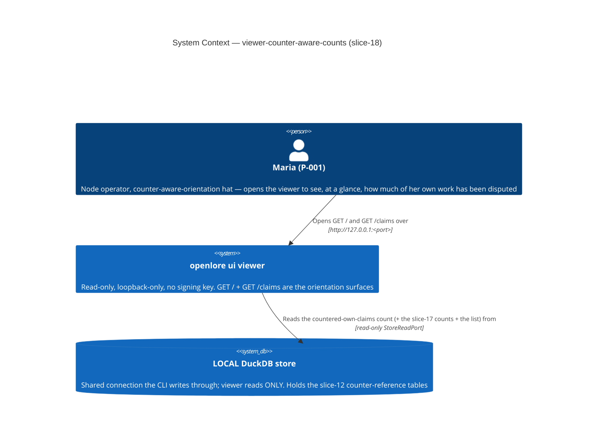
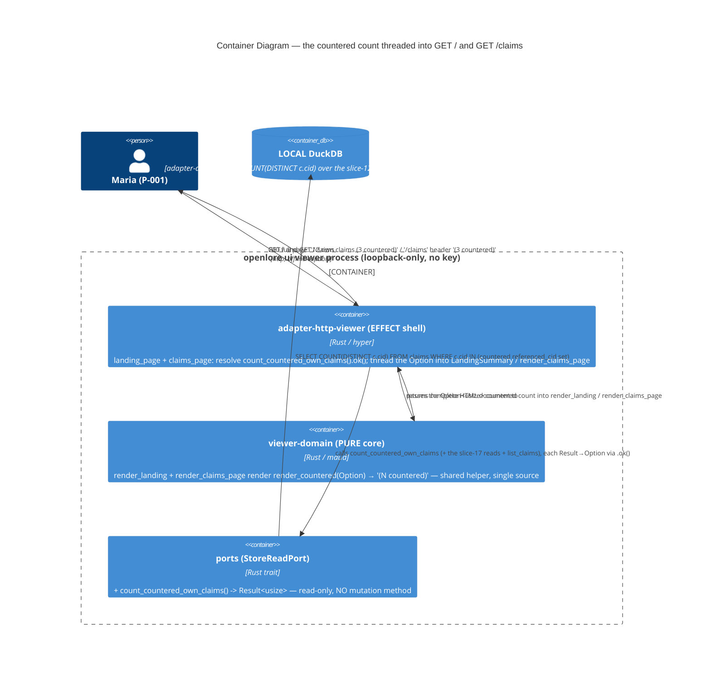

# Architecture Design: viewer-counter-aware-counts (slice-18)

> Wave: DESIGN (lean) · Owner: Morgan (nw-solution-architect) · 2026-06-09
> Input: APPROVED DISCUSS (DoR 9/9). ADR: **ADR-055**.
> Brownfield DELTA on slice-17 (`LandingSummary`, `render_count`, `MISSING_COUNT_MARKER`,
> `render_landing`, the per-count `.ok()` independent degrade, the count-only-read decision —
> ADR-054), slice-12 (`counter_presence_for` + the indexed `claim_references ∪
> peer_claim_references`, `ref_type='counters'` — ADR-048), and slice-06 (`render_claims_page`,
> the `/claims` list + header).
> Paradigm: functional Rust (ADR-007) — pure render core, effect shell at the I/O edge.

## 1. Problem and approach (one paragraph)

The slice-17 landing summary tells the operator HOW MUCH is in her store (own/peer/active-peer
counts) but not how much has been DISPUTED; the `/claims` header (slice-06) shows per-row
slice-12 flags but no at-a-glance total. slice-18 resolves ONE new count-only aggregate —
`count_countered_own_claims()` (the number of DISTINCT own-claim CIDs that appear as a countered
`referenced_cid` across `claim_references ∪ peer_claim_references`, `ref_type='counters'`) —
threads it as a FOURTH `Option<usize>` field on the slice-17 `LandingSummary` and as an
`Option<usize>` parameter to `render_claims_page`, each degrading INDEPENDENTLY via `.ok()`, and
renders "(N countered)" beside the own-claims count on `GET /` and in the `GET /claims` header
through a SHARED pure `render_countered` helper (single source — WD-CC-8). No new route, no new
crate (workspace stays 21), no mutation method, no network. Architecture stays the slice-06/17
Hexagonal + Modular Monolith (ADR-009): pure `viewer-domain` render, effect `adapter-http-viewer`
shell, read-only `StoreReadPort` over the shared DuckDB connection.

## 2. C4 — System Context (L1)

The surfaces make NO outbound network request (C-2): no PDS, no DID re-resolution, no peer pull,
no CDN. The only external dependency is the LOCAL store, read-only.

## 3. C4 — Container (L2)

### Threading + degrade flow (the US-CC-000 plumbing)

1. **Landing (`GET /`)**: `landing_page(store)` adds a FOURTH independent resolution —
   `countered_own_claims = store.count_countered_own_claims().ok()` — to the slice-17 three,
   builds the extended `LandingSummary { own_claims, peer_claims, active_peers,
   countered_own_claims }`, calls `render_landing(&summary)`, wraps in `html_ok` (200).
2. **`/claims` (`GET /claims`)**: `claims_page(store, query, shape)` resolves
   `countered = store.count_countered_own_claims().ok()` ALONGSIDE the existing
   `list_claims` page read, and passes it into `render_claims_page(&page_view, countered)` (full
   page) — the htmx fragment path is untouched (the header count is full-page chrome).
3. A failed countered read → `None` for THAT count only; on the landing the three slice-17 counts
   + the nav hub still render; on `/claims` the list rows still render. Never a 5xx, never a
   fabricated 0 (ADR-055 D2/D4 / C-2).
4. The pure `render_countered(Option<usize>)` helper renders "(n countered)" / "(— countered)" —
   the SAME fn on both surfaces (single source, WD-CC-8). The own-claims "12" + the list
   order/paging/confidence are UNCHANGED (additive, C-4 / WD-CC-9).

## 4. C4 — Component (L3)

NOT produced. The slice touches ≤5 components across three crates with no internal subsystem
decomposition: one new count read (`ports` + `adapter-duckdb`), one new pure helper
(`render_countered`) + two extended renders (`render_landing`, `render_claims_page`), and two
extended effect handlers (`landing_page`, `claims_page`). L1+L2 are sufficient (C4 mandatory
minimum; L3 reserved for 5+ internal components in a subsystem). This is a thin DELTA on the
slice-17 series.

## 5. Quality attributes (ISO 25010) addressed

| Attribute | Strategy | Where |
|---|---|---|
| Reliability (fault tolerance) | Per-count independent degrade via `.ok()`; a failed countered read → `None`, the sibling counts/rows + nav hub intact, never a 5xx (ADR-054 D2 extended) | shell D4 |
| Functional correctness | `0 ≠ missing` is type-level (`Option<usize>`); presence count via de-duped IN-set + `COUNT(DISTINCT)` (a claim countered N times counts once); own-only by query shape | D1, D2 |
| Performance efficiency | ONE additional aggregate read per surface (landing 3→4; `claims_page` +1), invariant to store size; count-only avoids materializing the own-cid list + presence set | D1, no-N+1 |
| Security (read-only, no key) | `StoreReadPort` declares no mutation method; loopback-only bind; no key in process; parameter-free injection-safe SQL | C-1, 3-layer enforcement |
| Maintainability | Shared `render_countered` helper (single source, single mutation site for the neutral copy); pure renders are total fns | D3 |
| Portability / offline | LOCAL DB read only; vendored htmx, no CDN; renders network-down | C-2 |

## 6. No new external integration

This slice introduces NO external API, third-party service, or network seam. No contract-test
annotation applies (the only dependency is the LOCAL read-only store, already covered by the
existing store-readability startup probe, ADR-028 — the probe's sentinel `count_claims` read is
unchanged). The handoff to DISTILL/DEVOPS carries no new external-integration risk.
