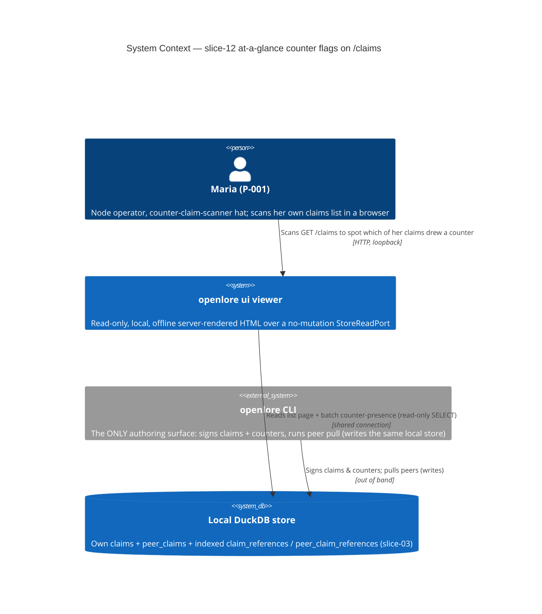
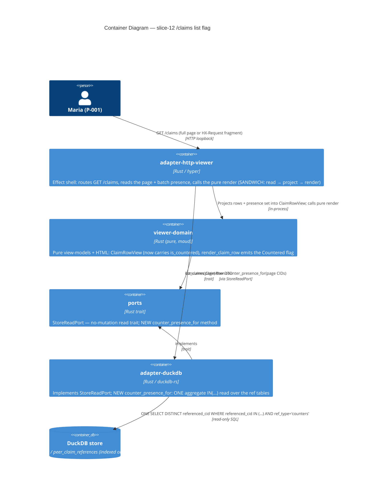

# Architecture Design — viewer-counter-claim-list-flags (slice-12)

> Wave: **DESIGN** · Architect: Morgan (nw-solution-architect) · Date: 2026-06-07
> Feature type: brownfield DELTA on the read-only `openlore ui` viewer (`GET /claims` list)
> Paradigm: functional (ADR-007) — pure `viewer-domain` core + effect shell at the I/O edge
> Scope (DISCUSS-resolved): `/claims` own-claims list ONLY. `/project`+`/philosophy`+`/score` deferred to recommended slice-13. `/peer-claims` OUT (see §8).
> Reuse-first: NO new crates. Workspace stays **21 members**. NO new route. NO new KPI ID.

## 1. System context and capabilities

slice-11 made disagreement LEGIBLE once a claim is opened (the counter-claim thread
beneath `GET /claims/{cid}`). slice-12 makes it DISCOVERABLE while SCANNING: a neutral
"Countered" presence flag on each `/claims` list row whose claim has ≥1 counter, linking
to that claim's slice-11 thread. The operator (P-001 "Maria", counter-claim-scanner hat)
triages WHICH contested claim to open without blind-opening every claim.

The slice adds exactly ONE new read capability — a read-only **batch per-CID
counter-presence lookup** (`counter_presence_for(&[cid])`) — and one pure per-row render
marker. Everything else is REUSED: the slice-06 list route + `page = chrome + fragment`
render pattern, the slice-11 `COUNTERED_PRESENCE_FLAG` constant, the slice-03 counter
model (a counter is an ordinary signed claim with `references[].type == counters`,
ADR-015), and the indexed `claim_references ∪ peer_claim_references` ref tables.

### Capabilities delivered

| Capability | Component | New / Reused |
|---|---|---|
| Batch counter-presence read (one aggregate query over the page's CID set) | `StoreReadPort::counter_presence_for` (port) + `adapter-duckdb` impl | **NEW (read-only method)** |
| Per-row "Countered" flag projected from the presence set | `ClaimRowView.is_countered` + `render_claim_row` (`viewer-domain`) | **NEW field + render branch** |
| List route wiring (read page → presence read → pure render) | `claims_page` (`adapter-http-viewer`) | **EXTENDED (additive)** |
| List order / paging / count / confidence | `list_claims` + `PageView` + `render_confidence` | **UNCHANGED (byte-identical)** |
| Flag text (`"Countered"`) | `COUNTERED_PRESENCE_FLAG` (slice-11) | **REUSED verbatim** |
| Indexed ref tables | `claim_references` / `peer_claim_references` | **REUSED (slice-03)** |

## 2. C4 Level 1 — System Context

The viewer NEVER writes; authoring stays exclusively in the CLI (I-LF-1). No network seam
on this route — the flag renders fully offline (I-LF-5). Peer counters were already
signature-verified at `peer pull` time; the viewer re-verifies nothing.

## 3. C4 Level 2 — Container

C4 Level 3 is NOT warranted: this slice touches 4 existing crates with ≤5 changed units
total and introduces no new internal subsystem.

## 4. The load-bearing decision — the BATCH presence read (N+1 avoidance)

See **data-models.md §1** for the exact signature/SQL and **ADR-048** for the full
decision record. Architectural summary:

- **ONE aggregate query per list page**, regardless of page size (the N+1 guard, I-LF-8).
  The query is a `DISTINCT referenced_cid` over `claim_references ∪ peer_claim_references`
  filtered `WHERE referenced_cid IN (<bound placeholders>) AND ref_type = 'counters'`.
- **Reads the `_references` tables DIRECTLY — no JOIN to `claims`/`peer_claims`.** The
  flag carries no author and no content, so the presence read needs neither the claims
  tables nor a Step-B artifact read. This is the key divergence from slice-11's 2-step
  read: slice-12 is **Step-A only, widened from `= ?` to `IN (...)`, and projected to the
  bare target CID set** (no author/cid/reason). This also keeps the query OUT of the
  `no_cross_table_join_elides_author` rule's scope (the literal names `claim_references` /
  `peer_claim_references`, never the standalone `claims` / `peer_claims` words — §6).
- **Bound parameters, never string interpolation.** The variable-length `IN (...)` is a
  generated run of `?` placeholders (count == input length), bound via
  `duckdb::params_from_iter`. CIDs are NEVER concatenated into the SQL text (injection-
  safe; ADR-048 §Decision).
- **Empty input → empty set, zero queries.** An empty CID slice short-circuits to an
  empty `HashSet` WITHOUT preparing a statement (an empty `IN ()` is both a SQL error and
  pointless). This is the degenerate guard the first-page-empty and all-un-countered
  paths rely on.
- **Read-only, LOCAL, offline.** SELECT only over the shared connection (BR-VIEW-4); no
  network, no mutation method on the trait (I-VIEW-1 carried).

## 5. Pure render + route wiring

**Pure render (`viewer-domain`)** — `ClaimRowView` gains `is_countered: bool`. The
existing `from_row` becomes `from_row_with_presence(row, &presence_set)` (or `from_row`
keeps a `false` default and the shell sets the bool) — DESIGN's recommendation in
component-boundaries.md §2 is a single projection constructor that takes the row + the
presence set so the pure render is a **total function of `(page, presence_set)`**.
`render_claim_row` emits, only when `is_countered`, a render-only
`<a href="/claims/{cid}">Countered</a>` using the REUSED `COUNTERED_PRESENCE_FLAG`
constant. An un-countered row renders byte-identically to slice-06 (no marker, no
"0 counters" noise). The flag is a marker BESIDE the existing cells; it NEVER re-orders,
filters, re-weights, or re-paginates (shown-never-applied, I-LF-2).

**Route wiring (`adapter-http-viewer::claims_page`)** — the SANDWICH (ADR-007) gains one
read between the existing read and the existing render:

1. `read_page = store.list_claims(request)` — UNCHANGED (order/paging/count/SQL untouched).
2. `presence = store.counter_presence_for(&read_page.rows.iter().map(|r| r.cid).collect())`
   — the NEW single batch read over exactly the page's CIDs (never the whole store).
3. project each `ClaimRow` + `presence` → `ClaimRowView` (sets `is_countered`).
4. `PageView::paged(...)` then `render_claims_*` — UNCHANGED shape fork (Fragment vs
   FullPage); the flag is in the SAME fragment fn both shapes embed, so parity is
   structural and free (I-LF-6).

A `counter_presence_for` read failure degrades to an empty presence set (no flags),
NEVER a 5xx — the list still renders (NFR-VIEW-6 carried). The slice-11 detail page is
untouched.

## 6. Invariants → enforcement map

| Invariant | Enforcement point | Layer |
|---|---|---|
| **N+1 guard** (exactly 1 presence query/page) | gold/acceptance test asserting query count invariant to page size (DISTILL/CRAFT); empty-slice short-circuit in the adapter | behavioral |
| **Shown-never-applied** (order/paging/count/confidence byte-identical) | `list_claims` SQL untouched; presence mapped by the PURE projection AFTER paging; gold byte-identity test (flagged vs un-flagged render of same store) | structural + behavioral |
| **No-invented-flags** (flag iff a real `ref_type='counters'` ref exists) | the presence read's `WHERE … ref_type='counters'`; set-membership projection `presence.contains(&cid)` | structural + behavioral |
| **Read-only** (no mutation in the viewer) | `StoreReadPort` has no mutation method (type system); `xtask check-arch::check_viewer_capability_boundary` (dep-graph); behavioral read-only gold (row-count universe unchanged) | type + arch + behavioral (3-layer) |
| **Anti-merging** (presence-only boolean, never "disputed by N") | return type is `HashSet<String>` (set membership, no count); `xtask check-arch::no_cross_table_join_elides_author` NOT tripped (ref-table-only literal) | type + arch |
| **LOCAL / offline** | SELECT over the shared local connection; no network dep reachable from `adapter-http-viewer` (`check_viewer_capability_boundary`) | arch |
| **Parity** (htmx fragment == no-JS full page) | the flag lives in `render_claim_row`, inside the single `render_claims_table_fragment` both shapes embed | structural |

## 7. Driving port (for the acceptance tests)

`GET /claims` is the single driving port. All three stories are exercised port-to-port
through it (no direct call to `counter_presence_for` or `viewer-domain` in the AC):

- US-LF-001 observable contract: the rendered flag SET + single-query invariant + empty-
  when-none + offline + read-only.
- US-LF-002: a seeded countered row shows the `<a href="/claims/{cid}">Countered</a>`
  marker; multi-counter → ONE marker; fragment/full-page parity.
- US-LF-003: un-countered row byte-identical to slice-06; order/paging/count/confidence
  byte-identical with and without the flag; mixed page flags only countered rows.

## 8. Edge cases (resolved)

| Edge case | Resolution |
|---|---|
| Claim countered by MULTIPLE authors | `DISTINCT referenced_cid` → ONE membership → ONE flag. Presence, not count (I-LF-3). |
| Own counter + peer counter on the same page | `UNION` (or `UNION ALL` + DISTINCT) across both ref tables in the one query; both CIDs in the set. |
| Pagination | `counter_presence_for` is called with ONLY the current page's CIDs (`read_page.rows`), never the whole store. |
| Empty page / all un-countered | Empty CID slice → empty set, zero queries; OR a populated slice with no matches → empty set, one query returning no rows. Either way: no flags. |
| **`/peer-claims` list** | **OUT of scope.** DISCUSS scoped slice-12 to the `/claims` OWN-claims list. `/peer-claims` (`list_peer_claims`) is NOT flagged this slice. Recommendation: defer alongside the slice-13 graph/score surfaces (it is the SAME presence read against a different row projection + a separate render site — the same multi-surface argument that carved out `/project`/`/philosophy`/`/score`). See ADR-048 §Consequences. |
| Store read failure on the presence read | Degrade to empty presence set (no flags), list still renders; never a 5xx. |

## 9. Quality attributes (ISO 25010)

- **Performance efficiency**: the N+1 guard is the load-bearing performance contract — one
  indexed (`idx_*_references_referenced`) aggregate read per page, bounded by page size 50.
- **Maintainability / testability**: pure `viewer-domain` render is a total function of
  `(page, presence_set)` — unit/property-testable with no I/O; the effect shell holds the
  one new read. Dependency-inversion preserved (the viewer depends on the `StoreReadPort`
  trait, not the adapter).
- **Reliability**: read-only by construction; offline; degrades to no-flags on read error.
- **Security (integrity)**: bound parameters (no SQL injection on the CID list); read-only
  trait (no mutation surface); no signing key in the viewer process.

## 10. Confirmations

- **No new crates.** Extends `ports`, `adapter-duckdb`, `viewer-domain`,
  `adapter-http-viewer` (+ no `cli` change needed — the adapter already wires the existing
  `DuckDbStoreReadAdapter`; the new trait method is implemented on the existing impl).
  **Workspace stays 21 members.**
- **No new route** (extends `GET /claims`). **No new KPI ID.**
- **xtask delta: NONE** (see §6 + component-boundaries.md §4). No new dep edge; the
  presence query does not trip `no_cross_table_join_elides_author` (ref-table-only literal,
  no `claims`/`peer_claims` word); the viewer capability boundary is unchanged.

## External integrations

NONE. This slice has no external API, third-party service, or network seam. No
contract-test annotation is required for the DEVOPS handoff.
