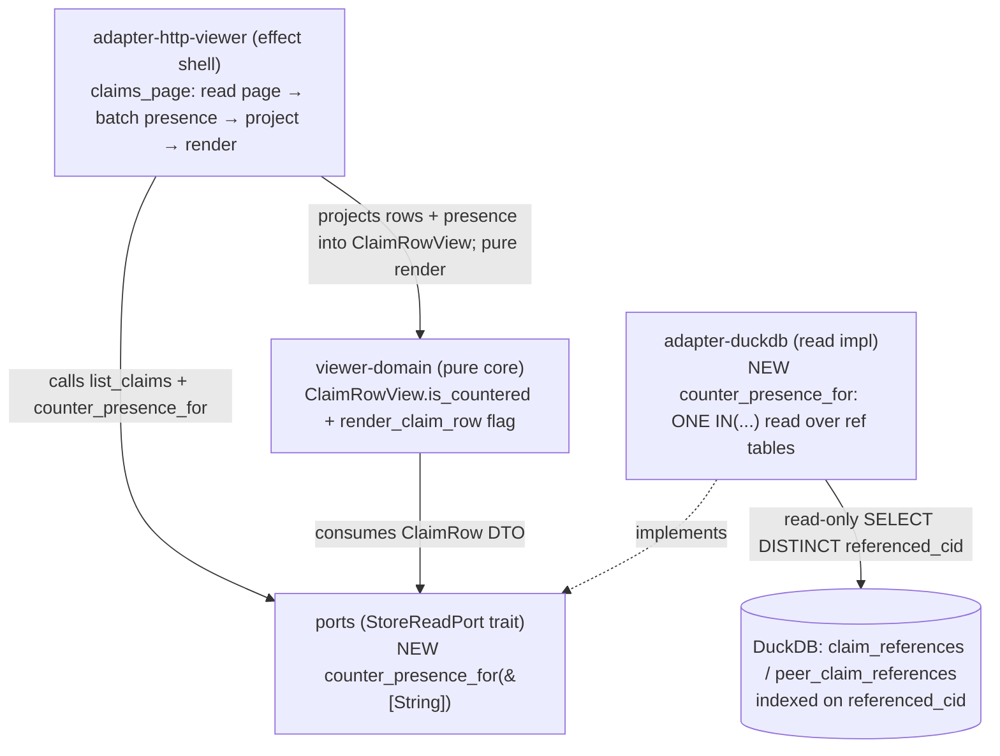

# Component Boundaries — viewer-counter-claim-list-flags (slice-12)

> Wave: DESIGN · Date: 2026-06-07 · Reuse-first, NO new crates, workspace stays 21.

The slice touches four EXISTING crates. Each change is additive. The dependency
direction is unchanged (dependencies point inward to `ports`; the pure `viewer-domain`
core depends only on `ports` + `maud`).



## 1. `ports` — `StoreReadPort` (the read contract)

**Change**: add ONE read-only method to the existing no-mutation trait.

```text
fn counter_presence_for(&self, target_cids: &[String])
    -> Result<HashSet<String>, StoreReadError>;
```

- **Responsibility**: answer "which of these page CIDs have ≥1 `ref_type='counters'`
  reference?" as a SET (presence membership), in ONE aggregate read.
- **Boundary**: read-only (the trait declares no mutation method — I-VIEW-1 carried). The
  return type is a SET, NOT a count or map — anti-merging by construction (I-LF-3): a
  membership boolean can never become a "disputed by N" verdict.
- **Collection decision**: `HashSet<String>` (O(1) `contains` for the per-row projection;
  order is irrelevant — the presence set never drives display order; see ADR-048 §Decision).
- **Does NOT**: read artifacts, touch the network, JOIN the claims tables, or compute a
  count. No reason text, no author — the flag carries none.

## 2. `viewer-domain` — pure render (the no-I/O core)

**Change**: one field on `ClaimRowView`; one branch in `render_claim_row`.

- `ClaimRowView` gains `pub is_countered: bool`. **Projection**: the effect shell sets it
  via a presence-aware constructor — recommended
  `ClaimRowView::from_row_with_presence(row: &ClaimRow, presence: &HashSet<String>) -> Self`
  computing `is_countered = presence.contains(&row.cid)`. (The existing `from_row` may be
  retained as `from_row_with_presence(row, &HashSet::new())` for slice-06 call sites /
  tests, OR deprecated in favor of the new constructor — CRAFT's call; the AC only fixes
  the rendered output.) Keeping the bool ON the view-model (not a parallel set passed to
  the renderer) makes the render a **total function of the `PageView<ClaimRowView>`** — no
  second argument, no risk of row/flag misalignment.
- `render_claim_row` emits, only when `row.is_countered`, the REUSED
  `COUNTERED_PRESENCE_FLAG` as a render-only `<a href="/claims/{cid}">Countered</a>` (a
  new `td`/inline marker beside the existing cells). An un-countered row renders exactly
  as slice-06 (no marker). This mirrors the slice-11 `render_presence_flag(thread)`
  pattern (presence-gated, reusing the same constant) — but here the gate is the row's
  bool, not a `CounterThread`.
- **Boundary**: PURE — no I/O, no network, no time. Total over `(page, presence)` once the
  bool is on the view-model. The flag NEVER re-orders/filters/re-weights (shown-never-
  applied, I-LF-2): the renderer iterates `page.rows` in the order the shell supplied
  (`composed_at DESC, cid` from `list_claims`), unchanged.
- **Dep boundary UNCHANGED**: `viewer-domain` keeps its allowed deps (`maud` + `ports` +
  the pure cores). `xtask check-arch` rule `viewer-domain MUST NOT depend on
  tokio/reqwest/duckdb/...` is unaffected (no new dep). Adding `std::collections::HashSet`
  to a signature is std-only.

## 3. `adapter-duckdb` — the batch read impl (the effect at the DB edge)

**Change**: implement `counter_presence_for` (see data-models.md §1 for the exact SQL).

- **Responsibility**: build the variable-length `IN (...)` placeholder run, bind the CIDs
  via `params_from_iter`, run ONE `SELECT DISTINCT referenced_cid` over
  `claim_references ∪ peer_claim_references` filtered on the bound list +
  `ref_type='counters'`, collect into a `HashSet<String>`.
- **Empty-input guard**: if `target_cids.is_empty()`, return `Ok(HashSet::new())` WITHOUT
  preparing a statement (an empty `IN ()` is a SQL error AND wasted work). This is a
  first-class boundary behavior, not an optimization.
- **Boundary**: read-only SELECT over the shared connection (BR-VIEW-4). Reads the
  `_references` tables ONLY — no JOIN to `claims`/`peer_claims`, no artifact read, no
  network. Mirrors the slice-11 Step-A indexed lookup, widened to a set and stripped to
  the bare CID.

## 4. `adapter-http-viewer` — the route wiring (the SANDWICH shell)

**Change**: `claims_page` adds ONE read + threads the presence set into the projection.

```text
let read_page = store.list_claims(request)?;                 // UNCHANGED
let cids: Vec<String> = read_page.rows.iter()
        .map(|r| r.cid.clone()).collect();                   // page CIDs only
let presence = store.counter_presence_for(&cids)
        .unwrap_or_default();                                // NEW; degrade → empty on err
let rows = read_page.rows.iter()
        .map(|r| ClaimRowView::from_row_with_presence(r, &presence))
        .collect();
PageView::paged(rows, page, DEFAULT_PAGE_SIZE, read_page.total)  // UNCHANGED shape
// → render_claims_page / render_claims_view_panel_fragment by Shape  // UNCHANGED fork
```

- **Boundary**: effect shell only — holds the two reads + the pure projection call. No
  business logic, no signing key, no write surface (`check_viewer_capability_boundary`
  unchanged). The shape fork (Fragment vs FullPage) is REUSED untouched.
- **Failure policy**: `counter_presence_for` error → `unwrap_or_default()` (empty set, no
  flags); the list still renders. Matches the existing `list_claims` error degradation to
  a guided empty page (NFR-VIEW-6). Never a 5xx for a presence-read failure.

## 5. `cli` (composition root) — NO change

The `cli` already wires the concrete `DuckDbStoreReadAdapter` as the
`Box<dyn StoreReadPort>` the viewer holds. The new trait method is implemented on that
SAME existing adapter — no new wiring, no new construction site, no new probe surface
(the existing read-only store probe at startup, ADR-030, covers the connection). **No
`cli` edit.**

## 6. `xtask` — NO change (delta: NONE)

- **No new dep edge**: every changed crate already depends on what it needs
  (`adapter-http-viewer → ports`/`viewer-domain`; `adapter-duckdb → ports`;
  `viewer-domain → ports`/`maud`). The dep graph is byte-identical.
- **`no_cross_table_join_elides_author` NOT tripped**: the rule fires on a SQL literal
  mentioning the standalone words `claims` AND `peer_claims` without `author_did`. The
  presence query names `claim_references` and `peer_claim_references` (the `_references`
  suffix means the word-boundary matcher does NOT see `claims`/`peer_claims`), so the rule
  is structurally out of scope — AND the query is presence-only (no attribution to elide).
- **Viewer capability boundary UNCHANGED**: `adapter-http-viewer` gains no new dep;
  `check_viewer_capability_boundary` (no signing/PDS/indexer dep; only `cli` links it)
  still holds.

**Capability rule unchanged. No new edge. xtask check-arch delta: NONE.**
