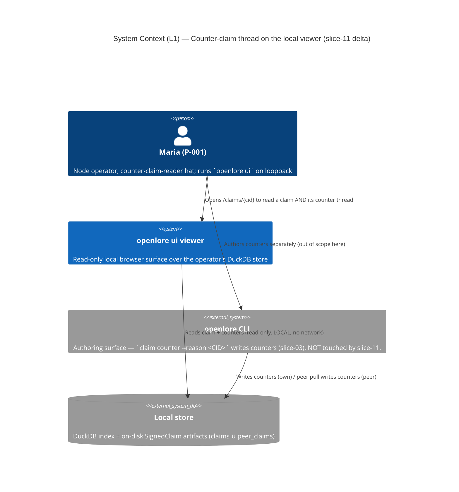
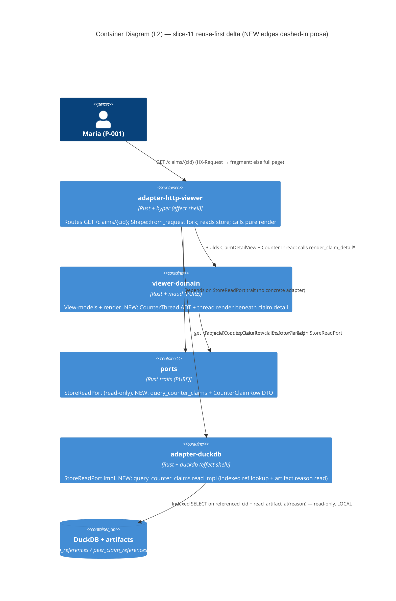

<!-- markdownlint-disable MD013 MD024 -->
# Architecture Design: viewer-counter-claim-threads (slice-11)

> Wave: **DESIGN** · Owner: Morgan (nw-solution-architect) · Date: 2026-06-06
> Feature type: brownfield DELTA on the read-only `GET /claims/{cid}` viewer surface
> Paradigm: **functional** (ADR-007) — pure view-model + render; effect shell at the read edge
> Style: unchanged — Hexagonal + Modular Monolith (ADR-009); single CLI composition root
> Source of truth: `discuss/feature-delta.md`, `discuss/user-stories.md`,
> `discuss/journey-counter-claim-thread.yaml`
> Architectural home: this section is the slice-11 `## Application Architecture` delta.

This design extends the existing `openlore ui` viewer with a **counter-claim thread**
beneath the claim on `GET /claims/{cid}`. It adds exactly ONE read-only port method
(`query_counter_claims`), ONE adapter read impl, ONE pure view-model ADT
(`CounterThread`), and extends the existing detail render. **No new crates; the
workspace stays at 21 members; no new route; no network on this route.**

---

## 1. THE KEY FEASIBILITY DECISION (Luna's flag, RESOLVED)

> **Luna's flag**: "verify HOW counter-claims are stored + queryable by target CID —
> is there a normalized references table or a column queryable by target CID, or is it
> blob-only?"

### Resolution: counters ARE queryable by target CID via a normalized, INDEXED table — NOT blob-only.

Evidence (read directly from the slice-01/03 schema + adapter):

| Concern | Finding | Source |
|---|---|---|
| Own-claim references | Normalized table `claim_references (referencing_cid, referenced_cid, ref_type)` with `ref_type IN ('retracts','corrects','counters','supersedes')` | `adapter-duckdb/src/schema.rs` (migration v1) |
| Own-claim index by target | `idx_claim_references_referenced ON claim_references (referenced_cid)` | `adapter-duckdb/src/schema.rs` |
| Peer-claim references | Normalized table `peer_claim_references` (same shape) | `adapter-duckdb/src/schema_v3.rs` (migration v3) |
| Peer-claim index by target | `idx_peer_claim_refs_referenced ON peer_claim_references (referenced_cid)` | `adapter-duckdb/src/schema_v3.rs` |
| Existing read precedent (own) | `DuckDbStorageAdapter::query_referencing(target_cid)` → `SELECT referencing_cid, ref_type FROM claim_references WHERE referenced_cid = ?` | `adapter-duckdb/src/lib.rs:444` |
| Existing read precedent (peer) | `DuckDbPeerStorageAdapter::query_peer_referencing(target_cid)` → JOIN `peer_claim_references` → `peer_claims`, returns `(author_did, referencing_cid, ref_type)` | `adapter-duckdb/src/peer_storage.rs:759` |

So the "who references this CID" query already exists and is the BACKWARD half of the
slice-08 "countered by" annotation. The reference graph is normalized and indexed in
**both** tables. **The feasibility risk is retired.**

### The ONE caveat that shapes the read: `reason` is NOT a column — it lives in the on-disk artifact.

The `reason` field is a **top-level OPTIONAL property** of the signed claim record
(ADR-015), stored only inside the on-disk `SignedClaim` JSON artifact
(`unsigned.reason`). It is NOT denormalized into any DB column. The DB stores the
artifact POINTER:

- own claims: `claims.artifact_path`
- peer claims: `peer_claims.signed_record_path`

The adapter already reads the artifact for byte-faithful claims via
`read_artifact_at(path)` (`adapter-duckdb/src/lib.rs:204`), used by
`query_federated_by_subject`.

### Specified read mechanism for `query_counter_claims(target_cid)` — a 2-step decode-and-filter

```
Step A (DB, indexed, anti-merging): find the counter CIDs + attribution + ordering
  SELECT author_did, cid, composed_at, artifact_path, source_table FROM (
    SELECT c.author_did, c.cid, c.composed_at,
           c.artifact_path                AS artifact_path,
           'Own'                          AS source_table
    FROM claims c
    JOIN claim_references r ON r.referencing_cid = c.cid
    WHERE r.referenced_cid = ? AND r.ref_type = 'counters'
    UNION ALL
    SELECT pc.author_did, pc.cid, pc.composed_at,
           pc.signed_record_path          AS artifact_path,
           'Peer'                         AS source_table
    FROM peer_claims pc
    JOIN peer_claim_references pr ON pr.referencing_cid = pc.cid
    WHERE pr.referenced_cid = ? AND pr.ref_type = 'counters'
  ) ORDER BY composed_at, source_table, cid

Step B (filesystem, per row): read each counter's reason from its artifact
  for each row: signed = read_artifact_at(artifact_path)
                reason  = signed.unsigned.reason   // Option<String>
```

Notes on the SQL shape (mirrors the established anti-merging discipline):

- **UNION ALL, explicit `author_did` + `cid`** — no merging JOIN/GROUP BY/AVG across
  the two stores. The JOINs are intra-store only (`claims`↔`claim_references`,
  `peer_claims`↔`peer_claim_references`), exactly the form
  `query_peer_referencing` already uses; they do not elide attribution, so they
  satisfy `xtask check-arch::no_cross_table_join_elides_author` (which forbids a
  CROSS-table own↔peer merging join, not an intra-store reference join).
- **`ref_type = 'counters'`** filters to counters only (retracts/corrects/supersedes
  are NOT counter-claims and are excluded).
- **`ORDER BY composed_at, source_table, cid`** — deterministic, total order
  (composed_at then a CID tiebreak), mirroring `query_survey`. The pure renderer does
  not re-sort.
- **Performance shape: depth-1, LOCAL, indexed.** One indexed lookup on
  `referenced_cid` per store (the partial-scan is bounded by the count of counters
  targeting ONE CID — typically 0–few), plus one artifact `fs::read` per counter.
  No recursion, no network, no full-table scan. This is the SAME per-row
  artifact-read pattern `query_federated_by_subject` already ships.

### Why read the artifact rather than denormalize `reason` into a column?

| Option | Verdict | Rationale |
|---|---|---|
| Add a `reason` column to `claims`/`peer_claims` (migration v4) | **REJECTED** | A schema migration is out of scope for a ~1-day reuse-first slice; it would also duplicate the artifact's authoritative `reason`, creating a drift surface. The artifact is already the source of truth (slice-01 `read_signed_claim` reads it, not the DB). |
| Read `reason` from the on-disk artifact via `read_artifact_at` | **CHOSEN** | Reuses the existing byte-faithful read path; no migration; `reason` stays single-sourced in the signed record. Cost: one `fs::read` per counter (depth-1, bounded). |
| Store counters as a serialized blob queryable only by full decode | **N/A** | The store is NOT blob-only — the reference graph is normalized + indexed (the premise of Luna's worst case does not hold). |

This decision is recorded in **ADR-046**.

---

## 2. C4 — System Context (L1)



The viewer NEVER writes; authoring stays in the CLI. The thread reads counters the
CLI (own) and `peer pull` (peer) already wrote.

---

## 3. C4 — Container (L2)



L3 (Component) is **not** produced: the change touches 4 existing crates with a single
new method/ADT each — well under the 5-component threshold for an L3.

---

## 4. Component responsibilities (the WHAT; HOW is the crafter's)

| Crate | Responsibility added | Boundary discipline |
|---|---|---|
| `ports` (pure) | Declare `StoreReadPort::query_counter_claims(target_cid) -> Result<Vec<CounterClaimRow>, StoreReadError>` + the `CounterClaimRow` DTO. NO mutation method added. | Read-only trait; no I/O dep. |
| `adapter-duckdb` (effect) | Implement `query_counter_claims` on `DuckDbStoreReadAdapter`: the indexed UNION-ALL ref lookup (Step A) + per-row `read_artifact_at` for `reason` (Step B). Returns `Ok(vec![])` for an un-countered CID. | Read-only SELECT over the shared connection (BR-VIEW-4); no write. |
| `viewer-domain` (pure) | `CounterThread` ADT (`None` \| `Countered { counters: Vec<CounterEntry> }`); `CounterEntry` view-model; extend `render_claim_detail_fragment` to render the "Countered" flag + thread beneath the existing fields + evidence. Reuse `render_confidence`, the `(you)` annotation, the `/claims/{cid}` link. | PURE: no I/O; total functions; renders verbatim. |
| `adapter-http-viewer` (effect) | In `claim_detail_page`, after `get_claim` succeeds, call `query_counter_claims(cid)`, project to `CounterThread`, pass to the (extended) render. Shape fork reused unchanged. | Read-only; no new route; no network. |
| `cli` (composition root) | No code change beyond wiring already in place — the concrete `DuckDbStoreReadAdapter` already satisfies the extended trait once the method is implemented. | Single composition root (ADR-009). |
| `xtask` | No new allowlist edge required (see §6). Existing viewer capability rule unchanged. | — |

---

## 5. Integration patterns + API contracts

- **Driving port (inbound)**: `GET /claims/{cid}` — the SAME route, extended. The
  acceptance suite drives port-to-port through this HTTP route (see §7).
- **Driven port (outbound)**: `StoreReadPort::query_counter_claims` — synchronous,
  read-only, LOCAL. No async, no network seam. Returns a `Vec<CounterClaimRow>`
  (empty when none).
- **No external integration**: this route adds NO network, NO third-party API, NO
  PDS/indexer call. Peer counters were signature-verified at `peer pull` time
  (KPI-FED-6); the viewer re-verifies nothing (mirrors slice-08). **Therefore: no
  contract-test annotation is needed for the platform-architect handoff** — there is
  no new external boundary in this slice.

---

## 6. xtask check-arch delta

**Delta: none required.** Analysis:

- `query_counter_claims` is a method on the EXISTING read-only `StoreReadPort` trait —
  no mutation method is added, so the read-only capability invariant is preserved by
  construction (the trait remains write-free).
- No new dependency edge: `adapter-duckdb` already depends on `duckdb`; `viewer-domain`
  already depends on `maud` + `ports`; `adapter-http-viewer` already depends on `ports`
  + `viewer-domain`. No crate gains a new neighbour.
- `check_viewer_capability_boundary` (`xtask/src/check_arch.rs:686`) still forbids the
  viewer adapter from reaching the signing identity (`adapter-atproto-did`), PDS-write
  (`adapter-atproto-pds`), or indexer server/store/ingest — UNCHANGED and still
  passing (slice-11 adds none of these).
- The anti-merging guard `no_cross_table_join_elides_author` is satisfied: the new SQL
  uses intra-store JOINs only (claim↔its-own-references) inside a UNION-ALL that
  projects `author_did` + `cid` explicitly across the own/peer stores — the same shape
  `query_peer_referencing` and `query_federated_by_subject` already pass.

> If, during DELIVER, the crafter chooses to add an explicit acceptance/arch assertion
> that `query_counter_claims` carries no mutation, that is additive and within the
> existing rule family — it requires NO change to the allowlist or the dep graph.

---

## 7. Driving-port mapping for acceptance tests (port-to-port)

| Story | Driving port (HTTP) | Observable outcome |
|---|---|---|
| US-CT-001 | `StoreReadPort::query_counter_claims(cid)` (read port; exercised directly + through the route) | one/two attributed `CounterClaimRow`s; empty vec on none; no mutation method on the trait |
| US-CT-002 | `GET /claims/{cid}` (full page + `HX-Request` fragment) | "Counter-claims" section with each counter's author DID + own CID (linked to `/claims/{counter_cid}`) + verbatim reason; original confidence unchanged; two counters = two items; empty-reason → "no reason provided"; offline render |
| US-CT-003 | `GET /claims/{cid}` (empty + non-empty + 404) | no section + no noise when empty; neutral "Countered" flag when non-empty; confidence unaltered; 404 path unchanged |

Acceptance harness reuses the slice-07 `HX-Request` seam (ADR-035) and the
shown-never-applied + anti-merging gold patterns (slice-08/10).

---

## 8. Quality attributes (ISO 25010) addressed

- **Functional suitability**: 100% of local counters for a CID surfaced, attributed,
  verbatim (US-CT-001/002 KPIs).
- **Security / accountability**: read-only (no key in viewer process); attribution
  never elided (author DID + CID per counter). Counter CID link is built from a stored
  CID; the existing slice-10 percent-encoding discipline (ADR-044) applies to the href.
- **Reliability / fault tolerance**: empty-reason counter → explicit "no reason
  provided" (never a crash); unknown CID → existing 404; purged-peer counters absent by
  construction; a missing/unreadable artifact degrades to the guided read error
  (NFR-VIEW-6), never a stack trace.
- **Maintainability / testability**: dependency-inversion preserved (pure core behind
  `StoreReadPort`); `CounterThread` is a total ADT (renderer is a total match);
  `render_confidence` stays single-site.
- **Performance**: depth-1, indexed, LOCAL; bounded artifact reads (one per counter).
  No N+1 across a list (the deferred list-row annotation, slice-12, is explicitly NOT
  in this slice precisely to avoid that shape).

---

## 9. Invariant → structural enforcement map

See `component-boundaries.md` §"Invariant enforcement" for the full table. Summary:

| Invariant | Structural enforcement point |
|---|---|
| I-CT-1 read-only | `query_counter_claims` on the no-mutation `StoreReadPort`; viewer capability rule; behavioral gold |
| I-CT-2 shown-never-applied | the countered claim is built from `get_claim` UNCHANGED; counters are a SEPARATE ADT rendered BELOW; renderer never feeds counters back into confidence/fields |
| I-CT-3 attribution without merging | UNION-ALL explicit `author_did` + `cid`; `CounterThread::Countered { Vec<CounterEntry> }` is per-counter; no aggregate variant exists in the ADT |
| I-CT-4 verbatim confidence | the original claim's confidence flows through the single `render_confidence` site; counters carry no re-score |
| I-CT-5 LOCAL/offline | read over the shared connection + local artifacts only; no network seam on the method; only vendored `/static/htmx.min.js` |
| I-CT-6 parity | the thread is rendered INSIDE `render_claim_detail_fragment`, which the full page embeds (structural parity by construction) |
| I-CT-7 no new crates | 21 members unchanged (verified §10) |

---

## 10. No new crates / 21 members (confirmed)

The workspace `members` list (`Cargo.toml`) is unchanged. All five touched crates
(`ports`, `adapter-duckdb`, `viewer-domain`, `adapter-http-viewer`, `cli`) and `xtask`
already exist. **Workspace stays at 21 members.** Functional paradigm (ADR-007)
preserved: pure view-model + render in `viewer-domain`; effect shell at the read edge
in `adapter-duckdb` / `adapter-http-viewer`.

---

## ADRs produced

- **ADR-046** — Counter-claim thread read: indexed reference lookup + on-disk reason
  decode (resolves Luna's feasibility flag).
- **ADR-047** — `CounterThread` ADT + depth-1 (no recursion) thread render with the
  empty-reason "no reason provided" display.
