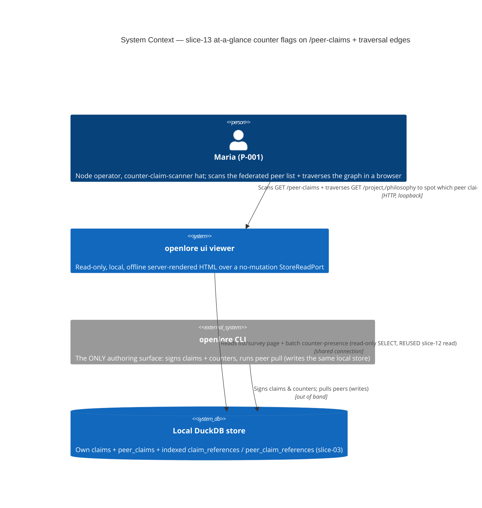
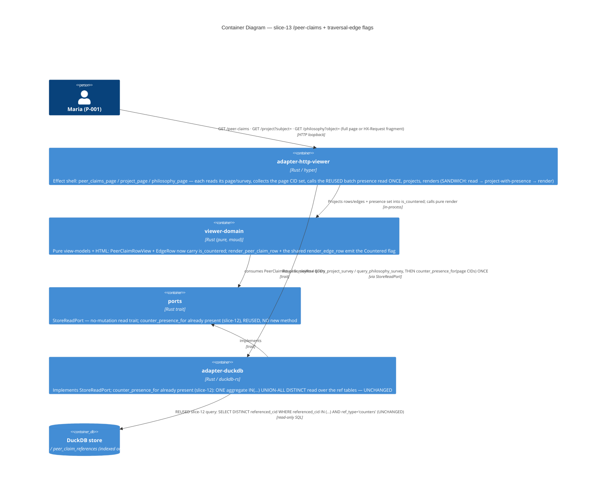

# Architecture Design — viewer-counter-flags-graph-surfaces (slice-13)

> Wave: **DESIGN** · Architect: Morgan (nw-solution-architect) · Date: 2026-06-07
> Feature type: brownfield DELTA on the read-only `openlore ui` viewer
> (`GET /peer-claims` + `GET /project` + `GET /philosophy` edge rows)
> Paradigm: functional (ADR-007) — pure `viewer-domain` core + effect shell at the I/O edge
> Scope (DISCUSS-resolved, Option B): `/peer-claims` rows + `/project`+`/philosophy` EDGE
> rows ONLY. **`/score` is DEFERRED to recommended slice-14** (a different ADT + the
> weight-misread risk — see §8). Honor: do NOT design `/score` flagging here.
> Reuse-first: **NO new crates. Workspace stays 21 members. NO new read method. NO new
> route. NO new KPI ID. NO new SQL.**

## 1. System context and capabilities

slice-11 made disagreement LEGIBLE once a claim is opened (the counter-claim thread
beneath `GET /claims/{cid}`). slice-12 made it DISCOVERABLE while scanning the operator's
OWN claims list (`GET /claims`) via a neutral "Countered" presence flag. slice-13 extends
that SAME flag to the OTHER two LOCAL surfaces the operator (P-001 "Maria",
counter-claim-scanner hat) scans: the FEDERATED `/peer-claims` list and the
GRAPH-TRAVERSAL `/project` + `/philosophy` edge surveys — so disagreement is discoverable
wherever she scans, not only on her own-claims list.

The slice adds **ZERO new read capability**. It REUSES the slice-12 batch counter-presence
read (`StoreReadPort::counter_presence_for(&[String]) -> HashSet<String>`, ADR-048)
VERBATIM, wired into three more handlers, and the slice-11/12 `COUNTERED_PRESENCE_FLAG`
neutral marker. The only new code is two `is_countered: bool` view-model fields (mirroring
slice-12's `ClaimRowView.is_countered`) and a render-only marker arm on the peer-claim row
+ the shared edge row.

### Capabilities delivered

| Capability | Component | New / Reused |
|---|---|---|
| Batch counter-presence read (one aggregate query over the page's CID set) | `StoreReadPort::counter_presence_for` (port) + `adapter-duckdb` impl | **REUSED VERBATIM (slice-12 / ADR-048) — NO new method** |
| Per-row "Countered" flag on `/peer-claims`, projected from the presence set | `PeerClaimRowView.is_countered` + `render_peer_claim_row` (`viewer-domain`) | **NEW field + render branch** |
| Per-edge "Countered" flag on `/project`+`/philosophy`, projected from the presence set | `EdgeRow.is_countered` + `render_edge_row` (`viewer-domain`) | **NEW field + render branch (ONE arm, BOTH routes)** |
| `/peer-claims` order / paging / count / confidence / origin | `list_peer_claims` + `PageView` + `render_peer_origin` + `render_confidence` | **UNCHANGED (byte-identical to slice-06)** |
| `/project`+`/philosophy` grouping / edge order / contributor list / bucket / confidence | `query_project_survey`/`query_philosophy_survey` + `group_by` + `render_edge_group`/`render_contributors`/`render_confidence_bucket` | **UNCHANGED (byte-identical to slice-10)** |
| Flag text (`"Countered"`) | `COUNTERED_PRESENCE_FLAG` (slice-11) | **REUSED verbatim** |
| `<a href="/claims/{cid}">` one-hop link shape | `render_list_presence_flag` pattern (slice-12) | **MIRRORED (same flag string + href shape)** |
| Indexed ref tables | `claim_references` / `peer_claim_references` | **REUSED (slice-03)** |

## 2. C4 Level 1 — System Context

The viewer NEVER writes; authoring stays exclusively in the CLI (I-CF-1). No network seam
on any of these three routes — every flag renders fully offline (I-CF-5). Peer counters
were already signature-verified at `peer pull` time; the viewer re-verifies nothing.

## 3. C4 Level 2 — Container

C4 Level 3 is NOT warranted: this slice touches 2 existing crates with ≤5 changed units
total (two view-model fields, two render arms, three handler wirings) and introduces no
new internal subsystem.

## 4. The load-bearing decision — REUSE the slice-12 batch presence read (N+1 avoidance)

The defining property of slice-13: it adds **NO new read method and NO new SQL**. Each of
the three handlers REUSES the slice-12 `counter_presence_for(&[cid])` (ADR-048) exactly as
`claims_page` does. See **ADR-049** for the reuse-confirmation decision record and
**data-models.md §1** for the (unchanged) query shape.

- **ONE aggregate query per render**, on EVERY one of the three surfaces, regardless of
  page / edge / group count (the N+1 guard, I-CF-8). The query is the slice-12
  `DISTINCT referenced_cid IN (<bound placeholders>) AND ref_type='counters'` over
  `claim_references ∪ peer_claim_references` — UNCHANGED.
- **The edge surfaces flatten ALL edge CIDs across EVERY `EdgeGroup` into ONE call.** This
  is the slice-specific N+1 risk (a naive impl could call per-group or per-edge). The
  effect shell collects the UNION of `EdgeRow.cid` across all groups on the page into one
  `Vec<String>`, calls `counter_presence_for` ONCE, then projects. This is the load-bearing
  divergence from the flat `/peer-claims` case and the explicit subject of ADR-050.
- **Empty / all-un-countered page → empty set, zero queries.** The slice-12 read
  short-circuits an empty input slice to `Ok(HashSet::new())` WITHOUT preparing a
  statement. A `/peer-claims` page with no rows, or a traversal `NoClaims` view (zero
  edges), passes an empty slice → no query, no flags.
- **Read-only, LOCAL, offline.** SELECT only over the shared connection (BR-VIEW-4); no
  network, no mutation method on the trait (I-CF-1 carried). The query is REUSED, so its
  injection-safety (bound `params_from_iter`, never interpolation) carries verbatim.

## 5. Pure projections + route wiring

### 5.1 `/peer-claims` (US-CF-002) — mirrors slice-12 exactly

**Pure projection (`viewer-domain`)** — `PeerClaimRowView` gains `is_countered: bool`. A
new presence-aware constructor `from_row_with_presence(row, &presence)` sets
`is_countered = presence.contains(&row.cid)` (mirroring `ClaimRowView::from_row_with_presence`);
the existing `from_row` delegates with an empty set (slice-06 call sites / tests keep
compiling — the exact slice-12 pattern, `viewer-domain/src/lib.rs:67`). `render_peer_claim_row`
gains, only when `is_countered`, the REUSED `COUNTERED_PRESENCE_FLAG` as a render-only
`<a href="/claims/{cid}">Countered</a>` cell beside the existing cells. An un-countered row
renders byte-identically to slice-06 (no marker, no "0 counters" noise). The flag NEVER
re-orders / re-pages / re-counts / re-weights — additive only (I-CF-2 / I-CF-4).

**Route wiring (`adapter-http-viewer::peer_claims_page`)** — the SANDWICH (ADR-007) gains
one REUSED read between the existing read and the existing render, structurally identical
to slice-12's `claims_page`:

1. `read_page = store.list_peer_claims(request)` — UNCHANGED (order/paging/count/SQL untouched).
2. `cids = read_page.rows.iter().map(|r| r.cid.clone()).collect()` — page CIDs only.
3. `presence = store.counter_presence_for(&cids).unwrap_or_default()` — the REUSED batch read.
4. project each `PeerClaimRow` + `presence` → `PeerClaimRowView::from_row_with_presence`.
5. `PageView::paged(...)` then `render_peer_claims_*` by `Shape` — UNCHANGED shape fork; the
   flag is in the SAME fragment fn both shapes embed → parity is structural and free (I-CF-6).

### 5.2 `/project` + `/philosophy` edges (US-CF-003) — ONE shared render arm

**Pure projection (`viewer-domain`)** — `EdgeRow` gains `is_countered: bool`. The
`group_by` engine (`viewer-domain/src/lib.rs:2116`) is widened to thread a presence set
through, so each constructed `EdgeRow` sets `is_countered = presence.contains(&row.cid)`.
DESIGN's recommendation (component-boundaries.md §2): pass the presence set as a parameter
into `group_project` / `group_philosophy` / `group_by` so the edge carries the bool at
construction and the render stays a **total function of the `TraversalView`** (no second
argument to the renderer, no row/flag misalignment). The grouping algorithm itself —
group order, edge order, contributor dedup — is UNCHANGED; only the per-edge bool is added.

`render_edge_row` (`viewer-domain/src/lib.rs:2341`) gains, only when `edge.is_countered`,
the REUSED `COUNTERED_PRESENCE_FLAG` as a render-only `<a href="/claims/{cid}">Countered</a>`
cell beside the existing author/confidence/bucket/cid cells. Because BOTH
`render_project_fragment` and `render_philosophy_fragment` funnel through the SAME
`render_edge_group` → `render_edge_row`, this is **ONE render arm covering BOTH routes**
(US-CF-003 AC). An un-countered edge renders byte-identically to slice-10.

**Route wiring (`adapter-http-viewer::project_page` / `philosophy_page`)** — both resolve a
`TraversalView`, then render by `Shape`. The presence read is injected in the resolve step:

1. `rows = store.query_project_survey(&subject)?` (or `query_philosophy_survey(&object)?`)
   — UNCHANGED survey read (order/SQL untouched).
2. `cids = rows.iter().map(|r| r.cid.clone()).collect()` — ALL edge CIDs across the whole
   survey, flattened ONCE (the survey rows are the pre-grouping flat edge list — this is
   the natural flatten point, BEFORE `group_by` nests them; collecting here guarantees ONE
   call covering every group, never per-group).
3. `presence = store.counter_presence_for(&cids).unwrap_or_default()` — the REUSED batch read, ONCE.
4. `view = group_project(&subject, &rows, &presence)` — the widened pure grouper sets each
   `EdgeRow.is_countered`.
5. render by `Shape` — UNCHANGED fork; the flag is in the shared `render_edge_row` both
   shapes embed → parity structural (I-CF-6).

> Collecting the CID set from the FLAT `rows` slice (step 2, before grouping) is the
> cleanest flatten: `rows` is already the union of every edge across every future group, so
> one `map` over it is provably "all edge CIDs, once." See ADR-050.

A `counter_presence_for` read failure degrades to an empty presence set (no flags) via
`unwrap_or_default()`, NEVER a 5xx — the list/survey still renders (NFR-VIEW-6 carried).
slice-11 detail page, slice-12 `/claims`, slice-08 `/search` are all untouched.

## 6. Invariants → enforcement map

| Invariant | Enforcement point | Layer |
|---|---|---|
| **N+1 guard** (exactly 1 presence query per render on ALL THREE surfaces; edge surfaces flatten across groups) | gold/acceptance test asserting query count invariant to page/edge/group size (DISTILL/CRAFT); flatten from the FLAT `rows` slice (§5.2 step 2) BEFORE grouping; empty-slice short-circuit in the REUSED adapter read (slice-12 ADR-048 property test) | behavioral |
| **Shown-never-applied** (`/peer-claims` order/paging/count/confidence/origin byte-identical to slice-06; `/project`+`/philosophy` grouping/edge-order/group-order/contributor-list byte-identical to slice-10) | `list_peer_claims` / `query_*_survey` SQL untouched; `group_by` ordering untouched (only the per-edge bool added); presence mapped by the PURE projection; gold byte-identity test (flagged-vs-marker-elided render of same store) | structural + behavioral |
| **No-invented-flags** (flag iff a real `ref_type='counters'` ref exists for that cid) | the REUSED read's `WHERE … ref_type='counters'`; set-membership projection `presence.contains(&cid)` | structural + behavioral |
| **Presence-only, no merged / no count** (boolean per row/edge, never "disputed by N") | return type is `HashSet<String>` (set membership, no count); `is_countered: bool` (one marker per countered cid via DISTINCT) | type + behavioral |
| **Read-only** (no mutation in the viewer) | `StoreReadPort` has no mutation method (type system); `xtask check-arch::check_viewer_capability_boundary` (dep-graph, UNCHANGED); behavioral read-only gold (row-count universe unchanged) | type + arch + behavioral (3-layer) |
| **No re-grouping / no re-ordering of the survey** (I-CF-9) | the presence set is injected INTO `group_by` AFTER `key_of` grouping decisions; the bool is orthogonal to group/edge/contributor ordering (which depend only on `rows` order + `key_of`); gold byte-identity with markers elided | structural + behavioral |
| **LOCAL / offline** | SELECT over the shared local connection; no network dep reachable from `adapter-http-viewer` (`check_viewer_capability_boundary`, UNCHANGED) | arch |
| **Parity** (htmx fragment == no-JS full page on all three routes) | the flag lives in `render_peer_claim_row` / `render_edge_row`, inside the single fragment fns (`render_peer_claims_view_panel_fragment` / `render_project_fragment` / `render_philosophy_fragment`) both shapes embed | structural |
| **Anti-merging on the graph** (KPI-GRAPH-2/4: never collapse/re-weight an edge) | the flag is a neutral annotation BESIDE the verbatim edge; `EdgeRow` still one-per-claim; `no_cross_table_join_elides_author` NOT tripped (REUSED ref-table-only query, no `claims`/`peer_claims` literal) | type + arch |

## 7. Driving ports (for the acceptance tests)

Three driving ports, each exercised port-to-port through the real `openlore ui` subprocess
(no direct call to `counter_presence_for` or `viewer-domain` in the AC):

- `GET /peer-claims` — US-CF-002: a seeded countered peer row shows the
  `<a href="/claims/{cid}">Countered</a>` marker; multi-counter → ONE marker; peer origin +
  confidence + CID verbatim beside it; fragment/full-page parity; un-countered row
  byte-identical to slice-06.
- `GET /project?subject=<uri>` — US-CF-003: a seeded countered edge in a group shows the
  marker in its UNCHANGED group + position; grouping/edge-order/contributor-list
  byte-identical to slice-10 with markers elided; ONE-query-per-render (flattened across
  groups); fragment/full-page parity.
- `GET /philosophy?object=<uri>` — US-CF-003 (the SYMMETRIC mirror, SAME render arm): flags
  only countered edges across groups; byte-identity; parity.

US-CF-001 (the wiring) is observable THROUGH the above: the single-query-per-render +
flatten-across-groups + empty→no-query invariants are asserted via the real subprocess +
the inherited slice-12 adapter property.

## 8. `/score` — explicitly DEFERRED to slice-14 (NOT designed here)

Per the DISCUSS scope fork (Option B, confirmed by the user), `/score`
(`ScoreState::Scored{WeightedView}` contribution rows) is OUT of slice-13. It projects a
structurally-different ADT (the slice-04 `WeightedView` / per-claim `Contribution`), and a
presence flag BESIDE a weight carries a genuine "does being countered lower this weight?"
misread risk that needs its own anti-misread copy AND the slice-09 CARDINAL sum-to-weight
guarantee re-asserted as an explicit AC. It is recommended for slice-14
(`viewer-counter-flags-score-surface`). **This DESIGN does not touch
`render_score_results_fragment`, `ScoreState`, or `Contribution`.**

## 9. Edge cases (resolved)

| Edge case | Resolution |
|---|---|
| A peer claim countered by ANOTHER peer | The REUSED read's `peer_claim_references` arm catches it; the peer row is flagged. Correct — the disagreement is real and local (J-003c boundary: a purged peer's counters vanish from the read by construction). |
| An edge whose claim is countered | `EdgeRow.cid ∈ presence` → the edge is flagged in its unchanged group/position. |
| Empty page / no counters → empty set → no flags | Empty CID slice (no rows / `NoClaims` view) → empty set, zero queries; OR populated slice with no matches → empty set, one query returning nothing. Either way: no flags. |
| A survey edge that is an OWN claim vs a peer claim | BOTH are flaggable by cid — the REUSED UNION-ALL read covers `claim_references` (own) ∪ `peer_claim_references` (peer); the projection keys on the bare cid regardless of source table. |
| Pagination on `/peer-claims` | `counter_presence_for` is called with ONLY the current page's CIDs (`read_page.rows`), never the whole store — exactly as slice-12. |
| A row/edge countered by N authors | `DISTINCT referenced_cid` (REUSED) → ONE membership → ONE flag. Presence, not count (I-CF-3). |
| Store read failure on the presence read | Degrade to empty presence set (`unwrap_or_default`) → no flags; list/survey still renders; never a 5xx. |
| `/peer-claims` row with `PeerOrigin::Unknown` | The origin cell renders the "unknown" label UNCHANGED; the flag is independent of origin and renders iff `is_countered`. |

## 10. Quality attributes (ISO 25010)

- **Performance efficiency**: the N+1 guard is the load-bearing contract — ONE indexed
  (`idx_*_references_referenced`) aggregate read per render on each surface, bounded by page
  size (peer list) / survey edge count (traversal). The edge-CID flatten makes the edge
  surfaces a single read regardless of group count.
- **Maintainability / testability**: the pure `viewer-domain` projections + renders are
  total functions of `(rows, presence)` — unit/property-testable with no I/O; the effect
  shell holds the one REUSED read. The shared `render_edge_row` means `/project` and
  `/philosophy` cannot drift. Dependency-inversion preserved (the viewer depends on the
  `StoreReadPort` trait, not the adapter).
- **Reliability**: read-only by construction; offline; degrades to no-flags on read error.
- **Security (integrity)**: the REUSED read is bound-parameterized (no SQL injection on the
  CID list); read-only trait (no mutation surface); no signing key in the viewer process.

## 11. Confirmations

- **No new crates.** Extends `viewer-domain` (two fields + two render arms + widened
  grouper) and `adapter-http-viewer` (three handler wirings). `ports` + `adapter-duckdb`
  UNCHANGED (the read is REUSED). `cli` UNCHANGED (the existing adapter already implements
  the existing method). **Workspace stays 21 members.**
- **No new read method** — `counter_presence_for` REUSED VERBATIM (ports/store_read.rs:380).
  **No new SQL.** **No new route** (extends three existing GETs). **No new KPI ID.**
- **xtask delta: NONE** (see §6 + component-boundaries.md §6). No new dep edge; the REUSED
  presence query does not trip `no_cross_table_join_elides_author` (ref-table-only literal);
  the viewer capability boundary is unchanged. **Capability rule unchanged.**

## External integrations

NONE. This slice has no external API, third-party service, or network seam. No
contract-test annotation is required for the DEVOPS handoff.
