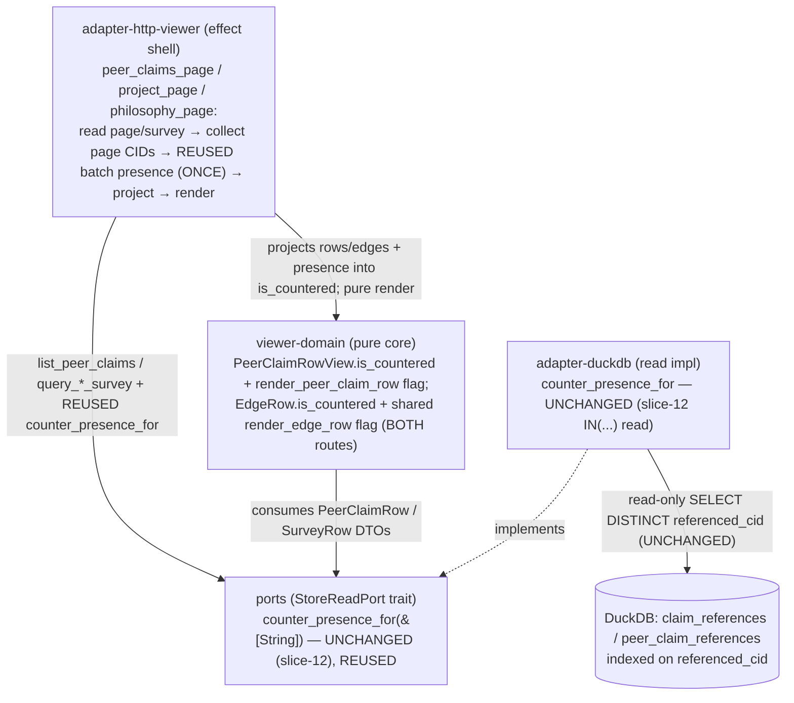

# Component Boundaries — viewer-counter-flags-graph-surfaces (slice-13)

> Wave: DESIGN · Date: 2026-06-07 · Reuse-first, NO new crates, workspace stays 21,
> NO new read method.

The slice touches TWO existing crates (`viewer-domain` pure, `adapter-http-viewer`
effect). `ports` + `adapter-duckdb` are UNCHANGED — the `counter_presence_for` read is
REUSED verbatim from slice-12. Every change is additive. The dependency direction is
unchanged (dependencies point inward to `ports`; the pure `viewer-domain` core depends
only on `ports` + `maud`).



## 1. `ports` — `StoreReadPort` — NO change

`counter_presence_for(&self, cids: &[String]) -> Result<HashSet<String>, StoreReadError>`
already exists (`crates/ports/src/store_read.rs:380`, slice-12 / ADR-048) and is the EXACT
shape every slice-13 surface needs (presence-only set membership over a page's CID set).
**NO new method. NO signature change.** The trait stays read-only (no mutation method —
I-CF-1 carried).

## 2. `viewer-domain` — pure projections + renders (the no-I/O core)

**Change A — `PeerClaimRowView` (US-CF-002)**: add `pub is_countered: bool`, mirroring
`ClaimRowView`.

- **Projection**: add `PeerClaimRowView::from_row_with_presence(row: &PeerClaimRow,
  presence: &HashSet<String>) -> Self` computing `is_countered = presence.contains(&row.cid)`.
  Retain the existing `from_row` as `from_row_with_presence(row, &HashSet::new())` so
  slice-06/07 call sites + tests keep compiling — the EXACT slice-12 pattern
  (`viewer-domain/src/lib.rs:67-69`).
- **Render**: `render_peer_claim_row` (`viewer-domain/src/lib.rs:1059`) emits, only when
  `row.is_countered`, the REUSED `COUNTERED_PRESENCE_FLAG` as a render-only
  `<a href="/claims/{cid}">Countered</a>` cell beside the existing
  subject/predicate/object/confidence/origin/cid cells. An un-countered row renders exactly
  as slice-06. Mirrors `render_list_presence_flag` (`viewer-domain/src/lib.rs:479`) — same
  constant, same href shape, single source of truth for the flag string.

**Change B — `EdgeRow` (US-CF-003)**: add `pub is_countered: bool`.

- **Projection**: widen the grouper to thread a presence set. Recommended signature:
  `group_project(entity, rows, presence: &HashSet<String>)` /
  `group_philosophy(entity, rows, presence)` / `group_by(entity, rows, key_of, presence)`.
  Inside `group_by` (`viewer-domain/src/lib.rs:2139`), the `EdgeRow` is built with
  `is_countered: presence.contains(&row.cid)`. The grouping algorithm — `key_order`, the
  per-key edge accumulation, the `contributors` dedup — is UNCHANGED; the bool is an extra
  field on the constructed `EdgeRow`, orthogonal to all ordering. Keeping the bool ON the
  edge (not a parallel set passed to the renderer) makes the render a **total function of
  the `TraversalView`** — no second argument, no edge/flag misalignment.
  > Alternative (CRAFT's call): a post-pass that walks the built `TraversalView` and sets
  > each edge's bool. The PRODUCT contract is the AC; DESIGN recommends the in-grouper form
  > because it keeps the `EdgeRow` immutable-once-built and the render argument-free.
- **Render**: `render_edge_row` (`viewer-domain/src/lib.rs:2341`) emits, only when
  `edge.is_countered`, the REUSED `COUNTERED_PRESENCE_FLAG` as a render-only
  `<a href="/claims/{cid}">Countered</a>` cell beside the existing
  contributor/confidence/bucket/cid cells. **ONE arm — both `render_project_fragment` and
  `render_philosophy_fragment` funnel through `render_edge_group` → `render_edge_row`
  (`viewer-domain/src/lib.rs:2287, 2327`), so the change covers BOTH routes** (US-CF-003 AC).
  An un-countered edge renders exactly as slice-10.

**Boundary (both changes)**: PURE — no I/O, no network, no time. Total over `(rows,
presence)`. The flags NEVER re-order/filter/re-weight/re-group (shown-never-applied,
I-CF-2/I-CF-9): the renderers iterate in the order the grouper/pager supplied, unchanged.
`viewer-domain` keeps its allowed deps (`maud` + `ports` + pure cores) — adding a
`HashSet` parameter is std-only, no new dep. The `xtask` rule `viewer-domain MUST NOT
depend on tokio/reqwest/duckdb` is unaffected.

## 3. `adapter-duckdb` — the batch read impl — NO change

`counter_presence_for` is implemented on the existing `DuckDbStoreReadAdapter` (slice-12).
slice-13 calls it from three more handlers; the impl, its SQL, its empty-input
short-circuit, and its N+1 property test are all UNCHANGED. **No edit.**

## 4. `adapter-http-viewer` — the route wirings (the SANDWICH shells)

**`peer_claims_page` (`crates/adapter-http-viewer/src/lib.rs:638`)** — add ONE REUSED read,
structurally identical to slice-12's `claims_page`:

```text
let read_page = store.list_peer_claims(request)?;            // UNCHANGED
let cids: Vec<String> = read_page.rows.iter()
        .map(|r| r.cid.clone()).collect();                   // page CIDs only
let presence = store.counter_presence_for(&cids)
        .unwrap_or_default();                                // REUSED; degrade → empty on err
let rows = read_page.rows.iter()
        .map(|r| PeerClaimRowView::from_row_with_presence(r, &presence))
        .collect();
PageView::paged(rows, page, DEFAULT_PAGE_SIZE, read_page.total)  // UNCHANGED shape
// → render_peer_claims_view_panel_fragment / render_peer_claims_page by Shape  // UNCHANGED fork
```

**`project_page` / `philosophy_page` (`crates/adapter-http-viewer/src/lib.rs:543, 592`)** —
inject the REUSED read in the resolve step, flattening ALL edge CIDs from the FLAT survey
`rows` slice (BEFORE grouping nests them — the natural one-call flatten):

```text
let rows = match store.query_project_survey(&subject) {       // UNCHANGED survey read
    Ok(rows) => rows,
    Err(_) => return TraversalView::NoClaims { entity: subject },
};
let cids: Vec<String> = rows.iter()
        .map(|r| r.cid.clone()).collect();                    // ALL edge CIDs, flattened ONCE
let presence = store.counter_presence_for(&cids)
        .unwrap_or_default();                                 // REUSED; ONE call across all groups
group_project(&subject, &rows, &presence)                     // widened pure grouper sets is_countered
// philosophy_page mirrors this with query_philosophy_survey + group_philosophy
```

- **Boundary**: effect shell only — holds the existing read + the ONE REUSED presence read +
  the pure projection call. No business logic, no signing key, no write surface
  (`check_viewer_capability_boundary` unchanged). The shape fork (Fragment vs FullPage) is
  REUSED untouched on all three handlers.
- **One-query-per-render**: the edge CID set is collected from the FLAT `rows` slice (which
  IS the union of every edge across every future group), so one `map` + one
  `counter_presence_for` call provably covers all groups — never per-group, never per-edge.
- **Failure policy**: `counter_presence_for` error → `unwrap_or_default()` (empty set, no
  flags); the list/survey still renders. Matches the existing degradation paths. Never a 5xx
  for a presence-read failure.

## 5. `cli` (composition root) — NO change

The `cli` already wires the concrete `DuckDbStoreReadAdapter` as the
`Box<dyn StoreReadPort>` the viewer holds, and that adapter already implements
`counter_presence_for` (slice-12). No new wiring, no new construction site, no new probe
surface (the existing read-only store probe at startup, ADR-030, covers the connection).
**No `cli` edit.**

## 6. `xtask` — NO change (delta: NONE)

- **No new dep edge**: every changed crate already depends on what it needs
  (`adapter-http-viewer → ports`/`viewer-domain`; `viewer-domain → ports`/`maud`). The dep
  graph is byte-identical.
- **`no_cross_table_join_elides_author` NOT tripped**: slice-13 writes NO new SQL — the
  presence query is REUSED verbatim from slice-12, which is already in-bounds (names
  `claim_references`/`peer_claim_references`, never the bare `claims`/`peer_claims` words,
  and is presence-only with no attribution to elide).
- **Viewer capability boundary UNCHANGED**: `adapter-http-viewer` gains no new dep;
  `check_viewer_capability_boundary` (no signing/PDS/indexer dep; only `cli` links it)
  still holds.

**Capability rule unchanged. No new edge. xtask check-arch delta: NONE.**

## 7. Earned-Trust note (principle 12)

slice-13 introduces NO new driven adapter, NO new port, and NO new external dependency. The
single driven dependency it exercises — `counter_presence_for` on `DuckDbStoreReadAdapter` —
is REUSED from slice-12, whose probe surface (the read-only store connection probe at
startup, ADR-030, "wire then probe then use") already covers it. The substrate (the local
DuckDB store) is the same one slices 06–12 already probe. No new probe is owed BY this
slice; the existing startup probe + the inherited slice-12 adapter N+1 property test remain
the empirical guarantees. (Were slice-13 adding a new read or a new substrate, a fresh
`probe()` with fault-injection would be a first-class design responsibility here — it is not,
because the dependency is reused unchanged.)
