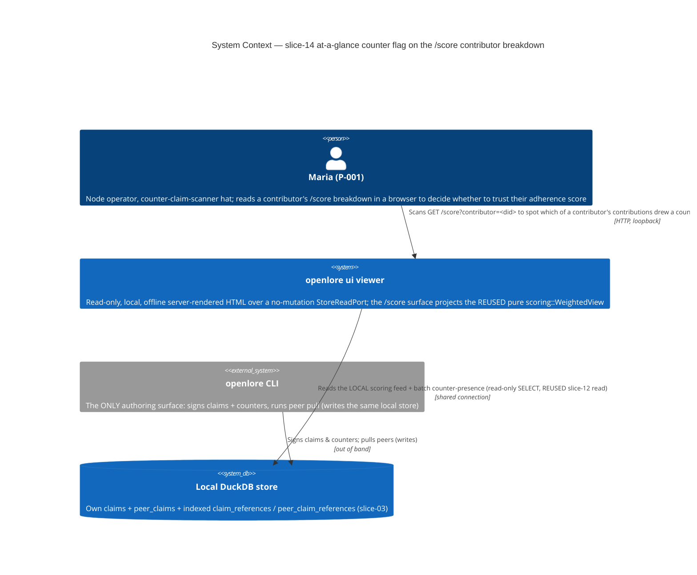
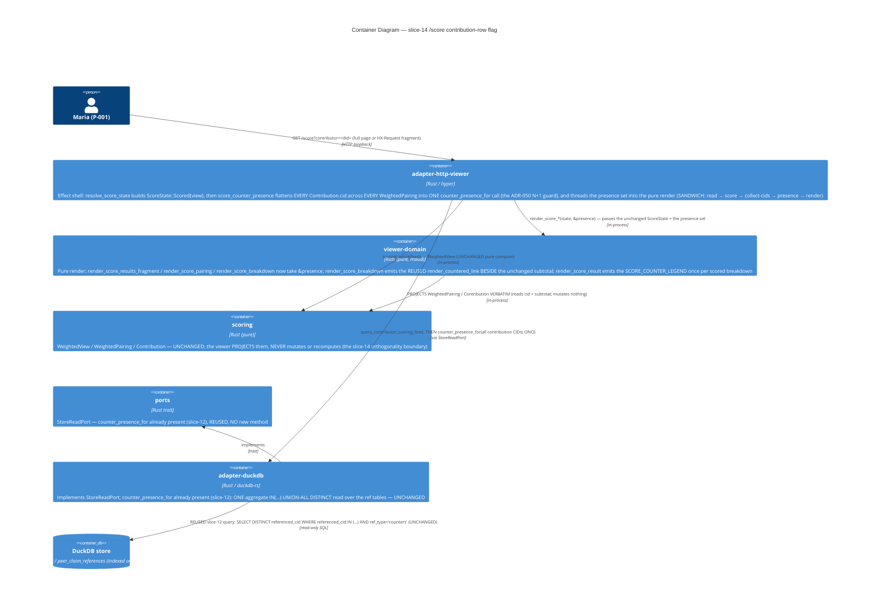

# Architecture Design — viewer-counter-flags-score-surface (slice-14)

> Wave: **DESIGN** · Architect: Morgan (nw-solution-architect) · Date: 2026-06-08
> Feature type: brownfield DELTA on the read-only `openlore ui` viewer
> (`GET /score?contributor=<did>` contributor-scoring surface)
> Paradigm: functional (ADR-007) — pure `viewer-domain` core + effect shell at the I/O edge
> Scope (DISCUSS-resolved, D-14-1): extend the slice-12/13 "Countered" presence flag to the
> LAST local viewer surface — the `/score` contribution-row breakdown. This COMPLETES the
> at-a-glance J-003b facet across every local viewer surface.
> Reuse-first: **NO new crate. Workspace stays 21 members. NO new read method. NO new render
> fn. NO new route. NO new KPI ID. NO new SQL. NO new xtask edge.**

## 1. System context and capabilities

slices 11/12/13 made disagreement legible (the counter thread under `/claims/{cid}`) and
discoverable while scanning (the "Countered" flag on `/claims`, `/peer-claims`, and the
`/project`+`/philosophy` traversal edges). slice-14 extends that SAME neutral flag to the
LAST surface P-001 ("Maria", counter-claim-scanner hat) reads — the `GET /score` contributor
breakdown — so she can spot WHICH of a contributor's contributions drew a counter before
trusting their adherence score.

The defining nuance (feature-delta §"What makes slice-14 DIFFERENT"): `/score` carries
SCORING SEMANTICS. The flag sits BESIDE a weight, a confidence, two bonuses, and a subtotal
inside a ranked breakdown whose subtotals sum to a headline pairing weight. So slice-14 owes
TWO things slices 12/13 did not: (a) the slice-09 sum-to-weight CARDINAL must be PRESERVED
with the flag present, and (b) a first-class **anti-misread legend** so the flag is never read
as "this counter lowered the score." The counter is **SHOWN, never APPLIED** — a countered
claim contributes its FULL original weight.

The slice adds **ZERO new read capability and ZERO new render function**. It REUSES the
slice-12 batch presence read (`StoreReadPort::counter_presence_for(&[String]) -> HashSet<String>`,
ADR-048) VERBATIM, wired into the `/score` handler, and the slice-13-unified
`render_countered_link(cid, is_countered)` SSOT + the `COUNTERED_PRESENCE_FLAG` neutral marker.
The only genuinely NEW artifact is the anti-misread legend constant (one SSOT string, rendered
once per scored page).

### Capabilities delivered

| Capability | Component | New / Reused |
|---|---|---|
| Batch counter-presence read (one aggregate query over the page's contribution-CID set) | `StoreReadPort::counter_presence_for` (port) + `adapter-duckdb` impl | **REUSED VERBATIM (slice-12 / ADR-048) — NO new method** |
| Per-contribution "Countered" flag on `/score`, projected from the presence set | `render_score_breakdown(pairing, presence)` arm calling the REUSED `render_countered_link` (`viewer-domain`) | **NEW render arm only — REUSES the slice-13 link fn** |
| Anti-misread legend (orthogonality copy, once per scored breakdown) | `SCORE_COUNTER_LEGEND` constant + one render site in `render_score_result` (`viewer-domain`) | **NEW SSOT constant + one render site** |
| `/score` flatten-all-contribution-CIDs-once → ONE presence read | `score_counter_presence` helper in `adapter-http-viewer` (mirrors slice-13 `survey_counter_presence`) | **NEW effect-shell helper (REUSES the read)** |
| `/score` weight / confidence / bonuses / subtotal / bucket / ranking / row order | `query_contributor_scoring_feed` + `scoring::score` + `WeightedView`/`WeightedPairing`/`Contribution` + `render_score_pairing`/`render_score_breakdown` | **UNCHANGED (byte-identical to slice-09 with markers + legend elided)** |
| Flag text (`"Countered"`) + `<a href="/claims/{cid}">` one-hop link | `COUNTERED_PRESENCE_FLAG` (slice-11) + `render_countered_link` (slice-13 SSOT) | **REUSED verbatim** |
| Indexed ref tables | `claim_references` / `peer_claim_references` | **REUSED (slice-03)** |

## 2. C4 Level 1 — System Context



The viewer NEVER writes; authoring stays exclusively in the CLI (I-CF-1). No network seam on
the `/score` route — every flag renders fully offline (I-CF-5; slice-09 WD-CS-8). The flag
read needs NO per-row artifact read — a pure DB-index lookup. The scoring math is the REUSED
pure `scoring` core; the viewer recomputes NOTHING.

## 3. C4 Level 2 — Container



C4 Level 3 is NOT warranted: this slice touches 2 existing crates (`viewer-domain` pure,
`adapter-http-viewer` effect) with ≤4 changed units total (one render-chain widening, one
breakdown render arm, one legend constant + render site, one effect-shell helper) and
introduces no new internal subsystem.

## 4. The load-bearing decision — the projection seam (presence THREADED, not on the model)

This is where slice-14 DELIBERATELY DIVERGES from slice-13 (ADR-050), and the divergence is
FORCED by an ownership boundary that also gives slice-14 its orthogonality guarantee for free.

- In slice-13, the flagged rows were `EdgeRow` — a **`viewer-domain`-owned view-model**, so the
  bool lived ON the model (`EdgeRow.is_countered`, set in the grouper).
- In slice-14, the flagged rows are `scoring::Contribution` inside `scoring::WeightedPairing` —
  types **owned by the `scoring` crate**, which the viewer must NOT mutate and NEVER recompute
  (feature-delta out-of-scope; D-14-2; I-CF-9). Adding an `is_countered` field to
  `scoring::Contribution` is forbidden: it would change the scoring crate and put a
  presentation concern in the pure scoring core.

**Decision (see ADR-051): thread `presence: &HashSet<String>` down the render call chain
alongside the UNCHANGED `&ScoreState`.** The pure render becomes a TOTAL function of
`(ScoreState, presence)` — exactly the seam the brief and DISCUSS (D-14-1, the
`from_row_with_presence` parallel) call for. `render_score_breakdown` reads
`presence.contains(&contribution.cid.0)` to gate ONLY the additive `render_countered_link`
marker, rendered BESIDE the verbatim subtotal. **The `WeightedPairing` it projects is
byte-for-byte the one `scoring::score` produced — every weight, confidence, bonus, subtotal,
bucket, and the row order come from that unchanged value.** The presence set can only ADD a
marker; it cannot reach any number. That is the sum-to-weight orthogonality, guaranteed by
construction (§7).

## 5. The N+1 guard — REUSE the slice-12 batch presence read

The `/score` handler REUSES the slice-12 `counter_presence_for(&[cid])` (ADR-048) exactly as
slice-13's three handlers do — **NO new read method, NO new SQL** (ADR-049 reuse rationale
carries).

- **ONE aggregate query per render**, regardless of pairing or contribution count (the N+1
  guard, I-CF-8). The query is the slice-12
  `DISTINCT referenced_cid IN (<bound placeholders>) AND ref_type='counters'` over
  `claim_references ∪ peer_claim_references` — UNCHANGED.
- **Flatten EVERY `Contribution.cid` across EVERY `WeightedPairing` into ONE call.** This is the
  slice-specific N+1 risk (a naive impl could call per-pairing or per-contribution). A new
  effect-shell helper `score_counter_presence(store, &view)` (mirroring slice-13's
  `survey_counter_presence`) collects
  `view.ranked.iter().flat_map(|p| p.contributions()).map(|c| c.cid.0.clone())` into ONE
  `Vec<String>`, calls `counter_presence_for` ONCE, then the render reads membership. This is
  the load-bearing flatten and the subject of ADR-051.
- **Form / NoClaims / empty / all-un-countered → zero or empty query.** `ScoreState::Form` and
  `ScoreState::NoClaims` build NO `view`, so `score_counter_presence` is never called → no
  query. A `Scored` view with no countered contributions passes a non-empty slice → one query
  returning the empty set → no flags. (The slice-12 read short-circuits an EMPTY input slice to
  `Ok(HashSet::new())` without preparing a statement — but a scored view always has ≥1
  contribution, so the empty-slice short-circuit is reached only via Form/NoClaims, which skip
  the call entirely.)
- **Read-only, LOCAL, offline.** SELECT only over the shared connection (BR-VIEW-4); no network,
  no mutation method on the trait (I-CF-1 carried). The query is REUSED, so its injection-safety
  (bound `params_from_iter`, never interpolation) carries verbatim.

## 6. Pure projection + route wiring

### 6.1 Pure render (`viewer-domain`) — presence threaded, legend once

**Render-chain widening.** The render becomes a total function of `(ScoreState, presence)`:

- `render_score_results_fragment(state, presence)` — the fragment fn BOTH shapes embed (parity
  by construction, I-CF-6).
- `render_score_page(state, presence)` — wraps the SAME fragment fn in chrome.
- `render_score_result(state, presence)` — the total match over the ADT. For
  `ScoreState::Scored { view }` it renders, ONCE before the pairings, the **anti-misread legend**
  (`SCORE_COUNTER_LEGEND`, §6.3), then iterates `view.ranked` calling
  `render_score_pairing(pairing, presence)`. `Form` and `NoClaims` render NO legend and NO flag
  (the presence arg is unused there).
- `render_score_pairing(pairing, presence)` → `render_score_breakdown(pairing, presence)`.
- `render_score_breakdown(pairing, presence)` — for each `contribution` in
  `pairing.contributions()`, renders the EXISTING six cells VERBATIM (author / cid / confidence /
  author bonus / triangulation bonus / subtotal), THEN, in an additive cell, the REUSED
  `render_countered_link(&contribution.cid.0, presence.contains(&contribution.cid.0))`. An
  un-countered contribution renders byte-identically to slice-09 (the REUSED link fn emits
  NOTHING when `is_countered == false` — no marker, no "0 counters" noise).

**Boundary**: PURE — no I/O, no time, no network. Total over `(ScoreState, presence)`. The
render NEVER re-orders / re-ranks / re-weights / re-groups / subtracts: it iterates
`view.ranked` and `pairing.contributions()` in the order the UNCHANGED `scoring::score`
produced, and reads each number straight off the unchanged `WeightedPairing`. The flag is the
ONLY thing the presence set can affect, and a flag is additive markup BESIDE the row. Adding a
`&HashSet<String>` parameter is std-only — no new dep; the `xtask` rule "viewer-domain MUST NOT
depend on tokio/reqwest/duckdb" is unaffected.

> **Seam choice rationale (vs slice-13 ADR-050's bool-on-the-model):** the contribution rows
> project a `scoring`-crate type the viewer must not touch, so the bool CANNOT live on the
> model. Threading `&presence` to the render is the slice-13-rejected "Alternative 3" — but
> here it is the CORRECT choice precisely because it keeps the `scoring` types pristine, and
> because it makes the orthogonality structural: the render projects the same unchanged
> `WeightedPairing` and the presence set can only gate an additive marker. See ADR-051.

### 6.2 Route wiring (`adapter-http-viewer::resolve_score_state` / `score_page`)

The SANDWICH (ADR-007) gains ONE REUSED read + the flatten, structurally identical to slice-13's
`resolve_project_view` + `survey_counter_presence`:

1. `feed = store.query_contributor_scoring_feed(&Did(contributor))` — UNCHANGED.
2. `view = scoring::score(&feed, &ScoringConfig::DEFAULT)` — UNCHANGED pure compute → `ScoreState::Scored { view }`.
3. `presence = score_counter_presence(store, &view)` — the NEW helper: flatten every
   `Contribution.cid` across every `WeightedPairing` into one `Vec<String>`, ONE
   `counter_presence_for` call, `unwrap_or_default()` on error.
4. render by `Shape`: `render_score_results_fragment(&state, &presence)` (Fragment) or
   `render_score_page(&state, &presence)` (FullPage) — the flag + legend live in the SAME
   fragment fn both shapes embed → parity is structural and free (I-CF-6).
5. `Form` / `NoClaims` arms → no `view`, no `score_counter_presence` call, render with an empty
   presence set (or skip threading entirely — DESIGN recommends passing
   `&HashSet::new()` so the render signature is uniform).

```text
// resolve_score_state — Scored arm only (Form/NoClaims unchanged, no presence read)
let view = scoring::score(&feed, &scoring::ScoringConfig::DEFAULT);   // UNCHANGED pure compute
let presence = score_counter_presence(store, &view);                 // NEW: flatten-once + REUSED read
// state = ScoreState::Scored { view }; thread &presence into the render by Shape

// score_counter_presence (NEW helper, mirrors survey_counter_presence)
fn score_counter_presence(store, view) -> HashSet<String> {
    let cids: Vec<String> = view.ranked.iter()
        .flat_map(|p| p.contributions())
        .map(|c| c.cid.0.clone())
        .collect();                                                  // ALL contribution CIDs, flattened ONCE
    store.counter_presence_for(&cids).unwrap_or_default()            // REUSED; ONE call across all pairings
}
```

A `counter_presence_for` read failure degrades to an empty presence set via
`unwrap_or_default()` — no flags, NEVER a 5xx; the score breakdown still renders in full
(NFR-VIEW-6 carried). slices 11/12/13 surfaces are untouched.

### 6.3 The anti-misread legend (the one genuinely-new artifact)

A new SSOT constant in `viewer-domain`, rendered ONCE per scored breakdown (in
`render_score_result`'s `Scored` arm, before the pairings — not per row, not per pairing):

```rust
/// The neutral anti-misread legend rendered ONCE on a scored /score breakdown
/// (slice-14 / US-CF-002 / AC-SCORE-ANTIMISREAD). States plainly that the
/// "Countered" marker is shown for the reader to judge and does NOT lower the
/// contributor's score (the counter is SHOWN, never APPLIED — a countered claim
/// keeps its full original weight; I-CF-9 / D-14-3). Held in ONE place so the
/// orthogonality copy is a single source of truth. Honors AC-SCORE-ANTIMISREAD's
/// verdict-word blocklist: never "disputed"/"refuted"/"false"/"penalty"/
/// "deduction"/"lowered"/"disputed score".
pub const SCORE_COUNTER_LEGEND: &str =
    "A “Countered” marker means another claim disagrees with this one elsewhere. \
     It is shown for you to judge and does not change this contributor's score — \
     each contribution keeps its full weight.";
```

- **Placement**: once per `ScoreState::Scored` render, ABOVE the pairings (it explains every
  marker that may appear below it). NOT rendered for `Form` or `NoClaims`. NOT rendered per row
  (one legend governs the whole breakdown).
- **Blocklist compliance** (AC-SCORE-ANTIMISREAD): the copy uses only neutral language —
  "disagrees", "shown for you to judge", "does not change", "keeps its full weight". It contains
  NONE of the forbidden words "disputed", "refuted", "false", "penalty", "deduction", "lowered",
  "disputed score". (The marker text itself is the REUSED `COUNTERED_PRESENCE_FLAG = "Countered"`,
  already vetted neutral across slices 11/12/13.)
- **Byte-identity baseline elision (AC-SCORE-BYTEID)**: BOTH the markers AND the legend are part
  of the elision set. With the markers and `SCORE_COUNTER_LEGEND` elided, the `/score` render is
  byte-identical to the slice-09 baseline (every weight / confidence / bonus / subtotal /
  headline total / bucket / `[SPARSE]` line / ranking / row order unchanged). The legend, like
  the markers, is purely additive markup.

## 7. Sum-to-weight orthogonality — guaranteed BY CONSTRUCTION (the cardinal)

The slice-14 CARDINAL (I-CF-9 / D-14-2): adding the flag changes NO weight, confidence, bonus,
subtotal, headline total, bucket, ranking, or row order; the per-claim subtotals STILL sum to
the displayed pairing weight. This is structurally true, not merely tested, because:

1. **The render projects the SAME unchanged `WeightedPairing`.** `render_score_pairing` reads
   `pairing.weight` and `render_score_breakdown` reads each `contribution.subtotal` straight off
   the value `scoring::score` produced. slice-14 adds NO argument that the numbers depend on and
   touches NO field of the pairing/contribution. The slice-09 "subtotals sum to weight BY
   CONSTRUCTION" doc-comment (viewer-domain ~L1935) holds verbatim — both the headline weight and
   the breakdown rows are still projected from the SAME `WeightedPairing`.
2. **The presence set only GATES an additive marker.** `presence.contains(&cid)` decides whether
   to APPEND `render_countered_link` markup to a row; it is read NOWHERE near a number. There is
   no code path by which a presence-set value can reach `weight`, `subtotal`, `base`, a bonus,
   the bucket, the `ranked` order, or the contribution order.
3. **The scoring types are immutable to the viewer.** Because the seam (§4) threads `&presence`
   rather than mutating `scoring::Contribution`, the `WeightedView` the renderer holds is
   `scoring::score`'s output unchanged — there is literally no mutation surface on it from the
   viewer side.
4. **A countered claim contributes its FULL original weight** — its `subtotal` is rendered
   verbatim; the counter subtracts nothing (Scenario 3 / AC-SCORE-SUMWEIGHT). Two contributions
   with identical confidence + bonuses render identical subtotals whether or not one is countered
   (Scenario 5 / AC-SCORE-ANTIMISREAD).

This is enforced as **AC-SCORE-BYTEID** (byte-identity vs the slice-09 baseline with markers +
legend elided — the slice-12/13 baseline+marker-elision tactic) and **AC-SCORE-SUMWEIGHT**
(subtotals sum to weight on a FLAGGED breakdown).

## 8. Invariants → enforcement map

| Invariant | Enforcement point | Layer |
|---|---|---|
| **N+1 guard** (exactly 1 presence query per render; flattened across ALL pairings + contributions; Form/NoClaims → 0) | gold/acceptance test asserting query count invariant to pairing/contribution count (DISTILL/CRAFT); flatten from `view.ranked.flat_map(contributions)` in `score_counter_presence`; empty-slice short-circuit in the REUSED adapter read (slice-12 ADR-048 property) | behavioral |
| **Sum-to-weight preserved / shown-never-applied** (subtotals sum to weight; every weight/confidence/bonus/subtotal/total/bucket/rank/order byte-identical to slice-09 with markers + legend elided) | render projects the SAME unchanged `WeightedPairing` (§7); presence only gates an additive marker; `scoring` types never mutated; gold byte-identity test (flagged-vs-elided render of same store) | structural + behavioral |
| **No-invented-flags** (flag iff a real `ref_type='counters'` ref exists for that cid) | the REUSED read's `WHERE … ref_type='counters'`; set-membership projection `presence.contains(&cid)` | structural + behavioral |
| **Presence-only, no merged / no count** (one marker per countered contribution-cid, never "disputed by N") | return type is `HashSet<String>` (set membership, no count); `render_countered_link` emits ONE neutral marker per countered cid via DISTINCT | type + behavioral |
| **Anti-misread copy** (legend makes orthogonality unmistakable; blocklist honored) | `SCORE_COUNTER_LEGEND` SSOT constant; rendered once per scored breakdown; gold/lint asserting it contains none of the blocklist words; comprehension KPI | structural + behavioral |
| **Read-only** (no mutation in the viewer) | `StoreReadPort` has no mutation method (type system); `xtask check-arch::check_viewer_capability_boundary` (dep-graph, UNCHANGED); behavioral read-only gold (row-count universe unchanged) | type + arch + behavioral (3-layer) |
| **No recompute of scoring math** (viewer projects the reused `WeightedView`, never recomputes) | the seam threads `&presence` instead of mutating `scoring::Contribution`; `scoring` crate UNCHANGED; `viewer-domain → scoring` dep is read-only projection | type + arch |
| **LOCAL / offline** | SELECT over the shared local connection; no network dep reachable from `adapter-http-viewer` (`check_viewer_capability_boundary`, UNCHANGED); slice-09 `/score` already offline | arch |
| **Parity** (htmx fragment == no-JS full page) | the flag + legend live in `render_score_results_fragment`, the single fragment fn both shapes embed | structural |

## 9. Driving port (for the acceptance tests)

ONE driving route, exercised port-to-port through the real `openlore ui` subprocess (no direct
call to `counter_presence_for` or `viewer-domain` in the AC):

- `GET /score?contributor=<did>` — US-CF-002: a seeded countered contribution shows the
  `<a href="/claims/{cid}">Countered</a>` marker BESIDE its verbatim subtotal; multi-counter →
  ONE marker; the breakdown carries the anti-misread legend once; the subtotals still sum to the
  pairing weight; every weight/confidence/bonus/subtotal/total/bucket/rank/row-order is
  byte-identical to slice-09 with markers + legend elided; fragment/full-page parity; an
  un-countered contribution byte-identical to slice-09; `NoClaims` / empty / no-counter store →
  no flags, no legend on `NoClaims`, ≤1 query (0 for `NoClaims`).

US-CF-001 (the wiring) is observable THROUGH the above: the single-query-per-render +
flatten-across-pairings + Form/NoClaims→no-query invariants are asserted via the real subprocess
+ the inherited slice-12 adapter property.

## 10. Quality attributes (ISO 25010)

- **Performance efficiency**: the N+1 guard is the load-bearing contract — ONE indexed
  (`idx_*_references_referenced`) aggregate read per render, bounded by the contribution count
  across the whole breakdown. The flatten makes it a single read regardless of pairing count.
- **Maintainability / testability**: the pure `viewer-domain` render is a total function of
  `(ScoreState, presence)` — unit/property-testable with no I/O; the effect shell holds the one
  REUSED read + the flatten helper. The `scoring` types stay pristine (no presentation field
  leak). Dependency-inversion preserved (the viewer depends on the `StoreReadPort` trait + the
  pure `scoring` core, not the adapter).
- **Reliability**: read-only by construction; offline; degrades to no-flags on read error.
- **Functional suitability (the cardinal)**: sum-to-weight orthogonality is structural (§7),
  not incidental — the flag cannot reach a number; the anti-misread legend closes the
  comprehension gap.
- **Security (integrity)**: the REUSED read is bound-parameterized (no SQL injection on the CID
  list); read-only trait (no mutation surface); no signing key in the viewer process.

## 11. Confirmations

- **No new crates.** Extends `viewer-domain` (render-chain `&presence` widening + one breakdown
  render arm + one legend constant + one render site) and `adapter-http-viewer` (one
  `score_counter_presence` helper + the `resolve_score_state` wiring). `ports`, `adapter-duckdb`,
  and `scoring` UNCHANGED (the read is REUSED; the scoring types are projected, never mutated).
  `cli` UNCHANGED. **Workspace stays 21 members.**
- **No new read method** — `counter_presence_for` REUSED VERBATIM (slice-12 / ADR-048). **No new
  render fn** — `render_countered_link` REUSED VERBATIM (slice-13 SSOT). **No new SQL. No new
  route** (extends the existing `GET /score`). **No new KPI ID.**
- **xtask delta: NONE** (see §8 + component-boundaries.md §6). No new dep edge (`viewer-domain →
  scoring` already exists from slice-09); the REUSED presence query does not trip
  `no_cross_table_join_elides_author` (ref-table-only literal); the viewer capability boundary is
  unchanged. **Capability rule unchanged.**

## External integrations

NONE. This slice has no external API, third-party service, or network seam. No contract-test
annotation is required for the DEVOPS handoff.

## Earned-Trust note (principle 12)

slice-14 introduces NO new driven adapter, NO new port, and NO new external dependency. The
single driven dependency it exercises — `counter_presence_for` on `DuckDbStoreReadAdapter` — is
REUSED from slice-12, whose probe surface (the read-only store connection probe at startup,
ADR-030, "wire then probe then use") already covers it. The substrate (the local DuckDB store)
is the same one slices 06–13 already probe. No new probe is owed BY this slice; the existing
startup probe + the inherited slice-12 adapter N+1 property test remain the empirical
guarantees. (Were slice-14 adding a new read, a new substrate, or recomputing the score, a fresh
`probe()` with fault-injection would be a first-class design responsibility here — it is not,
because the read is reused unchanged and the scoring math is projected, not recomputed.)
</content>
</invoke>
