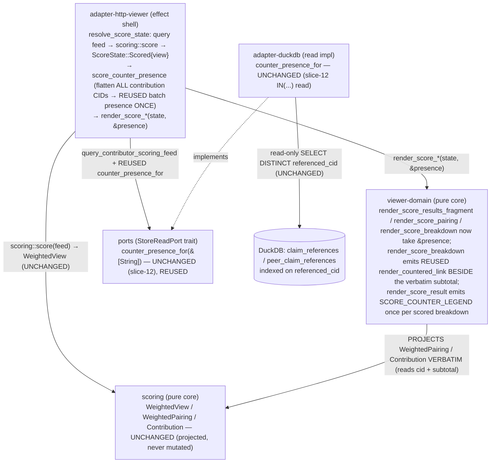

# Component Boundaries — viewer-counter-flags-score-surface (slice-14)

> Wave: DESIGN · Date: 2026-06-08 · Reuse-first, NO new crates, workspace stays 21,
> NO new read method, NO new render fn.

The slice touches TWO existing crates (`viewer-domain` pure, `adapter-http-viewer` effect).
`ports`, `adapter-duckdb`, and `scoring` are UNCHANGED — the `counter_presence_for` read is
REUSED verbatim from slice-12, the `render_countered_link` flag is REUSED verbatim from
slice-13, and the `scoring` types are PROJECTED, never mutated or recomputed. Every change is
additive. The dependency direction is unchanged (dependencies point inward to `ports` + the
pure `scoring` core; the pure `viewer-domain` core depends only on `ports` + `scoring` +
`maud`).



## 1. `ports` — `StoreReadPort` — NO change

`counter_presence_for(&self, cids: &[String]) -> Result<HashSet<String>, StoreReadError>`
already exists (slice-12 / ADR-048) and is the EXACT shape slice-14 needs (presence-only set
membership over a page's CID set). **NO new method. NO signature change.** The trait stays
read-only (no mutation method — I-CF-1 carried). `query_contributor_scoring_feed` (the slice-09
LOCAL scoring-feed read) is UNCHANGED.

## 2. `scoring` — the pure scoring core — NO change (the orthogonality boundary)

`WeightedView { ranked: Vec<WeightedPairing> }`, `WeightedPairing` (with `weight`, `bucket`,
`contributions()`), and `Contribution { author_did, cid, base, author_distinct_bonus,
cross_project_triangulation_bonus, subtotal }` are UNCHANGED. **slice-14 adds NO field to
`Contribution` and recomputes NOTHING.** This is the load-bearing boundary for the sum-to-weight
cardinal (I-CF-9): because the viewer threads `&presence` into the render rather than mutating
the scoring types, the `WeightedView` the renderer projects is `scoring::score`'s output with no
mutation surface from the viewer side. The viewer's relationship to `scoring` is a READ-ONLY
PROJECTION (it reads `cid` for the flag key and `subtotal`/`weight`/etc. for display).

## 3. `viewer-domain` — pure render (the no-I/O core)

**Change A — render-chain widening (thread `&presence`)**: the score render becomes a total
function of `(ScoreState, presence: &HashSet<String>)`:

- `render_score_results_fragment(state, presence)` (~L1853) — the fragment fn BOTH shapes embed.
- `render_score_page(state, presence)` (~L1874) — wraps the SAME fragment fn in chrome.
- `render_score_result(state, presence)` (~L1915) — the total ADT match. Adds, in the
  `ScoreState::Scored` arm ONLY, the `SCORE_COUNTER_LEGEND` render ONCE before the `@for pairing`
  loop, then calls `render_score_pairing(pairing, presence)`.
- `render_score_pairing(pairing, presence)` (~L1940) → `render_score_breakdown(pairing, presence)`.

**Change B — `render_score_breakdown` flag arm (`viewer-domain/src/lib.rs:1968`)**: for each
`contribution`, render the EXISTING six cells VERBATIM, THEN an additive cell:
`render_countered_link(&contribution.cid.0, presence.contains(&contribution.cid.0))` — the REUSED
slice-13 SSOT (same constant, same `<a href="/claims/{cid}">` shape). An un-countered
contribution renders exactly as slice-09 (the link fn emits NOTHING when `is_countered == false`).

**Change C — `SCORE_COUNTER_LEGEND` constant + ONE render site**: a new `pub const` (the only
genuinely-new artifact), rendered ONCE per scored breakdown in `render_score_result`'s `Scored`
arm (not per row, not per pairing). Honors AC-SCORE-ANTIMISREAD's blocklist (never
"disputed"/"refuted"/"false"/"penalty"/"deduction"/"lowered"/"disputed score"). Exact copy in
architecture-design.md §6.3 + ADR-051.

**Boundary (all three changes)**: PURE — no I/O, no network, no time. Total over `(ScoreState,
presence)`. The flags + legend NEVER re-order / filter / re-weight / re-rank / re-group / subtract
(sum-to-weight orthogonality, I-CF-9): the renderer iterates `view.ranked` and
`pairing.contributions()` in the UNCHANGED `scoring::score` order, reads every number straight off
the unchanged `WeightedPairing`, and the presence set only gates additive markup. `viewer-domain`
keeps its allowed deps (`maud` + `ports` + `scoring` + pure cores) — adding a `HashSet` parameter
is std-only, no new dep. The `xtask` rule `viewer-domain MUST NOT depend on tokio/reqwest/duckdb`
is unaffected.

> **Seam choice (vs slice-13).** slice-13 (ADR-050) put `is_countered` ON the `EdgeRow`
> view-model because `EdgeRow` is `viewer-domain`-owned. slice-14 CANNOT do that: the rows
> project `scoring::Contribution`, owned by the `scoring` crate the viewer must not touch. So
> slice-14 threads `&presence` to the render (slice-13's rejected "Alternative 3") — which is
> the CORRECT choice here because it keeps the scoring types pristine AND makes the orthogonality
> structural. See ADR-051.

## 4. `adapter-duckdb` — the batch read impl — NO change

`counter_presence_for` is implemented on the existing `DuckDbStoreReadAdapter` (slice-12).
slice-14 calls it from one more handler; the impl, its SQL, its empty-input short-circuit, and
its N+1 property test are all UNCHANGED. **No edit.**

## 5. `adapter-http-viewer` — the route wiring (the SANDWICH shell)

**`score_counter_presence` (NEW helper, mirrors slice-13's `survey_counter_presence` at
`crates/adapter-http-viewer/src/lib.rs:589`)**: flatten EVERY contribution CID across EVERY
pairing into ONE REUSED read.

```text
fn score_counter_presence(store, view: &scoring::WeightedView) -> HashSet<String> {
    let cids: Vec<String> = view.ranked.iter()
        .flat_map(|p| p.contributions())
        .map(|c| c.cid.0.clone()).collect();              // ALL contribution CIDs, flattened ONCE
    store.counter_presence_for(&cids).unwrap_or_default() // REUSED; ONE call across all pairings; err → empty
}
```

**`resolve_score_state` / `score_page` (`crates/adapter-http-viewer/src/lib.rs:489, 507`)**:
inject the REUSED read in the `Scored` arm; thread `&presence` into the render:

```text
// resolve_score_state — Scored arm
let view = scoring::score(&feed, &scoring::ScoringConfig::DEFAULT);   // UNCHANGED pure compute
let presence = score_counter_presence(store, &view);                 // NEW: flatten-once + REUSED read
// → state = ScoreState::Scored { view }; carry &presence to the render

// score_page — render by Shape, threading &presence (Form/NoClaims pass &HashSet::new())
Shape::Fragment => html_ok(render_score_results_fragment(&state, &presence).into_string()),
Shape::FullPage => html_ok(render_score_page(&state, &presence)),
```

- **Boundary**: effect shell only — holds the existing feed read + pure `scoring::score` + the
  ONE REUSED presence read + the pure render call. No business logic, no signing key, no write
  surface (`check_viewer_capability_boundary` unchanged). The shape fork (Fragment vs FullPage) is
  REUSED untouched.
- **One-query-per-render**: the contribution CID set is flattened from `view.ranked` (the union of
  every contribution across every pairing), so one `flat_map` + one `counter_presence_for` call
  provably covers all pairings — never per-pairing, never per-contribution.
- **Form / NoClaims → no read**: those arms build no `view`, so `score_counter_presence` is never
  called (0 queries); the render takes an empty presence set.
- **Failure policy**: `counter_presence_for` error → `unwrap_or_default()` (empty set, no flags);
  the breakdown still renders. Matches the existing degradation paths. Never a 5xx for a
  presence-read failure.

## 6. `cli` (composition root) — NO change

The `cli` already wires the concrete `DuckDbStoreReadAdapter` as the `Box<dyn StoreReadPort>` the
viewer holds, and that adapter already implements `counter_presence_for` (slice-12). No new
wiring, no new construction site, no new probe surface (the existing read-only store probe at
startup, ADR-030, covers the connection). **No `cli` edit.**

## 7. `xtask` — NO change (delta: NONE)

- **No new dep edge**: every changed crate already depends on what it needs (`adapter-http-viewer
  → ports`/`viewer-domain`/`scoring`; `viewer-domain → ports`/`scoring`/`maud`). The
  `viewer-domain → scoring` edge already exists from slice-09. The dep graph is byte-identical.
- **`no_cross_table_join_elides_author` NOT tripped**: slice-14 writes NO new SQL — the presence
  query is REUSED verbatim from slice-12, already in-bounds (names
  `claim_references`/`peer_claim_references`, never the bare `claims`/`peer_claims` words, and is
  presence-only with no attribution to elide).
- **Viewer capability boundary UNCHANGED**: `adapter-http-viewer` gains no new dep;
  `check_viewer_capability_boundary` (no signing/PDS/indexer dep; only `cli` links it) still holds.

**Capability rule unchanged. No new edge. xtask check-arch delta: NONE.**

## 8. Workspace member count

**21 members — UNCHANGED.** No new crate, no new route, no new read method, no new render fn.

## 9. Earned-Trust note (principle 12)

slice-14 introduces NO new driven adapter, NO new port, and NO new external dependency. The one
driven dependency it exercises — `counter_presence_for` on `DuckDbStoreReadAdapter` — is REUSED
from slice-12, whose probe surface (the read-only store connection probe at startup, ADR-030,
"wire then probe then use") already covers it. The substrate (the local DuckDB store) is the
same one slices 06–13 already probe. The scoring math is the REUSED pure `scoring` core — pure,
deterministic, no substrate to lie. No new probe is owed BY this slice; the existing startup probe
+ the inherited slice-12 adapter N+1 property test remain the empirical guarantees.
</content>
