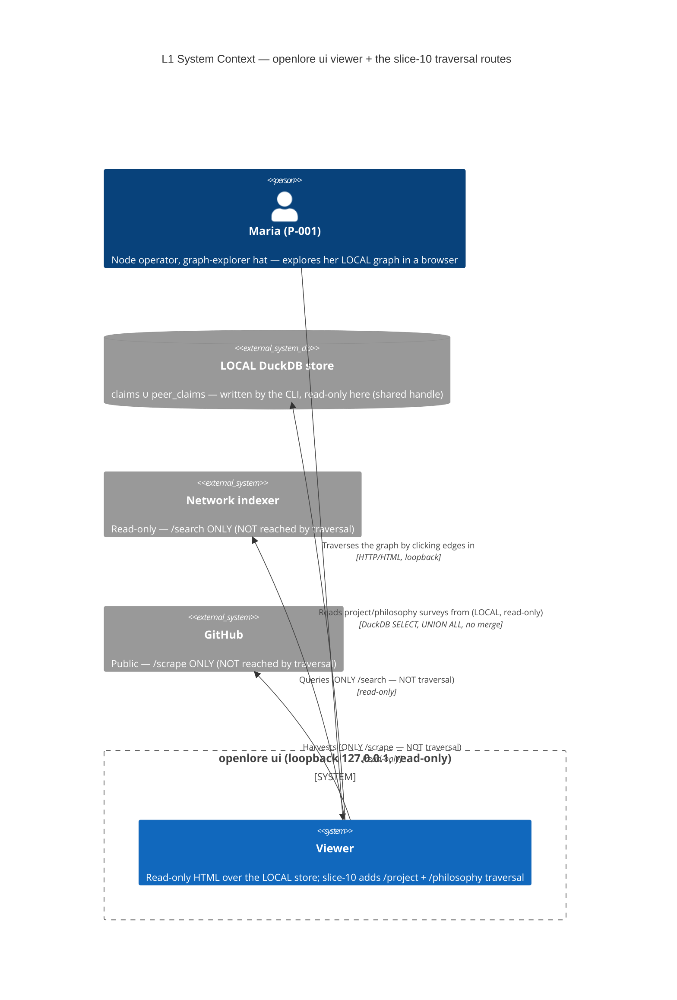

# Architecture Design — viewer-graph-traversal (slice-10)

> Wave: **DESIGN** · Owner: Morgan (nw-solution-architect) · Date: 2026-06-06
> Feature type: brownfield DELTA on the read-only `openlore ui` viewer.
> Paradigm: **functional** (ADR-007) — pure render/ADTs in `viewer-domain`,
> effect shell at the I/O edge in `adapter-http-viewer`, function signatures as ports.
> Architecture style: **Hexagonal + Modular Monolith (UNCHANGED, ADR-009)**.
> **No new crate. Workspace stays 21 members.**

This DESIGN realizes **J-002b in the browser**: two LOCAL read-only routes —
`GET /project?subject=<uri>` (the project survey) and
`GET /philosophy?object=<uri>` (the philosophy survey) — plus the cross-link
wiring that turns every existing list row into a clickable traversal edge. It is
the symmetric sibling of the slice-09 `/score` route: parse one query param →
LOCAL read over the read-only `StoreReadPort` → group/attribute in the PURE
`viewer-domain` core (never SQL) → project into a view-model ADT → render,
forking by `Shape` (fragment vs full page).

ADRs for the significant decisions: **ADR-042** (the two read seams), **ADR-043**
(the `TraversalView` ADT + survey render), **ADR-044** (the two routes +
cross-link href construction + the bare-DID/percent-encoding security decision),
**ADR-045** (the bucket-reuse `viewer-domain → claim-domain` edge + the
`check-arch` deltas).

---

## 1. System context and capability (what changes)

The viewer is the operator's (P-001 Maria, graph-explorer hat) loopback,
read-only window onto her LOCAL DuckDB store. slice-10 adds **traversal**: from
any claim/project/philosophy/contributor row she can follow an edge (one signed
claim) to the next entity. The slice adds:

- **Two LOCAL read capabilities** on `StoreReadPort` (US-GT-001): a project
  survey + a philosophy survey, each returning attributed rows (claims ∪ local
  `peer_claims`, `UNION ALL`, NO merge JOIN). Anti-merging grouping happens in
  PURE Rust, never SQL.
- **Two pure view-model ADTs + renderers** (US-GT-002/003): a unified
  `TraversalView` ADT (`Found { groups, contributors } | NoClaims { entity }`)
  with `render_project_*` / `render_philosophy_*` fragment + page functions
  (page = chrome + SAME fragment, structural parity).
- **Cross-link wiring** (US-GT-004): the subject/object/contributor cells on the
  existing `/claims`, `/claims/{cid}`, `/peer-claims`, `/score`, `/search`
  renderers become `<a href>` traversal edges.

Nothing else changes: read-only (no write/sign/follow route, no key, loopback
127.0.0.1), LOCAL/offline (no network seam on these routes), no new persisted
type, the vendored SHA-256-pinned htmx asset, the verbatim-confidence single site.

### C4 L1 — System Context



> The two new routes have **no edge** to the indexer or GitHub: traversal is
> LOCAL-only/offline (WD-GT-4 / I-GT-2), offline-STRONGER than `/search`.

### C4 L2 — Container / component (the touchpoints)

```mermaid
C4Container
  title L2 — slice-10 touchpoints (6 existing crates; no new crate; 21 members)
  Person(maria, "Maria (P-001)")
  Container_Boundary(proc, "openlore process (cli composition root wires it)") {
    Container(http, "adapter-http-viewer", "Rust / hyper (EFFECT shell)", "route table: parses ?subject/?object, reads the store, Shape fork, renders. slice-10 adds project_page / philosophy_page handlers")
    Container(viewerdom, "viewer-domain", "Rust / maud (PURE core)", "slice-10 adds TraversalView ADT + render_project_*/render_philosophy_* + cross-link href helpers; reuses render_confidence + claim-domain bucket")
    Container(ports, "ports", "Rust (PURE — port traits)", "slice-10 adds query_project_survey / query_philosophy_survey to StoreReadPort + the SurveyRow DTO")
    Container(duckdb, "adapter-duckdb", "Rust / duckdb (EFFECT)", "slice-10 adds the two read impls: claims UNION ALL peer_claims, explicit author_did, NO merge JOIN")
    Container(claimdom, "claim-domain", "Rust (PURE — deepest core)", "REUSED: confidence_bucket(f64) -> ConfidenceBucket (the slice-04 display-only bucket SSOT)")
    Container(xtask, "xtask check-arch", "Rust (tooling)", "slice-10: ADD viewer-domain -> claim-domain allowlist edge; capability + anti-merging rules UNCHANGED")
  }
  SystemDb_Ext(store, "LOCAL DuckDB store")

  Rel(maria, http, "GET /project?subject / /philosophy?object (loopback)", "HTTP")
  Rel(http, ports, "calls query_project_survey / query_philosophy_survey (read-only)")
  Rel(http, viewerdom, "groups in pure core, projects TraversalView, renders (Shape fork)")
  Rel(ports, duckdb, "implemented by (over the shared read handle)")
  Rel(duckdb, store, "SELECT claims UNION ALL peer_claims (LOCAL, no merge)")
  Rel(viewerdom, claimdom, "calls confidence_bucket (REUSED display-only bucket)")
  Rel(viewerdom, http, "render_project_page/_fragment, render_philosophy_page/_fragment")
```

Every arrow is labeled with a verb; abstraction levels are not mixed (L1 =
actors + external systems; L2 = the 6 internal crates). No L3 is warranted — the
slice touches 6 crates with thin additions to an established pattern (slices
06–09), not a 5+-component subsystem.

---

## 2. Component boundaries (summary; full detail in component-boundaries.md)

| Crate | Layer | slice-10 addition | Owns |
|---|---|---|---|
| `ports` | PURE port traits | `query_project_survey` / `query_philosophy_survey` on `StoreReadPort`; the `SurveyRow` DTO | the read contract (NO mutation) |
| `adapter-duckdb` | EFFECT (driven) | the two read impls (UNION ALL, explicit `author_did`, no merge JOIN) | the SQL; LOCAL read over the shared handle |
| `viewer-domain` | PURE core | `TraversalView` ADT + `render_project_*` / `render_philosophy_*` + `href_*` helpers; cross-link wiring on existing rows | the view-model + HTML + grouping |
| `adapter-http-viewer` | EFFECT (driving) | `project_page` / `philosophy_page` handlers; route-table arms | parse param, read, group-in-core, Shape fork, render |
| `claim-domain` | PURE (deepest) | REUSED `confidence_bucket` (new `[dependencies]` edge from `viewer-domain`) | the display-only bucket SSOT |
| `xtask` | tooling | one pure-core allowlist edge | architecture enforcement |
| `cli` | composition root | (no change beyond it already wiring the viewer) | wiring |

Dependency direction (inward, ADR-009): `adapter-http-viewer →
{viewer-domain, ports}`; `viewer-domain → {ports, claim-domain, scoring,
appview-domain}` (all PURE→PURE); `adapter-duckdb → ports`. No adapter→adapter.
No new crate.

---

## 3. Integration patterns

- **Driving ports (for the acceptance tests, port-to-port):** the two HTTP
  routes ARE the driving ports — `GET /project?subject=<uri>` and
  `GET /philosophy?object=<uri>`. Acceptance tests drive HTTP at the loopback
  address and assert on the rendered HTML (exactly as slices 06–09).
- **Driven port:** `StoreReadPort` (read-only) — extended with the two survey
  reads; implemented by `adapter-duckdb` over the shared connection.
- **Sync, in-process:** both routes are GET-only and SYNCHRONOUS (a LOCAL read +
  pure grouping/render — NO `.await`, unlike `/search`). They fork AFTER the
  synchronous store-read match in `route` (alongside `/claims`, `/score`,
  `/peer-claims`).
- **NO external integration** on these routes → **NO contract test annotation
  required** for slice-10 (the only external integrations — the indexer for
  `/search` and GitHub for `/scrape` — are pre-existing and untouched). This is
  the offline-STRONGER property (I-GT-2 / I-GT-7).

---

## 4. Quality attributes (ISO 25010)

| Attribute | Strategy on the new routes |
|---|---|
| **Functional suitability** | Each edge maps to exactly one signed claim (cid); no invented edges (I-GT-4). Empty survey → guided "no claims" (200), never a crash/blank. |
| **Reliability / fault tolerance** | A store read failure degrades to the SAME guided empty state (NFR-VIEW-6) — never a stack trace. Total `match` over `TraversalView`. |
| **Security** | Read-only (no write/sign/follow route, no key); loopback-only bind; **claim-controlled URIs are percent-ENCODED into hrefs** so a hostile subject/object cannot inject HTML/attributes (ADR-044 §security). |
| **Performance efficiency** | LOCAL SELECT over the shared handle; survey is depth-1 (entity + direct edges), no recursive CTE, no network. No new persisted type. |
| **Maintainability / testability** | Pure grouping + render are total functions tested port-to-port at domain scope; the effect shell is a thin read→group→render sandwich. One bucket site, one confidence site reused. |
| **Compatibility** | Reuses the existing route table, `Shape` fork, vendored htmx, page=chrome+fragment split — no new contract for existing surfaces. |

Anti-merging (KPI-GRAPH-2) is **MET by construction**: the survey decomposes to
per-`(group-key, author, cid)` rows; grouping in Rust, never SQL; identical
content by two authors = two rows. Enforced by three layers (see §6).

---

## 5. Invariants → structural enforcement points (§6 detail)

| DISCUSS invariant | Concrete structural enforcement point |
|---|---|
| Read-only 3-layer (I-GT-1) | (1) `StoreReadPort` has NO mutation method (type); (2) `xtask` viewer capability rule (`VIEWER_FORBIDDEN_DEPS` UNCHANGED); (3) behavioral read-only gold (route inventory + key-access audit + unchanged row counts). |
| LOCAL/offline (I-GT-2) | The two read impls touch only `claims`/`peer_claims` (no network crate reachable); the route handlers are synchronous with NO port other than `StoreReadPort`. Network-disabled acceptance scenario. |
| Anti-merging (I-GT-3) | `SurveyRow.author_did` non-Option (type); `xtask` `no_cross_table_join_elides_author` SQL rule (the UNION-ALL projects `author_did`); behavioral two-authors-two-rows gold. Grouping in pure Rust. |
| No invented edges (I-GT-4) | `SurveyRow.cid` non-Option; every rendered edge carries a cid; empty survey → `NoClaims` arm (no fabricated edge). |
| Verbatim + display-only bucket (I-GT-5) | `render_confidence` single site REUSED; bucket via REUSED `claim_domain::confidence_bucket` (no viewer recompute); no weight surface (link-out to `/score`). |
| Parity (I-GT-6) | `render_project_page` EMBEDS `render_project_fragment` (and philosophy mirror) — page = chrome + SAME fragment fn. |
| Loopback + no new persisted type (I-GT-8) | `ViewerServer::bind` refuses non-loopback (UNCHANGED); surveys computed per query, never written. |

---

## 6. Architecture Enforcement (annotation for software-crafter — DELIVER)

```markdown
Style: Hexagonal + Modular Monolith (UNCHANGED, ADR-009). Language: Rust
(functional, ADR-007 — pure cores: viewer-domain + claim-domain + scoring + appview-domain).
Tool: cargo xtask check-arch (the project's bespoke ArchUnit-equivalent — import-graph
+ syn-AST source rules; the project's standing rejection of import-linter-only holds).

slice-10 deltas (full text in ADR-045):
  - cargo xtask check-arch:
      * ADD `viewer-domain -> claim-domain` to the pure-core dependency allowlist
        (a pure -> pure edge — claim-domain is the DEEPEST pure core; `scoring` and
        `appview-domain` already depend on it, so it is already transitively present).
        This promotes `claim-domain` from a viewer-domain DEV-dependency to a regular
        `[dependencies]` edge so the production renderer may call `confidence_bucket`.
        SAME shape as the slice-08 `viewer-domain -> appview-domain` + slice-09
        `viewer-domain -> scoring` allowlist edges (ADR-037/041).
      * CONFIRM the pure-core no-I/O arm still PASSES for viewer-domain WITH the new
        claim-domain edge (claim-domain's deps are pure — serde/unicode-normalization;
        no I/O enters viewer-domain via this edge).
      * NO capability-rule change: the two new StoreReadPort reads are read-only
        (methods on the port that already has NO mutation method, ADR-030); the viewer
        capability boundary (VIEWER_FORBIDDEN_DEPS) is UNCHANGED — claim-domain is a
        pure core, not a signing/identity/PDS/indexer surface.
      * CONFIRM the anti-merging SQL rule (`no_cross_table_join_elides_author`) stays
        GREEN over the two new adapter-duckdb survey SELECTs (each names claims +
        peer_claims AND projects author_did — UNION ALL, no merge JOIN).
  - cargo xtask check-probes: UNCHANGED — no new adapter/port with a probe; the reads
    run over the existing probed StoreReadPort connection (ADR-028).
  - cargo deny: no new external dependency (claim-domain/ports/maud are all in-workspace).
  - mutation testing (nightly): extend to viewer-domain render_project_*/render_philosophy_*
    + the TraversalView projection + the href_* helpers (anti-merging two-rows, verbatim
    confidence, bucket projection, no-invented-edge cid presence, percent-encoded href).

Rules to enforce (slice-10):
- viewer-domain MAY depend on claim-domain (pure) and MUST NOT depend on duckdb/tokio/
  reqwest/std::fs/std::net/SystemTime or any adapter crate (existing pure-core no-I/O arm).
- StoreReadPort gains query_project_survey + query_philosophy_survey (read-only — NO
  mutation method added to the port).
- The two adapter-duckdb survey SELECTs are claims UNION ALL peer_claims, project
  author_did explicitly, and contain NO merge/average JOIN (anti-merging SQL rule green).
- GET /project + GET /philosophy persist nothing; render no sign/write/follow control;
  every cross-link is render-only navigation TEXT (<a href>, no executable control).
- render_project_page EMBEDS render_project_fragment; render_philosophy_page EMBEDS
  render_philosophy_fragment (page = chrome + fragment; parity by construction).
- Each survey row carries a non-Option author_did + cid (anti-merging + no-invented-edge).
- Claim-controlled subject/object URIs are percent-ENCODED into hrefs (no HTML/attribute
  injection from a hostile claim URI — ADR-044 §security).
- ViewerServer::bind still refuses non-loopback (UNCHANGED, ADR-028).
- No new crate; workspace stays 21 members.
```

---

## 7. Resolved open questions (the 3 WD-GT DESIGN-owned questions)

| # | Question | Resolution | ADR |
|---|---|---|---|
| **Q1** | Contributor cross-link DID form — bare `did:plc:rachel-test` vs app-identity `…#org.openlore.application` | **BARE DID.** `/score` (slice-09) is LOCAL and prefix-matches the feed via `bare_did` + `LIKE '<bare>%'` (it strips the fragment internally). The slice-08 `/search` resolver lifts to app-identity ONLY because the *indexer* matches `author_did` EXACTLY; traversal targets the LOCAL `/score`, which expects the bare form. The survey rows already carry the bare `author_did` from the local store — link it verbatim. | ADR-044 |
| **Q2** | Subject/object href percent-encoding (URIs containing `/`, `:`, `#`, and possibly hostile `&`/`<`/`"`) | **Percent-ENCODE the value into the href query component** (a small pure `encode_query_component` helper in `viewer-domain`). The inbound side already DECODES via `query_param`/`percent_decode_form`, so encode↔decode round-trips. This is a **security boundary**: subject/object are claim-controlled, so the value MUST be percent-encoded to prevent HTML/attribute injection — maud auto-escapes attribute text, but explicit encoding is defense-in-depth and keeps the value a valid single query param. | ADR-044 |
| **Q3** | One parametrized read (dimension enum) vs two methods | **TWO methods** — `query_project_survey(&subject)` / `query_philosophy_survey(&object)`. Mirrors the existing `list_claims`/`list_peer_claims` two-method shape; each call site is self-documenting; a dimension-enum param would be a two-arm over-generalization on the read port (same rationale ADR-039 used to reject a `&ScoringFilter` param). The two SQLs are near-identical (mirrored filter key), so duplication is one `WHERE` clause. | ADR-042 |

### New ADTs/routes (summary)

- **Routes:** `GET /project?subject=<uri>` (US-GT-002), `GET /philosophy?object=<uri>` (US-GT-003).
- **Read seams:** `StoreReadPort::query_project_survey(&Subject) -> Result<Vec<SurveyRow>, StoreReadError>`,
  `query_philosophy_survey(&Object) -> Result<Vec<SurveyRow>, StoreReadError>` (the `Vec<SurveyRow>` is the LOCAL feed; grouping is pure).
- **Boundary DTO:** `ports::SurveyRow { author_did: String (non-Option), cid: String (non-Option), subject, predicate, object, confidence: f64, origin: PeerOrigin, composed_at }`.
- **Pure view-model ADT:** `viewer_domain::TraversalView` — `Found { entity, groups: Vec<EdgeGroup>, contributors: Vec<String> } | NoClaims { entity }`, where an `EdgeGroup` keys on the *other* dimension (philosophies-embodied for `/project`; projects-that-embody for `/philosophy`) and holds attributed `EdgeRow`s.
- **xtask delta:** ONE pure-core allowlist edge (`viewer-domain → claim-domain`); capability + anti-merging rules UNCHANGED.

**Confirmation: NO new crate. Workspace stays 21 members.**

---

## Changelog

- 2026-06-06 — Morgan — Initial DESIGN for slice-10 viewer-graph-traversal:
  two LOCAL read-only traversal routes (/project + /philosophy) + cross-link
  wiring, reuse-first. Resolved the 3 WD-GT open questions (bare DID; percent-
  encode hrefs as a security boundary; two read methods). One xtask allowlist
  edge. No new crate (21 members). ADR-042..045.
