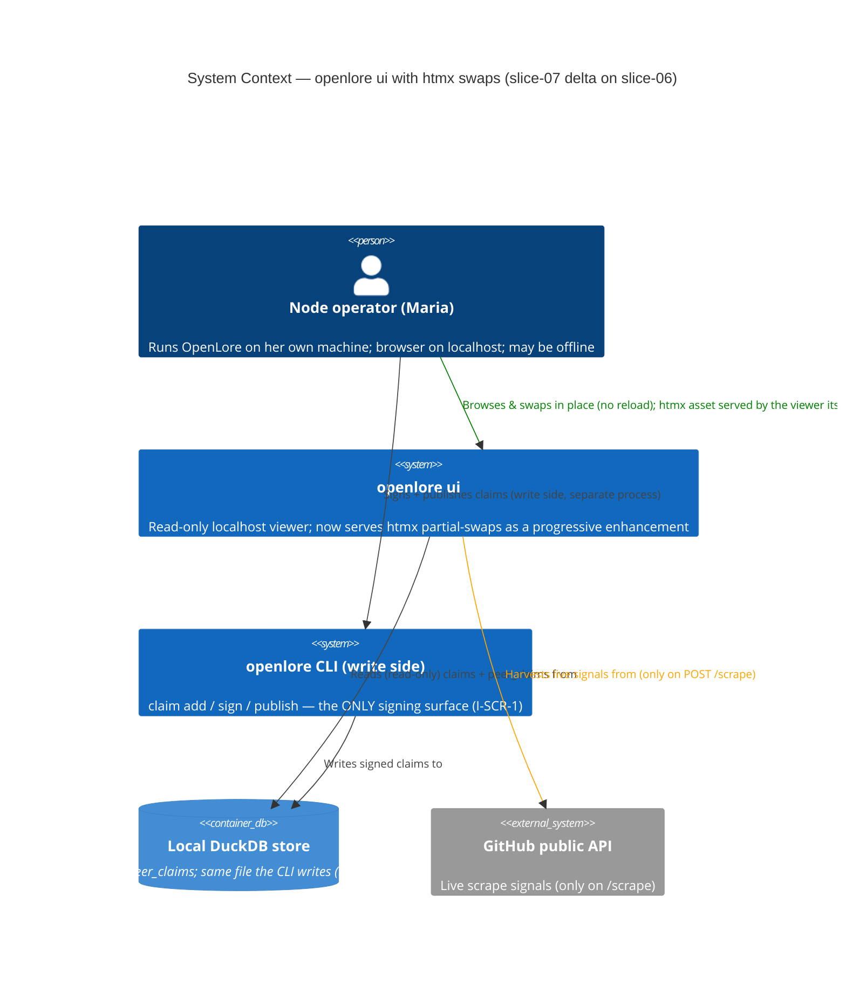
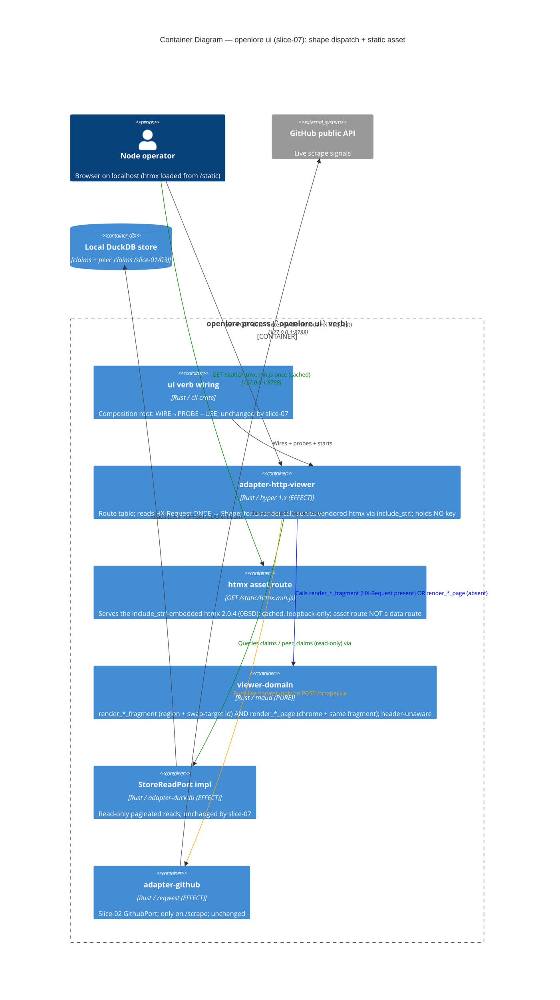
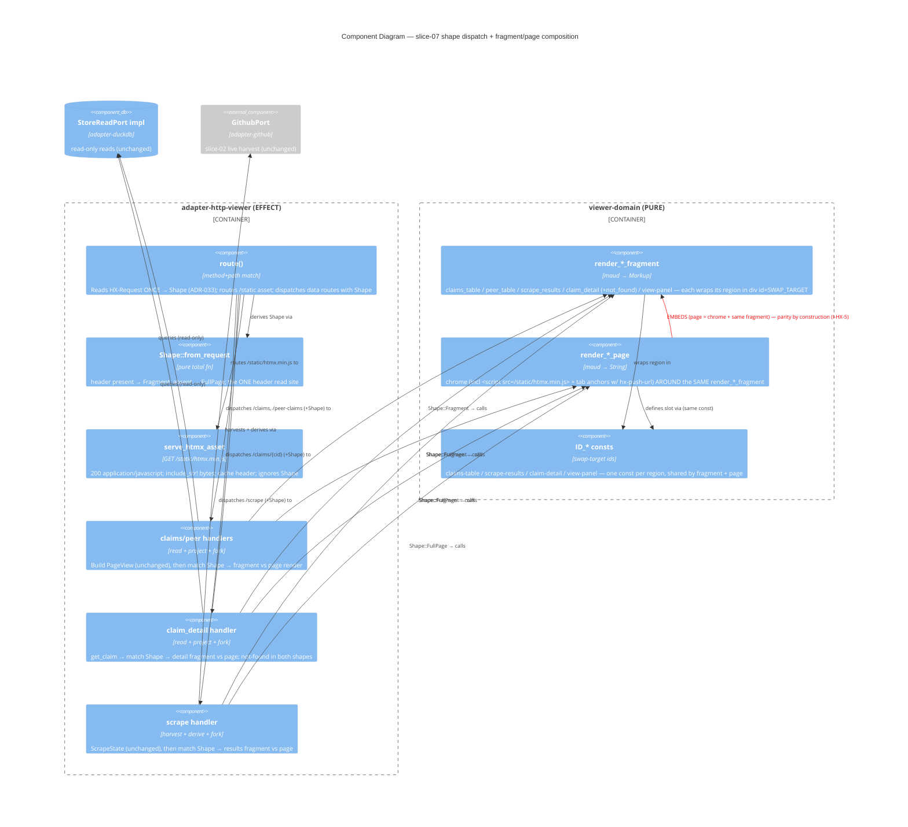
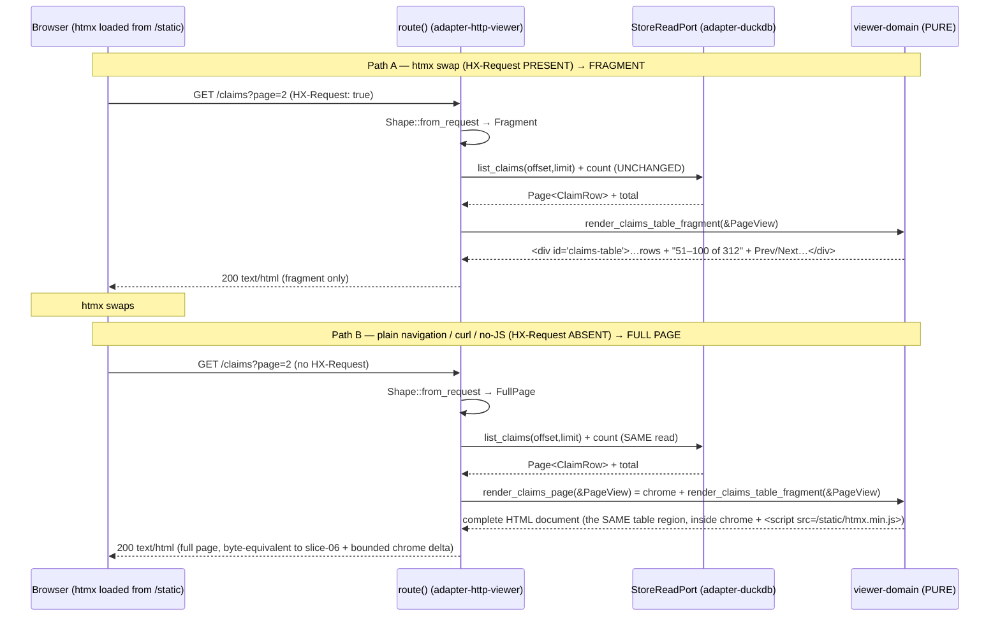

# Architecture Design: viewer-htmx-swaps (slice-07)

> **Brownfield DELTA on slice-06 (`htmx-scraper-viewer`).** The shipped `openlore ui`
> viewer serves server-rendered maud HTML over six read-only routes, today returning a
> FULL page for every route. This slice layers real htmx partial-swaps on the SAME routes
> as a **purely additive progressive enhancement**: only the response *shape* (fragment vs
> full page) varies, selected by the `HX-Request` header. The HTTP surface (URLs, methods)
> is UNCHANGED except for ONE new asset route serving the local htmx library. Identifier
> prefix: `HX-`. Paradigm: functional Rust (ADR-007) — pure `viewer-domain` renders both
> shapes; effect `adapter-http-viewer` reads the header and picks.
>
> Governed by NEW ADR-031 (vendored htmx asset), ADR-032 (fragment/page split), ADR-033
> (HX-Request dispatch in the shell), ADR-034 (tab `hx-push-url`), ADR-035 (harness seam) —
> building on slice-06 ADR-028/029/030.

---

## 1. System context and capabilities (the DELTA)

The viewer's capabilities, routes, and corpus are UNCHANGED from slice-06. slice-07 adds
exactly one new (asset) route and a second response SHAPE per existing data route:

| Capability (unchanged route) | slice-06 | slice-07 DELTA | US |
|---|---|---|---|
| See my claims | `GET /claims?page=N` | + table fragment under `HX-Request` | US-HX-001 |
| See peer claims | `GET /peer-claims?page=N` | + table fragment under `HX-Request` | US-HX-002 |
| Browse live proposals | `GET\|POST /scrape` | + results fragment under `HX-Request` | US-HX-003 |
| Inspect one claim | `GET /claims/{cid}` | + detail fragment under `HX-Request` | US-HX-004 |
| Switch My ↔ Peer view | `GET /claims` / `/peer-claims` | + view-panel swap + `hx-push-url` | US-HX-006 |
| **Serve htmx locally** | — | **NEW** `GET /static/htmx.min.js` (asset route) | US-HX-005 |

Hard invariants carried (requirements.md): I-HX-1 (progressive enhancement), I-HX-2
(offline htmx), I-HX-3 (read-only), I-HX-4 (no regression), I-HX-5 (fragment/full-page
parity) + the inherited I-VIEW-1..6 / FR-VIEW-8 / I-SCR-1.

**No new crates.** slice-07 extends three existing crates:
- `viewer-domain` (PURE): promote region renderers to public `render_*_fragment` fns + add
  swap-target `id` consts + emit the `<script src="/static/htmx.min.js">` chrome line +
  the tab anchors' htmx attributes. **Deps unchanged** (`{maud, maud_macros, ports}`).
- `adapter-http-viewer` (EFFECT): read `HX-Request` once per request → `Shape`; fork each
  handler's render call; serve the vendored asset via `include_str!`. **No new crate dep**
  (htmx is a text asset, not a crate).
- `tests/acceptance/support` (TEST): add `get_htmx` / `post_form_htmx` (ADR-035).

---

## 2. C4 Level 1 — System Context (delta annotated)

The context is slice-06's: ONE operator, TWO processes (read-only viewer + write-side CLI),
ONE shared store, ONE external system (GitHub, only on `/scrape`). The slice-07 delta is
entirely INSIDE the viewer (response shape) — no new external relationship. The htmx asset
is served by the viewer itself (no CDN, no off-host edge — I-HX-2).

---

## 3. C4 Level 2 — Container (the fragment-vs-page split + static-asset route)

The blue edge is the slice-07 heart: `adapter-http-viewer` calls EITHER `render_*_fragment`
(header present) OR `render_*_page` (absent) for the SAME view-model — the pure core
exposes both shapes; the shell picks (ADR-033). The green `/static` edge is the new asset
route (ADR-031), served from in-binary bytes, loopback-only, no CDN.

---

## 4. C4 Level 3 — Component (the shape dispatch + the page-composes-fragment relationship)

The RED edge is the structural parity guarantee (ADR-032 / I-HX-5): `render_*_page` is
defined as `chrome + render_*_fragment(view-model)`, so the full page cannot diverge from
the fragment — there is no second renderer. The handler's only slice-07 change is the
`match Shape` at the render call (ADR-033); read/project/clamp/error are slice-06-unchanged.

---

## 5. Request-flow — `HX-Request` present vs absent (the core contract)

Same URL, same read, same view-model, same region markup — only the wrapper (chrome) differs
between the two paths, and the page IS the chrome wrapped around the same fragment fn. This
is I-HX-1 (progressive enhancement) + I-HX-5 (parity) made structural. The asset is fetched
once via `GET /static/htmx.min.js` (cached); offline, the cached script still fires (I-HX-2).

---

## 6. Swap-target / htmx-attribute map (OD-HX-3 + OD-HX-4 resolved)

| Interaction (US) | Route + trigger | Swap-target id | htmx attributes on the trigger element | Fragment returned |
|---|---|---|---|---|
| Claims paging (US-HX-001) | `GET /claims?page=N` via Prev/Next anchor | `#claims-table` | `hx-get="/claims?page=N"` `hx-target="#claims-table"` `hx-swap="outerHTML"` | `render_claims_table_fragment` |
| Peer paging (US-HX-002) | `GET /peer-claims?page=N` via Prev/Next anchor | `#claims-table` (inside `#view-panel`) | `hx-get="/peer-claims?page=N"` `hx-target="#claims-table"` `hx-swap="outerHTML"` | `render_peer_claims_table_fragment` |
| Scrape (US-HX-003) | `POST /scrape` via the form | `#scrape-results` | `hx-post="/scrape"` `hx-target="#scrape-results"` `hx-swap="innerHTML"` (on the `<form>`) | `render_scrape_results_fragment` |
| Claim detail (US-HX-004) | `GET /claims/{cid}` via a row link | `#claim-detail` | `hx-get="/claims/{cid}"` `hx-target="#claim-detail"` `hx-swap="innerHTML"` | `render_claim_detail_fragment` / `render_claim_not_found_fragment` |
| Tab switch (US-HX-006) | `GET /claims` or `/peer-claims` via a tab anchor | `#view-panel` | `hx-get="/peer-claims"` `hx-target="#view-panel"` `hx-swap="innerHTML"` **`hx-push-url="true"`** + real `href` | active list fragment for that view |

Every trigger element ALSO carries a real `href` / native form `action` so the no-JS path
works identically (progressive enhancement). The ids are single `const`s in `viewer-domain`
shared by fragment + page (ADR-032), so the swap always lands. Only the tab carries
`hx-push-url` (ADR-034) — paging/scrape/detail update the targeted region without changing
the URL (the operator stays "in place"); a future extension MAY add `hx-push-url` to paging.

---

## 7. Integration patterns and contracts

- **Shape dispatch (ADR-033)**: `adapter-http-viewer::route` reads `HX-Request` ONCE →
  `Shape`, threads it to handlers; each handler forks ONLY at the render call. Header is the
  SOLE selector (BR-HX-2); no new data route (BR-HX-1 / I-HX-1).
- **Fragment/page composition (ADR-032)**: `render_*_page = chrome + render_*_fragment`;
  parity is structural (I-HX-5). Pure, total, zero-substrate-testable.
- **Asset delivery (ADR-031)**: `include_str!` of vendored `assets/htmx.min.js` (htmx 2.0.4,
  0BSD), served at `GET /static/htmx.min.js` (cached, loopback-only). Asset route, not data
  route. No CDN, no off-host reference (I-HX-2). No new crate dep.
- **History (ADR-034)**: tab anchors carry `hx-push-url="true"` + real `href`; the htmx path
  and no-JS path converge on the SAME real URLs (`active_view_url`, FR-HX-4).
- **Store read + live scrape**: UNCHANGED from slice-06 (StoreReadPort read-only; GithubPort
  on `/scrape` only; nothing persisted; no sign control). The slice-07 delta touches neither.
- **External integration**: the ONE external dependency is the slice-06 GitHub `/scrape`
  path — UNCHANGED. No new external integration in slice-07. (Contract-test note carried
  forward in §11 handoff for completeness; slice-07 adds nothing to it.)

---

## 8. Quality attribute strategies (ISO 25010) — slice-07 delta

| Attribute | Requirement | slice-07 strategy |
|---|---|---|
| **Functional suitability** | FR-HX-1..6, parity | Header → shape (ADR-033); page composes fragment (ADR-032) → parity by construction (I-HX-5); route/attr map §6 traces each interaction. |
| **Security** | I-HX-3 read-only, loopback, no key | UNCHANGED structural guarantees: read-only `StoreReadPort`, no `IdentityPort`/`PdsPort`, loopback bind. The asset route is GET-only fixed bytes, holds no key, adds no write/sign surface. `xtask check-arch` viewer-capability rule still passes (htmx is a text asset, not a crate). |
| **Reliability** | NFR-HX-7 no-leak | Error fragments (network-down, unknown-CID) reuse the slice-06 typed, payload-free `ScrapeState::NetworkDown` / `render_*_not_found` — the fragment shape carries the SAME no-leak guarantee (no transport/stack internals). |
| **Performance efficiency** | NFR-HX-6 in-place feel | Fragments return ONLY the changed region (smaller payload than a full page); the asset is cached (fetched once). Store reads unchanged (indexed LIMIT/OFFSET). |
| **Usability / a11y** | NFR-HX-8 | Both shapes are semantic maud (tables, labeled form, real anchors/forms); the no-JS path is fully keyboard-navigable via real links/forms (progressive enhancement); fragments keep the same semantic structure. |
| **Maintainability / testability** | pure/effect split | Fragments pure + zero-substrate-testable; one header-read seam; harness `get`/`get_htmx` drive both shapes (ADR-035); parity test asserts page⊇fragment. |
| **Portability / offline** | I-HX-2 | Asset in-binary (`include_str!`); no CDN, no runtime file; whole UI + swaps work offline. Single binary unchanged (ADR-011). |

---

## 9. Deployment architecture

UNCHANGED from slice-06: the viewer ships inside the existing `openlore` binary; the
operator runs `openlore ui --port 8788`; loopback bind; no daemon, no config file. The
slice-07 delta is purely in-binary: the vendored htmx text asset is compiled in via
`include_str!` (no sidecar file shipped, no runtime path). Packaging (ADR-011) unaffected.

---

## 10. Requirements traceability (FR/NFR-HX → component/ADR)

| Requirement | Component / mechanism | ADR |
|---|---|---|
| FR-HX-1/2 (table fragment on paging) | `claims_page`/`peer_claims_page` fork → `render_*_table_fragment` (`#claims-table`) | 032/033 |
| FR-HX-3 (detail fragment inline) | `claim_detail_page` fork → `render_claim_detail_fragment` (`#claim-detail`); not-found fragment in both shapes | 032/033 |
| FR-HX-4 (tab swap + bookmarkable URL) | tab anchors `hx-get`+`hx-target="#view-panel"`+`hx-push-url="true"`+`href` | 034 |
| FR-HX-5 (no-JS full page; no new data route) | `Shape::FullPage` arm → `render_*_page`; header sole selector; only `/static` is new | 033 |
| FR-HX-6 (htmx served by viewer, no CDN) | `include_str!` + `GET /static/htmx.min.js`; chrome `<script src>` | 031 |
| NFR-HX-1 (progressive enhancement) | header → shape; full page when absent (drive with/without header) | 033/035 |
| NFR-HX-2 (offline asset) | in-binary asset; no off-host reference; offline gold test | 031 |
| NFR-HX-3 (read-only preserved) | StoreReadPort/no-key UNCHANGED; asset route GET-only fixed bytes | 028/030 |
| NFR-HX-4 (no regression) | FullPage arm calls unchanged `render_*_page`; slice-06 26-scenario suite + byte check | 032/033 |
| NFR-HX-5 (parity) | page composes the same fragment fn (structural) + parity test | 032 |
| NFR-HX-6 (in-place feel) | fragment = changed region only; correct `hx-target`/`hx-swap` per §6 | 032 |
| NFR-HX-7 (no-leak) | error fragments reuse slice-06 typed payload-free states | (slice-06) |
| NFR-HX-8 (a11y) | semantic maud both shapes; real links/forms for no-JS | 029 |

---

## 11. Enforcement tooling + handoff notes

- **`xtask check-arch`** (NO change needed): `viewer-domain` stays `{maud, maud_macros,
  ports}` (check_arch.rs:1208) — the fragment fns add no dep; the htmx asset is a text file
  embedded in `adapter-http-viewer` (`include_str!`), NOT a crate dependency, so it does not
  touch the dep graph or the pure-core ban list. The viewer-capability rule (only `cli`
  links `adapter-http-viewer`; no signing/PDS surface) still holds. (See ADR-031 §enforcement
  / ADR-033 for the asset-allowlist note: none required.)
- **`xtask check-probes`** (NO change): `adapter-http-viewer::probe()` is unchanged (store-
  read + read-only + loopback); the asset route + shape dispatch add no new substrate to
  probe (they are pure in-memory operations over already-probed capabilities). The PARITY
  contract is probed by the DISTILL/DELIVER parity + with/without-header acceptance tests
  (ADR-032/035), which are the Earned-Trust check that the two shapes agree empirically.
- **`deny.toml`** (NO change): `axum`/`actix-web` stay banned; htmx is a static text asset,
  not a crate — no dependency review needed beyond recording the vendored file's 0BSD
  license + SHA (ADR-031).
- **External-integration contract-test note (carried, unchanged)**: the only external
  integration remains the slice-06 GitHub `/scrape` path; slice-07 adds nothing. No new
  consumer-driven contract is needed for slice-07.

See `component-boundaries.md` for the per-crate delta, `data-models.md` for the view-model
delta (zero persisted-type change), `technology-stack.md` for the htmx pin + license.
