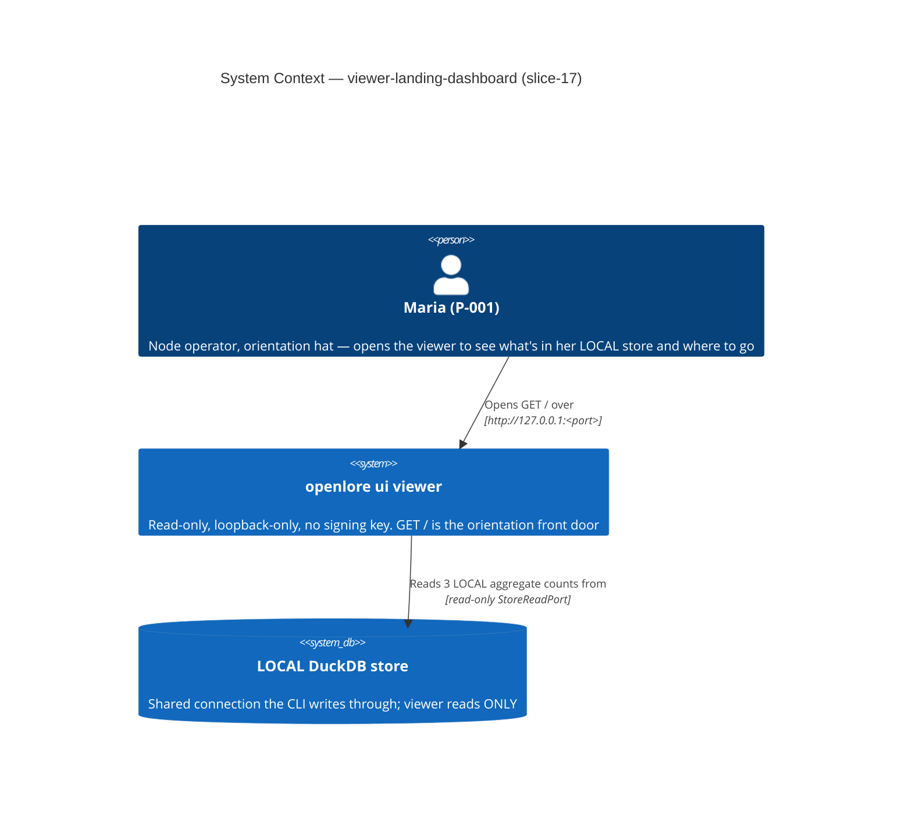
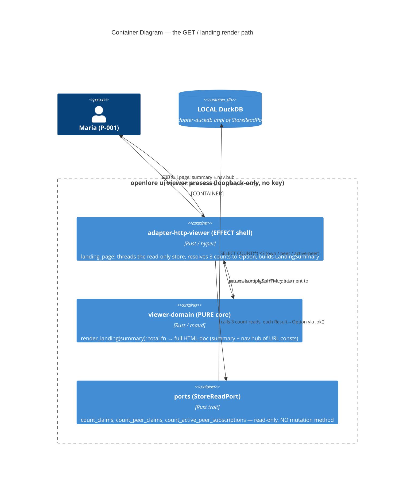

# Architecture Design: viewer-landing-dashboard (slice-17)

> Wave: DESIGN (lean) · Owner: Morgan (nw-solution-architect) · 2026-06-09
> Input: APPROVED DISCUSS (DoR 9/9). ADR: **ADR-054**.
> Brownfield DELTA on slices 06 (`render_landing`, `READ_ONLY_NOTICE`, `page_head`,
> URL consts) / 07 (`Shape::from_request` — NOT applied to `/`, see ADR-054 D5) /
> 15 (`list_active_peer_subscriptions`, the active-only `removed_at IS NULL` set).
> Paradigm: functional Rust (ADR-007) — pure render core, effect shell at the I/O edge.

## 1. Problem and approach (one paragraph)

`GET /` is the only viewer handler that takes no store; it renders an `<h1>`, the
`READ_ONLY_NOTICE`, and a single hardcoded `/claims` link. slice-17 threads the
read-only store the viewer ALREADY holds into `landing_page`, resolves THREE LOCAL
aggregate counts (own claims, peer claims, active peers) — each degrading
INDEPENDENTLY to a missing-number state on read failure — into an Option-shaped
`LandingSummary`, and passes it to the extended pure `render_landing(summary)`, which
adds the three-count summary + a navigation hub of plain `<a href>` links (one URL
const per surface) to all 8 shipped entry-point surfaces. No new route, no new crate,
no mutation method, no network. Architecture stays the slice-06/09 Hexagonal +
Modular Monolith (ADR-009): pure `viewer-domain` render, effect `adapter-http-viewer`
shell, read-only `StoreReadPort` over the shared DuckDB connection.

## 2. C4 — System Context (L1)

The landing makes NO outbound network request (C-2): no PDS, no DID re-resolution,
no peer pull, no CDN. The only external dependency is the LOCAL store, read-only.

## 3. C4 — Container (L2)

### Threading + degrade flow (the US-LD-000 plumbing)

1. Route arm: `"/" => Ok(landing_page(store.as_ref()))` (gains `store.as_ref()`;
   `shape` not threaded — full-page-only, ADR-054 D5).
2. `landing_page(store)` resolves three counts INDEPENDENTLY, each
   `Result<usize, StoreReadError> → Option<usize>` via `.ok()`:
   - `own_claims = store.count_claims().ok()`
   - `peer_claims = store.count_peer_claims().ok()`
   - `active_peers = store.count_active_peer_subscriptions().ok()`
3. Builds `LandingSummary { own_claims, peer_claims, active_peers }`.
4. Calls the pure `render_landing(&summary) -> String`; wraps in `html_ok(...)` (200).
5. A failed read → `None` for THAT count only; the hub + the other two counts still
   render; never a 5xx, never a fabricated 0 (ADR-054 D2 / I-LD-2).

## 4. C4 — Component (L3)

NOT produced. The slice touches ≤5 components across two crates with no internal
subsystem decomposition (one pure render fn + one effect handler + one count read +
the existing 7 consts + one new const). L1+L2 are sufficient (C4 mandatory minimum;
L3 reserved for 5+ internal components in a subsystem). This is the thinnest slice in
the viewer series.

## 5. Quality attributes (ISO 25010) addressed

| Attribute | Strategy | Where |
|---|---|---|
| Reliability (fault tolerance) | Per-count independent degrade via `.ok()`; a failed count → `None`, never a 5xx (ADR-048 precedent generalized) | shell D2 |
| Functional correctness | `0 ≠ missing` is type-level (`Option<usize>`); fabricated 0 unrepresentable | `LandingSummary` D1 |
| Performance efficiency | 3 aggregate `COUNT(*)` reads per render, invariant to store size; count-only active-subs avoids materializing rows | D3, no-N+1 |
| Security (read-only, no key) | `StoreReadPort` declares no mutation method; loopback-only bind; no key in process | C-1, 3-layer enforcement |
| Maintainability | All 8 hub links via URL consts (no drift); pure render is a total fn (unit/property-testable) | D4, D1 |
| Portability / offline | LOCAL DB reads only; vendored htmx, no CDN; renders network-down | C-2 |

## 6. No new external integration

This slice introduces NO external API, third-party service, or network seam. No
contract-test annotation applies (the only dependency is the LOCAL read-only store,
already covered by the existing store-readability startup probe, ADR-028). The
handoff to DISTILL/DEVOPS carries no new external-integration risk.
