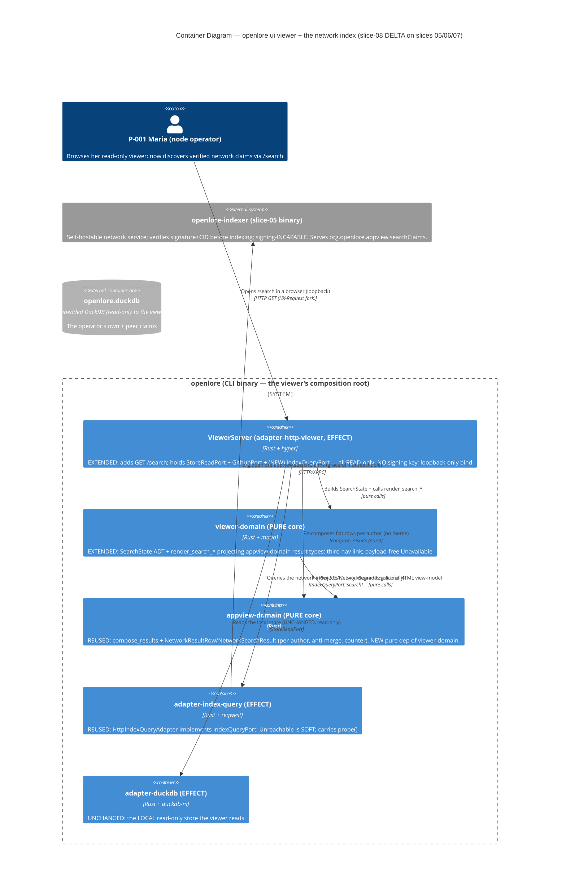
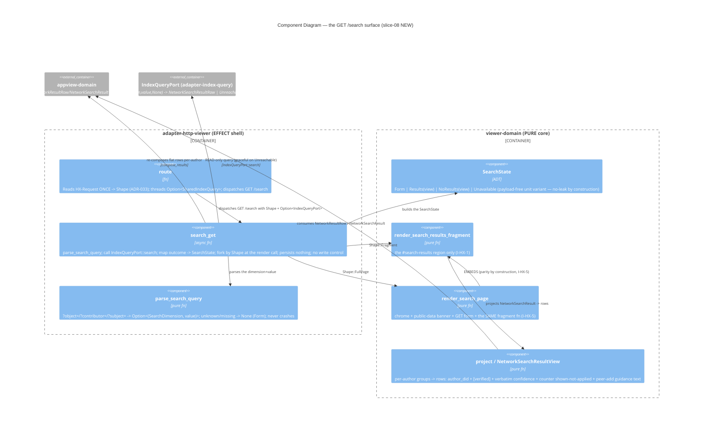

<!-- markdownlint-disable MD024 -->
# Feature Delta: viewer-network-search

> Wave: **DISCUSS** (lean mode + ask-intelligent)
> Feature type: User-facing (a new READ-ONLY browser view on the `openlore ui` viewer)
> Walking skeleton: Yes, thin (US-NS-001 + US-NS-002)
> UX depth: Lightweight (server-rendered maud HTML + htmx progressive enhancement — inherits slices 06/07)
> JTBD: YES — every story traces to **J-005** (`docs/product/jobs.yaml`); no new job created
> Brownfield DELTA on: `openlore-appview-search` (slice-05), `htmx-scraper-viewer` (slice-06), `viewer-htmx-swaps` (slice-07)
> Date: 2026-06-04 · Owner: Luna (nw-product-owner)

This file is the canonical DISCUSS-wave delta for `viewer-network-search`
(slice-08): a **network-search view** added to the read-only `openlore ui` viewer.
A `/search` route serves a form (pick a dimension + value); on submit the viewer
queries the slice-05 network indexer over HTTP (`org.openlore.appview.searchClaims`)
and renders **verified + attributed** network results as HTML, with an htmx fragment
swap (like `/scrape`). It is the **browser UI for `openlore search`** — the same
network discovery J-005 the slice-05 CLI delivered, now glanceable from the same
read-only viewer Maria already uses to inspect her store.

This is a DELTA. It REUSES the slice-05 verified-attributed search results + client
contract and the slice-06/07 page=chrome+fragment render pattern; it adds exactly
ONE new capability — an indexer-query effect in the viewer process (a network READ,
distinct from the read-only DuckDB store + the slice-06 GithubPort). Tier-1 content
is inlined here (lean); SSOT lives under `docs/product/`; per-slice briefs under
`slices/`; per-journey/registry artifacts under `discuss/`.

---

## Wave: DISCUSS / [REF] Persona ID

**P-001 Senior Engineer Solo Builder** ("Maria", the node operator) — the SAME
persona as slices 06/07 (`docs/product/personas/senior-engineer-solo-builder.yaml`).
She lives in a terminal but runs `openlore ui` to GLANCE at her store in a browser
(slice-06) and navigate it without reloads (slice-07). slice-08 extends that same
read-only viewer with a network-discovery surface: she can now discover signed
claims across the network — beyond her own claims and her manually-subscribed peers —
from the browser, without dropping back to the CLI.

slice-05 framed P-002 (Researcher/Tech Lead) as primary for the CLI discovery job;
the BROWSER viewer's operator, though, is P-001 (the viewer is her surface, slices
06/07). She wears the network-discovery hat at her own loopback viewer. UX guardrails
inherited: read-only, never silently mutate, confidence display must never read as
"the system thinks this is true."

---

## Wave: DISCUSS / [REF] JTBD One-Liner

> **J-005**: *When I am orienting a decision around a philosophy or project but do
> NOT already know which developers to follow, I want to discover the signed claims
> that exist across the whole network — verified and attributed — so I can find
> well-evidenced reasoning and the people behind it without first knowing whose DID
> to subscribe to.*

slice-08 is the **browser UI** for J-005 (validated in slice-05; opportunity score
15, `walking_skeleton_for: openlore-appview-search`). No new job. Every story below
traces to J-005 and its sub-jobs:

| Sub-job | Name | Stories |
|---|---|---|
| J-005a | Search by philosophy / subject / contributor at network scale | US-NS-002, US-NS-003 |
| J-005b | Index only signature-verified, attributed public claims | US-NS-001 (inherited — viewer renders already-verified results), US-NS-004 |
| J-005c | Turn a discovery into a follow (discovery feeds federation) | US-NS-004 (guidance text only — follow stays a CLI action) |

---

## Wave: DISCUSS / [REF] Locked Decisions

See `discuss/wave-decisions.md` for full rationale. Summary (WD-NS-*):

| # | Decision | Status |
|---|---|---|
| WD-NS-1 | Sibling feature; brownfield DELTA on slices 05/06/07; US-NS-001 is the thin walking skeleton. | LOCKED |
| WD-NS-2 | Persona = P-001 (Maria, the node operator) — the viewer's operator, wearing the network-discovery hat. | LOCKED |
| WD-NS-3 | Viewer stays **READ-ONLY**: search is a READ; no new write/sign/subscribe route; no key in the process; following stays a CLI action (the view may show `peer add` as guidance text, never execute it). Inherits I-VIEW-1/2/3 / KPI-VIEW-2 / KPI-HX-G3. | LOCKED |
| WD-NS-4 | **Graceful degradation**: an unreachable OR unconfigured indexer renders a fixed plain-language message (mirror the slice-07 `/scrape` `NetworkDown` unit-variant) — never crash/block/leak. Inherits WD-116 / KPI-5 / NFR-VIEW-6/7. | LOCKED |
| WD-NS-5 | **Verified + attributed display**: every row shows `[verified]` + `author_did`; `counter_annotation` SHOWN, never applied (anti-merging); confidence VERBATIM. No faceless consensus row. Inherits WD-103/104 / KPI-AV-2/3 / FR-VIEW-8. | LOCKED |
| WD-NS-6 | **Progressive enhancement**: `/search` serves a full page without `HX-Request`, a fragment of the same results region with it (slice-07 `Shape` fork). htmx stays local/offline for the chrome. Inherits I-HX-1..5 / KPI-HX-G1. | LOCKED |
| WD-NS-7 | **Zero new persisted types; loopback-only bind unchanged.** Results computed per-query, never persisted. Inherits BR-VIEW-2 / I-VIEW-1 / I-VIEW-4. | LOCKED |

---

## Wave: DISCUSS / [REF] Inherited Invariants (I-NS-* inheriting I-VIEW-* / I-HX-* / AV-*)

These are binding inputs to DESIGN; they are NOT relitigated here.

| ID | Inherits | Carries into slice-08 as |
|---|---|---|
| I-NS-1 | I-VIEW-1/2/3 (slice-06) / KPI-VIEW-2 | Read-only preserved: search is a READ; the viewer signs/writes/persists nothing, holds no signing key. The indexer-query port reads only the public index (no signing/identity/PDS surface — mirrors the slice-06 GithubPort capability boundary). |
| I-NS-2 | WD-116 / KPI-5 (slice-05) + NFR-VIEW-6/7 (slice-06) | Graceful degradation: an unreachable/unconfigured indexer renders a fixed plain-language guidance message; never a crash/hang/blank/stack-trace; never leaks transport internals (a payload-free `NetworkDown`-style render). |
| I-NS-3 | WD-103 / KPI-AV-2 (slice-05) / I-FED-1 | Anti-merging at network scale: every result row carries one `author_did` (non-Option, load-bearing); identical-content-different-author = two rows; no merged/consensus row; `counter_annotation` shown, never applied. |
| I-NS-4 | WD-104 / KPI-AV-3 (slice-05) | Verified display: every row carries `[verified]` (driven by `verified_against`), by construction — the indexer verified signature + recomputed CID BEFORE indexing; the viewer renders already-verified results (no second verification path in the viewer). |
| I-NS-5 | WD-105 / KPI-AV-5 (slice-05) | Public-data framing: the `/search` page surfaces, up front, that discovery indexes only PUBLIC signed claims verified before indexing; nothing private is read. |
| I-NS-6 | I-HX-1..5 / KPI-HX-G1 (slice-07) | Progressive enhancement: full page without `HX-Request`, fragment of the same results region with it; page = chrome + fragment; the two shapes agree by construction (the full page embeds the fragment fn). |
| I-NS-7 | I-HX-2 / KPI-HX-G2 (slice-07) | Offline / no-CDN for the chrome: htmx is the vendored, SHA-256-pinned local asset at `/static/htmx.min.js`; zero off-host references. (The search ITSELF needs the network — like `/scrape` — but the page chrome stays offline-capable.) |
| I-NS-8 | I-VIEW-4 (slice-06) / KPI-HX-G3 | Loopback-only bind unchanged (127.0.0.1); zero new persisted types (results computed per query). |
| I-NS-9 | FR-VIEW-8 (slice-06) | Confidence rendered VERBATIM (`0.90`, never `0.9`/`90%`) — the same `render_confidence` contract; confidence must never read as "the system thinks this is true." |

---

## Wave: DISCUSS / [REF] Story Map and Slicing

One journey: **discover-the-network-from-the-browser** (a single coherent surface;
the arc open `/search` → search by a dimension → see verified+attributed results →
trust them → know the next step is `peer add` in the CLI). Visual journey +
shared-artifacts registry under `discuss/` (placement mirrors slice-07).

Emotional arc: **cold-start-curiosity → reassured-by-verification → discovery-joy →
connected-but-grounded** — entry curious-but-wary (cares about a philosophy, follows
nobody who claims it; wary that a browser network view is "just another aggregator"),
through reassured (the public-data framing + `[verified]` markers + visible author
DIDs build trust), the discovery-joy peak (a relevant claim by an unfollowed author
appears in her browser), to connected-but-grounded (she knows the next step is a
deliberate CLI `peer add` — the viewer never silently follows for her).

Slicing (by outcome impact + risk, not feature grouping):

- **Release 1 (walking skeleton)** — `slices/slice-01-walking-skeleton.md`:
  US-NS-001 + US-NS-002. The thinnest end-to-end thread: verified, attributed
  search-by-philosophy results rendered in the browser from a reachable indexer,
  with the fragment swap. Validates the riskiest assumption (the new outbound
  capability works AND the read-only/verified/attributed/PE invariants hold on a
  network-READ surface).
- **Release 2 (dimensions + trust + degradation)** — `slices/slice-02-dimensions-and-trust.md`:
  US-NS-003 + US-NS-004. Completes contributor/subject dimensions; makes the trust
  surface (public-data framing, counter-shown-not-applied) and the failure surface
  (graceful degradation) honest; shows the `peer add` follow path as guidance text.

### Priority Rationale

Release 1 first because it carries the slice's riskiest assumption: that the viewer
can take on a NEW outbound network-query capability while preserving every cardinal
invariant (read-only, verified, attributed, progressive-enhancement). If Release 1
fails, the browser-discovery thesis is disproven and the read-only viewer's trust
model is at risk — everything else is moot. Release 2 completes the dimensions and
hardens trust/failure UX; its failure is survivable (the object dimension alone
still delivers discovery; degradation polish can iterate). Within Release 1,
US-NS-001 (the indexer-query capability) precedes US-NS-002 (the render) because the
render has nothing to show without the capability.

---

## Wave: DISCUSS / [REF] System Constraints (cross-cutting)

These hold across every story (the I-NS-* invariants, restated as build constraints):

- The viewer process holds **no signing key** and exposes **no write/sign/subscribe
  route**. The indexer-query effect reads only the public index (no signing/identity/
  PDS capability). (I-NS-1)
- Search results are **never persisted** and **never normalized**: a rendered field
  matches the author's published, verified record (inherits KPI-4). (I-NS-3/4, WD-NS-7)
- Every result is **`[verified]` by construction** (the indexer is the verify gate;
  the viewer does not re-verify and has no path to render an unverified result).
  (I-NS-4)
- Every result row is **attributed** (`author_did`); **no merged/consensus row**
  exists; `counter_annotation` is shown, never applied. (I-NS-3)
- Every route serves a **complete full page without `HX-Request`** (no-JS no-regression)
  and an offline-capable chrome (vendored htmx). (I-NS-6/7)
- An **unreachable/unconfigured indexer never crashes or leaks**; it renders a fixed
  plain-language message in both shapes. (I-NS-2)
- **Loopback-only bind** unchanged. (I-NS-8)

---

## Wave: DISCUSS / [REF] User Stories and Acceptance Criteria

All four stories trace to **J-005**. US-NS-001 is `@infrastructure` (the new
indexer-query capability) with rationale; the slice is NOT 100% `@infrastructure`
(3 user-visible stories). Full UAT below; AC derived per story.

### US-NS-001: Bootstrap the viewer's indexer-query capability (`@infrastructure`)

- **job_id**: `infrastructure-only`
- **infrastructure_rationale**: This story stands up the NEW outbound capability the
  viewer needs to reach the slice-05 indexer — an indexer-query effect in the viewer
  process (a public-data network READ, distinct from the read-only DuckDB store and
  the slice-06 GithubPort). It enables every user-visible story (US-NS-002/003/004)
  but renders no user-facing output on its own; the user decision it serves is made
  in those stories. The capability MUST hold no signing/identity/PDS surface (I-NS-1)
  and MUST degrade gracefully when the indexer is unreachable/unconfigured (I-NS-2).

#### Problem

The read-only viewer (slices 06/07) can read only the LOCAL DuckDB store and (for
`/scrape`) public GitHub. It has no way to reach the slice-05 network index, so the
browser cannot show network discovery at all. The capability must be added without
giving the viewer any write/sign capability or breaking the loopback-only, key-less,
read-only invariants.

#### Solution

Add an indexer-query effect to the viewer process: it reads the configured indexer
URL (`OPENLORE_INDEXER_URL`, the slice-05 env-var seam), queries
`org.openlore.appview.searchClaims` over HTTP along a dimension, and returns the
slice-05 attributed result rows for the render layer to compose. It holds no signing/
identity/PDS capability and, when the indexer is unreachable/unconfigured, returns a
typed unavailable outcome (never a crash). OD-NS-1: DESIGN decides whether this reuses
the slice-05 `adapter-index-query` client or is a new viewer-process port.

#### Domain Examples

1. **Reachable indexer** — `OPENLORE_INDEXER_URL=http://127.0.0.1:9444`; a query for
   object `org.openlore.philosophy.reproducible-builds` returns 12 attributed verified
   rows (9 distinct authors) for the render layer.
2. **Unconfigured indexer** — `OPENLORE_INDEXER_URL` unset; the capability returns the
   typed `unavailable` outcome (no network call attempted) so the render layer shows
   the guidance message — never a crash.
3. **Unreachable indexer** — `OPENLORE_INDEXER_URL` set but the connection is refused;
   the capability returns the same typed `unavailable` outcome (no leaked transport
   error string) — never a hang or stack trace.

#### UAT Scenarios (BDD)

##### Scenario: The browser viewer can query the network index
```
Given the viewer is configured with a reachable indexer URL
When the viewer queries the index for a philosophy along the object dimension
Then it receives the verified, attributed result rows the indexer holds
And the viewer process holds no signing key and exposes no write/sign route
```

##### Scenario: An unreachable or unconfigured indexer never crashes the viewer
```
Given the viewer is configured with no indexer URL (or an unreachable one)
When the viewer attempts a network query
Then it receives a typed "index unavailable" outcome
And no crash, hang, or raw transport error occurs in the viewer process
```

#### Acceptance Criteria

- [ ] The viewer process can query the configured indexer along a search dimension
      and obtain the slice-05 attributed verified result rows.
- [ ] The indexer-query capability holds no signing/identity/PDS surface (no key
      enters the viewer process; no new write/sign route exists).
- [ ] An unset or unreachable `OPENLORE_INDEXER_URL` yields a typed unavailable
      outcome — no crash, no hang, no leaked transport internals.

#### Technical Notes

- REUSE the slice-05 indexer query surface + `appview-domain` result types; do not
  rebuild verification (the indexer is the verify gate — I-NS-4).
- The viewer composition root already owns a tokio runtime (slice-06); the new
  effect rides it. OD-NS-1 / OD-NS-6 are DESIGN's (port shape, config surface).
- Dependencies: slice-05 `openlore-indexer` + `adapter-index-query` + `appview-domain`;
  slice-06 `ViewerServer`.

---

### US-NS-002: Search by philosophy in the browser, attribution preserved

- **job_id**: J-005 (sub-job J-005a)

#### Elevator Pitch

- **Before**: Maria can glance at her own store in the browser (slices 06/07), but to
  discover signed claims by people she does not follow she must drop to the CLI
  (`openlore search`).
- **After**: she opens `http://127.0.0.1:8080/search` in the viewer, picks "philosophy",
  enters `org.openlore.philosophy.reproducible-builds`, and sees a rendered results
  region — per-author groups, each row showing the author DID, the `[verified]` marker,
  and the verbatim confidence — e.g. *"12 signed claims across 9 distinct authors — all
  verified"*, with no merged "the network thinks X" row.
- **Decision enabled**: she decides which well-evidenced, verified reasoning (and which
  unfamiliar author) is worth pursuing — without first knowing whose DID to follow.

#### Problem

Maria cares about a philosophy but follows nobody who has claimed it. Her browser
viewer shows only her own + her subscribed peers' claims; a great signed claim by an
unknown author is invisible there. She wants to search the network by philosophy from
the same read-only browser surface she already trusts.

#### Who

- P-001 (Maria), node operator | at her loopback `openlore ui` viewer | wants
  network discovery without leaving the browser or compromising local-first.

#### Solution

A `/search` route: a form with a dimension selector (philosophy/object for this story)
and a value input. On submit, the viewer queries the indexer (US-NS-001 capability)
and renders the slice-05 per-author-attributed verified rows as HTML. Served as a full
page without `HX-Request`, and as a results-region fragment swap with it.

#### Domain Examples

1. **Happy path** — Maria searches object `org.openlore.philosophy.reproducible-builds`;
   the results region shows 3 author groups (`did:plc:priya-test`,
   `did:plc:bjorn-test`, `did:plc:maria` — her own), each row with `[verified]`,
   subject, and verbatim confidence `0.85`.
2. **Edge: identical content, two authors** — two different authors each claim
   `nixos/nixpkgs` embodies reproducible-builds at `0.90`; the view renders TWO rows
   under two author groups — never one merged row.
3. **Edge: htmx swap** — Maria (on a JS-enabled browser) re-submits; only the
   `#search-results` region swaps, the form stays put; the rows are identical to the
   full-page render.
4. **Boundary: no results / typo** — Maria searches `org.openlore.philosophy.reprducible`
   (typo); the results region shows a guided "no claims found for that philosophy"
   state (the slice-05 near-match suggestion is a DESIGN nicety, OD-NS-3), never a blank
   region or a crash.

#### UAT Scenarios (BDD)

##### Scenario: Discover verified claims by philosophy in the browser
```
Given Maria opens /search in her read-only viewer with a reachable indexer
And she selects the philosophy dimension and enters "org.openlore.philosophy.reproducible-builds"
When she submits the search
Then the results region shows the matching claims grouped by author
And each row shows the author DID, a [verified] marker, and the verbatim confidence
And no merged "network consensus" row appears
```

##### Scenario: The same results region swaps in place under htmx
```
Given Maria has JavaScript enabled in her browser
And she has run a philosophy search
When she submits a new philosophy search
Then only the search-results region updates (the form is preserved)
And the swapped rows are identical to the full-page render of the same search
```

##### Scenario: A philosophy with no network claims shows a guided empty state
```
Given Maria searches a philosophy that no indexed author has claimed
When she submits the search
Then the results region shows a plain-language "no claims found" guidance
And the viewer does not crash or show a blank region
```

#### Acceptance Criteria

- [ ] `GET /search` (no `HX-Request`) serves a full page with the dimension form.
- [ ] A philosophy submit renders per-author groups; each row shows `author_did`,
      `[verified]`, and verbatim confidence (`0.85`, not `0.9`/`90%`).
- [ ] Identical-content-different-author renders as two rows (no merge).
- [ ] The same submit with `HX-Request` returns only the results-region fragment,
      structurally identical to the full page's results region.
- [ ] A no-results search renders a guided empty state, not a blank region or crash.

#### Outcome KPIs

- **Who**: P-001 viewer operators · **Does what**: discover ≥1 verified claim by an
  unfollowed author from the browser `/search` · **By how much**: realizes KPI-AV-1
  on the browser surface (the slice's behavioral hypothesis) · **Measured by**: viewer
  search telemetry (unfollowed-author hits) · **Baseline**: 0 (no browser network search
  before slice-08).

#### Technical Notes

- REUSE `appview-domain::compose_results` + the slice-05 `NetworkResultRow` render;
  REUSE the slice-07 `Shape` fork + page=chrome+fragment pattern.
- OD-NS-2 (reuse `appview-domain` rendering vs a new viewer-domain fragment),
  OD-NS-4 (own route vs nav tab), OD-NS-5 (form UI) are DESIGN's.
- Dependencies: US-NS-001.

---

### US-NS-003: Search by contributor or subject in the browser

- **job_id**: J-005 (sub-job J-005a)

#### Elevator Pitch

- **Before**: the browser `/search` (US-NS-002) discovers by philosophy only; to survey
  a project or a developer's network trail Maria must use the CLI.
- **After**: she picks "contributor" and enters `github:priya` (or "subject" and
  `github:bazelbuild/bazel`) and sees the rendered results — for a contributor, one
  developer's verified trail under a single author DID with the footer *"one developer's
  reasoning trail, not a community consensus"*; for a subject, the project's claims
  grouped BY AUTHOR with no merged row.
- **Decision enabled**: she decides whether a specific developer's trail is worth following,
  or whether a project is broadly claimed by many authors — at network scale, from the browser.

#### Problem

Discovery by philosophy alone is one of three orienting surfaces. Maria also thinks in
terms of "what does THIS developer claim?" and "what is claimed about THIS project?" —
the contributor and subject dimensions slice-05 ships in the CLI but the browser does not.

#### Who

- P-001 (Maria), node operator | at her loopback viewer | thinks in contributor/subject
  terms as well as philosophy terms.

#### Solution

Extend the `/search` form's dimension selector with contributor and subject. The
contributor query resolves a handle/DID (the slice-05 convention) and renders the trail
under one author DID with the honesty footer; the subject query renders the project's
claims grouped by author (no consensus row).

#### Domain Examples

1. **Happy path (contributor)** — Maria searches contributor `github:priya`; the view
   shows 8 verified claims under `did:plc:priya-test#org.openlore.application`, with the
   "one developer's reasoning trail, not a community consensus" footer.
2. **Happy path (subject)** — Maria searches subject `github:bazelbuild/bazel`; the view
   shows 5 author groups (5 distinct authors who claimed something about bazel), each row
   `[verified]` — no "bazel: the network thinks X" merged row.
3. **Edge: absent contributor** — Maria searches contributor `github:nobody-here`; the
   results region names the queried handle with a plain-language "no claims for that
   contributor" state and NO near-match suggestion (an absent contributor is not a typo).

#### UAT Scenarios (BDD)

##### Scenario: Survey one developer's verified trail in the browser
```
Given Maria opens /search and selects the contributor dimension
And she enters "github:priya" with a reachable indexer
When she submits the search
Then the results region shows priya's verified claims under a single author DID
And a footer states this is one developer's reasoning trail, not a community consensus
```

##### Scenario: Survey a project at network scale, attribution preserved
```
Given Maria selects the subject dimension and enters "github:bazelbuild/bazel"
When she submits the search
Then the results region shows the claims grouped by their distinct authors
And no merged "the network thinks X about bazel" consensus row appears
```

##### Scenario: A contributor with no network claims shows a no-suggestion empty state
```
Given Maria searches a contributor handle that no indexed author matches
When she submits the search
Then the results region names the queried handle with a plain-language empty state
And offers no near-match suggestion (an absent contributor is not a typo)
```

#### Acceptance Criteria

- [ ] The `/search` form offers philosophy, contributor, and subject dimensions.
- [ ] A contributor search renders one author's trail under a single `author_did` with
      the "one developer's reasoning trail, not a community consensus" footer.
- [ ] A subject search renders N authors' rows grouped BY AUTHOR (no consensus row).
- [ ] An absent contributor renders a named, no-suggestion empty state.
- [ ] Both dimensions fork by `Shape` (fragment under `HX-Request`, full page without).

#### Outcome KPIs

- **Who**: P-001 viewer operators · **Does what**: survey a contributor's trail or a
  project at network scale from the browser · **By how much**: contributor/subject
  searches available in the browser surface (parity with CLI dimensions) · **Measured by**:
  viewer search telemetry by dimension · **Baseline**: 0 (object-only before this story).

#### Technical Notes

- REUSE the slice-05 handle→DID resolution + the contributor/subject query surface +
  the `EmptyPolicy::NoSuggestion` precedent.
- Dependencies: US-NS-002.

---

### US-NS-004: Trust a browser discovery — verified framing, honest degradation, follow guidance

- **job_id**: J-005 (sub-jobs J-005b display + J-005c follow-guidance)

#### Elevator Pitch

- **Before**: Maria sees rows in the browser but is unsure whether to trust them ("is this
  just another aggregator? is this tampered?"), and a flaky indexer could show her a crash
  or a leaked transport error.
- **After**: the `/search` page states up front that discovery indexes only PUBLIC signed
  claims verified before indexing; every row carries `[verified]` + the author DID; a
  countered claim SHOWS its counter-annotation (never silently applied); and when the
  indexer is unreachable she sees a calm plain-language message ("the network index is
  unavailable; your local store views still work") instead of a stack trace — plus, for an
  unfollowed author, the guidance text `openlore peer add <did>` she can run in the CLI.
- **Decision enabled**: she decides to ACT on a browser discovery (cite it, or follow the
  author via the CLI) with the same confidence she has in a self-pulled peer claim — instead
  of dismissing the browser view as aggregator noise.

#### Problem

A network-discovery view is only useful if it is trustworthy and fails honestly. Maria
needs the verified/public-data framing visible, the anti-merging guarantee visible
(counter shown not applied), and a degradation path that never crashes, never leaks, and
never silently follows on her behalf.

#### Who

- P-001 (Maria), node operator | at her loopback viewer | will not act on data she cannot
  trust, and will not tolerate a surface that crashes or follows without her say-so.

#### Solution

Add the up-front public-data framing to the `/search` page; render the `counter_annotation`
on a row when present (shown, never applied); render the fixed plain-language guidance when
the indexer is unreachable/unconfigured (mirror the slice-07 `/scrape` `NetworkDown`
unit-variant — no leaked transport internals — in both shapes); and show, for an unfollowed
author, the `openlore peer add <did>` guidance text as plain text (never an executable
control — the viewer stays read-only).

#### Domain Examples

1. **Happy path (trust framing)** — Maria opens `/search`; before any results she reads
   "Discovery indexes only PUBLIC signed claims, verified before indexing. Nothing private
   is read." Every result row carries `[verified]` + the author DID.
2. **Edge (counter shown, not applied)** — a result row for a claim Bjorn later countered
   shows the counter-annotation ("countered by did:plc:maria") inline; the claim is still
   shown verbatim and is NOT merged/over-ridden.
3. **Error (graceful degradation)** — Maria's indexer is down; she submits a search and the
   results region shows "The network index is unavailable, so no network results could be
   fetched. Your local store views still work." — no HTTP status, no "connection refused",
   no raw URL, no stack trace.
4. **Edge (follow is CLI-only)** — a result by `did:plc:priya-test` whom Maria does not
   follow shows the guidance text `openlore peer add did:plc:priya-test` (run it in the CLI)
   and NO clickable follow/subscribe control.

#### UAT Scenarios (BDD)

##### Scenario: The search page states what it indexes, up front
```
Given Maria opens /search in her read-only viewer
Then she sees, before any results, that discovery indexes only public signed claims verified before indexing
And every result row she later sees carries a verified marker and the author DID
```

##### Scenario: A countered claim is shown but never silently applied
```
Given a network result includes a claim that another author has countered
When the results render
Then the row shows the counter-annotation inline
And the original claim is still shown verbatim, not merged or over-ridden
```

##### Scenario: An unavailable index degrades to calm guidance, not a crash
```
Given Maria's configured indexer is unreachable (or unconfigured)
When she submits a network search
Then the results region shows a plain-language "index unavailable; your local store views still work" message
And no HTTP status, connection error, raw URL, or stack trace is shown
And the viewer does not crash or hang
```

##### Scenario: Following a discovered author stays a deliberate CLI action
```
Given a network result is by an author Maria does not yet follow
When the row renders
Then it shows the "openlore peer add <did>" guidance text to run in the CLI
And it shows no clickable follow or subscribe control (the viewer is read-only)
```

#### Acceptance Criteria

- [ ] The `/search` page shows the public-data framing before results (I-NS-5).
- [ ] Every result row carries `[verified]` + the author DID (I-NS-3/4).
- [ ] A row with a counter-annotation SHOWS it; the claim is not applied/merged (I-NS-3).
- [ ] An unreachable/unconfigured indexer renders the fixed plain-language guidance in
      BOTH fragment and full-page shapes; no leaked transport internals; no crash (I-NS-2).
- [ ] An unfollowed-author row shows `openlore peer add <did>` guidance TEXT and no
      executable follow control (WD-NS-3 / I-NS-1).

#### Outcome KPIs

- **Who**: P-001 viewer operators · **Does what**: act on a browser discovery (cite it or
  follow via CLI) instead of dismissing it as aggregator noise · **By how much**: realizes
  KPI-AV-3 (verified framing) + KPI-AV-5 (public-data comprehension) + the discovery→
  federation funnel (KPI-AV-4) on the browser surface · **Measured by**: viewer telemetry
  (search→`peer add` funnel) + day-30 comprehension prompt · **Baseline**: 0 (no browser
  discovery before slice-08).

#### Technical Notes

- REUSE the slice-07 `NetworkDown` ADT discipline (a payload-free variant that structurally
  cannot leak the raw error). The follow affordance is render-only guidance (mirrors the
  slice-05 `peer add` render-only hint; no parallel subscription state).
- OD-NS-3 (unreachable/unconfigured degradation UX wording placement) is DESIGN's.
- Dependencies: US-NS-002 (and US-NS-003 for the contributor/subject degradation pointers).

---

## Wave: DISCUSS / [REF] Outcome KPIs

slice-08 is a NEW SURFACE for slice-05's job; it REALIZES the existing KPI-AV-* on the
browser surface rather than minting new KPIs. Per-story KPIs above; cross-feature SSOT
in `docs/product/kpi-contracts.yaml` (KPI-AV-1..6, KPI-VIEW-2, KPI-HX-G1/2/3).

- **North star (inherited)**: KPI-AV-1 — ≥60% of discovery sessions surface ≥1 verified
  claim by an unfollowed author — now reachable from the browser viewer.
- **Guardrails (inherited, all release-blocking)**: KPI-AV-2 (anti-merging at network scale),
  KPI-AV-3 (verified-before-index / every row `[verified]`), KPI-VIEW-2 (read-only — zero
  write/sign route, zero key in the process), KPI-HX-G1 (no-JS no-regression — every route a
  full page without `HX-Request`), KPI-HX-G2 (offline/no-CDN chrome), KPI-5 (local-first).
- **Leading (inherited)**: KPI-AV-4 (discovery→federation funnel via CLI `peer add`),
  KPI-AV-5 (public-data framing comprehension).

A per-feature `outcome-kpis.md` is intentionally NOT duplicated (lean): the KPIs are the
inherited KPI-AV-* / KPI-VIEW-* / KPI-HX-* on a new surface. DEVOPS adds viewer-side
`/search` telemetry (dimension, unfollowed-author hits, search→`peer add` funnel) mirroring
the slice-05 CLI events; no new KPI IDs are minted unless dogfood reveals a browser-specific
behavior the CLI events miss.

---

## Wave: DISCUSS / [REF] Out of Scope

- **Any write/sign/subscribe affordance in the viewer** — the viewer stays read-only;
  following stays a deliberate CLI `openlore peer add` (the view shows it as guidance text).
- **A standalone web AppView application** — slice-08 is a render surface on the existing
  `openlore ui`, not a new app (the slice-05 OD-AV-6 "web AppView OUT of scope" line holds).
- **A browser shareable-link** equivalent to the CLI `--share` — deferred (CLI `--share`
  already realizes KPI-AV-6).
- **Persisting search results or relationship state** — computed per query (WD-NS-7).
- **Re-verifying claims in the viewer** — the indexer is the verify gate (I-NS-4); the
  viewer renders already-verified results.
- **Cross-user scoring / Firehose / retraction-aware search filters** — inherited
  deferrals from slice-05 (WD-108, OD-AV-7).

---

## Wave: DISCUSS / [REF] Walking Skeleton Strategy

US-NS-001 + US-NS-002 form the thin walking skeleton: from a reachable indexer,
`/search?object=<nsid>` WITH `HX-Request` renders the verified network result-rows
fragment in the browser. It is the thinnest end-to-end thread — viewer → indexer HTTP →
verified rows → HTML — touching exactly 4 integration points, 3 of which are REUSES:

1. the new `/search` route in the viewer (net-new),
2. the indexer-query effect (reuse the slice-05 client? — OD-NS-1),
3. the slice-05 `appview-domain` result composition (reuse),
4. the slice-07 fragment-render fork (reuse).

This validates the riskiest assumption first: that the read-only viewer can take on a
network-query capability while preserving read-only/verified/attributed/PE invariants.

---

## Wave: DISCUSS / [REF] Driving Ports (for DESIGN)

The viewer's `/search` surface is driven through (names indicative; DESIGN owns shapes):

- **An indexer-query effect port** (new outbound capability; OD-NS-1): viewer process →
  indexer HTTP (`org.openlore.appview.searchClaims`); returns the slice-05 attributed
  result rows or a typed `unavailable` outcome. Holds NO signing/identity/PDS surface
  (mirror the slice-06 GithubPort capability boundary). Ships a `probe()` (ADR-009 / I-4).
- **The existing `StoreReadPort`** (slice-06): unchanged; the relationship-label projection
  (subscribed-peer vs unfollowed) reads the local subscriptions — DESIGN decides whether the
  viewer surfaces that label and from which read.
- **The pure `appview-domain` composition** (slice-05, reused): `compose_results` (per-author
  grouping, no merge) + the `NetworkResultRow` / `NetworkSearchResult` types.
- **The pure render layer** (OD-NS-2: reuse the slice-05 render vs a new `viewer-domain`
  fragment): the `/search` full page (chrome + form + results region) and the
  results-region fragment, forked by `Shape::from_request` (slice-07).

---

## Wave: DISCUSS / [REF] Pre-requisites and Open Decisions for DESIGN

Pre-requisites (all SHIPPED, inherited):

- slice-05 `openlore-indexer` + `adapter-index-query` + `appview-domain` + the
  `org.openlore.appview.searchClaims` query surface + `OPENLORE_INDEXER_URL` seam.
- slice-06 `adapter-http-viewer` (`ViewerServer`, route table, `html_ok`, loopback bind) +
  `viewer-domain` render pattern + the `/scrape` GithubPort capability-boundary precedent.
- slice-07 `Shape::from_request` fork + page=chrome+fragment + vendored htmx asset.

Open Decisions (OD-NS-*) — DESIGN owns:

| ID | Decision | Default lean |
|---|---|---|
| OD-NS-1 | Indexer-query port shape: a NEW viewer-process effect port, vs reuse the slice-05 `adapter-index-query` client directly. | Recommend REUSE the slice-05 client behind a thin viewer-process port (no second query path); it MUST hold no signing/identity/PDS surface. |
| OD-NS-2 | Result rendering: reuse `appview-domain`'s `NetworkResultRow` rendering, vs a new `viewer-domain` HTML fragment. | Recommend a new `viewer-domain` fragment that PROJECTS the `appview-domain` result types (the CLI render is stdout text; the browser needs HTML) — reusing the composition, not the text renderer. |
| OD-NS-3 | Unreachable/unconfigured degradation UX: wording + placement (results-region message vs page-level banner). | Recommend a fixed results-region `NetworkDown`-style message (mirror slice-07 `/scrape`); no leaked transport internals; both shapes. |
| OD-NS-4 | `/search` as its own route, vs a tab in the existing My/Peer nav. | Recommend its OWN route `/search` (the network corpus is distinct from the local-store tabs); DESIGN may add it to the nav as a third link. |
| OD-NS-5 | The search form UI: dimension selector (radio/select) + value input; GET-query vs POST-form. | Recommend a GET form (`/search?<dim>=<value>`) so a search is bookmarkable/shareable as a URL and the no-JS path is a plain navigation (consistent with slice-07 `hx-push-url`). |
| OD-NS-6 | Indexer URL config surface in the viewer: env-var only (`OPENLORE_INDEXER_URL`), vs `[appview] indexer_url` config, vs a viewer flag. | Recommend reuse the slice-05 resolution (config `[appview] indexer_url` with the env-var seam) — one source of truth for "where is the index". |

---

## Wave: DISCUSS / [REF] Definition of Ready validation

| DoR item | US-NS-001 | US-NS-002 | US-NS-003 | US-NS-004 |
|---|---|---|---|---|
| 1. Problem statement clear, domain language | PASS (infra rationale) | PASS | PASS | PASS |
| 2. Persona with specific characteristics | n/a (infra) | PASS (P-001 Maria) | PASS (P-001) | PASS (P-001) |
| 3. ≥3 domain examples with real data | PASS (3) | PASS (4) | PASS (3) | PASS (4) |
| 4. UAT in Given/When/Then (3-7) | PASS (2 — narrow infra surface) | PASS (3) | PASS (3) | PASS (4) |
| 5. AC derived from UAT | PASS | PASS | PASS | PASS |
| 6. Right-sized (1-3 days, 3-7 scenarios) | PASS (1.5d, 2) | PASS (2d, 3) | PASS (2d, 3) | PASS (1.5d, 4) |
| 7. Technical notes: constraints/dependencies | PASS | PASS | PASS | PASS |
| 8. Dependencies resolved or tracked | PASS (slice-05/06 shipped) | PASS (US-NS-001) | PASS (US-NS-002) | PASS (US-NS-002/003) |
| 9. Outcome KPIs defined with measurable targets | n/a — supports KPI-AV-1..5 | PASS (KPI-AV-1) | PASS (KPI-AV-1 by dimension) | PASS (KPI-AV-3/4/5) |

**Overall DoR status: PASSED** for all stories.

Notes:
- US-NS-001 ships 2 composite scenarios (narrow infra surface) — same pattern as the
  infra story in every prior slice (US-AV-001 etc.). Flagged for reviewer judgment; PASS.
- US-NS-001 is `infrastructure-only` with `infrastructure_rationale`; the slice is NOT
  100% `@infrastructure` (3 user-visible stories) — passes Dimension 0 §5.

### Elevator Pitch verification (BLOCKING per Dimension 0)

| Story | Section present? | Real entry point? | Concrete output? | Job connection? | Verdict |
|---|---|---|---|---|---|
| US-NS-001 | n/a (@infrastructure with rationale) | n/a | n/a | n/a (`infrastructure-only`) | PASS via rationale |
| US-NS-002 | YES (Before/After/Decision) | YES (`GET http://127.0.0.1:8080/search?object=...` in the browser) | YES (rendered per-author groups + `[verified]` + verbatim confidence, no merged row) | YES (decide which verified reasoning/unfollowed author to pursue) | PASS |
| US-NS-003 | YES | YES (`/search?contributor=github:priya` / `?subject=github:bazelbuild/bazel`) | YES (one author's trail + "not a community consensus" footer / N-author subject survey) | YES (decide whether a developer's trail or a project is worth pursuing) | PASS |
| US-NS-004 | YES | YES (the `/search` page framing + a result row + the degradation message) | YES (public-data framing + `[verified]` + counter shown-not-applied + plain-language degradation + `peer add` guidance text) | YES (act on a browser discovery with peer-claim confidence, or dismiss aggregator noise) | PASS |

Slice-level Elevator Pitch check (Dimension 0 §5): 3 user-visible stories + 1 infra. Slice
is NOT 100% `@infrastructure`. PASS.

---

## Wave: DISCUSS / [REF] Definition of Done (9-item, for DISTILL→DELIVER)

PO defines; acceptance-designer enforces at DISTILL→DELIVER.

1. All UAT scenarios (US-NS-001..004) pass green as executable acceptance tests.
2. All supporting unit/integration/component tests pass (incl. the render fork + the
   indexer-query port `probe()`).
3. **Read-only enforced** (KPI-VIEW-2 / I-NS-1): route inventory shows no new write/sign
   route; key-access audit shows zero key reads in the viewer process; the indexer-query
   port holds no signing/identity/PDS surface.
4. **No-JS no-regression** (KPI-HX-G1 / I-NS-6): `/search` serves a complete full page
   without `HX-Request`; the slice-06/07 corpus stays green.
5. **Offline/no-CDN chrome** (KPI-HX-G2 / I-NS-7): the `/search` page references only the
   vendored local htmx asset; zero off-host references.
6. **Verified + attributed** (KPI-AV-2/3 / I-NS-3/4): every rendered row carries `[verified]`
   + `author_did`; identical-content-different-author = two rows; no merged row; counter
   shown-not-applied.
7. **Graceful degradation** (I-NS-2): an unreachable/unconfigured indexer renders the fixed
   plain-language guidance in both shapes; no leaked internals; no crash.
8. **Loopback-only bind + zero new persisted types** (I-NS-8 / WD-NS-7) verified.
9. Code refactored, reviewed, merged to main, demonstrable in a single session (open
   `openlore ui`, search a philosophy in the browser, see verified attributed rows).

---

## Wave: DISCUSS / [REF] Handoff

### To DESIGN (nw-solution-architect)

- Read: this `feature-delta.md`; `discuss/wave-decisions.md`;
  `slices/slice-01-walking-skeleton.md`; `slices/slice-02-dimensions-and-trust.md`;
  `docs/product/jobs.yaml` (J-005); the slice-05 design (`docs/feature/openlore-appview-search/design/`)
  for the indexer query surface + `appview-domain` types; the slice-06/07 viewer crates
  (`adapter-http-viewer`, `viewer-domain`) for the route table + `Shape` fork.
- Decide: OD-NS-1..6 (indexer-query port shape, render reuse vs new fragment, degradation UX,
  route vs tab, form UI/GET-vs-POST, config surface). Likely a new ADR for the viewer's
  outbound indexer-query capability (after the latest viewer ADR).
- Constraints inherited (DO NOT relitigate without returning to PO): WD-NS-3 (read-only,
  follow stays CLI), WD-NS-4 (graceful degradation), WD-NS-5 (verified+attributed,
  counter-shown-not-applied), WD-NS-6 (progressive enhancement), WD-NS-7 (nothing persisted,
  loopback bind) + the I-NS-1..9 invariants.

### To DEVOPS (nw-platform-architect, parallel)

- Read: this file's Outcome KPIs section + the slice-05 `kpi-instrumentation.md`.
- Deliver: viewer-side `/search` telemetry mirroring the slice-05 CLI events (search by
  dimension, unfollowed-author hits for KPI-AV-1, search→`peer add` funnel for KPI-AV-4) —
  privacy-preserving (structural counts + DIDs the user already saw, never claim contents).
  Confirm the new outbound indexer-query adds no dependency to the local-first flows
  (offline compose/sign unchanged) and the viewer stays loopback-only.

### To DISTILL (nw-acceptance-designer)

- Read: this file's User Stories section (UAT per story) + `discuss/wave-decisions.md` +
  the two slice briefs.
- Build executable acceptance tests: browser search by philosophy/contributor/subject
  (attributed, `[verified]`, no merged row); fragment-vs-full-page parity under `HX-Request`;
  graceful degradation (unreachable/unconfigured → fixed message, no leak, no crash);
  read-only invariants (no write/sign route, no key, no executable follow control); counter
  shown-not-applied. Reuse the slice-05 verified/attributed fixtures + the slice-07 htmx
  shape-fork harness.

---

## Wave: DESIGN / [REF] Application Architecture Overview

> Wave: **DESIGN** · Architect: Morgan (nw-solution-architect) · Date: 2026-06-04
> Style: Hexagonal (Ports + Adapters), Modular Monolith — UNCHANGED (inherits ADR-009)
> Paradigm: Functional Rust — pure core / effect shell — LOCKED (ADR-007; not relitigated)
> Extends: slice-05 (`openlore-appview-search`) + slice-06 (`htmx-scraper-viewer`) + slice-07 (`viewer-htmx-swaps`)
> Proposes: **ADR-036** (viewer index-query port + capability boundary), **ADR-037** (`SearchState` ADT + `viewer-domain` projection + degradation), **ADR-038** (`GET /search` route + GET form + nav + config reuse)

slice-08 is an **additive render surface**, not a re-architecture. It introduces
**exactly ONE new capability** in the viewer process — an outbound public-data
index READ — and reuses everything else: the slice-05 query path
(`IndexQueryPort` + `HttpIndexQueryAdapter`), the slice-05 pure composition
(`appview-domain::compose_results` + `NetworkResultRow`/`NetworkSearchResult`), and
the slice-06/07 viewer render pattern (`viewer-domain` maud, the `Shape` fork, page
= chrome + fragment, the vendored htmx asset).

No new binary, no new architectural STYLE, no new persisted type, no new
cross-process boundary (the indexer + its XRPC contract already exist from
slice-05). The work is: wire the existing read-only query adapter into the viewer's
composition root, add a pure `viewer-domain` HTML projection of the existing result
types, and add one `GET /search` route that forks by `Shape`.

### Quality-attribute drivers (priority order; from the I-NS-* invariants + KPIs)

| # | Quality (ISO 25010) | Driver | Architectural response |
|---|---|---|---|
| 1 | **Security / no-key** (confidentiality, integrity) — viewer holds no signing surface | WD-NS-3 / I-NS-1 / KPI-VIEW-2 | Reuse `IndexQueryPort` (read-only by construction — NO sign/write method, type-level); wire it like the slice-06 `GithubPort` capability boundary; no new write/sign/subscribe route; follow is render-only TEXT. Enforced by `xtask check-arch` (ADR-036/038). |
| 2 | **Reliability** (fault tolerance, recoverability) — never crash/hang/leak on a down index | WD-NS-4 / I-NS-2 / KPI-5 | A payload-free `SearchState::Unavailable` unit variant (mirrors `ScrapeState::NetworkDown`) — no-leak STRUCTURAL; soft `IndexQueryError::Unreachable` maps to it; both shapes; viewer startup soft-probes the index (never refuses) (ADR-036/037). |
| 3 | **Functional suitability** (correctness) — verified + attributed, anti-merging | WD-NS-5 / I-NS-3/4/9 / KPI-AV-2/3 | REUSE `appview-domain::compose_results` + non-`Option` `author_did` rows; no second verification/grouping path; `counter_annotation` shown-not-applied; confidence verbatim via the existing `render_confidence` (ADR-037). |
| 4 | **Usability** (operability, accessibility) — works without JS, bookmarkable | WD-NS-6 / I-NS-6/7 | `GET /search` serves a full page without `HX-Request` and the same results-region fragment with it (page = chrome + fragment, ADR-032/033); GET form → a shareable/bookmarkable URL; offline/vendored htmx chrome (ADR-031/038). |
| 5 | **Maintainability** (modularity, reusability, testability) | inherits ADR-007/009 | One outbound query path workspace-wide; the new render is the symmetric counterpart to `ScrapeState`/`render_scrape_*`; the `Arc<dyn IndexQueryPort>` + `FakeIndexQuery` seam keeps the handler driveable by DISTILL. |

### Existing-system reuse (the "no existing alternative" justification, per principle 5)

| Concern | Existing component REUSED | New work |
|---|---|---|
| Outbound index query | `ports::IndexQueryPort` + `adapter-index-query::HttpIndexQueryAdapter` (slice-05) | NONE — wired into the viewer composition root (ADR-036) |
| Result composition (per-author, anti-merge, counter) | `appview-domain::{compose_results, NetworkResultRow, NetworkSearchResult}` (slice-05) | NONE — consumed as a pure dep of `viewer-domain` |
| Indexer URL config | `[appview] indexer_url` + `OPENLORE_INDEXER_URL` seam (slice-05) | NONE — same resolution (OD-NS-6) |
| HTML render core | `viewer-domain` maud + `page_head`/`htmx_script`/`render_tab_nav`/`render_confidence` (slice-06/07) | NEW `SearchState` ADT + `render_search_*` projection (ADR-037) |
| `Shape` fork + page=chrome+fragment | `Shape::from_request` + the ADR-032/033 split (slice-07) | NONE — `/search` reuses it |
| Degradation discipline | `ScrapeState::NetworkDown` unit-variant pattern (slice-07) | NEW `SearchState::Unavailable` unit variant (same shape) |
| HTTP route table + capability wiring | `adapter-http-viewer::route` + the `Option<SharedGithub>` thread (slice-06/07) | NEW `GET /search` handler + `Option<SharedIndexQuery>` thread (ADR-038) |

---

## Wave: DESIGN / [REF] Resolved Open Decisions (OD-NS-1..6)

All six reviewer-recommended answers ADOPTED; no deviations.

| ID | Decision | Resolution | ADR |
|---|---|---|---|
| **OD-NS-1** | Indexer-query port shape | **REUSE** the slice-05 `IndexQueryPort` + `HttpIndexQueryAdapter` behind the viewer composition root — ONE query path, public-data READ only, NO signing/identity/PDS surface (mirrors the slice-06 `GithubPort` boundary). Wired as `Option<Arc<dyn IndexQueryPort>>` like `GithubPort`. | ADR-036 |
| **OD-NS-2** | Result rendering | **NEW pure `viewer-domain` projection** of the `appview-domain` result types into HTML — REUSE the composition (`compose_results`, per-author grouping, anti-merging, verified/attributed/counter), NOT the CLI stdout text renderer. | ADR-037 |
| **OD-NS-3** | Degradation UX | A **fixed results-region `Unavailable` message** (payload-free unit variant, mirrors `ScrapeState::NetworkDown` — structurally cannot leak transport internals); BOTH shapes; covers unreachable AND unconfigured. | ADR-037 |
| **OD-NS-4** | Route placement | Its **OWN route `GET /search`** (distinct corpus = the network index, not the local store); added to the nav as a **third link** alongside My Claims / Peer Claims. | ADR-038 |
| **OD-NS-5** | Form + verb | A **GET form** (`/search?<dimension>=<value>`, dimensions object/contributor/subject) → bookmarkable/shareable URL + plain no-JS navigation; htmx fragment fork via `HX-Request` + `hx-push-url` (slice-07 pattern). | ADR-038 |
| **OD-NS-6** | Config surface | **REUSE** the slice-05 indexer-URL resolution (`[appview] indexer_url` + `OPENLORE_INDEXER_URL`) — one source of truth. | ADR-036 |

---

## Wave: DESIGN / [REF] Component Boundaries (DELTA on slices 05/06/07)

slice-08 EXTENDS three existing crates and adds ZERO new crates. No new binary, no
new port (the `IndexQueryPort` exists), no new persisted type.

| Crate | Kind | Status | slice-08 delta |
|---|---|---|---|
| `crates/ports` | PURE | UNCHANGED | `IndexQueryPort` + `NetworkSearchResultRaw`/`NetworkResultRowRaw` already shipped (slice-05). No change. |
| `crates/appview-domain` | PURE | UNCHANGED | `compose_results` + `NetworkResultRow`/`NetworkSearchResult` reused as-is. Becomes a NEW pure dependency of `viewer-domain`. No change to its own surface. |
| `crates/adapter-index-query` | EFFECT | UNCHANGED | `HttpIndexQueryAdapter` + its `probe()` reused verbatim. The viewer composition root wires it (via `cli`). |
| `crates/viewer-domain` | PURE | **EXTENDED** | NEW: `SearchState` ADT (`Form \| Results \| NoResults \| Unavailable`); `NetworkSearchResultView` view-model projecting `NetworkSearchResult`; `render_search_results_fragment` + `render_search_page` (chrome + fragment); `SEARCH_RESULTS_ID`, `SEARCH_UNAVAILABLE_NOTICE`, the public-data banner constant, the `peer add` guidance helper; `render_tab_nav` gains a third `/search` link. Takes a NEW pure dep on `appview-domain`. (ADR-037) |
| `crates/adapter-http-viewer` | EFFECT | **EXTENDED** | NEW: `GET /search` handler (`search_get`) — parse dimension+value, call `IndexQueryPort`, map outcomes to `SearchState`, fork by `Shape`; `ViewerServer` gains an `Option<SharedIndexQuery>` field + a `bind_with_*` constructor; the `route` fn threads it. Persists nothing; renders no write control. (ADR-038) |
| `crates/cli` | DRIVER | **EXTENDED** | The `ui` verb (the viewer's composition root) wires `HttpIndexQueryAdapter` into the `ViewerServer` and SOFT-probes it (informational, never a startup refusal). Still holds NO signing key in the viewer surface. (ADR-036) |
| `xtask` | tooling | **EXTENDED** | ADD `viewer-domain → appview-domain` to the pure-core dependency allowlist (pure→pure edge); CONFIRM/EXTEND the viewer capability rule admits `IndexQueryPort` (read-only) for `adapter-http-viewer`/`viewer-domain` and still FORBIDS any signing/identity/PDS + the indexer SERVER/store/ingest crates. `check-probes` unchanged (the reused `IndexQueryPort` already has a non-stub probe). (ADR-038) |

### Composition-root wiring (the viewer `ui` verb — extends slice-06)

```text
fn ui(cfg) -> ExitCode {                                  // crates/cli — the viewer composition root
    // WIRE: read-only store + (optional) GithubPort (slice-06) + (NEW) read-only index-query client
    let store    = DuckDbStorageAdapter::open(&cfg.storage_path)?;        // StoreReadPort (read-only)
    let github   = cfg.scrape.then(|| GithubAdapter::new(...));           // GithubPort (public READ)
    let index_q  = HttpIndexQueryAdapter::new(resolve_indexer_url(&cfg)); // IndexQueryPort (public READ); ADR-036/OD-NS-6
    let server   = ViewerServer::bind_with(addr, store, github, index_q)?;

    // PROBE: store/loopback HARD-probe (ADR-028, unchanged); index_q is SOFT (KPI-5 / I-NS-2)
    if let Err(refused) = server.probe(&store_path) { emit(refused); return ExitCode::from(2); }
    let _ = index_q_soft_probe();   // informational only — an unreachable indexer MUST NOT block startup

    // USE: serve. NO signing key in this process (I-NS-1). Loopback-only (I-NS-8).
    runtime.block_on(server.serve())
}
```

The viewer composition root wires NO signing identity and NO PDS-write surface — it
holds `StoreReadPort` + `GithubPort` + `IndexQueryPort`, all read-only by
construction. The `cli` crate MUST NOT link `adapter-xrpc-query-server` /
`adapter-index-store` / `adapter-atproto-ingest` into the viewer surface (the
indexer-internal crates) — those belong to the `openlore-indexer` binary (ADR-023).

---

## Wave: DESIGN / [REF] Data Flow — `GET /search`

```text
Browser ──GET /search?object=org.openlore.philosophy.reproducible-builds──▶ adapter-http-viewer::route
                                                                              │  Shape::from_request (HX-Request? — ADR-033)
                                                                              ▼
                                                                         search_get(index_query, query, shape)
   parse_search_query(query) ──▶ Some((Object, value))  │  None ──▶ SearchState::Form
                                       │
                                       ▼
   index_query: None ──▶ SearchState::Unavailable        (unconfigured — ADR-036/037)
   Some(iq).search(dim, value, None).await   [adapter-index-query → indexer XRPC org.openlore.appview.searchClaims]
        │
        ├─ Err(Unreachable{..}) / Err(_) ──▶ SearchState::Unavailable          (payload DISCARDED — no leak, I-NS-2)
        ├─ Ok(raw) raw.results.is_empty() ──▶ SearchState::NoResults(view)     (guided empty; suggestion per dimension)
        └─ Ok(raw) ──▶ compose_results(rows, dim)  [appview-domain PURE: per-author, no merge, counter kept]
                          │
                          ▼
                     project(NetworkSearchResult) ──▶ SearchState::Results(view)
                                       │
                                       ▼
   match shape {  Fragment ──▶ render_search_results_fragment(&state)   (#search-results region only — I-HX-1)
                  FullPage ──▶ render_search_page(&state)               (chrome + banner + form + the SAME fragment fn — I-HX-5) }
                                       │
                                       ▼
                               html_ok(body)  ──▶ 200 text/html ──▶ Browser
```

Read-only: the only port called is `IndexQueryPort::search` (no write method
exists). Persists nothing. The composition is the slice-05 pure core; the viewer
adds only the HTML projection + the `Shape` fork.

---

## Wave: DESIGN / [REF] C4 — Container + Component View

### C4 Level 2 — Containers (DELTA: the viewer gains ONE read-only outbound edge)



What changed from slice-07's L2: the `ViewerServer` gains ONE read-only outbound
edge to the slice-05 indexer (via the reused `adapter-index-query`), and
`viewer-domain` gains a pure dependency on `appview-domain`. The viewer still holds
no signing key, binds loopback-only, and persists nothing.

### C4 Level 3 — Component view of `GET /search` (the one new surface)



---

## Wave: DESIGN / [REF] Route and Handler Design

| Aspect | Decision | Invariant |
|---|---|---|
| Route | `GET /search` — its own route (OD-NS-4) | distinct network corpus vs local store |
| Form | GET `<form method="get" action="/search">`: dimension selector (object/contributor/subject) + value input; JS: `hx-get="/search"` + `hx-target="#search-results"` + `hx-push-url="true"` (OD-NS-5) | I-NS-6 (PE); I-AV-8 spirit (bookmarkable) |
| Shape fork | `Shape::from_request` read ONCE in `route` (ADR-033); the handler forks ONLY at the render call | I-NS-6; no new data routes keyed on the header |
| `SearchState` arms | `Form` (no network call) · `Results` (>=1 row) · `NoResults` (guided empty, dimension-aware suggestion) · `Unavailable` (payload-free) | I-NS-2; ScrapeState parity |
| Degradation | `Err(Unreachable)`/`Err(_)`/no-indexer-wired → `SearchState::Unavailable` (fixed notice, results region, both shapes) | I-NS-2 / WD-NS-4; no-leak structural |
| Public-data framing | banner in page chrome, shown before results on `Form`+`Results` | I-NS-5 |
| Follow affordance | render-only `openlore peer add <did>` TEXT on an unfollowed-author row; no `<button>`/`<form>`/`hx-*` | I-NS-1 / WD-NS-3 |
| Persistence | none — computed per query | I-NS-8 / WD-NS-7 |
| Config | `[appview] indexer_url` + `OPENLORE_INDEXER_URL` (OD-NS-6) | one source of truth |

---

## Wave: DESIGN / [REF] Inherited + Carried Invariants (I-NS-*) — structural guarantees

How each cardinal invariant is structurally guaranteed by the design (not merely intended):

| I-NS-* | Guarantee mechanism (structural) | Enforcement layer(s) |
|---|---|---|
| **I-NS-1 read-only / no key** | `IndexQueryPort` has NO sign/write/publish method (type-level); the viewer composition root wires no signing identity/PDS; `/search` is a GET with no write side; follow is a text node, not a control. | TYPE (no write method on the port) + STRUCTURAL (`xtask check-arch` viewer capability rule: no signing/identity/PDS, no indexer SERVER/store/ingest crates) + BEHAVIORAL (DISTILL: route inventory + key-access audit show zero write/sign route, zero key reads) |
| **I-NS-2 graceful degradation** | `SearchState::Unavailable` is a UNIT variant — no payload to interpolate, so no HTTP status/URL/error/stack-trace can leak; the single pinned `SEARCH_UNAVAILABLE_NOTICE`; both shapes fork identically; `IndexQueryError::Unreachable` is SOFT (never a startup refusal). | TYPE (unit variant) + STRUCTURAL (one pinned notice constant) + BEHAVIORAL (DISTILL: down/unconfigured indexer → fixed message, no leak, no crash, both shapes) |
| **I-NS-3 anti-merging** | `NetworkResultRow.author_did` is non-`Option`; `compose_results` returns `by_author: Vec<(Did, Vec<…>)>` with no merged-row API; the viewer REUSES it (no second grouping path); `counter_annotation` is rendered, never filtered. | TYPE (non-`Option` author_did; no merged-row API) + STRUCTURAL (reuse — no viewer-side grouping) + BEHAVIORAL (DISTILL: identical-content-different-author = two rows; no consensus row; counter shown) |
| **I-NS-4 verified display** | every row carries `verified_against` (never empty), driving `[verified]`; the indexer is the verify gate (slice-05 I-AV-1); the viewer has NO second verification path. | TYPE (`verified_against` non-empty) + BEHAVIORAL (DISTILL: every row `[verified]` by construction; no unverified state exists) |
| **I-NS-6 progressive enhancement** | `render_search_page` EMBEDS `render_search_results_fragment` (page = chrome + fragment); the no-`HX-Request` request gets the full page; the `HX-Request` request gets the same region. | STRUCTURAL (the page embeds the fragment fn — parity by construction) + BEHAVIORAL (DISTILL: fragment vs full-page parity under `HX-Request`) |
| **I-NS-7 offline chrome** | the page emits the SAME single vendored `<script src="/static/htmx.min.js">` (ADR-031); zero off-host references; only the SEARCH needs the network. | STRUCTURAL (the shared `htmx_script` fn + the SHA-256-pinned asset) + BEHAVIORAL (DISTILL: zero off-host references) |
| **I-NS-8 zero new persisted types / loopback** | the handler computes the result per query and renders it; nothing is written; `ViewerServer::bind` still refuses non-loopback (ADR-028, unchanged). | TYPE (no new persisted type) + STRUCTURAL (no store-write call in the path; loopback bind guard unchanged) |
| **I-NS-9 confidence verbatim** | rows render confidence through the EXISTING `render_confidence` (`{:.2}`) — `0.90`, never `0.9`/`90%`. | STRUCTURAL (one `render_confidence` site, reused) + BEHAVIORAL (DISTILL/unit: verbatim assertion) |

---

## Wave: DESIGN / [REF] Earned Trust (slice-08)

Per principle 12, every dependency the viewer does not probe is an act of faith made
for the user. slice-08 adds ONE new dependency edge in the viewer process — the
outbound index READ — and it is PROBED by the existing slice-05 contract:

| Dependency | Probe (REUSED from slice-05) | The "what if it lies?" check |
|---|---|---|
| `IndexQueryPort` (via `HttpIndexQueryAdapter`) | the slice-05 `probe()`: (a) a reachable fixture indexer returns the expected XRPC shape with `author_did` present; (b) the inverted/degradation check — an UNREACHABLE indexer yields `Unreachable` (SOFT, non-fatal), NOT a refusal. | the index lies by being unreachable mid-session → the viewer maps it to `Unavailable` (no crash/leak); the index lies by dropping `author_did` → the transport type is non-`Option`, so a dropped attribution is a `BadResponse`/compile-shaped contract violation, never a silent merge. |

The viewer probe (`ViewerServer::probe`, ADR-028) is UNCHANGED — store readable +
loopback bind. The new index-query probe is SOFT at startup (informational; an
unreachable indexer must not block the viewer — KPI-5 / I-NS-2). `viewer-domain` and
`appview-domain` are PURE (no `probe()`); their Earned-Trust analog is property +
mutation testing of the projection + the reused composition (the no-merge,
verified-marker, verbatim-confidence, counter-shown properties).

The composition-root invariant holds: **wire → (soft-)probe → use**. An adapter that
fails its HARD probe (store/loopback) still refuses startup with
`health.startup.refused`; the index-query soft probe is informational by design.

---

## Wave: DESIGN / [REF] Architecture Enforcement (for software-crafter — DELIVER)

```markdown
Style: Hexagonal + Modular Monolith (UNCHANGED). Language: Rust (functional, ADR-007 — pure cores: viewer-domain + appview-domain).
Tools (slice-01..07 + slice-08 deltas):
  - cargo xtask check-arch:
      * ADD viewer-domain -> appview-domain to the pure-core dependency allowlist (pure -> pure; never reverses)
      * CONFIRM/EXTEND the viewer capability rule: adapter-http-viewer + viewer-domain MUST NOT depend on any
        signing/identity/PDS crate, nor adapter-xrpc-query-server / adapter-index-store / adapter-atproto-ingest;
        MAY hold IndexQueryPort (read-only) + (via cli) adapter-index-query — exactly as they MAY hold GithubPort
      * viewer-domain stays on the pure-core allowlist (no I/O crate enters it via the appview-domain edge)
  - cargo xtask check-probes: UNCHANGED — the reused IndexQueryPort already carries a non-stub probe(); viewer-domain is pure (no probe)
  - cargo deny: no new dependency (adapter-index-query/reqwest already in-workspace; maud/hyper unchanged)
  - mutation testing (nightly): extend to viewer-domain render_search_* + the projection (verified marker, verbatim confidence, no-merge, counter-shown, Unavailable no-leak)

Rules to enforce (additions):
- viewer-domain MAY depend on appview-domain (pure) and MUST NOT depend on duckdb/tokio/reqwest/std::fs/std::net/SystemTime or any adapter crate
- adapter-http-viewer MUST NOT link a signing/identity/PDS crate or any indexer SERVER/store/ingest crate; MAY hold IndexQueryPort
- The viewer composition root (cli ui verb) wires NO signing key; index_query.probe() is SOFT (never gates startup)
- GET /search persists nothing; renders no sign/write/subscribe control; the follow affordance is render-only TEXT
- SearchState::Unavailable is a UNIT variant; the degradation notice is one pinned constant (no transport string interpolated)
- render_search_page EMBEDS render_search_results_fragment (page = chrome + fragment; parity by construction)
- ViewerServer::bind still refuses non-loopback (UNCHANGED)
```

---

## Wave: DESIGN / [REF] Handoff (DESIGN → DISTILL / DEVOPS)

### To DISTILL (nw-acceptance-designer)
- Read: the User Stories section (UAT per story) + these DESIGN sections + ADR-036/037/038.
- Observable contracts to assert (all behavioral — no implementation coupling):
  - `GET /search` (no `HX-Request`) → full page with the dimension form + the public-data banner before any results.
  - A philosophy/object submit → per-author groups; each row shows `author_did`, `[verified]`, verbatim confidence (`0.85`, not `0.9`/`90%`).
  - Identical-content-different-author → TWO rows (no merge); a countered claim SHOWS its counter-annotation, claim still shown.
  - Same submit with `HX-Request` → ONLY the `#search-results` fragment, structurally identical to the full page's results region.
  - Contributor → one author's trail under one `author_did` + the "one developer's reasoning trail, not a community consensus" footer; absent contributor → named, NO-suggestion empty state. Subject → N author groups, no consensus row.
  - No-results (typo'd object/subject) → guided empty state (optional near-match), never blank/crash.
  - Unreachable OR unconfigured indexer → the fixed `Unavailable` message in BOTH shapes; no HTTP status / "connection refused" / raw URL / stack trace; no crash/hang.
  - Read-only: route inventory shows no new write/sign route; key-access audit shows zero key reads in the viewer process; an unfollowed-author row shows `openlore peer add <did>` TEXT and no executable follow control.
- REUSE the slice-05 verified/attributed fixtures + the slice-07 htmx shape-fork harness (ADR-035 `HX-Request` seam).

### To DEVOPS (nw-platform-architect)
- **External integration annotation (principle 10)**: the viewer → indexer XRPC
  (`org.openlore.appview.searchClaims`) is a cross-process boundary the viewer now
  CONSUMES (the CLI was the only consumer before). **Contract tests recommended**:
  the existing slice-05 consumer-driven contract (the CLI is the consumer, the
  indexer's query server is the provider, pinning that every result carries
  `author_did` and no merged/consensus object) COVERS the viewer too — the viewer
  reuses the SAME `IndexQueryPort` + `HttpIndexQueryAdapter` + the SAME XRPC shape.
  No new contract; confirm the slice-05 Pact-style contract is exercised in CI and
  note the viewer as a second consumer of the same contract.
- Viewer-side `/search` telemetry mirroring the slice-05 CLI events: search by
  dimension, unfollowed-author hits (KPI-AV-1), search→`peer add` funnel (KPI-AV-4)
  — privacy-preserving (structural counts + DIDs the user already saw, never claim
  contents). Confirm the new outbound READ adds no dependency to the local-first
  flows (offline compose/sign unchanged) and the viewer stays loopback-only.

### Open items for DELIVER (within the locked contracts)
1. Exact `SearchState`/view-model field shapes + whether `NetworkSearchResultView`
   reuses `NetworkResultRow` directly or a thinner view struct (ADR-037 fixes the ADT
   arms + the no-leak unit variant; field-level shaping is DELIVER's, subject to the
   render tests).
2. The exact `parse_search_query` grammar (`?object=`/`?contributor=`/`?subject=`,
   percent-decoding via the existing `percent_decode_form` helper) + the malformed →
   `Form` mapping (ADR-038 fixes the contract; exact parser is DELIVER's, mirroring
   `parse_page`).
3. The `ViewerServer` constructor shape for wiring the optional `IndexQueryPort`
   (a `bind_with_*` vs a small builder) — ADR-036 fixes the `Option<Arc<dyn …>>`
   field + the soft probe; the constructor ergonomics are DELIVER's.
4. The dimension-selector form widget (radio vs `<select>`) — ADR-038 fixes GET +
   the three dimensions; the widget is DELIVER's against the DISTILL form scenarios.
5. Whether the contributor handle→DID resolution (`github:priya` →
   `did:plc:priya-test#org.openlore.application`) runs viewer-side (reusing the
   slice-05 `resolve_contributor_to_did` pure helper) or is passed through — recommend
   reusing the slice-05 pure resolver; DELIVER confirms.
6. The exact `xtask check-arch` rule edits (allowlist entry + capability-rule scope) —
   ADR-038 fixes the intent; the rule wiring is DELIVER's, run from CI.

### Open items explicitly LOCKED (out of scope)
- Any write/sign/subscribe affordance in the viewer (read-only; follow stays a CLI action).
- A standalone web AppView application (slice-05 OD-AV-6 holds; this is a render surface on `openlore ui`).
- Persisting search results or relationship state (computed per query; I-NS-8 / WD-NS-7).
- Re-verifying claims in the viewer (the indexer is the verify gate; I-NS-4).
- A browser shareable-link control beyond the bookmarkable GET URL (the URL IS the artifact; a copy affordance is additive/deferred).

### References
- ADRs: `docs/adrs/ADR-036-viewer-index-query-port-capability-boundary.md`,
  `docs/adrs/ADR-037-search-state-adt-viewer-domain-projection-degradation.md`,
  `docs/adrs/ADR-038-search-route-get-form-nav-config-reuse.md`.
- Inherited: ADR-007 (functional), ADR-009 (hexagonal + wire→probe→use), ADR-023/025/027
  (indexer + composition + transport), ADR-028/029/030 (viewer server + pure core + read-only store port),
  ADR-031/032/033/034/035 (htmx asset + fragment/page split + `HX-Request` fork + nav history + acceptance seam).
- slice-05 DESIGN: `docs/feature/openlore-appview-search/design/architecture-design.md` + `component-boundaries.md`.
