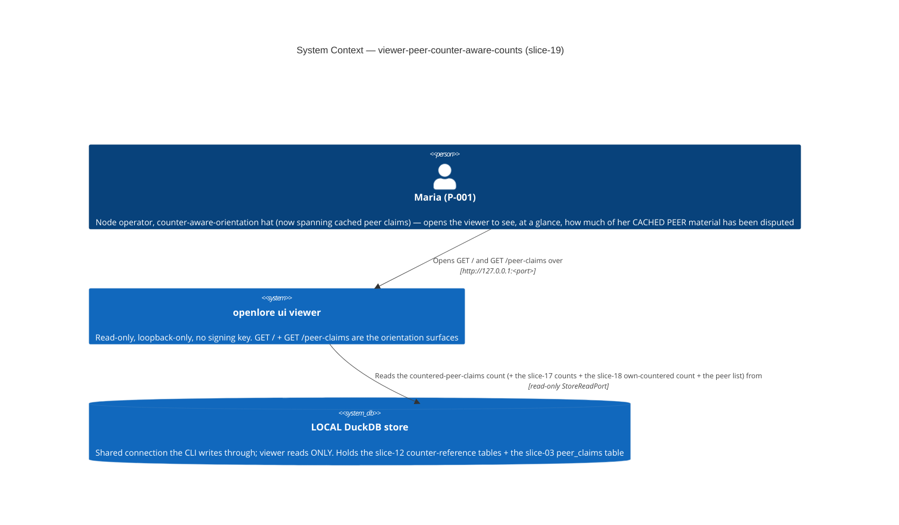
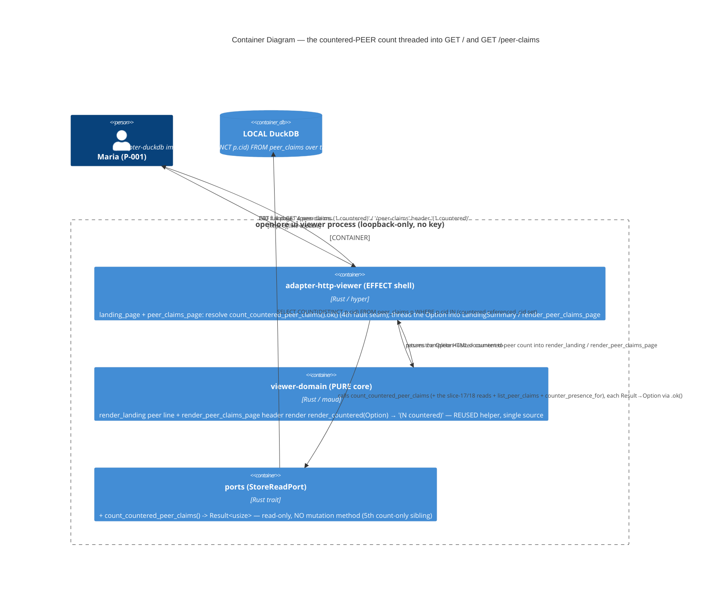

# Architecture Design: viewer-peer-counter-aware-counts (slice-19)

> Wave: DESIGN (lean) · Owner: Morgan (nw-solution-architect) · 2026-06-10
> Input: APPROVED DISCUSS (DoR 9/9, J-003b orientation facet). ADR: **ADR-056**.
> Brownfield DELTA — the EXACT slice-18 (`viewer-counter-aware-counts`, ADR-055) pattern
> mirrored onto PEER claims: `count_countered_own_claims` → `count_countered_peer_claims`
> (outer table `claims` → `peer_claims`); the additive `Option<usize>` `LandingSummary`
> field; the SHARED `render_countered` helper (REUSED, no new helper); the missing≠zero
> independent `.ok()` degrade; the cfg-gated fault seam. Also builds on slice-17
> (`LandingSummary`, `render_count`, `MISSING_COUNT_MARKER` — ADR-054), slice-12
> (`claim_references ∪ peer_claim_references`, `ref_type='counters'` — ADR-048), slice-06/07
> (`render_peer_claims_page`, the `/peer-claims` list + header).
> Paradigm: functional Rust (ADR-007) — pure render core, effect shell at the I/O edge.

## 1. Problem and approach (one paragraph)

slice-18 surfaced "how many of my OWN claims have been countered" beside the own-claims line
on `GET /` ("12 own claims (3 countered)") + in the `/claims` header, and explicitly DEFERRED
the symmetric peer count (WD-CC-7). slice-19 ships that deferred sibling: it resolves ONE new
count-only aggregate — `count_countered_peer_claims()` (the number of DISTINCT cached
PEER-claim CIDs that appear as a countered `referenced_cid` across `claim_references ∪
peer_claim_references`, `ref_type='counters'` — the EXACT slice-18 inner `UNION` IN-set, with
the OUTER table swapped `claims → peer_claims`) — threads it as a FIFTH `Option<usize>` field
on the slice-17 `LandingSummary` and as a bare `Option<usize>` parameter to
`render_peer_claims_page`, each degrading INDEPENDENTLY via `.ok()`, and renders
"(N countered)" beside the peer-claims count on `GET /` and in the `GET /peer-claims` header
through the EXISTING shared pure `render_countered` helper (single source — WD-PC-8). No new
render helper, no new route, no new crate (workspace stays 21), no mutation method, no
network. Architecture stays the slice-06/17/18 Hexagonal + Modular Monolith (ADR-009): pure
`viewer-domain` render, effect `adapter-http-viewer` shell, read-only `StoreReadPort` over the
shared DuckDB connection. The slice-18 OWN surfaces (landing own line + `/claims` header) are
UNTOUCHED (WD-PC-7 / BR-PC-4); this is the own+peer COMPLETION, no third dimension.

## 2. C4 — System Context (L1)

The surfaces make NO outbound network request (C-2): no PDS, no DID re-resolution, no peer
pull, no CDN. The only external dependency is the LOCAL store, read-only.

## 3. C4 — Container (L2)

### Threading + degrade flow (the US-PC-000 plumbing)

1. **Landing (`GET /`)**: `landing_page(store)` adds a FIFTH independent resolution —
   `countered_peer_claims = countered_peer_count_with_fault_seam(store.count_countered_peer_claims()).ok()`
   — to the slice-17 three + the slice-18 countered-own, builds the extended `LandingSummary
   { own_claims, peer_claims, active_peers, countered_own_claims, countered_peer_claims }`,
   calls `render_landing(&summary)`, wraps in `html_ok` (200).
2. **`/peer-claims` (`GET /peer-claims`)**: `peer_claims_page(store, query, shape)` resolves
   `countered_peer = countered_peer_count_with_fault_seam(store.count_countered_peer_claims()).ok()`
   ALONGSIDE the existing `list_peer_claims` page read + the slice-13 `counter_presence_for`
   per-row presence read, and passes it into `render_peer_claims_page(&page_view, countered_peer)`
   (full-page path only — the htmx `Shape::Fragment` path renders
   `render_peer_claims_view_panel_fragment` and is UNTOUCHED; the header count is full-page chrome,
   mirroring slice-18's `/claims` header).
3. A failed countered-peer read → `None` for THAT count only; on the landing the three slice-17
   counts + the slice-18 own-countered count + the nav hub still render; on `/peer-claims` the
   list rows + the slice-13 per-row flags + the peer origin still render. Never a 5xx, never a
   fabricated "(0 countered)" (ADR-056 D2/D4 / C-2 / C-5).
4. The pure `render_countered(Option<usize>)` helper (REUSED from slice-18, NO new helper)
   renders "(n countered)" / "(— countered)" — the SAME fn on both surfaces (single source,
   WD-PC-8). The peer-claims "4" + the list order/paging/flags/origin are UNCHANGED (additive,
   C-4 / WD-PC-9).

## 4. C4 — Component (L3)

NOT produced. The slice touches ≤5 components across three crates with no internal subsystem
decomposition: one new count read (`ports` + `adapter-duckdb`), one REUSED pure helper
(`render_countered`) driven from two extended renders (`render_landing` peer line,
`render_peer_claims_page` header), one new cfg-gated fault seam
(`countered_peer_count_with_fault_seam`), and two extended effect handlers (`landing_page`,
`peer_claims_page`). L1+L2 are sufficient (C4 mandatory minimum; L3 reserved for 5+ internal
components in a subsystem). This is a thin DELTA mirroring slice-18.

## 5. Quality attributes (ISO 25010) addressed

| Attribute | Strategy | Where |
|---|---|---|
| Reliability (fault tolerance) | Per-count independent degrade via `.ok()`; a failed countered-peer read → `None`, the sibling counts (incl. the slice-18 own-countered) / rows / flags + nav hub intact, never a 5xx (ADR-054 D2 / ADR-055 D4 extended) | shell D4 |
| Functional correctness | `0 ≠ missing` is type-level (`Option<usize>`); presence count via de-duped IN-set + `COUNT(DISTINCT)` (a peer claim countered N times counts once); peer-only by outer `peer_claims` table | D1, D2 |
| Performance efficiency | ONE additional aggregate read per surface (landing 4→5; `peer_claims_page` +1), invariant to store size; count-only avoids materializing the peer-cid list + presence set | D1, no-N+1 |
| Security (read-only, no key) | `StoreReadPort` declares no mutation method; loopback-only bind; no key in process; parameter-free injection-safe SQL | C-1, 3-layer enforcement |
| Maintainability | REUSED `render_countered` helper (single source, single mutation site for the neutral copy, shared with slice-18); pure renders are total fns | D3 |
| Portability / offline | LOCAL DB read only; vendored htmx, no CDN; renders network-down | C-2 |

## 6. No new external integration

This slice introduces NO external API, third-party service, or network seam. No contract-test
annotation applies (the only dependency is the LOCAL read-only store, already covered by the
existing store-readability startup probe, ADR-028 — the probe's sentinel `count_claims` read is
unchanged). The handoff to DISTILL/DEVOPS carries no new external-integration risk.
</content>
</invoke>
