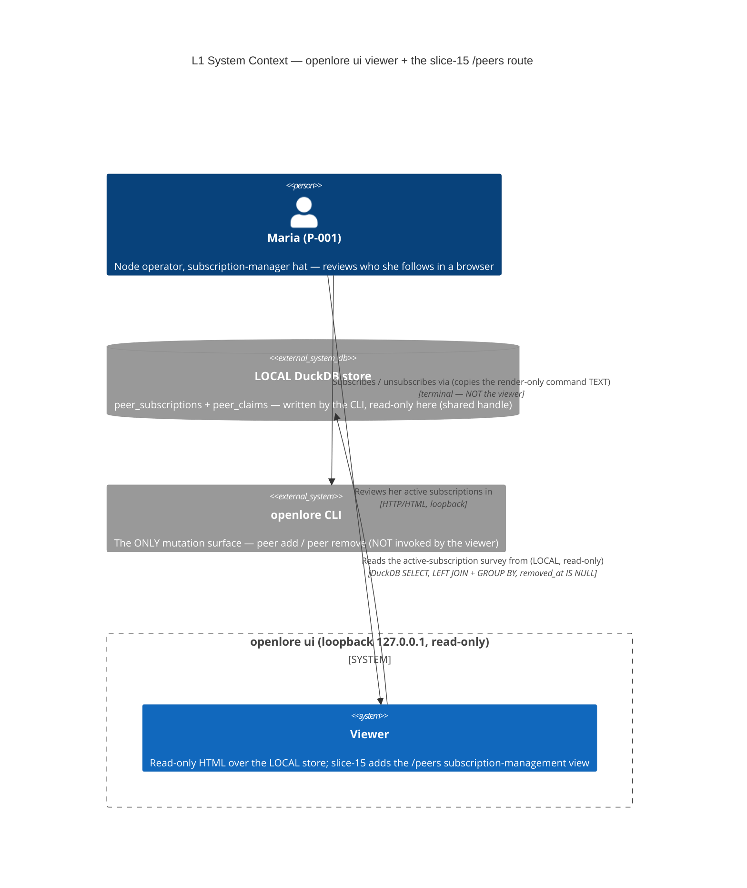

# Architecture Design — viewer-peer-subscriptions (slice-15)

> Wave: **DESIGN** · Owner: Morgan (nw-solution-architect) · Date: 2026-06-09
> Feature type: brownfield DELTA on the read-only `openlore ui` viewer.
> Paradigm: **functional** (ADR-007) — pure render/ADTs in `viewer-domain`,
> effect shell at the I/O edge in `adapter-http-viewer`, function signatures as ports.
> Architecture style: **Hexagonal + Modular Monolith (UNCHANGED, ADR-009)**.
> **No new crate. Workspace stays 21 members.**

This DESIGN realizes the **VIEWING side of J-003c** in the browser: ONE LOCAL
read-only route — `GET /peers` — that lists the operator's ACTIVE peer
subscriptions (`peer_subscriptions.removed_at IS NULL`), each row showing the
peer's DID verbatim, its per-peer LOCAL claim count
(`COUNT(*) FROM peer_claims WHERE author_did = <peer>`), and a render-only
`openlore peer remove <bare-did>` revocation command. It is the structural
sibling of the slice-10 `/project` route: LOCAL read over the read-only
`StoreReadPort` → project into a view-model ADT in the PURE `viewer-domain` core
→ render, forking by `Shape` (fragment vs full page). The unsubscribe stays the
slice-03 CLI; the viewer holds no key and renders no executable control.

ADRs for the significant decisions: **ADR-052** (the one-aggregate-query read
seam: `LEFT JOIN … GROUP BY` over `peer_subscriptions`/`peer_claims`, the N+1
guard, the active-only filter, AND the render-only-revocation-command reuse of
the slice-08 `render_follow_guidance` pattern).

---

## 1. System context and capability (what changes)

The viewer is the operator's (P-001 Maria, subscription-manager hat) loopback,
read-only window onto her LOCAL DuckDB store. slice-15 adds the
**federation-management VIEWING** surface: a single new route that answers, in
the browser, "who do I currently follow, how many of each peer's claims do I
hold locally, and how do I leave a peer cleanly?" The slice adds:

- **ONE LOCAL read capability** on `StoreReadPort` (US-PS-001):
  `list_active_peer_subscriptions` — every ACTIVE subscription paired with its
  PER-PEER local claim count, in ONE aggregate query (no N+1, invariant to peer
  count). The active-only filter + the per-peer count are SQL; the projection is
  PURE Rust.
- **ONE pure view-model ADT + renderer** (US-PS-002/003): a `PeersView` ADT
  (`Subscriptions { peers } | NoSubscriptions`) with `render_peers_fragment` /
  `render_peers_page` (page = chrome + SAME fragment, structural parity). Each
  peer row carries the render-only `openlore peer remove <bare-did>` command via
  a NEW `render_remove_guidance` + `PEER_REMOVE_GUIDANCE_PREFIX` const (mirrors
  slice-08 `render_follow_guidance` / `SEARCH_FOLLOW_GUIDANCE_PREFIX`). The
  `NoSubscriptions` arm renders a guided empty state pointing to
  `openlore peer add <did>`.
- **ONE new route** (US-PS-001 wiring): `GET /peers` — read →
  map-to-`PeersView` → render, `Shape` fork. A read failure degrades gracefully
  to a guided message (never a 5xx, never a stack trace).

Nothing else changes: read-only (no write/sign/subscribe/unsubscribe route, no
key, loopback 127.0.0.1), LOCAL/offline (no network seam on this route), no new
persisted type, the vendored SHA-256-pinned htmx asset.

### C4 L1 — System Context



> The `/peers` route has **no edge** to any network system: it is a LOCAL-only
> read (WD-PS-4 / I-PS-4) — offline-STRONGER than `/search`. The unsubscribe
> path is the CLI, which the viewer NEVER invokes; it only renders the command
> as TEXT.

### C4 L2 — Container / component (the touchpoints)

```mermaid
C4Container
  title L2 — slice-15 touchpoints (5 existing crates + cli; no new crate; 21 members)
  Person(maria, "Maria (P-001)")
  Container_Boundary(proc, "openlore process (cli composition root wires it)") {
    Container(http, "adapter-http-viewer", "Rust / hyper (EFFECT shell)", "route table: GET /peers handler — read, map to PeersView, Shape fork, render. Adds the nav link")
    Container(viewerdom, "viewer-domain", "Rust / maud (PURE core)", "slice-15 adds PeersView ADT + render_peers_fragment/_page + render_remove_guidance + PEER_REMOVE_GUIDANCE_PREFIX + PEER_ADD_GUIDANCE_PREFIX; PEERS_URL nav const")
    Container(ports, "ports", "Rust (PURE — port traits)", "slice-15 adds list_active_peer_subscriptions to StoreReadPort + the PeerSubscriptionSummary DTO")
    Container(duckdb, "adapter-duckdb", "Rust / duckdb (EFFECT)", "slice-15 adds ONE read impl: peer_subscriptions LEFT JOIN peer_claims, removed_at IS NULL, GROUP BY peer_did — ONE aggregate query")
    Container(xtask, "xtask check-arch", "Rust (tooling)", "slice-15: UNCHANGED — read-only DB read, no new pure-core edge, no new forbidden dep, no cross-store claims∪peer_claims literal")
    Container(cli, "cli", "Rust (composition root)", "UNCHANGED beyond already wiring the viewer over the shared read handle")
  }
  SystemDb_Ext(store, "LOCAL DuckDB store")

  Rel(maria, http, "GET /peers (loopback)", "HTTP")
  Rel(http, ports, "calls list_active_peer_subscriptions (read-only)")
  Rel(http, viewerdom, "maps Vec<PeerSubscriptionSummary> to PeersView, renders (Shape fork)")
  Rel(ports, duckdb, "implemented by (over the shared read handle)")
  Rel(duckdb, store, "SELECT peer_subscriptions LEFT JOIN peer_claims, GROUP BY (LOCAL, ONE query)")
  Rel(viewerdom, http, "render_peers_page / render_peers_fragment")
```

Every arrow is labeled with a verb; abstraction levels are not mixed (L1 =
actors + external systems; L2 = the internal crates). No L3 is warranted — the
slice touches 5 crates with thin additions to an established pattern (slices
06–14), not a 5+-component subsystem.

---

## 2. Component boundaries (summary; full detail in component-boundaries.md)

| Crate | Layer | slice-15 addition | Owns |
|---|---|---|---|
| `ports` | PURE port traits | `list_active_peer_subscriptions` on `StoreReadPort`; the `PeerSubscriptionSummary` DTO | the read contract (NO mutation) |
| `adapter-duckdb` | EFFECT (driven) | ONE read impl (`LEFT JOIN` + `GROUP BY`, `removed_at IS NULL`, per-`author_did` `COUNT(*)`) | the SQL; LOCAL read over the shared handle |
| `viewer-domain` | PURE core | `PeersView` ADT + `render_peers_fragment`/`render_peers_page` + `render_remove_guidance` + the two guidance-prefix consts + `PEERS_URL` | the view-model + HTML |
| `adapter-http-viewer` | EFFECT (driving) | `peers_page` handler + route-table arm + the nav link | parse, read, map-to-view, Shape fork, render |
| `xtask` | tooling | (UNCHANGED) | architecture enforcement |
| `cli` | composition root | (no change beyond it already wiring the viewer) | wiring |

Dependency direction (inward, ADR-009): `adapter-http-viewer →
{viewer-domain, ports}`; `viewer-domain → {ports, …}` (PURE→PURE);
`adapter-duckdb → ports`. No adapter→adapter. **No new crate. No new dependency
edge** (unlike slice-10, which added `viewer-domain → claim-domain`: this slice
needs no pure-core dependency at all — the render is a total function of the
flat DTO).

---

## 3. Integration patterns

- **Driving port (for the acceptance tests, port-to-port):** the `GET /peers`
  route IS the driving port. Acceptance tests drive HTTP at the loopback address
  through the real `openlore ui` subprocess and assert on the rendered HTML
  (exactly as slices 06–14).
- **Driven port:** `StoreReadPort` (read-only) — extended with ONE survey read;
  implemented by `adapter-duckdb` over the shared connection (BR-VIEW-4).
- **Sync, in-process:** the route is GET-only and SYNCHRONOUS (a LOCAL read +
  pure map/render — NO `.await`, unlike `/search`). It forks AFTER the
  synchronous store-read match in `route` (alongside `/claims`, `/score`,
  `/project`, `/philosophy`, `/peer-claims`).
- **NO external integration** on this route → **NO contract test annotation
  required** for slice-15. The only external integrations (the indexer for
  `/search`, GitHub for `/scrape`) are pre-existing and untouched. This is the
  offline-STRONGER property (I-PS-4).

---

## 4. Quality attributes (ISO 25010)

| Attribute | Strategy on the new route |
|---|---|
| **Functional suitability** | Each row maps to exactly one ACTIVE `peer_subscriptions` row; the count is the peer's own `peer_claims` total. Empty survey → guided `NoSubscriptions` (200), never a crash/blank. A peer with 0 claims still appears (subscription recorded independently of pulling — LEFT JOIN). |
| **Reliability / fault tolerance** | A store read failure degrades to a guided message (NFR-PS-6) — never a stack trace, never a 5xx. Total `match` over `PeersView`. |
| **Security** | Read-only (no write/sign/subscribe/unsubscribe route, no key); loopback-only bind (UNCHANGED). The DID is rendered VERBATIM via maud (auto-escaped); the render-only command is plain TEXT (`<p>`/`<code>`), never an `<a>`/form. No claim-controlled URI is placed in an href on this route (no traversal cross-links here), so no percent-encoding boundary is introduced. |
| **Performance efficiency** | ONE aggregate query per render, invariant to peer count (NFR-PS-4 / I-PS-8) — `LEFT JOIN peer_claims … GROUP BY peer_did`, no per-peer fold, no recursive CTE, no network. No new persisted type. |
| **Maintainability / testability** | `PeersView` projection + `render_peers_*` are total functions tested port-to-port at domain scope; the effect shell is a thin read→map→render sandwich. The revocation command + the empty-state command are each held in ONE place (single mutation site). |
| **Compatibility** | Reuses the existing route table, `Shape` fork, vendored htmx, `page = chrome + fragment` split, and the slice-08 render-only-command pattern — no new contract for existing surfaces. |

Anti-merging (J-003a / KPI-AV-2) is **MET by construction**: the count is
PER-PEER (`COUNT(*) … WHERE author_did = peer_did`, grouped by `peer_did`); each
peer is its own row keyed by its DID; there is no merged "all peers" total and
no "consensus peer" row. Two peers with 5 and 3 claims render as 5 and 3, never
8.

---

## 5. Invariants → structural enforcement points (§6 detail)

| DISCUSS invariant | Concrete structural enforcement point |
|---|---|
| Read-only 3-layer (I-PS-1, CARDINAL) | (1) `StoreReadPort` has NO mutation method — the new method is a `SELECT` (type); (2) `xtask` viewer capability rule (`VIEWER_FORBIDDEN_DEPS` UNCHANGED); (3) behavioral read-only gold (no form/`<button>`/mutating `<a>` on `/peers`; the active set is identical before/after any number of GETs). |
| Active-only / residue made visible (I-PS-2, CARDINAL) | The read filters `removed_at IS NULL` (SQL `WHERE`). Behavioral gold: seed a soft-removed peer, assert ABSENT from `/peers`. |
| Per-peer, never merged (I-PS-3 / J-003a) | The count is `COUNT(*) … WHERE author_did = peer_did` grouped by `peer_did`; `PeerSubscriptionSummary.peer_did` non-Option; behavioral two-peers-distinct-counts gold (5 vs 3, never 8). |
| LOCAL/offline (I-PS-4) | The read touches only `peer_subscriptions`/`peer_claims` (no network crate reachable); the handler holds only `StoreReadPort`; network-disabled acceptance scenario; the page references only the vendored `/static/htmx.min.js`. |
| Render-only revocation command (I-PS-8) | `PEER_REMOVE_GUIDANCE_PREFIX` held in ONE place; `render_remove_guidance` emits a `<p>`/`<code>` of TEXT, never an `<a>`/form (mirrors `render_follow_guidance`); behavioral gold asserts no executable control. |
| Parity (I-PS-5) | `render_peers_page` EMBEDS `render_peers_fragment` — page = chrome + SAME fragment fn; both shapes embed the SAME empty-state arm. |
| Loopback + no new persisted type (I-PS-6) | `ViewerServer::bind` refuses non-loopback (UNCHANGED); the subscription list is computed per request, never written. |
| No new crate (I-PS-7) | Workspace stays 21; no new dependency edge. |

---

## 6. Architecture Enforcement (annotation for software-crafter — DELIVER)

```markdown
Style: Hexagonal + Modular Monolith (UNCHANGED, ADR-009). Language: Rust
(functional, ADR-007 — pure cores: viewer-domain + claim-domain + scoring + appview-domain).
Tool: cargo xtask check-arch (the project's bespoke ArchUnit-equivalent — import-graph
+ syn-AST source rules; the project's standing rejection of import-linter-only holds —
import-linter is import-graph only and cannot express method-presence / SQL-literal rules).

slice-15 deltas (full text in ADR-052):
  - cargo xtask check-arch: UNCHANGED.
      * NO pure-core allowlist edge added — viewer-domain renders PeersView as a total
        function of the flat PeerSubscriptionSummary DTO; it needs NO new pure dependency
        (unlike slice-10's viewer-domain -> claim-domain edge). viewer-domain's allowed
        deps stay {maud, ports, appview-domain, scoring, claim-domain} — the pure-core
        no-I/O arm still PASSES.
      * NO capability-rule change: the new StoreReadPort read is read-only (a method on
        the port that already has NO mutation method, ADR-030); the viewer capability
        boundary (VIEWER_FORBIDDEN_DEPS) is UNCHANGED — the read touches no
        signing/identity/PDS/indexer surface.
      * The anti-merging SQL rule (no_cross_table_join_elides_author) stays GREEN over the
        new adapter-duckdb SELECT by construction: the SQL names peer_subscriptions +
        peer_claims but NOT the standalone `claims` table (word-boundary classifier:
        `peer_claims` does not count as a `claims` mention), so classify_sql_literal
        returns None (not cross-store). The SELECT nonetheless projects author_did
        (the GROUP BY key / count predicate), so even if the classifier evolved the rule
        would hold.
  - cargo xtask check-probes: UNCHANGED — no new adapter/port with a probe; the read runs
    over the existing probed StoreReadPort connection (ADR-028/030).
  - cargo deny: no new external dependency (ports/maud are in-workspace; chrono/duckdb
    already pinned).
  - mutation testing (nightly): extend to viewer-domain render_peers_fragment/_page + the
    PeersView projection + render_remove_guidance (active-only absence, per-peer count
    fidelity, render-only command text + bare-DID strip, empty-state command, parity).

Rules to enforce (slice-15):
- viewer-domain MAY render PeersView with its EXISTING deps (no new edge) and MUST NOT
  depend on duckdb/tokio/reqwest/std::fs/std::net/SystemTime or any adapter crate
  (existing pure-core no-I/O arm UNCHANGED).
- StoreReadPort gains list_active_peer_subscriptions (read-only — NO mutation method
  added to the port).
- The adapter-duckdb SELECT filters removed_at IS NULL, LEFT JOINs peer_claims on
  author_did = peer_did, GROUPs BY the subscription identity, and computes the per-peer
  COUNT in ONE aggregate query (no N+1; no per-peer count_peer_claims fold).
- GET /peers persists nothing; renders no subscribe/unsubscribe/remove/purge control;
  the only revocation affordance is the render-only command TEXT (no executable control).
- render_peers_page EMBEDS render_peers_fragment (page = chrome + fragment; parity by
  construction); both shapes embed the SAME NoSubscriptions empty-state arm.
- PeerSubscriptionSummary.peer_did is non-Option (anti-merging attribution).
- ViewerServer::bind still refuses non-loopback (UNCHANGED, ADR-028).
- No new crate; workspace stays 21 members.
```

---

## 7. Resolved open questions (the DESIGN-owned questions)

| # | Question | Resolution | ADR |
|---|---|---|---|
| **Q1** | Per-peer count SQL: correlated subquery vs `LEFT JOIN … GROUP BY` | **`LEFT JOIN peer_claims ON author_did = peer_did … GROUP BY` the subscription identity.** A LEFT JOIN keeps a peer with ZERO cached claims in the result (count 0 — US-PS-002 Ex 2), which a plain JOIN would drop; the GROUP BY computes the per-peer `COUNT(*)` in ONE pass. A correlated subquery (`SELECT …, (SELECT count(*) FROM peer_claims WHERE author_did = ps.peer_did) FROM peer_subscriptions ps WHERE removed_at IS NULL`) is also ONE query and equally correct; the LEFT JOIN form is chosen because it expresses the per-peer count as a single aggregate over a single scan and reads as the natural mirror of the existing `count_peer_claims(conn, peer_did)` shape lifted to the whole active set. A per-peer `count_peer_claims` fold is REJECTED (N+1). | ADR-052 |
| **Q2** | `PeerSubscriptionSummary` DTO location — `ports` vs `viewer-domain` | **`ports`, beside `ClaimRow`/`PeerClaimRow`/`SurveyRow`.** It is a read-side boundary DTO returned by a `StoreReadPort` method; every other read row DTO lives in `crates/ports/src/store_read.rs`. Placing it there keeps the port self-contained and lets `adapter-duckdb` and `adapter-http-viewer` share it without a `viewer-domain` dependency. | ADR-052 |
| **Q3** | Render-only revocation command — new pattern vs reuse slice-08 | **REUSE the slice-08 pattern verbatim in shape.** A new `PEER_REMOVE_GUIDANCE_PREFIX` const + a `render_remove_guidance(bare_did)` fn mirror `SEARCH_FOLLOW_GUIDANCE_PREFIX` + `render_follow_guidance` (bare-DID strip via `split('#').next()`, render-only `<p>` TEXT). The empty-state `peer add` command uses a sibling `PEER_ADD_GUIDANCE_PREFIX` (the exact slice-08 follow-guidance wording "openlore peer add" is the precedent). One mutation site per command keeps the text consistent with the slice-03 verbs. | ADR-052 |
| **Q4** | xtask check-arch boundary — does `/peers` need an edge change? | **NO.** It is a read-only DB read like every slice-06..14 viewer read; the capability boundary, the pure-core no-I/O arm, and the anti-merging SQL rule are all UNCHANGED (see §6). | ADR-052 |

### New ADTs/routes (summary)

- **Route:** `GET /peers` (US-PS-001 wiring / US-PS-002 / US-PS-003).
- **Read seam:** `StoreReadPort::list_active_peer_subscriptions(&self) -> Result<Vec<PeerSubscriptionSummary>, StoreReadError>` (the `Vec` is the ACTIVE-only survey; ordering by `subscribed_at` mirrors `list_active_subscriptions`).
- **Boundary DTO:** `ports::PeerSubscriptionSummary { peer_did: String (non-Option), peer_handle: String, subscribed_at: DateTime<Utc>, local_claim_count: u64 }`.
- **Pure view-model ADT:** `viewer_domain::PeersView` — `Subscriptions { peers: Vec<PeerSubscriptionSummary-projection> } | NoSubscriptions` (see data-models.md for the exact shape — the renderer may consume the DTO directly).
- **Render-only command:** `PEER_REMOVE_GUIDANCE_PREFIX` + `render_remove_guidance(bare_did)`; the empty-state `PEER_ADD_GUIDANCE_PREFIX`.
- **xtask delta:** NONE (read-only DB read).

**Confirmation: NO new crate. Workspace stays 21 members.**

---

## Changelog

- 2026-06-09 — Morgan — Initial DESIGN for slice-15 viewer-peer-subscriptions:
  ONE LOCAL read-only `GET /peers` route + ONE new read-only `StoreReadPort`
  method (`list_active_peer_subscriptions`, active-only + per-peer count in ONE
  aggregate query via `LEFT JOIN` + `GROUP BY`) + the `PeersView` ADT + the
  render-only `openlore peer remove <did>` command reusing the slice-08
  `render_follow_guidance` pattern. Resolved Q1 (LEFT JOIN + GROUP BY), Q2 (DTO
  in `ports`), Q3 (reuse slice-08), Q4 (xtask UNCHANGED). No new crate (21
  members), no new dependency edge. ADR-052.
