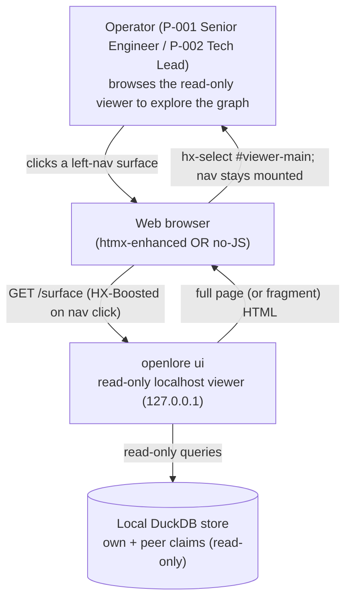
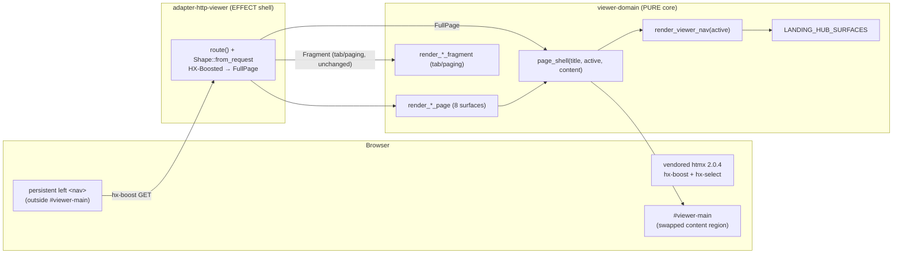
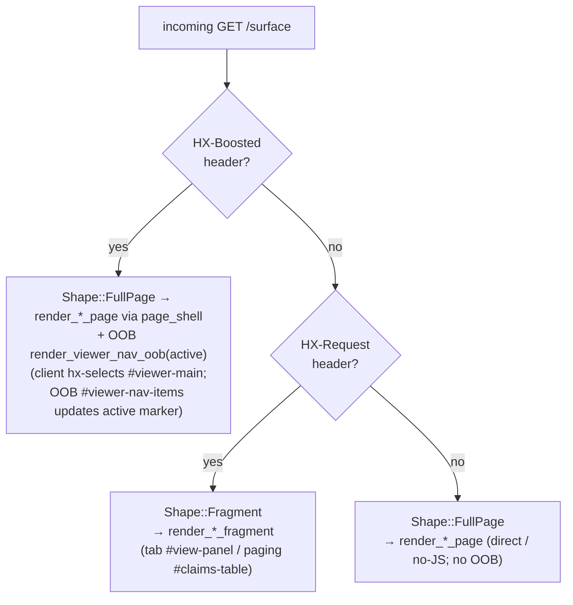

# Architecture Design — viewer-persistent-left-nav (slice-21)

> DESIGN wave. Decision of record: **ADR-058**. Paradigm: functional Rust
> (ADR-007) — pure `viewer-domain` core, effect shell at the HTTP edge.

## 1. Problem & drivers

Add a left navigation that renders on every read-only viewer surface and **stays
mounted** across navigation (content-only swap), marks the current surface, and
degrades to plain full-page links with JS off — without a JS framework and
without disturbing the two existing htmx swaps (`#view-panel` tab, `#claims-table`
paging). Dominant quality attributes: **maintainability** (one render path per
surface; one nav SSOT), **testability** (byte-parity structural, not asserted by
luck), and **compatibility** (existing swaps + no-JS + offline unchanged).

## 2. Existing-system analysis (reuse-first)

| Existing asset | Role | Reuse decision |
|---|---|---|
| `viewer-domain::common::page_head` / `htmx_script` | full-page `<head>` + vendored htmx `<script>` | REUSE — `page_shell` composes `page_head`. |
| `viewer-domain::landing::LANDING_HUB_SURFACES` | the 8 `(label, URL-const)` surfaces (ADR-054) | REUSE as the nav item SSOT (no second list). |
| `viewer-domain::common::render_tab_nav` + `VIEW_PANEL_ID` | My↔Peer tab swap (ADR-034) | UNCHANGED — lives inside `#viewer-main`; not boosted. |
| `adapter-http-viewer::Shape::from_request` | fragment vs full-page fork (ADR-033) | EXTEND — add the `HX-Boosted → FullPage` arm (one condition). |
| vendored `assets/htmx.min.js` (2.0.4) | htmx incl. `hx-boost` / `hx-select` | REUSE — capability already shipped; no new asset. |

**New, minimal:** one const (`VIEWER_MAIN_ID`), two pure render fns
(`render_viewer_nav`, `page_shell`), one adapter fork line. **No new crate, route,
read-method, or data model.**

## 3. C4 — System Context (Mermaid)

## 4. C4 — Container / module boundaries (Mermaid)

## 5. C4 — Component: the request/shape decision (Mermaid)

**Active-marker update (ADR-058 D5).** On a boosted swap the nav sits OUTSIDE
`#viewer-main`, so a content-only swap would leave its active marker stale. The
effect shell therefore appends, on boosted responses only, an out-of-band nav-list
`<ul id="viewer-nav-items" hx-swap-oob="innerHTML">` (from the pure
`render_viewer_nav_oob(active)`); htmx swaps it in place — the `<nav>` container
persists (no flash / scroll-reset), the active marker updates. Direct / no-JS loads
emit no OOB.

## 6. Component boundaries & dependency inversion

- **PURE (`viewer-domain`)**: `page_shell`, `render_viewer_nav`, `VIEWER_MAIN_ID`,
  the per-surface `render_*_page`. Zero I/O; total functions of (title, active,
  content). Header-unaware — the shape decision is the shell's, not the core's.
- **EFFECT (`adapter-http-viewer`)**: reads `HX-Boosted`/`HX-Request` ONCE in
  `Shape::from_request`, dispatches to the pure render. No new store read.
- Dependency direction unchanged: adapter → domain (never the reverse);
  `check-arch` capability rules already permit this edge (21 members, no change).

## 7. Technology stack

No additions. Rust + `maud` (compile-time HTML) for the pure render; hand-rolled
hyper 1.x server (ADR-028/030) for the effect shell; vendored htmx 2.0.4
(`hx-boost`, `hx-select`, `hx-target`, `hx-swap`, `hx-push-url`) — all already in
tree. `aria-current="page"` for the neutral active marker (semantic HTML, no JS).

## 8. Data models

None. The feature is chrome-only: no new DTO, no store read, no schema touch.
`render_viewer_nav` consumes the existing `LANDING_HUB_SURFACES: &[(&str, &str)]`.

## 9. Invariants (carried, enforced by tests in DISTILL/DELIVER)

I-VIEW-1/3 read-only/no-key (plain links, GET-only) · I-VIEW-4 loopback ·
I-HX-1/4 progressive-enhancement + no-JS fallback · I-HX-2 offline/no-CDN ·
I-HX-5 fragment↔page parity (now structural for the boosted region via
full-page + `hx-select`) · single-source nav (`LANDING_HUB_SURFACES`) ·
existing `#view-panel` + `#claims-table` swaps byte-unchanged.

## 10. Risks & mitigations

| Risk | Mitigation |
|---|---|
| Boosted nav collides with the My↔Peer tab's `#view-panel` swap | Boost is scoped to the left `<nav>` only; the tab keeps its explicit target (ADR-058 D2/alt-2). |
| Full-page-over-the-wire waste on each boosted click | Accepted — localhost, small payloads; buys structural byte-parity (ADR-058 Consequences). |
| A surface renders without the shell (nav missing on one route) | DISTILL AT asserts the nav region on ALL 8 routes (AC-001.1 / KPI-NAV-1). |
| Active marker drift after a boosted swap | AT asserts exactly-one-active on full-page AND post-swap (AC-002.3). |

## 11. Refactor & migration notes (for DELIVER; pinned in DISTILL)

- **`render_*_page` → `page_shell` (ADR-058 D6).** Each `*_page` keeps its signature;
  internally it builds its surface body as `Markup` and returns
  `page_shell(title, active, body)`. `active` is the surface's compile-time URL const
  at the call site (base-path const for query-bearing routes). The `*_fragment` fns
  are UNCHANGED (they ride `Shape::Fragment` for the existing tab/paging swaps).
  `render_error` (404) also routes through `page_shell`.
- **Landing hub migration (ADR-058 §Migration).** The inline `LANDING_HUB_SURFACES`
  hub leaves `render_landing`; the persistent nav now renders the surfaces on ALL
  routes. Slice-17 hub assertions are re-baselined to the persistent nav (a
  strengthening — now on 8 routes, not just `/`), guarded by the single-source test.

## 12. Handoff

- **DEVOPS**: no infra/observability change (chrome-only; no new route/metric).
- **DISTILL**: acceptance tests for US-NAV-001 (AC-001.1..5) + US-NAV-002
  (AC-002.1 refined..002.5); gold invariants (read-only/offline/no-JS/parity/no-regression);
  a single-source test (nav ⊆⊇ `LANDING_HUB_SURFACES`); an OOB active-marker-updates
  test; the slice-17 hub re-baseline.
- **DELIVER**: pure-render (`page_shell`, `render_viewer_nav`, `render_viewer_nav_oob`,
  `VIEWER_MAIN_ID`) + one adapter `Shape` fork line + the boosted-response OOB append;
  no new crate/route/read-method.
