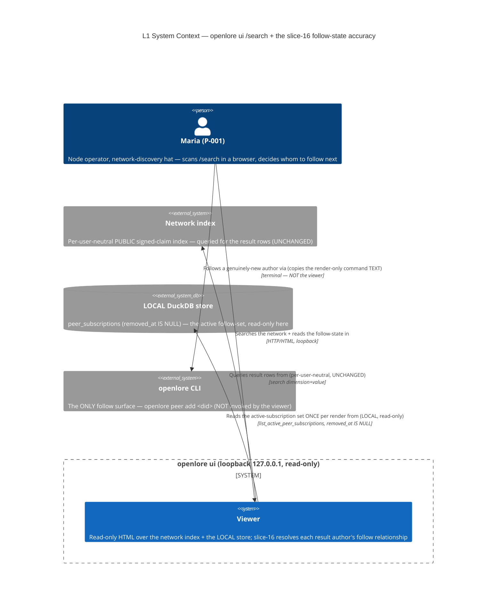

# Architecture Design — viewer-search-follow-state (slice-16)

> Wave: **DESIGN** · Owner: Morgan (nw-solution-architect) · Date: 2026-06-09
> Feature type: brownfield DELTA on the read-only `GET /search` view of `openlore ui`.
> Paradigm: **functional** (ADR-007) — pure render/ADTs in `viewer-domain`,
> effect shell at the I/O edge in `adapter-http-viewer`, function signatures as ports.
> Architecture style: **Hexagonal + Modular Monolith (UNCHANGED, ADR-009)**.
> **No new crate. No new route. No new read method. No new `AuthorRelationship`
> variant. Workspace stays 21 members.**

This DESIGN closes the **discovery→follow loop** on the existing slice-08
`GET /search` view. Today the viewer's `to_indexed_claim`
(`crates/adapter-http-viewer/src/lib.rs` ~line 1021-1033) hardcodes
`AuthorRelationship::NetworkUnfollowed` for EVERY result author, so the slice-08
render-only `openlore peer add <did>` follow affordance is offered even for
authors the operator ALREADY follows — and a followed author is never recognized
as such. slice-16 RESOLVES each result author's relationship in the **EFFECT
shell** against the operator's LOCAL active-subscription set (the slice-15
`list_active_peer_subscriptions` read, REUSED verbatim — ONE batch read, no N+1),
and adds ONE **pure render arm** so a `SubscribedPeer` author shows a neutral
**"Following"** indicator (NO add command) while a `NetworkUnfollowed` author
keeps the slice-08 `render_follow_guidance` affordance.

The significant decision is **ADR-053** (viewer-side relationship resolution
against the LOCAL active set, batch-once, binary `SubscribedPeer`-vs-
`NetworkUnfollowed`, `You` deferred; + the render-only "Following" indicator).

---

## 1. System context and capability (what changes)

The `/search` view is the operator's (P-001 Maria, network-discovery hat)
loopback, read-only window onto the NETWORK index. slice-16 sharpens its
follow-affordance ACCURACY by threading ONE LOCAL read into the existing
resolution + adding ONE render branch. It changes:

- **Effect shell (`adapter-http-viewer`, US-SF-001):** in `resolve_search_state`,
  after the `IndexQueryPort::search` call and BEFORE `compose_results`, read the
  active-subscription set ONCE via the REUSED slice-15
  `store.list_active_peer_subscriptions()`, materialize the bare `peer_did`s into
  an in-memory `HashSet<String>`, and thread it into `to_indexed_claim` (which
  STOPS hardcoding `NetworkUnfollowed`): `bare_did(author_did) ∈ set →
  SubscribedPeer`, else `NetworkUnfollowed`. A failed read degrades to an empty
  set → all-`NetworkUnfollowed` (the slice-08 status quo).
- **Pure render (`viewer-domain`, US-SF-002):** extend `render_search_result_row`
  with a `SubscribedPeer` arm rendering a neutral `"Following"` indicator (a new
  `render_following_indicator` + `SEARCH_FOLLOWING_INDICATOR` const, the sibling
  of `render_follow_guidance` + `SEARCH_FOLLOW_GUIDANCE_PREFIX`). The
  `NetworkUnfollowed` arm is UNCHANGED.

Nothing else changes: read-only (no write/sign/follow/unfollow control, no key,
loopback 127.0.0.1), the index query is per-user-neutral and UNCHANGED, no new
persisted type, attribution + grouping + ranking + the `[verified]` marker + the
vendored htmx asset all UNCHANGED.

### C4 L1 — System Context



> The relationship resolution adds NO edge to the network index — it is a LOCAL
> read (C-3 / WD-SF-4). The index stays per-user-neutral; it never learns who
> the operator follows. The follow itself is the CLI, which the viewer never
> invokes; it only renders the command (or the neutral "Following" label) as
> TEXT.

### C4 L2 — Container / component (the touchpoints — the active-set read threaded into resolution + the relationship-branched render)

```mermaid
C4Container
  title L2 — slice-16 touchpoints (2 crates touched; no new crate; 21 members)
  Person(maria, "Maria (P-001)")
  Container_Boundary(proc, "openlore process (cli composition root wires it — UNCHANGED)") {
    Container(http, "adapter-http-viewer", "Rust / hyper (EFFECT shell)", "resolve_search_state: query index, then READ the active set ONCE, materialize a HashSet<String>, thread it into to_indexed_claim (replaces the hardcoded NetworkUnfollowed). Degrades to empty-set on read failure.")
    Container(appview, "appview-domain", "Rust (PURE)", "compose_results — UNCHANGED. Already carries claim.relationship verbatim into NetworkResultRow.relationship (no merge/re-rank).")
    Container(viewerdom, "viewer-domain", "Rust / maud (PURE core)", "render_search_result_row: ADD a SubscribedPeer arm rendering render_following_indicator + SEARCH_FOLLOWING_INDICATOR (\"Following\"). NetworkUnfollowed arm UNCHANGED.")
    Container(ports, "ports", "Rust (PURE — port traits)", "UNCHANGED — AuthorRelationship + list_active_peer_subscriptions already exist (no new variant, no new method).")
    Container(duckdb, "adapter-duckdb", "Rust / duckdb (EFFECT)", "UNCHANGED — the slice-15 active-subscription query is reused verbatim.")
    Container(xtask, "xtask check-arch", "Rust (tooling)", "UNCHANGED — no new edge, no new forbidden dep, no new SQL literal.")
  }
  System_Ext(indexer, "Network index")
  SystemDb_Ext(store, "LOCAL DuckDB store")

  Rel(maria, http, "GET /search?<dimension>=<value> (loopback)", "HTTP")
  Rel(http, indexer, "search(dimension, value) — per-user-neutral (UNCHANGED)")
  Rel(http, ports, "calls list_active_peer_subscriptions ONCE (read-only, REUSED)")
  Rel(ports, duckdb, "implemented by (slice-15 query, UNCHANGED)")
  Rel(duckdb, store, "SELECT active peer_subscriptions (removed_at IS NULL, ONE aggregate)")
  Rel(http, appview, "to_indexed_claim(row, &active_set) then compose_results — relationship resolved per row")
  Rel(appview, viewerdom, "NetworkResultRow.relationship carried verbatim into the render input")
  Rel(http, viewerdom, "render_search_results_fragment / render_search_page (Shape fork) — branches on relationship")
```

Every arrow is labeled with a verb; abstraction levels are not mixed (L1 =
actors + external systems; L2 = the internal crates). No L3 is warranted — the
slice touches 2 crates (`adapter-http-viewer` effect + `viewer-domain` pure) with
thin additions to an established pipeline (slices 06–15), not a 5+-component
subsystem. `appview-domain` / `ports` / `adapter-duckdb` / `xtask` / `cli` are
shown for context but are UNCHANGED.

### Relationship-resolution flow (the data path, narrated)

```
GET /search?object=…
  │
  ▼  adapter-http-viewer :: resolve_search_state (EFFECT)
  ├─ index_query.search(dimension, value) ─────────────▶ Network index (per-user-neutral, UNCHANGED)
  │        └─ Ok(raw rows) | NoResults | Unavailable (slice-08 outcomes, UNCHANGED)
  ├─ store.list_active_peer_subscriptions() ───────────▶ LOCAL store (REUSED, ONE read)
  │        └─ Ok(summaries) → HashSet<bare peer_did>   |   Err(_) → EMPTY set (degrade, C-7)
  ├─ raw.results.map(|row| to_indexed_claim(row, &set)) ── resolve per row IN MEMORY (no N+1, C-4):
  │        bare_did(author_did) ∈ set → SubscribedPeer ; else → NetworkUnfollowed   (binary, C-6)
  ├─ compose_results(claims, dimension) ───────────────  PURE, UNCHANGED — carries relationship verbatim,
  │                                                        groups per author, no merge/re-rank (C-5)
  ▼  SearchState::Results { result, dimension }
  ▼  viewer-domain :: render_search_result_row (PURE)
       match row.relationship {
         NetworkUnfollowed → render_follow_guidance(author_did)   // slice-08, UNCHANGED
         SubscribedPeer    → render_following_indicator()          // NEW arm: "Following" TEXT, no command
         You | UnsubscribedCache → (no affordance — never arises on /search, D2)
       }
```

---

## 2. Component boundaries (summary; full detail in component-boundaries.md)

| Crate | Layer | slice-16 change | Owns |
|---|---|---|---|
| `adapter-http-viewer` | EFFECT (driving) | `resolve_search_state`: read the active set ONCE, build a `HashSet<String>`, thread it into `to_indexed_claim` (replace the hardcoded `NetworkUnfollowed`); degrade to empty set on read failure | parse, query index, read active set, resolve per-row, map-to-state, Shape fork, render |
| `viewer-domain` | PURE core | `render_search_result_row`: ADD a `SubscribedPeer → render_following_indicator()` arm + the `SEARCH_FOLLOWING_INDICATOR` const | the render-only "Following" indicator + the unchanged follow-guidance arm |
| `appview-domain` | PURE | (UNCHANGED) | `compose_results` carries `relationship` verbatim, groups per author |
| `ports` | PURE port traits | (UNCHANGED) | `AuthorRelationship` enum + `list_active_peer_subscriptions` (both already exist) |
| `adapter-duckdb` | EFFECT (driven) | (UNCHANGED) | the slice-15 active-subscription SQL (reused) |
| `xtask` | tooling | (UNCHANGED) | architecture enforcement |
| `cli` | composition root | (UNCHANGED) | wiring (the viewer already holds both ports) |

Dependency direction (inward, ADR-009): `adapter-http-viewer →
{viewer-domain, appview-domain, ports}`; `viewer-domain → {ports,
appview-domain, …}` (PURE→PURE); `adapter-duckdb → ports`. No adapter→adapter.
**No new crate. No new dependency edge** — the new `SubscribedPeer` render arm is
a total fn of the EXISTING `NetworkResultRow` (no new pure-core import); the
resolution reuses the EXISTING `StoreReadPort` the viewer already holds.

---

## 3. Integration patterns

- **Driving port (for the acceptance tests, port-to-port):** the `GET /search`
  route IS the driving port. Acceptance tests drive HTTP at the loopback address
  through the real `openlore ui` subprocess and assert on the rendered HTML
  (exactly as slices 06–15). No test calls the resolution fn directly.
- **Driven ports:** `IndexQueryPort` (the result rows — UNCHANGED, per-user-
  neutral) + `StoreReadPort` (the active set — REUSED slice-15 read). Neither has
  a mutation method.
- **Async, in-process:** `resolve_search_state` is `async` (the `IndexQueryPort`
  call `.await`s — UNCHANGED). The active-set read is a synchronous LOCAL store
  call alongside it; the resolution + `compose_results` + render are pure.
- **NO new external integration** on this slice. The only external integration on
  the `/search` path (the network indexer) is PRE-EXISTING and UNTOUCHED, and is
  per-user-neutral — the relationship resolution adds NO network seam (it is a
  LOCAL read). **No new contract-test annotation required for slice-16.** (The
  pre-existing indexer contract recommendation from slice-08 carries forward
  unchanged; slice-16 adds nothing to it.)

---

## 4. Quality attributes (ISO 25010)

| Attribute | Strategy on the slice-16 change |
|---|---|
| **Functional suitability** | A followed author (`bare_did ∈ active set`) resolves to `SubscribedPeer` → "Following" + no add; an unfollowed author resolves to `NetworkUnfollowed` → keeps `peer add`. Binary, total over the result set. A soft-removed peer (absent from the active set) correctly resolves to `NetworkUnfollowed`. |
| **Reliability / fault tolerance** | A failed active-set read degrades to an empty set → every author `NetworkUnfollowed` (the slice-08 status quo) — never a crash, blank region, 5xx, or leaked error (C-7; mirrors slice-15 `/peers` `Err→NoSubscriptions`). The index-query outcomes (`Unavailable`/`NoResults`) are UNCHANGED. |
| **Security** | Read-only (the viewer holds `StoreReadPort` + `IndexQueryPort`, neither with a mutation method; no key); loopback-only bind (UNCHANGED). The DID is rendered VERBATIM (maud auto-escaped); both the "Following" indicator and the `peer add` guidance are plain TEXT (`<p>`/`<span>`/`<code>`), never an `<a>`/`<button>`/`<form>`/`hx-*` control. Resolution introduces no new URI in an href. |
| **Performance efficiency** | ONE active-set read per render, invariant to result count (C-4 / no N+1) — the slice-15 single-aggregate query (ADR-052); each author resolved in memory against a `HashSet`. No per-result query, no recursive read, no network for resolution. No new persisted type. |
| **Maintainability / testability** | The resolution is a small total fn `(author_did, &HashSet) -> AuthorRelationship` and a thin shell read; the render arm is a total `match` over `relationship`. Both are tested port-to-port through the real subprocess. The "Following" copy lives in ONE const (single mutation site, mirroring `SEARCH_FOLLOW_GUIDANCE_PREFIX`). |
| **Compatibility** | Reuses the existing `/search` route, `SearchState` ADT, `compose_results`, `Shape` fork, vendored htmx, `page = chrome + fragment` split, the `render_follow_guidance` pattern, the `bare_did` SSOT, and the `AuthorRelationship` enum — no new contract for existing surfaces. |

Anti-merging (J-003a / KPI-AV-2) is **MET by construction**: resolution sets the
per-row `relationship` ONLY; `compose_results` groups per author and carries
`relationship` verbatim (`crates/appview-domain/src/compose.rs` ~line 126) — it
never merges, re-groups, or re-ranks. Two authors with one followed and one
unfollowed render as two attributed rows with different affordances, never a
merged row. The `[verified]` marker + verbatim confidence + counter-annotation
are unchanged.

---

## 5. Invariants → structural enforcement points (§6 detail)

| DISCUSS invariant | Concrete structural enforcement point |
|---|---|
| Read-only / no key (C-1, CARDINAL) | (1) the viewer holds `StoreReadPort` + `IndexQueryPort`, neither with a mutation method (type); (2) `xtask` viewer capability rule (`VIEWER_FORBIDDEN_DEPS`) UNCHANGED; (3) behavioral gold: neither the "Following" indicator nor the `peer add` guidance is an executable control (no form/`<button>`/mutating `<a>`/`hx-*`). |
| Accuracy (C-2, load-bearing) | Behavioral gold: a seeded followed author → "Following" + no `peer add`; an unfollowed author → keeps `peer add`; all-followed → no `peer add` anywhere; none-followed → slice-08 status quo. |
| LOCAL/offline (C-3) | Resolution reads `StoreReadPort` (no network crate reachable); the index query is unchanged + per-user-neutral; behavioral no-network-for-resolution scenario. |
| ONE batch read / no N+1 (C-4) | The active set is read ONCE in `resolve_search_state` into a `HashSet`; resolution is in memory; behavioral read-count-invariant-to-result-count gold. |
| Attribution + ranking unchanged (C-5 / J-003a) | Resolution sets `relationship` only; `compose_results` UNCHANGED; behavioral grouping/order-identical-with-and-without-an-active-subscription gold. |
| Binary; `You`/`UnsubscribedCache` not resolved (C-6) | `to_indexed_claim` resolves only `SubscribedPeer`/`NetworkUnfollowed`; the render's `You`/`UnsubscribedCache` arms render no affordance; behavioral soft-removed-peer→`peer add` gold. |
| Graceful degradation (C-7) | `resolve_search_state` maps a read `Err` to an empty set (all `NetworkUnfollowed`); behavioral failed-read-degrades-without-crash gold. |
| Parity (C-8) | The resolution happens in the shell BEFORE the render; `render_search_page` EMBEDS `render_search_results_fragment`; both shapes consume the SAME `SearchState`; behavioral htmx-vs-no-JS-parity gold. |
| Fragment-strip match (R-SF-5) | The comparison strips `#fragment` via the existing `bare_did` SSOT on both sides; behavioral fragmented-result-DID-matches-bare-active-DID gold. |
| No new crate/route/variant/method (C-9) | Workspace stays 21; no new route arm; no new enum variant; no new read method; `xtask` UNCHANGED. |

---

## 6. Architecture Enforcement (annotation for software-crafter — DELIVER)

```markdown
Style: Hexagonal + Modular Monolith (UNCHANGED, ADR-009). Language: Rust
(functional, ADR-007 — pure cores: viewer-domain + appview-domain + claim-domain + scoring).
Tool: cargo xtask check-arch (the project's bespoke ArchUnit-equivalent — import-graph
+ syn-AST source rules; the standing rejection of import-linter-only holds — it is
import-graph only and cannot express method-presence / SQL-literal / render-only rules).

slice-16 deltas (full text in ADR-053):
  - cargo xtask check-arch: UNCHANGED.
      * NO pure-core allowlist edge added — the new SubscribedPeer render arm is a total
        fn of the EXISTING appview_domain::NetworkResultRow; viewer-domain's allowed deps
        stay {maud, ports, appview-domain, scoring, claim-domain}. The pure-core no-I/O
        arm still PASSES.
      * NO capability-rule change — resolution reuses the StoreReadPort the viewer ALREADY
        holds (the slice-15 list_active_peer_subscriptions); VIEWER_FORBIDDEN_DEPS is
        UNCHANGED (no signing/identity/PDS/indexer-mutation surface touched).
      * NO new SQL literal — slice-16 reuses the slice-15 active-subscription query
        verbatim; the anti-merging SQL rule is N/A and stays GREEN.
  - cargo xtask check-probes: UNCHANGED — no new adapter/port with a probe; the REUSED
    read runs over the existing probed StoreReadPort connection (ADR-028/030).
  - cargo deny: no new external dependency (HashSet is std; everything else in-workspace).
  - mutation testing (nightly): extend to viewer-domain render_search_result_row's new
    SubscribedPeer arm + render_following_indicator (followed→"Following"+no-add,
    unfollowed→keeps-add) AND the adapter resolve_relationship fn (set membership,
    fragment strip via bare_did, degrade-to-NetworkUnfollowed on empty set).

Rules to enforce (slice-16):
- to_indexed_claim resolves the relationship from the in-memory active-DID set
  (bare_did(author_did) ∈ set → SubscribedPeer, else NetworkUnfollowed) — it NO LONGER
  hardcodes NetworkUnfollowed. The DID comparison strips the #fragment via bare_did on
  BOTH sides.
- The active set is read EXACTLY ONCE per /search render (the slice-15
  list_active_peer_subscriptions), invariant to result count (no per-result query / N+1).
- A failed active-set read degrades to an EMPTY set → every author NetworkUnfollowed
  (the slice-08 status quo) — no crash, no 5xx, no blank, no leaked error.
- resolve_search_state sets the per-row relationship ONLY — compose_results grouping +
  order UNCHANGED (no merge, no re-rank).
- render_search_result_row branches: SubscribedPeer → render_following_indicator()
  (neutral "Following" TEXT, NO command); NetworkUnfollowed → render_follow_guidance
  (UNCHANGED); You/UnsubscribedCache → no affordance.
- BOTH affordances are render-only TEXT — no <button>/<form>/mutating <a>/hx-* control;
  the viewer holds no key.
- SEARCH_FOLLOWING_INDICATOR ("Following") held in ONE place (single mutation site,
  mirrors SEARCH_FOLLOW_GUIDANCE_PREFIX).
- render_search_page EMBEDS render_search_results_fragment (parity by construction).
- ViewerServer::bind still refuses non-loopback (UNCHANGED, ADR-028).
- No new crate; no new route; no new AuthorRelationship variant; no new read method;
  workspace stays 21 members.
```

---

## 7. Resolved open questions (the DESIGN-owned questions)

| # | Question | Resolution | ADR |
|---|---|---|---|
| **Q1** | Where does relationship resolution land, and how is the N+1 trap closed? | **The EFFECT shell (`resolve_search_state`), batch-once.** Read the active set ONCE via the REUSED slice-15 `list_active_peer_subscriptions` into a `HashSet<String>`, thread it into `to_indexed_claim`, resolve each author IN MEMORY. The read count is invariant to the result count. A per-result `is_subscribed` query is REJECTED (N+1). | ADR-053 (D1/A1) |
| **Q2** | `to_indexed_claim` shape — set as a param vs a closure | **Take the set as a parameter (`&HashSet<String>`), with a small total `resolve_relationship(author_did, &set) -> AuthorRelationship`.** Equivalent to mapping the raw rows in a closure that captures the set; both are observably identical. The load-bearing contract is the AC (one read, in-memory, fragment-stripped, degrade gracefully). DELIVER picks the exact shape. | ADR-053 (D1) |
| **Q3** | What states does `/search` resolve? | **Binary: `SubscribedPeer` (∈ active set) vs `NetworkUnfollowed` (otherwise).** A soft-removed peer is absent from the active set → `NetworkUnfollowed` (correctly re-offered). `You` is DEFERRED (the read-only network surface does not cheaply hold the operator DID); an own-author result falls to `NetworkUnfollowed`. `UnsubscribedCache` is a federated-read concept, not resolved on `/search`. No new variant. | ADR-053 (D2/A2/A3) |
| **Q4** | Does the render already branch on `SubscribedPeer`, or is a new arm needed? | **A NEW arm is needed.** `render_search_result_row` (`viewer-domain` ~line 1719) today branches ONLY `@if matches!(relationship, NetworkUnfollowed) → render_follow_guidance`; there is NO `SubscribedPeer` branch. slice-16 ADDS `SubscribedPeer → render_following_indicator()` (a neutral `"Following"` TEXT label via a new `SEARCH_FOLLOWING_INDICATOR` const), the sibling of `render_follow_guidance`. The `NetworkUnfollowed` arm is UNCHANGED. | ADR-053 (D3) |
| **Q5** | The "Following" indicator copy | **`"Following"`** — a neutral render-only label (no verb-phrase, no command, no DID), distinct from the follow guidance. Held in ONE `SEARCH_FOLLOWING_INDICATOR` const. | ADR-053 (D3) |
| **Q6** | xtask check-arch boundary — does this need an edge change? | **NO.** Resolution reuses the `StoreReadPort` the viewer already holds; the new render arm is a total fn of the existing `NetworkResultRow`; no new SQL. The capability rule, the pure-core no-I/O arm, and the anti-merging SQL rule are all UNCHANGED. | ADR-053 (Enforcement) |

### New ADTs/routes (summary)

- **Route:** NONE — `GET /search` UNCHANGED (slice-08).
- **Read seam:** NONE NEW — REUSES `StoreReadPort::list_active_peer_subscriptions` (slice-15).
- **Enum:** NONE NEW — REUSES `AuthorRelationship` (slice-03/05; no new variant).
- **Resolution (effect):** in `resolve_search_state` — read active set once → `HashSet<String>`; `to_indexed_claim(row, &set)` resolves `bare_did(author_did) ∈ set → SubscribedPeer | else NetworkUnfollowed`; `Err(_)` read → empty set (degrade).
- **Render (pure):** `SEARCH_FOLLOWING_INDICATOR: &str = "Following"` + `render_following_indicator() -> Markup`; a `SubscribedPeer` arm in `render_search_result_row`.
- **xtask delta:** NONE.

**Confirmation: NO new crate, NO new route, NO new read method, NO new
`AuthorRelationship` variant, NO `adapter-duckdb` change, NO xtask delta.
Workspace stays 21 members.**

---

## Changelog

- 2026-06-09 — Morgan — Initial DESIGN for slice-16 viewer-search-follow-state:
  resolve each `/search` result author's relationship in the EFFECT shell
  (`resolve_search_state`) against the operator's LOCAL active-subscription set
  (the REUSED slice-15 `list_active_peer_subscriptions`, ONE batch read into a
  `HashSet`, no N+1), replacing the hardcoded `NetworkUnfollowed` in
  `to_indexed_claim`; add ONE pure `SubscribedPeer → "Following"` render arm
  (`render_following_indicator` + `SEARCH_FOLLOWING_INDICATOR`) as the sibling of
  the unchanged `render_follow_guidance`. Binary resolution
  (`SubscribedPeer`/`NetworkUnfollowed`); `You` DEFERRED; graceful degradation to
  the slice-08 status quo. Resolved Q1 (effect-shell batch-once), Q2 (set as
  param), Q3 (binary, `You` deferred), Q4 (NEW render arm needed), Q5
  ("Following" copy), Q6 (xtask UNCHANGED). No new crate (21 members), no new
  route, no new read method, no new variant. ADR-053.
