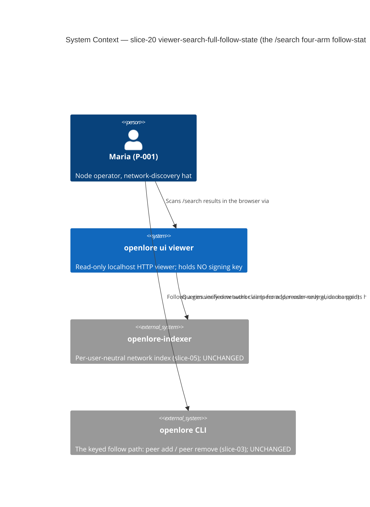
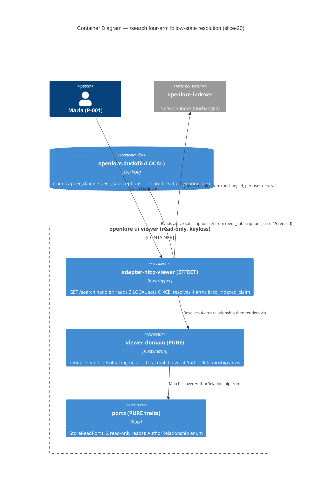

<!-- markdownlint-disable MD024 -->
# Feature Delta: viewer-search-full-follow-state

> Wave: **DISCUSS** (lean mode, Tier-1 density)
> Feature type: User-facing (a thin DELTA on the read-only `GET /search` view of `openlore ui`)
> Walking skeleton: No — brownfield DELTA (NO walking-skeleton Feature 0); the thinnest end-to-end slice is US-FS-002 itself
> UX depth: Lightweight (server-rendered maud HTML + htmx progressive enhancement — inherits slices 06/07/08/16)
> JTBD: YES — the one user-visible story traces to **J-005c** (`docs/product/jobs.yaml`, sub-job of J-005); no new job created
> Brownfield DELTA on: `viewer-search-follow-state` (slice-16 — the `/search` follow-state resolution this slice COMPLETES; the source of the binary `SubscribedPeer`/`NetworkUnfollowed` resolution + `to_indexed_claim`'s active-set membership + `render_following_indicator` + `SEARCH_FOLLOWING_INDICATOR` + the `read_local_active_set` + the `OPENLORE_VIEWER_FAIL_ACTIVE_SET_READ` fault seam, ADR-053), `viewer-network-search` (slice-08 — the `GET /search` view, `render_follow_guidance` / `SEARCH_FOLLOW_GUIDANCE_PREFIX`), `viewer-peer-subscriptions` (slice-15 — `list_active_peer_subscriptions`, the active-only read; the soft-remove residue PS-4 nuance this slice surfaces), the LOCAL-graph relationship resolver (`crates/adapter-duckdb/src/graph_query.rs::attributed_claim_from` — the established four-arm `You`/`SubscribedPeer`/`UnsubscribedCache`/`NetworkUnfollowed` resolution this slice MIRRORS onto the network-search surface)
> Date: 2026-06-11 · Owner: Luna (nw-product-owner)
> Slice: slice-20

This file is the canonical DISCUSS-wave delta for `viewer-search-full-follow-state` (slice-20):
**completing the `/search` follow-state ADT to its full four-arm resolution.** slice-16 added
per-result follow-state on the read-only `GET /search` view but resolved it BINARY — an author
∈ the operator's LOCAL active subscriptions → `SubscribedPeer` (a "Following" indicator), else →
`NetworkUnfollowed` (the `openlore peer add` affordance). slice-16 EXPLICITLY DEFERRED the two
further arms of the existing `AuthorRelationship` enum (`crates/ports/src/federated_row.rs`
~line 67, ALREADY four-variant):

- **`You`** — the result is the operator's OWN claim (own DID). Neither "Following" nor "add"
  is meaningful (you cannot follow yourself). slice-16 resolved this to `NetworkUnfollowed`
  (re-offered a self-follow it would never run). slice-20 resolves it to a neutral
  self-attribution indicator.
- **`UnsubscribedCache`** — the result is a cached claim from a peer the operator has SINCE
  removed (`openlore peer remove`, no `--purge`): present in the LOCAL `peer_claims` cache but
  NOT in the active set (the slice-15 PS-4 retained-cache residue). slice-16 resolved this to
  `NetworkUnfollowed` (indistinguishable from a never-subscribed author). slice-20 resolves it
  to a neutral residue indicator.

The render `@match` in `viewer-domain` (~line 1924) ALREADY carries the two arms wired to render
NOTHING (`You | UnsubscribedCache => {}`); the LOCAL-graph resolver
(`adapter-duckdb::attributed_claim_from` ~line 186) ALREADY resolves all four arms for the
federated-read surfaces. slice-20 makes the `/search` EFFECT-shell resolution PRODUCE the two
deferred arms (against two NEW LOCAL presence reads) and gives each a neutral render-only
indicator. It is **render-only, read-only, LOCAL/offline, additive** (the slice-16
`SubscribedPeer`/`NetworkUnfollowed` rendering and the original search ranking/attribution stay
byte-stable). NO new route, NO new crate, NO new `AuthorRelationship` variant.

---

## SSOT reading confirmation (READING ENFORCEMENT)

- ✓ `CONTEXT.md` (project root) — the slice ledger; the slice-16 entry carries the deferral
  ("Binary resolution (You/UnsubscribedCache deferred)"); 19 slices shipped → this is slice-20
- ✓ `docs/evolution/viewer-search-follow-state-evolution.md` — the slice-16 archive: the
  `SubscribedPeer`/`NetworkUnfollowed` enum, `read_local_active_set`, `to_indexed_claim`,
  `bare_did` reconciliation, the `OPENLORE_VIEWER_FAIL_ACTIVE_SET_READ` `#[cfg(debug_assertions)]`
  fault seam + the xtask seam guard, and the You/UnsubscribedCache deferral rationale (DV-SF-3)
- ✓ `docs/feature/viewer-search-follow-state/feature-delta.md` + `discuss/user-stories.md` +
  `outcome-kpis.md` — the SF-1..SF-10 acceptance shape, the AuthorRelationship resolution design,
  the C-1..C-9 system constraints, and the lean DISCUSS structure mirrored here
- ✓ `docs/product/jobs.yaml` — J-005 family; sub-job **J-005c** "Turn a discovery into a follow"
  (`load_bearing: false`, ~line 516); slice-08 changelog (~line 651) — this slice traces to the
  EXISTING J-005c, no new job (the four-arm completion sharpens the discovery surface's accuracy)
- ✓ `docs/product/personas/senior-engineer-solo-builder.yaml` — P-001 ("Maria"), the
  network-discovery hat (slice-08); no new hat minted
- ✓ `docs/product/journeys/` — the search/discovery journey extended (no new journey file)
- ✓ `crates/ports/src/federated_row.rs` (`AuthorRelationship { You | SubscribedPeer |
  UnsubscribedCache | NetworkUnfollowed }` ~line 67 — ALREADY four-variant; `UnsubscribedCache`
  doc ~line 53 confirms the soft-remove residue semantics)
- ✓ `crates/adapter-http-viewer/src/lib.rs` (`resolve_search_state` ~line 1095, `read_local_active_set`
  ~line 1247, `to_indexed_claim` ~line 1305 — the binary resolution this slice extends to four arms;
  the slice-16 fault seam ~line 1268)
- ✓ `crates/viewer-domain/src/lib.rs` (`render_search_results_fragment` `@match row.relationship`
  ~line 1924 — `SubscribedPeer → render_following_indicator()`, `NetworkUnfollowed →
  render_follow_guidance(...)`, `You | UnsubscribedCache => {}` (the empty arms THIS slice fills);
  `SEARCH_FOLLOWING_INDICATOR` ~line 1684; `render_following_indicator` ~line 1957; `bare_did` SSOT)
- ✓ `crates/adapter-duckdb/src/graph_query.rs` (`attributed_claim_from` ~line 186 — the LOCAL-graph
  resolver ALREADY maps `'Own' → You`, active peer → `SubscribedPeer`, cached-but-inactive peer →
  `UnsubscribedCache`; the precedent this slice mirrors onto `/search`)
- ✓ `crates/ports/src/store_read.rs` — `StoreReadPort` has NO distinct-own-author-DIDs read and NO
  distinct-cached-peer-DIDs read today; slice-20 adds these two LOCAL presence reads (US-FS-001)
- ⊘ `docs/feature/viewer-search-full-follow-state/diverge/` (no DIVERGE wave — consistent with all
  prior slices; J-005c validated; non-blocking risk R-FS-1)

No DISCUSS decision below contradicts prior-wave evidence: the four-arm `AuthorRelationship` enum
already exists; the LOCAL-graph resolver already resolves all four arms; the render `@match`
already has the two empty arms; the viewer is read-only (slices 06–19); the follow path stays the
slice-03 CLI.

---

## Wave: DISCUSS / [REF] Persona ID

**P-001 Senior Engineer Solo Builder** ("Maria", the node operator) — the SAME persona as
slices 06–19 (`docs/product/personas/senior-engineer-solo-builder.yaml`), wearing the
**network-discovery hat** minted in slice-08 and sharpened in slice-16. slice-20 does NOT
introduce a new scanning behavior; it COMPLETES the follow affordance's accuracy on the EXISTING
`/search` discovery surface (now recognizing the operator's own claims and her soft-removed
peers' cached claims, not just followed vs unfollowed). No new persona hat is minted (WD-FS-9).

> P-002 (researcher/tech-lead) is the slice-05 CLI discovery persona; the BROWSER viewer is
> P-001's surface (slices 06–19). The follow verb is the slice-03/05 `openlore peer add` CLI;
> `/search` is P-001's read-only browser surface over the network index + her LOCAL follow graph.

---

## Wave: DISCUSS / [REF] JTBD One-Liner

> **J-005c**: *When a network search surfaces a claim by a developer I do not yet follow, I
> want a one-step path to subscribe to them via the slice-03 federation flow, so discovery
> becomes the front-door that grows my trusted local graph rather than a dead-end read.*
> (`docs/product/jobs.yaml`, sub-job of **J-005**, opportunity score 15.)

slice-16 made the discovery→follow front-door ACCURATE for the binary case (followed → "Following",
unfollowed → `peer add`). But it still misclassified TWO local situations as `NetworkUnfollowed`:

- a result that is the operator's OWN claim — re-offered a follow she would never run (a self-follow);
- a result from a peer she SOFT-REMOVED — re-offered a follow as if the cached claim were a
  fresh network discovery, erasing the residue-after-removal nuance.

slice-20 completes the front-door: a result is now classified as one of FOUR honest states — her
own claim (self), a peer she follows (Following), a peer she once followed and cached (residue),
or a genuinely-new author (the `peer add` affordance). The `peer add` affordance is shown ONLY
where it is actionable (a genuinely-new author), so discovery stays a clean, uncluttered front-door.

### JTBD job story (four forces)

> **Job story** (J-005c, four-arm completion facet): *When I scan a `/search` result and the
> author is actually ME (my own published claim) or a developer I followed once and then removed,
> I want the surface to say so honestly — not re-offer me a follow I can't act on — so the only
> `peer add` I ever see is one I could meaningfully run.*

| Force | This slice |
|---|---|
| **Push** | On `/search` today, my own claims and my soft-removed peers' cached claims are BOTH shown as `NetworkUnfollowed` — re-offering a `peer add` I would never run (I can't follow myself; I deliberately removed that peer). The follow affordance is noisy on situations it can't apply to. |
| **Pull** | A `/search` row that reads honestly: "this is your own claim" / "this is a peer you removed (cached)" / "you follow this author" / "follow this new author" — four honest states, the add affordance only where it's actionable. |
| **Anxiety** | "If the viewer starts labeling my own claims and my removed peers, does it gain a write/identity capability or start judging me?" Mitigation: both new indicators are NEUTRAL render-only TEXT resolved from LOCAL reads; the viewer holds no key, executes nothing, and the labels are descriptive, never pejorative. |
| **Habit** | I already read `/search` rows the slice-16 way (Following vs add). The two new states must read as the SAME kind of neutral per-row label, in the same place, never re-ordering or re-ranking the results I'm scanning. |

> Single job (J-005c). No opportunity-scoring table — one job in scope (the skill calls for scores
> only when multiple jobs compete).

### JTBD scope / contradiction gate

| Gate check | Verdict | Evidence |
|---|---|---|
| Single job? | PASS | The one user-visible story (US-FS-002) → J-005c. No story straddles two primary jobs. |
| No contradiction with sibling sub-jobs? | PASS | J-005a (search by dimension) untouched — grouping/ranking unchanged. J-005b (verified-before-index) untouched — the `[verified]` marker preserved. J-003a (anti-merging) HONORED — the two new arms are per-row enrichments; no merge/re-rank. |
| No contradiction with cardinal invariants? | PASS | Read-only / no-key (KPI-VIEW-2) HONORED — both new indicators render-only TEXT; no control; no key. Index per-user-neutral (slice-05/08) HONORED — `You`/`UnsubscribedCache` resolved from LOCAL reads, never told to the index. Local-first (KPI-5) HONORED — two LOCAL reads. |
| Follow NOT re-introduced as an executable control? | PASS | slice-20 adds ZERO follow/unfollow controls. The two new states render neutral TEXT labels; the viewer holds no key. |
| Additive / no-regression honored? | PASS (the defining AC) | The slice-16 `SubscribedPeer` "Following" + `NetworkUnfollowed` `peer add` rendering is byte-stable; the original ranking/attribution unchanged. An explicit AC + a no-regression domain example pin it. |
| Job already fully served? | NO (gap is real) | slice-16 resolves ONLY `SubscribedPeer`/`NetworkUnfollowed`; the operator's own claims and her soft-removed peers' cached claims BOTH misclassify as `NetworkUnfollowed`. The enum, the LOCAL-graph resolver precedent, and the render's empty arms all exist — the `/search` resolution simply does not yet produce them. |

The gate PASSES. The slice is a coherent, single-job, non-contradicting thin DELTA completing the
existing `/search` follow-state resolution.

---

## Wave: DISCUSS / [REF] Cardinal invariants carried forward (commitments)

RESTATED as binding commitments (inherited, not re-litigated). Full text in `discuss/user-stories.md`
§"System Constraints" (C-1..C-9). Summary:

| ID | Commitment | Source |
|---|---|---|
| C-1 (CARDINAL) | Read-only / no key: ALL four follow-state affordances (the slice-16 "Following" + `peer add`, the slice-20 self + residue indicators) stay render-only TEXT; no follow/unfollow control; no key. The follow stays the slice-03 CLI. | KPI-VIEW-2, slice-06–19, slice-08 WD-NS-3 |
| C-2 | Accuracy / completeness (load-bearing): a result author is resolved to exactly one of four honest states — `You` (own claim), `SubscribedPeer` (followed), `UnsubscribedCache` (soft-removed, cached), `NetworkUnfollowed` (genuinely new). The `peer add` affordance appears ONLY for `NetworkUnfollowed`. | J-005c, WD-FS-1/2 |
| C-3 | LOCAL / offline resolution; the index stays per-user-neutral. The two NEW presence reads (own-DID, cached-peer) are LOCAL DuckDB. | KPI-5, slice-05/08 boundary, slice-15 WD-PS-4 |
| C-4 | Batch reads per render (no N+1): the active set (slice-16, REUSED), the own-author-DID set (NEW), and the cached-peer-DID set (NEW) are each read AT MOST ONCE per `/search` render into in-memory sets; each result author resolved in memory. | WD-FS-3, slice-16 C-4, slice-15 I-PS-3/4 |
| C-5 | Attribution + ranking UNCHANGED (the two new arms are per-row enrichments). | J-003a, slice-08 I-NS-3, slice-16 C-5 |
| C-6 | Resolution precedence on `/search`: `You` > `SubscribedPeer` > `UnsubscribedCache` > `NetworkUnfollowed`. A peer who is BOTH active and cached resolves `SubscribedPeer` (active wins); an own claim resolves `You` even if (impossibly) also self-followed. | WD-FS-2 |
| C-7 | Additive / no-regression (CARDINAL): the slice-16 `SubscribedPeer` "Following" + `NetworkUnfollowed` `peer add` rendering is byte-stable; the original search ranking/attribution/`[verified]`/confidence unchanged. The two new arms only ADD. | slice-16 I-SF-4, slice-12/14 byte-identity discipline |
| C-8 | Graceful degradation: a failed own-DID or cached-peer presence read degrades that arm to its slice-16 fallback (`You`→`NetworkUnfollowed`, `UnsubscribedCache`→`NetworkUnfollowed`), independently per read; the active-set read keeps its slice-16 degrade. No crash/5xx/blank/leak. | WD-FS-4, slice-16 C-7 |
| C-9 | Neutral framing: the self + residue indicators are NEUTRAL descriptive TEXT, never pejorative ("removed", "stale", "yours" framed neutrally — DESIGN owns exact copy; no "ex-peer", "abandoned", "your own propaganda" etc.). | slice-11/12/14 anti-misread discipline |
| C-10 | Progressive enhancement + parity (same fragment both shapes). | slice-07/08/16 C-8 |
| C-11 | No new crates / route / variant / persisted type; loopback-only bind; workspace 21. | slice-06–19 |

---

## Wave: DISCUSS / [REF] Proposed change (no new route, no new variant)

- **Route**: `GET /search` — UNCHANGED (the slice-08/16 route). slice-20 adds no new route.
- **Reads**: REUSES the slice-16 active-set read (`list_active_peer_subscriptions`); ADDS two
  NEW read-only LOCAL presence reads on `StoreReadPort` (US-FS-001): (a) the operator's distinct
  OWN-claim author DIDs (from the `claims` table — for `You`), and (b) the distinct cached-peer
  author DIDs (from the `peer_claims` table, INCLUDING soft-removed peers — for `UnsubscribedCache`).
  Each is read AT MOST ONCE per render into an in-memory bare-DID set. DESIGN owns whether these
  are two new aggregate reads or one combined read; the PRODUCT contract is the batch-once AC.
- **Resolution (extended, in the EFFECT shell `adapter-http-viewer`)**: in `resolve_search_state`,
  after the indexer query + BEFORE `compose_results`, read the three LOCAL sets (active, own, cached)
  and resolve each result author by precedence (C-6): own → `You`; active → `SubscribedPeer`;
  cached-but-inactive → `UnsubscribedCache`; else → `NetworkUnfollowed`. This MIRRORS the
  established `adapter-duckdb::attributed_claim_from` LOCAL-graph resolver, adapted to the
  network-search corpus (which carries no `source_table`, so presence is resolved by DID-set
  membership rather than the `'Own'`/`'Peer'` column). Threaded into `to_indexed_claim` (which today
  resolves only the binary).
- **Render (two NEW arms, in the PURE `viewer-domain`)**: fill the existing empty
  `You | UnsubscribedCache => {}` arm of `render_search_results_fragment`'s `@match` (~line 1924)
  with `You → render_self_indicator()` and `UnsubscribedCache → render_cached_unsubscribed_indicator()`
  — neutral render-only TEXT siblings of `render_following_indicator`, each with its own SSOT
  constant (mirroring `SEARCH_FOLLOWING_INDICATOR`). The `SubscribedPeer`/`NetworkUnfollowed` arms
  are UNCHANGED (byte-stable, C-7).

> DESIGN owns: the two presence-read SQL shapes (two reads vs one), the in-memory set types, the
> two indicator copies + markup, and whether the render is a now-total `match` over all 4 variants.
> The PRODUCT contract is the AC in `discuss/user-stories.md`.

---

## Wave: DISCUSS / [REF] JTBD trace (every story, with boundaries)

| Story | Title | job_id | Boundary note |
|---|---|---|---|
| US-FS-001 | Resolve `You` + `UnsubscribedCache` on `/search` against LOCAL own-DID + cached-peer presence (two new batch reads; complete the four-arm resolution) | `infrastructure-only` | `infrastructure_rationale` below. Enables US-FS-002. READ-ONLY by construction. |
| US-FS-002 | On `/search`, the operator's own claim shows a neutral self indicator and a soft-removed peer's cached claim shows a neutral residue indicator | J-005c | The completeness fix to the slice-16 discovery→follow front-door. NOT the follow itself (slice-03 CLI). |

### Infrastructure rationale (US-FS-001)

US-FS-001 carries `job_id: infrastructure-only` with this rationale: it extends the slice-16
binary `/search` resolution to the full four-arm `AuthorRelationship` by adding two read-only LOCAL
presence reads (the operator's distinct own-claim author DIDs; the distinct cached-peer author DIDs
including soft-removed) and resolving each result author by precedence. It produces no NEW
user-visible output on its own — the two new indicators are rendered by US-FS-002 — so it enables a
user decision only THROUGH that story. The slice contains ONE non-infrastructure, user-visible story
(US-FS-002), so the slice has release value (Dimension-0 slice-level check passes). READ-ONLY: the
two new reads are read-only `StoreReadPort` methods (no mutation method on the port); the viewer
holds no key.

---

## Wave: DISCUSS / [REF] Scope assessment (Elephant Carpaccio gate)

Run BEFORE journey-visualization investment. As thin as slice-16: NO new route, NO new variant, NO
new crate. The one delta vs slice-16 is two NEW read-only LOCAL presence reads (slice-16 added none —
it reused the slice-15 read).

| Signal | Value | Oversized? |
|---|---|---|
| User stories | 2 (1 infra + 1 user-visible) | No (<10) |
| Bounded contexts / modules | 1 (the viewer `/search` surface) extending `adapter-http-viewer` (effect: thread two new sets into resolution) + `viewer-domain` (pure: fill the two empty render arms) + `ports`/`adapter-duckdb` (two new read-only presence reads). NO new crate. | No (single context) |
| Walking-skeleton integration points | 4: (1) READ the own-claim author-DID set (NEW), (2) READ the cached-peer author-DID set (NEW), (3) RESOLVE each author by 4-arm precedence in `to_indexed_claim`, (4) RENDER the two new arms in `render_search_results_fragment`. The active-set read (slice-16) is REUSED. | No (≤5) |
| Estimated effort | ~0.5–1 day (two presence reads + a precedence resolution + two render arms; everything else REUSED, including the empty render arms that already exist) | No (≤2 weeks) |
| Independent user outcomes | 1 (own claim shows self; soft-removed peer's cached claim shows residue; the `peer add` affordance only for genuinely-new authors) | No |

**## Scope Assessment: PASS — 2 stories (1 infra + 1 user-visible), 1 context, 4 integration points (2 new reads + 1 precedence resolution + 2 new render arms), estimated ~0.5–1 day. No new route, no new `AuthorRelationship` variant, no new crate; workspace stays 21.**

The thing that would make it oversized — a follow/unfollow control, an own-identity surface
beyond reading own-claim author DIDs, per-result queries (N+1), or resolving the arms on surfaces
beyond `/search` — is explicitly OUT of scope (WD-FS-1/5). The infra resolution (US-FS-001) and the
render (US-FS-002) are already separated, so no further split is needed.

---

## User Stories

See `discuss/user-stories.md` (combined file, one section per story; `## System Constraints` at top).

| ID | One-line | job_id |
|---|---|---|
| US-FS-001 | Resolve `You` + `UnsubscribedCache` on `/search` against LOCAL own-DID + cached-peer presence (two new read-only batch reads; 4-arm precedence; degrade each arm independently) | infrastructure-only |
| US-FS-002 | On `/search`, the operator's OWN claim shows a neutral self indicator (no add command); a SOFT-REMOVED peer's cached claim shows a neutral residue indicator (no add command); the slice-16 "Following"/`peer add` rendering is byte-stable | J-005c |

---

## Wave: DISCUSS / [REF] Resolution-precedence + degrade decision (WD-FS-2 / WD-FS-4)

**Precedence (WD-FS-2).** On `/search`, a result author resolves to the FIRST matching arm in:
`You` (bare DID ∈ own-claim author DIDs) > `SubscribedPeer` (∈ active set) > `UnsubscribedCache`
(∈ cached-peer DIDs AND ∉ active set) > `NetworkUnfollowed` (otherwise). Rationale: `You` is the
strongest fact (it is your own claim, full stop); a currently-active subscription outranks a stale
cache (you follow them NOW); cache-without-active is the residue state; everything else is genuinely
new. This mirrors the LOCAL-graph resolver's `'Own' → You` / active → `SubscribedPeer` /
cached-inactive → `UnsubscribedCache` precedent, adapted to the index corpus (no `source_table`).

**Independent degrade (WD-FS-4).** The three LOCAL reads degrade INDEPENDENTLY (mirroring slice-17's
per-count `.ok()` discipline): a failed own-DID read → no `You` arm (those authors fall through to
the next precedence step); a failed cached-peer read → no `UnsubscribedCache` arm; a failed active-set
read → the slice-16 degrade (all `NetworkUnfollowed`). In every case the row still resolves to a
valid arm and renders; no crash/5xx/blank/leak. The worst case (all three reads fail) is exactly the
slice-08 status quo (all `NetworkUnfollowed`).

---

## Wave: DISCUSS / [REF] Outcome KPIs

slice-20 mints **NO new KPI ID**. Like slice-08–19 it REALIZES inherited KPIs on a new facet (the
four-arm `/search` follow-state completeness). Full detail in `discuss/outcome-kpis.md`. Relevant
inherited KPIs:

- **KPI-AV-4** (discovery→federation funnel — the J-005c north-star): slice-20 STRENGTHENS its
  accuracy further — the `peer add` affordance is now shown ONLY for genuinely-new authors (0%
  re-offered to the operator's own claims OR her soft-removed peers' cached claims, on top of
  slice-16's 0% re-offered to followed peers).
- **KPI-VIEW-2** (read-only, guardrail): MET — both new indicators render-only TEXT, no key.
- **KPI-AV-2 / KPI-FED-1/2** (anti-merging, guardrails): MET — the two new arms are per-row
  enrichments; grouping + order unchanged.
- **KPI-5 / index per-user-neutral** (local-first / index neutrality, guardrails): MET — the two
  new presence reads are LOCAL; the index query is unchanged + per-user-neutral.
- **KPI-HX-G1/G2/G3** (no-JS / offline / no-CDN, guardrails): MET — LOCAL resolution; full page
  without HX-Request; same fragment both shapes; vendored htmx.
- **No-regression (slice-16 I-SF-4 facet, guardrail)**: the slice-16 `SubscribedPeer`/`NetworkUnfollowed`
  rendering is byte-stable.

> Detail rationale in `discuss/outcome-kpis.md`. Cross-feature SSOT: `docs/product/kpi-contracts.yaml`.

---

## Wave: DISCUSS / [REF] Walking-skeleton (WS) strategy

**Brownfield DELTA — NO walking-skeleton Feature 0.** The `openlore ui` viewer, the `/search` view +
`to_indexed_claim` + `render_search_results_fragment` (slice-08/16), the four-arm `AuthorRelationship`
enum (slice-03/05), the active-subscription read (slice-15), and the two empty render arms (slice-16)
all already exist. The thinnest end-to-end slice IS US-FS-002 (the two new indicators rendered from
the four-arm resolution), backed by US-FS-001 (the two presence reads + the precedence resolution).
Delivery sequence: US-FS-001 → US-FS-002. Each is demonstrable in a single session against the real
`openlore ui` (seed an own claim + a soft-removed peer's cached claim, search, observe the two new
neutral indicators).

---

## Wave: DISCUSS / [REF] Shared artifacts + journey

- Requirements (functional + NFR + business rules): inlined in this file + `discuss/user-stories.md`
- User stories (combined, `## System Constraints` at top): `discuss/user-stories.md`
- Outcome KPIs: `discuss/outcome-kpis.md`
- Definition of Ready: `discuss/dor-checklist.md`
- Story map: `discuss/story-map.md`
- Slice brief: `slices/slice-20-brief.md`
- Wave decisions (WD-FS-*): the `## Wave: DISCUSS / [REF] Wave decisions` section below

> Lean mode: the standalone journey-visual + journey-yaml + shared-artifacts-registry are NOT
> produced for this thin DELTA (mirroring the slice-08/15/16 lean set). The journey is the slice-08/16
> `discover-the-network-from-the-browser` arc (the per-row follow-state on `/search`), grounded
> verbatim. Shared artifacts (all already tracked across slices 08/15/16, single source of truth):
> `author_did` ↔ `peer_subscriptions.peer_did` (active set), ↔ `claims.author_did` (own), ↔
> `peer_claims.author_did` (cache), all matched via the `bare_did` SSOT.

---

## Wave: DISCUSS / [REF] Wave decisions (WD-FS-*)

| ID | Decision | Rationale |
|---|---|---|
| WD-FS-1 | Read-only / no key (CARDINAL): the two new indicators are render-only TEXT; no follow/unfollow control; no key. | The viewer is read-only across slices 06–19; completing the follow-state must not introduce a control. |
| WD-FS-2 | Four-arm resolution with precedence `You` > `SubscribedPeer` > `UnsubscribedCache` > `NetworkUnfollowed`. | Mirrors the established LOCAL-graph resolver; `You` is the strongest fact, active outranks stale cache, cache-without-active is residue. |
| WD-FS-3 | Three LOCAL sets (active REUSED, own NEW, cached NEW), each read AT MOST ONCE per render into in-memory sets; resolve in memory. | No N+1; mirrors slice-16 C-4 batch-once discipline. |
| WD-FS-4 | Each LOCAL read degrades INDEPENDENTLY to its slice-16 fallback; worst case = the slice-08 status quo. | Mirrors slice-17 per-count `.ok()` independence; never crash/5xx/blank/leak. |
| WD-FS-5 | Resolve the two arms ONLY on `/search` (the LOCAL graph already resolves them on `/project`, `/philosophy`, etc.). | Scope discipline; the network-search surface is the only one missing them. |
| WD-FS-6 | Two NEW read-only `StoreReadPort` presence reads (own-author DIDs; cached-peer author DIDs incl. soft-removed). | The port has neither today; `You`/`UnsubscribedCache` on the network corpus need LOCAL presence (no `source_table` on an index row). |
| WD-FS-7 | Additive / no-regression (CARDINAL): the slice-16 `SubscribedPeer`/`NetworkUnfollowed` rendering byte-stable; ranking/attribution unchanged. | The two new arms only ADD; the original search behavior is the trust baseline. |
| WD-FS-8 | Neutral framing: self + residue indicators are neutral descriptive TEXT, never pejorative. | slice-11/12/14 anti-misread discipline; the operator must not read a judgement. |
| WD-FS-9 | No new persona hat; no new job; no new KPI ID; no new crate/route/variant. | A completeness DELTA on the slice-16 network-discovery facet. |

---

## Wave: DISCUSS / [REF] Definition of Ready

See `discuss/dor-checklist.md`. Verdict: **PASS (9/9)** for both stories.

---

## Wave: DISCUSS / [REF] Risks

| Risk | Prob | Impact | Mitigation |
|---|---|---|---|
| R-FS-1: No DIVERGE wave | Low | Low | J-005c validated in `docs/product/jobs.yaml`; the journey is the slice-08/16 `/search` discovery arc; the four-arm enum + the LOCAL-graph resolver precedent + the empty render arms all already exist. Non-blocking. |
| R-FS-2: Resolution becomes N+1 (a presence query per result author) | Medium | High | C-4 + WD-FS-3 + US-FS-001 AC make the three batch-once reads a HARD commitment (resolve in memory). A behavioral test asserts each read fires AT MOST once per render, invariant to result count. |
| R-FS-3: A slice-16 row regresses (Following/peer-add rendering or ranking changes) | Medium | High | C-7 + WD-FS-7 + US-FS-002 AC: a no-regression behavioral test pins the `SubscribedPeer`/`NetworkUnfollowed` rendering byte-stable and the grouping/order unchanged vs slice-16. |
| R-FS-4: An own claim still re-offered `peer add` (the `You` gap unfixed) | Medium | High | C-2 + US-FS-002 AC: a seeded own claim → that row shows the self indicator + no add command; a behavioral test pins it. |
| R-FS-5: A soft-removed peer's cached claim misclassifies (shown "Following" or `peer add` instead of residue) | Medium | High | C-6 precedence + US-FS-001/002 AC: a soft-removed peer (cached, NOT active) → `UnsubscribedCache` → the residue indicator; a behavioral test seeds `peer add` then `peer remove` (no `--purge`) and pins the residue arm. |
| R-FS-6: `#fragment` mismatch misclassifies an own / cached author | Medium | Medium | C-3 + US-FS-001 AC: strip the fragment via the `bare_did` SSOT on all sides before membership (the slice-16 reconciliation, extended to the own + cached sets). A fragmented-DID domain example pins it. |
| R-FS-7: A failed own / cached read crashes or blanks the results | Low | High | C-8 + WD-FS-4 + US-FS-001 AC: each read degrades independently to its slice-16 fallback; a fault-injection test (mirroring the slice-16 seam) pins the degrade. |
| R-FS-8: The two new indicators read as pejorative | Low | Medium | C-9 + WD-FS-8: neutral copy (DESIGN owns the exact wording); a behavioral gold asserts a blocklist (no "ex-peer"/"abandoned"/"stale"/judgement language). |

---

## Wave: DISCUSS / [REF] Out of scope (explicit)

slice-20 does NOT, under any circumstance: add a follow/unfollow control to the viewer; hold a
signing key; add an own-identity surface beyond reading the operator's own-claim author DIDs;
resolve `You`/`UnsubscribedCache` on any surface other than `/search` (the LOCAL graph already does);
re-group / re-rank / merge results; regress the slice-16 `SubscribedPeer`/`NetworkUnfollowed`
rendering; add a new route, `AuthorRelationship` variant, or crate (workspace stays 21); persist
anything; bind anything but 127.0.0.1; or issue one presence query per result author (N+1). Full
list in `discuss/user-stories.md` §"Out of scope".

---

## Wave: DESIGN / [REF] Design decisions (D-numbered, with verdicts)

> Wave: **DESIGN** (lean mode, Tier-1 density) · Owner: Morgan (nw-solution-architect) ·
> 2026-06-11 · interaction_mode: propose · design_scope: application/components.
> Formalizes the three DISCUSS-flagged questions; one ADR (**ADR-057**). NO new
> system/domain surface; NO new crate (workspace stays 21); additive, render-only,
> read-only, LOCAL/offline.

| ID | Decision | Verdict |
|---|---|---|
| **D-1** (the two new reads — Q1) | Add **two SEPARATE single-table read-only `StoreReadPort` reads**: `distinct_own_author_dids` (`SELECT DISTINCT author_did FROM claims` → `You`) and `distinct_cached_peer_author_dids` (`SELECT DISTINCT author_did FROM peer_claims`, **NO `removed_at` filter** — the residue cache is the point → `UnsubscribedCache`, gated by ∉ active in resolution). Each returns the full distinct-DID `HashSet<String>` read **ONCE per render**; `Ok(HashSet::new())` for an empty store (0 ≠ failed). NO bound params (whole-table distinct; no caller input → injection N/A); `bare_did` normalization is in-memory at the comparison site, never in SQL. | **TWO reads, not one** (independent degrade + simplest anti-merging proof). Combined read REJECTED (A1). |
| **D-2** (four-arm precedence — Q2) | A **total pure fn** `(author_did, &own, &active, &cached) → AuthorRelationship`: `bare ∈ own → You` > `∈ active → SubscribedPeer` > `∈ cached → UnsubscribedCache` > else `NetworkUnfollowed`. Threaded into `to_indexed_claim` (which stops resolving only the binary). Exhaustive (`if/else if` chain, final `else` total) + deterministic (pure fn of three set memberships; no I/O/clock). Mirrors `attributed_claim_from`, adapted to the index corpus (no `source_table` → DID-set membership). | **LOCKED**. `bare_did` applied result-side; LOCAL sets bare by construction (one SSOT, slice-16 extended). |
| **D-3** (render shape — Q3) | Fill the empty `You \| UnsubscribedCache => {}` arm (`viewer-domain` ~line 1924) with `You → render_self_indicator()` + `UnsubscribedCache → render_cached_unsubscribed_indicator()` — render-only `
` siblings of `render_following_indicator`, each behind its own SSOT constant: **`SEARCH_SELF_INDICATOR = "Your own claim"`**, **`SEARCH_REMOVED_CACHED_INDICATOR = "A peer you removed (cached)"`** (neutral, non-pejorative, blocklist-safe — DESIGN names; copy may be tuned at DELIVER within the neutral gate). Both carry the slice-16 `"Relationship: "` prefix; NEITHER renders a `peer add` affordance (suppressed like `SubscribedPeer`). The render becomes a **TOTAL `match`** over four variants. | **LOCKED**. `SubscribedPeer`/`NetworkUnfollowed` arms REUSED VERBATIM — **byte-stable** (C-7). |
| **D-4** (graceful degrade + fault seam) | Each of the three reads degrades **independently** via `unwrap_or_default()` → empty set for the failed read only (slice-17 per-count `.ok()` independence). Failed own → no `You`; failed cached → no `UnsubscribedCache`; failed active → slice-16 all-`NetworkUnfollowed`. Worst case (all three fail) = slice-08 status quo. **NO new `#[cfg(debug_assertions)]` fault seam token** — the slice-16 `OPENLORE_VIEWER_FAIL_ACTIVE_SET_READ` already proves the degrade BRANCH SHAPE the two new reads reuse identically; a per-read fault is injectable via a fake `StoreReadPort` (no compiled-in env seam). `xtask` `VIEWER_FAIL_SEAM_TOKENS` stays UNCHANGED. | **NO new seam (default).** Conditional escalation: IF the harness cannot inject a per-read fault via a fake port, DISTILL/DELIVER MAY add a distinct cfg-gated token per read + extend `VIEWER_FAIL_SEAM_TOKENS`. |

### Anti-merging check-arch proof (Q1, BY CONSTRUCTION)

The `no_cross_table_join_elides_author` rule (`xtask::check_arch::classify_sql_literal`) fires
ONLY when a SINGLE SQL literal mentions BOTH the standalone `claims` table AND `peer_claims`
(word-boundary; `peer_claims` does NOT count as a `claims` mention) WITHOUT projecting
`author_did`. The two new reads are each **single-table** — one over `claims`, one over
`peer_claims` — so neither is a cross-store literal; the rule's `is_cross_store` precondition is
FALSE for both, so neither can trip it. Each ALSO projects `author_did` (it is the SELECTed
column). The reads name the specific tables explicitly (never a bare cross-table join eliding
the author). **Verdict: passes `check-arch` by construction** (the strongest possible proof —
the rule's precondition is structurally unreachable for these literals). Confirmed against the
live rule body and the established single-table presence reads (`count_countered_own_claims`
over `claims`, `count_countered_peer_claims` over `peer_claims`, both GREEN).

## Wave: DESIGN / [REF] Component decomposition

| Component | Path | Change type |
|---|---|---|
| `StoreReadPort` (+ 2 read-only methods) | `crates/ports/src/store_read.rs` | **EXTEND** |
| `adapter-duckdb` store-read impl (+ 2 single-table `SELECT DISTINCT` reads) | `crates/adapter-duckdb/src/store_read.rs` | **EXTEND** |
| `resolve_search_state` (read 2 new sets once; thread into resolution) | `crates/adapter-http-viewer/src/lib.rs` (~1095) | **EXTEND** |
| `to_indexed_claim` (binary → four-arm precedence over 3 sets) | `crates/adapter-http-viewer/src/lib.rs` (~1305) | **EXTEND** |
| 2 new `read_local_*` helpers (own / cached → `HashSet`, `unwrap_or_default` degrade) | `crates/adapter-http-viewer/src/lib.rs` | **CREATE NEW** (siblings of `read_local_active_set`) |
| render `@match` (fill the 2 empty arms → total match) | `crates/viewer-domain/src/lib.rs` (~1924) | **EXTEND** |
| `render_self_indicator` / `render_cached_unsubscribed_indicator` (+ 2 SSOT consts) | `crates/viewer-domain/src/lib.rs` (~1957) | **CREATE NEW** (siblings of `render_following_indicator`) |
| `xtask check-arch` (NO change — single-table reads pass by construction; no new seam token) | `crates/xtask/src/check_arch.rs` | **UNCHANGED** |

> The two `CREATE NEW` shell helpers and the two `CREATE NEW` pure render fns are **intra-crate
> siblings of existing patterns** (not new crates, not new ports, not new routes) — the
> smallest additive unit. Everything else is EXTEND.

## Wave: DESIGN / [REF] Driving ports

| Driving port | Route | Change |
|---|---|---|
| `GET /search` (the slice-08/16 route, the only `/search` driving surface) | `adapter-http-viewer` | UNCHANGED route; the handler now reads 2 more LOCAL sets + resolves 4 arms. NO new route, NO new query param, NO new method. |

The driving boundary is byte-stable: same route, same form, same query params. The acceptance
driving port stays the REAL `openlore ui` subprocess over HTTP (`ViewerServer`); the indexer is
the only mocked boundary (REAL `openlore-indexer serve`); the own/cached/active sets are seeded
through the REAL CLI verbs (`claim add` for own; `peer add`/`peer pull`/`peer remove` for
cached + active).

## Wave: DESIGN / [REF] Driven ports + adapters

| Driven port (method) | Adapter | SQL (single-table, read-only) | Degrade |
|---|---|---|---|
| `StoreReadPort::distinct_own_author_dids` (NEW) | `adapter-duckdb` | `SELECT DISTINCT author_did FROM claims` | failed read → empty own set → no `You` arm (fall-through) |
| `StoreReadPort::distinct_cached_peer_author_dids` (NEW) | `adapter-duckdb` | `SELECT DISTINCT author_did FROM peer_claims` (NO `removed_at` filter; that column lives in `peer_subscriptions`, not `peer_claims`) | failed read → empty cached set → no `UnsubscribedCache` arm (fall-through) |
| `StoreReadPort::list_active_peer_subscriptions` (slice-15, REUSED) | `adapter-duckdb` | unchanged (`peer_subscriptions LEFT JOIN peer_claims … WHERE removed_at IS NULL`) | slice-16 degrade (empty → all-`NetworkUnfollowed`) |
| `IndexQueryPort::search` (slice-05/08, REUSED) | `adapter-index-query` | unchanged network query — per-user-neutral | slice-08 `Unavailable` |

All driven reads are LOCAL DuckDB over the SAME shared connection (no new table, no new store,
no second handle). The index query is UNCHANGED and per-user-neutral (the index never learns
who you are or whom you removed). **No external integration is added** → no contract-test
annotation for this slice (the only external boundary, the indexer, is unchanged).

## Wave: DESIGN / [REF] Technology choices (pinned)

| Choice | Pin | Rationale | License |
|---|---|---|---|
| DuckDB (LOCAL store) | existing (ADR-001) | the two new reads ride the existing shared connection; no store swap | MIT |
| `maud` (pure render) | existing (ADR-029) | the two new indicators are `maud` `
` siblings | MIT |
| `std::collections::HashSet<String>` | std | the established membership shape (slice-12/16) | — |
| `duckdb::params_from_iter` | N/A for these reads | whole-table distinct, no bound input | — |

NO new crate, NO new production dependency, NO new transport. OSS-first preserved (all
existing, all permissive-licensed).

## Wave: DESIGN / [REF] Reuse Analysis (MANDATORY hard gate)

Every component overlapping this slice, classified EXTEND vs CREATE NEW (default EXTEND):

| Component | Overlaps | Verdict | Justification |
|---|---|---|---|
| `AuthorRelationship` enum | the four arms | **EXTEND (reuse, zero change)** | already four-variant; the two target arms exist — no new variant |
| render `@match` empty arms | `You \| UnsubscribedCache => {}` | **EXTEND** | the two empty arms already wired — fill them |
| `render_following_indicator` pattern | the neutral indicator shape | **EXTEND (as template)** → 2 siblings | `render_self_indicator` / `render_cached_unsubscribed_indicator` are siblings |
| `SEARCH_FOLLOWING_INDICATOR` SSOT-const pattern | one-place copy | **EXTEND (as template)** → 2 consts | `SEARCH_SELF_INDICATOR` / `SEARCH_REMOVED_CACHED_INDICATOR` |
| `read_local_active_set` helper | the read-once → `HashSet` + degrade shape | **EXTEND (as template)** → 2 siblings | `read_local_own_set` / `read_local_cached_set` |
| `to_indexed_claim` | binary resolution | **EXTEND** | binary → four-arm precedence (one more `else if` ×2) |
| `bare_did` SSOT (shell + pure) | fragment strip | **EXTEND (reuse, zero change)** | applied to the own + cached sets too |
| `StoreReadPort` | the read trait | **EXTEND** | +2 read-only methods (no mutation method) |
| `counter_presence_for` / `count_countered_*` single-table SQL pattern | the read-only DuckDB read shape | **EXTEND (as template)** → 2 reads | the SQL idiom (DISTINCT/IN-set, error mapping) is the proven template |
| slice-16 fault seam + `VIEWER_FAIL_SEAM_TOKENS` | the degrade test seam | **REUSE (zero change)** | the branch shape is identical; per-read fault via fake port (D-4) |
| `GET /search` route + form + `Shape` fork | the driving surface | **REUSE (zero change)** | no new route/param/shape |
| `compose_results` (anti-merging) | grouping/ranking | **REUSE (zero change)** | per-row enrichment only — no re-group/re-rank |

**Reuse verdict: 0 CREATE NEW crates/ports/routes; ALL surface-level work is EXTEND or REUSE.**
The only genuinely-new code units are **4 intra-crate sibling fns** (2 shell read helpers + 2
pure render fns) + **2 read-only trait methods** + **2 adapter impls** + **2 SSOT consts** —
each a sibling of an existing, proven pattern. This is a near-all-EXTEND additive slice exactly
as scoped.

## Wave: DESIGN / [REF] C4 — System Context (Level 1)

## Wave: DESIGN / [REF] C4 — Container (Level 2)

> Three driven reads to ONE `ContainerDb` are drawn as three labeled arrows to name the
> specific tables (anti-merging discipline: never a bare cross-table read eliding the author).
> No L3 component diagram — the slice is 4 sibling fns + 2 reads; the container view is the
> right granularity (L3 would not add clarity for a thin additive delta).

## Wave: DESIGN / [REF] Decisions table (summary)

| # | Decision | ADR |
|---|---|---|
| 1 | Two separate single-table read-only presence reads (own/`claims`, cached/`peer_claims`) | ADR-057 D1 |
| 2 | Total precedence resolution `You > SubscribedPeer > UnsubscribedCache > NetworkUnfollowed` as a pure fn over 3 sets | ADR-057 D2 |
| 3 | Two neutral render-only indicators + SSOT consts; total `match`; `peer add` suppressed for both | ADR-057 D3 |
| 4 | Independent per-read degrade; NO new fault seam token (slice-16 seam proves the branch shape) | ADR-057 D4 |
| — | Anti-merging passes by construction (single-table literals) | ADR-057 D1 / Enforcement |

## Wave: DESIGN / [REF] Quality validation

- **ISO 25010 — Functional suitability**: four-arm resolution total + deterministic (D-2);
  `peer add` shown only where actionable (accuracy fix).
- **Reliability (fault tolerance)**: independent per-read degrade; worst case = slice-08 status
  quo; no crash/5xx/leak (D-4).
- **Security / Confidentiality**: read-only / no key (CARDINAL) preserved — no mutation method
  added; `You` needs no identity surface (A3 rejected); index stays per-user-neutral (no LOCAL
  fact leaks to the index).
- **Maintainability / Testability**: pure resolution fn (no I/O) unit-testable; per-read fault
  injectable via fake `StoreReadPort`; render a total `match` (compiler exhaustiveness).
- **Performance**: +2 batch-once `SELECT DISTINCT` per render (indexed columns), invariant to
  result count (no N+1); negligible vs the network round-trip.
- **Dependency-inversion**: pure core (`viewer-domain`, `ports`) depends on nothing I/O; the
  effect shell wires the reads; dependencies point inward (ADR-007 paradigm honored).
- **C4 completeness**: L1 + L2 present (Mermaid), every arrow verb-labeled; L3 justifiably
  omitted.

## Wave: DESIGN / [REF] Open questions deferred to DISTILL/DELIVER

| # | Question | Owner |
|---|---|---|
| OQ-1 | Per-read fault injection: confirm the acceptance harness can inject a per-read `Err` via a fake `StoreReadPort` (the NO-new-seam default, D-4). IF NOT → add a distinct cfg-gated token per read + extend `VIEWER_FAIL_SEAM_TOKENS` (the conditional escalation). | DISTILL (Quinn) / DELIVER |
| OQ-2 | Exact neutral copy for the two indicators within the blocklist gate (DESIGN names `"Your own claim"` / `"A peer you removed (cached)"`; DELIVER may tune within the neutral, non-pejorative constraint). | DELIVER |
| OQ-3 | Whether `to_indexed_claim` takes 3 `&HashSet` params or a small resolution-context struct (field-level shaping; the PRODUCT/DESIGN contract is the total fn over the 3 sets, D-2). | DELIVER (crafter) |

## Wave: DESIGN / [REF] Wave-decisions summary (D-FS-*)

| ID | Decision | Cardinal? |
|---|---|---|
| D-FS-1 | TWO separate single-table read-only reads (own/`claims`, cached/`peer_claims`); combined read rejected (independent degrade + simplest anti-merging proof). | — |
| D-FS-2 | Total precedence pure fn `You > SubscribedPeer > UnsubscribedCache > NetworkUnfollowed` over 3 sets; exhaustive + deterministic. | C-6 |
| D-FS-3 | Two neutral render-only indicators (`SEARCH_SELF_INDICATOR` / `SEARCH_REMOVED_CACHED_INDICATOR`); total `match`; `peer add` suppressed for both; slice-16 arms byte-stable. | C-1 / C-7 / C-9 |
| D-FS-4 | Independent per-read degrade via `unwrap_or_default()`; NO new fault seam token (slice-16 seam proves the branch shape; per-read fault via fake port). | C-8 |
| D-FS-5 | Anti-merging passes BY CONSTRUCTION — each read is single-table (rule precondition structurally unreachable). | C-3 |
| D-FS-6 | Keyless `You` — resolved from own-claim DID-set membership, NOT a held identity surface (A3 rejected; the precedent slice's deferral blocker stays OUT). | C-1 (CARDINAL) |
| D-FS-7 | ZERO new crate/route/variant/port-trait; +2 read-only methods + 4 intra-crate sibling fns + 2 SSOT consts. Workspace stays 21. | C-11 |

## Changelog

- 2026-06-11 — Morgan (nw-solution-architect) — slice-20 DESIGN. Formalized the three
  DISCUSS-flagged questions into **ADR-057** (two single-table read-only presence reads +
  total four-arm precedence resolution + two neutral render-only indicators; no new fault seam
  token). Reuse verdict: near-all-EXTEND (0 new crate/route/variant; +2 read-only
  `StoreReadPort` methods, 4 intra-crate sibling fns, 2 SSOT consts, 2 adapter impls). SQL
  passes `no_cross_table_join_elides_author` BY CONSTRUCTION (each read single-table). C4 L1+L2
  produced (Mermaid). Brief.md `## Application Architecture` extended. Workspace stays 21.

- 2026-06-11 — Luna — slice-20 (`viewer-search-full-follow-state`) DISCUSS. Traces to J-005c (turn a
  discovery into a follow). COMPLETES the slice-16 `/search` follow-state ADT to its full four-arm
  resolution by RESOLVING the two deferred arms — `You` (the operator's OWN claim → a neutral self
  indicator) and `UnsubscribedCache` (a soft-removed peer's cached claim → a neutral residue
  indicator). 2 stories (1 infra + 1 user-visible). EXTENDS the existing read-only `GET /search` view
  (NO new route). REUSES the slice-16 binary resolution seam + the existing four-variant
  `AuthorRelationship` enum (NO new variant) + the slice-16 `render_following_indicator` pattern + the
  render `@match`'s two ALREADY-EMPTY `You | UnsubscribedCache` arms. ADDS two read-only LOCAL
  presence reads (own-claim author DIDs; cached-peer author DIDs incl. soft-removed) and a four-arm
  precedence resolution mirroring the LOCAL-graph resolver. CARDINAL decisions: read-only / no-key
  (WD-FS-1); four-arm completeness (WD-FS-2); LOCAL/offline resolution (WD-FS-3); independent
  per-read graceful degrade (WD-FS-4); additive / no-regression (WD-FS-7); neutral framing (WD-FS-8).
  NO new crate (workspace stays 21), no new KPI ID, no new persona hat. Scope PASS (~0.5–1 day). DoR
  PASS (9/9).
